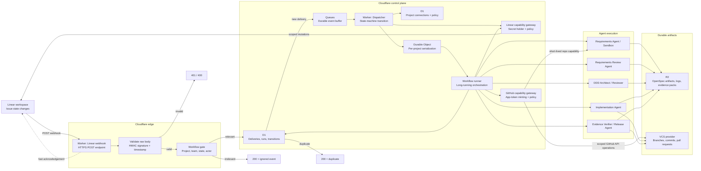

# Cloudflare Architecture: Linear-Driven AI Delivery Workflow

This is the initial serverless boundary for the workflow in `1786013157284.jpeg`.
The webhook acknowledges Linear quickly; durable processing happens asynchronously.



## Initial responsibility of each component

| Component | Responsibility | First version |
|---|---|---|
| Worker webhook | Authenticate and classify Linear events | Required |
| Queues | Decouple Linear delivery from agent execution | Required |
| D1 | Idempotency, project mapping, workflow state, audit trail | Required |
| Dispatcher Worker | Convert an issue transition into a workflow command | Required |
| Linear capability gateway | Hold Linear credentials and execute allowlisted provider mutations | Target architecture; current Queue consumer is the stopgap |
| GitHub capability gateway | Mint scoped GitHub App installation tokens and mediate GitHub operations | Target architecture; direct sandbox token is the stopgap |
| Workflows | Coordinate multi-step agent work and approvals | Later in the first slice |
| Durable Objects | Serialize concurrent events for one project or issue | Add when concurrency matters |
| R2 | Store OpenSpec and evidence artifacts | Required once agents produce files |

## First slice

Start with one connected Linear project and one transition, for example:

```text
Linear state change
  -> verify and deduplicate
  -> enqueue event
  -> dispatcher loads project policy
  -> create a workflow run
  -> invoke the Requirements Agent
  -> write proposal.md / requirements.md to R2
  -> post a Linear comment and wait for the next human decision
```

The webhook should never decide that an issue is ready for implementation by
itself. It should emit a normalized event; the dispatcher and workflow state
machine should make that decision using the configured project policy.

## Credential architecture and current stopgap

The target design keeps Linear and GitHub root credentials in separate control-plane capability
gateways. Gateways enforce project/repository scope, allowlisted operations, idempotency, and run
audit correlation.

For now, provide a Worker or sandbox the provider credential it genuinely needs through the
platform secret store or short-lived runtime injection. Keep it least-privileged, never commit or
log it, and remove it after the run where possible. The current Queue consumer directly holds the
Linear API secret because it performs the approval-state mutation; this is temporary until the
Linear gateway exists.

For GitHub sandbox execution, prefer a short-lived GitHub App installation token restricted to the
target repository and required permissions. It may be injected when direct `git push` or PR work
requires it. Do not provide the GitHub App private key or a broad long-lived PAT to the sandbox.
GitHub webhook events should eventually be consumed by the control plane for review/comment
reconciliation.
