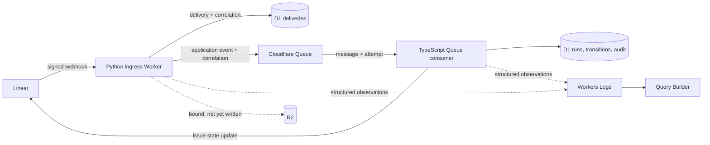

# Current Architecture

This document describes the architecture currently implemented by `deos`. It is
a living synthesis of the specifications under `openspec/specs/` and should be
updated whenever an archived OpenSpec change alters the implemented system.
The specifications remain the normative source for individual requirements;
this document explains how those requirements fit together as a system.

Future components belong here only after their specifications are implemented.
The target ideas in `cloudflare-linear-workflow-architecture.md` are therefore
not part of the current architecture unless they are described below.

## Context

The system receives real Linear webhooks through a Python Cloudflare Worker and
translates relevant deliveries into provider-independent application events. A
separate TypeScript Queue-consumer Worker processes those events asynchronously
through Cloudflare Queues and persists workflow state in D1. The first workflow
pauses for an explicit human decision in Linear.

Both Workers emit a shared, structured telemetry envelope to Cloudflare Workers
Logs. A deterministic workflow correlation identifier connects ingress, Queue
attempts, D1 transitions, and outbound Linear interactions so an operator can
query the lifecycle of one workflow across service boundaries.

R2 is bound and an artifact-storage interface exists, but the current system
does not write production artifact provenance or evidence packs.

## Design intent

The architecture keeps authenticated ingress and domain logic small and
Python-first, with durable dispatch isolated behind a provider-supported Queue
consumer. Provider-specific payloads are translated at the boundary, durable
state is authoritative, and asynchronous behavior is observable.

Deterministic tests provide fast feedback, while deployed Cloudflare resources
and a test Linear project provide provider-originated integration proof.

## Decisions

- **Ingress first:** authenticate and deduplicate the raw Linear delivery, then
  pass it through an anti-corruption layer that maps provider fields into the
  application event model.
- **Asynchronous boundary:** accepted events move through Cloudflare Queues; the
  HTTP handler only validates, records, publishes, and acknowledges a delivery.
- **Workflow definition:** the first transition map is `RECEIVED -> QUEUED ->
  REQUIREMENTS_IN_PROGRESS -> AWAITING_HUMAN_APPROVAL`, with explicit `APPROVED`
  and `REJECTED` outcomes. Project policy selects which Linear transition starts
  the flow.
- **Human approval:** the workflow moves the issue into the configured Linear
  board column `Human Review` and waits. A configured transition out of that
  column resumes the run; no Worker infers approval from issue text.
- **Cloudflare persistence:** D1 stores deliveries, project policy, workflow
  runs, transitions, and audit records. Queue provides the durable handoff.
- **Stable workflow identity:** the deterministic identifier
  `workflow:{project_id}:{issue_id}` is both the workflow run identifier and its
  cross-service correlation identifier. Retries and later provider deliveries
  retain that identity.
- **Structured observability:** both Workers emit the same bounded,
  OpenTelemetry-compatible JSON envelope to Workers Logs. Operators query it in
  Cloudflare Query Builder by correlation identifier.
- **Data minimization:** telemetry uses an allowlist of service-owned fields,
  Linear delivery/issue/project identifiers, and closed error categories. It
  excludes secrets, raw bodies, issue content, user details, raw exceptions,
  and dependency responses.
- **Runtime-specific adapters:** domain logic is separated from Cloudflare
  binding adapters. Python remains preferred for ingress and domain modules;
  the Queue consumer is TypeScript because that runtime produced durable D1
  evidence for Queue consumption where the equivalent Python consumer did not.

## Component and event flow



```text
Linear signed delivery
  -> ingress verifies signature and timestamp
  -> ACL classifies and translates the delivery
  -> D1 records the delivery and correlation identity
  -> duplicate: emit duplicate telemetry and return HTTP 200
  -> irrelevant: return HTTP 200 without starting a workflow
  -> relevant and new: publish the application event to Queue
  -> Queue consumer loads or creates the deterministic workflow run
  -> commit durable workflow transitions in D1
  -> update the Linear issue when required by the transition
  -> emit correlated observations around each fallible stage
  -> acknowledge Queue success or throw so Queue retry policy applies
```

The webhook does not decide that an issue is ready for implementation. It emits
a normalized event; project policy and the workflow state machine decide which
transition is valid.

## Minimal data model

- `delivery`: provider delivery ID, received timestamp, classification, payload
  hash, and workflow correlation ID.
- `application_event`: canonical event ID, issue ID, project ID, transition,
  actor, occurrence time, source delivery ID, and correlation ID.
- `workflow_run`: deterministic run ID, project, issue, current state, created
  and updated timestamps, and the same correlation ID.
- `transition`: run ID, previous state, next state, cause, actor, and timestamp.
- `telemetry observation`: time, service, stage, outcome, correlation ID,
  relevant resource identifiers, optional Queue attempt metadata, and a closed
  error category on failure.

The anti-corruption layer owns the mapping from Linear webhook fields to the
application event. Domain code does not consume the provider payload directly.
Workflow transitions join to their run by `run_id`; telemetry is retained in
Workers Logs rather than an application-managed telemetry table. D1 remains the
durable source of workflow and audit state.

## Failure modes and guarantees

| Condition | Current behavior |
|---|---|
| Invalid signature or timestamp | Reject the request without admitting an event. |
| Irrelevant delivery | Return HTTP 200 without starting or advancing a workflow. |
| Duplicate delivery | Return HTTP 200, emit a duplicate outcome under the stored correlation, and do not publish or advance workflow state. |
| D1 delivery operation fails | Emit a categorized ingress failure; do not emit false acceptance or publication success. |
| Queue publication fails | The delivery remains recorded in D1 and telemetry reports `queue_publish_failed`. |
| Queue correlation is missing or invalid | Fail consumption with `correlation_mismatch`; do not create or advance workflow state. |
| Consumer D1 operation fails | Emit `d1_operation_failed` and throw so Queue retry policy applies. |
| Linear update fails | Emit a bounded transport, HTTP, or GraphQL error category and throw so Queue retry policy applies. |
| Worker stops after a stage starts | No false terminal success is emitted; a later attempt remains under the same correlation ID. |
| Workers Logs is unavailable or expired | D1 remains authoritative, but the cross-service operational narrative is incomplete. |

## Current boundaries

- R2 artifact provenance and evidence-pack storage are not implemented.
- There is no isolated agent execution service or durable workspace lifecycle.
- The Queue consumer currently holds the Linear API credential needed for its
  mutation; a separate Linear capability gateway is target architecture only.
- A GitHub capability gateway and GitHub event reconciliation are not
  implemented.
- Per-project or per-run serialization through Durable Objects or Cloudflare
  Workflows is not implemented.
- Queue retry visibility exists, but retrying after a persisted state transition
  does not yet guarantee that a failed Linear mutation will be replayed.
- Workers Logs and Query Builder are the current query surface; there is no
  custom operator dashboard or application-managed OTLP exporter.

## Evolution rule

When an OpenSpec change modifies the implemented architecture, its archive or
spec-sync step must update this document in the same change. The update should:

1. describe only behavior that is implemented and validated;
2. reconcile the diagrams, decisions, data model, and failure modes;
3. move newly implemented items out of **Current boundaries**; and
4. leave unimplemented target ideas in
   `cloudflare-linear-workflow-architecture.md`.
