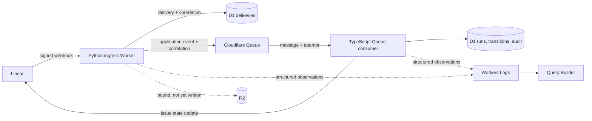

# Current Architecture

This is the living, repository-level architecture index. The detailed as-built runtime description is [`docs/current-architecture.md`](docs/current-architecture.md); the normative behavior remains in `openspec/specs/`.

DEOS receives authenticated Linear webhooks in a Python Worker, deduplicates them by `Linear-Delivery`, records them in D1, and hands relevant events to a TypeScript Queue consumer. The consumer owns the immutable versioned graph, stable issue/run/Workflow identities, D1 transitions and inbox, Cloudflare Workflow execution, isolated Sandbox attempts, provider capability receipts, artifact manifests, and cleanup reconciliation.

D1 is the business-state and audit authority. Cloudflare Workflow status is executor evidence. The typed lifecycle first deployed as definition version 4 and is reconciled into the active version 11 graph:

- final `succeeded`, `denied`, and `canceled` nodes commit D1 before normal return;
- `awaiting_capability` and `manual_reconciliation_required` waits persist exact resume and cancellation matchers and hibernate the same Workflow instance;
- failure nodes commit D1 `failed` with a bounded service-authored cause before surfacing a non-retryable Cloudflare error;
- legacy version 3 and parallel-mainline versions 4–10 may retain immutable `blocked` outcomes, while version 11 rejects new legacy terminals.

Later signed Linear deliveries for active or waiting runs are stored in the D1 inbox and sent to the recorded Workflow instance. The frozen definition—not the event payload—decides whether the delivery resumes, cancels, or is rejected. Delivery and wait-consumption guards prevent duplicate transitions and provider effects.

R2 stores protected Codex authentication and immutable per-attempt artifact
manifests, transcripts, structured results, validation output, provider
references, and cumulative repository patches. Cloudflare Workflow and Sandbox
run the versioned delivery graph in the separate TypeScript Worker.

A scheduled reconciler compares non-final D1 runs with Cloudflare instance status. Cloudflare `complete` without a final D1 outcome becomes `premature_workflow_completion`: a guarded update marks DEOS failed and creates or reuses one marked comment on the correlated Linear ticket. A lost D1 race is audited without overwriting the newer state or publishing a stale notice.

Both Workers emit bounded correlated observations to Workers Logs. R2 stores protected credentials, immutable artifacts, and diagnostics; trusted provider adapters retain Linear/GitHub credentials outside the Sandbox. Real completion evidence is layered: deterministic tests, deployed Cloudflare status and D1 records, provider-originated Linear transitions, and sanitized visual proof.

The architecture keeps authenticated ingress and domain logic small and
Python-first, with durable dispatch isolated behind a provider-supported Queue
consumer. Provider-specific payloads are translated at the boundary, durable
state is authoritative, and asynchronous behavior is observable.

Deterministic tests provide fast feedback, while deployed Cloudflare resources
and a test Linear project provide provider-originated integration proof.

## Decisions

- **Ingress first:** authenticate and deduplicate the raw Linear delivery, then
  pass it through an anti-corruption layer that maps provider fields into the
  application event model.
- **Asynchronous boundary:** accepted events move through Cloudflare Queues; the
  HTTP handler only validates, records, publishes, and acknowledges a delivery.
- **Workflow definition:** the first transition map is `RECEIVED -> QUEUED ->
  REQUIREMENTS_IN_PROGRESS -> AWAITING_HUMAN_APPROVAL`, with explicit `APPROVED`
  and `REJECTED` outcomes. Project policy selects which Linear transition starts
  the flow.
- **Human approval:** the workflow moves the issue into the configured Linear
  board column `Human Review` and waits. A configured transition out of that
  column resumes the run; no Worker infers approval from issue text.
- **Cloudflare persistence:** D1 stores deliveries, project policy, workflow
  runs, transitions, and audit records. Queue provides the durable handoff.
- **Stable workflow identity:** the deterministic identifier
  `workflow:{project_id}:{issue_id}` is both the workflow run identifier and its
  cross-service correlation identifier. Retries and later provider deliveries
  retain that identity.
- **Structured observability:** both Workers emit the same bounded,
  OpenTelemetry-compatible JSON envelope to Workers Logs. Operators query it in
  Cloudflare Query Builder by correlation identifier.
- **Data minimization:** telemetry uses an allowlist of service-owned fields,
  Linear delivery/issue/project identifiers, and closed error categories. It
  excludes secrets, raw bodies, issue content, user details, raw exceptions,
  and dependency responses.
- **Runtime-specific adapters:** domain logic is separated from Cloudflare
  binding adapters. Python remains preferred for ingress and domain modules;
  the Queue consumer is TypeScript because that runtime produced durable D1
  evidence for Queue consumption where the equivalent Python consumer did not.
- **Native OpenSpec jobs:** typed agent jobs carry an allowlisted OpenSpec
  instruction and a trusted change name derived from the Linear issue. A later
  clean Sandbox restores the latest cumulative patch from R2 only after its D1
  digest matches.
- **Conditional receipt policy:** ordinary successful agents and external system
  actions require exact D1-backed receipts. A repository-local OpenSpec job may
  complete with zero provider operations, but any external operation it
  attempts retains the exact receipt requirement.

## Component and event flow



```text
Linear signed delivery
  -> ingress verifies signature and timestamp
  -> ACL classifies and translates the delivery
  -> D1 records the delivery and correlation identity
  -> duplicate: emit duplicate telemetry and return HTTP 200
  -> irrelevant: return HTTP 200 without starting a workflow
  -> relevant and new: publish the application event to Queue
  -> Queue consumer loads or creates the deterministic workflow run
  -> commit durable workflow transitions in D1
  -> update the Linear issue when required by the transition
  -> emit correlated observations around each fallible stage
  -> acknowledge Queue success or throw so Queue retry policy applies
```

The webhook does not decide that an issue is ready for implementation. It emits
a normalized event; project policy and the workflow state machine decide which
transition is valid.

## Minimal data model

- `delivery`: provider delivery ID, received timestamp, classification, payload
  hash, and workflow correlation ID.
- `application_event`: canonical event ID, issue ID, project ID, transition,
  actor, occurrence time, source delivery ID, and correlation ID.
- `workflow_run`: deterministic run ID, project, issue, current state, created
  and updated timestamps, and the same correlation ID.
- `transition`: run ID, previous state, next state, cause, actor, and timestamp.
- `telemetry observation`: time, service, stage, outcome, correlation ID,
  relevant resource identifiers, optional Queue attempt metadata, and a closed
  error category on failure.

The anti-corruption layer owns the mapping from Linear webhook fields to the
application event. Domain code does not consume the provider payload directly.
Workflow transitions join to their run by `run_id`; telemetry is retained in
Workers Logs rather than an application-managed telemetry table. D1 remains the
durable source of workflow and audit state.

## Failure modes and guarantees

| Condition | Current behavior |
|---|---|
| Invalid signature or timestamp | Reject the request without admitting an event. |
| Irrelevant delivery | Return HTTP 200 without starting or advancing a workflow. |
| Duplicate delivery | Return HTTP 200, emit a duplicate outcome under the stored correlation, and do not publish or advance workflow state. |
| D1 delivery operation fails | Emit a categorized ingress failure; do not emit false acceptance or publication success. |
| Queue publication fails | The delivery remains recorded in D1 and telemetry reports `queue_publish_failed`. |
| Queue correlation is missing or invalid | Fail consumption with `correlation_mismatch`; do not create or advance workflow state. |
| Consumer D1 operation fails | Emit `d1_operation_failed` and throw so Queue retry policy applies. |
| Linear update fails | Emit a bounded transport, HTTP, or GraphQL error category and throw so Queue retry policy applies. |
| Worker stops after a stage starts | No false terminal success is emitted; a later attempt remains under the same correlation ID. |
| Workers Logs is unavailable or expired | D1 remains authoritative, but the cross-service operational narrative is incomplete. |

## Current boundaries

- Deployment remains an external system action and cannot advance without its
  exact trusted provider receipt.
- Repository continuation is a cumulative patch against the configured base;
  capture uses an isolated temporary Git index so untracked files are included;
  the first slice does not provide a long-lived mutable workspace or automatic
  rebase.
- Workers Logs and Query Builder remain the operational query surface; the
  issue-centred operator view and native workflow graph are separate follow-up
  work.
- Future operator UI, independent executor/business status projection, and
  native Cloudflare graph work remain separately tracked; they do not replace
  D1 authority.

## Evolution rule

When an OpenSpec change modifies the implemented architecture, its archive or
spec-sync step must update this document in the same change. The update should:

1. describe only behavior that is implemented and validated;
2. reconcile the diagrams, decisions, data model, and failure modes;
3. move newly implemented items out of **Current boundaries**; and
4. leave unimplemented target ideas in
   `cloudflare-linear-workflow-architecture.md`.
