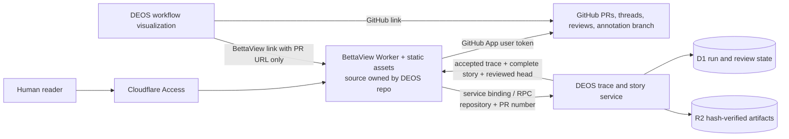

# Integrated BettaView portal and complete DEOS review story

Status: plan only. No implementation is authorized by this document.

Date: 2026-08-28

## Outcome

Move the experimental BettaView source into the DEOS repository and deploy it at `bettaview.voxdez.com`. BettaView becomes one place to read and review a GitHub pull request, inspect its proposal/spec trace, and follow the complete author-review-repair process. Keep every existing human review action. Let the DEOS visualization open either GitHub or BettaView for the same planning pull request.

BettaView will not generate semantic trace data in the cloud. DEOS already owns that model work and its durable evidence. Cloud BettaView will consume the accepted trace and render it.

## Decisions

1. **BettaView remains a real GitHub review client.** It must keep rendered Markdown, native review threads, queued inline comments, replies, `COMMENT`, `APPROVE`, `REQUEST_CHANGES`, Mermaid drawing annotations, and annotation image publication.
2. **Human GitHub identity is mandatory.** Cloudflare Access decides who may enter the application. A GitHub App user access token decides which repository the person may read and which review actions that person may perform. Human-triggered GitHub writes use the user token, not an installation token or a shared service identity.
3. **Trace generation stays in DEOS.** The cloud BettaView deployment has no Codex binary, model key, generation route, temporary checkout, or local trace cache. It reads a hash-verified accepted trace from DEOS.
4. **BettaView becomes DEOS-owned source.** Import the pinned experimental source into this repository. Production builds and future changes come only from DEOS. The separate BettaView repository remains historical after parity is proven.
5. **The DEOS node detail offers a choice.** Where the existing visualization shows its GitHub planning-PR link, it will show two adjacent actions: **Open on GitHub** and **Open in BettaView**.
6. **The BettaView URL carries only the pull request.** The proposed shape is `https://bettaview.voxdez.com/?pr=<encoded-canonical-github-pr-url>`. It has no run or head parameter. BettaView reads the live head from GitHub. DEOS resolves the associated run, review story, and trace from the canonical repository and pull-request number.
7. **BettaView shows the whole process.** The same portal presents PR reading, trace visualization, and the author/internal-review/external-review story. There is no second story page that the reader must open in another application.
8. **The review story shows source records, not only summaries.** Every available actual reviewer message, actual author disposition and reason, applied diff, no-change or declined response, later recheck, failure, retry, and provider result remains inspectable. A summary may help navigation, but it cannot replace the underlying record.

## Current source boundary

At BettaView revision `de22c3cf9a95285647bbf31cac1d6242bef6142a`:

- the browser already renders changed Markdown and native GitHub review threads;
- `server/index.js` publishes inline review comments, replies, review decisions, and Mermaid annotation images;
- annotation images are committed to the pull request repository's `bettaview-annotations` branch;
- `server/index.js` also contains a local Codex generation endpoint and temporary-file workflow; and
- the server uses one local `gh auth token`, binds to loopback, and stores generated trace results only in process memory.

Import this exact revision into `portal/bettaview/` in the DEOS repository. Keep its useful browser and GitHub behavior, and replace its local process assumptions. Record the source revision in a migration note, but create no runtime or build dependency on the experimental repository. The source references are [BettaView's current server](https://github.com/sachinkundu/bettaview/blob/de22c3cf9a95285647bbf31cac1d6242bef6142a/server/index.js), [GitHub adapter](https://github.com/sachinkundu/bettaview/blob/de22c3cf9a95285647bbf31cac1d6242bef6142a/server/github.js), and [trace rendering](https://github.com/sachinkundu/bettaview/blob/de22c3cf9a95285647bbf31cac1d6242bef6142a/src/traceability-view.js).

The workflow's frozen semantic runner remains isolated from the web application. After the import, its bundle manifest should point to hash-pinned DEOS-owned source instead of requiring another repository checkout. Old workflow definitions must still restore their immutable vendored bytes.

DEOS PR [#64](https://github.com/sachinkundu/deos/pull/64) already persists the semantic review, directional trace, author dispositions, exact-head binding, provider receipts, artifacts, and attempt lifecycle. Its current trace portal deliberately selects accepted or reused reviews. That is enough for the present trace view, but it hides failed review attempts and does not yet assemble the full author-review-repair conversation.

## Product flow

### Open and review a pull request

1. The reader selects a workflow node or visit in the existing DEOS visualization.
2. The node detail shows **Open on GitHub** and **Open in BettaView** next to the same canonical planning-PR link.
3. **Open in BettaView** opens the cloud reader with only the encoded GitHub PR URL.
4. Cloudflare Access admits the reader to BettaView.
5. BettaView asks for GitHub authorization when no valid GitHub user session exists.
6. BettaView loads the current PR, changed Markdown, review threads, viewer capabilities, and current head from GitHub.
7. BettaView asks the DEOS data service for the run, accepted trace, and complete retained review story associated with that repository and PR number.
8. The portal offers three connected views without another application hop: **PR**, **Trace**, and **Process**.
9. If the reviewed head equals the live GitHub head, BettaView shows the trace as current. If not, it shows the existing stale-head warning and never silently rebinds the evidence.
10. The reader can comment, reply, approve, request changes, or annotate a Mermaid diagram. GitHub receives the action under that reader's GitHub user identity.

### Read the complete review story

BettaView's **Process** view shows the review story for the run associated with the loaded PR. DEOS resolves that association after the PR loads, so the entry URL still needs only the PR URL. The reader stays in BettaView while moving between the rendered PR, its trace, and the process that produced it.

The story is chronological:

1. author attempt and exact candidate identity;
2. internal review's actual output and citations;
3. author's actual response to every finding: `applied`, `declined`, or `no_change`, with the recorded reason;
4. the exact patch or an explicit statement that no bytes changed;
5. internal recheck's actual resolution of the fixed finding set;
6. publication to the planning PR and the exact GitHub head;
7. external review's actual directional outputs and citations;
8. author's actual response to every external item and the resulting patch or no-change proof;
9. later review or recheck responses, if any;
10. GitHub, Linear, Workflow, D1, R2, and Sandbox outcomes; and
11. every failed, interrupted, repaired, reused, or retried attempt in its real position in the story.

The default card is readable prose. Each card can expand to the hash, candidate, head, attempt, provider, harness, model, prompt version, timestamp, exact stored output, and safe raw transcript or artifact. Hidden model chain-of-thought is not a product record and will not be invented. If an older run did not retain an exact response, the portal says **Not captured for this run** instead of reconstructing it from a summary.

## Architecture

### BettaView Worker

Maintain the BettaView application under `portal/bettaview/` in DEOS and deploy it as one Cloudflare Worker for API routes and the Vite static build. A separate Worker deployment keeps GitHub write sessions isolated from the existing read-oriented DEOS portal, but both are built, tested, versioned, and maintained in this repository. Cloudflare documents Workers Static Assets as the supported full-stack pattern, with the Worker handling `/api/*` and the assets binding serving the application: [Static Assets](https://developers.cloudflare.com/workers/static-assets/) and [configuration](https://developers.cloudflare.com/workers/static-assets/binding/).

Refactor the current Express-only server into provider-neutral handlers, then add a Workers adapter. Keep the local Node adapter for development and regression comparison until the cloud path has feature parity. Do not bundle `child_process`, local filesystem access, `gh`, Codex, or `/api/traceability/reviews` into the cloud Worker.

### Admission and GitHub identity

Cloudflare Access is the outer admission gate. The Worker must still validate the `Cf-Access-Jwt-Assertion` issuer, audience, signature, and expiry as Cloudflare requires: [validate Access JWTs](https://developers.cloudflare.com/cloudflare-one/access-controls/applications/http-apps/authorization-cookie/validating-json/).

GitHub authorization is a second, separate gate. Register a GitHub App and use its web application flow with PKCE. GitHub user access tokens are the correct token type for actions performed on behalf of a person; their access is the intersection of the app installation and that user's own access: [user access tokens](https://docs.github.com/en/apps/creating-github-apps/authenticating-with-a-github-app/generating-a-user-access-token-for-a-github-app) and [GitHub App best practices](https://docs.github.com/en/apps/creating-github-apps/about-creating-github-apps/best-practices-for-creating-a-github-app).

Use a random opaque `HttpOnly`, `Secure`, `SameSite=Lax` cookie. A per-session Durable Object stores the encrypted expiring access and refresh tokens and serializes refresh. The browser never receives a GitHub token. Revocation, expiry, installation loss, SAML failure, and insufficient repository permission return explicit reauthorization or capability messages.

Initial GitHub App repository permissions:

- Metadata: read;
- Contents: read, plus write for the existing private-repository annotation branch;
- Pull requests: read and write.

GitHub documents `Pull requests: write` for creating reviews and replies: [pull request reviews](https://docs.github.com/en/rest/pulls/reviews) and [review comments](https://docs.github.com/en/rest/pulls/comments). The existing annotation-branch upload also requires `Contents: write`: [repository contents](https://docs.github.com/en/rest/repos/contents).

If the viewer lacks Contents write permission, normal reading and review remain available, while diagram annotation publishing is visibly unavailable with the exact permission reason. The feature is not removed or silently converted to a shared app identity.

### DEOS trace service

Add a narrow same-account service-binding/RPC method to the DEOS portal Worker. Input is the governed repository plus pull-request number. DEOS performs the mapping and returns:

- canonical PR URL and current recorded head;
- accepted trace review ID and outcome;
- reviewed head and reviewed-file digest;
- hash-verified `bettaview-traceability.json` content;
- trace artifact SHA-256 and provenance fields; and
- the protected DEOS review-story URL.

DEOS remains responsible for deciding which run, round, candidate, and accepted artifact are current. BettaView does not query D1 or R2 directly, does not scan GitHub comments for workflow identity, and does not combine evidence from different heads.

### DEOS review-story service for BettaView

Build a new read model instead of weakening the current accepted-trace projection. BettaView renders this read model in its **Process** view. The story query includes all run visits, agent attempts, review jobs, candidates, head bindings, author dispositions, provider operations, manifests, and cleanup records. It must not filter the story to only `accepted = 1` or reused reviews.

Every returned content artifact follows an explicit allowlist, complete-manifest check, D1-selected R2 key, and SHA-256 verification. Failed attempts may show only artifacts that the collector marked safe. Redactions are labeled in place. Credentials, encrypted provider bodies, and unrelated repository content never enter the browser.

The read model groups facts but does not rewrite them:

- **Reviewer said** comes from the exact stored normalized or raw review output.
- **Author answered** comes from the durable per-finding disposition and reason.
- **Author changed** comes from the exact candidate patch and file hashes.
- **Reviewer rechecked** comes from the later exact review artifact.
- **System did** comes from provider receipts and workflow transitions.
- **Attempt failed** comes from the terminal attempt category and any safe failure artifact.

## Delivery sequence

### 1. Contract and gap audit

- Inventory the exact records retained for SAC-139 and representative failed runs.
- Map each story field to its D1 row and R2 artifact.
- Mark missing historical evidence as unavailable; do not synthesize it.
- Add future-run persistence only where the requested actual comment, response, or diff is not currently durable.
- Freeze a versioned DEOS-to-BettaView trace response fixture.

### 2. Import BettaView into DEOS

- Import exact revision `de22c3cf9a95285647bbf31cac1d6242bef6142a` under `portal/bettaview/` with a source-provenance note.
- Move active maintenance, builds, tests, and deployment configuration into DEOS.
- Keep old workflow definitions able to restore their immutable vendored runner bytes.
- Generate future frozen runner bundles from DEOS-owned source and verify every manifest hash.
- Make the experimental repository read-only only after production feature parity is proven.

### 3. BettaView cloud-compatible core

- Separate pure PR rendering, comment preparation, trace rendering, and GitHub calls from Express and local process code.
- Add a Worker entry point and Workers Static Assets configuration.
- Remove cloud access to Codex generation and local temporary files.
- Keep a local adapter so the same contract tests run against Node and Workers.

### 4. Access and human GitHub authorization

- Protect `bettaview.voxdez.com` with Cloudflare Access.
- Validate the Access JWT inside the Worker.
- Implement GitHub App user authorization with PKCE, expiring tokens, refresh, revocation, and server-side sessions.
- Prove a real private PR loads only when both Access and GitHub allow it.

### 5. GitHub review feature parity

- Port text comments, queued batch review, replies, approve, request changes, stale-head protection, and deduplication.
- Preserve Mermaid drawing and branch-backed annotation image publication.
- Verify that every write appears in GitHub under the signed-in human's identity.
- Do not deploy as the preferred reader until all current BettaView review actions pass checks against a real GitHub pull request.

### 6. Trace, process story, and dual links

- Add the narrow DEOS trace RPC with exact-head and hash verification.
- Render the returned trace with BettaView's existing directional visualization.
- Render the complete DEOS review story in BettaView's **Process** view.
- Add **Open on GitHub** and **Open in BettaView** beside the existing PR link in the selected node/visit detail.
- Add the all-attempt story read model and allowlisted artifact routes.
- Build the chronological story UI with exact reviewer output, author response, disposition, diff, recheck, failures, retries, reuse, provider receipts, and cleanup.
- Keep compact summaries collapsed by default while making the actual record one action away.
- Show unavailable and redacted evidence explicitly.

### 7. Existing-run production proof

Do not rerun the traceability workflow for this visualization work. Use the already-completed SAC-139 run and its planning PR as the primary production fixture. Prove:

- the existing provider-originated Linear delivery and final Human Review state are found without creating a new run;
- the existing planning PR and its exact reviewed head load in BettaView;
- the retained internal and external outputs plus every author disposition appear in **Process**;
- the recorded applied changes or justified no-change responses appear without reconstruction;
- BettaView trace rendering from DEOS, not from a checked-in or locally generated sidecar;
- the **PR**, **Trace**, and **Process** views stay connected inside BettaView;
- both DEOS node-detail links open the correct existing planning PR;
- D1/R2 hashes, GitHub and Linear receipts, Workflow state, and Sandbox cleanup; and
- visual screenshots only with explicit browser permission.

Check GitHub review feature parity against an existing controlled PR. A text comment, reply, Mermaid annotation, and review decision may create normal GitHub review records, but they must not start or rerun a DEOS workflow. Any later workflow canary requires separate approval.

## Completion criteria

The work is complete only when:

- `bettaview.voxdez.com` is deployed, Access protected, and its Worker validates Access JWTs;
- maintained BettaView source, tests, and deployment configuration live in DEOS with no runtime or build dependency on the experimental repository;
- GitHub reads and writes use an authorized GitHub App user token and preserve human attribution;
- all current BettaView review actions work against a real PR;
- no cloud route can start Codex or another model;
- the DEOS visualization shows GitHub and BettaView links side by side for the same PR;
- BettaView renders DEOS's hash-verified accepted trace and warns on a moved head;
- BettaView's **Process** view includes failed and successful attempts plus the actual available review, response, disposition, diff, and recheck records;
- the completed SAC-139 run is visualized without allocating a new workflow run;
- no evidence is reconstructed from a summary or mixed across PR heads;
- provider, durable-store, cleanup, and deployment read-backs agree; and
- the DEOS repository has focused contract tests, production builds, deployed read-back, and existing provider-originated proof.

## Non-goals

- no Codex or model generation inside cloud BettaView;
- no second workflow orchestrator in BettaView;
- no second maintained production repository for BettaView;
- no automatic semantic correction or reviewer decision in the reading portal;
- no public trace or review-story endpoint;
- no shared GitHub identity for human review actions;
- no silent downgrade of comments, replies, approval, request-changes, or annotation features; and
- no new DEOS workflow run solely to prove visualization of already-retained evidence; and
- no attempt to invent missing evidence for old runs.

## Work authorization boundary

After this plan is accepted, create one OpenSpec change in DEOS and follow the normal gated review flow. The implementation remains in this repository; no production implementation PR is needed in the experimental BettaView repository. Do not begin implementation from this planning document alone.
