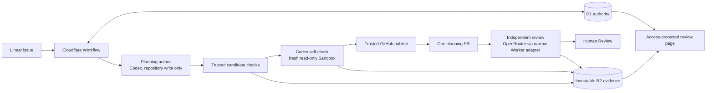

# Current orchestration architecture

The authenticated Python ingress verifies the raw Linear body with HMAC-SHA256, treats `Linear-Timestamp` as milliseconds, deduplicates on `Linear-Delivery`, and enqueues every issue-state change for configured projects. It returns HTTP 200 for accepted, ignored, and duplicate deliveries.

The TypeScript Queue consumer loads an immutable workflow definition and project policy from D1. It allocates a monotonic issue run, derives a stable Cloudflare Workflow ID, records a pending dispatch intent, and reconciles by that ID before acknowledging the Queue. Later events enter a delivery-keyed D1 inbox and use one fixed Workflow event type.

Cloudflare Workflow reloads D1 authority before every graph decision. The run's current node carries a monotonic visit sequence; each selected edge derives a stable traversal ID from its source visit. D1 advances the node and visit and inserts the matching transition row in one guarded transaction. An exact replay reuses that traversal without advancing, while a later genuine pass over the same edge has a new visit and row. Workflow-step telemetry carries both identities and reports `duplicate` only for the exact replay. An active run keeps its immutable definition version: if the deployed bundle advances, the Workflow restores the run's canonical definition from D1 and verifies its digest. Agent, system-action, human-gate, loop, and terminal nodes select only reviewed edges from `config/workflow.deos.yaml`. Agent output cannot name a Linear state or edge. Human approval requires a signed event from `actor.type == user` leaving the active `Human Review` gate; the provider's prior-state ID is authoritative when Linear omits the prior state name.

Repository-local OpenSpec progression is encoded as typed agent jobs carrying one allowlisted native instruction and a trusted change identity derived from the Linear issue identifier. Continue advances one planning artifact, apply implements the task checklist, verify consumes the completed change, and archive performs mechanical spec synchronization and change closure. Each fresh Sandbox starts from the configured base and restores the latest complete cumulative patch from R2 only after its SHA-256 matches D1, so later review and implementation agents see earlier unmerged work without preserving a Sandbox filesystem. Archive fails closed when no completed cumulative patch is available.

## OpenSpec traceability review flow

The bundle also contains `simple-traceability` version 4. It is registered with the fixed `DEOS Traceability` selector, but registration leaves that selector disabled. The existing `simple` definition stays the project default. Deploying this code cannot start a traceability run until an operator separately enables the selector and applies the matching Linear label.

The author has no GitHub or Linear capability. Trusted code builds an immutable planning candidate after the author exits. It allows only `.openspec.yaml`, `proposal.md`, and the declared `specs/**/spec.md` files. It runs strict OpenSpec and readability checks, writes the candidate and validation receipt to create-only R2 keys, reads both objects back by SHA-256, and then indexes the accepted candidate in D1.

Both semantic stages use a pinned BettaView bundle. The Codex self-check uses the run's frozen author model and thought setting in a fresh read-only Sandbox. The independent stage uses a different OpenRouter model chosen in Settings and frozen when the run is allocated. The OpenRouter key stays in the Worker. The Sandbox receives only a signed, attempt-scoped model channel for that exact model and setting.

D1 stores the candidate, phase, accepted review, and exact-head binding. R2 stores the full model and validation proof. Discovery creates one fixed finding inventory. A recheck must rate every existing ID once and cannot add, remove, rename, merge, or split a finding. Trusted code derives the outcome from the checked artifact. The two stages share at most three author-repair turns. An identical input records a reuse event without creating an attempt, Sandbox, or model call. A different pull-request head can reuse proof only after trusted GitHub reads show that every reviewed file has the same hash.

Trusted publication creates or updates one planning pull request from the accepted R2 candidate. It also posts each candidate-bound human review reply through the existing idempotent GitHub adapter and leaves the thread open. Independent proof is bound to the exact published head. The Worker updates one exact-head GitHub Check Run and updates one marked Linear status link to the protected portal. Review agents cannot make any of these provider calls.

Human feedback closes neither prior proof nor its finding inventory. A trusted action allocates the next round with fresh counters. The author then handles the human comments, and both stages run new full discovery checks. Later repairs inside that round remain limited to the fixed finding ranges. No-semantic-change author output is rejected before another review attempt, Sandbox, or model call can be allocated.

The portal serves `/runs/<encoded-run-id>/review`. It reads rounds, phase counters, accepted reviews, reuse, exact heads, findings, cited ranges, repair evidence, conflicts, and candidates from D1. It marks exact-head proof current or stale against the saved pull-request head. Raw proof is available only through an allowlisted route that selects an accepted manifest, reads its exact R2 key, verifies the D1 SHA-256, and returns `Cache-Control: no-store`. The ordinary workflow view does not generate proof during page load. Its planning-stage detail links to the review page only after accepted proof exists.

This code and its packaging checks do not prove a live traceability run. A provider-originated canary, deployment read-back, portal Access check, and real D1/R2/GitHub/Linear evidence remain a separate, explicitly authorized step after merge and selector enablement.

Definition version 11 ends with `evidence_verification -> openspec_verify -> final_approval -> sync_and_archive -> done`. Final approval is the last authority-bearing gate: approval may dispatch only the typed `/opsx:archive` job, whose complete artifacts and confirmed Sandbox cleanup permit terminal `succeeded`; rejection commits `denied`, while blocked or failed archive work reaches a typed failure node that commits `failed` before the executor errors. The active definition has no deploy or release-finalization node. Older runs still restore their own immutable D1 snapshot and verified digest, including version 10's legacy `blocked` tail and any historical release nodes.

The evidence-verification agent is a pre-final-approval semantic consumer. It evaluates the restored implementation and evidence applicable before native OpenSpec verify; it cannot require later verify, final approval, sync, or archive outputs to certify entry to those nodes. Immutable identity, manifest integrity, patch checksums, cleanup, and receipt completeness remain trusted controller concerns rather than credentialed agent duties. Provider-originated and visual evidence are required only for changes that actually expose provider or user-interface behavior.

The lifecycle contract first deployed as definition version 4 separates Cloudflare executor state from DEOS business state. D1 final outcomes (`succeeded`, `denied`, `canceled`) are committed before normal Workflow return. Recoverable missing capability or ambiguous provider effects become `awaiting_capability` or `manual_reconciliation_required`; D1 atomically stores the wait node, safe cause, and exact user-authorized resume and cancellation matchers before the same Workflow instance calls `waitForEvent`. Unexpected and duplicate events remain auditable without changing the wait. An unrecoverable typed failure commits D1 `failed` with a bounded cause before a `NonRetryableError` makes Cloudflare report `errored`. Because main advanced independently while SAC-92 was deployed from its branch, frozen mainline versions 4–10 may still contain legacy `blocked` terminals; the loader restores those exact snapshots by shape and digest, while active version 11 requires the explicit lifecycle contract.

Every agent node creates a UUIDv7 attempt and a derived Sandbox ID before provider calls. The pinned supervisor runs Codex with argv, fixed staging paths, JSONL output, a JSON result schema, a five-minute heartbeat, and a 24-hour absolute limit. The disposable Sandbox is the `danger-full-access` boundary; it contains no provider credential.

ChatGPT auth is an encrypted, conditionally replaced R2 object protected by an exclusive D1 lease. Required outputs pass schema, size, and credential checks before checksum-verified create-only R2 writes. The Sandbox is destroyed before the manifest is re-read for final integrity verification.

Durable GitHub and Linear work products go through attempt-scoped capability endpoints. Each request is schema-checked, restricted to the trial repository or issue, and recorded under a stable operation identity. Ordinary successful agents require a non-empty mechanically captured receipt set that matches the structured result and D1's successful or reconciled operations for the same run and attempt. A typed OpenSpec job may instead complete with zero provider operations; if it attempts any external effect, the same exact receipt rule applies. GitHub uses a short-lived App installation token. Linear capabilities can write notes and artifact references but cannot mutate issue state. Workflow-owned transitions use the Linear app actor and are confirmed only by ordered signed-delivery evidence. Human-gate entry operations are scoped to the durable gate visit, so a same-visit retry reuses the provider operation while a later visit to the same gate creates a new one. Historical frozen definitions may still contain an external `system_action`; it requires a successful or reconciled receipt for its exact named action, and repository artifacts cannot prove a deployment or other provider effect.

Cleanup has two independent views. A Worker cron reconciles D1-known attempts without waking a missing process. An hourly GitHub Actions job uses a Cloudflare inventory credential, account ID, and Container application ID to list real provider instances. It sends only normalized Sandbox IDs, authenticated by a separate shared audit secret, to `/cleanup-audit`. The trusted Worker owns the D1 comparison and Linear integration; the repository job has no Linear credential and cannot write cleanup state directly. D1 attempts in `pending`, `starting`, `running`, or `collecting` are excluded from orphan reports. Associated and standalone orphans create or reuse stable `cleanup_work_items` and Linear cleanup issues through the Worker. If the external job is unavailable, normal ingress, Workflow execution, and the D1-known cron continue, but detection of provider-only resources is degraded until the audit succeeds.

The same Worker cron checks D1 non-final runs against their recorded Cloudflare Workflow instances. A Cloudflare `complete` result with no final D1 outcome is compare-and-set to DEOS `failed` with `premature_workflow_completion`. One stable marked comment is created or reused on the correlated Linear ticket. A lost D1 comparison records a conflict and suppresses the stale comment; reconciliation never moves the ticket to Done or allocates a replacement run.

The implemented slice includes real provider adapters and production bindings. A selected canary still requires deployed Sandbox, provider-originated Linear, remote D1, Cloudflare Workflow status, R2, GitHub/Linear work-product, and cleanup evidence, plus visual evidence when the tested feature has a provider configuration or user-interface surface. Deterministic tests alone are supporting proof.
