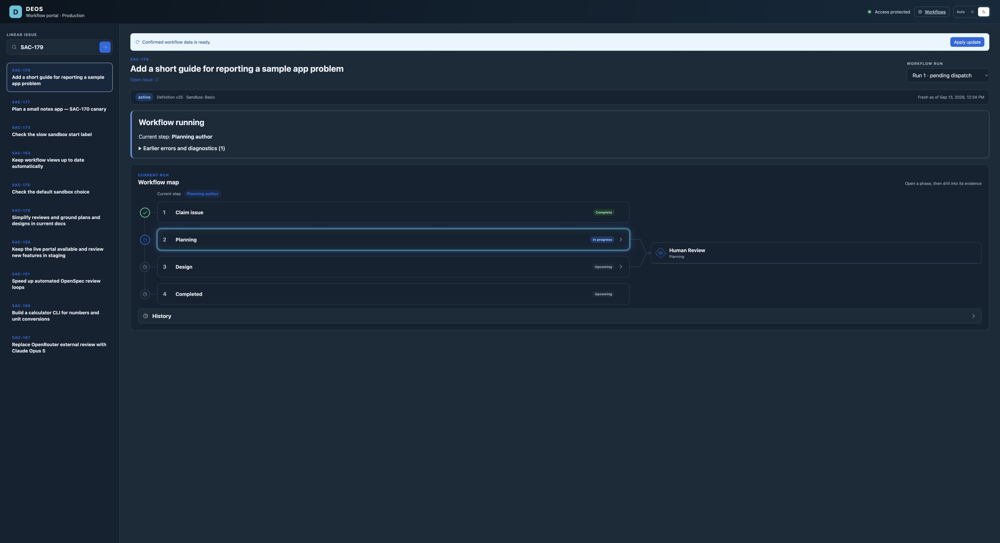

# Basic default and prompt sandbox cleanup — release proof

*2026-09-13T08:48:54Z by Showboat 0.6.1*
<!-- showboat-id: b45578ca-96e8-4b86-86b7-6ed4a9036451 -->

PR #125 reuses the Basic release policy and adds authenticated supervisor completion hints. This document records live provider state and timing. Local tests and Worker dry runs passed; those checks alone are not provider proof.

```bash
rtk proxy python3 /tmp/basic-cleanup-active-policy.py
```

```output
{
  "observed_at": "2026-09-13T09:06:31.130635+00:00",
  "worker": "deos-sample-project",
  "deployment_id": "e5fde9ec-9dfa-483d-a657-a3d2c1c2553e",
  "versions": [
    {
      "version_id": "1b5e60e7-37d1-4681-a36a-73434542584a",
      "percentage": 100
    }
  ],
  "sandbox_tier_policy": "legacy-basic-v1"
}
```

```bash
rtk proxy python3 /tmp/basic-cleanup-release-proof.py
```

```output
{
  "observed_at": "2026-09-13T09:29:46.635652+00:00",
  "workers": [
    {
      "worker": "deos-sample-project",
      "versions": [
        {
          "version_id": "1b5e60e7-37d1-4681-a36a-73434542584a",
          "percentage": 100
        }
      ],
      "sandbox_tier_policy": "legacy-basic-v1"
    },
    {
      "worker": "deos-queue-consumer-ts",
      "versions": [
        {
          "version_id": "52b1b190-9bd3-40a6-8994-b08bf8e6bd9f",
          "percentage": 100
        }
      ]
    }
  ],
  "containers": [
    {
      "name": "deos-queue-consumer-ts-standard2sandbox",
      "reported_version": 2,
      "reported_image": "registry.cloudflare.com/c68856288112af7698f5be52ea94b96e/deos-queue-consumer-ts-standard2sandbox@sha256:ed865f410b833ea918707712c4a227afcb78d5c4669647b0b8a090f388159f49",
      "health": {
        "errors": [],
        "instances": {
          "active": 0,
          "assigned": 0,
          "healthy": 4,
          "stopped": 0,
          "failed": 0,
          "scheduling": 0,
          "starting": 0
        }
      },
      "rollout": {
        "id": "f50c8192-4943-44bf-8ea2-20c43aa7d64a",
        "status": "completed",
        "target_version": 3,
        "target_configuration": {
          "image": "registry.cloudflare.com/c68856288112af7698f5be52ea94b96e/deos-queue-consumer-ts-standard2sandbox@sha256:735a2a6cd25fe2b873ae95485e7fc5cd4e2e22123c31afe533a05e28ed54d38e",
          "observability": {
            "logs": {
              "enabled": true
            }
          },
          "vcpu": 1,
          "memory_mib": 6144,
          "disk": {
            "size_mb": 12000,
            "size": "12GB"
          },
          "memory": "6GiB"
        },
        "progress": {
          "total_steps": 2,
          "current_step": 2,
          "updated_instances": 4,
          "total_instances": 4,
          "version_distribution": {
            "target_version_instances": 4,
            "current_version_instances": 0,
            "target_version_percentage": 100
          }
        }
      }
    },
    {
      "name": "deos-queue-consumer-ts-sandbox",
      "reported_version": 62,
      "reported_image": "registry.cloudflare.com/c68856288112af7698f5be52ea94b96e/deos-queue-consumer-ts-sandbox@sha256:735a2a6cd25fe2b873ae95485e7fc5cd4e2e22123c31afe533a05e28ed54d38e",
      "health": {
        "errors": [],
        "instances": {
          "active": 0,
          "assigned": 1,
          "healthy": 3,
          "stopped": 0,
          "failed": 0,
          "scheduling": 0,
          "starting": 0
        }
      },
      "rollout": {
        "id": "4f4407e3-f0bc-40cd-b718-b563e087534a",
        "status": "completed",
        "target_version": 62,
        "target_configuration": {
          "image": "registry.cloudflare.com/c68856288112af7698f5be52ea94b96e/deos-queue-consumer-ts-sandbox@sha256:735a2a6cd25fe2b873ae95485e7fc5cd4e2e22123c31afe533a05e28ed54d38e",
          "observability": {
            "logs": {
              "enabled": true
            }
          },
          "vcpu": 0.25,
          "memory_mib": 1024,
          "disk": {
            "size_mb": 4000,
            "size": "4GB"
          },
          "memory": "1GiB"
        },
        "progress": {
          "total_steps": 2,
          "current_step": 2,
          "updated_instances": 4,
          "total_instances": 4,
          "version_distribution": {
            "target_version_instances": 4,
            "current_version_instances": 0,
            "target_version_percentage": 100
          }
        }
      }
    }
  ]
}
```

```bash {image}
docs/evidence/basic-cleanup/basic-running.png
```



```bash
rtk proxy python3 /tmp/basic-cleanup-proof.py
```

```output
{
  "observed_at": "2026-09-13T09:36:40.042868+00:00",
  "issue": "SAC-179",
  "runs": [
    {
      "run_id": "workflow:99426d9b-cda7-4db4-9136-692a95a0b090:d32eccb3-8f13-4965-a79a-f5de8dd6a1e8:run:1",
      "issue_id": "d32eccb3-8f13-4965-a79a-f5de8dd6a1e8",
      "status": "active",
      "current_node": "independent_discovery",
      "workflow_instance_id": "wf-v1-d66deti3wcppf5csltth3dulayr6t7w4fsz2zrms7nfdvvzjarqa",
      "definition_version": 25,
      "sandbox_tier": "basic",
      "sandbox_tier_policy_version": "legacy-basic-v1",
      "terminal_at": null,
      "terminal_cause": null,
      "attempts": [
        {
          "attempt_id": "01a09a19-2b56-7263-9ba5-574dffa1b036",
          "node_id": "planning_author",
          "sandbox_tier": "basic",
          "state": "completed",
          "started_at": "2026-09-13T09:28:56.244Z",
          "ended_at": "2026-09-13T09:36:03.201Z",
          "result_class": "completed",
          "cleanup_state": "destroyed",
          "manifest_id": "manifest:01a09a19-2b56-7263-9ba5-574dffa1b036",
          "manifest": {
            "manifest_id": "manifest:01a09a19-2b56-7263-9ba5-574dffa1b036",
            "state": "complete",
            "completed_at": "2026-09-13T09:35:46.557Z"
          },
          "artifact_count": 11,
          "diagnostic_status_key": "runs/workflow%3A99426d9b-cda7-4db4-9136-692a95a0b090%3Ad32eccb3-8f13-4965-a79a-f5de8dd6a1e8%3Arun%3A1/attempts/01a09a19-2b56-7263-9ba5-574dffa1b036/diagnostics/status.json",
          "diagnostic_status_sha256": "650f60b7d77ea8677ca8c3ca36df5a963095c7d20bf05914ee84bc225f05bc32",
          "supervisor_completed_at": "2026-09-13T09:35:28.134Z",
          "supervisor_exit_code": 0,
          "completion_to_terminal_seconds": 35.067
        },
        {
          "attempt_id": "01a09a1f-fd47-7d5e-9047-e49c83c0c6cd",
          "node_id": "independent_discovery",
          "sandbox_tier": "basic",
          "state": "running",
          "started_at": "2026-09-13T09:36:23.606Z",
          "ended_at": null,
          "result_class": null,
          "cleanup_state": "pending",
          "manifest_id": null
        }
      ],
      "provider_workflow": {
        "status": "running",
        "success": null,
        "error": null,
        "start": "2026-09-13T09:28:51.809Z",
        "end": null
      }
    }
  ],
  "deliveries": [
    {
      "source_delivery_id": "6eb279cc-342b-46a2-8e75-c76e803c6971",
      "received_at": "2026-09-13T09:28:34.620000+00:00",
      "classification": "relevant",
      "sandbox_tier": "basic",
      "sandbox_tier_policy_version": "legacy-basic-v1"
    }
  ]
}
```

```bash
rtk proxy python3 /tmp/basic-cleanup-wake-proof.py
```

```output
[
  {
    "event": "sandbox.completion_notified",
    "run_id": "workflow:99426d9b-cda7-4db4-9136-692a95a0b090:d32eccb3-8f13-4965-a79a-f5de8dd6a1e8:run:1",
    "attempt_id": "01a09a19-2b56-7263-9ba5-574dffa1b036",
    "workflow_instance_id": "wf-v1-d66deti3wcppf5csltth3dulayr6t7w4fsz2zrms7nfdvvzjarqa"
  }
]
```

```bash
rtk proxy python3 /tmp/basic-cleanup-stop.py
```

```output

 ⛅️ wrangler 4.125.0
────────────────────

✘ [ERROR] A request to the Cloudflare API (/accounts/c68856288112af7698f5be52ea94b96e/workflows/deos-sandbox-codex-workflow/instances/wf-v1-d66deti3wcppf5csltth3dulayr6t7w4fsz2zrms7nfdvvzjarqa/status) failed.

  workflows.api.error.instance.cannot_terminate [code: 10401]

  If you think this is a bug, please open an issue at: https://github.com/cloudflare/workers-sdk/issues/new/choose


🪵  Logs were written to "/Users/sachin/Library/Preferences/.wrangler/logs/wrangler-2026-09-13_09-42-28_151.log"
Traceback (most recent call last):
  File "/tmp/basic-cleanup-stop.py", line 22, in <module>
    subprocess.run(common+['workflows','instances','terminate','deos-sandbox-codex-workflow',workflow_id,
    ~~~~~~~~~~~~~~^^^^^^^^^^^^^^^^^^^^^^^^^^^^^^^^^^^^^^^^^^^^^^^^^^^^^^^^^^^^^^^^^^^^^^^^^^^^^^^^^^^^^^^
        '--config','wrangler.queue-consumer-ts.jsonc'],cwd=cwd,env=env,check=True)
        ^^^^^^^^^^^^^^^^^^^^^^^^^^^^^^^^^^^^^^^^^^^^^^^^^^^^^^^^^^^^^^^^^^^^^^^^^^
  File "/opt/homebrew/Cellar/python@3.14/3.14.6/Frameworks/Python.framework/Versions/3.14/lib/python3.14/subprocess.py", line 578, in run
    raise CalledProcessError(retcode, process.args,
                             output=stdout, stderr=stderr)
subprocess.CalledProcessError: Command '['rtk', 'proxy', 'npx', 'wrangler', 'workflows', 'instances', 'terminate', 'deos-sandbox-codex-workflow', 'wf-v1-d66deti3wcppf5csltth3dulayr6t7w4fsz2zrms7nfdvvzjarqa', '--config', 'wrangler.queue-consumer-ts.jsonc']' returned non-zero exit status 1.
```

```bash
rtk proxy python3 /tmp/basic-cleanup-proof.py
```

```output
{
  "observed_at": "2026-09-13T09:43:18.773841+00:00",
  "issue": "SAC-179",
  "runs": [
    {
      "run_id": "workflow:99426d9b-cda7-4db4-9136-692a95a0b090:d32eccb3-8f13-4965-a79a-f5de8dd6a1e8:run:1",
      "issue_id": "d32eccb3-8f13-4965-a79a-f5de8dd6a1e8",
      "status": "failed",
      "current_node": "system_action_failed",
      "workflow_instance_id": "wf-v1-d66deti3wcppf5csltth3dulayr6t7w4fsz2zrms7nfdvvzjarqa",
      "definition_version": 25,
      "sandbox_tier": "basic",
      "sandbox_tier_policy_version": "legacy-basic-v1",
      "terminal_at": "2026-09-13T09:41:26.313Z",
      "terminal_cause": "system_action_invariant_failed",
      "attempts": [
        {
          "attempt_id": "01a09a19-2b56-7263-9ba5-574dffa1b036",
          "node_id": "planning_author",
          "sandbox_tier": "basic",
          "state": "completed",
          "started_at": "2026-09-13T09:28:56.244Z",
          "ended_at": "2026-09-13T09:36:03.201Z",
          "result_class": "completed",
          "cleanup_state": "destroyed",
          "manifest_id": "manifest:01a09a19-2b56-7263-9ba5-574dffa1b036",
          "manifest": {
            "manifest_id": "manifest:01a09a19-2b56-7263-9ba5-574dffa1b036",
            "state": "complete",
            "completed_at": "2026-09-13T09:35:46.557Z"
          },
          "artifact_count": 11,
          "diagnostic_status_key": "runs/workflow%3A99426d9b-cda7-4db4-9136-692a95a0b090%3Ad32eccb3-8f13-4965-a79a-f5de8dd6a1e8%3Arun%3A1/attempts/01a09a19-2b56-7263-9ba5-574dffa1b036/diagnostics/status.json",
          "diagnostic_status_sha256": "650f60b7d77ea8677ca8c3ca36df5a963095c7d20bf05914ee84bc225f05bc32",
          "supervisor_completed_at": "2026-09-13T09:35:28.134Z",
          "supervisor_exit_code": 0,
          "completion_to_terminal_seconds": 35.067
        },
        {
          "attempt_id": "01a09a1f-fd47-7d5e-9047-e49c83c0c6cd",
          "node_id": "independent_discovery",
          "sandbox_tier": "basic",
          "state": "completed",
          "started_at": "2026-09-13T09:36:23.606Z",
          "ended_at": "2026-09-13T09:38:10.587Z",
          "result_class": "pass",
          "cleanup_state": "destroyed",
          "manifest_id": "manifest:01a09a1f-fd47-7d5e-9047-e49c83c0c6cd",
          "manifest": {
            "manifest_id": "manifest:01a09a1f-fd47-7d5e-9047-e49c83c0c6cd",
            "state": "complete",
            "completed_at": "2026-09-13T09:37:52.044Z"
          },
          "artifact_count": 13,
          "diagnostic_status_key": "runs/workflow%3A99426d9b-cda7-4db4-9136-692a95a0b090%3Ad32eccb3-8f13-4965-a79a-f5de8dd6a1e8%3Arun%3A1/attempts/01a09a1f-fd47-7d5e-9047-e49c83c0c6cd/diagnostics/status.json",
          "diagnostic_status_sha256": "8a2023d829ba2adf589140a36ef8070dfcf1314207006c4175ae14e661fb5a3a",
          "supervisor_completed_at": "2026-09-13T09:37:31.358Z",
          "supervisor_exit_code": 0,
          "completion_to_terminal_seconds": 39.229
        },
        {
          "attempt_id": "01a09a21-b450-7559-a20a-8e79a77cda5b",
          "node_id": "planning_independent_response",
          "sandbox_tier": "basic",
          "state": "completed",
          "started_at": "2026-09-13T09:38:15.639Z",
          "ended_at": "2026-09-13T09:41:20.139Z",
          "result_class": "completed",
          "cleanup_state": "destroyed",
          "manifest_id": "manifest:01a09a21-b450-7559-a20a-8e79a77cda5b",
          "manifest": {
            "manifest_id": "manifest:01a09a21-b450-7559-a20a-8e79a77cda5b",
            "state": "complete",
            "completed_at": "2026-09-13T09:41:03.201Z"
          },
          "artifact_count": 10,
          "diagnostic_status_key": "runs/workflow%3A99426d9b-cda7-4db4-9136-692a95a0b090%3Ad32eccb3-8f13-4965-a79a-f5de8dd6a1e8%3Arun%3A1/attempts/01a09a21-b450-7559-a20a-8e79a77cda5b/diagnostics/status.json",
          "diagnostic_status_sha256": "d4e6f4bafd21527efcf7c001e47239f5faf9aa8da9fde7319f374d7ecd3097e3",
          "supervisor_completed_at": "2026-09-13T09:40:45.335Z",
          "supervisor_exit_code": 0,
          "completion_to_terminal_seconds": 34.804
        }
      ],
      "provider_workflow": {
        "status": "errored",
        "success": false,
        "error": {
          "name": "Error",
          "message": "NonRetryableError: system_action_invariant_failed"
        },
        "start": "2026-09-13T09:28:51.809Z",
        "end": "2026-09-13T09:41:57.406Z"
      }
    }
  ],
  "deliveries": [
    {
      "source_delivery_id": "6eb279cc-342b-46a2-8e75-c76e803c6971",
      "received_at": "2026-09-13T09:28:34.620000+00:00",
      "classification": "relevant",
      "sandbox_tier": "basic",
      "sandbox_tier_policy_version": "legacy-basic-v1"
    }
  ]
}
```
