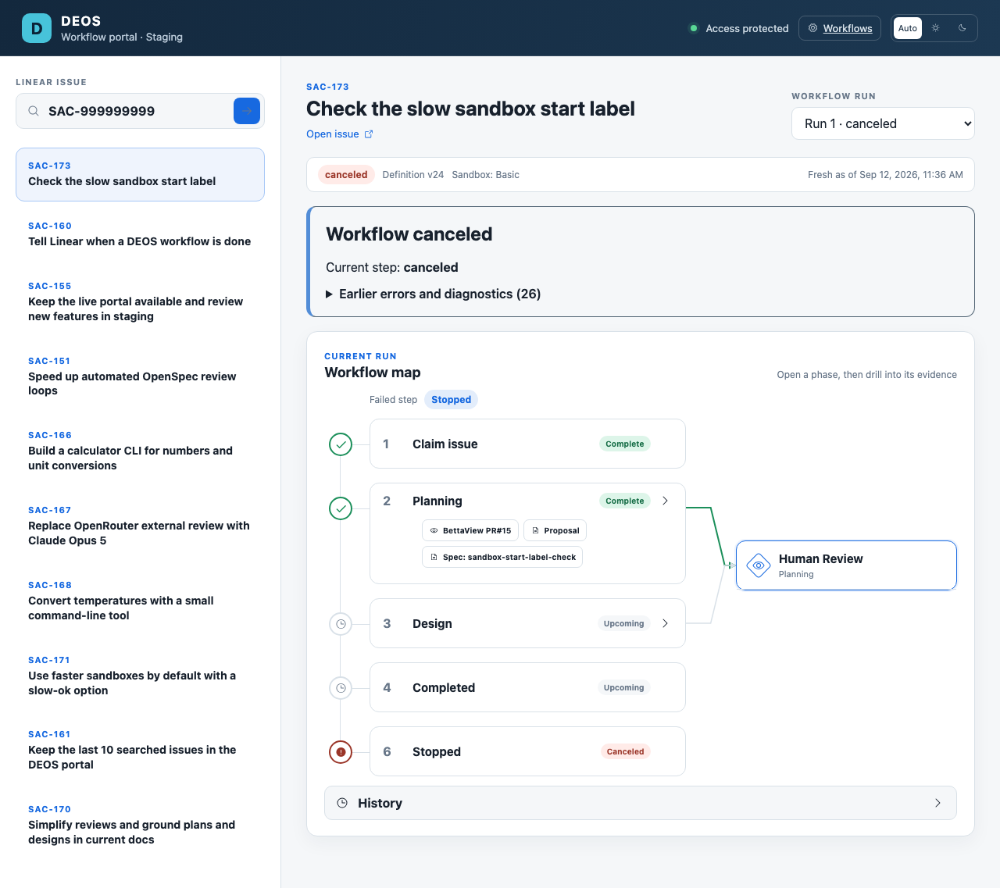

# Portal reviewer session check

The local browser smoke check passed against live staging on 2026-09-12. It exercised ordering, repeat searches, trimming to ten items, reload, invalid searches, issue navigation, and unchanged workflow state. The two service-authenticated version calls were omitted from this local smoke check because their secret is held in GitHub Actions. This is not a passed production release.

Run the synthetic cookie regression with `node scripts/check-portal-session-isolation.test.mjs`. It reproduces a service response replacing the reviewer cookie in a shared context, then verifies that separate contexts retain reviewer API and browser access.

The complete CI check must run after merge. Diagnostic run 34706172501 was rejected before executing because staging permits only main. Temporary reviewer secrets were removed after the attempt.
