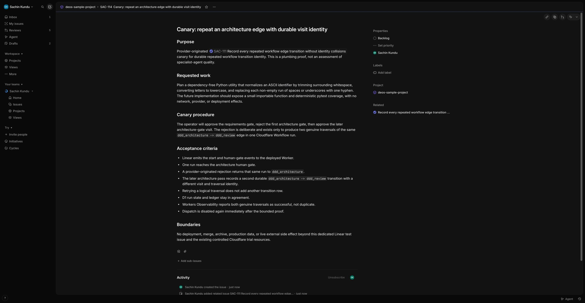
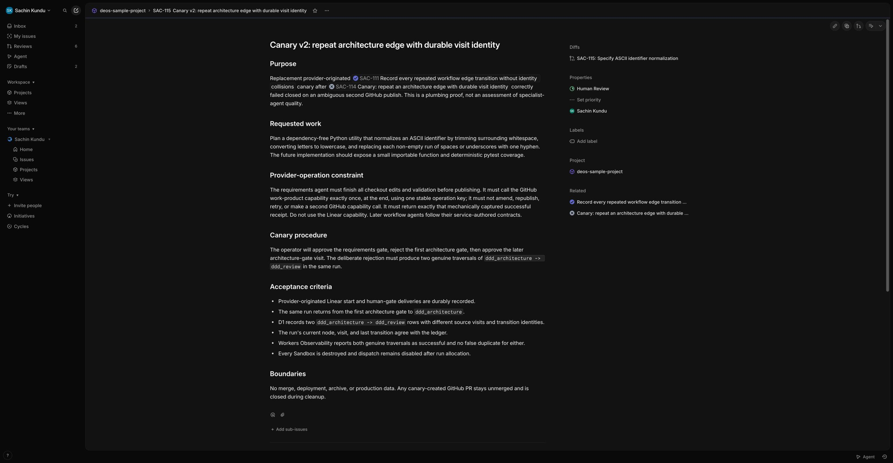
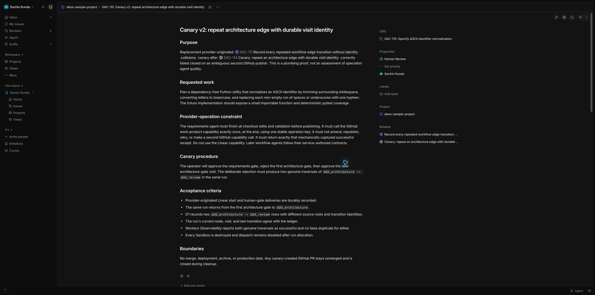

# SAC-111 repeated workflow transition provider canary

*2026-08-18T05:57:25Z by Showboat 0.6.1*
<!-- showboat-id: 734f4291-f462-40df-9da6-b467bad45e0d -->

This record proves the deployed SAC-111 visit-identity change with provider-originated Linear events and read-only D1/Workers evidence. DEOS business state is reported before Cloudflare executor state. Dispatch remains disabled during migration and deployment and is enabled only for the bounded canary. Historical transition omissions are not reconstructed by this additive migration.

```bash
set -euo pipefail
set -a
source /Users/sachin/code/deos/.env
set +a
export CLOUDFLARE_API_TOKEN="${CLOUDFLARE_API_TOKEN:-$CLOUDFLARE_TOKEN}"
npx wrangler d1 migrations list DB --remote --config wrangler.queue-consumer-ts.jsonc
npx wrangler d1 execute DB --remote --config wrangler.queue-consumer-ts.jsonc --command "SELECT project_id, definition_version, dispatch_enabled FROM project_workflow_policies WHERE project_id = '99426d9b-cda7-4db7-972a-d0d08ac0a3d8' OR project_id = '99426d9b-cda7-4db4-9136-692a95a0b090'; SELECT COUNT(*) AS active_runs FROM orchestration_runs WHERE status IN ('pending_dispatch', 'active', 'awaiting_human');" --json | jq -c 'map(.results)'
```

```output

 ⛅️ wrangler 4.123.0
────────────────────
Resource location: remote 

Migrations to be applied:
┌──────────────────────────────────┐
│ Name                             │
├──────────────────────────────────┤
│ 0007_workflow_visit_identity.sql │
└──────────────────────────────────┘
[[{"project_id":"99426d9b-cda7-4db4-9136-692a95a0b090","definition_version":9,"dispatch_enabled":0}],[{"active_runs":4}]]
```

```bash
set -euo pipefail
set -a
source /Users/sachin/code/deos/.env
set +a
export CLOUDFLARE_API_TOKEN="${CLOUDFLARE_API_TOKEN:-$CLOUDFLARE_TOKEN}"
npx wrangler d1 execute DB --remote --config wrangler.queue-consumer-ts.jsonc --command "SELECT issue_id, run_sequence, current_node, status, definition_version, updated_at FROM orchestration_runs WHERE status IN ('pending_dispatch', 'active', 'awaiting_human') ORDER BY updated_at; SELECT COUNT(*) AS live_attempts FROM agent_attempts WHERE state IN ('pending', 'starting', 'running', 'collecting');" --json | jq -c 'map(.results)'
```

```output
[[{"issue_id":"fbb2c3e5-e993-4a29-8fbe-0998b27305f5","run_sequence":8,"current_node":"requirements_approval","status":"active","definition_version":2,"updated_at":"2026-08-16T08:34:54.560Z"},{"issue_id":"6839b197-f5b4-4ea5-be4d-78ee0ecf713c","run_sequence":1,"current_node":"requirements","status":"active","definition_version":5,"updated_at":"2026-08-17T11:09:35.029Z"},{"issue_id":"8e9ae257-8cc6-445c-81b4-d50f9bfea92b","run_sequence":1,"current_node":"requirements_review","status":"active","definition_version":6,"updated_at":"2026-08-17T11:29:53.591Z"},{"issue_id":"2fd18891-2272-453e-a3cc-174a236e28f9","run_sequence":1,"current_node":"release_approval","status":"awaiting_human","definition_version":8,"updated_at":"2026-08-17T13:43:02.380Z"}],[{"live_attempts":0}]]
```

```bash
set -euo pipefail
set -a
source /Users/sachin/code/deos/.env
set +a
export CLOUDFLARE_API_TOKEN="${CLOUDFLARE_API_TOKEN:-$CLOUDFLARE_TOKEN}"
rtk npx wrangler d1 migrations apply DB --remote --config wrangler.queue-consumer-ts.jsonc
rtk npx wrangler deploy --config wrangler.queue-consumer-ts.jsonc --containers-rollout gradual
```

```output
 ⛅️ wrangler 4.123.0
────────────────────
Resource location: remote 
Migrations to be applied:
┌──────────────────────────────────┐
│ name                             │
├──────────────────────────────────┤
│ 0007_workflow_visit_identity.sql │
└──────────────────────────────────┘
? About to apply 1 migration(s)
Your database may not be available to serve requests during the migration, continue?
🤖 Using fallback value in non-interactive context: yes
🌀 Executing on remote database DB (4e854f8a-018a-42c4-a325-c4b8805c06b2):
🌀 To execute on your local development database, remove the --remote flag from your wrangler command.
🚣 Executed 8 commands in 5.70ms
┌──────────────────────────────────┬────────┐
│ name                             │ status │
├──────────────────────────────────┼────────┤
│ 0007_workflow_visit_identity.sql │ ✅     │
└──────────────────────────────────┴────────┘
 ⛅️ wrangler 4.123.0
────────────────────
Total Upload: 1038.89 KiB / gzip: 218.73 KiB
Worker Startup Time: 8 ms
Your Worker has access to the following bindings:
Binding                                                                              Resource                  
env.Sandbox (Sandbox)                                                                Durable Object            
env.ORCHESTRATION_WORKFLOW (DeosWorkflow)                                            Workflow                  
env.DB (deos-sample-project)                                                         D1 Database               
env.ARTIFACTS (deos-sample-project-artifacts)                                        R2 Bucket                 
env.LINEAR_API_URL ("https://api.linear.app/graphql")                                Environment Variable      
env.LINEAR_HUMAN_APPROVAL_STATE_ID ("71738607-03fd-49f2-b4be-b2aac29ccd13")          Environment Variable      
env.LINEAR_PROJECT_ID ("99426d9b-cda7-4db4-9136-692a95a0b090")                       Environment Variable      
env.LINEAR_START_STATE_NAME ("In Progress")                                          Environment Variable      
env.LINEAR_APPROVAL_STATE_NAMES ("In Progress")                                      Environment Variable      
env.LINEAR_REJECTION_STATE_NAMES ("Canceled")                                        Environment Variable      
env.LINEAR_APP_ACTOR_ID ("f010429f-7734-4f3f-9b4b-13a4abb9b4ab")                     Environment Variable      
env.LINEAR_TEAM_ID ("ac53207d-68c0-42f1-a245-c1baf047f234")                          Environment Variable      
env.GITHUB_API_URL ("https://api.github.com")                                        Environment Variable      
env.TRIAL_REPOSITORY ("sachinkundu/deos")                                            Environment Variable      
env.TRIAL_DISPATCH_ENABLED ("false")                                                 Environment Variable      
env.CODEX_AUTH_PROFILE_ID ("controlled-trial")                                       Environment Variable      
env.CAPABILITY_BASE_URL ("https://deos-queue-consumer-ts.skundu...")                 Environment Variable      
The following containers are available:
- deos-queue-consumer-ts-sandbox (/Users/sachin/code/deos-worktrees/sac-111-implementation/Dockerfile)
Uploaded deos-queue-consumer-ts (5.82 sec)
Building image deos-queue-consumer-ts-sandbox:145b65b3
Login Succeeded
Image already exists remotely, skipping push
Untagged: deos-queue-consumer-ts-sandbox:145b65b3
╭ Deploy a container application deploy changes to your application
│
│ Container application changes
│
├ no changes deos-queue-consumer-ts-sandbox
│
╰ No changes to be made 
Deployed deos-queue-consumer-ts triggers (5.91 sec)
  https://deos-queue-consumer-ts.skundu.workers.dev
  schedule: */15 * * * *
  Consumer for deos-sample-project-events
  workflow: deos-sandbox-codex-workflow
Current Version ID: 145b65b3-5966-4da6-a20f-06c9cca52c61
#0 building with "colima" instance using docker driver
#1 [internal] load build definition from Dockerfile
#1 transferring dockerfile: 766B done
#1 DONE 0.0s
#2 [internal] load metadata for docker.io/cloudflare/sandbox:0.13.0-next.738.2@sha256:f4b2137219568aa44539ab93c0e774db6bcab323c134c5088447916e58f15e75
#2 DONE 0.0s
#3 [internal] load .dockerignore
#3 transferring context: 2B done
#3 DONE 0.0s
#4 [1/8] FROM docker.io/cloudflare/sandbox:0.13.0-next.738.2@sha256:f4b2137219568aa44539ab93c0e774db6bcab323c134c5088447916e58f15e75
#4 resolve docker.io/cloudflare/sandbox:0.13.0-next.738.2@sha256:f4b2137219568aa44539ab93c0e774db6bcab323c134c5088447916e58f15e75 done
#4 DONE 0.0s
#5 [internal] load build context
#5 transferring context: 204B done
#5 DONE 0.0s
#6 [2/8] RUN npm install --global --omit=dev @openai/codex@0.147.0 @fission-ai/openspec@1.8.0
#6 CACHED
#7 [5/8] COPY container/patch-capture.mjs /deos/bin/patch-capture.mjs
#7 CACHED
#8 [7/8] COPY container/deos-linear /usr/local/bin/deos-linear
#8 CACHED
#9 [6/8] COPY container/deos-github /usr/local/bin/deos-github
#9 CACHED
#10 [3/8] RUN mkdir -p /deos/bin /deos/staging /deos/jobs /deos/auth     && chmod 700 /deos/auth     && chmod 755 /deos/bin /deos/staging /deos/jobs
#10 CACHED
#11 [4/8] COPY container/supervisor.mjs /deos/bin/supervisor.mjs
#11 CACHED
#12 [8/8] RUN chmod 755 /deos/bin/supervisor.mjs /usr/local/bin/deos-github /usr/local/bin/deos-linear     && codex --version     && openspec --version
#12 CACHED
#13 exporting to image
#13 exporting layers done
#13 exporting manifest sha256:5a8186dc62b3d354ffd79bdf490ca0677748f108c37401e1d65dcf0a85085656 done
#13 exporting config sha256:ecf2f04d5580b07a6c6e8b3dde4b2b4d31eaf32b6fe36c1db7336e6912f1abbf done
#13 naming to docker.io/library/deos-queue-consumer-ts-sandbox:145b65b3 done
#13 DONE 0.0s
WARNING! Your credentials are stored unencrypted in '/Users/sachin/.docker/config.json'.
Configure a credential helper to remove this warning. See
https://docs.docker.com/go/credential-store/
```

```bash
set -euo pipefail
set -a
source /Users/sachin/code/deos/.env
set +a
export CLOUDFLARE_API_TOKEN="${CLOUDFLARE_API_TOKEN:-$CLOUDFLARE_TOKEN}"
npx wrangler d1 migrations list DB --remote --config wrangler.queue-consumer-ts.jsonc
npx wrangler d1 execute DB --remote --config wrangler.queue-consumer-ts.jsonc --command "SELECT project_id, definition_version, dispatch_enabled FROM project_workflow_policies WHERE project_id = '99426d9b-cda7-4db4-9136-692a95a0b090'; SELECT name FROM pragma_table_info('orchestration_runs') WHERE name IN ('current_visit_sequence', 'last_transition_id') ORDER BY name; SELECT name FROM pragma_table_info('workflow_transitions_v2') WHERE name IN ('from_visit_sequence', 'to_visit_sequence') ORDER BY name;" --json | jq -c 'map(.results)'
npx wrangler versions list --config wrangler.queue-consumer-ts.jsonc --json | jq -c '.[-1] | {id, created_on: .metadata.created_on}'
```

```output

 ⛅️ wrangler 4.123.0
────────────────────
Resource location: remote 

✅ No migrations to apply!
[[{"project_id":"99426d9b-cda7-4db4-9136-692a95a0b090","definition_version":9,"dispatch_enabled":0}],[{"name":"current_visit_sequence"},{"name":"last_transition_id"}],[{"name":"from_visit_sequence"},{"name":"to_visit_sequence"}]]
{"id":"145b65b3-5966-4da6-a20f-06c9cca52c61","created_on":"2026-08-18T05:58:29.824688Z"}
```

Linear visual proof before dispatch: SAC-114 is a dedicated issue in deos-sample-project and remains Backlog.

```bash {image}

```



```bash
set -euo pipefail
set -a
source /Users/sachin/code/deos/.env
set +a
export CLOUDFLARE_API_TOKEN="${CLOUDFLARE_API_TOKEN:-$CLOUDFLARE_TOKEN}"
npx wrangler d1 execute DB --remote --config wrangler.queue-consumer-ts.jsonc --command "UPDATE project_workflow_policies SET dispatch_enabled = 1, updated_at = datetime('now') WHERE project_id = '99426d9b-cda7-4db4-9136-692a95a0b090'; SELECT project_id, definition_version, dispatch_enabled FROM project_workflow_policies WHERE project_id = '99426d9b-cda7-4db4-9136-692a95a0b090';" --json | jq -c 'map(.results)'
```

```output
[[],[{"project_id":"99426d9b-cda7-4db4-9136-692a95a0b090","definition_version":9,"dispatch_enabled":1}]]
```

```bash
set -euo pipefail
set -a
source /Users/sachin/code/deos/.env
set +a
export CLOUDFLARE_API_TOKEN="${CLOUDFLARE_API_TOKEN:-$CLOUDFLARE_TOKEN}"
npx wrangler d1 execute DB --remote --config wrangler.queue-consumer-ts.jsonc --command "UPDATE project_workflow_policies SET dispatch_enabled = 0, updated_at = datetime('now') WHERE project_id = '99426d9b-cda7-4db4-9136-692a95a0b090'; SELECT project_id, definition_version, dispatch_enabled FROM project_workflow_policies WHERE project_id = '99426d9b-cda7-4db4-9136-692a95a0b090'; SELECT r.run_id, r.issue_id, r.current_node, r.current_visit_sequence, r.status, r.definition_version, d.source_delivery_id, d.state AS dispatch_state FROM orchestration_runs AS r JOIN dispatch_intents AS d ON d.run_id = r.run_id WHERE r.issue_id = '050c7a52-d4fe-4e95-9ec3-6d228daec3d6'; SELECT delivery_id, classification, received_at FROM deliveries WHERE delivery_id = (SELECT source_delivery_id FROM dispatch_intents WHERE run_id = 'workflow:99426d9b-cda7-4db4-9136-692a95a0b090:050c7a52-d4fe-4e95-9ec3-6d228daec3d6:run:1');" --json | jq -c 'map(.results)'
```

```output
[[],[{"project_id":"99426d9b-cda7-4db4-9136-692a95a0b090","definition_version":9,"dispatch_enabled":0}],[{"run_id":"workflow:99426d9b-cda7-4db4-9136-692a95a0b090:050c7a52-d4fe-4e95-9ec3-6d228daec3d6:run:1","issue_id":"050c7a52-d4fe-4e95-9ec3-6d228daec3d6","current_node":"requirements","current_visit_sequence":1,"status":"active","definition_version":9,"source_delivery_id":"8c52f693-54c3-4f5d-80cb-e68eb7fda536","dispatch_state":"established"}],[{"delivery_id":"8c52f693-54c3-4f5d-80cb-e68eb7fda536","classification":"relevant","received_at":"2026-08-18T06:01:31.160999+00:00"}]]
```

SAC-114 did not reach a graph transition. Its requirements attempt completed and destroyed its Sandbox, but a second GitHub publish operation ended manual_reconciliation_required after an ambiguous response. The controller correctly refused to advance. No receipt is synthesized; the exact canary Workflow is terminated and the run is failed before replacement.

```bash
set -euo pipefail
set -a
source /Users/sachin/code/deos/.env
set +a
export CLOUDFLARE_API_TOKEN="${CLOUDFLARE_API_TOKEN:-$CLOUDFLARE_TOKEN}"
npx wrangler workflows instances terminate deos-sandbox-codex-workflow wf-v1-jf6cpvjmaqi2qycyj3pfzod4jetlilspsmznwvdak2u6x34ujcdq --config wrangler.queue-consumer-ts.jsonc
npx wrangler d1 execute DB --remote --config wrangler.queue-consumer-ts.jsonc --command "UPDATE orchestration_runs SET status = 'failed', terminal_cause = 'canary_provider_receipt_mismatch', terminal_at = datetime('now'), updated_at = datetime('now') WHERE run_id = 'workflow:99426d9b-cda7-4db4-9136-692a95a0b090:050c7a52-d4fe-4e95-9ec3-6d228daec3d6:run:1' AND current_node = 'requirements' AND status = 'active'; SELECT run_id, current_node, current_visit_sequence, status, terminal_cause FROM orchestration_runs WHERE run_id = 'workflow:99426d9b-cda7-4db4-9136-692a95a0b090:050c7a52-d4fe-4e95-9ec3-6d228daec3d6:run:1'; SELECT operation_id, state, safe_error_category FROM provider_operations WHERE attempt_id = '01a01376-2460-7414-8164-99a5976ddcfd' ORDER BY started_at; SELECT node_id, state, cleanup_state FROM agent_attempts WHERE attempt_id = '01a01376-2460-7414-8164-99a5976ddcfd';" --json | jq -c 'map(.results)'
```

```output

 ⛅️ wrangler 4.123.0
────────────────────
🥷 The instance "wf-v1-jf6cpvjmaqi2qycyj3pfzod4jetlilspsmznwvdak2u6x34ujcdq" from deos-sandbox-codex-workflow was terminated successfully
[[],[{"run_id":"workflow:99426d9b-cda7-4db4-9136-692a95a0b090:050c7a52-d4fe-4e95-9ec3-6d228daec3d6:run:1","current_node":"requirements","current_visit_sequence":1,"status":"failed","terminal_cause":"canary_provider_receipt_mismatch"}],[{"operation_id":"workflow:99426d9b-cda7-4db4-9136-692a95a0b090:050c7a52-d4fe-4e95-9ec3-6d228daec3d6:run:1:capability:github:publish_work_product:requirements-publish-sac-114-v1:1","state":"succeeded","safe_error_category":null},{"operation_id":"workflow:99426d9b-cda7-4db4-9136-692a95a0b090:050c7a52-d4fe-4e95-9ec3-6d228daec3d6:run:1:capability:github:publish_work_product:requirements-publish-sac-114-v2:1","state":"manual_reconciliation_required","safe_error_category":"github_response_ambiguous"}],[{"node_id":"requirements","state":"completed","cleanup_state":"destroyed"}]]
```

Replacement SAC-115 constrains the requirements agent to exactly one final GitHub publish operation, avoiding SAC-114's second ambiguous write while preserving the ordinary-agent receipt contract.

```bash
set -euo pipefail
set -a
source /Users/sachin/code/deos/.env
set +a
export CLOUDFLARE_API_TOKEN="${CLOUDFLARE_API_TOKEN:-$CLOUDFLARE_TOKEN}"
npx wrangler d1 execute DB --remote --config wrangler.queue-consumer-ts.jsonc --command "UPDATE project_workflow_policies SET dispatch_enabled = 1, updated_at = datetime('now') WHERE project_id = '99426d9b-cda7-4db4-9136-692a95a0b090'; SELECT project_id, definition_version, dispatch_enabled FROM project_workflow_policies WHERE project_id = '99426d9b-cda7-4db4-9136-692a95a0b090';" --json | jq -c 'map(.results)'
```

```output
[[],[{"project_id":"99426d9b-cda7-4db4-9136-692a95a0b090","definition_version":9,"dispatch_enabled":1}]]
```

```bash
set -euo pipefail
set -a
source /Users/sachin/code/deos/.env
set +a
export CLOUDFLARE_API_TOKEN="${CLOUDFLARE_API_TOKEN:-$CLOUDFLARE_TOKEN}"
npx wrangler d1 execute DB --remote --config wrangler.queue-consumer-ts.jsonc --command "UPDATE project_workflow_policies SET dispatch_enabled = 0, updated_at = datetime('now') WHERE project_id = '99426d9b-cda7-4db4-9136-692a95a0b090'; SELECT project_id, definition_version, dispatch_enabled FROM project_workflow_policies WHERE project_id = '99426d9b-cda7-4db4-9136-692a95a0b090'; SELECT r.run_id, r.issue_id, r.current_node, r.current_visit_sequence, r.status, r.definition_version, d.source_delivery_id, d.state AS dispatch_state FROM orchestration_runs AS r JOIN dispatch_intents AS d ON d.run_id = r.run_id WHERE r.issue_id = 'f8f5ec87-10e3-4128-9fe8-67ee14a90a01'; SELECT delivery_id, classification, received_at FROM deliveries WHERE delivery_id = (SELECT source_delivery_id FROM dispatch_intents WHERE run_id = 'workflow:99426d9b-cda7-4db4-9136-692a95a0b090:f8f5ec87-10e3-4128-9fe8-67ee14a90a01:run:1');" --json | jq -c 'map(.results)'
```

```output
[[],[{"project_id":"99426d9b-cda7-4db4-9136-692a95a0b090","definition_version":9,"dispatch_enabled":0}],[{"run_id":"workflow:99426d9b-cda7-4db4-9136-692a95a0b090:f8f5ec87-10e3-4128-9fe8-67ee14a90a01:run:1","issue_id":"f8f5ec87-10e3-4128-9fe8-67ee14a90a01","current_node":"requirements","current_visit_sequence":1,"status":"active","definition_version":9,"source_delivery_id":"50047757-68d4-4729-9aa4-3b8c7e40b43a","dispatch_state":"established"}],[{"delivery_id":"50047757-68d4-4729-9aa4-3b8c7e40b43a","classification":"relevant","received_at":"2026-08-18T06:11:16.364000+00:00"}]]
```

Local verification covers transition behavior, bindings, Python ingress, OpenSpec coherence, and both Worker bundles before the provider canary result is accepted.

```bash
set -euo pipefail
npm test -- --run
npm run typecheck
npm run types:check
/Users/sachin/code/deos/.venv/bin/python -m pytest -q
/Users/sachin/code/deos/.venv/bin/python -m ruff check .
npx openspec validate record-repeated-workflow-transitions --strict
npx wrangler deploy --dry-run --config wrangler.jsonc
npx wrangler deploy --dry-run --config wrangler.queue-consumer-ts.jsonc
```

```output

> test
> node --experimental-strip-types --test tests/*.test.ts --run

✔ collector validates and writes immutable checksum-verified artifacts (10.466833ms)
✔ collector parses mechanically captured successful provider receipts (3.445375ms)
✔ same-digest objects reconcile after an ambiguous create response (3.499708ms)
✔ missing files, invalid results, and credentials fail the manifest (1.4485ms)
✔ a conflicting pre-existing object makes the write ambiguous (1.052917ms)
✔ signed capability token is scoped and expires (9.053875ms)
✔ allowed GitHub work product is executed once and duplicate returns the durable receipt (19.425083ms)
✔ repository, branch, path, and Linear transition denials occur before providers (10.556833ms)
✔ Linear capability permits notes and artifact references but only on the scoped issue (5.628875ms)
✔ ambiguous provider response is durable and cannot leak provider credentials (1.802ms)
✔ inactive or mismatched attempt is rejected before provider access (1.947666ms)
✔ provider inventory endpoint is authenticated and reports standalone orphans once (19.978625ms)
✔ known destroyed Sandbox is excluded from external orphan reporting (1.755625ms)
✔ known live Sandbox is excluded from external orphan reporting (0.443458ms)
✔ scheduled reconciliation destroys D1-known terminal Sandboxes (0.218ms)
✔ authenticated envelope round-trips and rejects the wrong key (26.719375ms)
✔ vault leases one profile and conditionally preserves refreshed auth (4.888875ms)
✔ conditional replacement failure is recorded and releases the lease (1.984708ms)
✔ invalid decrypted JSON releases a credential lease (2.429ms)
✔ trusted Linear identifiers produce stable OpenSpec change identities (0.900917ms)
✔ invalid Linear identifiers cannot become OpenSpec change identities (0.301292ms)
✔ materializer records the OpenSpec operation and latest cumulative patch reference (43.792083ms)
✔ lifecycle telemetry contains bounded identities and no content or credentials (6.4765ms)
✔ failed lifecycle observation requires a service-authored safe category (0.265625ms)
✔ Linear transition is written once and confirmed only by ordered app-actor delivery (27.294375ms)
✔ current provider state alone reconciles an already-satisfied gate without mutation (1.238ms)
✔ a later human delivery makes an ambiguous pending transition manual (1.052083ms)
✔ an ambiguous mutation response fails closed and is never repeated (1.268ms)
✔ repair uses unauthorized delivery pre-state and a stable per-delivery identity (0.683959ms)
✔ a later visit to the same gate gets a new provider operation (1.841291ms)
✔ derives stable provider-safe lineage and Workflow identities (13.260375ms)
✔ attempt UUIDv7 and Sandbox identities are distinct and attributable (2.165542ms)
✔ operation identities include logical intent and ordinal (0.436084ms)
✔ visit and transition identities are stable per source visit (0.437458ms)
✔ repository patch capture includes untracked files without mutating the real index (358.056ms)
✔ GitHub adapter reconciles branch, file, and PR partial success by stable marker (26.574209ms)
✔ Linear note adapter reconciles an ambiguous create without any state mutation (1.198833ms)
✔ start delivery allocates one run and establishes one stable Workflow (2.145ms)
✔ duplicate start delivery reuses the established instance (0.275208ms)
✔ lost create response is reconciled by stable identity (0.164292ms)
✔ mapping write failure retries against the existing instance (0.352417ms)
✔ later active-run event is inboxed and sent once (1.233708ms)
✔ non-start or disabled events are audited as unmatched (0.152ms)
✔ a new start after terminal completion creates the next run (0.255666ms)
✔ correlation mismatch fails before storage or provider action (0.223417ms)
✔ controller stages fixed paths and starts the argv supervisor without provider credentials (3.549666ms)
✔ OpenSpec attempt records and prompts the frozen instruction and trusted change identity (0.877917ms)
✔ trusted controller verifies and applies the cumulative continuation patch before Codex (0.960791ms)
✔ a continuation patch digest mismatch fails before Codex starts and destroys the Sandbox (1.030958ms)
✔ running process reconciles the exact process and fresh supervisor heartbeat (0.80475ms)
✔ successful completion refreshes auth, removes it, collects, destroys, then verifies R2 (0.841291ms)
✔ successful agent output without durable provider receipts fails closed (1.564459ms)
✔ expired heartbeat kills the process, destroys the Sandbox, and fails closed (2.670459ms)
✔ a replay after terminal persistence returns the same attempt without relaunching (1.627ms)
✔ a categorized terminal failure replays through the configured failed edge (1.858125ms)
✔ system action does not advance from unrelated manifests or provider operations (0.9215ms)
✔ system action advances only with an exact durable action receipt (0.103875ms)
✔ an incomplete provider operation prevents system action completion (0.080958ms)
✔ TypeScript contract matches the shared schema fixture (4.544542ms)
✔ workflow identity is stable and observations exclude forbidden fields (0.138167ms)
✔ failed observations require a closed service-authored category (0.173792ms)
✔ Queue attempt fields are paired (0.085958ms)
✔ loads the reviewed workflow bundle and resolves prompts and schemas (35.63125ms)
✔ canonical workflow digest is stable (16.195708ms)
✔ restores an immutable stored definition for an older active run (9.085375ms)
✔ rejects a tampered stored definition (7.623083ms)
✔ rejects executable edge expressions and unknown fields (3.320625ms)
✔ rejects a missing prompt before the definition can be enabled (3.491833ms)
✔ rejects graph edges to missing nodes (3.707333ms)
✔ compact workflow durations use Cloudflare's documented human-readable contract (0.817375ms)
✔ node instructions cover agents, system actions, gates, and terminals (0.935166ms)
✔ autonomous agent continuation and review loops use only configured edges (0.341083ms)
✔ success paths fail closed until provider receipts are complete (0.094042ms)
✔ repository-local OpenSpec completion permits zero receipts but not incomplete attempted effects (0.084084ms)
✔ agent-requested Linear transitions are recorded but cannot select an edge (0.069ms)
✔ only a user leaving the active gate can approve or reject (0.095125ms)
✔ Workflow reloads D1 authority and continues through agents, a gate, and system action (2.672334ms)
✔ unauthorized gate departure is repaired before a later human decision (0.418541ms)
✔ a failed provider gate repair blocks gate processing (0.527625ms)
✔ duplicate buffered delivery cannot repeat a human transition (0.735291ms)
✔ a loop records a distinct traversal for the same successful edge (0.33675ms)
✔ one source visit commits once, replays exactly, and rejects stale or conflicting facts (0.167459ms)
✔ start event follows the first workflow to human approval (1.048833ms)
✔ human approval is an explicit transition (0.158958ms)
✔ cancellation explicitly rejects a waiting workflow (0.080542ms)
ℹ tests 85
ℹ suites 0
ℹ pass 85
ℹ fail 0
ℹ cancelled 0
ℹ skipped 0
ℹ todo 0
ℹ duration_ms 493.677083

> typecheck
> tsc --noEmit


> types:check
> wrangler types worker-configuration.d.ts --include-runtime false --config wrangler.queue-consumer-ts.jsonc --check


 ⛅️ wrangler 4.123.0
────────────────────
✨ Types at worker-configuration.d.ts are up to date.

..............                                                           [100%]
14 passed in 0.02s
All checks passed!
Change 'record-repeated-workflow-transitions' is valid

 ⛅️ wrangler 4.123.0
────────────────────
Attaching additional modules:
┌─────────────────────┬────────┬───────────┐
│ Name                │ Type   │ Size      │
├─────────────────────┼────────┼───────────┤
│ deos/__init__.py    │ python │ 0.20 KiB  │
├─────────────────────┼────────┼───────────┤
│ deos/dispatch.py    │ python │ 4.21 KiB  │
├─────────────────────┼────────┼───────────┤
│ deos/fakes.py       │ python │ 2.29 KiB  │
├─────────────────────┼────────┼───────────┤
│ deos/ingress.py     │ python │ 7.70 KiB  │
├─────────────────────┼────────┼───────────┤
│ deos/ports.py       │ python │ 3.75 KiB  │
├─────────────────────┼────────┼───────────┤
│ deos/telemetry.py   │ python │ 3.77 KiB  │
├─────────────────────┼────────┼───────────┤
│ deos/worker.py      │ python │ 0.80 KiB  │
├─────────────────────┼────────┼───────────┤
│ worker_telemetry.py │ python │ 0.65 KiB  │
├─────────────────────┼────────┼───────────┤
│ Total (8 modules)   │        │ 23.38 KiB │
└─────────────────────┴────────┴───────────┘
Total Upload: 29.85 KiB / gzip: 7.29 KiB
Your Worker has access to the following bindings:
Binding                                                                        Resource                  
env.QUEUE (deos-sample-project-events)                                         Queue                     
env.DB (deos-sample-project)                                                   D1 Database               
env.ARTIFACTS (deos-sample-project-artifacts)                                  R2 Bucket                 
env.LINEAR_PROJECT_IDS ("99426d9b-cda7-4db4-9136-692a95a0b090")                Environment Variable      
env.LINEAR_START_TRANSITIONS ("In Progress")                                   Environment Variable      
env.LINEAR_APPROVAL_TRANSITIONS ("In Progress")                                Environment Variable      
env.LINEAR_REJECTION_TRANSITIONS ("Canceled")                                  Environment Variable      

--dry-run: exiting now.

 ⛅️ wrangler 4.123.0
────────────────────
Total Upload: 1038.89 KiB / gzip: 218.73 KiB
Building image deos-queue-consumer-ts-sandbox:worker
#0 building with "colima" instance using docker driver

#1 [internal] load build definition from Dockerfile
#1 transferring dockerfile: 766B done
#1 DONE 0.0s

#2 [internal] load metadata for docker.io/cloudflare/sandbox:0.13.0-next.738.2@sha256:f4b2137219568aa44539ab93c0e774db6bcab323c134c5088447916e58f15e75
#2 DONE 1.1s

#3 [internal] load .dockerignore
#3 transferring context: 2B done
#3 DONE 0.0s

#4 [1/8] FROM docker.io/cloudflare/sandbox:0.13.0-next.738.2@sha256:f4b2137219568aa44539ab93c0e774db6bcab323c134c5088447916e58f15e75
#4 resolve docker.io/cloudflare/sandbox:0.13.0-next.738.2@sha256:f4b2137219568aa44539ab93c0e774db6bcab323c134c5088447916e58f15e75 done
#4 DONE 0.0s

#5 [internal] load build context
#5 transferring context: 204B done
#5 DONE 0.0s

#6 [6/8] COPY container/deos-github /usr/local/bin/deos-github
#6 CACHED

#7 [7/8] COPY container/deos-linear /usr/local/bin/deos-linear
#7 CACHED

#8 [2/8] RUN npm install --global --omit=dev @openai/codex@0.147.0 @fission-ai/openspec@1.8.0
#8 CACHED

#9 [5/8] COPY container/patch-capture.mjs /deos/bin/patch-capture.mjs
#9 CACHED

#10 [3/8] RUN mkdir -p /deos/bin /deos/staging /deos/jobs /deos/auth     && chmod 700 /deos/auth     && chmod 755 /deos/bin /deos/staging /deos/jobs
#10 CACHED

#11 [4/8] COPY container/supervisor.mjs /deos/bin/supervisor.mjs
#11 CACHED

#12 [8/8] RUN chmod 755 /deos/bin/supervisor.mjs /usr/local/bin/deos-github /usr/local/bin/deos-linear     && codex --version     && openspec --version
#12 CACHED

#13 exporting to image
#13 exporting layers done
#13 exporting manifest sha256:5a8186dc62b3d354ffd79bdf490ca0677748f108c37401e1d65dcf0a85085656 done
#13 exporting config sha256:ecf2f04d5580b07a6c6e8b3dde4b2b4d31eaf32b6fe36c1db7336e6912f1abbf done
#13 naming to docker.io/library/deos-queue-consumer-ts-sandbox:worker done
#13 DONE 0.0s
Your Worker has access to the following bindings:
Binding                                                                              Resource                  
env.Sandbox (Sandbox)                                                                Durable Object            
env.ORCHESTRATION_WORKFLOW (DeosWorkflow)                                            Workflow                  
env.DB (deos-sample-project)                                                         D1 Database               
env.ARTIFACTS (deos-sample-project-artifacts)                                        R2 Bucket                 
env.LINEAR_API_URL ("https://api.linear.app/graphql")                                Environment Variable      
env.LINEAR_HUMAN_APPROVAL_STATE_ID ("71738607-03fd-49f2-b4be-b2aac29ccd13")          Environment Variable      
env.LINEAR_PROJECT_ID ("99426d9b-cda7-4db4-9136-692a95a0b090")                       Environment Variable      
env.LINEAR_START_STATE_NAME ("In Progress")                                          Environment Variable      
env.LINEAR_APPROVAL_STATE_NAMES ("In Progress")                                      Environment Variable      
env.LINEAR_REJECTION_STATE_NAMES ("Canceled")                                        Environment Variable      
env.LINEAR_APP_ACTOR_ID ("f010429f-7734-4f3f-9b4b-13a4abb9b4ab")                     Environment Variable      
env.LINEAR_TEAM_ID ("ac53207d-68c0-42f1-a245-c1baf047f234")                          Environment Variable      
env.GITHUB_API_URL ("https://api.github.com")                                        Environment Variable      
env.TRIAL_REPOSITORY ("sachinkundu/deos")                                            Environment Variable      
env.TRIAL_DISPATCH_ENABLED ("false")                                                 Environment Variable      
env.CODEX_AUTH_PROFILE_ID ("controlled-trial")                                       Environment Variable      
env.CAPABILITY_BASE_URL ("https://deos-queue-consumer-ts.skundu...")                 Environment Variable      

The following containers are available:
- deos-queue-consumer-ts-sandbox (/Users/sachin/code/deos-worktrees/sac-111-implementation/Dockerfile)

--dry-run: exiting now.
```

The local migration fixture started with three pre-existing rows, including a repeated edge and a timestamp tie. After migration, its run agrees with the deterministic 1-based ledger visits and the per-source-visit uniqueness index exists.

```bash
set -euo pipefail
npx wrangler d1 execute DB --local --persist-to /tmp/deos-sac111-d1.zMIzju --config wrangler.queue-consumer-ts.jsonc --command "SELECT run_id,current_node,current_visit_sequence,last_transition_id FROM orchestration_runs; SELECT transition_id,from_node,to_node,from_visit_sequence,to_visit_sequence,occurred_at FROM workflow_transitions_v2 ORDER BY run_id,from_visit_sequence; SELECT name FROM sqlite_master WHERE type='index' AND name='workflow_transitions_v2_run_from_visit';" --json | jq -c 'map(.results)'
```

```output
[[{"run_id":"run-1","current_node":"review","current_visit_sequence":4,"last_transition_id":"transition-c"}],[{"transition_id":"transition-a","from_node":"implement","to_node":"review","from_visit_sequence":1,"to_visit_sequence":2,"occurred_at":"2026-08-18T06:01:00.000Z"},{"transition_id":"transition-b","from_node":"review","to_node":"implement","from_visit_sequence":2,"to_visit_sequence":3,"occurred_at":"2026-08-18T06:01:00.000Z"},{"transition_id":"transition-c","from_node":"implement","to_node":"review","from_visit_sequence":3,"to_visit_sequence":4,"occurred_at":"2026-08-18T06:02:00.000Z"}],[{"name":"workflow_transitions_v2_run_from_visit"}]]
```

SAC-115 reached its first provider-visible Human Review gate only after both requirements attempts completed and their Sandboxes were destroyed. D1 business state is captured before the Linear screenshot and approval.

```bash
set -euo pipefail
set -a
source /Users/sachin/code/deos/.env
set +a
export CLOUDFLARE_API_TOKEN="${CLOUDFLARE_API_TOKEN:-$CLOUDFLARE_TOKEN}"
npx wrangler d1 execute DB --remote --config wrangler.queue-consumer-ts.jsonc --command "SELECT current_node,current_visit_sequence,status,last_transition_id FROM orchestration_runs WHERE issue_id='f8f5ec87-10e3-4128-9fe8-67ee14a90a01'; SELECT node_id,state,result_class,cleanup_state FROM agent_attempts WHERE run_id='workflow:99426d9b-cda7-4db4-9136-692a95a0b090:f8f5ec87-10e3-4128-9fe8-67ee14a90a01:run:1' ORDER BY started_at; SELECT transition_id,from_node,to_node,from_visit_sequence,to_visit_sequence FROM workflow_transitions_v2 WHERE run_id='workflow:99426d9b-cda7-4db4-9136-692a95a0b090:f8f5ec87-10e3-4128-9fe8-67ee14a90a01:run:1' ORDER BY from_visit_sequence;" --json | jq -c 'map(.results)'
```

```output
[[{"current_node":"requirements_approval","current_visit_sequence":3,"status":"awaiting_human","last_transition_id":"workflow:99426d9b-cda7-4db4-9136-692a95a0b090:f8f5ec87-10e3-4128-9fe8-67ee14a90a01:run:1:visit:2:transition"}],[{"node_id":"requirements","state":"completed","result_class":"completed","cleanup_state":"destroyed"},{"node_id":"requirements_review","state":"completed","result_class":"approved","cleanup_state":"destroyed"}],[{"transition_id":"workflow:99426d9b-cda7-4db4-9136-692a95a0b090:f8f5ec87-10e3-4128-9fe8-67ee14a90a01:run:1:visit:1:transition","from_node":"requirements","to_node":"requirements_review","from_visit_sequence":1,"to_visit_sequence":2},{"transition_id":"workflow:99426d9b-cda7-4db4-9136-692a95a0b090:f8f5ec87-10e3-4128-9fe8-67ee14a90a01:run:1:visit:2:transition","from_node":"requirements_review","to_node":"requirements_approval","from_visit_sequence":2,"to_visit_sequence":3}]]
```

```bash {image}

```



A real Linear state change approved the requirements gate. The signed delivery was processed, the same run advanced from visit 3 to visit 4, and the new traversal links the provider delivery and gate-entry operation.

```bash
set -euo pipefail
set -a
source /Users/sachin/code/deos/.env
set +a
export CLOUDFLARE_API_TOKEN="${CLOUDFLARE_API_TOKEN:-$CLOUDFLARE_TOKEN}"
npx wrangler d1 execute DB --remote --config wrangler.queue-consumer-ts.jsonc --command "SELECT current_node,current_visit_sequence,status,last_transition_id FROM orchestration_runs WHERE issue_id='f8f5ec87-10e3-4128-9fe8-67ee14a90a01'; SELECT delivery_id,event_kind,to_state_name,state FROM workflow_event_inbox WHERE delivery_id='0c784f8f-2bb8-4ebd-9a07-19f6a6e7f5cb'; SELECT transition_id,from_node,to_node,from_visit_sequence,to_visit_sequence,cause_reference,provider_operation_id FROM workflow_transitions_v2 WHERE run_id='workflow:99426d9b-cda7-4db4-9136-692a95a0b090:f8f5ec87-10e3-4128-9fe8-67ee14a90a01:run:1' AND from_visit_sequence=3;" --json | jq -c 'map(.results)'
```

```output
[[{"current_node":"openspec_proposal","current_visit_sequence":4,"status":"active","last_transition_id":"workflow:99426d9b-cda7-4db4-9136-692a95a0b090:f8f5ec87-10e3-4128-9fe8-67ee14a90a01:run:1:visit:3:transition"}],[{"delivery_id":"0c784f8f-2bb8-4ebd-9a07-19f6a6e7f5cb","event_kind":"Issue.update","to_state_name":"In Progress","state":"processed"}],[{"transition_id":"workflow:99426d9b-cda7-4db4-9136-692a95a0b090:f8f5ec87-10e3-4128-9fe8-67ee14a90a01:run:1:visit:3:transition","from_node":"requirements_approval","to_node":"openspec_proposal","from_visit_sequence":3,"to_visit_sequence":4,"cause_reference":"0c784f8f-2bb8-4ebd-9a07-19f6a6e7f5cb","provider_operation_id":null}]]
```

The first architecture visit committed ddd_architecture -> ddd_review from visit 7. After review, the same run reached its architecture Human Review gate at visit 9 with every prior Sandbox destroyed.

```bash
set -euo pipefail
set -a
source /Users/sachin/code/deos/.env
set +a
export CLOUDFLARE_API_TOKEN="${CLOUDFLARE_API_TOKEN:-$CLOUDFLARE_TOKEN}"
npx wrangler d1 execute DB --remote --config wrangler.queue-consumer-ts.jsonc --command "SELECT current_node,current_visit_sequence,status,last_transition_id FROM orchestration_runs WHERE issue_id='f8f5ec87-10e3-4128-9fe8-67ee14a90a01'; SELECT transition_id,from_node,to_node,from_visit_sequence,to_visit_sequence FROM workflow_transitions_v2 WHERE run_id='workflow:99426d9b-cda7-4db4-9136-692a95a0b090:f8f5ec87-10e3-4128-9fe8-67ee14a90a01:run:1' AND from_node='ddd_architecture' AND to_node='ddd_review'; SELECT node_id,state,result_class,cleanup_state FROM agent_attempts WHERE run_id='workflow:99426d9b-cda7-4db4-9136-692a95a0b090:f8f5ec87-10e3-4128-9fe8-67ee14a90a01:run:1' ORDER BY started_at;" --json | jq -c 'map(.results)'
```

```output
[[{"current_node":"architecture_approval","current_visit_sequence":9,"status":"awaiting_human","last_transition_id":"workflow:99426d9b-cda7-4db4-9136-692a95a0b090:f8f5ec87-10e3-4128-9fe8-67ee14a90a01:run:1:visit:8:transition"}],[{"transition_id":"workflow:99426d9b-cda7-4db4-9136-692a95a0b090:f8f5ec87-10e3-4128-9fe8-67ee14a90a01:run:1:visit:7:transition","from_node":"ddd_architecture","to_node":"ddd_review","from_visit_sequence":7,"to_visit_sequence":8}],[{"node_id":"requirements","state":"completed","result_class":"completed","cleanup_state":"destroyed"},{"node_id":"requirements_review","state":"completed","result_class":"approved","cleanup_state":"destroyed"},{"node_id":"openspec_proposal","state":"completed","result_class":"completed","cleanup_state":"destroyed"},{"node_id":"openspec_specs","state":"completed","result_class":"completed","cleanup_state":"destroyed"},{"node_id":"bdd_review","state":"completed","result_class":"approved","cleanup_state":"destroyed"},{"node_id":"ddd_architecture","state":"completed","result_class":"completed","cleanup_state":"destroyed"},{"node_id":"ddd_review","state":"completed","result_class":"approved","cleanup_state":"destroyed"}]]
```

```bash {image}

```



The operator deliberately rejected the first architecture gate through Linear. The signed Canceled delivery was processed and the same run returned from gate visit 9 to a new ddd_architecture visit 10.

```bash
set -euo pipefail
set -a
source /Users/sachin/code/deos/.env
set +a
export CLOUDFLARE_API_TOKEN="${CLOUDFLARE_API_TOKEN:-$CLOUDFLARE_TOKEN}"
npx wrangler d1 execute DB --remote --config wrangler.queue-consumer-ts.jsonc --command "SELECT current_node,current_visit_sequence,status,last_transition_id FROM orchestration_runs WHERE issue_id='f8f5ec87-10e3-4128-9fe8-67ee14a90a01'; SELECT delivery_id,to_state_name,state FROM workflow_event_inbox WHERE delivery_id='cf8034be-c027-43d1-94b9-071291f19c28'; SELECT transition_id,from_node,to_node,from_visit_sequence,to_visit_sequence,cause_reference FROM workflow_transitions_v2 WHERE run_id='workflow:99426d9b-cda7-4db4-9136-692a95a0b090:f8f5ec87-10e3-4128-9fe8-67ee14a90a01:run:1' AND from_visit_sequence=9;" --json | jq -c 'map(.results)'
```

```output
[[{"current_node":"ddd_architecture","current_visit_sequence":10,"status":"active","last_transition_id":"workflow:99426d9b-cda7-4db4-9136-692a95a0b090:f8f5ec87-10e3-4128-9fe8-67ee14a90a01:run:1:visit:9:transition"}],[{"delivery_id":"cf8034be-c027-43d1-94b9-071291f19c28","to_state_name":"Canceled","state":"processed"}],[{"transition_id":"workflow:99426d9b-cda7-4db4-9136-692a95a0b090:f8f5ec87-10e3-4128-9fe8-67ee14a90a01:run:1:visit:9:transition","from_node":"architecture_approval","to_node":"ddd_architecture","from_visit_sequence":9,"to_visit_sequence":10,"cause_reference":"cf8034be-c027-43d1-94b9-071291f19c28"}]]
```

The second architecture traversal committed from source visit 10, creating a distinct row alongside visit 7. The same run then reached architecture gate visit 12 with a new visit-scoped Linear entry operation.

```bash
set -euo pipefail
set -a
source /Users/sachin/code/deos/.env
set +a
export CLOUDFLARE_API_TOKEN="${CLOUDFLARE_API_TOKEN:-$CLOUDFLARE_TOKEN}"
npx wrangler d1 execute DB --remote --config wrangler.queue-consumer-ts.jsonc --command "SELECT current_node,current_visit_sequence,status,last_transition_id FROM orchestration_runs WHERE issue_id='f8f5ec87-10e3-4128-9fe8-67ee14a90a01'; SELECT transition_id,from_node,to_node,from_visit_sequence,to_visit_sequence FROM workflow_transitions_v2 WHERE run_id='workflow:99426d9b-cda7-4db4-9136-692a95a0b090:f8f5ec87-10e3-4128-9fe8-67ee14a90a01:run:1' AND from_node='ddd_architecture' AND to_node='ddd_review' ORDER BY from_visit_sequence; SELECT operation_id,state FROM provider_operations WHERE run_id='workflow:99426d9b-cda7-4db4-9136-692a95a0b090:f8f5ec87-10e3-4128-9fe8-67ee14a90a01:run:1' AND operation_id LIKE '%architecture_approval:linear-enter-human-gate:%' ORDER BY started_at;" --json | jq -c 'map(.results)'
```

```output
[[{"current_node":"architecture_approval","current_visit_sequence":12,"status":"awaiting_human","last_transition_id":"workflow:99426d9b-cda7-4db4-9136-692a95a0b090:f8f5ec87-10e3-4128-9fe8-67ee14a90a01:run:1:visit:11:transition"}],[{"transition_id":"workflow:99426d9b-cda7-4db4-9136-692a95a0b090:f8f5ec87-10e3-4128-9fe8-67ee14a90a01:run:1:visit:7:transition","from_node":"ddd_architecture","to_node":"ddd_review","from_visit_sequence":7,"to_visit_sequence":8},{"transition_id":"workflow:99426d9b-cda7-4db4-9136-692a95a0b090:f8f5ec87-10e3-4128-9fe8-67ee14a90a01:run:1:visit:10:transition","from_node":"ddd_architecture","to_node":"ddd_review","from_visit_sequence":10,"to_visit_sequence":11}],[{"operation_id":"workflow:99426d9b-cda7-4db4-9136-692a95a0b090:f8f5ec87-10e3-4128-9fe8-67ee14a90a01:run:1:architecture_approval:linear-enter-human-gate:9","state":"succeeded"},{"operation_id":"workflow:99426d9b-cda7-4db4-9136-692a95a0b090:f8f5ec87-10e3-4128-9fe8-67ee14a90a01:run:1:architecture_approval:linear-enter-human-gate:12","state":"succeeded"}]]
```

```bash {image}

```


The second signed approval advanced the same run to openspec_tasks visit 13. The provider canary has met its scope, so the exact Workflow is terminated and the just-started tasks attempt is marked canceled for scheduled Sandbox destruction before any implementation work can continue.

```bash
set -euo pipefail
set -a
source /Users/sachin/code/deos/.env
set +a
export CLOUDFLARE_API_TOKEN="${CLOUDFLARE_API_TOKEN:-$CLOUDFLARE_TOKEN}"
npx wrangler workflows instances terminate deos-sandbox-codex-workflow wf-v1-2c5dwoka3tyc57imcmshfkqlqxtpl2ybaaxyckpn5u7idaopjkeq --config wrangler.queue-consumer-ts.jsonc
npx wrangler d1 execute DB --remote --config wrangler.queue-consumer-ts.jsonc --command "UPDATE agent_attempts SET state='canceled',result_class='canary_complete_after_repeated_edge',ended_at=datetime('now'),updated_at=datetime('now') WHERE attempt_id='01a013b2-9f38-76ec-b531-077b2f09f20e' AND state IN ('pending','starting','running','collecting'); UPDATE orchestration_runs SET status='canceled',terminal_cause='canary_complete_after_repeated_edge',terminal_at=datetime('now'),updated_at=datetime('now') WHERE run_id='workflow:99426d9b-cda7-4db4-9136-692a95a0b090:f8f5ec87-10e3-4128-9fe8-67ee14a90a01:run:1' AND current_node='openspec_tasks' AND current_visit_sequence=13 AND status='active'; SELECT current_node,current_visit_sequence,status,terminal_cause,last_transition_id FROM orchestration_runs WHERE issue_id='f8f5ec87-10e3-4128-9fe8-67ee14a90a01'; SELECT attempt_id,node_id,state,result_class,cleanup_state FROM agent_attempts WHERE attempt_id='01a013b2-9f38-76ec-b531-077b2f09f20e'; SELECT delivery_id,to_state_name,state FROM workflow_event_inbox WHERE delivery_id='737aaf79-0858-4838-9030-71e6f4817811';" --json | jq -c 'map(.results)'
```

```output

 ⛅️ wrangler 4.123.0
────────────────────
🥷 The instance "wf-v1-2c5dwoka3tyc57imcmshfkqlqxtpl2ybaaxyckpn5u7idaopjkeq" from deos-sandbox-codex-workflow was terminated successfully
[[],[],[{"current_node":"openspec_tasks","current_visit_sequence":13,"status":"canceled","terminal_cause":"canary_complete_after_repeated_edge","last_transition_id":"workflow:99426d9b-cda7-4db4-9136-692a95a0b090:f8f5ec87-10e3-4128-9fe8-67ee14a90a01:run:1:visit:12:transition"}],[{"attempt_id":"01a013b2-9f38-76ec-b531-077b2f09f20e","node_id":"openspec_tasks","state":"canceled","result_class":"canary_complete_after_repeated_edge","cleanup_state":"pending"}],[{"delivery_id":"737aaf79-0858-4838-9030-71e6f4817811","to_state_name":"In Progress","state":"processed"}]]
```

Workers Observability exact-identity queries confirm that both repeated architecture traversals were emitted as succeeded under the same correlation, with different visit and traversal identities. Neither is classified duplicate.

```bash
set -euo pipefail
/Users/sachin/code/deos/.venv/bin/python - <<PY
import importlib.util
import json
from datetime import UTC, datetime
from pathlib import Path
script = Path(".agents/skills/linear-workflow-telemetry/scripts/query_workflow_telemetry.py")
spec = importlib.util.spec_from_file_location("telemetry_query", script)
module = importlib.util.module_from_spec(spec)
spec.loader.exec_module(module)
account_id, token = module.load_credentials(Path("/Users/sachin/code/deos/.env"), Path("wrangler.jsonc"))
start = datetime(2026, 8, 18, 6, 40, tzinfo=UTC)
end = datetime(2026, 8, 18, 7, 5, tzinfo=UTC)
prefix = "workflow:99426d9b-cda7-4db4-9136-692a95a0b090:f8f5ec87-10e3-4128-9fe8-67ee14a90a01:run:1:visit:"
events = []
for visit in (7, 10):
    needle = f"{prefix}{visit}:transition"
    result = module.post_query(account_id=account_id, api_token=token, query=module.build_query(needle, start, end, limit=2000), timeout=30)
    events.extend(module.sanitized_events(result))
print(json.dumps(events, sort_keys=True))
PY
```

```output
[{"deos.telemetry.schema_version": "2", "deos.workflow.correlation_id": "workflow:99426d9b-cda7-4db4-9136-692a95a0b090:f8f5ec87-10e3-4128-9fe8-67ee14a90a01", "deos.workflow.outcome": "succeeded", "deos.workflow.run_id": "workflow:99426d9b-cda7-4db4-9136-692a95a0b090:f8f5ec87-10e3-4128-9fe8-67ee14a90a01:run:1", "deos.workflow.stage": "workflow.step", "deos.workflow.traversal_id": "workflow:99426d9b-cda7-4db4-9136-692a95a0b090:f8f5ec87-10e3-4128-9fe8-67ee14a90a01:run:1:visit:7:transition", "deos.workflow.visit_id": "workflow:99426d9b-cda7-4db4-9136-692a95a0b090:f8f5ec87-10e3-4128-9fe8-67ee14a90a01:run:1:visit:7", "event.name": "deos.orchestration.workflow.step", "event.time": "2026-08-18T06:47:59.878Z", "service.name": "deos-queue-consumer-ts"}, {"deos.telemetry.schema_version": "2", "deos.workflow.correlation_id": "workflow:99426d9b-cda7-4db4-9136-692a95a0b090:f8f5ec87-10e3-4128-9fe8-67ee14a90a01", "deos.workflow.outcome": "succeeded", "deos.workflow.run_id": "workflow:99426d9b-cda7-4db4-9136-692a95a0b090:f8f5ec87-10e3-4128-9fe8-67ee14a90a01:run:1", "deos.workflow.stage": "workflow.step", "deos.workflow.traversal_id": "workflow:99426d9b-cda7-4db4-9136-692a95a0b090:f8f5ec87-10e3-4128-9fe8-67ee14a90a01:run:1:visit:10:transition", "deos.workflow.visit_id": "workflow:99426d9b-cda7-4db4-9136-692a95a0b090:f8f5ec87-10e3-4128-9fe8-67ee14a90a01:run:1:visit:10", "event.name": "deos.orchestration.workflow.step", "event.time": "2026-08-18T07:00:24.947Z", "service.name": "deos-queue-consumer-ts"}]
```

Final cleanup and agreement: the canary run is terminal at visit 13, its last transition and maximum ledger visit agree, both repeated edge rows remain distinct, no attempts are live or awaiting cleanup, and project dispatch remains disabled.

```bash
set -euo pipefail
set -a
source /Users/sachin/code/deos/.env
set +a
export CLOUDFLARE_API_TOKEN="${CLOUDFLARE_API_TOKEN:-$CLOUDFLARE_TOKEN}"
npx wrangler d1 execute DB --remote --config wrangler.queue-consumer-ts.jsonc --command "SELECT r.current_node,r.current_visit_sequence,r.status,r.terminal_cause,r.last_transition_id,(SELECT MAX(t.to_visit_sequence) FROM workflow_transitions_v2 AS t WHERE t.run_id=r.run_id) AS max_ledger_visit,(SELECT COUNT(*) FROM workflow_transitions_v2 AS t WHERE t.run_id=r.run_id) AS transition_count FROM orchestration_runs AS r WHERE r.run_id='workflow:99426d9b-cda7-4db4-9136-692a95a0b090:f8f5ec87-10e3-4128-9fe8-67ee14a90a01:run:1'; SELECT transition_id,from_node,to_node,from_visit_sequence,to_visit_sequence FROM workflow_transitions_v2 WHERE run_id='workflow:99426d9b-cda7-4db4-9136-692a95a0b090:f8f5ec87-10e3-4128-9fe8-67ee14a90a01:run:1' AND from_node='ddd_architecture' AND to_node='ddd_review' ORDER BY from_visit_sequence; SELECT COUNT(*) AS live_attempts FROM agent_attempts WHERE run_id='workflow:99426d9b-cda7-4db4-9136-692a95a0b090:f8f5ec87-10e3-4128-9fe8-67ee14a90a01:run:1' AND state IN ('pending','starting','running','collecting'); SELECT COUNT(*) AS pending_cleanup FROM agent_attempts WHERE run_id='workflow:99426d9b-cda7-4db4-9136-692a95a0b090:f8f5ec87-10e3-4128-9fe8-67ee14a90a01:run:1' AND cleanup_state != 'destroyed'; SELECT project_id,definition_version,dispatch_enabled FROM project_workflow_policies WHERE project_id='99426d9b-cda7-4db4-9136-692a95a0b090';" --json | jq -c 'map(.results)'
npx wrangler workflows instances describe deos-sandbox-codex-workflow wf-v1-2c5dwoka3tyc57imcmshfkqlqxtpl2ybaaxyckpn5u7idaopjkeq --config wrangler.queue-consumer-ts.jsonc | sed -n "1,9p"
```

```output
[[{"current_node":"openspec_tasks","current_visit_sequence":13,"status":"canceled","terminal_cause":"canary_complete_after_repeated_edge","last_transition_id":"workflow:99426d9b-cda7-4db4-9136-692a95a0b090:f8f5ec87-10e3-4128-9fe8-67ee14a90a01:run:1:visit:12:transition","max_ledger_visit":13,"transition_count":12}],[{"transition_id":"workflow:99426d9b-cda7-4db4-9136-692a95a0b090:f8f5ec87-10e3-4128-9fe8-67ee14a90a01:run:1:visit:7:transition","from_node":"ddd_architecture","to_node":"ddd_review","from_visit_sequence":7,"to_visit_sequence":8},{"transition_id":"workflow:99426d9b-cda7-4db4-9136-692a95a0b090:f8f5ec87-10e3-4128-9fe8-67ee14a90a01:run:1:visit:10:transition","from_node":"ddd_architecture","to_node":"ddd_review","from_visit_sequence":10,"to_visit_sequence":11}],[{"live_attempts":0}],[{"pending_cleanup":0}],[{"project_id":"99426d9b-cda7-4db4-9136-692a95a0b090","definition_version":9,"dispatch_enabled":0}]]

 ⛅️ wrangler 4.123.0
────────────────────
Describing latest instance:
Workflow Name:         deos-sandbox-codex-workflow
Instance Id:           wf-v1-2c5dwoka3tyc57imcmshfkqlqxtpl2ybaaxyckpn5u7idaopjkeq
Version Id:            4932b915-e777-4853-a3fe-6c29a3ea78b4
Status:                🚫 Terminated
Trigger:               🔗 Binding
```

After exposing visit and traversal identifiers in the read-only telemetry helper, its focused tests, Ruff, diff hygiene, and strict OpenSpec validation pass.

```bash
set -euo pipefail
/Users/sachin/code/deos/.venv/bin/python .agents/skills/linear-workflow-telemetry/scripts/test_query_workflow_telemetry.py
/Users/sachin/code/deos/.venv/bin/python -m ruff check .agents/skills/linear-workflow-telemetry/scripts
git diff --check
npx openspec validate record-repeated-workflow-transitions --strict
```

```output
.......
----------------------------------------------------------------------
Ran 7 tests in 0.003s

OK
All checks passed!
Change 'record-repeated-workflow-transitions' is valid
```

Post-review legacy-instance audit: all four pre-migration D1 rows stopped changing before migration 0007 was applied. Three corresponding version-pinned Cloudflare Workflow instances were already terminal with Errored status; the remaining SAC-110 instance was still Waiting and therefore resumable. The exact executor statuses and absence of post-migration transitions are recorded before drain/reconciliation.

```bash
set -euo pipefail
set -a
source /Users/sachin/code/deos/.env
set +a
export CLOUDFLARE_API_TOKEN="${CLOUDFLARE_API_TOKEN:-$CLOUDFLARE_TOKEN}"
for instance_id in wf-v1-onhwchev2csei4y2rwvb4v627rh5wmnp62lwbx5wumxviyha3o2a wf-v1-etioylc7cebreazgq5tshzkj2reiivcvmrbn6tod5x3cr4t4g7pa wf-v1-m5rhgdgv7tpvbh3sjzpvhwdqu5zs5g5viojy74n2dt3jeujxhkca wf-v1-rgdwok77ut4dud3263qqdylvyab3k232d4j3sbtiofgccfoydwpa; do
  npx wrangler workflows instances describe deos-sandbox-codex-workflow "$instance_id" --config wrangler.queue-consumer-ts.jsonc | rg "Workflow Name|Instance Id|Version Id|Status|Last Successful Step"
done
npx wrangler d1 execute DB --remote --config wrangler.queue-consumer-ts.jsonc --command "SELECT r.run_id, r.workflow_instance_id, r.current_node, r.current_visit_sequence, r.status, r.updated_at, MAX(t.occurred_at) AS last_transition_at, SUM(CASE WHEN a.state IN ('pending', 'starting', 'running', 'collecting') THEN 1 ELSE 0 END) AS live_attempts FROM orchestration_runs AS r LEFT JOIN workflow_transitions_v2 AS t ON t.run_id = r.run_id LEFT JOIN agent_attempts AS a ON a.run_id = r.run_id WHERE r.run_id IN ('workflow:99426d9b-cda7-4db4-9136-692a95a0b090:fbb2c3e5-e993-4a29-8fbe-0998b27305f5:run:8', 'workflow:99426d9b-cda7-4db4-9136-692a95a0b090:6839b197-f5b4-4ea5-be4d-78ee0ecf713c:run:1', 'workflow:99426d9b-cda7-4db4-9136-692a95a0b090:8e9ae257-8cc6-445c-81b4-d50f9bfea92b:run:1', 'workflow:99426d9b-cda7-4db4-9136-692a95a0b090:2fd18891-2272-453e-a3cc-174a236e28f9:run:1') GROUP BY r.run_id ORDER BY r.updated_at;" --json | jq -c 'map(.results)'
```

```output
Workflow Name:         deos-sandbox-codex-workflow
Instance Id:           wf-v1-onhwchev2csei4y2rwvb4v627rh5wmnp62lwbx5wumxviyha3o2a
Version Id:            9932fe56-2b0c-40c9-9613-ab01ff1b594c
Status:                ❌ Errored
Last Successful Step:  enter-gate:requirements_approval-1
Workflow Name:         deos-sandbox-codex-workflow
Instance Id:           wf-v1-etioylc7cebreazgq5tshzkj2reiivcvmrbn6tod5x3cr4t4g7pa
Version Id:            df549253-22a3-4d60-a5cd-4a5a6bc6bcd5
Status:                ❌ Errored
Last Successful Step:  agent:requirements-2
Workflow Name:         deos-sandbox-codex-workflow
Instance Id:           wf-v1-m5rhgdgv7tpvbh3sjzpvhwdqu5zs5g5viojy74n2dt3jeujxhkca
Version Id:            368518a3-91cc-43a0-9eca-9605db047d65
Status:                ❌ Errored
Last Successful Step:  agent:requirements_review-2
Workflow Name:         deos-sandbox-codex-workflow
Instance Id:           wf-v1-rgdwok77ut4dud3263qqdylvyab3k232d4j3sbtiofgccfoydwpa
Version Id:            eed06c9e-4dab-433c-9fee-66215f5775c2
Status:                ⏰ Waiting
Last Successful Step:  confirm-gate:release_approval-1
[[{"run_id":"workflow:99426d9b-cda7-4db4-9136-692a95a0b090:fbb2c3e5-e993-4a29-8fbe-0998b27305f5:run:8","workflow_instance_id":"wf-v1-onhwchev2csei4y2rwvb4v627rh5wmnp62lwbx5wumxviyha3o2a","current_node":"requirements_approval","current_visit_sequence":3,"status":"active","updated_at":"2026-08-16T08:34:54.560Z","last_transition_at":"2026-08-16T08:34:54.560Z","live_attempts":0},{"run_id":"workflow:99426d9b-cda7-4db4-9136-692a95a0b090:6839b197-f5b4-4ea5-be4d-78ee0ecf713c:run:1","workflow_instance_id":"wf-v1-etioylc7cebreazgq5tshzkj2reiivcvmrbn6tod5x3cr4t4g7pa","current_node":"requirements","current_visit_sequence":1,"status":"active","updated_at":"2026-08-17T11:09:35.029Z","last_transition_at":null,"live_attempts":0},{"run_id":"workflow:99426d9b-cda7-4db4-9136-692a95a0b090:8e9ae257-8cc6-445c-81b4-d50f9bfea92b:run:1","workflow_instance_id":"wf-v1-m5rhgdgv7tpvbh3sjzpvhwdqu5zs5g5viojy74n2dt3jeujxhkca","current_node":"requirements_review","current_visit_sequence":2,"status":"active","updated_at":"2026-08-17T11:29:53.591Z","last_transition_at":"2026-08-17T11:29:53.591Z","live_attempts":0},{"run_id":"workflow:99426d9b-cda7-4db4-9136-692a95a0b090:2fd18891-2272-453e-a3cc-174a236e28f9:run:1","workflow_instance_id":"wf-v1-rgdwok77ut4dud3263qqdylvyab3k232d4j3sbtiofgccfoydwpa","current_node":"release_approval","current_visit_sequence":16,"status":"awaiting_human","updated_at":"2026-08-17T13:43:02.380Z","last_transition_at":"2026-08-17T13:42:50.168Z","live_attempts":0}]]
```

The only resumable legacy Workflow is terminated by exact instance ID. The three executor-errored rows are marked failed, the terminated waiting row is marked canceled, and guarded predicates ensure only the audited pre-migration records are changed. Dispatch remains disabled and there are no live attempts.

```bash
set -euo pipefail
set -a
source /Users/sachin/code/deos/.env
set +a
export CLOUDFLARE_API_TOKEN="${CLOUDFLARE_API_TOKEN:-$CLOUDFLARE_TOKEN}"
npx wrangler workflows instances terminate deos-sandbox-codex-workflow wf-v1-rgdwok77ut4dud3263qqdylvyab3k232d4j3sbtiofgccfoydwpa --config wrangler.queue-consumer-ts.jsonc
npx wrangler d1 execute DB --remote --config wrangler.queue-consumer-ts.jsonc --command "UPDATE orchestration_runs SET status = 'failed', terminal_cause = 'legacy_executor_errored_before_visit_identity_migration', terminal_at = datetime('now'), updated_at = datetime('now') WHERE workflow_instance_id IN ('wf-v1-onhwchev2csei4y2rwvb4v627rh5wmnp62lwbx5wumxviyha3o2a', 'wf-v1-etioylc7cebreazgq5tshzkj2reiivcvmrbn6tod5x3cr4t4g7pa', 'wf-v1-m5rhgdgv7tpvbh3sjzpvhwdqu5zs5g5viojy74n2dt3jeujxhkca') AND status = 'active' AND updated_at < '2026-08-18T05:57:25Z'; UPDATE orchestration_runs SET status = 'canceled', terminal_cause = 'legacy_version_pinned_instance_drained', terminal_at = datetime('now'), updated_at = datetime('now') WHERE workflow_instance_id = 'wf-v1-rgdwok77ut4dud3263qqdylvyab3k232d4j3sbtiofgccfoydwpa' AND status = 'awaiting_human' AND updated_at < '2026-08-18T05:57:25Z'; SELECT workflow_instance_id, current_node, current_visit_sequence, status, terminal_cause FROM orchestration_runs WHERE workflow_instance_id IN ('wf-v1-onhwchev2csei4y2rwvb4v627rh5wmnp62lwbx5wumxviyha3o2a', 'wf-v1-etioylc7cebreazgq5tshzkj2reiivcvmrbn6tod5x3cr4t4g7pa', 'wf-v1-m5rhgdgv7tpvbh3sjzpvhwdqu5zs5g5viojy74n2dt3jeujxhkca', 'wf-v1-rgdwok77ut4dud3263qqdylvyab3k232d4j3sbtiofgccfoydwpa') ORDER BY workflow_instance_id; SELECT project_id, dispatch_enabled FROM project_workflow_policies WHERE project_id = '99426d9b-cda7-4db4-9136-692a95a0b090'; SELECT COUNT(*) AS live_attempts FROM agent_attempts WHERE state IN ('pending', 'starting', 'running', 'collecting');" --json | jq -c 'map(.results)'
```

```output

 ⛅️ wrangler 4.123.0
────────────────────
🥷 The instance "wf-v1-rgdwok77ut4dud3263qqdylvyab3k232d4j3sbtiofgccfoydwpa" from deos-sandbox-codex-workflow was terminated successfully
[[],[],[{"workflow_instance_id":"wf-v1-etioylc7cebreazgq5tshzkj2reiivcvmrbn6tod5x3cr4t4g7pa","current_node":"requirements","current_visit_sequence":1,"status":"failed","terminal_cause":"legacy_executor_errored_before_visit_identity_migration"},{"workflow_instance_id":"wf-v1-m5rhgdgv7tpvbh3sjzpvhwdqu5zs5g5viojy74n2dt3jeujxhkca","current_node":"requirements_review","current_visit_sequence":2,"status":"failed","terminal_cause":"legacy_executor_errored_before_visit_identity_migration"},{"workflow_instance_id":"wf-v1-onhwchev2csei4y2rwvb4v627rh5wmnp62lwbx5wumxviyha3o2a","current_node":"requirements_approval","current_visit_sequence":3,"status":"failed","terminal_cause":"legacy_executor_errored_before_visit_identity_migration"},{"workflow_instance_id":"wf-v1-rgdwok77ut4dud3263qqdylvyab3k232d4j3sbtiofgccfoydwpa","current_node":"release_approval","current_visit_sequence":16,"status":"canceled","terminal_cause":"legacy_version_pinned_instance_drained"}],[{"project_id":"99426d9b-cda7-4db4-9136-692a95a0b090","dispatch_enabled":0}],[{"live_attempts":0}]]
```

The orchestration deploy script now detects whether migration 0007 is pending and refuses to apply it unless every project policy has dispatch disabled and D1 contains zero pending_dispatch, active, or awaiting_human runs. This converts the corrected drain order into a deployment precondition for future environments.
