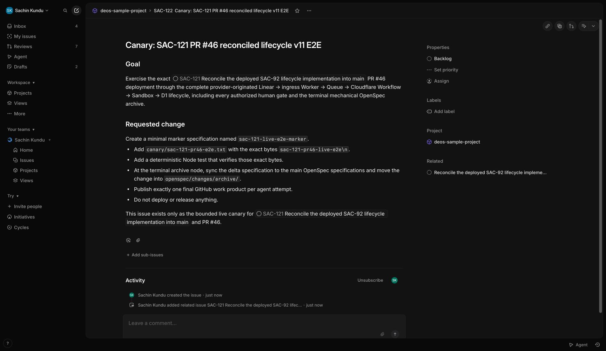
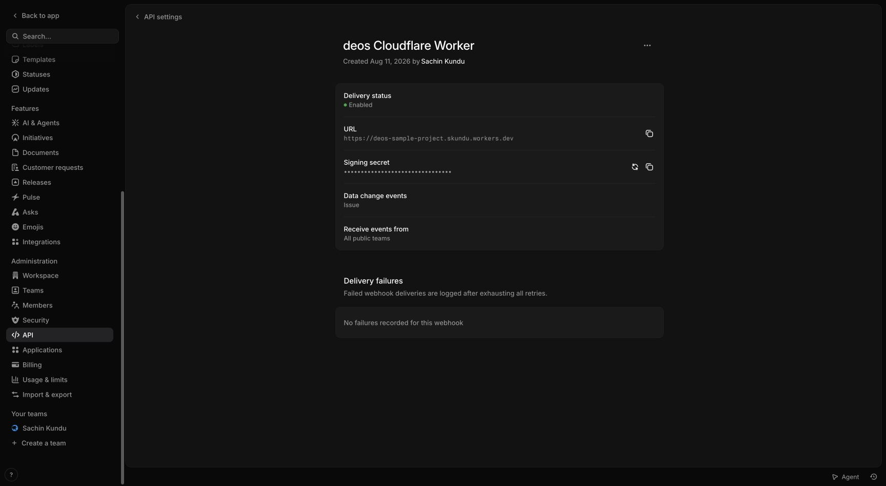
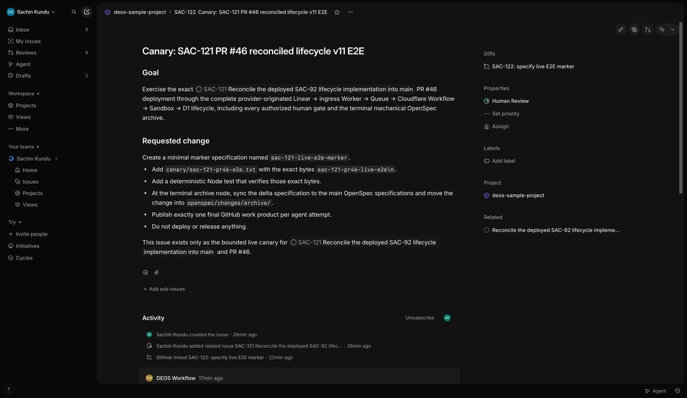

# SAC-121 PR #46 live provider E2E

*2026-08-19T08:44:41Z by Showboat 0.6.1*
<!-- showboat-id: ffb5ca7a-924b-4865-8dca-8910294c450f -->

This record ties a fresh provider-originated Linear canary to the exact PR #46 implementation deployed from commit 75ae7fbb524831638688680f416463c04e43ddfa. DEOS/D1 business state is reported before Cloudflare executor state; synthetic ingress and test results are not used as end-to-end proof.

```bash
set -euo pipefail
set -a
source /Users/sachin/code/deos/.env
set +a
export CLOUDFLARE_API_TOKEN="${CLOUDFLARE_API_TOKEN:-$CLOUDFLARE_TOKEN}"
rtk npx wrangler d1 migrations list DB --remote --config wrangler.queue-consumer-ts.jsonc
rtk npx wrangler d1 execute DB --remote --config wrangler.queue-consumer-ts.jsonc --command "SELECT project_id, definition_id, definition_version, dispatch_enabled, updated_at FROM project_workflow_policies; SELECT COUNT(*) AS active_runs FROM orchestration_runs WHERE status IN ('pending_dispatch', 'active', 'awaiting_human', 'awaiting_capability', 'manual_reconciliation_required'); SELECT COUNT(*) AS live_attempts FROM agent_attempts WHERE state IN ('pending', 'starting', 'running', 'collecting'); PRAGMA foreign_key_check;" --json | jq -c 'map(.results)'
rtk npx wrangler versions list --config wrangler.queue-consumer-ts.jsonc --json | jq -c '.[-1] | {id, created_on: .metadata.created_on}'
```

```output
 ⛅️ wrangler 4.123.0
────────────────────
Resource location: remote 
Migrations to be applied:
┌──────────────────────────────────────┐
│ Name                                 │
├──────────────────────────────────────┤
│ 0008_explicit_business_lifecycle.sql │
└──────────────────────────────────────┘
[[{"project_id":"99426d9b-cda7-4db4-9136-692a95a0b090","definition_id":"openspec-delivery","definition_version":10,"dispatch_enabled":0,"updated_at":"2026-08-18T11:09:56.015Z"}],[{"active_runs":0}],[{"live_attempts":0}],[]]
{"id":"ebc94259-3ee0-485d-b8a2-0d314f09c8cf","created_on":"2026-08-18T11:04:58.614775Z"}
```

Preflight found dispatch disabled, no active business runs or live attempts, a clean foreign-key check, and only the PR migration pending. The migration and Worker deployment therefore proceed while admission remains disabled.

```bash
set -euo pipefail
set -a
source /Users/sachin/code/deos/.env
set +a
export CLOUDFLARE_API_TOKEN="${CLOUDFLARE_API_TOKEN:-$CLOUDFLARE_TOKEN}"
rtk npx wrangler d1 migrations apply DB --remote --config wrangler.queue-consumer-ts.jsonc
rtk npx wrangler deploy --config wrangler.queue-consumer-ts.jsonc --containers-rollout gradual
```

```output
 ⛅️ wrangler 4.123.0 (update available 4.124.0)
───────────────────────────────────────────────
Resource location: remote 
Migrations to be applied:
┌──────────────────────────────────────┐
│ name                                 │
├──────────────────────────────────────┤
│ 0008_explicit_business_lifecycle.sql │
└──────────────────────────────────────┘
? About to apply 1 migration(s)
Your database may not be available to serve requests during the migration, continue?
🤖 Using fallback value in non-interactive context: yes
🌀 Executing on remote database DB (4e854f8a-018a-42c4-a325-c4b8805c06b2):
🌀 To execute on your local development database, remove the --remote flag from your wrangler command.
✘ [ERROR] A request to the Cloudflare API (/accounts/c68856288112af7698f5be52ea94b96e/d1/database/4e854f8a-018a-42c4-a325-c4b8805c06b2/query) failed.
  table workflow_waits already exists at offset 13: SQLITE_ERROR [code: 7500]
  If you think this is a bug, please open an issue at: https://github.com/cloudflare/workers-sdk/issues/new/choose
🪵  Logs were written to "/Users/sachin/Library/Preferences/.wrangler/logs/wrangler-2026-08-19_08-44-57_735.log"
```

The first rollout attempt failed safely before Worker deployment: the target database already contains the lifecycle wait tables from the previously deployed SAC-92 build. This is actionable E2E evidence of a source-reconciliation migration defect; no canary was admitted.

```bash
set -euo pipefail
set -a
source /Users/sachin/code/deos/.env
set +a
export CLOUDFLARE_API_TOKEN="${CLOUDFLARE_API_TOKEN:-$CLOUDFLARE_TOKEN}"
rtk npx wrangler d1 migrations list DB --remote --config wrangler.queue-consumer-ts.jsonc
rtk npx wrangler d1 execute DB --remote --config wrangler.queue-consumer-ts.jsonc --command "SELECT name, sql FROM sqlite_schema WHERE type='table' AND name IN ('orchestration_runs','workflow_waits','workflow_wait_deliveries','workflow_completion_reconciliations') ORDER BY name; SELECT name FROM pragma_table_info('orchestration_runs') ORDER BY cid; SELECT name FROM d1_migrations ORDER BY id; SELECT project_id, definition_version, dispatch_enabled FROM project_workflow_policies;" --json | jq -c 'map(.results)'
```

```output
 ⛅️ wrangler 4.123.0 (update available 4.124.0)
───────────────────────────────────────────────
Resource location: remote 
Migrations to be applied:
┌──────────────────────────────────────┐
│ Name                                 │
├──────────────────────────────────────┤
│ 0008_explicit_business_lifecycle.sql │
└──────────────────────────────────────┘
[[{"name":"orchestration_runs","sql":"CREATE TABLE \"orchestration_runs\" (\n    run_id TEXT PRIMARY KEY,\n    correlation_id TEXT NOT NULL,\n    run_sequence INTEGER NOT NULL CHECK (run_sequence > 0),\n    project_id TEXT NOT NULL,\n    issue_id TEXT NOT NULL,\n    definition_id TEXT NOT NULL,\n    definition_version INTEGER NOT NULL,\n    definition_digest TEXT NOT NULL,\n    workflow_instance_id TEXT NOT NULL UNIQUE,\n    previous_node TEXT,\n    current_node TEXT NOT NULL,\n    gate_origin_node TEXT,\n    status TEXT NOT NULL CHECK (\n        status IN (\n            'pending_dispatch', 'active', 'awaiting_human',\n            'awaiting_capability', 'manual_reconciliation_required',\n            'blocked', 'succeeded', 'denied', 'failed', 'canceled'\n        )\n    ),\n    accumulated_data_json TEXT NOT NULL DEFAULT '{}',\n    created_at TEXT NOT NULL,\n    updated_at TEXT NOT NULL,\n    terminal_at TEXT,\n    terminal_cause TEXT, current_visit_sequence INTEGER NOT NULL DEFAULT 1\nCHECK (current_visit_sequence > 0), last_transition_id TEXT,\n    UNIQUE (project_id, issue_id, run_sequence),\n    FOREIGN KEY (definition_id, definition_version)\n        REFERENCES workflow_definitions(definition_id, version)\n)"},{"name":"workflow_completion_reconciliations","sql":"CREATE TABLE workflow_completion_reconciliations (\n    reconciliation_id TEXT PRIMARY KEY,\n    run_id TEXT NOT NULL,\n    workflow_instance_id TEXT NOT NULL,\n    safe_cause TEXT NOT NULL,\n    observed_executor_status TEXT NOT NULL,\n    observed_run_status TEXT NOT NULL,\n    observed_node TEXT NOT NULL,\n    state TEXT NOT NULL CHECK (state IN ('pending_notice', 'notified', 'conflict')),\n    linear_operation_key TEXT NOT NULL UNIQUE,\n    linear_resource_id TEXT,\n    created_at TEXT NOT NULL,\n    updated_at TEXT NOT NULL,\n    FOREIGN KEY (run_id) REFERENCES orchestration_runs(run_id),\n    UNIQUE (run_id, safe_cause)\n)"},{"name":"workflow_wait_deliveries","sql":"CREATE TABLE workflow_wait_deliveries (\n    delivery_id TEXT PRIMARY KEY,\n    wait_id TEXT NOT NULL,\n    run_id TEXT NOT NULL,\n    decision TEXT NOT NULL CHECK (\n        decision IN ('resumed', 'canceled', 'rejected', 'already_consumed')\n    ),\n    safe_reason TEXT NOT NULL,\n    occurred_at TEXT NOT NULL,\n    FOREIGN KEY (delivery_id) REFERENCES workflow_event_inbox(delivery_id),\n    FOREIGN KEY (wait_id) REFERENCES workflow_waits(wait_id),\n    FOREIGN KEY (run_id) REFERENCES orchestration_runs(run_id)\n)"},{"name":"workflow_waits","sql":"CREATE TABLE workflow_waits (\n    wait_id TEXT PRIMARY KEY,\n    run_id TEXT NOT NULL,\n    node_id TEXT NOT NULL,\n    status TEXT NOT NULL CHECK (status IN ('awaiting', 'consumed', 'canceled')),\n    resume_event_type TEXT NOT NULL,\n    resume_event_json TEXT NOT NULL,\n    resume_event_digest TEXT NOT NULL,\n    cancel_event_type TEXT NOT NULL,\n    cancel_event_json TEXT NOT NULL,\n    cancel_event_digest TEXT NOT NULL,\n    cause_reference TEXT NOT NULL,\n    created_at TEXT NOT NULL,\n    consumed_delivery_id TEXT UNIQUE,\n    consumed_at TEXT,\n    FOREIGN KEY (run_id) REFERENCES orchestration_runs(run_id),\n    FOREIGN KEY (consumed_delivery_id) REFERENCES workflow_event_inbox(delivery_id),\n    UNIQUE (run_id, node_id, wait_id)\n)"}],[{"name":"run_id"},{"name":"correlation_id"},{"name":"run_sequence"},{"name":"project_id"},{"name":"issue_id"},{"name":"definition_id"},{"name":"definition_version"},{"name":"definition_digest"},{"name":"workflow_instance_id"},{"name":"previous_node"},{"name":"current_node"},{"name":"gate_origin_node"},{"name":"status"},{"name":"accumulated_data_json"},{"name":"created_at"},{"name":"updated_at"},{"name":"terminal_at"},{"name":"terminal_cause"},{"name":"current_visit_sequence"},{"name":"last_transition_id"}],[{"name":"0001_initial.sql"},{"name":"0002_workflow_dispatch.sql"},{"name":"0003_queue_consumptions.sql"},{"name":"0004_idempotent_workflow_transitions.sql"},{"name":"0005_workflow_correlation.sql"},{"name":"0006_sandbox_orchestration.sql"},{"name":"0007_explicit_business_lifecycle.sql"},{"name":"0007_workflow_visit_identity.sql"}],[{"project_id":"99426d9b-cda7-4db4-9136-692a95a0b090","definition_version":10,"dispatch_enabled":0}]]
```

The migration was corrected by preserving the already-deployed filename in commit 75ae7fb: remote D1 already records both immutable 0007 migration names, while lexical ordering applies lifecycle before visit identity on a fresh database. All 109 TypeScript tests, 16 Python tests, type generation, and Ruff passed before redeployment.

```bash
set -euo pipefail
set -a
source /Users/sachin/code/deos/.env
set +a
export CLOUDFLARE_API_TOKEN="${CLOUDFLARE_API_TOKEN:-$CLOUDFLARE_TOKEN}"
rtk git rev-parse HEAD
rtk npx wrangler d1 migrations list DB --remote --config wrangler.queue-consumer-ts.jsonc
rtk npx wrangler deploy --config wrangler.queue-consumer-ts.jsonc --containers-rollout gradual
```

```output
75ae7fbb524831638688680f416463c04e43ddfa
 ⛅️ wrangler 4.123.0 (update available 4.124.0)
───────────────────────────────────────────────
Resource location: remote 
✅ No migrations to apply!
 ⛅️ wrangler 4.123.0 (update available 4.124.0)
───────────────────────────────────────────────
Total Upload: 1067.30 KiB / gzip: 223.30 KiB
Worker Startup Time: 8 ms
Your Worker has access to the following bindings:
Binding                                                                              Resource                  
env.Sandbox (Sandbox)                                                                Durable Object            
env.ORCHESTRATION_WORKFLOW (DeosWorkflow)                                            Workflow                  
env.DB (deos-sample-project)                                                         D1 Database               
env.ARTIFACTS (deos-sample-project-artifacts)                                        R2 Bucket                 
env.LINEAR_API_URL ("https://api.linear.app/graphql")                                Environment Variable      
env.LINEAR_HUMAN_APPROVAL_STATE_ID ("71738607-03fd-49f2-b4be-b2aac29ccd13")          Environment Variable      
env.LINEAR_PROJECT_ID ("99426d9b-cda7-4db4-9136-692a95a0b090")                       Environment Variable      
env.LINEAR_START_STATE_NAME ("In Progress")                                          Environment Variable      
env.LINEAR_APPROVAL_STATE_NAMES ("In Progress")                                      Environment Variable      
env.LINEAR_REJECTION_STATE_NAMES ("Canceled")                                        Environment Variable      
env.LINEAR_APP_ACTOR_ID ("f010429f-7734-4f3f-9b4b-13a4abb9b4ab")                     Environment Variable      
env.LINEAR_TEAM_ID ("ac53207d-68c0-42f1-a245-c1baf047f234")                          Environment Variable      
env.GITHUB_API_URL ("https://api.github.com")                                        Environment Variable      
env.TRIAL_REPOSITORY ("sachinkundu/deos")                                            Environment Variable      
env.TRIAL_DISPATCH_ENABLED ("false")                                                 Environment Variable      
env.CODEX_AUTH_PROFILE_ID ("controlled-trial")                                       Environment Variable      
env.CAPABILITY_BASE_URL ("https://deos-queue-consumer-ts.skundu...")                 Environment Variable      
The following containers are available:
- deos-queue-consumer-ts-sandbox (/Users/sachin/code/deos-worktrees/sac-121-reconcile-sac-92-lifecycle/Dockerfile)
Uploaded deos-queue-consumer-ts (6.43 sec)
Building image deos-queue-consumer-ts-sandbox:0ec05ea4
Login Succeeded
Image already exists remotely, skipping push
Untagged: deos-queue-consumer-ts-sandbox:0ec05ea4
╭ Deploy a container application deploy changes to your application
│
│ Container application changes
│
├ no changes deos-queue-consumer-ts-sandbox
│
╰ No changes to be made 
Deployed deos-queue-consumer-ts triggers (6.89 sec)
  https://deos-queue-consumer-ts.skundu.workers.dev
  schedule: */15 * * * *
  Consumer for deos-sample-project-events
  workflow: deos-sandbox-codex-workflow
Current Version ID: 0ec05ea4-5191-492c-b3fe-f60c868112c5
#0 building with "colima" instance using docker driver
#1 [internal] load build definition from Dockerfile
#1 transferring dockerfile: 766B done
#1 DONE 0.0s
#2 [internal] load metadata for docker.io/cloudflare/sandbox:0.13.0-next.738.2@sha256:f4b2137219568aa44539ab93c0e774db6bcab323c134c5088447916e58f15e75
#2 DONE 1.0s
#3 [internal] load .dockerignore
#3 transferring context: 2B done
#3 DONE 0.0s
#4 [internal] load build context
#4 DONE 0.0s
#5 [1/8] FROM docker.io/cloudflare/sandbox:0.13.0-next.738.2@sha256:f4b2137219568aa44539ab93c0e774db6bcab323c134c5088447916e58f15e75
#5 resolve docker.io/cloudflare/sandbox:0.13.0-next.738.2@sha256:f4b2137219568aa44539ab93c0e774db6bcab323c134c5088447916e58f15e75
#5 resolve docker.io/cloudflare/sandbox:0.13.0-next.738.2@sha256:f4b2137219568aa44539ab93c0e774db6bcab323c134c5088447916e58f15e75 0.7s done
#5 DONE 0.7s
#4 [internal] load build context
#4 transferring context: 204B done
#4 DONE 0.0s
#6 [2/8] RUN npm install --global --omit=dev @openai/codex@0.147.0 @fission-ai/openspec@1.8.0
#6 CACHED
#7 [4/8] COPY container/supervisor.mjs /deos/bin/supervisor.mjs
#7 CACHED
#8 [5/8] COPY container/patch-capture.mjs /deos/bin/patch-capture.mjs
#8 CACHED
#9 [6/8] COPY container/deos-github /usr/local/bin/deos-github
#9 CACHED
#10 [7/8] COPY container/deos-linear /usr/local/bin/deos-linear
#10 CACHED
#11 [3/8] RUN mkdir -p /deos/bin /deos/staging /deos/jobs /deos/auth     && chmod 700 /deos/auth     && chmod 755 /deos/bin /deos/staging /deos/jobs
#11 CACHED
#12 [8/8] RUN chmod 755 /deos/bin/supervisor.mjs /usr/local/bin/deos-github /usr/local/bin/deos-linear     && codex --version     && openspec --version
#12 CACHED
#13 exporting to image
#13 exporting layers done
#13 exporting manifest sha256:5a8186dc62b3d354ffd79bdf490ca0677748f108c37401e1d65dcf0a85085656 done
#13 exporting config sha256:ecf2f04d5580b07a6c6e8b3dde4b2b4d31eaf32b6fe36c1db7336e6912f1abbf done
#13 naming to docker.io/library/deos-queue-consumer-ts-sandbox:0ec05ea4 done
#13 DONE 0.0s
WARNING! Your credentials are stored unencrypted in '/Users/sachin/.docker/config.json'.
Configure a credential helper to remove this warning. See
https://docs.docker.com/go/credential-store/
```

The corrected exact PR head deployed successfully as Worker version 0ec05ea4-5191-492c-b3fe-f60c868112c5 with dispatch still disabled.

```bash
set -euo pipefail
set -a
source /Users/sachin/code/deos/.env
set +a
export CLOUDFLARE_API_TOKEN="${CLOUDFLARE_API_TOKEN:-$CLOUDFLARE_TOKEN}"
rtk npx wrangler d1 execute DB --remote --config wrangler.queue-consumer-ts.jsonc --command "SELECT project_id, definition_id, definition_version, dispatch_enabled FROM project_workflow_policies; SELECT name FROM d1_migrations WHERE name IN ('0007_explicit_business_lifecycle.sql','0007_workflow_visit_identity.sql') ORDER BY name; SELECT name FROM pragma_table_info('orchestration_runs') WHERE name IN ('current_visit_sequence','last_transition_id','terminal_cause') ORDER BY name; SELECT name FROM sqlite_schema WHERE type='table' AND name IN ('workflow_waits','workflow_wait_deliveries','workflow_completion_reconciliations') ORDER BY name; PRAGMA foreign_key_check;" --json | jq -c 'map(.results)'
rtk npx wrangler versions list --config wrangler.queue-consumer-ts.jsonc --json | jq -c '.[-1] | {id, created_on: .metadata.created_on}'
```

```output
[[{"project_id":"99426d9b-cda7-4db4-9136-692a95a0b090","definition_id":"openspec-delivery","definition_version":10,"dispatch_enabled":0}],[{"name":"0007_explicit_business_lifecycle.sql"},{"name":"0007_workflow_visit_identity.sql"}],[{"name":"current_visit_sequence"},{"name":"last_transition_id"},{"name":"terminal_cause"}],[{"name":"workflow_completion_reconciliations"},{"name":"workflow_wait_deliveries"},{"name":"workflow_waits"}],[]]
{"id":"0ec05ea4-5191-492c-b3fe-f60c868112c5","created_on":"2026-08-19T08:47:12.391108Z"}
```

Linear visual proof before admission: SAC-122 is a dedicated issue in deos-sample-project and remains Backlog while dispatch is disabled.

```bash {image}

```



Linear provider configuration is enabled for Issue events, targets the public Python ingress Worker, and shows no exhausted delivery failures. The signing secret remains masked.

```bash {image}

```



After exact deployment and visual preconditions, the single configured test-project policy is enabled for the bounded SAC-122 canary. The following update is guarded by definition version 10, dispatch disabled, and zero active runs; the first real delivery will register and freeze version 11 before allocating the run.

```bash
set -euo pipefail
set -a
source /Users/sachin/code/deos/.env
set +a
export CLOUDFLARE_API_TOKEN="${CLOUDFLARE_API_TOKEN:-$CLOUDFLARE_TOKEN}"
rtk npx wrangler d1 execute DB --remote --config wrangler.queue-consumer-ts.jsonc --command "UPDATE project_workflow_policies SET dispatch_enabled = 1, updated_at = datetime('now') WHERE project_id = '99426d9b-cda7-4db4-9136-692a95a0b090' AND definition_version = 10 AND dispatch_enabled = 0 AND NOT EXISTS (SELECT 1 FROM orchestration_runs WHERE status IN ('pending_dispatch','active','awaiting_human','awaiting_capability','manual_reconciliation_required')); SELECT changes() AS enabled_rows; SELECT project_id, definition_version, dispatch_enabled FROM project_workflow_policies WHERE project_id = '99426d9b-cda7-4db4-9136-692a95a0b090';" --json | jq -c 'map(.results)'
```

```output
[[],[{"enabled_rows":1}],[{"project_id":"99426d9b-cda7-4db4-9136-692a95a0b090","definition_version":10,"dispatch_enabled":1}]]
```

At 2026-08-19T08:49:44.315Z, Linear MCP moved SAC-122 from Backlog to In Progress. This is the provider action; no request was sent directly to either Worker.

```bash
set -euo pipefail
set -a
source /Users/sachin/code/deos/.env
set +a
export CLOUDFLARE_API_TOKEN="${CLOUDFLARE_API_TOKEN:-$CLOUDFLARE_TOKEN}"
rtk npx wrangler d1 execute DB --remote --config wrangler.queue-consumer-ts.jsonc --command "SELECT r.run_id, r.issue_id, r.current_node, r.current_visit_sequence, r.status, r.definition_version, d.source_delivery_id, d.state AS dispatch_state FROM orchestration_runs AS r JOIN dispatch_intents AS d ON d.run_id = r.run_id WHERE r.issue_id = '821ebfa1-14ad-4ba9-8922-3f645655ef3f' OR r.correlation_id LIKE '%SAC-122%'; SELECT delivery_id, classification, received_at FROM deliveries WHERE received_at >= '2026-08-19T08:49:40Z' ORDER BY received_at; SELECT project_id, definition_version, definition_digest, dispatch_enabled FROM project_workflow_policies WHERE project_id = '99426d9b-cda7-4db4-9136-692a95a0b090';" --json | jq -c 'map(.results)'
```

```output
[[],[{"delivery_id":"eeccd2da-6d61-403e-80ea-d51068d5a447","classification":"relevant","received_at":"2026-08-19T08:49:44.825999+00:00"}],[{"project_id":"99426d9b-cda7-4db4-9136-692a95a0b090","definition_version":11,"definition_digest":"e85de9ed70c046cfe07a1611b1e0a1c2678cd58dbcfe8edc9ea73856bb6b86c3","dispatch_enabled":1}]]
```

```bash
set -euo pipefail
set -a
source /Users/sachin/code/deos/.env
set +a
export CLOUDFLARE_API_TOKEN="${CLOUDFLARE_API_TOKEN:-$CLOUDFLARE_TOKEN}"
rtk npx wrangler d1 execute DB --remote --config wrangler.queue-consumer-ts.jsonc --command "SELECT r.run_id, r.issue_id, r.workflow_instance_id, r.current_node, r.current_visit_sequence, r.status, r.definition_version, d.source_delivery_id, d.state AS dispatch_state FROM orchestration_runs AS r JOIN dispatch_intents AS d ON d.run_id = r.run_id WHERE r.created_at >= '2026-08-19T08:49:40Z' ORDER BY r.created_at; SELECT delivery_id, run_id, event_kind, to_state_name, state, provider_time FROM workflow_event_inbox WHERE delivery_id = 'eeccd2da-6d61-403e-80ea-d51068d5a447';" --json | jq -c 'map(.results)'
```

```output
[[{"run_id":"workflow:99426d9b-cda7-4db4-9136-692a95a0b090:6936d743-1f5d-451a-92cf-402956b22be8:run:1","issue_id":"6936d743-1f5d-451a-92cf-402956b22be8","workflow_instance_id":"wf-v1-haolo4e25ytjnpw7jwbcxmb6cvhf4z6rgjswuz6xpb6cnqw2lzfq","current_node":"requirements","current_visit_sequence":1,"status":"active","definition_version":11,"source_delivery_id":"eeccd2da-6d61-403e-80ea-d51068d5a447","dispatch_state":"established"}],[]]
```

Remote D1 proves the real Linear delivery was classified relevant, registered definition version 11, allocated exactly one run, and established the Cloudflare Workflow mapping. Admission is closed immediately; the admitted run continues independently.

```bash
set -euo pipefail
set -a
source /Users/sachin/code/deos/.env
set +a
export CLOUDFLARE_API_TOKEN="${CLOUDFLARE_API_TOKEN:-$CLOUDFLARE_TOKEN}"
rtk npx wrangler d1 execute DB --remote --config wrangler.queue-consumer-ts.jsonc --command "UPDATE project_workflow_policies SET dispatch_enabled = 0, updated_at = datetime('now') WHERE project_id = '99426d9b-cda7-4db4-9136-692a95a0b090' AND definition_version = 11 AND dispatch_enabled = 1; SELECT changes() AS disabled_rows; SELECT project_id, definition_version, definition_digest, dispatch_enabled FROM project_workflow_policies WHERE project_id = '99426d9b-cda7-4db4-9136-692a95a0b090'; SELECT run_id, current_node, current_visit_sequence, status, definition_version FROM orchestration_runs WHERE issue_id = '6936d743-1f5d-451a-92cf-402956b22be8';" --json | jq -c 'map(.results)'
```

```output
[[],[{"disabled_rows":1}],[{"project_id":"99426d9b-cda7-4db4-9136-692a95a0b090","definition_version":11,"definition_digest":"e85de9ed70c046cfe07a1611b1e0a1c2678cd58dbcfe8edc9ea73856bb6b86c3","dispatch_enabled":0}],[{"run_id":"workflow:99426d9b-cda7-4db4-9136-692a95a0b090:6936d743-1f5d-451a-92cf-402956b22be8:run:1","current_node":"requirements","current_visit_sequence":1,"status":"active","definition_version":11}]]
```

SAC-122 reached the first explicit authority boundary after a real change-request loop. Linear visibly shows Human Review and the provider-linked requirements work product PR #47; D1 reports awaiting_human at requirements_approval visit 5.

```bash {image}

```



Linear MCP supplied only the three explicit human approvals. The final approval admitted the bounded /opsx:archive job for trusted change sac-122; no deploy or release action was authorized. The following remote D1 queries are the authoritative business-state proof.

```bash
set -euo pipefail
set -a
source /Users/sachin/code/deos/.env
set +a
export CLOUDFLARE_API_TOKEN="${CLOUDFLARE_API_TOKEN:-$CLOUDFLARE_TOKEN}"
RUN_ID="workflow:99426d9b-cda7-4db4-9136-692a95a0b090:6936d743-1f5d-451a-92cf-402956b22be8:run:1"
rtk npx wrangler d1 execute DB --remote --config wrangler.queue-consumer-ts.jsonc --command "SELECT run_id, workflow_instance_id, definition_version, definition_digest, previous_node, current_node, current_visit_sequence, status, terminal_at, terminal_cause FROM orchestration_runs WHERE run_id = '$RUN_ID'; SELECT d.delivery_id, d.classification, d.received_at, i.state AS dispatch_state FROM deliveries AS d JOIN dispatch_intents AS i ON i.source_delivery_id = d.delivery_id WHERE i.run_id = '$RUN_ID'; SELECT node_id, state, cleanup_state, result_class, manifest_id FROM agent_attempts WHERE run_id = '$RUN_ID' ORDER BY created_at; SELECT from_node, to_node, from_visit_sequence, to_visit_sequence, cause_type, occurred_at FROM workflow_transitions_v2 WHERE run_id = '$RUN_ID' ORDER BY from_visit_sequence; SELECT COUNT(*) AS repeated_requirements_review_edges FROM workflow_transitions_v2 WHERE run_id = '$RUN_ID' AND from_node = 'requirements' AND to_node = 'requirements_review'; SELECT COUNT(*) AS live_attempts FROM agent_attempts WHERE run_id = '$RUN_ID' AND state IN ('pending','starting','running','collecting'); SELECT COUNT(*) AS pending_cleanup FROM agent_attempts WHERE run_id = '$RUN_ID' AND cleanup_state <> 'destroyed'; SELECT COUNT(*) AS forbidden_agent_nodes FROM agent_attempts WHERE run_id = '$RUN_ID' AND (lower(node_id) LIKE '%deploy%' OR lower(node_id) LIKE '%release%'); SELECT COUNT(*) AS forbidden_transitions FROM workflow_transitions_v2 WHERE run_id = '$RUN_ID' AND (lower(from_node) LIKE '%deploy%' OR lower(to_node) LIKE '%deploy%' OR lower(from_node) LIKE '%release%' OR lower(to_node) LIKE '%release%'); SELECT capability, action, state, COUNT(*) AS operation_count FROM provider_operations WHERE run_id = '$RUN_ID' GROUP BY capability, action, state ORDER BY capability, action, state; SELECT node_id, json_extract(job_spec_json, '$.openspecInstruction') AS openspec_instruction, json_extract(job_spec_json, '$.openspecChange') AS openspec_change, state, cleanup_state, result_class, manifest_id FROM agent_attempts WHERE run_id = '$RUN_ID' AND node_id = 'sync_and_archive'; SELECT manifest_id, state, aggregate_digest, object_count, total_bytes, completed_at FROM artifact_manifests WHERE manifest_id = 'manifest:01a01985-f144-7970-953c-1ec03a29d0f3'; SELECT logical_name, byte_size, sha256, policy_outcome FROM artifacts WHERE manifest_id = 'manifest:01a01985-f144-7970-953c-1ec03a29d0f3' ORDER BY logical_name; SELECT project_id, definition_version, dispatch_enabled FROM project_workflow_policies WHERE project_id = '99426d9b-cda7-4db4-9136-692a95a0b090'; PRAGMA foreign_key_check;" --json | jq -c 'map(.results)'
```

```output
[[{"run_id":"workflow:99426d9b-cda7-4db4-9136-692a95a0b090:6936d743-1f5d-451a-92cf-402956b22be8:run:1","workflow_instance_id":"wf-v1-haolo4e25ytjnpw7jwbcxmb6cvhf4z6rgjswuz6xpb6cnqw2lzfq","definition_version":11,"definition_digest":"e85de9ed70c046cfe07a1611b1e0a1c2678cd58dbcfe8edc9ea73856bb6b86c3","previous_node":"sync_and_archive","current_node":"done","current_visit_sequence":19,"status":"succeeded","terminal_at":"2026-08-19T10:22:15.220Z","terminal_cause":null}],[{"delivery_id":"eeccd2da-6d61-403e-80ea-d51068d5a447","classification":"relevant","received_at":"2026-08-19T08:49:44.825999+00:00","dispatch_state":"established"}],[{"node_id":"requirements","state":"completed","cleanup_state":"destroyed","result_class":"completed","manifest_id":"manifest:01a01936-8b0f-778c-b6bd-5929070a1edf"},{"node_id":"requirements_review","state":"completed","cleanup_state":"destroyed","result_class":"changes_requested","manifest_id":"manifest:01a0193b-79bd-7ff2-bff9-5ed9a2a84adc"},{"node_id":"requirements","state":"completed","cleanup_state":"destroyed","result_class":"completed","manifest_id":"manifest:01a01941-86a3-7b1d-b3b3-5f410a09306c"},{"node_id":"requirements_review","state":"completed","cleanup_state":"destroyed","result_class":"approved","manifest_id":"manifest:01a01946-7c03-7694-8383-ff788580fc33"},{"node_id":"openspec_proposal","state":"completed","cleanup_state":"destroyed","result_class":"completed","manifest_id":"manifest:01a0194c-b5bc-747b-a3db-a0fb1f157107"},{"node_id":"openspec_specs","state":"completed","cleanup_state":"destroyed","result_class":"completed","manifest_id":"manifest:01a01951-b441-7619-bb5d-438904ba4a73"},{"node_id":"bdd_review","state":"completed","cleanup_state":"destroyed","result_class":"approved","manifest_id":"manifest:01a01957-01ec-7de7-9a0f-999bfcc408f5"},{"node_id":"ddd_architecture","state":"completed","cleanup_state":"destroyed","result_class":"completed","manifest_id":"manifest:01a0195c-06ec-7a73-b1e3-5e73f7858f31"},{"node_id":"ddd_review","state":"completed","cleanup_state":"destroyed","result_class":"approved","manifest_id":"manifest:01a01961-1521-7a07-b1e0-277261c702fb"},{"node_id":"openspec_tasks","state":"completed","cleanup_state":"destroyed","result_class":"completed","manifest_id":"manifest:01a01967-32ac-7f5f-954e-34980cb1c9ea"},{"node_id":"implementation","state":"completed","cleanup_state":"destroyed","result_class":"completed","manifest_id":"manifest:01a0196c-3acd-7fae-b08a-db4cc2020ddf"},{"node_id":"code_review","state":"completed","cleanup_state":"destroyed","result_class":"approved","manifest_id":"manifest:01a01971-445c-7893-a141-aa99c6f1d60c"},{"node_id":"evidence_verification","state":"completed","cleanup_state":"destroyed","result_class":"certified","manifest_id":"manifest:01a0197a-f032-7aec-8c8a-126c0cdac048"},{"node_id":"openspec_verify","state":"completed","cleanup_state":"destroyed","result_class":"completed","manifest_id":"manifest:01a01980-01e6-75d5-8c11-d2752a550ea1"},{"node_id":"sync_and_archive","state":"completed","cleanup_state":"destroyed","result_class":"completed","manifest_id":"manifest:01a01985-f144-7970-953c-1ec03a29d0f3"}],[{"from_node":"requirements","to_node":"requirements_review","from_visit_sequence":1,"to_visit_sequence":2,"cause_type":"agent","occurred_at":"2026-08-19T08:55:22.557Z"},{"from_node":"requirements_review","to_node":"requirements","from_visit_sequence":2,"to_visit_sequence":3,"cause_type":"agent","occurred_at":"2026-08-19T09:01:58.988Z"},{"from_node":"requirements","to_node":"requirements_review","from_visit_sequence":3,"to_visit_sequence":4,"cause_type":"agent","occurred_at":"2026-08-19T09:07:23.949Z"},{"from_node":"requirements_review","to_node":"requirements_approval","from_visit_sequence":4,"to_visit_sequence":5,"cause_type":"agent","occurred_at":"2026-08-19T09:13:10.193Z"},{"from_node":"requirements_approval","to_node":"openspec_proposal","from_visit_sequence":5,"to_visit_sequence":6,"cause_type":"linear_event","occurred_at":"2026-08-19T09:14:11.849Z"},{"from_node":"openspec_proposal","to_node":"openspec_specs","from_visit_sequence":6,"to_visit_sequence":7,"cause_type":"agent","occurred_at":"2026-08-19T09:19:39.297Z"},{"from_node":"openspec_specs","to_node":"bdd_review","from_visit_sequence":7,"to_visit_sequence":8,"cause_type":"agent","occurred_at":"2026-08-19T09:25:26.898Z"},{"from_node":"bdd_review","to_node":"ddd_architecture","from_visit_sequence":8,"to_visit_sequence":9,"cause_type":"agent","occurred_at":"2026-08-19T09:30:55.840Z"},{"from_node":"ddd_architecture","to_node":"ddd_review","from_visit_sequence":9,"to_visit_sequence":10,"cause_type":"agent","occurred_at":"2026-08-19T09:36:27.143Z"},{"from_node":"ddd_review","to_node":"architecture_approval","from_visit_sequence":10,"to_visit_sequence":11,"cause_type":"agent","occurred_at":"2026-08-19T09:42:16.359Z"},{"from_node":"architecture_approval","to_node":"openspec_tasks","from_visit_sequence":11,"to_visit_sequence":12,"cause_type":"linear_event","occurred_at":"2026-08-19T09:43:07.769Z"},{"from_node":"openspec_tasks","to_node":"implementation","from_visit_sequence":12,"to_visit_sequence":13,"cause_type":"agent","occurred_at":"2026-08-19T09:48:37.674Z"},{"from_node":"implementation","to_node":"code_review","from_visit_sequence":13,"to_visit_sequence":14,"cause_type":"agent","occurred_at":"2026-08-19T09:54:07.824Z"},{"from_node":"code_review","to_node":"evidence_verification","from_visit_sequence":14,"to_visit_sequence":15,"cause_type":"agent","occurred_at":"2026-08-19T10:04:41.499Z"},{"from_node":"evidence_verification","to_node":"openspec_verify","from_visit_sequence":15,"to_visit_sequence":16,"cause_type":"agent","occurred_at":"2026-08-19T10:10:13.873Z"},{"from_node":"openspec_verify","to_node":"final_approval","from_visit_sequence":16,"to_visit_sequence":17,"cause_type":"agent","occurred_at":"2026-08-19T10:16:05.281Z"},{"from_node":"final_approval","to_node":"sync_and_archive","from_visit_sequence":17,"to_visit_sequence":18,"cause_type":"linear_event","occurred_at":"2026-08-19T10:16:42.666Z"},{"from_node":"sync_and_archive","to_node":"done","from_visit_sequence":18,"to_visit_sequence":19,"cause_type":"agent","occurred_at":"2026-08-19T10:22:15.220Z"}],[{"repeated_requirements_review_edges":2}],[{"live_attempts":0}],[{"pending_cleanup":0}],[{"forbidden_agent_nodes":0}],[{"forbidden_transitions":0}],[{"capability":"github","action":"publish_work_product","state":"succeeded","operation_count":3},{"capability":"linear","action":"upsert_working_note","state":"succeeded","operation_count":6},{"capability":"linear.transition","action":"enter_human_gate","state":"succeeded","operation_count":3}],[{"node_id":"sync_and_archive","openspec_instruction":"/opsx:archive","openspec_change":"sac-122","state":"completed","cleanup_state":"destroyed","result_class":"completed","manifest_id":"manifest:01a01985-f144-7970-953c-1ec03a29d0f3"}],[{"manifest_id":"manifest:01a01985-f144-7970-953c-1ec03a29d0f3","state":"complete","aggregate_digest":"34469c15c6a087f462581996f1fccf52145c7399164204c00dafd8e04ada4179","object_count":5,"total_bytes":87533,"completed_at":"2026-08-19T10:22:14.003Z"}],[{"logical_name":"patch.diff","byte_size":20523,"sha256":"c162c475dfbefdff4917ef9e99cc16ccefa1ffd50a4f5451744e4f6ac7df8e1f","policy_outcome":"accepted"},{"logical_name":"provider-references.json","byte_size":3,"sha256":"37517e5f3dc66819f61f5a7bb8ace1921282415f10551d2defa5c3eb0985b570","policy_outcome":"accepted"},{"logical_name":"result.json","byte_size":738,"sha256":"a21d0975d5cffaeb848371623bb9a1a9b1f5ea4c7d98cadb66247445decfdf94","policy_outcome":"accepted"},{"logical_name":"transcript.jsonl","byte_size":64763,"sha256":"eb43dccebc56035ce6784ce1522f12616b1bc28ee2e13656f2fdf4d87328e068","policy_outcome":"accepted"},{"logical_name":"validation.txt","byte_size":1506,"sha256":"24089e33d844348f6d0e32c0d557be0dccd3da6137d4bdb081d6cbb51f69721b","policy_outcome":"accepted"}],[{"project_id":"99426d9b-cda7-4db4-9136-692a95a0b090","definition_version":11,"dispatch_enabled":0}],[]]
```

Only after the D1 business state proves done/succeeded do we inspect Cloudflare executor state and the deployed version.

```bash
set -euo pipefail
set -a
source /Users/sachin/code/deos/.env
set +a
export CLOUDFLARE_API_TOKEN="${CLOUDFLARE_API_TOKEN:-$CLOUDFLARE_TOKEN}"
rtk npx wrangler versions list --config wrangler.queue-consumer-ts.jsonc --json | jq -c '.[-1] | {id, created_on: .metadata.created_on}'
rtk npx wrangler workflows instances describe deos-sandbox-codex-workflow wf-v1-haolo4e25ytjnpw7jwbcxmb6cvhf4z6rgjswuz6xpb6cnqw2lzfq --config wrangler.queue-consumer-ts.jsonc | sed -n '1,14p'
```

```output
{"id":"0ec05ea4-5191-492c-b3fe-f60c868112c5","created_on":"2026-08-19T08:47:12.391108Z"}
 ⛅️ wrangler 4.123.0 (update available 4.124.0)
───────────────────────────────────────────────
Describing latest instance:
Workflow Name:         deos-sandbox-codex-workflow
Instance Id:           wf-v1-haolo4e25ytjnpw7jwbcxmb6cvhf4z6rgjswuz6xpb6cnqw2lzfq
Version Id:            a990a02a-d43f-4edd-9cc6-9f3485b25bf5
Status:                ✅ Completed
Trigger:               🔗 Binding
Queued:                8/19/2026, 11:49:55 AM
Success:               ✅ Yes
Start:                 8/19/2026, 11:49:59 AM
End:                   8/19/2026, 1:22:15 PM
Duration:              2 hours
Last Successful Step:  authority:workflow:99426d9b-cda7-4db4-9136-692a95a0b090:6936d743-1f5d-451a-92cf-402956b22be8:run:1-38
```

The bounded telemetry helper correlates the provider delivery and exact issue UUID without exposing webhook payloads, request headers, credentials, or unrelated account events.

```bash
rtk /Users/sachin/code/deos/.venv/bin/python .agents/skills/linear-workflow-telemetry/scripts/query_workflow_telemetry.py --issue-key SAC-122 --issue-id 6936d743-1f5d-451a-92cf-402956b22be8 --env-file /Users/sachin/code/deos/.env
```

```output
Linear issue: SAC-122
Linear issue UUID: 6936d743-1f5d-451a-92cf-402956b22be8
Correlation ID: workflow:99426d9b-cda7-4db4-9136-692a95a0b090:6936d743-1f5d-451a-92cf-402956b22be8
Delivery IDs: b9e48001-e3d4-45b1-ba67-31bc69d9b8f1, eeccd2da-6d61-403e-80ea-d51068d5a447
Queue message IDs: 63d69b2009464f0f5f578c6e7bb02d9f
UTC window: 2026-08-12T10:23:43.642641Z -> 2026-08-19T10:23:43.642641Z
Events: 11

TIME                        | SERVICE                | STAGE                   | OUTCOME   | ATTEMPT | TRANSITION | ERROR
----------------------------+------------------------+-------------------------+-----------+---------+------------+------
2026-08-19T08:49:44.860000Z | deos-sample-project    | ingress.delivery_record | succeeded | -       | -          | -    
2026-08-19T08:55:21.997Z    | deos-queue-consumer-ts | sandbox.cleanup         | succeeded | -       | -          | -    
2026-08-19T08:56:30.437Z    | deos-queue-consumer-ts | provider.operation      | succeeded | -       | -          | -    
2026-08-19T09:07:23.883Z    | deos-queue-consumer-ts | artifact.manifest       | succeeded | -       | -          | -    
2026-08-19T09:13:10.504Z    | deos-queue-consumer-ts | workflow.step           | succeeded | -       | -          | -    
2026-08-19T09:25:26.489Z    | deos-queue-consumer-ts | sandbox.cleanup         | succeeded | -       | -          | -    
2026-08-19T09:42:59.352000Z | deos-sample-project    | ingress.delivery_record | succeeded | -       | -          | -    
2026-08-19T09:43:05.842Z    | deos-queue-consumer-ts | queue.consume           | started   | 1       | -          | -    
2026-08-19T09:48:37.581Z    | deos-queue-consumer-ts | artifact.manifest       | succeeded | -       | -          | -    
2026-08-19T09:48:50.696Z    | deos-queue-consumer-ts | sandbox.attempt         | running   | -       | -          | -    
2026-08-19T10:22:15.163Z    | deos-queue-consumer-ts | codex.outcome           | succeeded | -       | -          | -    
```

The terminal patch is retrieved from private R2 into a protected temporary directory, verified against the D1 SHA-256, and inspected only for the requested marker, main-spec sync, and archived change paths.

```bash
set -euo pipefail
set -a
source /Users/sachin/code/deos/.env
set +a
export CLOUDFLARE_API_TOKEN="${CLOUDFLARE_API_TOKEN:-$CLOUDFLARE_TOKEN}"
task_tmp="$(rtk mktemp -d)"
case "$task_tmp" in /tmp/*|/private/tmp/*|/var/folders/*) ;; *) exit 1 ;; esac
trap 'rtk rm -rf -- "$task_tmp"' EXIT
r2_key="$(rtk npx wrangler d1 execute DB --remote --config wrangler.queue-consumer-ts.jsonc --command "SELECT r2_key FROM artifacts WHERE manifest_id = 'manifest:01a01985-f144-7970-953c-1ec03a29d0f3' AND logical_name = 'patch.diff';" --json | jq -r '.[0].results[0].r2_key')"
r2_cli_key="${r2_key//%/%25}"
rtk npx wrangler r2 object get "deos-sample-project-artifacts/$r2_cli_key" --remote --config wrangler.queue-consumer-ts.jsonc --file "$task_tmp/patch.diff" >/dev/null
rtk shasum -a 256 "$task_tmp/patch.diff"
rtk rg -n 'canary/sac-121-pr46-e2e.txt|tests/sac-121-pr46-e2e.test.ts|openspec/specs/sac-121-live-e2e-marker/spec.md|openspec/changes/archive/.*/sac-122' "$task_tmp/patch.diff" | sed -n '1,20p'
```

```output
c162c475dfbefdff4917ef9e99cc16ccefa1ffd50a4f5451744e4f6ac7df8e1f  /var/folders/mb/_rbgs37911b7gq5w34f8rgp40000gn/T/tmp.qreE8wMQSq/patch.diff
1:diff --git a/canary/sac-121-pr46-e2e.txt b/canary/sac-121-pr46-e2e.txt
5:+++ b/canary/sac-121-pr46-e2e.txt
44:+The implementation will add `canary/sac-121-pr46-e2e.txt` containing the UTF-8/ASCII byte sequence for `sac-121-pr46-live-e2e` followed by exactly one line-feed byte. A plain file makes the canary directly reviewable and avoids generation-time variability. Generating the marker during tests was rejected because it would test generated data rather than committed repository state.
57:+tests/sac-121-pr46-e2e.test.ts
61:+canary/sac-121-pr46-e2e.txt ---- strict Buffer equality ---- expected bytes
83:+| Marker file | Path: `canary/sac-121-pr46-e2e.txt`; bytes: `73 61 63 2d 31 32 31 2d 70 72 34 36 2d 6c 69 76 65 2d 65 32 65 0a` |
112:+- Add a marker file at `canary/sac-121-pr46-e2e.txt` with the exact bytes `sac-121-pr46-live-e2e\n`.
150:+The repository SHALL contain `canary/sac-121-pr46-e2e.txt` with the exact bytes `sac-121-pr46-live-e2e\n`, where `\n` is one trailing line-feed byte and no other bytes are present.
195:+- [x] 1.1 Add `canary/sac-121-pr46-e2e.txt` with the exact bytes `sac-121-pr46-live-e2e\n`.
199:+- [x] 2.1 Add `tests/sac-121-pr46-e2e.test.ts` that resolves the marker relative to `import.meta.url`, reads it without text decoding, and strictly compares its `Buffer` with the complete expected byte sequence.
250:+This change is limited to `canary/sac-121-pr46-e2e.txt`, a deterministic Node test, and the corresponding OpenSpec artifacts. It does not alter runtime APIs, dependencies, deployments, or releases.
266:+The repository SHALL contain `canary/sac-121-pr46-e2e.txt` with the exact bytes `sac-121-pr46-live-e2e\n`, where `\n` is one trailing line-feed byte and no other bytes are present.
311:+- [ ] 1.1 Add `canary/sac-121-pr46-e2e.txt` with the exact bytes `sac-121-pr46-live-e2e\n`.
321:diff --git a/openspec/specs/sac-121-live-e2e-marker/spec.md b/openspec/specs/sac-121-live-e2e-marker/spec.md
325:+++ b/openspec/specs/sac-121-live-e2e-marker/spec.md
336:+The repository SHALL contain `canary/sac-121-pr46-e2e.txt` with the exact bytes `sac-121-pr46-live-e2e\n`, where `\n` is one trailing line-feed byte and no other bytes are present.
373:diff --git a/tests/sac-121-pr46-e2e.test.ts b/tests/sac-121-pr46-e2e.test.ts
377:+++ b/tests/sac-121-pr46-e2e.test.ts
383:+const markerUrl = new URL("../canary/sac-121-pr46-e2e.txt", import.meta.url);
```

```bash
set -euo pipefail
set -a
source /Users/sachin/code/deos/.env
set +a
export CLOUDFLARE_API_TOKEN="${CLOUDFLARE_API_TOKEN:-$CLOUDFLARE_TOKEN}"
task_tmp="$(rtk mktemp -d)"
case "$task_tmp" in /tmp/*|/private/tmp/*|/var/folders/*) ;; *) exit 1 ;; esac
trap 'rtk rm -rf -- "$task_tmp"' EXIT
r2_key="$(rtk npx wrangler d1 execute DB --remote --config wrangler.queue-consumer-ts.jsonc --command "SELECT r2_key FROM artifacts WHERE manifest_id = 'manifest:01a01985-f144-7970-953c-1ec03a29d0f3' AND logical_name = 'patch.diff';" --json | jq -r '.[0].results[0].r2_key')"
r2_cli_key="${r2_key//%/%25}"
rtk npx wrangler r2 object get "deos-sample-project-artifacts/$r2_cli_key" --remote --config wrangler.queue-consumer-ts.jsonc --file "$task_tmp/patch.diff" >/dev/null
rtk rg -n '^diff --git a/openspec/changes/archive/|^diff --git a/openspec/specs/sac-121-live-e2e-marker/spec.md|^diff --git a/canary/sac-121-pr46-e2e.txt|^diff --git a/tests/sac-121-pr46-e2e.test.ts' "$task_tmp/patch.diff"
```

```output
1:diff --git a/canary/sac-121-pr46-e2e.txt b/canary/sac-121-pr46-e2e.txt
8:diff --git a/openspec/changes/archive/2026-08-19-sac-122/.openspec.yaml b/openspec/changes/archive/2026-08-19-sac-122/.openspec.yaml
16:diff --git a/openspec/changes/archive/2026-08-19-sac-122/design.md b/openspec/changes/archive/2026-08-19-sac-122/design.md
100:diff --git a/openspec/changes/archive/2026-08-19-sac-122/proposal.md b/openspec/changes/archive/2026-08-19-sac-122/proposal.md
137:diff --git a/openspec/changes/archive/2026-08-19-sac-122/specs/sac-121-live-e2e-marker/spec.md b/openspec/changes/archive/2026-08-19-sac-122/specs/sac-121-live-e2e-marker/spec.md
187:diff --git a/openspec/changes/archive/2026-08-19-sac-122/tasks.md b/openspec/changes/archive/2026-08-19-sac-122/tasks.md
321:diff --git a/openspec/specs/sac-121-live-e2e-marker/spec.md b/openspec/specs/sac-121-live-e2e-marker/spec.md
373:diff --git a/tests/sac-121-pr46-e2e.test.ts b/tests/sac-121-pr46-e2e.test.ts
```

Conclusion: PASS. A real Linear state change for SAC-122 traversed the enabled webhook, ingress Worker, Queue, one Cloudflare Workflow instance, fifteen sandbox-agent attempts, three explicit human gates, evidence certification, OpenSpec verification, and bounded archive. D1 ended at done/succeeded with every attempt completed and cleanup destroyed; the final R2 patch digest matched D1; no deploy or release node ran; dispatch is disabled again; and the deployed Worker remains the exact tested implementation from 75ae7fbb524831638688680f416463c04e43ddfa.
