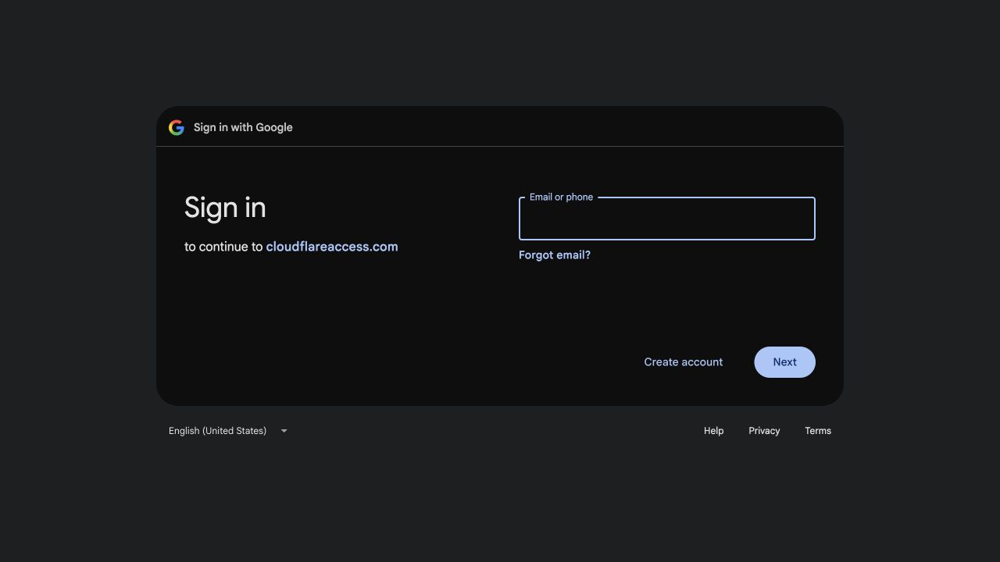
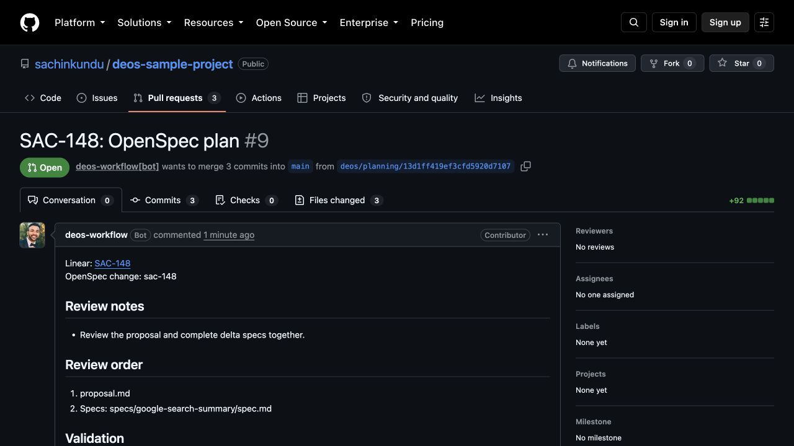
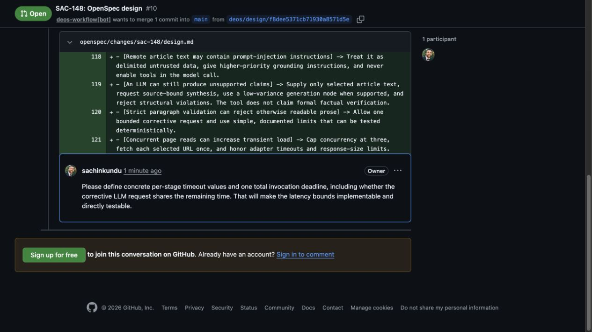
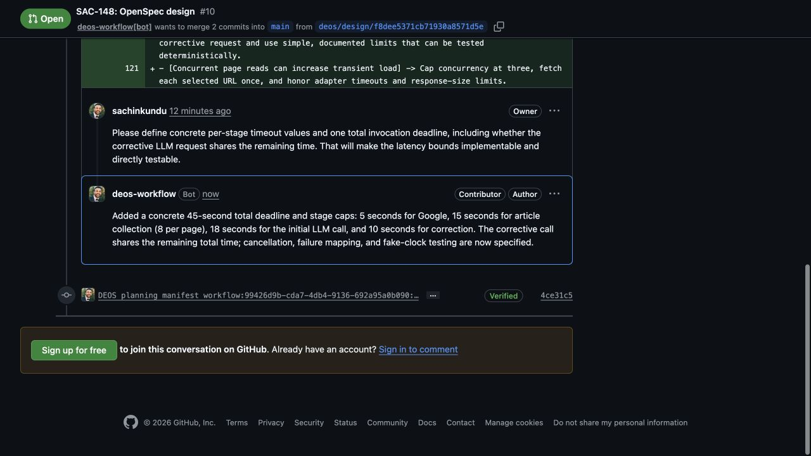

# SAC-143 two-gate design-stage provider proof

*2026-09-01T08:26:58Z by Showboat 0.6.1*
<!-- showboat-id: 102eaba9-b377-4745-81e9-11f504104d79 -->

This record proves the deployed two-gate workflow against the real DEOS sample project. Provider-originated Linear deliveries are the workflow trigger. D1 is the authority for definitions, visits, work products, receipts, and cleanup. Screenshots are sanitized and attached below.

Local verification covers the complete Worker, Python migration, and portal matrices plus generated binding checks, production builds, strict OpenSpec validation, and repository whitespace checks.

```bash
set -euo pipefail
npm test 2>&1 | tail -n 10
uv run pytest -q
npm run portal:test 2>&1 | tail -n 10
npm run typecheck
npm run portal:typecheck
npm run types:check
npm run portal:types:check
npx openspec validate sac-143 --strict
git diff --check
```

```output
✔ human approval is an explicit transition (0.112ms)
✔ cancellation explicitly rejects a waiting workflow (0.06725ms)
ℹ tests 234
ℹ suites 0
ℹ pass 234
ℹ fail 0
ℹ cancelled 0
ℹ skipped 0
ℹ todo 0
ℹ duration_ms 841.179083
.................................                                        [100%]
33 passed in 0.57s
✔ the deployed workflow inspector offers GitHub and BettaView PR links (1.609ms)
✔ pull request story keeps failed attempts and selects a verified exact-head trace (13.773083ms)
ℹ tests 34
ℹ suites 0
ℹ pass 34
ℹ fail 0
ℹ cancelled 0
ℹ skipped 0
ℹ todo 0
ℹ duration_ms 235.149292

> typecheck
> tsc --noEmit


> portal:typecheck
> tsc --noEmit -p portal/tsconfig.json


> types:check
> wrangler types worker-configuration.d.ts --include-runtime false --config wrangler.queue-consumer-ts.jsonc --check


 ⛅️ wrangler 4.125.0 (update available 4.127.1)
───────────────────────────────────────────────
✨ Types at worker-configuration.d.ts are up to date.


> portal:types:check
> wrangler types portal/src/worker-configuration.d.ts --include-runtime false --config portal/wrangler.jsonc --check


 ⛅️ wrangler 4.125.0 (update available 4.127.1)
───────────────────────────────────────────────
✨ Types at portal/src/worker-configuration.d.ts are up to date.

Change 'sac-143' is valid
```

The first scheduled registration attempt exposed a missing explicit prompt import. The scheduled handler failed before registering v17, while dispatch remained off. After the bundle import and regression test were added, queue Worker version 31306827-795f-4ea8-8d17-924d4a9c10b1 deployed and the same scheduled handler registered the exact v17 digest.

```bash
set -euo pipefail
set -a
source /Users/sachin/code/deos/.env
set +a
export CLOUDFLARE_API_TOKEN="${CLOUDFLARE_API_TOKEN:-${CLOUDFLARE_TOKEN:-}}"
npx wrangler deployments status --config wrangler.queue-consumer-ts.jsonc --json | node -e 'let s="";process.stdin.on("data",d=>s+=d).on("end",()=>{const d=JSON.parse(s);console.log(JSON.stringify({deployment:d.id,versions:d.versions},null,2))})'
npx wrangler deployments status --config portal/wrangler.jsonc --json | node -e 'let s="";process.stdin.on("data",d=>s+=d).on("end",()=>{const d=JSON.parse(s);console.log(JSON.stringify({deployment:d.id,versions:d.versions},null,2))})'
npx wrangler d1 execute DB --remote --config wrangler.queue-consumer-ts.jsonc --command "SELECT name FROM d1_migrations WHERE name='0023_design_review_stage.sql'; SELECT definition_id,version,digest FROM workflow_definitions WHERE definition_id='simple-traceability' ORDER BY version DESC LIMIT 1; SELECT project_id,dispatch_enabled,definition_version,definition_digest,route_revision,route_digest,github_access_state FROM project_workflow_policies WHERE project_id='99426d9b-cda7-4db4-9136-692a95a0b090'; PRAGMA foreign_key_check;" --json
```

```output
{
  "deployment": "1d8d2e83-4ea9-4aca-9e07-e6265ba461a7",
  "versions": [
    {
      "version_id": "31306827-795f-4ea8-8d17-924d4a9c10b1",
      "percentage": 100
    }
  ]
}
{
  "deployment": "7474c1ab-71fc-4548-8fa8-7ffd1957416e",
  "versions": [
    {
      "version_id": "42410846-1179-426a-85bc-2129e0375fe1",
      "percentage": 100
    }
  ]
}
[
  {
    "results": [
      {
        "name": "0023_design_review_stage.sql"
      }
    ],
    "success": true,
    "meta": {
      "served_by": "v3-prod",
      "served_by_region": "WEUR",
      "served_by_colo": "AMS",
      "served_by_primary": true,
      "timings": {
        "sql_duration_ms": 0.4453
      },
      "duration": 0.4453,
      "changes": 0,
      "last_row_id": 0,
      "changed_db": false,
      "size_after": 7286784,
      "rows_read": 1,
      "rows_written": 0,
      "total_attempts": 1
    }
  },
  {
    "results": [
      {
        "definition_id": "simple-traceability",
        "version": 17,
        "digest": "51adef4c57ea69ec036ace3376719da5b8044a3f3e17de95333ede924e0ee81b"
      }
    ],
    "success": true,
    "meta": {
      "served_by": "v3-prod",
      "served_by_region": "WEUR",
      "served_by_colo": "AMS",
      "served_by_primary": true,
      "timings": {
        "sql_duration_ms": 0.1386
      },
      "duration": 0.1386,
      "changes": 0,
      "last_row_id": 0,
      "changed_db": false,
      "size_after": 7286784,
      "rows_read": 1,
      "rows_written": 0,
      "total_attempts": 1
    }
  },
  {
    "results": [
      {
        "project_id": "99426d9b-cda7-4db4-9136-692a95a0b090",
        "dispatch_enabled": 1,
        "definition_version": 17,
        "definition_digest": "51adef4c57ea69ec036ace3376719da5b8044a3f3e17de95333ede924e0ee81b",
        "route_revision": 4,
        "route_digest": "a572f3234a73b84c36cedfc961bcac4d7c03a61048edb6c88e0fb3bba2f9bbc8",
        "github_access_state": "passed"
      }
    ],
    "success": true,
    "meta": {
      "served_by": "v3-prod",
      "served_by_region": "WEUR",
      "served_by_colo": "AMS",
      "served_by_primary": true,
      "timings": {
        "sql_duration_ms": 0.1416
      },
      "duration": 0.1416,
      "changes": 0,
      "last_row_id": 0,
      "changed_db": false,
      "size_after": 7286784,
      "rows_read": 1,
      "rows_written": 0,
      "total_attempts": 1
    }
  },
  {
    "results": [],
    "success": true,
    "meta": {
      "served_by": "v3-prod",
      "served_by_region": "WEUR",
      "served_by_colo": "AMS",
      "served_by_primary": true,
      "timings": {
        "sql_duration_ms": 7.5263
      },
      "duration": 7.5263,
      "changes": 0,
      "last_row_id": 0,
      "changed_db": false,
      "size_after": 7286784,
      "rows_read": 3124,
      "rows_written": 0,
      "total_attempts": 1
    }
  }
]
```

```bash {image}

```



Final local verification after the deployed bundle regression fix covers 235 Worker tests, 33 Python tests, 34 portal tests, 100 BettaView tests, both production portal builds, type generation, strict OpenSpec validation, and repository whitespace.

```bash
set -euo pipefail
npm test 2>&1 | tail -n 9
uv run pytest -q
uv run ruff check .
npm run portal:test 2>&1 | tail -n 9
npm run bettaview:test 2>&1 | tail -n 9
npm run typecheck >/dev/null
npm run portal:typecheck >/dev/null
npm run types:check >/dev/null
npm run portal:types:check >/dev/null
npm run portal:build >/dev/null
npm run portal:build:full-workflow >/dev/null
npm run bettaview:build >/dev/null
npx openspec validate sac-143 --strict
git diff --check
echo "Type checks, generated bindings, production builds, strict OpenSpec, and whitespace checks passed."
```

```output
✔ cancellation explicitly rejects a waiting workflow (0.078708ms)
ℹ tests 235
ℹ suites 0
ℹ pass 235
ℹ fail 0
ℹ cancelled 0
ℹ skipped 0
ℹ todo 0
ℹ duration_ms 1063.734291
.................................                                        [100%]
33 passed in 0.62s
All checks passed!
✔ pull request story keeps failed attempts and selects a verified exact-head trace (14.252167ms)
ℹ tests 34
ℹ suites 0
ℹ pass 34
ℹ fail 0
ℹ cancelled 0
ℹ skipped 0
ℹ todo 0
ℹ duration_ms 243.66825
✔ rejects a sidecar change that does not match its directory (3.322333ms)
ℹ tests 100
ℹ suites 0
ℹ pass 100
ℹ fail 0
ℹ cancelled 0
ℹ skipped 0
ℹ todo 0
ℹ duration_ms 405.561208

(!) Some chunks are larger than 500 kB after minification. Consider:
- Using dynamic import() to code-split the application
- Use build.rollupOptions.output.manualChunks to improve chunking: https://rollupjs.org/configuration-options/#output-manualchunks
- Adjust chunk size limit for this warning via build.chunkSizeWarningLimit.
Change 'sac-143' is valid
Type checks, generated bindings, production builds, strict OpenSpec, and whitespace checks passed.
```

```bash {image}

```



```bash {image}

```



```bash {image}

```



The provider-originated SAC-148 run reached saved terminal success on immutable workflow v17. D1 shows one checked planning merge, two design review rounds on the same pull request, no live attempts, no pending cleanup, complete manifests, and no foreign-key violations.

```bash
set -euo pipefail
set -a
source /Users/sachin/code/deos/.env
set +a
export CLOUDFLARE_API_TOKEN="${CLOUDFLARE_API_TOKEN:-${CLOUDFLARE_TOKEN:-}}"
RUN_ID="workflow:99426d9b-cda7-4db4-9136-692a95a0b090:c593ac23-ded3-4508-b2dc-4c737b958bb7:run:2"
npx wrangler d1 execute deos-sample-project --remote --config wrangler.queue-consumer-ts.jsonc --command "SELECT run_id,workflow_instance_id,definition_version,definition_digest,current_node,current_visit_sequence,status,terminal_at,terminal_cause FROM orchestration_runs WHERE run_id='${RUN_ID}'; SELECT node_id,state,result_class,cleanup_state,manifest_id FROM agent_attempts WHERE run_id='${RUN_ID}' ORDER BY created_at; SELECT SUM(CASE WHEN state IN ('pending','starting','running','collecting') THEN 1 ELSE 0 END) AS live_attempts,SUM(CASE WHEN cleanup_state <> 'destroyed' THEN 1 ELSE 0 END) AS pending_cleanup FROM agent_attempts WHERE run_id='${RUN_ID}'; SELECT visit_sequence,gate_kind,round,state,pull_request_number,approved_head_sha,decision_outcome FROM human_gate_visits WHERE run_id='${RUN_ID}' ORDER BY visit_sequence; SELECT pull_request_number,head_sha,merge_commit_sha,verified_merge_commit_sha,verified_at,verification_manifest_digest FROM run_work_products WHERE run_id='${RUN_ID}'; SELECT pull_request_number,base_commit,head_sha,design_manifest_digest,merge_commit_sha FROM design_work_products WHERE run_id='${RUN_ID}'; SELECT round,state,candidate_sha256,validation_sha256,accepted_at FROM design_candidates WHERE run_id='${RUN_ID}' ORDER BY round; SELECT capability,action,state,COUNT(*) AS operation_count FROM provider_operations WHERE run_id='${RUN_ID}' GROUP BY capability,action,state ORDER BY capability,action,state; SELECT state,COUNT(*) AS manifest_count,SUM(object_count) AS object_count,SUM(total_bytes) AS total_bytes FROM artifact_manifests WHERE run_id='${RUN_ID}' GROUP BY state; PRAGMA foreign_key_check;" --json | jq -c 'map(.results)'
```

```output
[[{"run_id":"workflow:99426d9b-cda7-4db4-9136-692a95a0b090:c593ac23-ded3-4508-b2dc-4c737b958bb7:run:2","workflow_instance_id":"wf-v1-qzvlf6rqxtlelipyk7dirmdnutlqydqkrilyedee2molgordwryq","definition_version":17,"definition_digest":"51adef4c57ea69ec036ace3376719da5b8044a3f3e17de95333ede924e0ee81b","current_node":"done","current_visit_sequence":23,"status":"succeeded","terminal_at":"2026-09-01T09:39:21.413Z","terminal_cause":null}],[{"node_id":"planning_author","state":"completed","result_class":"completed","cleanup_state":"destroyed","manifest_id":"manifest:01a05c1e-6177-77b5-8b42-bf2ce85d5c5b"},{"node_id":"self_discovery","state":"completed","result_class":"findings","cleanup_state":"destroyed","manifest_id":"manifest:01a05c23-87c3-782a-80e6-b62c6fccb45d"},{"node_id":"planning_self_repair","state":"completed","result_class":"completed","cleanup_state":"destroyed","manifest_id":"manifest:01a05c28-e8d5-7e7e-85d6-c93dccfac7f7"},{"node_id":"self_recheck_before_publish","state":"completed","result_class":"pass","cleanup_state":"destroyed","manifest_id":"manifest:01a05c2e-1678-7424-bdb2-67b228a9a110"},{"node_id":"independent_discovery","state":"completed","result_class":"pass","cleanup_state":"destroyed","manifest_id":"manifest:01a05c33-9f7e-7828-a8f5-c9011ab6a4e9"},{"node_id":"planning_independent_response","state":"completed","result_class":"completed","cleanup_state":"destroyed","manifest_id":"manifest:01a05c38-e62c-7bd2-8bbd-4d94beccbe37"},{"node_id":"final_trace","state":"completed","result_class":"pass","cleanup_state":"destroyed","manifest_id":"manifest:01a05c3e-5dad-724e-8538-3d1d75a96fe4"},{"node_id":"design_author","state":"completed","result_class":"completed","cleanup_state":"destroyed","manifest_id":"manifest:01a05c44-a64b-7bbc-af85-4ae7addba896"},{"node_id":"design_revision_author","state":"completed","result_class":"completed","cleanup_state":"destroyed","manifest_id":"manifest:01a05c4b-1863-7951-a40b-593df6636a35"}],[{"live_attempts":0,"pending_cleanup":0}],[{"visit_sequence":12,"gate_kind":"plan","round":1,"state":"merge_authorized","pull_request_number":9,"approved_head_sha":"35aa71b906cd136226cc3ba8ba2bea27c97263a5","decision_outcome":"merge_authorized"},{"visit_sequence":17,"gate_kind":"design","round":1,"state":"revision_requested","pull_request_number":10,"approved_head_sha":"c5064912660502b5b1af15bf4fe856976a72e238","decision_outcome":"revision_requested"},{"visit_sequence":21,"gate_kind":"design","round":2,"state":"merge_authorized","pull_request_number":10,"approved_head_sha":"4ce31c516c55ed434348cdebfe2a09002952d3d7","decision_outcome":"merge_authorized"}],[{"pull_request_number":9,"head_sha":"35aa71b906cd136226cc3ba8ba2bea27c97263a5","merge_commit_sha":"b050aa44f6382ade94a4ee4723825d74d02cd633","verified_merge_commit_sha":"b050aa44f6382ade94a4ee4723825d74d02cd633","verified_at":"2026-09-01T09:19:52.476Z","verification_manifest_digest":"986ef9c1cd9d8d03889f501e3f4832a47d36621d48b89c8b8dbe3474356eadbc"}],[{"pull_request_number":10,"base_commit":"b050aa44f6382ade94a4ee4723825d74d02cd633","head_sha":"4ce31c516c55ed434348cdebfe2a09002952d3d7","design_manifest_digest":"5bab21ea80586e09c676292a2e2146ba6beafd216a4368992b15b17c2f0b8663","merge_commit_sha":"922f08bda3a2390231f954fd67f73426c1f35a6a"}],[{"round":1,"state":"validated","candidate_sha256":"497c4d434162f06963a2dc9815eb833f7291e60c4c11bdf4bb64249f3410a214","validation_sha256":"22039d4312d4a8570d7e003d4957fcaa9491857d986095d0b74793a5e4bd1ddb","accepted_at":"2026-09-01T09:25:31.550Z"},{"round":2,"state":"validated","candidate_sha256":"bb3da796c56d26adc84e7ac688359f8de713f07bb6584c145c6e60f28055e2e3","validation_sha256":"60ac19b421101421636c162537bfa280dcd9dd36a6b428c2146b6b7112b34ad8","accepted_at":"2026-09-01T09:37:41.423Z"}],[{"capability":"linear.transition","action":"delegate_and_start","state":"succeeded","operation_count":1},{"capability":"linear.transition","action":"enter_human_gate","state":"succeeded","operation_count":3},{"capability":"model","action":"openrouter_responses","state":"succeeded","operation_count":12},{"capability":"system_action","action":"design.start_new_round","state":"succeeded","operation_count":1},{"capability":"system_action","action":"github.merge_design_pull_request","state":"succeeded","operation_count":1},{"capability":"system_action","action":"github.merge_planning_pull_request","state":"succeeded","operation_count":1},{"capability":"system_action","action":"github.publish_design_candidate","state":"reconciled","operation_count":1},{"capability":"system_action","action":"github.publish_design_candidate","state":"succeeded","operation_count":1},{"capability":"system_action","action":"github.publish_planning_candidate","state":"reconciled","operation_count":1},{"capability":"system_action","action":"github.publish_planning_candidate","state":"succeeded","operation_count":1},{"capability":"system_action","action":"github.upsert_trace_review_check","state":"reconciled","operation_count":2},{"capability":"system_action","action":"github.upsert_trace_review_check","state":"succeeded","operation_count":1},{"capability":"system_action","action":"github.verify_planning_merge","state":"succeeded","operation_count":1},{"capability":"system_action","action":"linear.upsert_trace_review_link","state":"reconciled","operation_count":1},{"capability":"system_action","action":"linear.upsert_trace_review_link","state":"succeeded","operation_count":4}],[{"state":"complete","manifest_count":9,"object_count":78,"total_bytes":793301}],[]]
```

GitHub read-back proves the workflow ended at the requested planning boundary: proposal, complete delta specs, and design only. The design revision reused pull request 10, updated its exact head, replied to the affected human root thread, and left that thread unresolved.

```bash
set -euo pipefail
gh pr view 9 --repo sachinkundu/deos-sample-project --json number,state,mergedAt,mergeCommit,headRefOid,files,url
gh pr view 10 --repo sachinkundu/deos-sample-project --json number,state,mergedAt,mergeCommit,headRefOid,files,url
gh api 'repos/sachinkundu/deos-sample-project/git/trees/main?recursive=1' --jq '[.tree[].path | select(startswith("openspec/changes/sac-148"))]'
gh api graphql -f query='query($owner:String!,$name:String!,$number:Int!){repository(owner:$owner,name:$name){pullRequest(number:$number){reviewThreads(first:50){nodes{isResolved comments(first:10){nodes{databaseId author{login} body url}}}}}}}' -f owner='sachinkundu' -f name='deos-sample-project' -F number=10 --jq '.data.repository.pullRequest.reviewThreads.nodes | map({isResolved,comments:[.comments.nodes[]|{databaseId,author:.author.login,url}]})'
gh api 'repos/sachinkundu/deos-sample-project/contents/openspec/changes/sac-148/design.md?ref=main' -H 'Accept: application/vnd.github.raw+json' | rg -n '45-second|5-second|15-second|18-second|10-second|remaining total'
```

```output
{"files":[{"path":"openspec/changes/sac-148/.openspec.yaml","additions":2,"deletions":0,"changeType":"ADDED"},{"path":"openspec/changes/sac-148/proposal.md","additions":25,"deletions":0,"changeType":"ADDED"},{"path":"openspec/changes/sac-148/specs/google-search-summary/spec.md","additions":65,"deletions":0,"changeType":"ADDED"}],"headRefOid":"35aa71b906cd136226cc3ba8ba2bea27c97263a5","mergeCommit":{"oid":"b050aa44f6382ade94a4ee4723825d74d02cd633"},"mergedAt":"2026-09-01T09:19:47Z","number":9,"state":"MERGED","url":"https://github.com/sachinkundu/deos-sample-project/pull/9"}
{"files":[{"path":"openspec/changes/sac-148/design.md","additions":147,"deletions":0,"changeType":"ADDED"}],"headRefOid":"4ce31c516c55ed434348cdebfe2a09002952d3d7","mergeCommit":{"oid":"922f08bda3a2390231f954fd67f73426c1f35a6a"},"mergedAt":"2026-09-01T09:39:19Z","number":10,"state":"MERGED","url":"https://github.com/sachinkundu/deos-sample-project/pull/10"}
["openspec/changes/sac-148","openspec/changes/sac-148/.openspec.yaml","openspec/changes/sac-148/design.md","openspec/changes/sac-148/proposal.md","openspec/changes/sac-148/specs","openspec/changes/sac-148/specs/google-search-summary","openspec/changes/sac-148/specs/google-search-summary/spec.md"]
[{"comments":[{"author":"sachinkundu","databaseId":3902710923,"url":"https://github.com/sachinkundu/deos-sample-project/pull/10#discussion_r3902710923"},{"author":"deos-workflow","databaseId":3902801894,"url":"https://github.com/sachinkundu/deos-sample-project/pull/10#discussion_r3902801894"}],"isResolved":false}]
35:Summary coordinator (45-second invocation deadline)
76:The CLI starts one 45-second wall-clock deadline when it begins handling the command, before argument parsing. Invalid input still stops immediately. For valid input, argument parsing, all external calls, article extraction, validation, and rendering must finish within that deadline. The limits are fixed implementation constants:
85:Every operation receives the earliest of its stage deadline and the invocation deadline. Each page request also receives the article-phase deadline, so a second concurrency batch cannot extend that phase. The corrective request shares the original 45-second deadline: it receives at most 10 seconds and only the invocation time that remains after search, article collection, the initial model call, and validation. If no time remains, the coordinator skips the corrective call and returns a summary failure. Stage budgets do not reserve time or reset the total deadline; unused time from an earlier stage can be used later only up to the later stage's own cap.
109:1. The CLI starts the 45-second invocation deadline, then joins and trims positional arguments. If the result is empty, it emits the input error and stops.
110:2. The coordinator sends the normalized query and invocation deadline to the Google search gateway with its 5-second stage deadline. A gateway failure stops the operation as `search_failed`.
112:4. The article reader fetches selected pages within the 15-second phase deadline and 8-second per-page deadlines, with bounded concurrency, URL safety, response, extraction, and text-size limits. Individual page failures are recorded only as internal diagnostics and skipped.
114:6. The summary generator sends the bounded sources to the language model with an 18-second cap. The validator accepts the result or permits one corrective request capped at 10 seconds and the remaining invocation time.
141:- [Fixed deadlines may reject a result that would succeed on a slow network] -> Keep the stage caps subordinate to one 45-second deadline and return the existing clear stage-appropriate error instead of waiting unpredictably.
```

Cloudflare read-back independently reports the durable Workflow complete. Its nine exact Sandbox instances are all inactive, matching D1 cleanup_state=destroyed.

```bash
set -euo pipefail
set -a
source /Users/sachin/code/deos/.env
set +a
export CLOUDFLARE_API_TOKEN="${CLOUDFLARE_API_TOKEN:-${CLOUDFLARE_TOKEN:-}}"
npx wrangler workflows instances describe deos-sandbox-codex-workflow wf-v1-qzvlf6rqxtlelipyk7dirmdnutlqydqkrilyedee2molgordwryq --config wrangler.queue-consumer-ts.jsonc | sed -n '1,12p'
npx wrangler containers instances a0344373-884d-4c06-b4c2-4e58295de498 --json | jq -c '[.[] | select(.name | IN("sbx-v1-evkewz56kn4tymqoakqgxv44fwaubx6mnynenuim35vwnwk3ouzq","sbx-v1-onsuernn3bbzogukjy3grkudce6muwqfo3ygxacbgcxdpkc5kkvq","sbx-v1-hkpttm4o6jhrre2t4r2dlpfarfssxvmdchbpx3d37dirjzshfyha","sbx-v1-guutwk3tzur2xukpuxo4i4fjsb6e2aq52fotwqezkqotqiqrzmna","sbx-v1-qznjaj5andysogijsyt2himn2ffge64gzazs5vsi2csron44oapq","sbx-v1-ebem6ki3akbdnbvgbzphbfzn6ii5oxo5okac7bnw7abdimrtqm6a","sbx-v1-4lcson5hxhmdtsnprej4oezmguusjwev43n2fpjcmb3tdcxgkwhq","sbx-v1-a4pbmg3snatj7wywhrpdvhirmzdxxccrsdyedrdglkhf7e3arlzq","sbx-v1-jzywf6ctfyyocq2btyp6onnow2csnvsn27alutoyelrz6lu4ubia")) | {name,state}]'
```

```output

 ⛅️ wrangler 4.125.0 (update available 4.127.1)
───────────────────────────────────────────────
Describing latest instance:
Workflow Name:         deos-sandbox-codex-workflow
Instance Id:           wf-v1-qzvlf6rqxtlelipyk7dirmdnutlqydqkrilyedee2molgordwryq
Version Id:            f4f18064-77b3-4158-ab84-58829cabedb8
Status:                ✅ Completed
Trigger:               🔗 Binding
Queued:                9/1/2026, 11:38:01 AM
Success:               ✅ Yes
Start:                 9/1/2026, 11:38:02 AM
[{"name":"sbx-v1-hkpttm4o6jhrre2t4r2dlpfarfssxvmdchbpx3d37dirjzshfyha","state":"inactive"},{"name":"sbx-v1-onsuernn3bbzogukjy3grkudce6muwqfo3ygxacbgcxdpkc5kkvq","state":"inactive"},{"name":"sbx-v1-ebem6ki3akbdnbvgbzphbfzn6ii5oxo5okac7bnw7abdimrtqm6a","state":"inactive"},{"name":"sbx-v1-jzywf6ctfyyocq2btyp6onnow2csnvsn27alutoyelrz6lu4ubia","state":"inactive"},{"name":"sbx-v1-guutwk3tzur2xukpuxo4i4fjsb6e2aq52fotwqezkqotqiqrzmna","state":"inactive"},{"name":"sbx-v1-qznjaj5andysogijsyt2himn2ffge64gzazs5vsi2csron44oapq","state":"inactive"},{"name":"sbx-v1-evkewz56kn4tymqoakqgxv44fwaubx6mnynenuim35vwnwk3ouzq","state":"inactive"},{"name":"sbx-v1-a4pbmg3snatj7wywhrpdvhirmzdxxccrsdyedrdglkhf7e3arlzq","state":"inactive"},{"name":"sbx-v1-4lcson5hxhmdtsnprej4oezmguusjwev43n2fpjcmb3tdcxgkwhq","state":"inactive"}]
```

The two accepted design candidates and their validation receipts are present in remote R2. Their live object hashes exactly match the D1 receipts above.

```bash
set -euo pipefail
set -a
source /Users/sachin/code/deos/.env
set +a
export CLOUDFLARE_API_TOKEN="${CLOUDFLARE_API_TOKEN:-${CLOUDFLARE_TOKEN:-}}"
for r2_key in \
"runs/workflow%253A99426d9b-cda7-4db4-9136-692a95a0b090%253Ac593ac23-ded3-4508-b2dc-4c737b958bb7%253Arun%253A2/design-candidates/design:01a05c44-a64b-7bbc-af85-4ae7addba896/design-candidate.json" \
"runs/workflow%253A99426d9b-cda7-4db4-9136-692a95a0b090%253Ac593ac23-ded3-4508-b2dc-4c737b958bb7%253Arun%253A2/design-candidates/design:01a05c44-a64b-7bbc-af85-4ae7addba896/candidate-validation.json" \
"runs/workflow%253A99426d9b-cda7-4db4-9136-692a95a0b090%253Ac593ac23-ded3-4508-b2dc-4c737b958bb7%253Arun%253A2/design-candidates/design:01a05c4b-1863-7951-a40b-593df6636a35/design-candidate.json" \
"runs/workflow%253A99426d9b-cda7-4db4-9136-692a95a0b090%253Ac593ac23-ded3-4508-b2dc-4c737b958bb7%253Arun%253A2/design-candidates/design:01a05c4b-1863-7951-a40b-593df6636a35/candidate-validation.json"; do
  r2_sha=$(npx wrangler r2 object get "deos-sample-project-artifacts/${r2_key}" --remote --pipe 2>/dev/null | shasum -a 256 | awk '{print $1}')
  printf "%s %s\n" "${r2_sha}" "${r2_key##*/}"
done
```

```output
497c4d434162f06963a2dc9815eb833f7291e60c4c11bdf4bb64249f3410a214 design-candidate.json
22039d4312d4a8570d7e003d4957fcaa9491857d986095d0b74793a5e4bd1ddb candidate-validation.json
bb3da796c56d26adc84e7ac688359f8de713f07bb6584c145c6e60f28055e2e3 design-candidate.json
60ac19b421101421636c162537bfa280dcd9dd36a6b428c2146b6b7112b34ad8 candidate-validation.json
```

The canary route was enabled only for SAC-148. After terminal success, a guarded D1 update disables dispatch for that exact route revision and digest. The read-back proves the sample project cannot start another workflow, while SAC-148 remains durably complete.

```bash
set -euo pipefail
set -a
source /Users/sachin/code/deos/.env
set +a
export CLOUDFLARE_API_TOKEN="${CLOUDFLARE_API_TOKEN:-${CLOUDFLARE_TOKEN:-}}"
PROJECT_ID="99426d9b-cda7-4db4-9136-692a95a0b090"
RUN_ID="workflow:${PROJECT_ID}:c593ac23-ded3-4508-b2dc-4c737b958bb7:run:2"
npx wrangler d1 execute deos-sample-project --remote --config wrangler.queue-consumer-ts.jsonc --command "UPDATE project_workflow_policies SET dispatch_enabled=0, workflow_revision=6, workflow_updated_by=\"codex:sac-143-canary\", workflow_updated_at=\"2026-09-01T09:47:24.000Z\", route_revision=5, route_digest=\"17dd158cea1ba65c16a50292a966fcf5e8cf8349ee406982169c71a4d3ba1772\", route_updated_by=\"codex:sac-143-canary\", route_updated_at=\"2026-09-01T09:47:24.000Z\", updated_at=\"2026-09-01T09:47:24.000Z\" WHERE project_id=\"${PROJECT_ID}\" AND dispatch_enabled=1 AND workflow_revision=5 AND route_revision=4 AND route_digest=\"a572f3234a73b84c36cedfc961bcac4d7c03a61048edb6c88e0fb3bba2f9bbc8\"; SELECT changes() AS guarded_changes; SELECT project_id,dispatch_enabled,workflow_revision,route_revision,route_digest,route_updated_by,route_updated_at FROM project_workflow_policies WHERE project_id=\"${PROJECT_ID}\"; SELECT run_id,status,current_node,terminal_at FROM orchestration_runs WHERE run_id=\"${RUN_ID}\"; PRAGMA foreign_key_check;" --json | jq -c "map(.results)"
```

```output
[[],[{"guarded_changes":1}],[{"project_id":"99426d9b-cda7-4db4-9136-692a95a0b090","dispatch_enabled":0,"workflow_revision":6,"route_revision":5,"route_digest":"17dd158cea1ba65c16a50292a966fcf5e8cf8349ee406982169c71a4d3ba1772","route_updated_by":"codex:sac-143-canary","route_updated_at":"2026-09-01T09:47:24.000Z"}],[{"run_id":"workflow:99426d9b-cda7-4db4-9136-692a95a0b090:c593ac23-ded3-4508-b2dc-4c737b958bb7:run:2","status":"succeeded","current_node":"done","terminal_at":"2026-09-01T09:39:21.413Z"}],[]]
```

SAC-148 was created and transitioned through Linear, not injected by a local request. The persisted ingress and event inbox records below are the signed provider deliveries that established the run and drove both human decisions.

```bash
set -euo pipefail
set -a
source /Users/sachin/code/deos/.env
set +a
export CLOUDFLARE_API_TOKEN="${CLOUDFLARE_API_TOKEN:-${CLOUDFLARE_TOKEN:-}}"
RUN_ID="workflow:99426d9b-cda7-4db4-9136-692a95a0b090:c593ac23-ded3-4508-b2dc-4c737b958bb7:run:2"
npx wrangler d1 execute deos-sample-project --remote --config wrangler.queue-consumer-ts.jsonc --command "SELECT d.delivery_id,d.classification,d.received_at,i.state AS dispatch_state,i.workflow_instance_id FROM deliveries d JOIN dispatch_intents i ON i.source_delivery_id=d.delivery_id WHERE i.run_id=\"${RUN_ID}\"; SELECT e.delivery_id,e.event_kind,e.from_state_name,e.to_state_name,e.state,e.provider_time FROM workflow_event_inbox e JOIN human_gate_visits g ON g.decision_delivery_id=e.delivery_id WHERE g.run_id=\"${RUN_ID}\" ORDER BY e.provider_time;" --json | jq -c "map(.results)"
```

```output
[[{"delivery_id":"631eb6cb-e1bf-467b-83b3-f4ad0ade9eab","classification":"relevant","received_at":"2026-09-01T08:37:48.520999+00:00","dispatch_state":"established","workflow_instance_id":"wf-v1-qzvlf6rqxtlelipyk7dirmdnutlqydqkrilyedee2molgordwryq"}],[{"delivery_id":"435e6868-5470-4b0c-a7dc-df5927d7db65","event_kind":"Issue.update","from_state_name":null,"to_state_name":"Merging","state":"processed","provider_time":"2026-09-01T09:19:33.220Z"},{"delivery_id":"5b5f5d99-e46e-407a-b967-f88f0bdb840c","event_kind":"Issue.update","from_state_name":null,"to_state_name":"In Progress","state":"processed","provider_time":"2026-09-01T09:26:42.080Z"},{"delivery_id":"ff3631a2-b60f-405a-bbb5-01613e6514bd","event_kind":"Issue.update","from_state_name":null,"to_state_name":"Merging","state":"processed","provider_time":"2026-09-01T09:39:03.412Z"}]]
```
