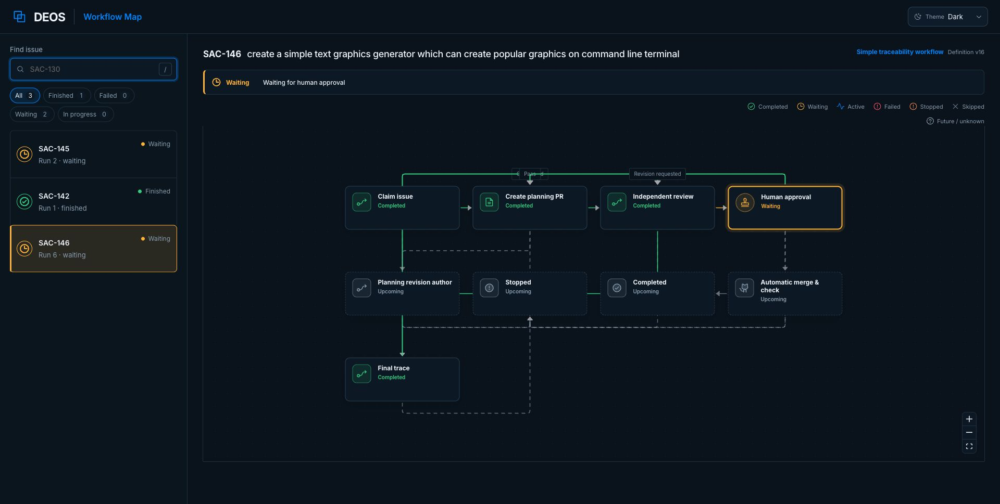

# SAC-144 multi-repository implementation evidence

## Settings UI

The selected project connection card design shows every saved route and keeps edits scoped to the selected Linear project. A route that already has active work explains that the current run keeps its frozen repository.

The same route list, access state, and editor work at a 390 by 844 phone viewport without horizontal overflow.

Browser checks also selected the second card and confirmed that its editor opened. The Add route action exposed the Linear project and GitHub repository selectors, then canceled without saving.

The protected live Settings page shows both saved routes enabled with passing
GitHub App access. The crop excludes account and Access identity details.

## Local verification

- Python: 31 tests passed.
- Ruff: passed.
- Worker tests: 224 tests passed.
- Portal tests: 32 tests passed.
- Root and portal TypeScript checks: passed.
- Generated Worker binding checks: passed.
- Portal production build: passed.
- OpenSpec strict validation: passed.
- `git diff --check`: passed.
- Wrangler dry runs: ingress, queue with container build, and portal with the `RouteAdmin` service binding passed.
- Pyright: run on the implementation branch and current `main`; both report the same pre-existing strict-mode debt. No new category is introduced by this change.

## Local route proof

The repository-route tests apply every migration to a real in-memory SQLite database. They prove route create and guarded update read-back, append-only access audits, legacy active-run backfill, frozen author/review/human-gate targets, atomic run allocation, stale route rejection, empty-only deployment seeding, and workflow-definition route digest consistency.

The provider adapter tests prove paginated Linear project and GitHub App repository catalogs, personal and organization installation settings links, safe provider errors, and permission classification. The exact live provider contract and stable test IDs are recorded in [the contract evidence](sac-144-multi-repository-contracts.md).

## Remote deployment and concurrency proof

Migrations `0020_multi_repository_routes.sql`,
`0021_concurrent_credential_leases.sql`, and
`0022_sandbox_failure_retention.sql` are applied. Queue Worker version
`4a9ba528-097e-4576-8318-43d2121c6ec8`, portal version
`42a5be63-f30c-41ea-990c-81def5544a99`, and ingress version
`cdf86643-5b03-4678-9c9c-be146c1af6b2` are deployed. The remote credential
table uses `(profile_id, attempt_id)` as its primary key, and the remote
foreign-key check returns no failures.

The first route is `deos-sample-project` on GitHub App installation
`154095438`, route revision `1`, and digest
`464ec282a1af74ce8af94f4e4782ba71152af07a804721f1e2337c829b2ae846`.
The second is `deos-sample-project-2` on the same App installation, route
revision `4`, and digest
`719d1ff690232d5bb71807af7fbd49ffb04025b30a9012c7a62964be8cdd361f`.
Both access states are `passed` and both routes are enabled.

The first simultaneous start exposed an old exclusive credential lease. DEOS
had treated one protected auth profile as one agent. The repair gives each
attempt its own D1 checkout while R2 refresh writes remain conditional on the
source ETag. A losing writer accepts only a newer decryptable JSON winner; it
never overwrites that object.

The deployed D1 read-back then showed two real Codex author agents at the same
time:

| Issue | Frozen repository | Attempt | State | Source ETag |
| --- | --- | --- | --- | --- |
| `SAC-146` run 4 | `sachinkundu/deos-sample-project-2` | `01a0577a-1139-7364-ab66-463b51fd190d` | `running` | `acf2f1269c2346927821401d840296c4` |
| `SAC-147` run 1 | `sachinkundu/deos-sample-project` | `01a0577b-57f8-7ef2-87f9-205338109dde` | `running` | `acf2f1269c2346927821401d840296c4` |

Each attempt had its own `credential_leases` row. Neither startup blocked the
other. Both issues use the exact shared title required by the change. The
executable query and captured remote output are in
[`sac-144-concurrent-route-canary.md`](sac-144-concurrent-route-canary.md).

The portal originally read only the deployment seed `PROJECT_ID`, so the first
route appeared while `SAC-146` was hidden. The deployed portal now admits reads
through every row in `project_workflow_policies` and has no single-project
binding. A signed-in Brave check searched `SAC-146`, loaded run `6`, and showed
it waiting for human approval beside `SAC-145`.

The first second-route attempt then exposed a separate checkout defect: the
Sandbox used anonymous Git transport even though the route had a frozen GitHub
App installation. DEOS now exposes only read-only Git smart HTTP through the
attempt capability. The trusted Worker validates the frozen route, adds the
short-lived App token upstream, and never sends that token into the Sandbox.
The first proxy canary showed that checkout occurs while the attempt is still
`pending`, before its supervisor can move it to `running`. The proxy now admits
only `pending`, `starting`, or `running` attempts with the exact frozen route.
Clean provider retries then crossed checkout and ran authors concurrently:

| Issue | Frozen repository | Attempt | State | Source ETag |
| --- | --- | --- | --- | --- |
| `SAC-145` run 2 | `sachinkundu/deos-sample-project` | `01a057a6-7d63-732c-b3a2-d4b711680f04` | `running` | `5ea175be0142249e55417d6d2f8f1d9e` |
| `SAC-146` run 6 | `sachinkundu/deos-sample-project-2` | `01a057a3-e966-7420-9239-bafa747bbf41` | `running` | `5ea175be0142249e55417d6d2f8f1d9e` |

The executable D1 record contains both route snapshots, attempt states,
credential leases, and the empty foreign-key check.

For the remaining canary retries, failed Sandboxes had a 60-minute debug hold.
DEOS removes Codex auth first, records the exact Sandbox and expiry in D1, and
lets scheduled cleanup destroy it after the hold. The deployed default returned
to zero after the clean canaries reached human review. Cloudflare deployed
Worker version `4a9ba528-097e-4576-8318-43d2121c6ec8` at 100 percent, and the
version read-back reports `SANDBOX_FAILURE_RETENTION_MINUTES=0`. The unchanged
container image upload timed out separately after the Worker version became
active; no agent was running and no new container content was required.

During the first provider run, Settings disabled the second route at revision
`3` and restored it at revision `4`. The already allocated run kept the second
repository, revision `2`, and its original digest. This proves that an active
edit succeeds without moving the run.

## Completed provider proof

The two clean provider-originated runs reached the same human gate on separate
frozen repositories:

| Issue | Run | Repository | Pull request | Head | Final state |
| --- | ---: | --- | ---: | --- | --- |
| `SAC-145` | 2 | `sachinkundu/deos-sample-project` | [#8](https://github.com/sachinkundu/deos-sample-project/pull/8) | `683a0317d06ad3262e625713f1b2a806bf676237` | `planning_review` / `awaiting_human` |
| `SAC-146` | 6 | `sachinkundu/deos-sample-project-2` | [#1](https://github.com/sachinkundu/deos-sample-project-2/pull/1) | `47859e4e733effdfd5ea48b5e847998ee0eb3161` | `planning_review` / `awaiting_human` |

D1 records successful or reconciled GitHub publication, trace-check, and
Linear review-link receipts for both runs. Each run created seven agent
attempts. All fourteen attempts have `cleanup_state='destroyed'`; none has a
cleanup hold, and the remote foreign-key check is empty. The executable final
read-back is appended to
[`sac-144-concurrent-route-canary.md`](sac-144-concurrent-route-canary.md).
