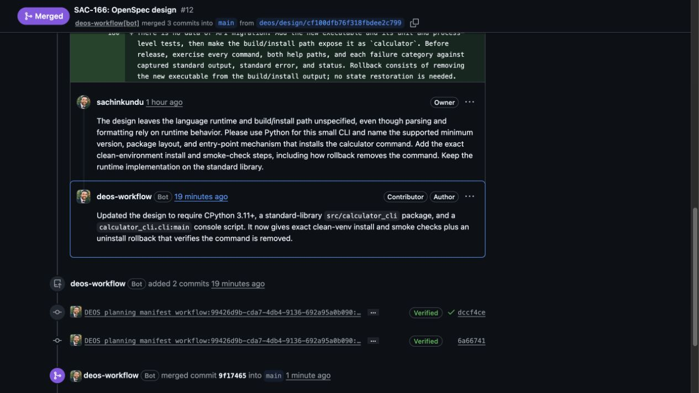

# SAC-151 completed calculator canary

SAC-166 run 3 completed successfully on 2026-09-10. D1 records `done` / `succeeded` with no terminal error. Linear reached Done at 13:56:31Z. The frozen workflow was `simple-traceability` v23, digest `6c1e97c2ae0cacc5137accb490470570a571592bbb25bbb4058bfcd4fb7c23ad`.

## What the live trial proved

| Flow | Verified result |
| --- | --- |
| Proposal native review | Two fresh discovery children found a concern; the same author repaired it; a fresh recheck passed. |
| Design native review | A fresh child found avoidable intermediate overflow; the same author repaired it; a fresh second child passed. |
| Proof and isolation | All five accepted child proofs were read from R2. Hashes and child IDs matched, review file manifests stayed unchanged, context was fresh, and no child fault was recorded. |
| Independent review | Real OpenRouter reviews ran against published heads. Automatic routing through StreamLake completed tool calls and validated JSON. Design concerns returned through the normal author-response flow. |
| Human iteration | Both proposal and design received meaningful inline feedback, substantive bot replies, explicit Linear rework events, revisions, and a return to Human Review before merge authorization. |
| Completion and cleanup | Both planning PRs merged. Every run-3 attempt is marked destroyed after collection. |

The proposal merged in [PR 11](https://github.com/sachinkundu/deos-sample-project/pull/11) as `34ac2699e7b449e35aa50597638a21e2dd234746`; D1 verified the approved manifest. The design merged in [PR 12](https://github.com/sachinkundu/deos-sample-project/pull/12) as `9f1746548955d0b714eafc8044eda41f2841e089` at 13:56:30Z. Its final head was `6a667413ffc3cc4f41623e7a543b8de06844dd4a`, and its design hash was `b7673214fb9daa488dab9afa9590b096eaa334f4185252fe9e0b80d5f2a01570`.

The final author response fixed both independent concerns: the zero-divisor gate now applies only to division, and the field name is consistently `operand_names`. The workflow returned to Human Review at 13:49:27Z, then received Linear Merging at 13:56:10Z. Under the unchanged rules, that author response goes to human review without another independent pass. This report does not claim a fresh independent pass on the final repaired head. Reviewer threads were left unresolved.

## Corrections found during the canary

The trial exposed native message-transport and multiple-manifest issues, an OpenRouter retry gap and Baidu provider failures, and a design reply-shape mismatch missed by local completion checks. These were corrected on the SAC-151 implementation path. The final reply-shape retry wrote the correct field initially; same-session correction of that exact mistake is covered by the regression test, not claimed as a live event.

The deployed Worker is `dc47e4d0-c53f-42ad-ba3b-633dcabf2aaf` at 100% traffic. Container v52 uses image `a5fe396017e167a81de2b116461c291b57e82efcdfb39e714cda196a435f4f50`; all four instances were healthy after rollout. Portal and BettaView were not deployed. Final runtime checks passed: 355 Node tests, TypeScript checking, and supervisor syntax checking; the implementation also has the earlier 56 Python checks.

## Scope and retained history

This is a completed planning-workflow canary, through proposal/specification and design. The sample calculator application itself was not implemented by v23. The SAC-151 runtime implementation is ready for review separately in [DEOS PR 100](https://github.com/sachinkundu/deos/pull/100).

Two early failed runs retain their credential-free Sandboxes under the existing diagnostic hold until September 11 at 06:51Z and 07:20Z. They are not reported as destroyed or successful. [Timing analysis](sac-151-timing-analysis.md) remains preliminary; this trial proves the execution flow, not an overall speed advantage.

## Evidence

- [Final live D1/R2 readback](sac-151-final-readback.json), produced by `scripts/read-sac-151-canary.py --verify-proofs`.
- [Original executable canary record](sac-151-live-canary.md).
- [Routing, proposal review, and merge evidence](sac-151-openrouter-routing.md).
- [Design review, rework, and reply-check correction](sac-151-design-canary.md).
- [OpenRouter retry evidence](sac-151-openrouter-retry.md).

