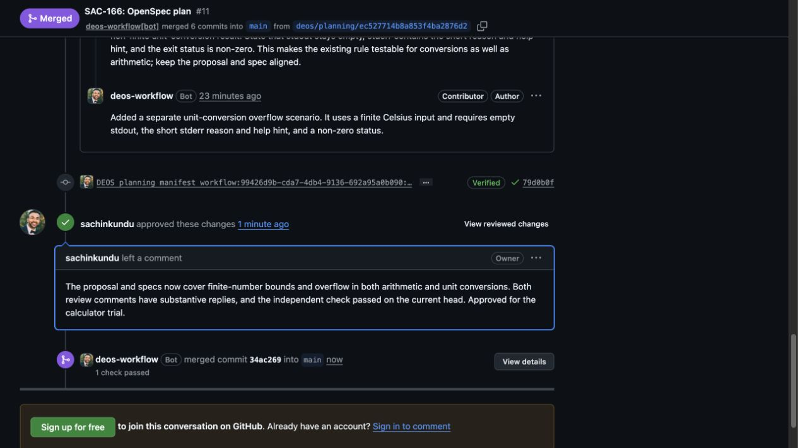

# SAC-151 automatic OpenRouter routing

The user authorized leaving Baidu and testing automatic routing with the existing JSON recovery. The model stays `deepseek/deepseek-v4-pro` at high reasoning. Provider routing now uses `require_parameters: true` and `ignore: ["baidu"]`, with no pinned provider. OpenRouter may select or fail over among endpoints supporting the remaining request parameters.

The public endpoint listing advertises structured outputs for StreamLake, Fireworks, DeepInfra, Alibaba, Venice, AtlasCloud, Baidu, Parasail, and NextBit. Advertisement alone does not prove compatibility with the Codex tool loop. The snapshot is [sac-151-openrouter-endpoints.json](sac-151-openrouter-endpoints.json).

## Provider probes

- Automatic routing with upstream schema enforcement completed responses but skipped the required fixture read in two probes. The first was confirmed through OpenRouter generation metadata as StreamLake.
- A further schema-enforced probe forcing the tool choice did not produce a completed response. It is not counted as passing evidence.
- Automatic routing with the schema in the prompt, without the upstream `text.format` parameter, completed the real Codex tool round-trip and exact JSON result. OpenRouter generation metadata confirmed StreamLake for both calls: `gen-1789039431-Mk7P6J64oqCUGQSMYe9N` and `gen-1789039438-V5jiceDxsnRohu8I2U6E`.
- A clean rerun against the final production adapter also passed, below. Neither successful probe forced a tool choice. The client selected the tool from the prompt and had to read an unknown random marker from a local fixture.

The Responses adapter therefore omits upstream `text.format`. The schema remains required at the adapter boundary and is included in the reviewer prompt. Existing JSON recovery, deterministic review validation, and bounded proof correction remain unchanged. No semantic review or human gate is removed. Earlier-message recovery was not needed by the successful provider responses; that fallback remains covered by existing tests.

The first prompt-only diagnostic emitted a harmless local error-log warning for a trailing blank transcript line. The diagnostic harness now trims its captured transcript and directs any diagnostic files to its temporary directory; production recovery code is unchanged.

## Final isolated probe

```jsonl
{"harness":"0.147.0","model":"deepseek/deepseek-v4-pro","provider":"automatic-excluding-baidu","promptOnly":true,"forceTool":false,"workflowStarted":false}
{"requestTools":[{"name":"exec_command","type":"function"},{"name":"write_stdin","type":"function"},{"name":"update_plan","type":"function"},{"name":"request_user_input","type":"function"},{"name":"view_image","type":"function"},{"name":"multi_agent_v1","type":"namespace"},{"name":"get_goal","type":"function"},{"name":"create_goal","type":"function"},{"name":"update_goal","type":"function"}],"requestedToolChoice":"auto"}
{"outputTypes":["reasoning","function_call"]}
{"request":1,"completed":true,"providerRequestId":"gen-1789039551-LaV2oFgCx8oeMr6haFrP","toolCalls":1}
{"requestTools":[{"name":"exec_command","type":"function"},{"name":"write_stdin","type":"function"},{"name":"update_plan","type":"function"},{"name":"request_user_input","type":"function"},{"name":"view_image","type":"function"},{"name":"multi_agent_v1","type":"namespace"},{"name":"get_goal","type":"function"},{"name":"create_goal","type":"function"},{"name":"update_goal","type":"function"}],"requestedToolChoice":"auto"}
{"outputTypes":["reasoning","message"]}
{"request":2,"completed":true,"providerRequestId":"gen-1789039557-qQ8MDYtsExEHxcJ2rErF","toolCalls":1}
{"result":"real Codex tool round-trip and exact review JSON passed","recoveredEarlierMessage":false,"workflowStarted":false}
```

355 Node tests and TypeScript checking passed. These probes use real providers with a local fixture; they do not themselves complete the SAC-166 workflow. The existing three-retry policy remains in place.

## Activation and resumed trial

Routing commit `bd5c16e` was merged into SAC-151 as `f46572b`. Worker `2125caf7-cc12-4688-a122-4cf321d57557` was verified at 100% traffic. The existing container v51 image remained active with four healthy instances and no errors. Portal and BettaView were not deployed.

The normal authenticated stage retry was established at 2026-09-10T11:28:21.359Z. Run 3 keeps frozen workflow v23 and its completed planning artifacts; the new independent-review visit is 8. Queuing this retry is not evidence that the review passed.

The resumed review allocated attempt `01a08b13-769f-7508-ad19-fedc53835af4` and Sandbox `sbx-v1-i4o3pku7aii3xd2kae5ljni3adik74wqnsupxp7rxe6wvweziuwq`. Its first live provider operation succeeded at 11:29:04.067Z. OpenRouter generation metadata confirmed StreamLake with `finish_reason: tool_calls` for `gen-1789039713-B7Amd7xBm8PMw4LGEz3j`. The reviewer then issued another request; final review acceptance remains to be verified.


## Accepted live review

The resumed independent review completed at 2026-09-10T11:33:40.713Z. All four provider operations succeeded. D1 records the review as accepted, with overall outcome `pass`; its Sandbox was destroyed. The R2 sidecar was read back and contains both traceability directions, all six requirement links, eight confirmed directional links, and no findings. Its document hashes match the published proposal and specification. This proves the real tool loop and existing JSON validation succeeded without upstream schema enforcement. It does not show that earlier-message recovery was needed.

The run then entered `planning_independent_response`, with a new author attempt `01a08b18-5609-7636-b1e7-7f00e7f9e3ef` at 11:33:49.956Z. Proposal human rework and the design gates remain pending.


OpenRouter generation metadata confirmed StreamLake for all four live calls. Their states and generation IDs are recorded in [sac-151-streamlake-operations.json](sac-151-streamlake-operations.json).

The proposal rework request is visible in GitHub:


## First human gate and explicit rework

The independent-response author finished at 2026-09-10T11:44:03.136Z and its Sandbox was destroyed. It incorporated the earlier human comment about NaN, infinities, and non-finite results. The publisher pushed head `f7b87daa930abc2dbdf815e2e2abc6b96137d756` and posted a substantive [thread reply](https://github.com/sachinkundu/deos-sample-project/pull/11#discussion_r3978685690). D1 reached `planning_review` / `awaiting_human`, and Linear reached Human Review at 11:44:14Z. This was the normal independent-response path, not yet an explicit human rework round.

At the gate, the trial reviewer checked the revision and requested a separate unit-conversion overflow scenario, since the existing overflow scenario covered only multiplication. The [changes-requested review](https://github.com/sachinkundu/deos-sample-project/pull/11#pullrequestreview-5166745494) is bound to that head. Linear was transitioned from Human Review to In Progress at 11:55:03Z to exercise the normal human rework path. Reviewer threads remain unresolved. Provider delivery and the new round must be read back before calling the rework complete.


Readback confirmed provider-originated delivery `965c9e08-32f4-42e9-8263-e5a059fefc30` at 11:55:04.176Z, classified relevant. Run 3 entered `planning_revision_author`. Fresh attempt `01a08b2c-2eec-7ec9-b674-9f0c01a8d0be` started at 11:55:29.320Z in Sandbox `sbx-v1-iakczu5rxqjp7bzj6h5pqmd4ktfq3v46svktbxmxnw2uvoa66lba`. This establishes an actual human-requested revision round; its completion is pending.


## Human-requested revision accepted by independent review

The revision published head `79d0b0f6c37fc3878ade46196729cd0b40b1556d`. Its only change adds a Celsius-to-Fahrenheit overflow scenario with finite input, empty stdout, a short stderr reason and help hint, and a non-zero exit status. The bot posted a substantive [reply to the second review thread](https://github.com/sachinkundu/deos-sample-project/pull/11#discussion_r3978858583). Both reviewer threads remain available for human resolution.

Fresh independent attempt `01a08b35-c9d6-778b-bde7-1bbcf6b4cb84` ran from 12:05:58.580Z to 12:11:08.791Z. D1 accepted its pass review, bound to that exact published head; the Sandbox was destroyed. The workflow then started independent-response author `01a08b3a-a61f-75b1-bac9-3dbe7dbd404c` at 12:11:20.506Z. Return to Human Review and proposal merge remain pending.


## Proposal gate approved

The independent-response author completed at 12:16:33.286Z and cleaned up its Sandbox. Human Review resumed at 12:16:43Z with the published head unchanged at `79d0b0f6c37fc3878ade46196729cd0b40b1556d`. GitHub's DEOS traceability check was successful on this exact head. The trial reviewer approved PR 11 after checking both revisions and replies, then moved Linear to Merging at 12:28:17Z. This authorization uses the normal human gate; it does not bypass DEOS merge verification.


Relevant provider delivery `6d8c2c67-b803-49a5-be20-365aa768c07b` arrived at 12:28:19.001Z. GitHub merged PR 11 at 12:28:57Z as `34ac2699e7b449e35aa50597638a21e2dd234746`; D1 verified that same merge and approved manifest at 12:29:02.361Z. Run 3 entered `design_author`, with attempt `01a08b4b-0598-7ed7-ad46-acfc651c0b7a` starting at 12:29:12.030Z in Sandbox `sbx-v1-oyxubz33fvs32ckbtge4f76xymhzndrrwxulemeoygmvioafhhca`.


