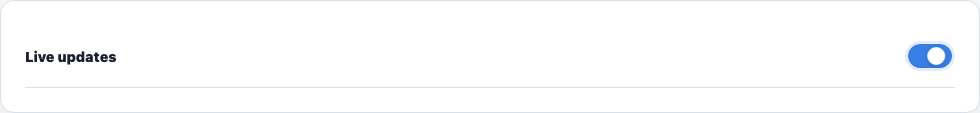
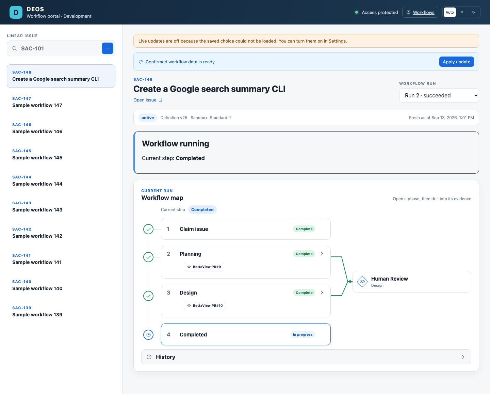
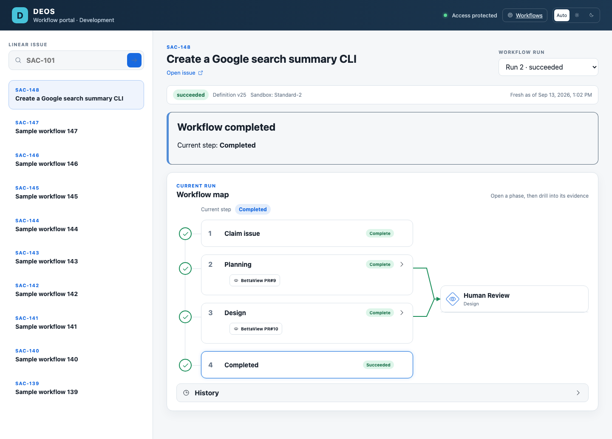
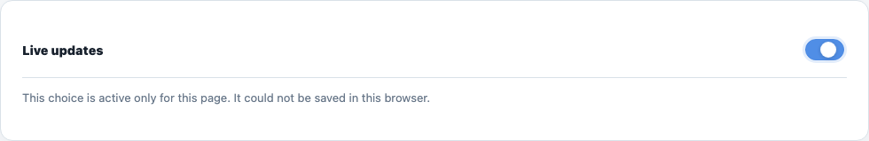
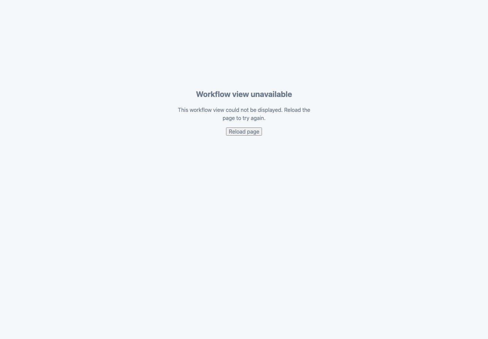

# SAC-153: Live updates

The Settings switch saves a versioned preference in this browser. Manual mode remains the default. Live mode promotes each confirmed poll result as one snapshot, including any pending result when the switch turns on.

## Verification

- 88 portal tests passed, including five new preference and snapshot tests.
- Portal TypeScript checks, both portal production entry builds, and strict OpenSpec validation passed.
- Browser tests exercised the built production bundle against controlled local read responses. They covered first-load baselines, the latest manual update, live promotion, toggles, reload and reopen, two tabs, separate browser contexts, storage failures, retained data after a failed read, and the render error panel.
- A second browser test covered a delayed issue response, a mode change while a poll was in flight, and switching to another run's baseline.
- Request capture found no preference-bearing request or write. The zero-request toggle assertion waits for the existing Settings reads to finish first.
- Codex Browser also verified the switch and its saved state after reload against the local development build. Visual inspection led to reuse of the existing switch style.
- Original errors and operation context stay in the browser console. Tests check original storage error identity. The theme storage path also handles denied storage so it cannot prevent the Live updates fallback from rendering.

See [executable browser checks](checks.md). To reproduce, install dependencies, run `npm run portal:build`, start `npx vite preview --config portal/vite.config.ts --host 127.0.0.1 --port 4173`, then run the commands in the checks document.

## Evidence boundary

These are local browser tests with controlled fixtures, not provider-originated or production proof. The screenshots use sample run data in the current grouped workflow layout. Earlier PR screenshots incorrectly used the legacy version-1 layout; those have been replaced. The test still checks the legacy layout separately, without using it for the screenshots. The existing poll interval, response comparison, read API, and server data are unchanged. This change does not add a new projection ordering rule.

Production deployment, active-version readback, and authenticated live screenshots remain a release step after authorization. No portal or backend was deployed for this implementation PR.

## Screenshots

