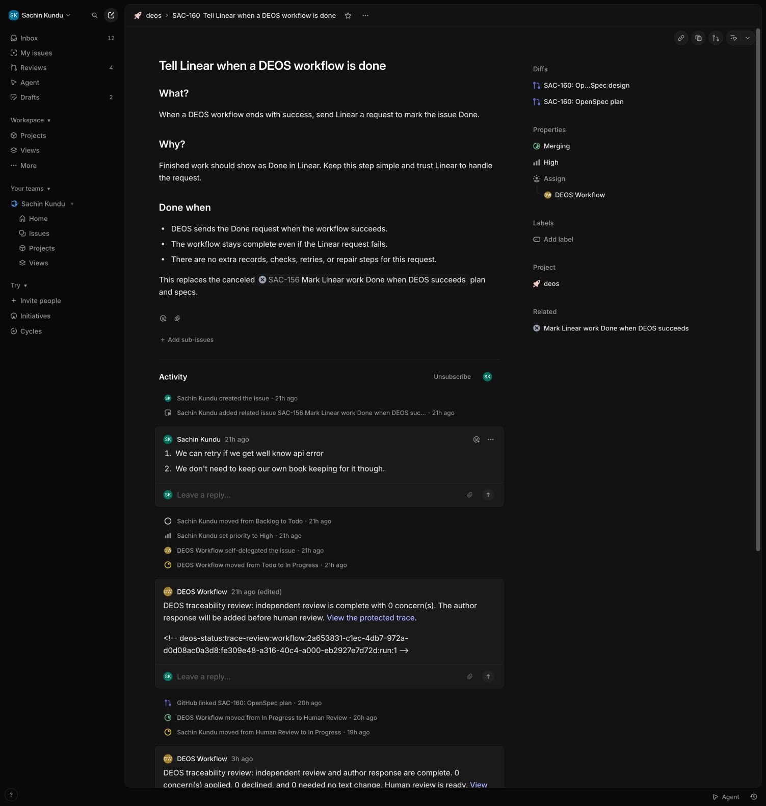
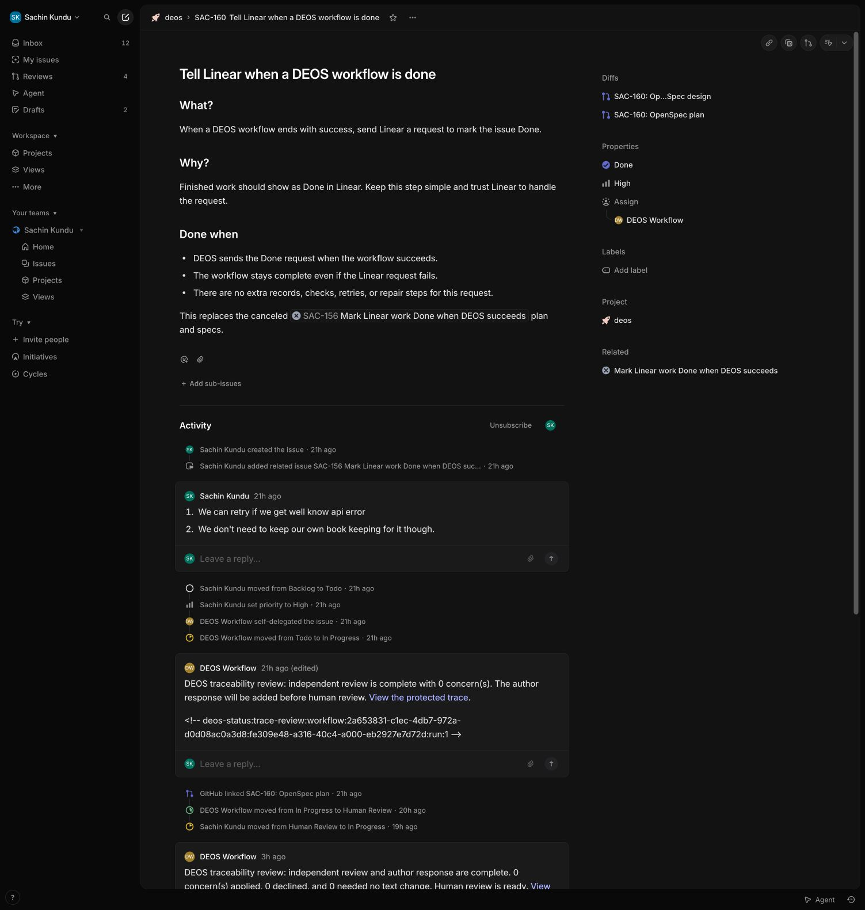
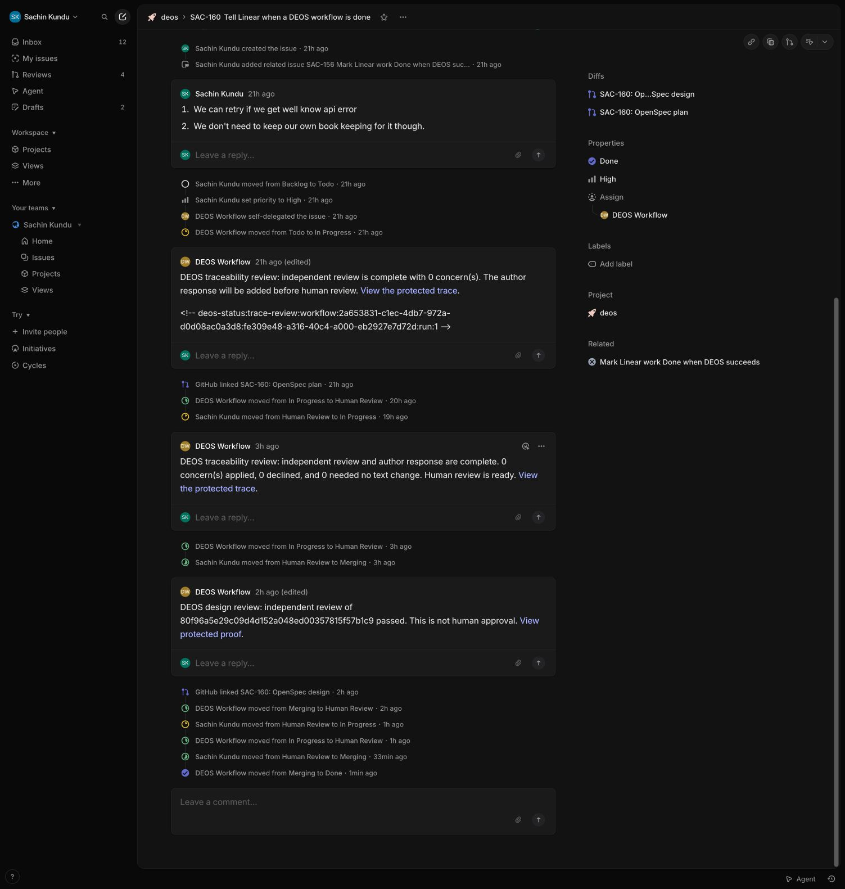
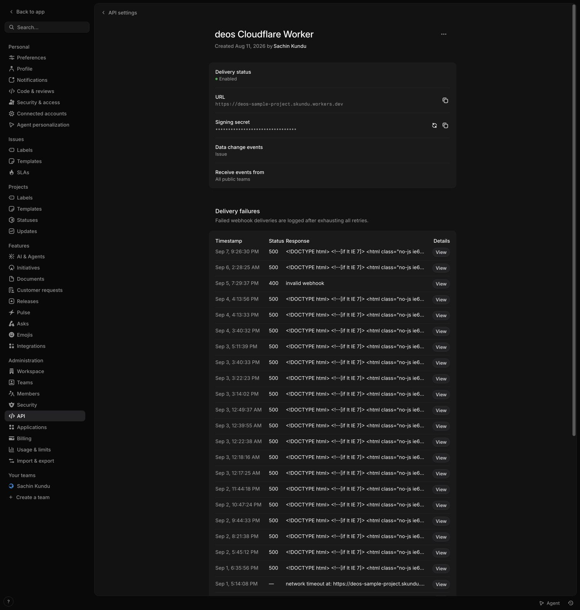

# SAC-160 implementation evidence

SAC-160 was `succeeded` in DEOS at 08:02:21 UTC on 8 September 2026 but still
`Merging` in Linear. The new terminal callback moved it to `Done` as the
DEOS Workflow app actor. A real rejected request left the run complete.

## What was exercised

This was a controlled replay of the existing provider-started run's exact final
traversal, not a fresh end-to-end run or a Cloudflare platform restart. The
same production `commitOutcome` and Linear client ran on the deployed Worker.
The harness supplied the recorded merge outcome; it did not run an agent or
merge a PR. New commits, replay, stale guards, all terminal outcomes, and retry
bounds also have deterministic tests.

The [Showboat record](proof.md) contains the real commands and output. The
[temporary harness source](terminal-replay.ts.txt) is archived for review only.
It required a random local bearer key, was limited to SAC-160 traversal 40, and
was removed from the active Worker. Do not replay the historical deployment
commands. The `read-proof.py` and `read-deployments.py` scripts remain read-only
and accept the path to an ignored env file; no credentials are included here.

## Provider evidence

- Original signed trigger: `49ad7fa5-9627-4d67-b90b-62723259dd42`, relevant.
- Final human merge event: `48ca5c85-0a1c-45a7-89f4-6681f409c4b7`, relevant.
- First app Done assignment: 08:33:54 UTC, visible in Linear activity.
- After the ingress fix, the controlled test reset to Merging produced signed
  delivery `7a5bbbf0-bbf2-48e8-aee7-5c441fef87a6` at 08:40:06 UTC.
- The repeated app Done assignment produced signed delivery
  `05373765-6b8a-4556-a646-0da87c131af6` at 08:40:26 UTC.

Both final deliveries are correctly `irrelevant`: the run is already terminal.
They are recorded after signature verification but are not sent to the workflow
inbox. Thus their actor/state inbox columns are null. Actor attribution and
state changes come from the independent Linear activity screenshots, paired
with ordered correlated ingress rows and the successful app request. The
application never uses these observations as confirmation or retry input.

Before and after the rejected request and successful calls, D1 has the same
terminal timestamp, traversal 40, 40 transitions, 51 provider operations,
zero stage retries, and zero runtime recoveries. No outbound receipt was added.

## Integration defect found by the live test

The first returning delivery reached the existing Python ingress but got HTTP
500: optional route fields used Python `None`, which becomes JavaScript
`undefined` at the D1 boundary. Explicit `jsnull` fixes ignored-delivery
persistence. The fresh provider deliveries above verify the corrected path.

## Active deployment

- Orchestrator: `4f4d5044-a85d-49a7-9ecc-d46dee402bab`, 100%.
- Python ingress: `c9aa04f4-b81d-412a-ac73-b9e6eb5e7ae0`, 100%.
- Container image unchanged: `sha256:39c3bc98bfbd51f6da275b0c8470b79317fcc53efb71bd3ec8422df57a948053`.
- Four healthy container instances; portal deployment unchanged.
- The temporary test endpoint returns 404.

## Contracts and checks

[Linear state assignment](https://linear.app/developers/graphql) and
[rate-limit errors](https://linear.app/developers/rate-limiting) were checked
against primary documentation and the deployed app credential. Only an unmixed
`RATELIMITED` response on HTTP 200/400 is retryable. Unknown, transport, timeout,
auth, and 5xx errors stop. Each request has a ten-second timeout, and each
notification invocation has at most three attempts.

[Pyodide conversion rules](https://pyodide.org/en/stable/usage/type-conversions.html)
explain the ingress fix. Backend typecheck, 325 TypeScript tests, 38 Python tests,
Python lint/compilation, and strict OpenSpec validation pass.

## Screenshots

