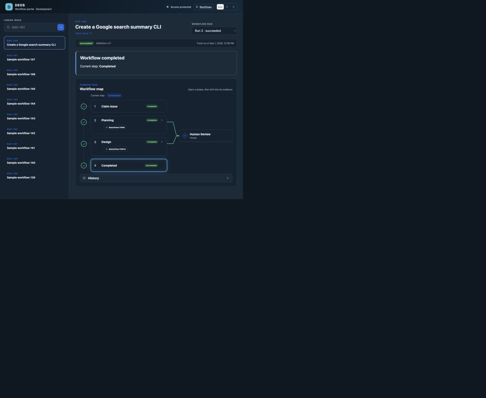

# SAC-161: recent issue searches

Planning: [proposal and specs #111](https://github.com/sachinkundu/deos/pull/111),
[design #113](https://github.com/sachinkundu/deos/pull/113).

The sidebar now reads the person's last ten successful searches from D1.
Repeating a search moves that issue first. A reload reads the saved list.
Opening an entry uses its stable issue ID and the existing run selection.

## Implementation

| Approved behavior | Files |
| --- | --- |
| Atomic deduplication, order, trim and snapshot | `migrations/0034_portal_recent_issues.sql`, `src/recent-issues.ts` |
| Revalidate Access and derive ownership from issuer and subject | `src/recent-issues-identity.ts`, `src/recent-issues-entrypoint.ts` |
| Record only an exact issue with a workflow view | `portal/src/model.ts`, `portal/src/worker.ts` |
| Load history, preserve confirmed data on error, reject old responses | `portal/src/main.tsx` |
| Check staging before protected production; reuse the checked Worker bundle and assets | `.github/workflows/portal-release.yml`, `scripts/portal_release.py`, `scripts/check-portal-recent-issues.mjs` |

Recent history uses the new internal `RecentIssues` binding. The portal's
existing D1 reads and legacy Workflow Map history remain as they were. No
recent-history SQL runs in the portal Worker.

The repository uses D1 `batch()` for delete, insert, trim and select. Cloudflare
documents that a failed statement rolls back the entire batch:
[D1 database API](https://developers.cloudflare.com/d1/worker-api/d1-database/#batch).

## Evidence

- [Executable checks and remote planning state](verification.md).
- 374 existing backend tests, 73 portal tests, and 59 Python tests passed.
- Backend and portal type checks, generated binding checks, Python lint,
  OpenSpec validation, and portal builds passed.
- Wrangler accepted the prebuilt portal bundle with `--no-bundle` in a dry run.
  The queue Worker dry run also passed.
- The new local D1 test uses Miniflare's database. It covers separate owners,
  eleven searches, a repeated issue, Unicode bounds, concurrent updates, and
  rollback after a forced failure in the final snapshot query.
- Signed JWT tests cover subject isolation, email rename/reuse, different
  issuers, wrong audience, and missing subject. API tests cover eligibility,
  read-only stable-ID navigation, and storage errors.

This screenshot was captured in Codex Browser with **local sample data**.
It proves rendering and opening a saved issue, not live history persistence.

## Live verification and release remain pending

No remote schema, Worker, issue state, or workflow state was changed in this
implementation session. D1 confirmed SAC-161's planning run is already done.

GitHub's staging environment currently allows only the `main` branch. The
feature branch cannot use those deployment credentials before merge. The live
staging browser also requires Google sign-in, and the staging environment has
no `PORTAL_REVIEWER_ACCESS_ASSERTION` secret. These are missing prerequisites,
not passing staging evidence.

After the implementation is accepted:

1. Apply only `0034_portal_recent_issues.sql` once to the existing shared D1
   database. Read back its schema. Do not apply unrelated pending migrations.
2. Deploy the trusted queue Worker with `RecentIssues` and its Access settings.
   Verify the active version and preserve the separately running portal.
3. Supply a valid, short-lived assertion for the authenticated reviewer through
   the staging environment secret `PORTAL_REVIEWER_ACCESS_ASSERTION`. A service
   token is not a substitute for that person's stable identity. Never commit
   the assertion or include it in proof artifacts.
4. Run the manual release workflow for the full accepted commit SHA. Its
   `portal-staging` job deploys that revision and checks eleven searches,
   repetition, trimming, reload, an ineligible search, stable-ID opening, and
   unchanged run state in a real browser. The check writes only the reviewer's
   bounded history. It uploads a screenshot, result, Worker bundle, and assets.
5. The `portal-production` job requires that same staging job to pass. It
   downloads only the same workflow run's immutable artifact. The existing
   protected production environment still requires human approval. The script
   rejects missing/failed/different-revision checks before moving `release`.
   Production deploys the checked bundle and assets without rebuilding them.

The existing production environment has a required reviewer and a dedicated
production secret. A broader repository Cloudflare secret also exists; this
session did not prove that all credentials outside the production job lack
production deployment rights. That exclusivity requirement from the approved
design must be verified before release. A new job dependency alone cannot
establish the permissions of existing Cloudflare tokens.

If the browser check fails or any prerequisite is absent, production remains
ineligible. Restore the prior portal version on a release regression and leave
the additive history table in place.
