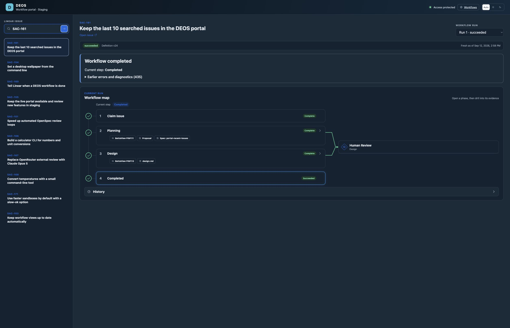

# SAC-161: recent issue searches

Planning: [proposal and specs #111](https://github.com/sachinkundu/deos/pull/111),
[design #113](https://github.com/sachinkundu/deos/pull/113).

The sidebar now reads the person's last ten successful searches from D1.
Repeating a search moves that issue first. A reload reads the saved list.
Opening an entry uses its stable issue ID and the existing run selection.

## Implementation

| Approved behavior | Files |
| --- | --- |
| Atomic deduplication, order, trim and snapshot | `migrations/0034_portal_recent_issues.sql`, `src/recent-issues.ts` |
| Revalidate Access and derive ownership from issuer and subject | `src/recent-issues-identity.ts`, `src/recent-issues-entrypoint.ts` |
| Record only an exact issue with a workflow view | `portal/src/model.ts`, `portal/src/worker.ts` |
| Load history, preserve confirmed data on error, reject old responses | `portal/src/main.tsx` |
| Check staging before protected production; reuse the checked Worker bundle and assets | `.github/workflows/portal-release.yml`, `scripts/portal_release.py`, `scripts/check-portal-recent-issues.mjs` |

Recent history uses the new internal `RecentIssues` binding. The portal's
existing D1 reads and legacy Workflow Map history remain as they were. No
recent-history SQL runs in the portal Worker.

The repository uses D1 `batch()` for delete, insert, trim and select. Cloudflare
documents that a failed statement rolls back the entire batch:
[D1 database API](https://developers.cloudflare.com/d1/worker-api/d1-database/#batch).

## Evidence

- [Executable checks and remote planning state](verification.md).
- 374 existing backend tests, 73 portal tests, and 59 Python tests passed.
- Backend and portal type checks, generated binding checks, Python lint,
  OpenSpec validation, and portal builds passed.
- Wrangler accepted the prebuilt portal bundle with `--no-bundle` in a dry run.
  The queue Worker dry run also passed.
- The new local D1 test uses Miniflare's database. It covers separate owners,
  eleven searches, a repeated issue, Unicode bounds, concurrent updates, and
  rollback after a forced failure in the final snapshot query.
- Signed JWT tests cover subject isolation, email rename/reuse, different
  issuers, wrong audience, and missing subject. API tests cover eligibility,
  read-only stable-ID navigation, and storage errors.

This screenshot was captured in Codex Browser with **local sample data**.
It proves rendering and opening a saved issue, not live history persistence.


## Live staging verification

The user explicitly requested a manual staging deployment and Brave verification,
with production on its own timeline. The staging CI branch policy was left intact.

- Applied `0034_portal_recent_issues.sql` to shared D1 and read back the schema.
- Added only the history entrypoint to the deployed backend. The final baseline
  is `8710906`, which includes the newer publication recovery fix. The additive
  deployment commit is `463ce4d` on `codex/sac-161-backend-rollout`. Container
  rollout was disabled.
- Queue version `55d1b170-2fc1-4676-b3d0-54eb357595f2` is active at 100%.
- Staging portal version `0a1c7617-05ac-4405-97e7-a63bc21a31a5` is active at 100%.
  The deployed source SHA is `f20e35c6d405271235eb04711381c0baec7f5b9d`.
  This was a manual feature-branch deployment; the fixed staging configuration's
  nominal `PORTAL_SOURCE_BRANCH` label remains `main`.
- Brave was already signed in. Ten real completed/ongoing issues were searched:
  SAC-153, SAC-161, SAC-171, SAC-168, SAC-167, SAC-166, SAC-151, SAC-155,
  SAC-160, and SAC-154. All ten search responses returned HTTP 200 and committed
  snapshots with versions 1 through 10.
- Repeating SAC-161 moved it first. Reload returned version 11 with the same ten
  distinct entries in the same order. SAC-166 opened by stable ID and selected
  Run 3, with its earlier runs still available. An unmatched search returned
  `state: unchanged` and retained the list.
- D1 independently confirmed the ten entries and unchanged state for all ten
  workflows. The user accepted these ten live searches as sufficient; eleventh-
  item eviction remains covered by the local D1 test.
- Production portal version `b01771d7-464b-4c5d-b6d8-e613f759f201` and its
  deployment record are unchanged. No production portal release was attempted.

[Brave API responses](staging-browser-responses.json),
[D1 readback](staging-d1-readback.json), and
[deployment readback](staging-deployment.json) retain the live evidence.



### Concurrent backend deployment and recovery

The initial history deployment used backend `50c99dc` and version `44beec91`.
A separate SAC-170 deployment then activated `2cde8efc` from `8710906`, removing
the history entrypoint. Brave showed the explicit unavailable message and HTTP
503. D1 still held all ten entries. The history entrypoint was added to that newer
baseline and deployed as `55d1b170`. Brave Retry returned HTTP 200 and restored
the same version-11 snapshot. [Recovery response](staging-recovery.json) and the
final executable readback below record the repair. Both backend changes are
preserved; no workflow was restarted.

### Deployment command error retained

The staging upload became active before Wrangler failed its later zone-route
read. The command exited with status 1 and was not retried or treated as a clean
CLI success:

```text
A request to the Cloudflare API
(/zones/8a120356c46d1557fbf7fec6cbed7a19/workers/routes) failed.
Authentication error [code: 10000]
subprocess.CalledProcessError: Command npx wrangler deploy --config
portal/wrangler.jsonc --env staging ... returned non-zero exit status 1.
```

Independent provider readback confirmed the new version at 100% traffic. Brave
confirmed that the existing staging hostname served the new feature. The original
Wrangler diagnostic is in the local log `wrangler-2026-09-12_12-44-54_919.log`.

### Production remains separate

The new release workflow still requires its own same-revision staging job and
protected production approval when a production release is requested. That CI
browser check needs a short-lived reviewer Access assertion. Its version check
uses the existing Access service credentials because `/api/version` has a
separate service-token Access policy. Those credentials are never stored in
proof artifacts.

The broader repository Cloudflare token's production rights have not been audited.
That credential-exclusivity check belongs to the later production release; it
is not claimed by this manual staging verification.
