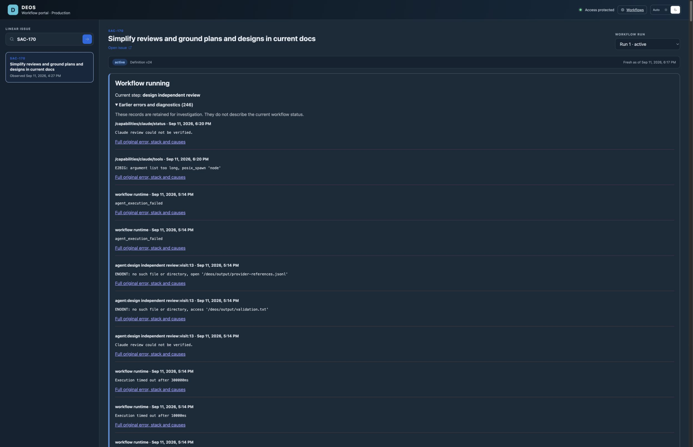

# SAC-170 original error preservation

*2026-09-11T15:22:37Z by Showboat 0.6.1*
<!-- showboat-id: 0c347cae-021d-46f9-a707-cd1c04ba9189 -->

All 375 backend tests and TypeScript checks passed. Worker version d5811a58-9705-4e44-abe0-4c7e257684bd was deployed at 100% traffic. The container image remained sha256:e7ed313d4b4a57a1142b2fc2726f96c1aa1767cdb84f0088a103e24c0c795e1f with four healthy instances. The authorized retry preserved run 1 and frozen definition v24. Its new attempt was 01a0910c-2910-7efd-ae57-b5f817c8af3a.

```python3
import importlib.util,json,urllib.request
from pathlib import Path
s=importlib.util.spec_from_file_location('credentials','.agents/skills/linear-workflow-telemetry/scripts/query_workflow_telemetry.py')
h=importlib.util.module_from_spec(s);s.loader.exec_module(h)
account,token=h.load_credentials(Path('.env'),Path('wrangler.jsonc'))
sql="SELECT location,message,occurred_at,detail_r2_key FROM workflow_errors WHERE run_id='workflow:2a653831-c1ec-4db7-972a-d0d08ac0a3d8:eecb8048-26ce-4c5c-9467-97e583842f5b:run:1' AND location='src/claude-runner.ts:handle:tools' AND occurred_at>'2026-09-11T15:17:00Z'"
r=urllib.request.Request(f'https://api.cloudflare.com/client/v4/accounts/{account}/d1/database/4e854f8a-018a-42c4-a325-c4b8805c06b2/query',data=json.dumps({'sql':sql}).encode(),headers={'Authorization':'Bearer '+token,'Content-Type':'application/json'})
with urllib.request.urlopen(r,timeout=30) as response:
 print(json.dumps(json.load(response)['result'][0]['results'],indent=2))

```

```output
[
  {
    "location": "src/claude-runner.ts:handle:tools",
    "message": "E2BIG: argument list too long, posix_spawn 'node'",
    "occurred_at": "2026-09-11T15:20:20.379Z",
    "detail_r2_key": "original-errors/workflow%3A2a653831-c1ec-4db7-972a-d0d08ac0a3d8%3Aeecb8048-26ce-4c5c-9467-97e583842f5b%3Arun%3A1/7b673eeb-c116-49ed-a486-69a302cdfcf4.json"
  }
]
```

The saved job produces 163,413 bytes of read-tool state, encoded into a single 217,884-byte command argument. ProcessSpawnFailedError retains the SDK stack at ClaudeRunner.read. The invocation failed without a review receipt. This verifies original-error capture in production; it does not fix the oversized-argument defect. The next repair should pass context via a file or standard input.


