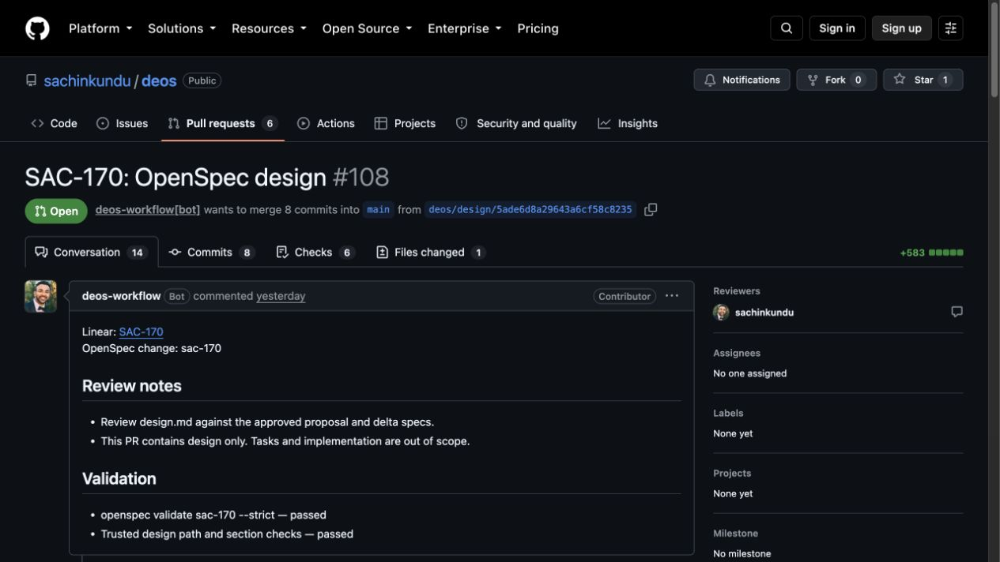

# Quoted arguments in the review reader

SAC-170 review attempt `01a0956a-3a29-778f-aa53-4b186d7d5aca` failed on:

```text
rg -n -i "skill|subagent|web search|harness" docs/current-architecture.md
```

The shared reader rejected every pipe character before it parsed quotes. The
quoted pipes above are regex alternatives, not shell pipelines. The same check
also rejected quoted dollar anchors and literal punctuation. Its regex-based
tokenizer did not reliably handle escapes or adjacent quoted word fragments.

Commit `50c99dc` replaces that check with argument parsing that tracks quotes
and escapes. Quoted characters stay data. Unquoted shell operators remain
forbidden. The parsed operation still goes to the bounded snapshot reader;
reviewer input never reaches a shell. Operation, flag, frozen-path, and hash
checks remain in place. Both Claude and native self-review use this parser.

The tool description now documents quoting, regex escapes, and the `--`
separator for patterns beginning with a hyphen. Unsupported flags and actual
shell commands remain unsupported; this is a small read interface, not a full
implementation of the `rg`, `sed`, or other command-line programs.

Validation: 388 backend tests passed; TypeScript checks passed. A real local
reader subprocess receives a saved request file, materializes frozen sources,
and runs the exact production search. Other cases check quoted regex anchors,
word boundaries, whitespace escapes, literal punctuation, escaped quotes,
paths with spaces, and rejection of shell execution and out-of-snapshot reads.
The existing tests still check source hashes and error retention.

One adjacent issue remains separate: a rejected tool call marks the whole
Claude invocation failed in `src/claude-runner.ts`. Recoverable tool mistakes
should be returned to the reviewer with the exact error so it can correct the
request under bounded retry rules. Unexpected failures and boundary violations
must retain their causes. This belongs with SAC-174's recovery contract.

## Production rollout

After confirming no agent attempts were active, the backend was deployed.
Readback confirmed Worker `bd4f0a74-584c-43db-8755-37378771328f` at 100% traffic
and all four containers healthy on image
`sha256:a275dfc2c81de9cc167606907ce5724bdbc3ed71dc40e3bf787232381844f875`.
The gradual rollout completed. Neither portal was deployed.

At 12:04:29 UTC on September 12, the supported retry endpoint accepted one
retry of the failed reader attempt in the same business run and frozen v24
definition, advancing visit 47 to 48. New Workflow instance:
`wf-v1-qukaj5wlowestvgpyeel6orrimijpsnvy2b6wxqhvtwa2xdv7trq`.
New review attempt: `01a09581-521a-717b-abf6-bd402993d528`.
The review completed and returned concerns. The author response also completed.
The run then failed during design publication, as recorded below.

[Showboat validation, rollout, and retry output](reader-rollout.md) records
the actual command results. Temporary operator helpers and request files were
saved under `/tmp`; do not replay mutation commands as verification.


## Production outcome: September 12, 12:20 UTC

The real Claude review completed with `concerns`; its invocation finished with
no safe cause and its runtime was destroyed. The author response completed too.
This proves the repaired review path completed in production. It does not mean
the full workflow reached Human Review.

The run failed at `publish_design_response`, visit 50. The original error was:

```text
Error: GitHub design pull-request read-back mismatch
    at GitHubCapabilityAdapter.publishDesign (queue-consumer.js:34702:528)
    at async SystemActionController.publishDesign (queue-consumer.js:35801:23)
    at async queue-consumer.js:113:16
```

D1 error `a5263317-a832-4502-9de9-a8351ddfe531` records this at
`2026-09-12T12:20:32.710Z`. Its protected R2 detail contains the original message,
name, and stack. No cause or expected/actual field values were attached by the
throw site. The condition at `src/github-capability.ts:1006-1016` checks PR
identity, state, head, base, title, body, and design contents together. The
retained error does not identify which comparison failed. That is a separate
diagnostic gap, not evidence of another reader or authentication failure.

Earlier saved errors say `Execution timed out after 300000ms`, with stack
`WorkflowTimeoutError: Execution timed out after 300000ms` at
`ContextImpl.waitForEvent (index.js:24169:26)`. Cloudflare's step history shows
these were agent-event waits: execution continued, collected the completed
author response, then entered publication. They were not the terminal cause.
The later `system_action_invariant_failed` is the workflow classification.

At readback, GitHub PR #108 was still open, with head
`3a5ba08f296ecfbbc41189aa3dad1a2d9c5366f8` and update time 12:20:31 UTC.
D1 was `failed/system_action_failed` at 12:20:33.164 UTC; Cloudflare was
`errored`. Linear remained In Progress. Both new agent runtimes were destroyed.
SAC-161 remained succeeded/done. No new deploy, retry, credential change, or
human-gate transition was performed. The monitor was paused at this terminal
failure.

[Read-only provider readback](reader-outcome.md) records the real D1,
Cloudflare, and GitHub output. Full original errors remain in protected R2;
local copies were retrieved for inspection without publishing private logs.


