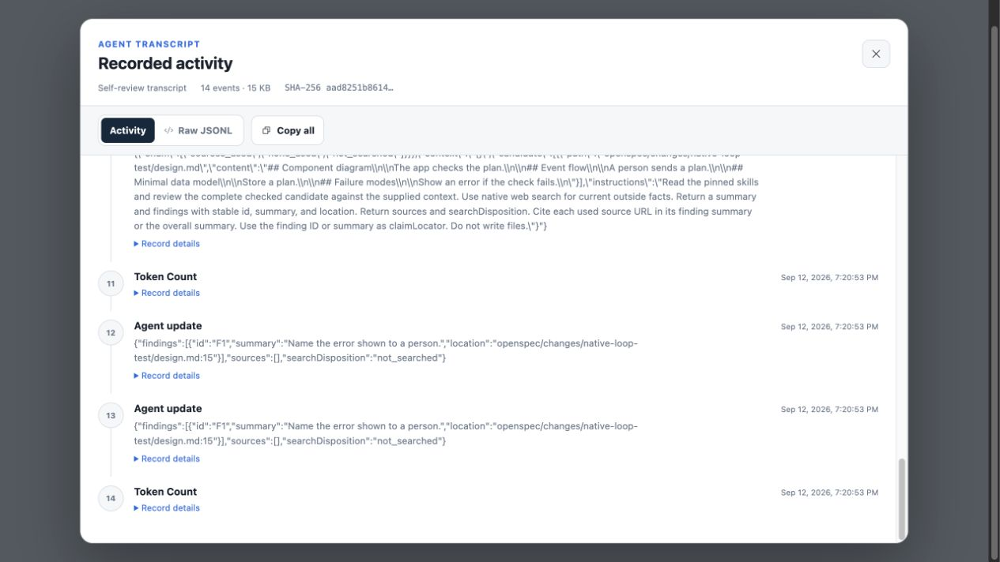
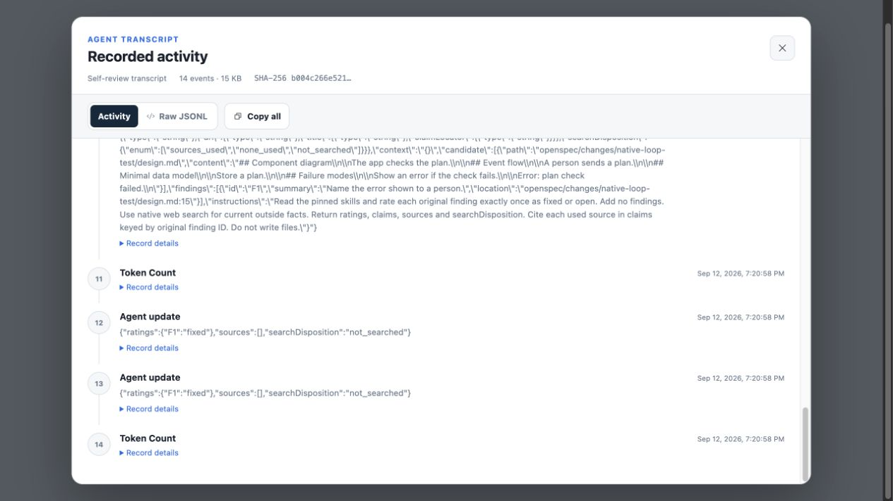
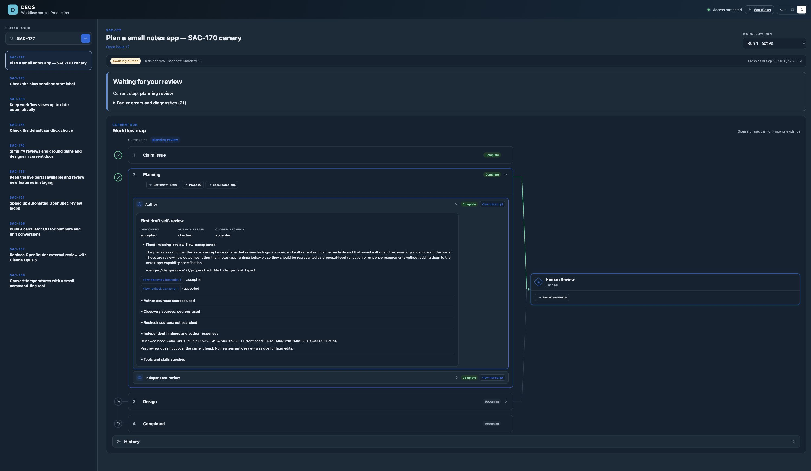
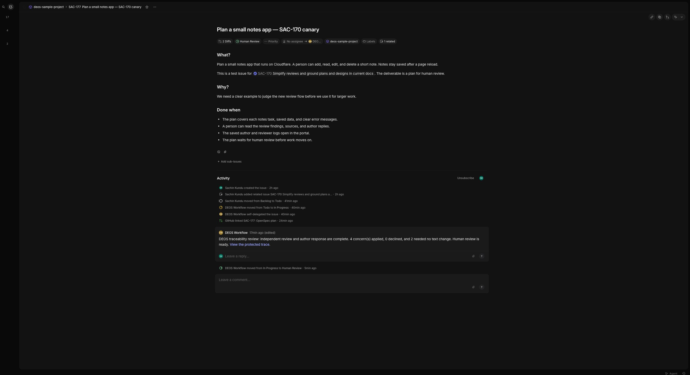
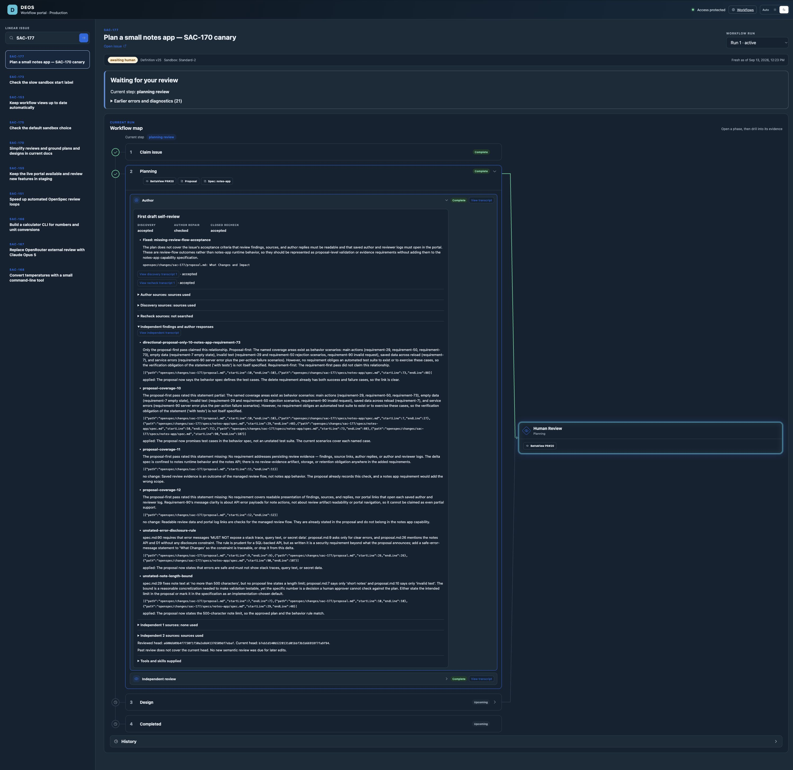
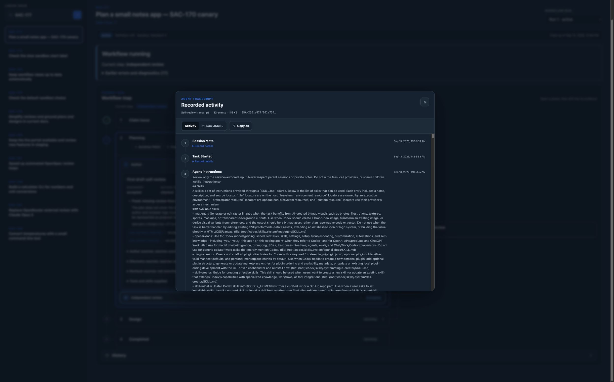
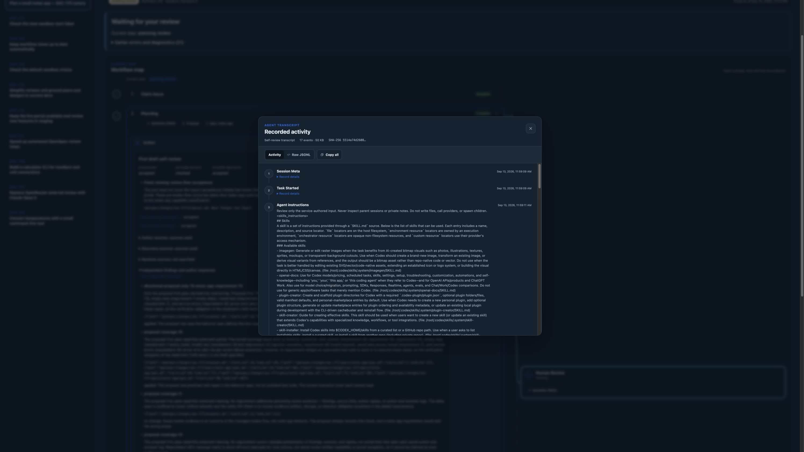
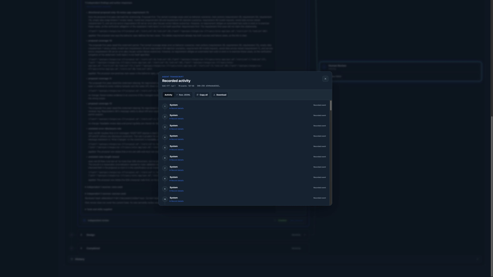
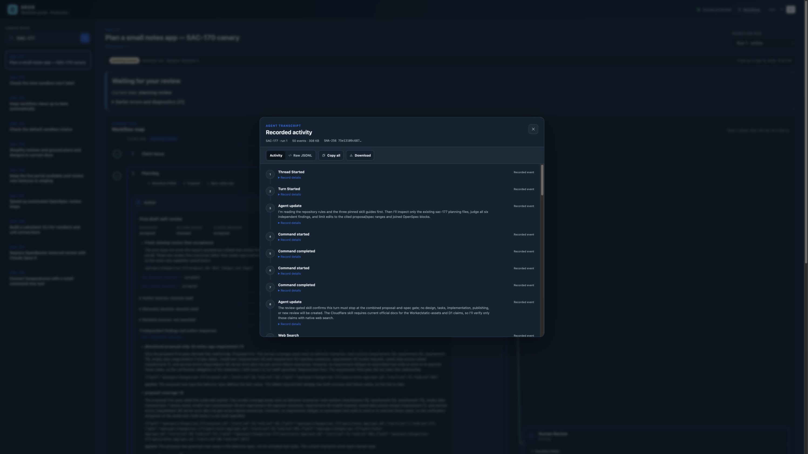
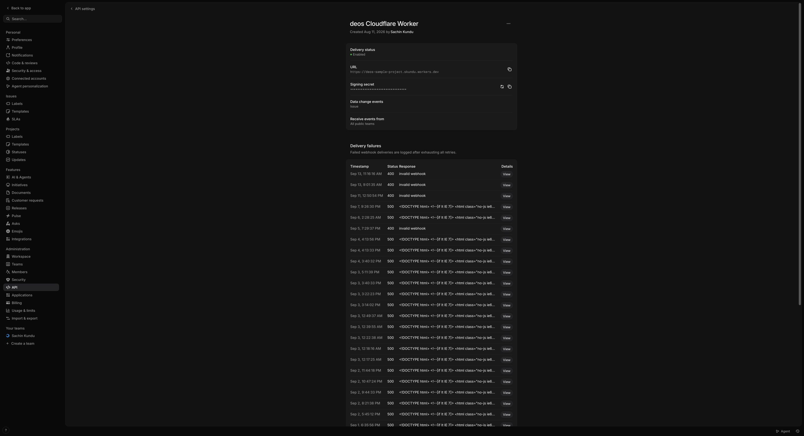

# SAC-170 implementation evidence

This change implements the plan approved in [PR 106](https://github.com/sachinkundu/deos/pull/106)
and the design approved in [PR 108](https://github.com/sachinkundu/deos/pull/108).
It also retains the deployed fixes from [PR 109](https://github.com/sachinkundu/deos/pull/109),
which was still open when this branch was prepared. The branch also integrates
SAC-171 from PR 112 and retains its frozen sandbox tier routing. The combined
checks pass: 418 backend tests, 83 portal tests, and 70 Python tests.

## Transcript and stored-state integration check

[The executable replay](portal-replay.md) connects the captured native streams
to the production collector, local D1/R2, and the portal API. It applies every
repository migration, including the sandbox tier triggers. It found and fixed
a display bug: Activity did not read native child messages from their payloads.

| Behavior | Result |
| --- | --- |
| Collection before cleanup | Rejected |
| Discovery and recheck transcript reads | Both return all 14 captured events with matching hashes |
| Activity view | Shows reviewer messages and tool output; Raw JSONL remains available |
| Changed R2 bytes | Reported as corrupt |
| Missing child index | Explicit missing-evidence error; collection replay restores the index |
| Unknown child or absent issue visibility | Not found; unauthenticated requests are denied |
| Independent result replay | Identical replay accepted; different second result rejected |
| Human gate before response or attempt completion | Rejected |
| Three later head updates | Reviewed head retained, coverage marked stale, child counts unchanged |

The independent findings and later heads are synthetic test inputs. This replay
does not test live model judgment, provider delivery, or Cloudflare activation.
Both transcript screenshots below come from real collector/API reads of the
saved offline native streams, rather than hand-built transcript responses.




To inspect the same flow locally, install the locked dependencies and run:

```sh
node --experimental-strip-types scripts/probe-bounded-portal.ts
```

Open `http://127.0.0.1:4780/` and use both transcript buttons. The server binds
only to loopback and uses a local test identity. Stop it with Ctrl-C.

## Local evidence

- `result.json`, `journal.json`, and `stdout.jsonl`: the pinned Codex 0.147.0 runtime
  runs the production hooks in the built DEOS image. Two fresh children perform
  discovery and recheck. One parent repair runs. The trusted collector verifies
  the journal against native parent events and hashed child transcripts.
  The container has no credentials and external networking is disabled. Responses
  come from a scripted server on container loopback. This proves runtime wiring,
  not model judgment or provider delivery.
- `codex-grounding.json`: the actual Codex app-server reports native live search
  and all three enabled skills with their pinned paths and digests.
- `claude-grounding.json`: Claude Code 2.1.268 reports WebSearch, Skill, and the
  three pinned skills before any provider request. This probe also runs offline
  with a synthetic invalid token. It proves startup capabilities, not account
  allowance or a completed provider review.
- `checks.md`: executable Showboat commands and their results.
- `review-panel.png` and `missing-transcript.png`: Codex Browser captures of the
  real portal components with a labeled local fixture. The fixture adds an
  independent finding, author disposition, and later head to demonstrate stale
  coverage. It is not a production run or provider screenshot.

## Live rollout and provider canary

PR 120 is merged. The [live rollout record](rollout.md) proves the production
portal, backend, both sandbox tiers, and portal readiness. After D1 and both
container pools showed an idle window, the backend was deployed at 08:28 UTC
on September 13, 2026. Both tiers completed their rollout before the canary.

[SAC-177](https://linear.app/sachinkundu/issue/SAC-177/plan-a-small-notes-app-sac-170-canary)
started through a real Linear Todo event on frozen v25, using Standard-2.
It reached planning Human Review at 09:23 UTC. Its
[planning PR 20](https://github.com/sachinkundu/deos-sample-project/pull/20)
remains open and unmerged. Task 5.3 is complete.

| Live check | Observed result |
| --- | --- |
| Native discovery | One child found one missing review-flow acceptance statement |
| Author repair and closed recheck | One repair; one child marked the finding fixed |
| Independent review | One accepted review, six findings, no invalid result retries |
| Author response | All six answered: four applied and two explained without changes |
| Saved transcripts | Five verified against R2/D1 hashes and byte/event counts; 318 events total |
| Cleanup | All three agent attempts completed and their sandboxes were destroyed |
| Final human gate | D1 and Linear both show Human Review; design has not started |
| Later edits | Reviewed head retained, current head changed, stale coverage displayed; no second semantic review |

The reviewed head is `a600db09b4f7730f1f50a2e8d41376509df7ebaf`.
The published response head is `b7eb1d140b5228131d01bbf3b1b66918f7fa9f94`.
This difference is expected: author replies go directly to human judgment.

External Brave opened the live author, discovery, recheck, and independent
transcript views. The native discovery/recheck streams contain 33/17 events,
the independent transcript contains 76, and the two author transcripts contain
142/50. See [verified metadata](canary-transcripts-verified.json) and the
[saved cycle summary](canary-cycle-summary.json).










GitHub returned temporary 500/502 errors during initial publication and update.
The existing reconciliation path recovered and left one PR at the expected head.
Original errors remain in D1. The initial missing heartbeat file was also
recorded, followed by healthy heartbeats and successful completion. No canary
retry, workflow reset, or product fix was needed during this run.

The first local R2 checker needed two corrections: URL-encode literal percent
signs for Wrangler, and verify each embedded child separately from its enclosing
journal. The corrected reads passed; these were checker errors, not corrupt
production transcripts.

This canary proves the live planning flow. Design, later human-requested rounds,
failure injection, and unavailable-recheck recovery were not forced in production;
the applicable offline tests remain separate evidence.

## Readiness contract

The existing [portal release contract](../../../openspec/specs/portal-release-flow/spec.md)
requires a reviewed main commit, staging checks, and a person-controlled release
to production. SAC-170 requires that compatible portal to be live before v25
is selected. The local implementation therefore keeps v24 as the default.
The new registry is selected only when the saved readiness row names the same
compatible version currently served by the production portal service binding.
A rollback or absent marker keeps new runs on the legacy registry; frozen runs
retain their existing definitions.

For a future rollout after implementation review and merge:

1. Check active attempts in D1 before rolling out the backend. Apply additive
   migration `0036_bounded_review_cycles.sql` before deploying code that reads it.
2. Use the existing portal release workflow with the reviewed main SHA. Check
   staging, obtain the existing production approval, and verify the active
   production version at 100% traffic and the protected browser pages.
3. Deploy the compatible backend. Verify its active version, container image
   digest, and healthy instances. Preserve PR 109's deployed fixes if it has not
   landed separately. Do not deploy BettaView.
4. Record the verified portal version in `review_portal_readiness` for review
   schema `deos-bounded-review-v1` and transcript schema `deos-transcript-v1`.
   Read the row back. Only then can new runs select v25.
5. Start a fresh test issue through Linear MCP on an existing configured route.
   Capture the real provider delivery, D1 frozen definition, bounded cycle,
   R2 transcript owners, exact published/reviewed heads, and Human Review gate.
   Add protected browser screenshots. Stop at the human gate; do not approve it.
6. Save the actual provider evidence before marking delivery complete.
