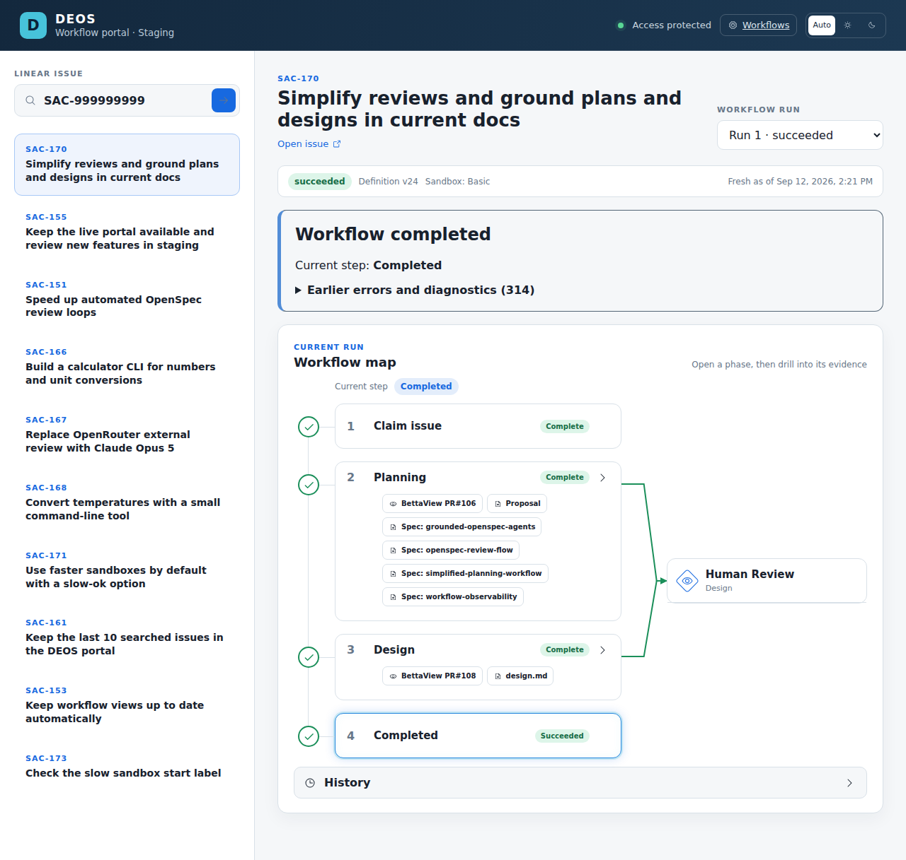

# SAC-170 rollout and provider canary

*2026-09-13T07:10:57Z by Showboat 0.6.1*
<!-- showboat-id: 941f2fb2-b415-464a-b1ae-306fe4c62614 -->

The user authorized merging PR 120, deploying, and testing on 2026-09-13. PR 120 merged at 906103f1488a302d5dc6087213fcec143cc01bb9. SAC-177 is the new notes-app planning canary in deos-sample-project, prepared in Backlog. It must not start until v25 readiness and backend activation are verified. The canary stops at Human Review. Staging deployed successfully. Production release run 34744338374 stopped because its reviewer Access session secrets were absent; no production portal or backend deployment has occurred yet. D1 migrations 0034 and 0036 were applied. The readiness table remains empty. Existing SAC-173 and SAC-175 v24 revision attempts became active after the initial empty-attempt check and are left untouched.

```bash
rtk proxy gh pr view 120 --repo sachinkundu/deos --json state,mergedAt,mergeCommit,url
```

```output
{"mergeCommit":{"oid":"906103f1488a302d5dc6087213fcec143cc01bb9"},"mergedAt":"2026-09-13T07:03:55Z","state":"MERGED","url":"https://github.com/sachinkundu/deos/pull/120"}
```

```bash
rtk proxy python3 /private/tmp/sac170-rollout-tools.py d1 /private/tmp/sac170-migration-query.json
```

```output
[
  {
    "results": [
      {
        "name": "0034_portal_recent_issues.sql",
        "applied_at": "2026-09-13 07:06:23"
      },
      {
        "name": "0036_bounded_review_cycles.sql",
        "applied_at": "2026-09-13 07:06:23"
      }
    ],
    "success": true,
    "meta": {
      "served_by": "v3-prod",
      "served_by_region": "WEUR",
      "served_by_colo": "AMS",
      "served_by_primary": true,
      "timings": {
        "sql_duration_ms": 0.5592
      },
      "duration": 0.5592,
      "changes": 0,
      "last_row_id": 0,
      "changed_db": false,
      "size_after": 74326016,
      "rows_read": 4,
      "rows_written": 0,
      "total_attempts": 1
    }
  }
]
```

```bash
rtk proxy gh run view 34744338374 --repo sachinkundu/deos --json status,conclusion,url,headSha
```

```output
{"conclusion":"success","headSha":"906103f1488a302d5dc6087213fcec143cc01bb9","status":"completed","url":"https://github.com/sachinkundu/deos/actions/runs/34744338374"}
```

```bash
rtk proxy cat docs/evidence/sac-170-implementation/staging-check.json
```

```output
{
  "sourceSha": "906103f1488a302d5dc6087213fcec143cc01bb9",
  "passed": true,
  "issueCount": 10,
  "checks": [
    "order",
    "repeat",
    "trim",
    "reload",
    "ineligible",
    "stable-id-navigation",
    "unchanged-run-state"
  ]
}
```

The release retry passed the authenticated staging browser check and the protected production job for merge commit 906103f1488a302d5dc6087213fcec143cc01bb9. The owner had explicitly authorized deployment; the existing GitHub production approval was submitted without changing its protection rules. Temporary staging reviewer session secrets were removed after the check. Cloudflare readback shows production version 2fd03629-3c40-46d5-a3b2-a5604e09e7cd at 100 percent and matching source metadata. The production portal also loaded its protected workflow view in external Brave. The staging screenshot below shows the existing SAC-170 v24 run as a release regression check; it is not the new SAC-177 canary. Backend rollout is still waiting for the unrelated SAC-173 active response to finish.

```bash {image}

```



At 2026-09-13 07:37 UTC, the backend deployment is pending an idle window. SAC-173 has an active design_author attempt and SAC-175 has an active planning_independent_response attempt. No existing run was canceled, retried, or advanced by this rollout. The production portal is released, but the backend is still version 37009219-2cd2-4f26-afbc-1f9dd0376c6c, the readiness table is empty, and SAC-177 remains in Backlog. The owner was asked whether the two existing runs can stay at their next Human Review gates. Task 5.3 remains incomplete. PR publication task 5.4 is complete because PR 120 was published, validated, and merged.

The automatic monitor found an idle deployment window at 08:28 UTC: D1 had no active attempts and Cloudflare reported zero active/assigned instances in both DEOS pools. The old SAC-171 Claude invocation still has a running label but a destroyed cleanup receipt; no live sandbox was attributed to it. The targeted backend deploy completed at version 9ddf9f09-6005-4f6a-b628-563f9c5ccf1f, served at 100 percent. Both tiers target container digest ed865f410b833ea918707712c4a227afcb78d5c4669647b0b8a090f388159f49. Their gradual rollouts are still progressing; do not deploy again. Rollout IDs: Basic81caa3f7-77ed-47bd-977d-65eeb1e12fd4 and Standard-2dd7acaca-ec86-4483-b99c-6d016aaf39b0. Wait for all target instances to be healthy before recording readiness. A Python compatibility read hit Cloudflare1010; its full response and traceback were preserved locally. An authenticated read from external Brave returned HTTP200 with production version2fd03629-3c40-46d5-a3b2-a5604e09e7cd and both expected schemas, saved in portal-compatibility.json. The temporary session file was removed. SAC-177 remains unstarted. After readiness is recorded, wait for actual v25 route registration before its Linear start; the existing registrar cron runs every15 minutes.

```bash
rtk proxy python3 /private/tmp/sac170-live-activation-proof.py
```

```output
{
  "backend": {
    "id": "4be0f0a4-05aa-4e55-91b8-aade76d1dc34",
    "source": "wrangler",
    "strategy": "percentage",
    "author_email": "sachin.kundu@pm.me",
    "annotations": {
      "workers/message": "SAC-170 v25 runtime from merged PR120 906103f14...",
      "workers/triggered_by": "upload"
    },
    "versions": [
      {
        "version_id": "9ddf9f09-6005-4f6a-b628-563f9c5ccf1f",
        "percentage": 100
      }
    ],
    "created_on": "2026-09-13T08:29:08.291485Z"
  },
  "portal": {
    "id": "cef334ef-a0ed-4b00-a39e-e5e4de33dd7f",
    "source": "wrangler",
    "strategy": "percentage",
    "annotations": {
      "workers/triggered_by": "deployment"
    },
    "versions": [
      {
        "version_id": "2fd03629-3c40-46d5-a3b2-a5604e09e7cd",
        "percentage": 100
      }
    ],
    "created_on": "2026-09-13T07:20:07.226599Z"
  },
  "containers": [
    {
      "name": "deos-queue-consumer-ts-standard2sandbox",
      "image": "registry.cloudflare.com/c68856288112af7698f5be52ea94b96e/deos-queue-consumer-ts-standard2sandbox@sha256:ed865f410b833ea918707712c4a227afcb78d5c4669647b0b8a090f388159f49",
      "health": {
        "errors": [],
        "instances": {
          "active": 0,
          "assigned": 0,
          "healthy": 4,
          "stopped": 0,
          "failed": 0,
          "scheduling": 0,
          "starting": 0
        }
      }
    },
    {
      "name": "deos-queue-consumer-ts-sandbox",
      "image": "registry.cloudflare.com/c68856288112af7698f5be52ea94b96e/deos-queue-consumer-ts-sandbox@sha256:ed865f410b833ea918707712c4a227afcb78d5c4669647b0b8a090f388159f49",
      "health": {
        "errors": [],
        "instances": {
          "active": 0,
          "assigned": 0,
          "healthy": 4,
          "stopped": 0,
          "failed": 0,
          "scheduling": 0,
          "starting": 0
        }
      }
    }
  ],
  "readiness": [
    {
      "schema_version": "deos-bounded-review-v1",
      "transcript_schema": "deos-transcript-v1",
      "portal_version_id": "2fd03629-3c40-46d5-a3b2-a5604e09e7cd",
      "verified_at": "2026-09-13T08:34:10.843Z"
    }
  ]
}
```

```bash
rtk proxy python3 /private/tmp/sac170-rollout-tools.py d1 /private/tmp/sac170-routes-query.json --rows
```

```output
[
  {
    "project_id": "2a653831-c1ec-4db7-972a-d0d08ac0a3d8",
    "linear_project_name": "deos",
    "trial_repository": "sachinkundu/deos",
    "definition_id": "simple-traceability-claude",
    "definition_version": 25,
    "dispatch_enabled": 1,
    "route_revision": 11
  },
  {
    "project_id": "99426d9b-cda7-4db4-9136-692a95a0b090",
    "linear_project_name": "deos-sample-project",
    "trial_repository": "sachinkundu/deos-sample-project",
    "definition_id": "simple-traceability-claude",
    "definition_version": 25,
    "dispatch_enabled": 1,
    "route_revision": 14
  },
  {
    "project_id": "b0b6265d-5e61-4315-9ef4-724ddb391700",
    "linear_project_name": "deos-sample-project-2",
    "trial_repository": "sachinkundu/deos-sample-project-2",
    "definition_id": "simple-traceability-claude",
    "definition_version": 25,
    "dispatch_enabled": 1,
    "route_revision": 13
  }
]
```

```bash
rtk proxy python3 /private/tmp/sac170-rollout-tools.py d1 /private/tmp/sac170-start-policy-query.json --rows
```

```output
[
  {
    "project_id": "99426d9b-cda7-4db4-9136-692a95a0b090",
    "start_state_name": "Todo",
    "dispatch_enabled": 1,
    "definition_id": "simple-traceability-claude",
    "definition_version": 25,
    "route_revision": 14
  }
]
```

```bash
rtk proxy python3 /private/tmp/sac170-rollout-tools.py d1 /private/tmp/sac170-canary-state-query.json --rows
```

```output
[
  {
    "run_id": "workflow:99426d9b-cda7-4db4-9136-692a95a0b090:28403d55-fb5d-473f-ae5a-6369e091bb72:run:1",
    "workflow_instance_id": "wf-v1-pwr4fz23xc636s7yxicz6impnb4yabilqizuzbmlhttj3g7osskq",
    "definition_id": "simple-traceability-claude",
    "definition_version": 25,
    "definition_digest": "5fe1ce25baab0d098f22b11aa3454b05ae9ce9131ab8ec6f2cd12d877e3df8af",
    "status": "active",
    "current_node": "planning_author",
    "created_at": "2026-09-13T08:47:25.839Z",
    "updated_at": "2026-09-13T08:48:32.206Z",
    "terminal_cause": null
  }
]
```

```bash
rtk proxy python3 /private/tmp/sac170-rollout-tools.py d1 /private/tmp/sac170-canary-deliveries-query.json --rows
```

```output
[
  {
    "delivery_id": "cc1e4569-d7f0-43cd-91d0-11be984bbae0",
    "received_at": "2026-09-13T08:47:39.465999+00:00",
    "classification": "relevant",
    "correlation_id": "workflow:99426d9b-cda7-4db4-9136-692a95a0b090:28403d55-fb5d-473f-ae5a-6369e091bb72",
    "route_project_id": "99426d9b-cda7-4db4-9136-692a95a0b090",
    "route_revision": 14,
    "route_digest": "9ad94d562a10f19be6a7c4d2d765571ebbc7aa100d3d01c0800b94a181496e0e",
    "start_slow_ok": null,
    "sandbox_tier_policy_version": "event-label-v1"
  },
  {
    "delivery_id": "6c7a3af3-b294-4416-967d-cd798f10fe37",
    "received_at": "2026-09-13T08:47:18.392000+00:00",
    "classification": "relevant",
    "correlation_id": "workflow:99426d9b-cda7-4db4-9136-692a95a0b090:28403d55-fb5d-473f-ae5a-6369e091bb72",
    "route_project_id": "99426d9b-cda7-4db4-9136-692a95a0b090",
    "route_revision": 14,
    "route_digest": "9ad94d562a10f19be6a7c4d2d765571ebbc7aa100d3d01c0800b94a181496e0e",
    "start_slow_ok": null,
    "sandbox_tier_policy_version": "event-label-v1"
  },
  {
    "delivery_id": "95d3fd56-2f0d-4f7f-87e0-7b9d068c056b",
    "received_at": "2026-09-13T08:46:16.024999+00:00",
    "classification": "irrelevant",
    "correlation_id": "workflow:99426d9b-cda7-4db4-9136-692a95a0b090:28403d55-fb5d-473f-ae5a-6369e091bb72",
    "route_project_id": null,
    "route_revision": null,
    "route_digest": null,
    "start_slow_ok": null,
    "sandbox_tier_policy_version": "event-label-v1"
  },
  {
    "delivery_id": "cbe2899a-cd6c-42c2-ac87-b86d3a90f61b",
    "received_at": "2026-09-13T07:08:41.156999+00:00",
    "classification": "irrelevant",
    "correlation_id": "workflow:99426d9b-cda7-4db4-9136-692a95a0b090:28403d55-fb5d-473f-ae5a-6369e091bb72",
    "route_project_id": null,
    "route_revision": null,
    "route_digest": null,
    "start_slow_ok": null,
    "sandbox_tier_policy_version": "event-label-v1"
  }
]
```

At08:45UTC the production registrar registered simple-traceability-claude v25, digest5fe1ce25baab0d098f22b11aa3454b05ae9ce9131ab8ec6f2cd12d877e3df8af. The sample route advanced to revision14. The first canary transition to In Progress at08:46:15 was classified irrelevant. A live policy read showed that the configured start state is Todo, so SAC-177 was moved to Todo at08:47:17 without changing the route. Linear delivery6c7a3af3-b294-4416-967d-cd798f10fe37 was classified relevant. Run1 was allocated at08:47:25.839 and is active at planning_author with frozen v25. Workflow instance wf-v1-pwr4fz23xc636s7yxicz6impnb4yabilqizuzbmlhttj3g7osskq. Author attempt01a099f3-6b11-7031-93e1-76544db37305 started08:47:42.206. External Brave displays Definition v25 and Standard-2. Do not restart, re-transition, or redeploy this running canary. Continue the automatic monitor to planning Human Review and verify actual collected evidence. Task5.3 remains open.

```bash
rtk proxy python3 /private/tmp/sac170-verify-transcripts.py
```

```output
{
  "verified": true,
  "transcripts": [
    {
      "owner_kind": "author_attempt",
      "owner_id": "01a099f3-6b11-7031-93e1-76544db37305",
      "attempt_id": "01a099f3-6b11-7031-93e1-76544db37305",
      "parent_attempt_id": null,
      "logical_name": "transcript.jsonl",
      "sha256": "3ffc120b394b1e2941e492d3d626bd66c1ec65525aac3483d3a4eb3c5b3a867d",
      "byte_size": 195908,
      "event_count": 142,
      "format_version": "deos-transcript-v1"
    },
    {
      "owner_kind": "native_child_invocation",
      "owner_id": "01a099fa-9da8-7d53-8af5-7739e2580af3",
      "attempt_id": "01a099f3-6b11-7031-93e1-76544db37305",
      "parent_attempt_id": "01a099f3-6b11-7031-93e1-76544db37305",
      "logical_name": "review-progress.json",
      "sha256": "e874f161a75f7451194a1c86a9edc748f3d104151babc97d9ec9df0a708b8f75",
      "byte_size": 148052,
      "event_count": 33,
      "format_version": "codex-session-jsonl-v1"
    },
    {
      "owner_kind": "native_child_invocation",
      "owner_id": "01a099fd-ea3c-7502-a4dd-5bf15984707f",
      "attempt_id": "01a099f3-6b11-7031-93e1-76544db37305",
      "parent_attempt_id": "01a099f3-6b11-7031-93e1-76544db37305",
      "logical_name": "review-progress.json",
      "sha256": "5514a74d260843e61b1ebe74b750058ff5cc2fd57bf21945f4bc9f53c1601469",
      "byte_size": 51228,
      "event_count": 17,
      "format_version": "codex-session-jsonl-v1"
    }
  ]
}
```

```bash
rtk proxy python3 /private/tmp/sac170-cycle-summary.py
```

```output
{
  "phase": "planning",
  "status": "active",
  "initialDigest": "6a83ab7eaf0ee20a9a47484d44d1f662d04f8bc547a35105d4cea6ce15e59cdf",
  "currentDigest": "25b62b28259b489ddac938e8eb510bf885de9f414ca0e7bf2edf3aa43a1da9c3",
  "publicationDigest": "25b62b28259b489ddac938e8eb510bf885de9f414ca0e7bf2edf3aa43a1da9c3",
  "repair": {
    "started": true,
    "outcome": "checked"
  },
  "openIds": [],
  "reviewedHead": "a600db09b4f7730f1f50a2e8d41376509df7ebaf",
  "currentHead": "b7eb1d140b5228131d01bbf3b1b66918f7fa9f94",
  "response": {
    "invalidCount": 0,
    "result": [
      {
        "id": "directional-proposal-only-10-notes-app-requirement-73",
        "disposition": "applied",
        "response": "The proposal now says the behavior spec defines the test cases. The delete requirement already has both success and failure cases, so the link is clear."
      },
      {
        "id": "proposal-coverage-10",
        "disposition": "applied",
        "response": "The proposal now promises test cases in the behavior spec, not an unstated test suite. The current scenarios cover each named case."
      },
      {
        "id": "proposal-coverage-11",
        "disposition": "no_change",
        "response": "Saved review evidence is an outcome of the managed review flow, not notes app behavior. The proposal already records this check, and a notes app requirement would add the wrong scope."
      },
      {
        "id": "proposal-coverage-12",
        "disposition": "no_change",
        "response": "Readable review data and portal log links are checks for the managed review flow. They are already stated in the proposal and do not belong in the notes app capability."
      },
      {
        "id": "unstated-error-disclosure-rule",
        "disposition": "applied",
        "response": "The proposal now states that errors are safe and must not show stack traces, query text, or secret data."
      },
      {
        "id": "unstated-note-length-bound",
        "disposition": "applied",
        "response": "The proposal now states the 500-character note limit, so the approved plan and the behavior rule match."
      }
    ]
  },
  "revision": 4,
  "stateSha256": "46e8f43679a50d0ae10d1105fdea3e83e432227d1a317916b91ec66ef4fa2ec3",
  "discovery": {
    "status": "accepted",
    "invocations": [
      {
        "id": "01a099fa-9da8-7d53-8af5-7739e2580af3",
        "inputDigest": "6a83ab7eaf0ee20a9a47484d44d1f662d04f8bc547a35105d4cea6ce15e59cdf",
        "status": "accepted"
      }
    ],
    "findingIds": [
      "missing-review-flow-acceptance"
    ]
  },
  "recheck": {
    "status": "accepted",
    "invocations": [
      {
        "id": "01a099fd-ea3c-7502-a4dd-5bf15984707f",
        "inputDigest": "25b62b28259b489ddac938e8eb510bf885de9f414ca0e7bf2edf3aa43a1da9c3",
        "status": "accepted"
      }
    ],
    "result": {
      "ratings": {
        "missing-review-flow-acceptance": "fixed"
      },
      "violations": [],
      "sources": [],
      "searchDisposition": "not_searched"
    }
  },
  "independent": {
    "attemptId": "01a09a02-9a85-7d76-84a1-d8a4bdb257e8",
    "invalidCount": 0,
    "findingIds": [
      "directional-proposal-only-10-notes-app-requirement-73",
      "proposal-coverage-10",
      "proposal-coverage-11",
      "proposal-coverage-12",
      "unstated-error-disclosure-rule",
      "unstated-note-length-bound"
    ]
  }
}
```

```bash
rtk proxy python3 /private/tmp/sac170-rollout-tools.py d1 /private/tmp/sac170-canary-state-query.json --rows
```

```output
[
  {
    "run_id": "workflow:99426d9b-cda7-4db4-9136-692a95a0b090:28403d55-fb5d-473f-ae5a-6369e091bb72:run:1",
    "workflow_instance_id": "wf-v1-pwr4fz23xc636s7yxicz6impnb4yabilqizuzbmlhttj3g7osskq",
    "definition_id": "simple-traceability-claude",
    "definition_version": 25,
    "definition_digest": "5fe1ce25baab0d098f22b11aa3454b05ae9ce9131ab8ec6f2cd12d877e3df8af",
    "status": "awaiting_human",
    "current_node": "planning_review",
    "created_at": "2026-09-13T08:47:25.839Z",
    "updated_at": "2026-09-13T09:23:19.953Z",
    "terminal_cause": null
  }
]
```

```bash
rtk proxy python3 /private/tmp/sac170-rollout-tools.py d1 /private/tmp/sac170-canary-gates-query.json --rows
```

```output
[
  {
    "run_id": "workflow:99426d9b-cda7-4db4-9136-692a95a0b090:28403d55-fb5d-473f-ae5a-6369e091bb72:run:1",
    "phase": "planning",
    "visit_sequence": 8,
    "state_sha256": "46e8f43679a50d0ae10d1105fdea3e83e432227d1a317916b91ec66ef4fa2ec3",
    "evidence_json": "{\"reviewedHead\":\"a600db09b4f7730f1f50a2e8d41376509df7ebaf\",\"currentHead\":\"b7eb1d140b5228131d01bbf3b1b66918f7fa9f94\",\"openIds\":[],\"stale\":true,\"recheckUnavailable\":false,\"noNewReviewReason\":\"Later edits return to human review without a new semantic review.\"}"
  }
]
```

```bash
rtk proxy python3 /private/tmp/sac170-verify-transcripts.py
```

```output
{
  "verified": true,
  "transcripts": [
    {
      "owner_kind": "author_attempt",
      "owner_id": "01a099f3-6b11-7031-93e1-76544db37305",
      "attempt_id": "01a099f3-6b11-7031-93e1-76544db37305",
      "parent_attempt_id": null,
      "logical_name": "transcript.jsonl",
      "sha256": "3ffc120b394b1e2941e492d3d626bd66c1ec65525aac3483d3a4eb3c5b3a867d",
      "byte_size": 195908,
      "event_count": 142,
      "format_version": "deos-transcript-v1"
    },
    {
      "owner_kind": "author_attempt",
      "owner_id": "01a09a08-b353-76b4-b0cd-7741c7994727",
      "attempt_id": "01a09a08-b353-76b4-b0cd-7741c7994727",
      "parent_attempt_id": null,
      "logical_name": "transcript.jsonl",
      "sha256": "75e13109c687963fec63e601e33c5f29b452885e37551339a5da65c9e50f404e",
      "byte_size": 315624,
      "event_count": 50,
      "format_version": "deos-transcript-v1"
    },
    {
      "owner_kind": "independent_review_attempt",
      "owner_id": "01a09a02-9a85-7d76-84a1-d8a4bdb257e8",
      "attempt_id": "01a09a02-9a85-7d76-84a1-d8a4bdb257e8",
      "parent_attempt_id": null,
      "logical_name": "transcript.jsonl",
      "sha256": "e544ededd3d2ee2472717f0210072ec4956413887b446b73e4f23982d6995c1e",
      "byte_size": 109696,
      "event_count": 76,
      "format_version": "deos-transcript-v1"
    },
    {
      "owner_kind": "native_child_invocation",
      "owner_id": "01a099fa-9da8-7d53-8af5-7739e2580af3",
      "attempt_id": "01a099f3-6b11-7031-93e1-76544db37305",
      "parent_attempt_id": "01a099f3-6b11-7031-93e1-76544db37305",
      "logical_name": "review-progress.json",
      "sha256": "e874f161a75f7451194a1c86a9edc748f3d104151babc97d9ec9df0a708b8f75",
      "byte_size": 148052,
      "event_count": 33,
      "format_version": "codex-session-jsonl-v1"
    },
    {
      "owner_kind": "native_child_invocation",
      "owner_id": "01a099fd-ea3c-7502-a4dd-5bf15984707f",
      "attempt_id": "01a099f3-6b11-7031-93e1-76544db37305",
      "parent_attempt_id": "01a099f3-6b11-7031-93e1-76544db37305",
      "logical_name": "review-progress.json",
      "sha256": "5514a74d260843e61b1ebe74b750058ff5cc2fd57bf21945f4bc9f53c1601469",
      "byte_size": 51228,
      "event_count": 17,
      "format_version": "codex-session-jsonl-v1"
    }
  ]
}
```

```bash
rtk proxy python3 /private/tmp/sac170-rollout-tools.py d1 /private/tmp/sac170-canary-attempts-query.json --rows
```

```output
[
  {
    "attempt_id": "01a099f3-6b11-7031-93e1-76544db37305",
    "node_id": "planning_author",
    "state": "completed",
    "cleanup_state": "destroyed",
    "result_class": "completed",
    "manifest_id": "manifest:01a099f3-6b11-7031-93e1-76544db37305",
    "started_at": "2026-09-13T08:47:42.206Z",
    "ended_at": "2026-09-13T09:00:34.489Z",
    "heartbeat_at": "2026-09-13T08:59:08.812Z"
  },
  {
    "attempt_id": "01a09a02-9a85-7d76-84a1-d8a4bdb257e8",
    "node_id": "independent_discovery",
    "state": "completed",
    "cleanup_state": "destroyed",
    "result_class": "pass",
    "manifest_id": "manifest:01a09a02-9a85-7d76-84a1-d8a4bdb257e8",
    "started_at": "2026-09-13T09:04:17.539Z",
    "ended_at": "2026-09-13T09:10:51.897Z",
    "heartbeat_at": "2026-09-13T09:04:46.466Z"
  },
  {
    "attempt_id": "01a09a08-b353-76b4-b0cd-7741c7994727",
    "node_id": "planning_independent_response",
    "state": "completed",
    "cleanup_state": "destroyed",
    "result_class": "completed",
    "manifest_id": "manifest:01a09a08-b353-76b4-b0cd-7741c7994727",
    "started_at": "2026-09-13T09:10:57.777Z",
    "ended_at": "2026-09-13T09:22:24.642Z",
    "heartbeat_at": "2026-09-13T09:16:32.118Z"
  }
]
```

SAC-177 reached planning Human Review at 09:23 UTC on September 13, 2026.
Linear MCP readback confirmed Human Review, and D1 recorded awaiting_human at
planning_review. GitHub PR20 is open at b7eb1d140b5228131d01bbf3b1b66918f7fa9f94.
One native discovery found one issue; one repair and one closed recheck fixed it.
One independent review returned six concerns. The author applied four and gave
no-change explanations for two. All three attempts completed with destroyed
sandboxes. All five R2 transcripts matched their D1 hashes, byte sizes, and event
counts: 318 events in total. External Brave displayed the gate, findings,
responses, stale reviewed-head warning, and working transcript views.

The gate preserves reviewed head a600db09b4f7730f1f50a2e8d41376509df7ebaf and
marks the changed response head stale without launching a second semantic review.
The canary plan remains unmerged and design has not started. No human gate was
approved. Temporary GitHub500/502 errors during publication were recovered by
the existing reconciliation path; the original errors remain durable in D1.
Task5.3 is now complete. Local and offline failure tests remain separately labeled.
