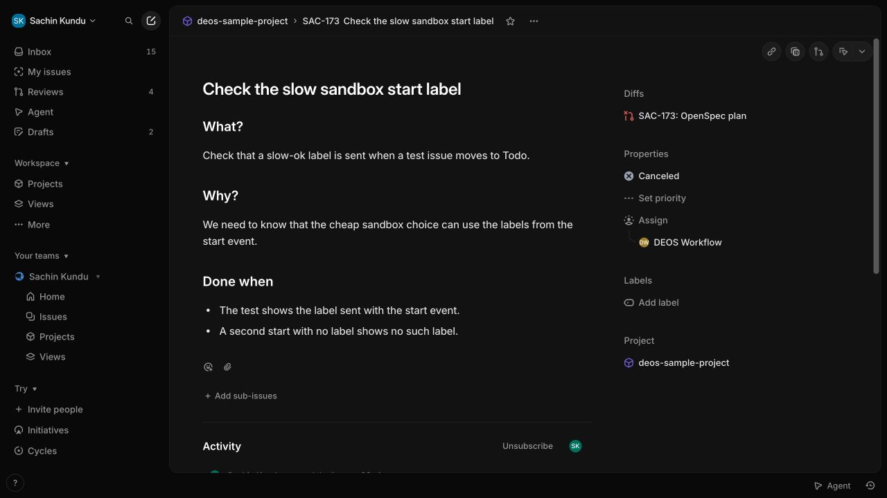
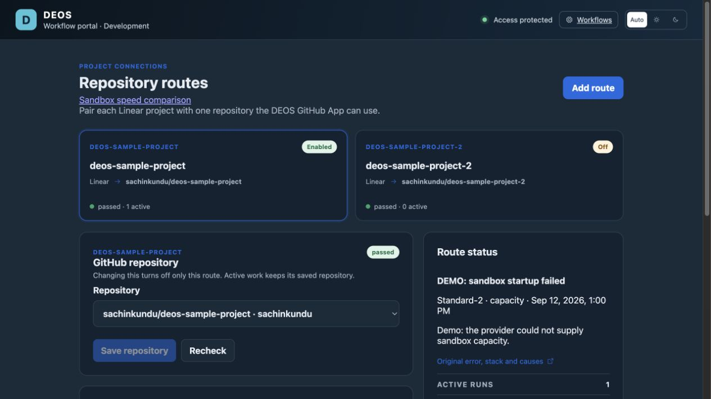

# SAC-171 implementation evidence

The approved plan is PR #107. The approved design is PR #110.

## Provider contracts

On 12 September 2026, test issue SAC-173 moved to Todo first with `slow-ok`, then
without that label. The existing authenticated Python ingress saved the label
facts in D1. `linear-provider.json` contains the two real deliveries. No synthetic
webhook was used for these checks. These checks prove the label contract, not the
new tier selection in production.

`probe/` contains the isolated Cloudflare Worker and configuration. It used the
existing deployed container image, with separate Basic and Standard-2 bindings.
Both classes ran Node successfully and were destroyed after the check.
`basic-provider.json` and `standard-2-provider.json` hold the results.
`cloudflare-provider.json` records the provider's CPU, memory, image, and class
configuration. The earlier cgroup-file probe failures are retained as separate
files. The image does not provide Python or those cgroup files; the final check
uses its installed Node runtime and the Cloudflare configuration read-back.

Primary contracts:

- [Linear webhooks](https://linear.app/developers/webhooks)
- [Sandbox lifecycle](https://developers.cloudflare.com/sandbox/1-0-preview/lifecycle/)
- [Container instance types](https://developers.cloudflare.com/containers/platform/limits/)

`proof.md` is the executable Showboat record of the provider reads.
The screenshots are local demo UI proof, not production activation proof.

## Local checks

- 385 TypeScript tests pass.
- 71 portal tests pass.
- 67 Python tests pass.
- Worker and portal TypeScript checks pass, as do the portal build, Worker dry
  run, OpenSpec validation, and lint checks for the changed Python files.
- Full strict Python type checking is not clean. It reports diagnostics in the
  existing ingress helpers and release-test files. It is not claimed as passing.

## Capacity

`capacity.json` covers 16 August through 12 September 2026. It records a peak of
four allocated attempts and four running attempts. Cloudflare's one-minute
instance peak is also four. The configured limit was four. No explicit capacity
refusal was found in attempt details or the 15 checked startup-failure Workflow
summaries. There is no dedicated capacity-wait field, so this does not prove
there were no waits. Account quota headroom remains a rollout check.

## Rollout status

Production migration 0035 and tier enforcement are applied. All 82 existing
runs were backfilled to Basic. Validation found zero invalid runs, mismatched
attempts, or unversioned deliveries. The backend is deployed with both classes
and retains the production recovery fixes from SAC-170 and the current image.
The compatibility ingress release is active; activation follows portal release.

The user deferred message delivery and the fixed-count reliability window.
Neither is a completion prerequisite.

Remaining rollout procedure:

1. Read current deployments, enabled routes, pending dispatches, active runs,
   and account limits. Preserve unrelated live releases.
2. Apply migration 0035. Its temporary D1 triggers cover writes from old Workers
   during the release boundary. They fill only missing legacy values with Basic.
   The migration also backfills existing rows without reading current labels.
3. Deploy ingress with `legacy-basic-v1`. Drain accepted start messages from the
   old ingress before deploying the new consumer. Do not change route revisions.
4. Deploy the consumer with both sandbox bindings. Deploy the DEOS workflow
   portal using its canonical build and release procedure. Verify each deployed
   version and image at 100 percent traffic.
5. Run `scripts/sandbox-tier-backfill.sql` if needed, then the read-only
   `scripts/sandbox-tier-validate.sql`. All three counts must be zero. Test the
   rollback release while keeping both tiers supported.
6. Apply `scripts/sandbox-tier-enforce.sql`. This removes the temporary null
   writers and requires valid run, attempt, and delivery tier facts.
7. Verify portal visibility for start integrity failures and sandbox startup
   failures, including capacity/quota/concurrency refusals. Show the tier and
   project and link to the existing durable original error records. Check tier
   mismatches and the creation failure rate during rollout. Message delivery
   is deferred.
8. Drain pending starts. Change the ingress release policy to `event-label-v1`,
   deploy it, and read back 100 percent traffic for that version on every enabled
   route. Repeat labeled and unlabeled provider-originated runs and capture D1
   tier agreement and the live portal.
A fixed-count reliability window is outside this job, per user direction.
Capacity and startup failures will be observed during normal work in the portal.
Existing Standard-2 runs keep their tier if a rollback is needed.

## Optional comparison manifest

The protected `/settings/sandbox-tier-trial` page accepts one immutable manifest
before its issues start. Each pair needs one Basic and one Standard-2 issue.
The top-level fields are `comparisonId` and `members`. Each member has `pair_id`,
`issue_id`, `workload_digest`, `controls_digest`, `planned_tier`, and `launch_order`.
Digests are lowercase SHA-256 values. A comparison name cannot be reused to append
pairs. Allocation binds each member once without changing tier selection.

The control digest hashes JSON with these keys in this order: `repository`,
`base`, `workflow`, `author`, `reviewer`. The author and reviewer values are
three-element arrays of provider, model, and reasoning setting. The report
checks actual frozen controls and repository commit against that digest. It
excludes incomplete pairs, tier mismatches, missing commit evidence, and changed
controls. Failed and retried attempts remain visible. No default is recommended.

## Provider issue visual

The real test issue is canceled after the labeled and unlabeled delivery checks. This screenshot shows provider state; it does not show activation of the new production tier policy.

The revised portal keeps sandbox startup refusals under each project, with the
saved tier and a link to the durable original error. Error-history tests preserve
the provider cause through cleanup. External paging is deferred by user request.

