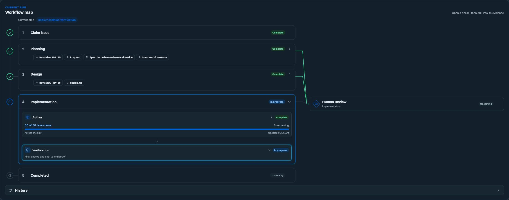
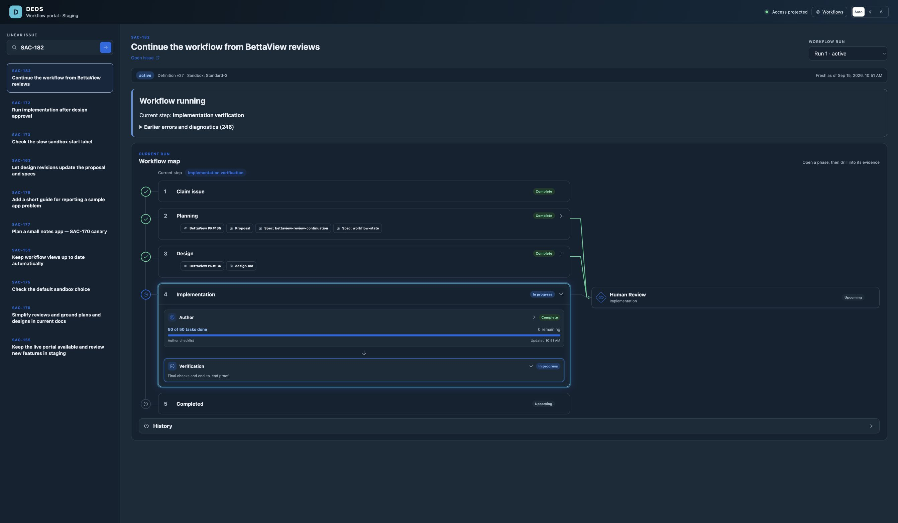
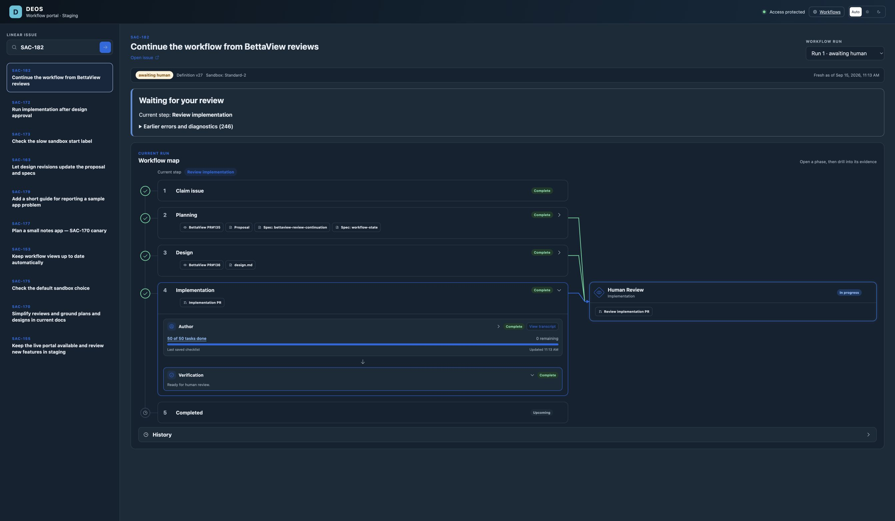

# SAC-172 implementation: SAC-182 canary

The implementation is on `codex/sac-172-implementation`, based on the merged design at `584d676e18baab6032446c75b805fa410f6ec456`. SAC-182 is the selected canary. No SAC-172 implementation PR has been opened. Migrations 0037–0043, the backend, webhook receiver, and staging workflow portal are deployed. The user's approval and Merging transition were consumed; the design merged, task generation passed, and the canary started automatic implementation. End-to-end implementation proof is still pending.

The [initial remote rollout and gate read-back](sac-182-rollout.md) records one version at 100% on each deployed Worker, the expected implementation container image, healthy capacity, frozen test profile, unchanged design PR head, and the new open review visit. At that time, the original Workflow instance was terminated and its replacement waited for `linear-event:design_review:visit:23`. The authenticated staging portal showed definition v27 at design review. Wrangler's final route-list request failed with Cloudflare code 10000 after portal activation; both the existing live route and its 100% deployment were verified separately. Later canary progress is recorded below.

## What is implemented

The separate `implementation` workflow continues from a verified design merge through native task creation and implementation. Each try has fresh execution and test resources. Checked code, commands, documentation, and proof bind to the same Git tree and base. Trusted services publish one run branch and one PR. Clarification consumes a new comment from the frozen human; final review consumes a state change from that human. A stale base invalidates the old merge choice and rebuilds the saved work. Code merge remains separate from live release.

Cloud jobs enable native live web search. The trusted document reader opens current first-party pages, follows only allowed redirects, and records canonical citations. Model/provider credentials remain outside the author account. Unsupported provider tests remain capability blockers until a checked safe adapter is available.

Terminal color codes and trailing padding have been removed from saved logs.

## Local verification

| Check | Result | Evidence |
| --- | --- | --- |
| Backend tests | 453 passed | [Full output](backend-tests.log) |
| Python tests | 71 passed | [Full output](python-tests.log) |
| Portal tests | 88 passed | [Full output](portal-tests.log) |
| Backend and portal TypeScript checks | Passed | `npm run typecheck`, `npm run portal:typecheck` |
| Python lint on changed files | Passed | `ruff check` |
| Python strict type baseline | 264 pre-existing errors, no new errors | [Comparison](python-types.json) |
| OpenSpec | Strict validation passed | `openspec validate sac-172 --strict` |
| Worker package and container | Dry run and Linux image build passed | [Worker](worker-dry-run.log), [container](container-build.log) |
| Portal production builds | Both entries passed | [Build output](portal-build.log) |
| Packaged runner | Local Worker with private D1/R2, D1 writes across requests, actual Showboat command, native live-search configuration, filesystem denials, and clean process exit passed | [Result](runner.json), [Showboat](showboat.md), [runner output](runner-probe.log), [preview output](preview.log) |
| Portal layout | Local fixture renders at 1280px and 390px; no page errors or horizontal overflow | [Desktop](portal-local-desktop.png), [mobile](portal-local-mobile.png) |

The Git publication test speaks the real receive-pack protocol to a local Git server and rejects a raced branch head. Provider doubles cover lost create/update responses, one-PR identity, and later publication sequences. SQLite tests run all additive migrations and verify exact human gate authority, cross-try resource denial, browser ambiguity, stale merge choices, and immutable artifact read-back. A conflicting cumulative patch retains its full bytes and original failure for the next author.

The packaged-runner probe uses a local proof receiver and a model catalog fixture for native configuration discovery. It makes no model request and uses no provider credentials. The model fixture adapts the laptop catalog to the pinned CLI's required metadata field; it is not proof of the provider's model catalog. The native CLI used its bundled bubblewrap fallback. Neither this probe nor the portal fixture is provider-originated end-to-end evidence.

## SAC-182: first automatic canary

The user selected SAC-182, Continue the workflow from BettaView reviews. Design PR #136 merged on September 14 at 12:48:14Z after the user's Merging transition. The approved design and initial tested base are `f2b994131d879967940e69ced07932dfffb8bc9a`. The user authorized deployment at the design review gate so approval could continue through automatic implementation. A guarded handoff preserved the frozen planning/design jobs and pending approval, added the implementation tail, and froze the checked human and isolated provider-test profile. It rejects a raced human event or changed design head.

The canary uses a per-try disposable PR and Linear task in the sample project. Trusted operations restrict tests to those exact resources, retain uncertain writes without repeating them, and require the matching signed Linear delivery before accepting provider proof. The author never receives the provider credentials. The adapter alone is not proof of SAC-182's changed behavior; the canary must still exercise that behavior through its preview and collect browser and command evidence.

Additional local checks on September 14 passed: 461 backend tests, 72 Python tests, TypeScript, changed Python lint, and a Linux container probe with a nested provider-adapter command. The probe has a local receiver and makes no provider/model request. Its purpose is to prove that a recorded test command can call the adapter without deadlocking. The handoff tests also cover preserving the pending approval, compare-and-set races, and lost replacement creation responses.

Live preparation exposed a native Workers `fetch` receiver error. Commit `bf4f154` fixes it; 15 focused tests and TypeScript passed, followed by successful live GitHub and Linear profile checks. Cloudflare twice applied a pause while losing its response; read-back and the same prepared handoff recovered without a duplicate transition. An old app-generated event from the initial claim also blocked the first compare-and-set. Commit `601f62f` scopes pending events to the current gate's original creation time; all seven handoff tests and TypeScript passed. The original errors remain in D1/R2 and visible diagnostics. No human approval was consumed or fabricated during these repairs.

The frozen run remains implementation v27, digest `ad7fec5d557145b5dc8332c1a514a3ff9f3597fd3feee23f9f8e77e526b22f1c`. Automatic continuation from a BettaView review is SAC-182's prospective change, so it is not claimed as deployed yet. The progress monitor is active. Full provider-originated canary proof and its implementation PR remain pending.

### Startup failures and recovery

The first implementation attempt exposed a sandbox name one character over the SDK's limit. Commit `c5ad6fd` preserves the full identity digest within the limit and maps the previously saved name for cleanup. Collection then exposed the missing `ContainerProxy` export. Commit `e625563` exports it, installs the approved model/package/broker hosts after the trusted outbound handler, and extends the existing audited retry to implementation tasks and builds. Migration 0040 preserves prior retry records. All 469 backend tests and TypeScript passed.

The failed Workflow was restarted from `agent:implementation_tasks:visit:26` only. Earlier successful steps retained their cached results. Attempt `01a09ff6-1fcd-75f5-8b40-158b5bd52a4b` then finished as interrupted with `missing_process_identity`; its sandbox was destroyed. A guarded retry reached visit 28 and exposed that static class fields shadow the Container SDK's registration setters. Commit `95fd71f` registers handlers through those setters separately for both implementation tiers. A test using the real SDK and local Workerd confirms both the active handler and default deny handler are registered. Those three focused network tests and TypeScript passed. This is runtime contract testing, not provider E2E evidence.

The second failed attempt `01a0a004-82c7-7b33-9855-f6cbc157c4f5` is preserved with cleanup destroyed. The next audited retry retains the same frozen design, human, and policy at visit 30. Its Workflow instance is `wf-v1-pnqzh2yjy2eaqo7dgld5db2vublhfuatzyqyhnlxfwtor2nh75rq`. Backend version `15a714ba-fa85-4852-b13f-6bb7315fa4ee` was read back at 100% traffic. Worker-only deployments used `--containers-rollout none`. Original startup errors and cleanup errors remain in D1/R2; the missing credential lease on these attempts reflects failure before credential acquisition.

At 13:12:10Z, D1 confirmed attempt `01a0a007-0f83-7e22-a761-04f5ec9ef9cd` is running, with a real process identity and a fresh sandbox heartbeat at 13:11:49Z. Its first implementation try is also running. [Showboat records the deployment, gates, and retry history](sac-182-implementation-start.md). The [authenticated live portal screenshot](sac-182-implementation-running.png) shows implementation tasks on v27. These observations establish startup and ongoing process health; task output, model grounding, build/test proof, and the canary PR are still pending.

### Task output and citation repair

The first real task agent completed its process with 57 unchecked tasks and successful OpenSpec checks. D1 records six actual first-party document reads through the deployed broker: Cloudflare service bindings, GitHub reviews and comments, and Linear GraphQL, OAuth actors, and webhooks. The native transcript contains 42 completed shell commands; native web search was available but was not used in this attempt.

Collection failed at 13:23:24Z because the author wrote `claimLocator`, while the implementation collector expected separate `claim` and `artifactLocator` fields. The original `TypeError` is retained in D1/R2, and the sandbox is destroyed. The task output is unaccepted. The [agent result](sac-182-task-output.json), [validation output](sac-182-task-validation.txt), and [original source sidecar](sac-182-task-sources.json) were downloaded from R2 and hash-verified against the completed artifact manifest.

Commit `40b043c` makes the sidecar contract explicit, rejects malformed source records with a useful validation error, and restores the latest failed patch from its verified artifacts into a fresh attempt. Recovery requires matching run, attempt, stage, approved design and base, complete artifacts, finished cleanup, valid paths and matching hashes. It does not accept the failed candidate or rewrite the old attempt. The new author must repair citations, reopen relied-on documents and rerun checks. All 474 backend tests and TypeScript passed.

Backend version `7875d0cc-f5fc-4a63-91b8-5f8cb9ccce20` is deployed at 100%. The guarded retry is established at visit 32 in Workflow `wf-v1-e5gu5tea6xkrn6x7c6ji3nw6zg6itg5llahafblrli7gvf6upmza`. D1 verified that new attempt `01a0a020-1873-7c07-a1d7-1c784cce073d` received the recovered patch `ba672fcd7068c4db12c6bf15879dcc92ed4272fba20ed4c34824571711d259b4` and the failed attempt's diagnostic. The canary's build, full behavior proof and implementation PR remain pending.

The [task-recovery Showboat read-back](sac-182-task-recovery.md) confirms the active deployment, container rollout, retry history and running process `5b2ff642-b0e7-4c19-a33f-cefc8bb21139`. The retry reopened all six documentation pages by 13:40:19Z. The prior attempt was terminal and destroyed in `agent_attempts`, but its `implementation_tries` summary incorrectly remained running.

Commit `a121bde` reconciles failed try summaries from authoritative agent attempts before and after agent execution. It preserves the immutable attempts, saved errors, live tries, other runs and explicit provider uncertainty states. All 475 backend tests and TypeScript pass. Worker version `61bebb9d-a8a8-48f4-a54e-da9859ca833d` was verified at 100% after a Worker-only deployment. The next live reconciliation at 13:44:33Z corrected the prior try to failed while the current retry remained running, as recorded in the second task-recovery Showboat snapshot.

### Accepted tasks and automatic build

The recovered task attempt completed at 13:45:57Z and its sandbox was destroyed. D1 accepted candidate `625c661fb734b426d972ad144b1df9d12500562b036417063b03b23b29a2fc1a`, tree `a6587b946b01a9ae0bc991d7e2f08ab2aef66673`, and the unchanged recovered patch. The [57-task plan](sac-182-accepted-tasks.md), [result](sac-182-accepted-task-result.json), [six validation checks](sac-182-accepted-task-validation.txt), and [six corrected source citations](sac-182-accepted-task-sources.json) were downloaded from R2 and hash-verified. Only `tasks.md` changed. The native transcript records 53 completed commands and no native web-search calls; real first-party document reads are proved separately.

The same Workflow advanced automatically to `implementation_build`, visit 33, at 13:46:02Z. Attempt `01a0a02a-ea7e-7034-94c4-31a3b1301fd7` uses fresh sandbox `impl-v1-cw637tfbteg2g3god7gl3662xpm6wya3dvcoqz5et4mbo4c7z4qa`, process `111e03dd-fdbd-4006-ba0c-ffdec4b9ef16`, and its own local data directory. At 13:56:26Z it was running with a current heartbeat. The [Showboat read-back](sac-182-implementation-build.md) and [authenticated portal screenshot](sac-182-build-running.png) record accepted checks, current implementation status and durable documentation citations.

The build allocated disposable [sample PR #22](https://github.com/sachinkundu/deos-sample-project/pull/22) and [Linear issue SAC-202](https://linear.app/sachinkundu/issue/SAC-202/canary-test-review-choices). GitHub read-back confirms the app-created PR on branch `deos/canary/01a0a02a-ea7e-7034-94c4-31a3b1301fd7`; Linear MCP confirms SAC-202 is in the frozen sample project at Human Review. These are setup facts. No changed-behavior provider proof, implementation completion, or SAC-182 implementation PR is claimed yet. The build's test resources remain active for its use and must be cleaned up after its attempt.

The agreed canary must use the real provider workflow through planning/design approval and automatic implementation to its PR. Its evidence must include the deployed version and container digest, fresh resource records, actual native web grounding, browser screenshots of the changed behavior, durable proof read-back, and the final GitHub PR subject. Concurrent tries must not share browser, preview, or test data. Exercise clarification, revision, and base movement deliberately where agreed; preserve human gates.

The existing portal staging configuration shares production D1/R2/backend. It must not stand in for isolated implementation test resources. Apply the additive migration before deploying code that queries it, verify activation, and select the new workflow only for the agreed route/run. Existing frozen definitions are unchanged. Do not publish the SAC-172 implementation PR until the agreed canary and remaining tests pass.

### Implementation belongs in the workflow map

The user rejected the standalone Implementation panel. Commit `c601c75` places Implementation after Design in the existing progressive map, with its original markers, colors, active animation, expandable steps, and transcript controls. Tasks, Build and test, Behavior proof, Pull request, and Merge contain their own evidence. Raw tasks are now a readable checklist. Detailed checks and saved diagnostics remain available through expansion. Recovered failures remain in History and diagnostics without adding a false Stopped node to the active run.

Implementation connects to the shared Human Review node. When the actual implementation review gate opens, that connector becomes active and the node offers the implementation PR. The review-ready state and revision/failure transitions are covered by local fixtures and phase tests; SAC-182 has not reached that real gate yet. The [local review fixture](implementation-node-review-local.png), [build fixture](implementation-node-build-local.png), and [390px mobile fixture](implementation-node-mobile-local.png) are UI checks, not provider-originated proof.

The [91 portal tests](portal-node-tests.log), [portal TypeScript check](portal-node-typecheck.log), [both canonical portal builds](portal-node-build.log), and [implementation definition test](portal-node-definition-tests.log) passed. Staging Worker version `d320ed26-bf46-406a-892d-8851db028c34` was activated at 14:17:15Z and read back at 100% traffic. Wrangler again reported code 10000 while listing routes after activation. The existing route served the new UI, verified in the authenticated browser. No backend, production portal, or BettaView deployment was made for this UI correction.

The [live collapsed map](implementation-node-staging.png) and [expanded implementation steps](implementation-node-staging-expanded.png) show SAC-182 building at visit 33. Browser inspection confirmed no standalone panel, an active Implementation node, an upcoming Human Review connector, no false Stopped node, and no horizontal overflow. The [Showboat read-back](implementation-node-rollout.md) records deployed versions and current durable canary state. Full changed-behavior proof and the canary implementation PR are still pending.

### Author only, then Human Review

The user simplified the presentation further: Implementation must contain only Author, like the other phases, then connect to Human Review when ready. Commit `f858d9e` removes the internal task, check, proof, publication, merge, and saved-evidence sections. Author keeps the phase status and the latest author transcript when available. The main current-step label also says Implementation author. Durable diagnostics and workflow execution are unchanged.

All [91 portal tests](portal-author-tests.log), [TypeScript](portal-author-typecheck.log), and [both portal builds](portal-author-build.log) pass. The [local review fixture](implementation-author-review-local.png) shows Author complete and the active Human Review connector with its PR link. This is UI fixture proof. The [authenticated staging screenshot](implementation-author-staging.png) shows the real SAC-182 Author still in progress, with only that step inside Implementation. The [remote Showboat read-back](implementation-author-rollout.md) confirms staging version `c62f3fbb-1042-4601-bdb0-1e2cf57f1a6e` at 100%, activated at 14:39:34Z. The historical post-activation route-list permission error recurred; the existing live route was verified separately. This Author-only layout supersedes the earlier nested implementation steps. The canary and no-SAC-172-PR gate remain open.

### Preview transport repair

The real build's first preview failed at 15:05:27Z. Cloudflared timed out after 90 seconds with `TUNNEL_START_ERROR`. The next browser call correctly reported that no safe preview was available. The [original preview error](sac-182-preview-original-error.json) and [browser error](sac-182-browser-preview-error.json) were downloaded from R2 and hash-verified. The preview resource remains quarantined. The author was still running with a heartbeat at 15:21:58Z; the preview failure is not a claim that the whole attempt has ended.

Cloudflare's [restricted outbound network contract](https://developers.cloudflare.com/containers/guides/outbound-traffic/) permits ports 80, 443, and DNS when internet access is disabled. [Cloudflare Tunnel needs port 7844](https://developers.cloudflare.com/cloudflare-one/networks/connectors/cloudflare-tunnel/configure-tunnels/tunnel-with-firewall/) for QUIC or HTTP/2. Adding tunnel hosts to the author's HTTP allowlist cannot open that port. This explains the failed direct tunnel from the restricted author sandbox.

Commit `2eff0ea` runs the quick tunnel in a separate trusted relay using the existing Sandbox binding and image. Only the fixed HTTP proxy runs there. Repository code and model work stay in the restricted author sandbox. The relay forwards only to port 8787 of the same active attempt through a named outbound handler. Each relay has its own deterministic identity, saved before allocation. The browser receives the real public tunnel URL. Cleanup destroys the tunnel and relay and reads back their state. Allocation uncertainty keeps the resource quarantined and requires a fresh try. Author web search and first-party documentation access remain available.

All [476 backend tests](preview-relay-tests.log), [TypeScript](preview-relay-typecheck.log), and the relay program's Node syntax check pass. The new tests exercise the actual D1 scope checks, SDK handler registration, HTTP forwarding, inactive-resource denial, and original-error retention. This relay currently supports HTTP; WebSocket upgrades receive an explicit 501 response.

Backend version `59240d29-3879-4b90-95cf-99ba0505af5e` was activated at 15:24:04Z and read back at 100% traffic. Deployment used `--containers-rollout none`. The [Showboat snapshot](sac-182-preview-repair.md) records the deployed version, container state, and active canary. No portal deployment was made for this repair. The existing quarantined preview must not be cleared or reused. Preserve the current author's output, wait for terminal state and resource cleanup, then use a fresh guarded build attempt to prove the new transport. Real preview/browser proof, the full canary, and SAC-182's implementation PR are still pending.

### Task progress signals and Author meter

The user requested a compact count of tasks done and remaining, then clarified that task completion should signal the workflow. Commit `742712f` adds a meter inside Author. It keeps the existing visual map and Human Review connector. It shows the observed checklist count and time, marks delayed updates, and says that final checks are still in progress when all checkboxes are ticked but the run is active. It does not expose internal task lists or treat counts as proof of readiness.

The trusted Worker installs a small file watcher alongside the author without changing the container image. Checklist edits, including atomic saves, send an authenticated `attempt-progress` hint. The current Workflow wakes, reads the checklist with the author's filesystem permissions, and saves only its counts, digest, and observation time. The portal receives the update through its existing refresh path. Signals cannot supply counts, complete work, or select a human gate. The five-minute heartbeat reconciles missed signals and repairs a stopped watcher. Original errors are retained without failing otherwise healthy author work.

All [482 backend tests](progress-backend-tests.log), [91 portal tests](progress-portal-tests.log), both TypeScript checks, and [both portal builds](progress-portal-build.log) pass. The new local integration test uses real filesystem notifications and a real HTTP receiver. It proves ordinary edits and atomic replacements send signals within seconds; it is local integration evidence. Migration 0041 passed against the real D1 database. Backend version `f15c90ec-e13d-48f4-9b80-f12b0377d56b` at 16:10:42Z and staging portal version `1944cb2e-0101-43e8-af3b-34f600ce8ca3` at 16:11:47Z were read back at 100%. The portal's historical post-activation route-list permission error recurred; the live route was verified in the browser.

The deployed SAC-182 sandbox sent a real initial progress signal at 16:13:16.330Z, recorded in [Workers Observability](progress-signal-events.json). D1 saved its observation at 16:13:18.159Z: **57 checked tasks out of 57**. This initial signal proves the deployed sandbox-to-workflow path; the local test proves signaling on actual file edits. The [live staging screenshot](implementation-progress-staging.png) shows the real count with “Final checks still in progress,” and the [local layout](implementation-progress-local.png) shows a partial checklist. The [Showboat read-back](sac-182-task-progress.md) records deployed versions and durable counts. No final build candidate, browser/provider acceptance, or implementation PR is implied by the checked boxes. The SAC-172 PR remains pending the full canary.

### Stopped build and failure capture repair

The first build stopped at 16:23:40Z with `supervisor_failed`. Its [failure summary](sac-182-build-failure-summary.json) and [artifact identities](sac-182-build-failure-artifacts.json) show that only the command diagnostic journal and original-error journal were saved. All three saved files were downloaded from R2 and hash-verified. The diagnostic journal includes successful final test commands, but the failure bundle has no patch, candidate, result, final transcript, or supervisor status. The test-generated errors at the end of the original-error journal are expected negative-test cases, not the cause of the supervisor exit. The exact exit cause cannot be established from this bundle. The lost implementation patch cannot be recovered from these artifacts.

Normal cleanup destroyed the old sandbox and preview, closed sample PR #22, and canceled SAC-202. The provider states were read back through GitHub and Linear MCP. No old preview quarantine was cleared or reused.

Commit `9adf803` captures the current working tree and binary patch before implementation failure cleanup. It also saves raw process status/output and unfinished private transcript and validation captures. A separate recovery-only artifact binds the saved work to the run, attempt, approved design, and tested base. It cannot claim completion, checks, or proof. A fresh author can recover these bytes only after durable hash verification and completed cleanup. Capture failure leaves the credential-free sandbox intact. The next prompt also gives npm's required sandbox CA path and says to preserve required tests when a runtime is missing.

All [486 backend tests](failure-capture-tests.log), [backend TypeScript](failure-capture-typecheck.log), and [portal TypeScript](failure-capture-portal-typecheck.log) pass. A real local Git test covers binary patch capture with no final result/candidate, unfinished transcripts, and symlink denial. Controller and D1 tests cover cleanup blocking, immutable failed attempts, and recovery without candidate acceptance. This is local regression proof; it does not explain the historical process exit or prove deployed failure capture yet.

Backend version `5f9de6cf-5882-4cb0-9a05-bba7d493922c` activated at 16:52:43Z and was read back at 100% with unchanged container image and healthy instances. The guarded same-definition retry was established at 16:54:00Z, from visit 34 to 35. Its Workflow is `wf-v1-6fv7343ma6ueq2rxqhzg3scgx5uznhmanxh33qxfottpfyi3kzma`. Fresh build attempt `01a0a0d7-0ea0-715b-bf5e-a57a8c14965c` is running in sandbox `impl-v1-kgyk6c52qtknrd5yorbndx6ngawafva6tqhpej2pyk6hbqiz3dtq`, process `5394d6f1-79de-42fd-8df5-aa948c71aed5`. It starts from the accepted 57-task plan, not the lost build patch. The [Showboat read-back](sac-182-build-retry.md) and [authenticated staging screenshot](sac-182-build-retry-staging.png) show the new attempt at **0 of 57 tasks done**. The old attempt's 57 checked tasks remain historical. Preview/browser proof, the full canary, and both implementation PR milestones remain pending.

### Heartbeat write race and preserved build

The second build's supervisor exited at 18:09:01Z. D1 recorded failure at 18:14:19Z and visit 36. The [saved process status and stderr](sac-182-heartbeat-failure-process.json) identify the cause: `rename '/deos/output/heartbeat.json.tmp' -> '/deos/output/heartbeat.json'` failed with `ENOENT`. Timer and child lifecycle writes shared the same temporary path. The uncaught timer rejection stopped Node with exit code 1; it was not a deadline timeout. This evidence establishes this attempt's cause. The earlier build's cause remains unknown.

The deployed recovery capture saved a [recovery-only build](sac-182-recovered-build-identity.json), tree `3a5f578f42cd86097e748ec626d7580cceb16b93`, and patch `c839fa2b2a1ae0e31e0659e489af9e98f2c6c3c551ba3ef233b97dbdc89e70b8`. All six [failure artifacts](sac-182-heartbeat-failure-artifacts.json) were downloaded and hash-verified. The 151,681-byte patch includes unfinished implementation work and request files across 58 paths. It is not an accepted candidate. The [failure summary](sac-182-heartbeat-failure-summary.json) records the absent final outputs. The last full test command reported 432 of 433 tests passing, with unsupported TypeScript syntax in the new review-continuation test. The author still has work to finish and verify. The checklist remained 0/57.

Normal cleanup destroyed the attempt's sandbox and local data, closed [sample PR #23](https://github.com/sachinkundu/deos-sample-project/pull/23), and canceled [SAC-204](https://linear.app/sachinkundu/issue/SAC-204/canary-test-review-choices). GitHub and Linear MCP confirmed those final provider states. No disposable resource is reused.

Commit `107fe41` gives each atomic write its own exclusive temporary file. A periodic heartbeat failure retains its original error and permits the next observation; the existing stale-heartbeat rule still applies. The private stream helper is shared with the regression test, and failure capture now uses the supervisor's actual `transcript.jsonl` and `stderr.txt` names. The prior test had constructed different names, so it failed to detect that recovery gap. This attempt's private transcript and validation stream were not recovered before cleanup.

All [488 backend tests](heartbeat-race-tests.log), [backend TypeScript](heartbeat-race-typecheck.log), and [portal TypeScript](heartbeat-race-portal-typecheck.log) passed. The Linux image built successfully. The [packaged-image probe](supervisor-io-probe.mjs) passed [500 overlapping writes and actual private stream finalization](heartbeat-race-image-proof.log). These are local regression checks. D1 showed no starting, running, or collecting attempts before the container rollout. Applying the recovered patch to a private index reproduced the [exact saved Git tree](sac-182-recovery-tree-verified.json).

Backend `309c8732-29d1-4e98-81b7-1337194bc635` activated at 18:28:15Z and was read back at 100%. Both implementation container tiers completed their rollout to version 4, image `sha256:d2237e07339cb8358aba7da5399700ce37e709fb529dacc3695291d04afd2431`, with four healthy instances each and no errors before retry. Neither the portal nor ingress was redeployed. The same-definition retry was established at 18:36:35Z, from visit 36 to 37, in Workflow `wf-v1-d5c2ifdot3p7rkggpzbd3h3tyxobiyyg7xnuijhfepnvvoyzdnva`.

New build attempt `01a0a134-fefc-75d9-b32e-d941983aa546` started at 18:36:40Z. It is running in sandbox `impl-v1-5s2nwtx2xyo42e4oo7g7s4f5awd42i33pdbjvuuca4sfogyln73a`, process `dda0fa9c-cb87-487b-87d0-5ee4c31118d7`. The [Showboat read-back](sac-182-heartbeat-recovery.md) confirms the recovered build patch as this try's input, the original recovery attempt identity, and the unchanged frozen design and human. The [authenticated staging screenshot](sac-182-heartbeat-retry-staging.png) shows the resumed Author with 0/57 checked tasks and Human Review upcoming. Saved work is available, but completion, full provider/browser proof, and both implementation PR milestones remain pending.

### Saved implementation and a real clarification handoff

That attempt ended normally at 19:11:08Z with `needs_human`. Its sandbox and disposable test resources were destroyed through normal cleanup. The run is now `awaiting_human` at `implementation_clarification_wait`, visit 39. The [D1 gate read-back](sac-182-clarification-gate.json) records an open question and no human answer. The [Showboat snapshot](sac-182-clarification-readback.md) records the deployed versions and current durable state. Linear comment `d2fa0add-8448-4a7b-af69-059caf24bd49` asks whether tasks 9.1–9.7 should move to a trusted post-merge rollout because the author cannot deploy to production. No retry or human transition was issued.

The work is saved as tree `e0ac2d18e079a390c1de14baaacedc201aec2335` and a 195,566-byte patch, `3a627102c907d12ea29fcf792828d5382017858f7ebbc0d448d6f64cfdcd44ba`. The [artifact manifest and identities](sac-182-clarification-artifacts.json) were read from D1. Eleven downloaded files, including the full candidate, patch, transcript, and diagnostic journal, matched their recorded hashes. The [candidate summary](sac-182-clarification-candidate-summary.json) preserves the saved subject, changed paths, checks, proof, and human question without copying the full code bundle into this evidence folder.

The [agent result](sac-182-clarification-result.json) and [validation narrative](sac-182-clarification-validation.txt) claim that tests, type checks, builds, OpenSpec validation, and browser evidence passed. These are author reports. The actual final candidate has `checks: []` and only one provider proof. The trusted journal contains passing commands on earlier trees as well as failures; it does not establish the claimed complete final-tree verification. The [browser error](sac-182-clarification-browser-error.json) says `preview_missing`: the author did not start its assigned safe preview before requesting the browser. No assigned-preview browser proof was retained.

The [provider artifact](sac-182-clarification-provider-proof.json) records a real APPROVE review `5201738127` on disposable [sample PR #24](https://github.com/sachinkundu/deos-sample-project/pull/24), followed by signed Linear Merging delivery `2e01d08e-e1b1-455f-b33b-14cf6f64eeb1` for [SAC-205](https://linear.app/sachinkundu/issue/SAC-205/canary-test-review-choices). The final proof binds to the saved tree. An earlier proof was rejected because the tree changed; its [original error](sac-182-clarification-provider-error.json) remains intact. These scoped adapter operations establish provider receipts and ingress, but do not prove the changed BettaView continuation path end to end. GitHub and Linear MCP confirmed PR #24 closed and SAC-205 canceled after cleanup.

The [live staging screenshot](sac-182-clarification-staging.png) shows the Author-only node connected to the shared Human Review question. It also exposes a remaining presentation issue: Implementation and Author say Complete while clarification is pending. This indicates the attempt ended, not that implementation is ready. The checklist remains 0/57 because the author left every task unchecked while blocked on rollout scope. Saved code exists; the counter describes checked tasks only.

The recommended scope reply is to move production deployment and activation after merge, while keeping isolated end-to-end tests and final verification before the implementation PR. Do not defer all of 9.1–9.7 without preserving those requirements. The frozen clarification gate requires a new comment from the linked human account on SAC-182. The monitor stays quiet while that gate is unchanged.

On resumption, completed tasks should be marked individually. Keep transient request files under `/deos/output/requests`, outside the checkout: this candidate includes `.deos-requests` files that changed its tree between checks. Preserve the required test suites, start the assigned safe preview, exercise the changed application behavior, and retain all final-tree checks and proof before publication. No SAC-182 implementation PR exists, and the SAC-172 implementation PR remains gated on the full canary.

### Clarification reply delivery configuration

On September 15, the user posted comment 4457b29a-a39f-4855-a4c7-86fc026074e6 at 03:44:13.040Z from the frozen human account. Linear MCP confirmed the reply. D1 had no matching inbox delivery or gate event, and visit 39 stayed open. The reply agrees to split production rollout while retaining proof in a non-production environment.

The existing Linear webhook was enabled but subscribed only to Issue events. Comments were added to that same webhook, preserving its URL, signing secret and team scope. The [saved settings screenshot](linear-comment-webhook-enabled.png) shows Issue and Comment after a full page reload. The [read-back summary](linear-comment-webhook-repair.json) records the configuration and D1 evidence. No Worker deployment or code change was needed.

The earlier reply has no provider delivery to replay. The user was asked to repeat it as a new comment, so Linear can emit a signed Comment.create. We did not create a reply, synthesize a delivery or move the human gate. Real comment delivery, gate acceptance, resumed implementation and full changed-behavior E2E remain pending.

### Human reply received and implementation resumed

The new human comment 2f478444-cb81-414b-9343-4964cd727f83 was created on September 15 at 03:55:56.138Z. Its real signed Linear delivery 5a6963d6-d298-4986-95fc-8b175ad3d66e reached ingress at 03:55:57.118Z and was classified relevant. The workflow read back the comment from the frozen human account, recorded eligibility and reply_received, and processed the inbox delivery at 03:56:14.892Z.

The same Workflow continued automatically to implementation_build, visit 40. Attempt 01a0a335-573b-7020-8d70-5e4eb7ec1ba7, try 6, is running in its new sandbox. Its durable job context contains the exact accepted reply, and its input patch matches the saved clarification patch 3a627102c907d12ea29fcf792828d5382017858f7ebbc0d448d6f64cfdcd44ba. The initial 0/57 observation is the restored unchecked checklist. No manual retry, fabricated signal or issue transition was used.

The [D1 read-back](sac-182-reply-resumed.json) records the provider delivery, eligibility, gate transition, running attempt and materialized reply. The user agreed to separate production rollout while requiring proof in a non-production environment. Final-tree checks, safe preview, changed-behavior E2E and the implementation PR remain pending.

### Clickable Author task checklist

The Author task counter now opens a read-only OpenSpec checklist with task headings, numbers, checkboxes and All/Remaining/Done filters. The staging browser loaded the real SAC-182 checklist: 0 of 57 completed, across 9 sections. Keyboard navigation, return focus and mobile wrapping were checked with a separate local mixed-task fixture.

[Showboat and browser evidence](task-checklist-popup.md) records the tests, active Worker versions, unchanged container images and healthy running canary. The [R2 read-back](task-checklist-r2-readback.json) matches the first post-deploy D1 progress observation. No implementation PR has been opened.

### Author checklist moved to 50 of 50

At 04:31:45.883Z on September 15, the active author sent a real task-edit progress signal. D1 recorded the new observation 1.767 seconds later: 50 of 50 tasks checked. The [signal read-back](sac-182-task-edit-signal.json), [hash-verified R2 snapshot](sac-182-task-progress-0433.json) and [live staging screenshot](sac-182-task-progress-50.png) prove the deployed file-change-to-workflow-to-checklist path. No operator event or retry was issued. This replaces the earlier limit that only initial deployed notification and local file edits were proved.

The [new checklist](sac-182-progress-50-tasks.md) retains tasks 1.1 through 8.4 unchanged apart from checked boxes. It removes all seven section 9 tasks and replaces them with prose deferring deployment, feature enablement, live D1 read-back and production rollback to a separately approved post-merge change. The prose says this implementation still performs local preview and isolated safe-resource proof. Removing the original proof checklist does not waive the user requirement for changed-behavior provider E2E and final-tree verification before PR.

The [durable read-back](sac-182-progress-50-readback.json) shows the same visit 40 attempt still running, with a current heartbeat. Only local_data was allocated and no implementation_proof rows existed for this try at the check. No new candidate or PR was recorded. Checked boxes alone do not establish accepted completion or passing final-tree tests.

### Verification follows the completed Author checklist

The user requested a distinct follow-up node after the 50/50 counter still left the canary active. The existing Implementation phase now shows Author, then Verification, then its shared Human Review connection. Both current-step labels name Verification while the current author checklist is full. Verification covers final checks, changed-behavior proof, and PR preparation. It completes at the durable review handoff; checkbox counts do not accept proof or open a gate. Reopened tasks and new builds return to Author. Failures and clarification waits pause the unfinished step.

The 100 portal tests passed; after the final status-label and clarification refinements, all 27 relevant state/map tests, portal TypeScript checks, both canonical portal builds, and strict OpenSpec validation passed. A local map fixture was inspected at 1200px and 390px, with no horizontal overflow and keyboard operation. The authenticated staging browser then showed the real SAC-182 Author at 50/50 complete, Verification in progress, and Human Review upcoming. Its bundle was `index-B4RkTsNa.js`.

Staging portal version `0cd564c5-f900-4825-8c14-58ed565c01b6` was active at 100 percent traffic on 15 September 2026 at 05:35:16 UTC. Wrangler again reported route-list authentication code 10000 after activation; API read-back and the live browser proved activation. The backend, ingress, container images, frozen workflow, visit 40 and running attempt were unchanged. SAC-182 still had no implementation PR. This UI proof does not complete the implementation canary or its required provider/behavior proof.

Evidence: [checks and screenshots](verification-node.md), [deployment and D1 read-back](verification-node-readback.json), and [live staging map](verification-node-staging.png).

### Runner repair deployed and saved work resumed

On September 15, backend `691b1d8b-870e-4dd2-aca4-a44a33999f3d` was read back at 100 percent. Both implementation tiers completed rollout to container version 5, image `sha256:827095ccfc25f189e57003c9121e9269bac6e954a756c6a7f848047cb6c72709`, with four healthy instances each and no errors. Ingress and both portal surfaces were unchanged. See [deployment read-back](runtime-repair-deployment.json).

The trusted same-definition retry was established at 06:06:12.043Z, moving the failed visit 41 to implementation build visit 42. New attempt `01a0a3ac-5d69-7e50-a1dd-9b883fe21acc` is running in a fresh sandbox and Workflow `wf-v1-cghsgyliqgxamwbycplagwgsfcvci7hakrwpgmwho5vmglrguo2q`. Its input patch is exactly `81a3f091107316c8f7d8289aca9d28074e67f81671e1503977007d3527e215c7`, recovered from failed try 6. The frozen v27 definition and human binding are unchanged. See [retry receipt](runtime-repair-retry.json) and [running attempt with recovered input](runtime-repair-resumed.json).

The staging browser updated automatically to Workflow running, Author 50/50 complete, Verification in progress and Human Review upcoming. Earlier errors remain collapsed in history. These are the restored task boxes; final-tree checks, fresh preview/browser proof and changed-application provider E2E still have to pass. No implementation PR was created by this repair. The timeout diagnosis and local regression proof are in [runner repair evidence](runtime-repair.md).

The first real five-minute checkpoint ended at 06:11:51.501Z with the expected `WorkflowTimeoutError`. The new Workflow then completed its authority check and agent reconciliation at 06:11:54.304Z, entered the next wait, and remained running. D1 showed the same live process, a fresh heartbeat at 06:11:47.042Z and no new heartbeat-timeout error records. One earlier startup file-not-found diagnostic remains preserved. See [live checkpoint and D1 evidence](runtime-live-checkpoint.json).

### Verification repair loop activated

The same implementation session now receives repairable completion-check failures, fixes them and reruns verification before the attempt closes. The broker and final collection share one validator. The accepted candidate and patch remain paired, earlier diagnostic history remains intact, and the original deadline and human gates remain enforced. No workflow definition changed. See [executable repair evidence](verification-repair.md) and [container process proof](verification-repair-container.json).

Backend `d38a6614-07a2-46cb-8872-0af5190fa078` is at 100 percent. Both implementation tiers completed version 7 with image `sha256:75b30bd96b76b119663c773ab1076869543f72ff81dd71ffc29cf493df236594`, four healthy instances each and no rollout errors. The final code passed 497 repository tests, type checking, generated bindings, strict OpenSpec validation, and a linux/amd64 container proof with two exact-session resumes and continuing heartbeats during verification. [Deployment read-back](verification-repair-deployment.json) and [source digests](verification-repair-sources.json) record the final activation. No portal, BettaView or ingress deployment was performed.

SAC-182 try 7 had already been interrupted for an expired heartbeat before this repair was activated. The last transcript showed a BettaView Vite build; the heartbeat-loss cause is not established. Python tests also exposed the sandbox Python 3.10 versus repository >=3.11 mismatch. The exact latest saved patch was recovered and verified. [Canary state and recovery](verification-repair-canary.json) supersede the prior running status above. No new try or human transition was started by this repair. Full changed-application proof and the implementation PR remain pending.

### Runtime recovery for the seventh implementation try

Try 7 stopped with `heartbeat_expired` during `npm run bettaview:build`. Its last persisted heartbeat was 06:31:48Z on September 15. Cloudflare metrics show sustained CPU saturation on the basic sandbox and workload memory near 1.1 GiB. Retained evidence does not establish an OOM, a Vite crash, or the exact reason heartbeat writes stopped. The full recovered patch still reproduces tree `564e38581a6084802684bb86c9074ea3e7c61359`.

The image supplied Python 3.10 while the repository requires at least 3.11. The new image pins Python 3.11.16, installed with the digest-pinned official uv image. The recovered SAC-182 source now runs its Python suite as `deos-author`: 73 tests pass and one timestamp assertion fails. This is a real candidate failure for the author to repair; no canary completion is claimed.

The trusted retry endpoint now accepts `sandboxTier: "standard-2"` for implementation retries. A separate immutable audit row records the change in the retry transaction. The original delivery, run tier, old attempts, approved definition, and human binding stay frozen. New attempts inherit the recorded tier; a pending or active attempt cannot be resized. The additive table preserves the deployed portal's existing retry queries.

The runner passes 501 JavaScript tests, 72 Python tests, type checks, generated bindings, and strict OpenSpec validation. The new built image passes the same-session repair process proof, including a heartbeat during verification and exactly one completion signal. Its model and broker are deterministic fixtures. These checks are not provider end-to-end proof.

Evidence: [live Showboat read-back](runtime-recovery.md), [runtime findings](runtime-recovery.json), [Cloudflare metrics](runtime-recovery-metrics.json), and [built supervisor proof](runtime-recovery-supervisor.json).

The durable error at 06:40:18Z is an `AbortError` in reconciliation. The heartbeat read path used to fall back to an old D1 timestamp after any read error, then apply the expiry test to that stale observation. It now retries observation after transport aborts/timeouts without advancing the heartbeat timestamp. Regressions prove that an aborted read does not kill an otherwise running process, a later successful observation updates the timestamp, and repeated transport failure cannot extend the absolute deadline. This repairs a concrete false-expiry path; the old attempt did not retain its heartbeat file, so its contents at termination remain unknown.

The first replacement start was rejected by the production-only `sandbox_tier_require_attempt` trigger, which the initial fixture had not enabled. Migration 0043 updates that guard to require the original tier or the immutable audited recovery tier. The implementation retry fixture now runs `scripts/sandbox-tier-enforce.sql` before testing the upgrade and verifies that changes to the original run and old attempts remain rejected. All 501 JavaScript and 72 Python tests pass with the guard update.

At 07:45:42Z, the existing Workflow retry created try 8, attempt `01a0a407-62dc-7bc0-95e6-965a0a818188`, on Standard-2. D1 then recorded a running process and advancing heartbeat. Its input is the latest try-7 patch `cdfaa685ebdf676271f2a26f6f8f0288953c054b6837176811325f735973b87f`. The frozen v27 definition, original run tier and human binding remain intact. The author fetched real Cloudflare, GitHub and Linear documentation and allocated its isolated provider test resource. [Attempt read-back](runtime-recovery-attempt8.json) and [Showboat output](runtime-recovery.md) prove this recovery; they do not yet prove final verification or PR completion.

The staging portal now uses fresh projected status in the run dropdown and shows the latest attempt's sandbox tier while retaining the original run tier in its API. The change passed all 100 portal tests, portal type checking and both canonical builds. Version `10c033eb-fcf6-4825-93b4-f8bff4e6292f` was read back at 100 percent at 07:53:26Z. Wrangler reported route-list authentication code 10000 after activation; the existing route and live browser served the new build. [Deployment evidence](runtime-recovery-portal.json) records both outcomes. No backend or container was redeployed while try 8 ran.

### Automatic implementation PR reached; acceptance evidence needs revision

Try 8 completed at 08:13:08Z and the workflow created [implementation PR 137](https://github.com/sachinkundu/deos/pull/137) without operator publication. Its head is `cefbb9d9e9afc0bf66a3b678aed83e1b98f44d63`, checked tree `7923143c6f795f30d396e715895f3aae87ed96e9`, and output patch `8a6ff3e0c147a0558a72723d084ac063251d0934935af4632921a9097ab77896`. The workflow reached `implementation_review`, visit 48, and retained the frozen human binding. The sandbox was destroyed. GitHub CI passed Python 3.11, Python 3.14 and TypeScript. The live staging map shows Author and Verification complete, leading to Human Review.

This proves the automatic PR handoff, but does not complete task 5.4. Inspecting the hash-verified proof found two gaps:

- The image caption claims checked-account Settings, but the [actual image](sac-182-pr137-invalid-preview.png) is an HTTP authentication failure: `unauthorized / missing_access_token`.
- The [provider demo output](sac-182-pr137-provider-demo.md) has real GitHub and Linear receipts. Its checked source imports BettaView's `publishContinuation`, then replaces the DEOS service with a local RPC stub. `markGitHubReady` invokes the safe Linear adapter directly. It does not exercise the implemented continuation service's durable intent, lease, nonce, signed-delivery correlation and workflow traversal. It only publishes COMMENT in the provider demo.

[Review evidence](sac-182-pr137-evidence-review.json) retains exact subjects, CI results and original browser connection failures. No human review decision was submitted, and no SAC-172 implementation PR was opened. The next revision needs a working isolated Settings/review preview and proof through the real changed continuation service, including the agreed review choices and recovery behavior.

The browser was configured with a one-minute idle timeout. Cloudflare documents [a ten-minute configurable inactivity window and commands to keep sessions alive](https://developers.cloudflare.com/browser-run/puppeteer/). A new fix uses that window and refreshes the same owned session during normal five-minute reconciliation. It skips connected sessions, never allocates a replacement during maintenance, stops maintaining inactive attempts, and preserves original failures. Browser navigation now records the actual document HTTP status. Failed or unobserved documents cannot be captured as working-screen proof; state and errors remain available for diagnosis.

The fix passed 504 JavaScript tests, type checking, generated bindings and strict OpenSpec. It deployed only after D1 showed no active agents. Backend `fd80b204-d504-47e2-85e6-cfec5f67688d` is active at 100 percent. Container version 8 and its image stayed unchanged, with four healthy instances in each implementation pool. The existing Human Review gate stayed open. This fix has local regression and deployment proof; its next live browser exercise remains pending. See [Showboat](browser-proof-repair.md) and [activation read-back](browser-proof-repair-deployment.json).

### Human revision received; ordinary PR comments were missing from input

The user's real In Progress transition started try 9 at 08:37:02 UTC on September 15, at implementation build visit 49. Attempt `01a0a436-6328-7de2-bdfe-67b82f4cfcb2` uses Standard-2 and restores the exact last accepted patch `8a6ff3e0c147a0558a72723d084ac063251d0934935af4632921a9097ab77896`. Its saved review input contains empty reviews and comments arrays. At 08:42:20 UTC its heartbeat was still advancing. The restored 50/50 checklist does not prove revision completion.

The two acceptance findings appeared in [PR discussion comment 5677258210](https://github.com/sachinkundu/deos/pull/137#issuecomment-5677258210) at 08:37:43 UTC, after the attempt started. The loader also had a separate defect: it read reviews and inline review comments, but omitted ordinary PR discussion comments. GitHub serves these through the [issue comments API](https://docs.github.com/en/rest/issues/comments#list-issue-comments). The patched loader adds the complete paginated discussion stream without dropping existing review data or hiding read failures.

All 506 repository tests and type checking pass. A read-only call through the patched local loader returned the actual acceptance comment from GitHub. This used the local GitHub CLI account token, not the deployed application's credentials. It proves provider read-back, not deployed agent pickup. The active try retains its saved empty feedback; there is no live refresh path. No duplicate comment or human state change was sent by this repair.

The feedback repair is pending activation until there are no healthy active agents. Backend `fd80b204-d504-47e2-85e6-cfec5f67688d` remains active, so try 9 does use the earlier browser fixes. Full changed-application proof and tasks 5.4/5.5 remain open. See [revision read-back](sac-182-revision-feedback.json) and [Showboat proof](pr-discussion-feedback.md).

### Verification transport failure in try 9

Try 9 stopped at 09:01:47 UTC on September 15 while the supervisor awaited the trusted verification response. The [original process error](verification-transport-failure.json) retains `TypeError: fetch failed` with cause `UND_ERR_HEADERS_TIMEOUT`. The last heartbeat in the sandbox was 09:01:20 UTC. This was a response timeout after the author finished, not heartbeat expiry. No matching verification request was found in the retained Worker logs for 08:55–09:03 UTC; those logs do not establish where transport stalled.

The failure manifest retains the exact same patch `8a6ff3e0c147a0558a72723d084ac063251d0934935af4632921a9097ab77896`. PR 137 remains at its prior head. Resource cleanup initially could not confirm browser closure, which prevented sandbox destruction; scheduled cleanup subsequently marked the failed sandbox destroyed. The browser resource still needs its absence receipt reconciled.

The [new image](sac-182-try9-home.png) shows the BettaView home page with a Settings entry point and matches a recorded HTTP 200. It does not exercise the checked-account Settings or review flow. Provider proof uses the same unchanged demo tree, so the real continuation-service gap remains.

The runner now limits each complete verification response to 20 seconds. It retries only known transport failures, at most three requests, under the original deadline. Provider operations and HTTP rejections are never retried by this path. Every failure is saved before another read; exhausted retries and diagnostic failures retain the original cause.

All 511 repository tests, type checking and generated bindings passed. The [built Linux container proof](verification-transport-container.json) dropped one verification response, retained its timeout, resumed the same agent session for failed and stale checks, kept heartbeats advancing, and emitted one completion signal after passing the final check. Its model and broker are deterministic fixtures; this is local process proof, not live provider E2E. Deployment and the next live recovery are recorded separately below.
