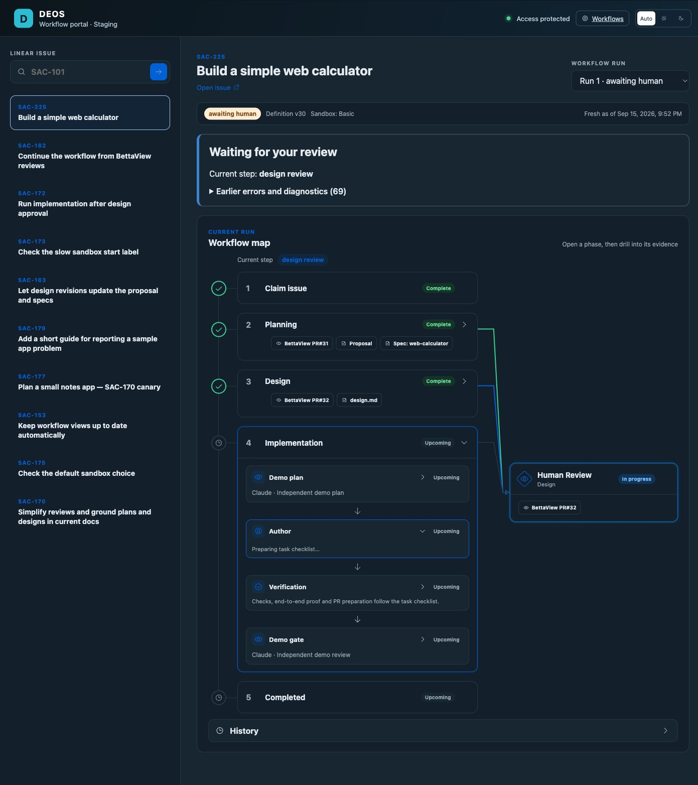

# SAC-225 implementation handoff and staging map

*2026-09-15T18:59:42Z by Showboat 0.6.1*
<!-- showboat-id: 98bc7a4c-5cf7-4480-9ce1-7ba14f8129e8 -->

The saved design response applied all four findings and passed strict OpenSpec, source, allowed-path, whitespace, and trusted completion checks without repair. The handoff attached the real implementation tail before the authorized design approval. Its first execute paused the source but returned an internal RPC error before changing the run. Readback confirmed prepared audit and unchanged gate; exact replay established the handoff. Both responses and original durable diagnostics are preserved. This remains an operator-assisted canary.

```bash
rtk proxy python3 /tmp/sac225-handoff-proof.py
```

```output
{
  "proof": "Live read-only D1, GitHub and Cloudflare deployment readback",
  "handoff": [
    {
      "handoff_id": "implementation-handoff:wf-v1-e3gx5nyorpr4oof63br5mxg3kgdalmftohvsusg5j7i4srzmox2a",
      "run_id": "workflow:99426d9b-cda7-4db4-9136-692a95a0b090:d5dc0e9d-be0d-4504-82a1-62c14340c91c:run:1",
      "plan_digest": "7133827b9522f4016fcae62d57dcff805b287b1de530bc9725f245d4a14bb0b5",
      "state": "established",
      "target_workflow_instance_id": "wf-v1-khqxu5oujf4hs2nrdne7ions3cxsroqwuym6daiovuaiptkimqeq",
      "updated_at": "2026-09-15T18:52:22.102Z"
    }
  ],
  "definition": [
    {
      "definition_id": "implementation",
      "definition_version": 30,
      "definition_digest": "29ff6356607fc69cd175a24631d3797d8b088ed22524afefd610dca06830db15",
      "status": "active",
      "current_node": "implementation_tasks",
      "current_visit_sequence": 27,
      "workflow_instance_id": "wf-v1-khqxu5oujf4hs2nrdne7ions3cxsroqwuym6daiovuaiptkimqeq",
      "after_design_merge": "implementation_prepare",
      "demo_plan_type": "agent",
      "demo_gate_type": "agent",
      "implementation_review_type": "human_gate"
    }
  ],
  "designPull": {
    "headRefOid": "32214be50b5936889489f48284f0741ab2e9112f",
    "mergeCommit": {
      "oid": "a1dcf3d18e0d20e483e507079a1e1fbe8b490686"
    },
    "mergedAt": "2026-09-15T18:58:32Z",
    "state": "MERGED"
  },
  "latestDelivery": [
    {
      "delivery_id": "71ae8f05-0306-41eb-a681-e71c1bf4d893",
      "event_kind": "Issue.update",
      "actor_type": "user",
      "actor_id": "8efc07d8-0d85-430f-84e7-f51bc6833a0b",
      "from_state_name": null,
      "to_state_name": "Merging",
      "state": "processed",
      "provider_time": "2026-09-15T18:58:11.664Z",
      "processed_at": "2026-09-15T18:58:29.412Z"
    }
  ],
  "currentGate": [
    {
      "visit_sequence": 24,
      "gate_kind": "design",
      "state": "merge_authorized",
      "pull_request_number": 32,
      "approved_head_sha": "32214be50b5936889489f48284f0741ab2e9112f",
      "decision_delivery_id": "71ae8f05-0306-41eb-a681-e71c1bf4d893",
      "decision_outcome": "merge_authorized",
      "created_at": "2026-09-15T18:45:09.804Z"
    }
  ],
  "latestAttempt": [
    {
      "attempt_id": "01a0a66f-ffe9-7fef-bb15-6ff7f15b74b2",
      "node_id": "implementation_tasks",
      "state": "running",
      "created_at": "2026-09-15T18:59:13.001Z",
      "ended_at": null
    }
  ],
  "implementation": [
    {
      "status": "tasks",
      "approved_design_sha": "a1dcf3d18e0d20e483e507079a1e1fbe8b490686",
      "tested_base_sha": "a1dcf3d18e0d20e483e507079a1e1fbe8b490686",
      "branch": "deos/agent/SAC-225/run-1",
      "tree_sha": null,
      "pr_url": null
    }
  ],
  "stagingDeployment": {
    "createdOn": "2026-09-15T18:55:35.725381Z",
    "versions": [
      {
        "version_id": "6104497f-2a1b-4c55-b425-2ed4dcaf340e",
        "percentage": 100
      }
    ]
  }
}
```

Portal commit 79f08fe shows configured Demo Plan and Demo Gate before an implementation record exists. All 102 portal tests, portal TypeScript and both builds passed. Staging version 6104497f-2a1b-4c55-b425-2ed4dcaf340e is active at 100 percent. Wrangler returned a zone route listing authentication error after activation; deployment readback and the live browser verified the existing route separately. No backend or container deployment was made. The following browser capture was taken before design approval and shows the real Implementation phase, its four steps, and the Human Review connection.

```bash {image}
docs/evidence/sac-172/demo-gate/sac-225-implementation-map.png
```


