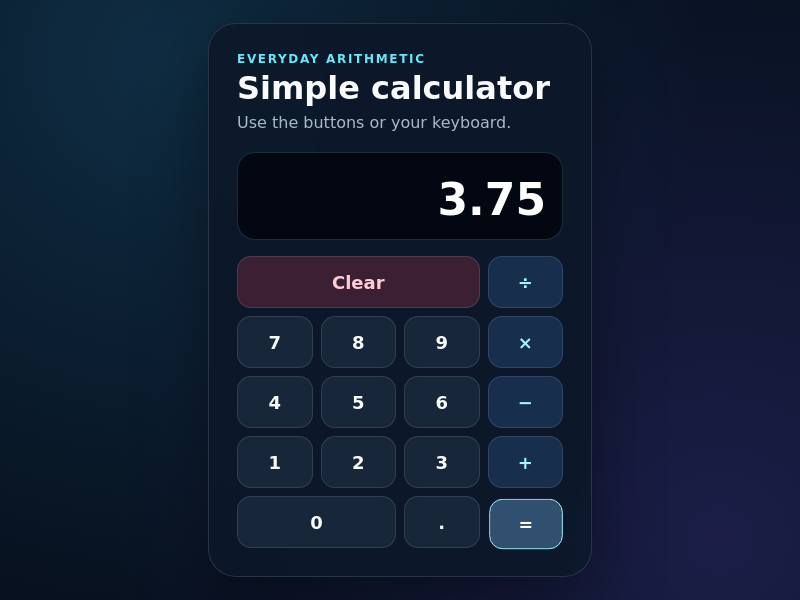

# SAC-225 delayed preview readiness

The implementation author reached preview allocation at 19:37:45 UTC on
15 September 2026. The original readiness probe returned HTTP 530 with error
1016 for its full one-minute window. The preview became quarantined. A later
preview request returned `preview_quarantined`; the browser request returned
`preview_missing`.

These original errors were read from R2 and SHA-256 checked against D1:

| Operation | Time (UTC) | Original error SHA-256 |
| --- | --- | --- |
| First preview | 19:38:56.682 | `9cae0c12f203e652c015beb5fe2bbdf8ffe4a170529ff9fa368d0c38cfe5378a` |
| Preview retry | 19:39:30.611 | `aa1d61dd72f3c3140bbdca7c70e894b589f695f3f82635293cf72f6c9cfbcbf7` |
| Browser | 19:39:56.341 | `5f28772ea5ffc75277a71a983529b28e6d3e66bc78625125504f6092a60bd2e5` |

A subsequent read-only request to the same origin's `/__deos/preview-ready`
returned HTTP 200 and `deos-preview-ready`. This proves the relay later became
reachable from the operator's machine. It does not prove the calculator page,
browser scenarios, or a successful Worker-side reconciliation.

The fix reads the existing owned tunnel inventory and fixed health path on a
preview retry or scheduled reconciliation. It creates no replacement tunnel or
process. It checks the current attempt and uses a guarded update so a stale
visit or concurrent cleanup cannot revive the preview. Initial allocation now
saves the tunnel identity before the first health probe. Original errors remain
immutable.

Local verification: all 553 backend tests passed, including seven preview tests
covering late readiness, retained errors, missing/ambiguous/replaced tunnels,
stale attempts, and cleanup during a health check. TypeScript, generated binding
checks, and strict OpenSpec validation passed.

The author stopped at 20:04 UTC with 24 of 25 tasks complete. Its saved transcript
records successful strict OpenSpec validation, all 24 calculator unit tests,
the production build, and all 16 desktop and 320px Playwright tests. The last
unfinished command was `npm run test:evidence`. The native turn then failed with
`Selected model is at capacity. Please try a different model.` No result file
was written. The supervisor incorrectly replaced that cause with a missing
`result.json` error.

The supervisor now preserves the failed native turn and process details before
completion-file validation. A local test of the built container reproduces a
capacity error without a result file. It preserves the original error and edited
work, emits one completion signal, and does not report a missing-result error.
This is a deterministic process test, not provider-originated proof.

Downloaded failure artifacts were SHA-256 checked against D1:

| Artifact | SHA-256 |
| --- | --- |
| Transcript | `f600c575f5a0871c038f3627bd92d5f12f74374339fb855101d1a294be0508e8` |
| Recovery manifest | `e0351564110d1fa1330006a75a66a1678ec2f7f64a3dc7a9f9d6085175d7ba60` |
| Recovery patch | `368befe4f575df1cad6c53d95d4dd066fb54b1a63c3c1dc224ba14c6d400b3cb` |

Commit `a3730d9` deployed as Worker `610c3edd-a023-4ec6-b0df-82e329cb5bfc`
at 100 percent. All four container pools completed rollout to image
`sha256:88f935668ca4ab24c04b107f09e3d82c71c0fb96c209812fcc78465a06d6bb17`
with four healthy instances each and no errors. The same registry image passed
the capacity-failure process test. The staging portal version stayed unchanged.
See [Showboat checks](sac-225-recovery-checks.md) and
[deployment read-back](sac-225-recovery-activation.json).

The same-definition retry was established at 20:27:55 UTC after a global D1
check showed no active attempts. New author attempt
`01a0a6c1-449e-707f-b384-6b11ee59e5df` is running at visit 31 in
`wf-v1-tu2aqcsrzp6avukewpelm4gmgoapmecjxdnx2qy3lfi3dzut3toa`.
Its input patch SHA matches the saved recovery patch above. The first new
progress observation at 20:28:26 UTC retained 24 of 25 completed tasks and the
same task-file SHA. The approved design, demo plan, definition v30, and final
human gate were preserved. [Retry receipt](sac-225-build-retry.json).

## First live recovery

The new attempt allocated its preview at 20:40:59 UTC. Its first readiness
window again returned HTTP 530/error 1016. The Worker then recovered the same
tunnel from quarantine at 20:42:54.775 UTC. The immutable
[reconciliation receipt](sac-225-live-preview-reconciliation.json) was read from
R2 and matched SHA-256
`23a13e67dc5c1867d8bdfa060b70f61c46836b35c0c2805327f4ad363a87b260`.
No replacement tunnel or attempt was needed.

The assigned Cloudflare browser loaded the calculator with HTTP 200. It saved
ten images: the initial page and nine button actions for `1.5 + 2.25 = 3.75`.
The final image was read from R2, hash-checked against D1, and visually inspected.
See [proof metadata](sac-225-first-browser-proof.json).

This proves live preview recovery and real browser capture. These images belong
to tree `c4f3717a8e4c3d57bece2d001ee8be712ba2d638`. A later local-workerd
Showboat check at 20:47:14 used tree `207ab2908f34a205cff58c43dc05c66096ff7c99`,
so final acceptance still requires matching final-tree visual evidence and the
independent demo gate. The calculator has no implementation PR yet.
