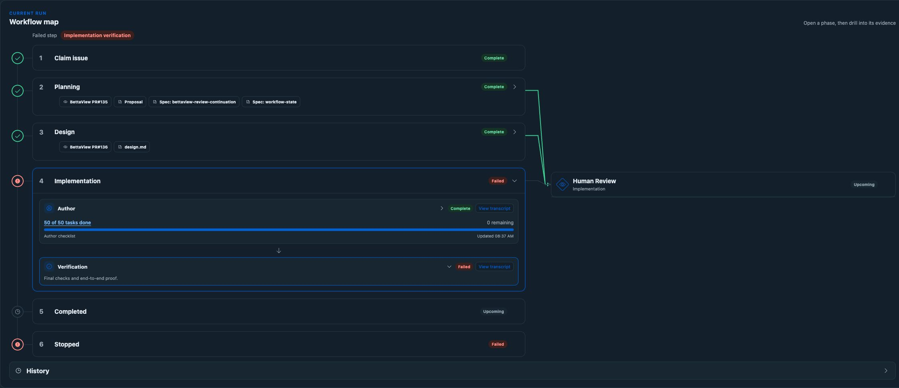

# SAC-182 runner timeout and verification recovery

*2026-09-15T05:59:11Z by Showboat 0.6.1*
<!-- showboat-id: 94bd19db-049b-4dd5-9da9-778edea5c7ae -->

SAC-182 stopped at 2026-09-15T05:39:57.325Z. D1 records failed attempt `01a0a335-573b-7020-8d70-5e4eb7ec1ba7`, `post_collection_validation_failed`, and destroyed cleanup. The R2 candidate and patch hashes were checked against the durable manifest. Its final tree is `f06dcddda83b8d8705a73766e9864ef0919c7a3e`; its check list is empty. Its 259,147-byte patch remains available as `81a3f091107316c8f7d8289aca9d28074e67f81671e1503977007d3527e215c7`.

The 74 portal timeout entries are **300,000 ms**, not 30,000 ms. They come from expected five-minute `waitForEvent` heartbeat expiry. Cloudflare RPC restores `name: Error` while retaining `WorkflowTimeoutError` in the stack. The old catch classified only by name. The new handler recognizes the precise remote exception shape and still propagates unexpected errors with their original cause. See [original error and failed candidate read-back](runtime-failure-readback.json).

A separate real delay caused wasted repeated builds: the old local tool CLI used Node fetch, whose implicit headers deadline expired while the command was still running. A real 310-second delayed HTTP response reproduced `UND_ERR_HEADERS_TIMEOUT` after 301,371 ms for the old client. The repaired HTTP client received HTTP 200 after 310,017 ms with one request. The runner still owns the command deadline. See [timing results](runtime-transport-proof.json); reproduce with `node scripts/sac-172/runtime-transport-proof.mjs`.

The preview request used the whole repository as assets. Wrangler exhausted file watchers, then the failed process remained reserved and prevented a corrected preview. The runner now requires a dedicated assets directory, supplies the Cloudflare CA to Wrangler, and releases a failed preview process group and log before permitting another start. A local Docker runner fixture started an invalid Worker, retained the original error, successfully restarted with built assets, and fetched the expected HTML. It also confirmed current-tree check receipts become stale after an edit and that the author can create a Python virtual environment with pip. The fixture stubbed model-config discovery and used a local broker; this is container/process verification, not provider-originated or model execution proof.

The trusted prompt now keeps request scratch files outside the repository, explains recovery from the saved patch, requires all checks and proof on the final tree, and distinguishes direct provider-adapter fixture calls from the changed app's actual end-to-end flow. Candidate validation still rejects missing or failing checks. Neither a full task meter nor a prior screenshot waives final verification.

Validation: 493 backend tests passed, TypeScript passed, generated Worker bindings were current, strict OpenSpec validation passed, and the linux/amd64 image built successfully. No production portal or BettaView deployment was performed. Full SAC-182 provider proof and its implementation PR remain pending.

```bash
set -e
cd /Users/sachin/code/deos-sac-172
rtk proxy tail -n 12 /tmp/sac172-runtime-repair-tests.log
rtk proxy cat docs/evidence/sac-172/runtime-transport-proof.json
rtk proxy python3 /tmp/sac182-d1-read.py /tmp/sac172-deploy-active-check.json

```

```output
✔ heartbeat expiry accepts the actual Cloudflare RPC error shape (1.011166ms)
✔ start event follows the first workflow to human approval (1.010959ms)
✔ human approval is an explicit transition (0.158834ms)
✔ cancellation explicitly rejects a waiting workflow (0.087834ms)
ℹ tests 493
ℹ suites 0
ℹ pass 493
ℹ fail 0
ℹ cancelled 0
ℹ skipped 0
ℹ todo 0
ℹ duration_ms 8726.519
{
  "startedAt": "2026-09-15T05:49:09.753Z",
  "previous": {
    "error": "fetch failed",
    "cause": "UND_ERR_HEADERS_TIMEOUT",
    "elapsedMs": 301371
  },
  "fixed": {
    "statusCode": 200,
    "text": "{\"completed\":true,\"probe\":\"fixed-http\"}",
    "elapsedMs": 310017
  },
  "calls": {
    "fixed-http": 1,
    "previous-fetch": 1
  }
}{
  "result": [
    {
      "results": [],
      "success": true,
      "meta": {
        "served_by": "v3-prod",
        "served_by_region": "WEUR",
        "served_by_colo": "AMS",
        "served_by_primary": true,
        "timings": {
          "sql_duration_ms": 0.2163
        },
        "duration": 0.2163,
        "changes": 0,
        "last_row_id": 0,
        "changed_db": false,
        "size_after": 90578944,
        "rows_read": 4,
        "rows_written": 0,
        "total_attempts": 1
      }
    }
  ],
  "errors": [],
  "messages": [],
  "success": true
}
```



[Local container fixture results](runtime-container-proof.json) retain the successful preview restart, check-status and Python-environment observations.

```bash
set -e
cd /Users/sachin/code/deos-sac-172
rtk proxy cat docs/evidence/sac-172/runtime-repair-deployment.json
rtk proxy python3 /tmp/sac182-operator.py stage-retries /tmp/sac182-runtime-repair-retry.json

```

```output
{
  "deployments": {
    "deos-queue-consumer-ts": {
      "versions": [
        {
          "version_id": "691b1d8b-870e-4dd2-aca4-a44a33999f3d",
          "percentage": 100
        }
      ],
      "created_on": "2026-09-15T05:59:20.988439Z"
    },
    "deos-sample-project": {
      "versions": [
        {
          "version_id": "7dcb3e04-2c21-4f8f-ab26-b389d4f8c175",
          "percentage": 100
        }
      ],
      "created_on": "2026-09-14T12:29:19.555854Z"
    },
    "deos-workflow-portal-staging": {
      "versions": [
        {
          "version_id": "0cd564c5-f900-4825-8c14-58ed565c01b6",
          "percentage": 100
        }
      ],
      "created_on": "2026-09-15T05:35:16.178051Z"
    }
  },
  "containers": [
    {
      "name": "deos-queue-consumer-ts-implementationstandard2sandbox",
      "image": "registry.cloudflare.com/c68856288112af7698f5be52ea94b96e/deos-queue-consumer-ts-implementationstandard2sandbox@sha256:827095ccfc25f189e57003c9121e9269bac6e954a756c6a7f848047cb6c72709",
      "version": 5,
      "rollout": "completed",
      "health": {
        "errors": [],
        "instances": {
          "active": 0,
          "assigned": 0,
          "healthy": 4,
          "stopped": 0,
          "failed": 0,
          "scheduling": 0,
          "starting": 0
        }
      },
      "progress": {
        "total_steps": 2,
        "current_step": 2,
        "updated_instances": 4,
        "total_instances": 4,
        "version_distribution": {
          "target_version_instances": 4,
          "current_version_instances": 0,
          "target_version_percentage": 100
        }
      }
    },
    {
      "name": "deos-queue-consumer-ts-implementationsandbox",
      "image": "registry.cloudflare.com/c68856288112af7698f5be52ea94b96e/deos-queue-consumer-ts-implementationsandbox@sha256:827095ccfc25f189e57003c9121e9269bac6e954a756c6a7f848047cb6c72709",
      "version": 5,
      "rollout": "completed",
      "health": {
        "errors": [],
        "instances": {
          "active": 0,
          "assigned": 0,
          "healthy": 4,
          "stopped": 0,
          "failed": 0,
          "scheduling": 0,
          "starting": 0
        }
      },
      "progress": {
        "total_steps": 2,
        "current_step": 2,
        "updated_instances": 4,
        "total_instances": 4,
        "version_distribution": {
          "target_version_instances": 4,
          "current_version_instances": 0,
          "target_version_percentage": 100
        }
      }
    }
  ],
  "run": [
    {
      "status": "failed",
      "current_node": "implementation_failed",
      "current_visit_sequence": 41,
      "definition_id": "implementation",
      "definition_version": 27,
      "definition_digest": "ad7fec5d557145b5dc8332c1a514a3ff9f3597fd3feee23f9f8e77e526b22f1c",
      "workflow_instance_id": "wf-v1-d5c2ifdot3p7rkggpzbd3h3tyxobiyyg7xnuijhfepnvvoyzdnva",
      "allowed_linear_user_id": "8efc07d8-0d85-430f-84e7-f51bc6833a0b",
      "human_binding_revision": 1
    }
  ],
  "active_attempts": []
}
{
  "retry": {
    "retry_id": "stage-retry:01a0a335-573b-7020-8d70-5e4eb7ec1ba7",
    "run_id": "workflow:2a653831-c1ec-4db7-972a-d0d08ac0a3d8:e75aad25-c32f-4c23-8184-b4b38388a631:run:1",
    "failed_attempt_id": "01a0a335-573b-7020-8d70-5e4eb7ec1ba7",
    "retry_node": "implementation_build",
    "from_visit_sequence": 41,
    "to_visit_sequence": 42,
    "transition_id": "transition:stage-retry:01a0a335-573b-7020-8d70-5e4eb7ec1ba7",
    "state": "established",
    "workflow_status": "queued",
    "safe_error_category": null,
    "requested_by": "sachin",
    "created_at": "2026-09-15T06:06:09.934Z",
    "updated_at": "2026-09-15T06:06:12.043Z",
    "established_at": "2026-09-15T06:06:12.043Z",
    "retry_kind": "same_definition",
    "source_definition_id": "implementation",
    "source_definition_version": 27,
    "source_definition_digest": "ad7fec5d557145b5dc8332c1a514a3ff9f3597fd3feee23f9f8e77e526b22f1c",
    "target_definition_id": "implementation",
    "target_definition_version": 27,
    "target_definition_digest": "ad7fec5d557145b5dc8332c1a514a3ff9f3597fd3feee23f9f8e77e526b22f1c",
    "source_workflow_instance_id": "wf-v1-d5c2ifdot3p7rkggpzbd3h3tyxobiyyg7xnuijhfepnvvoyzdnva",
    "target_workflow_instance_id": "wf-v1-cghsgyliqgxamwbycplagwgsfcvci7hakrwpgmwho5vmglrguo2q",
    "source_delivery_id": "af60cf6e-d451-4a98-86ec-6aa23f47e047",
    "workflow_instance_id": "wf-v1-cghsgyliqgxamwbycplagwgsfcvci7hakrwpgmwho5vmglrguo2q"
  }
}
```


### Runner repair deployed and saved work resumed

On September 15, backend `691b1d8b-870e-4dd2-aca4-a44a33999f3d` was read back at 100 percent. Both implementation tiers completed rollout to container version 5, image `sha256:827095ccfc25f189e57003c9121e9269bac6e954a756c6a7f848047cb6c72709`, with four healthy instances each and no errors. Ingress and both portal surfaces were unchanged. See [deployment read-back](runtime-repair-deployment.json).

The trusted same-definition retry was established at 06:06:12.043Z, moving the failed visit 41 to implementation build visit 42. New attempt `01a0a3ac-5d69-7e50-a1dd-9b883fe21acc` is running in a fresh sandbox and Workflow `wf-v1-cghsgyliqgxamwbycplagwgsfcvci7hakrwpgmwho5vmglrguo2q`. Its input patch is exactly `81a3f091107316c8f7d8289aca9d28074e67f81671e1503977007d3527e215c7`, recovered from failed try 6. The frozen v27 definition and human binding are unchanged. See [retry receipt](runtime-repair-retry.json) and [running attempt with recovered input](runtime-repair-resumed.json).

The staging browser updated automatically to Workflow running, Author 50/50 complete, Verification in progress and Human Review upcoming. Earlier errors remain collapsed in history. These are the restored task boxes; final-tree checks, fresh preview/browser proof and changed-application provider E2E still have to pass. No implementation PR was created by this repair.


The first real five-minute checkpoint ended at 06:11:51.501Z with the expected `WorkflowTimeoutError`. The new Workflow then completed its authority check and agent reconciliation at 06:11:54.304Z, entered the next wait, and remained running. D1 showed the same live process, a fresh heartbeat at 06:11:47.042Z and no new heartbeat-timeout error records. One earlier startup file-not-found diagnostic remains preserved. See [live checkpoint and D1 evidence](runtime-live-checkpoint.json).
