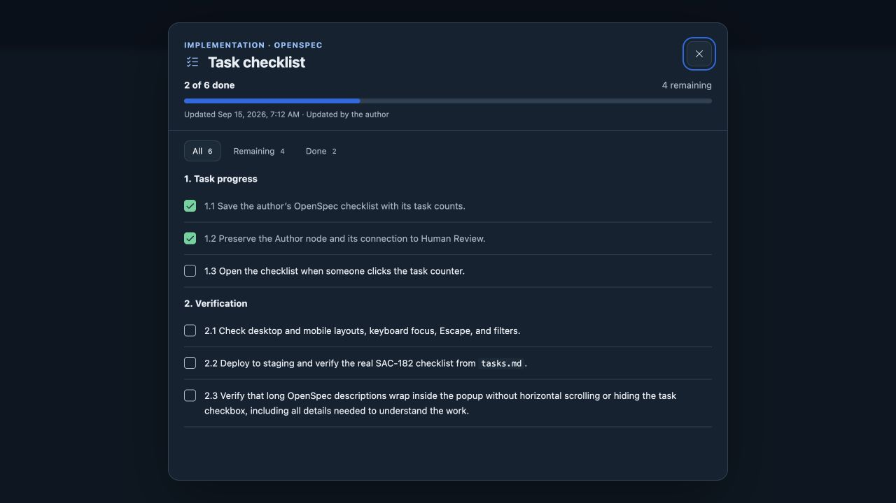
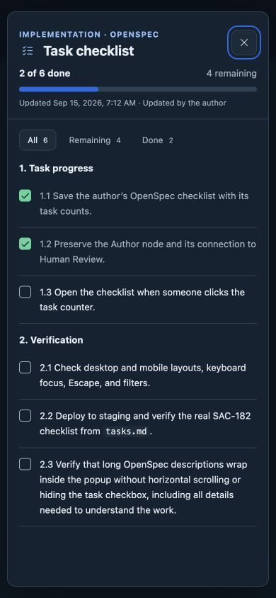
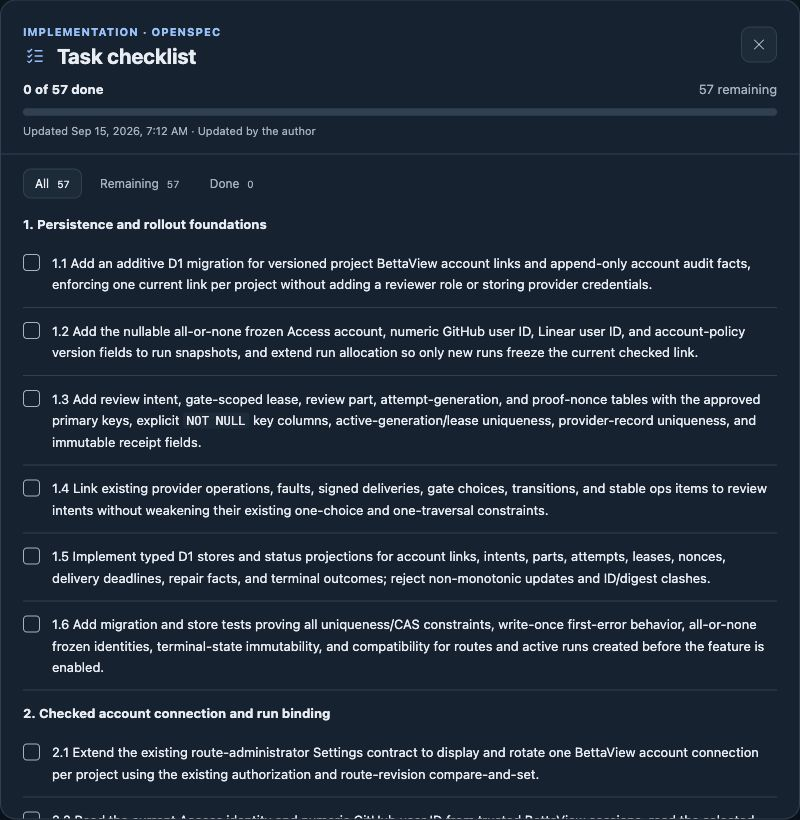
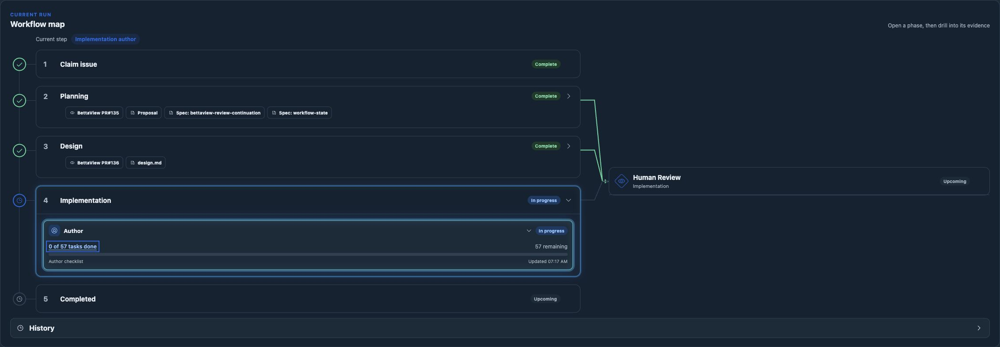

# Author task checklist popup

*2026-09-15T04:13:38Z by Showboat 0.6.1*
<!-- showboat-id: 1e9463f4-c09c-4f65-b070-7d583084bdc5 -->

```bash
rtk proxy node --experimental-strip-types --test tests/implementation-progress.test.ts portal/tests/implementation-tasks.test.ts
rtk proxy npm run portal:typecheck
rtk proxy npm run typecheck
rtk proxy npx --no-install openspec validate sac-172 --strict

```

```output
✔ OpenSpec checklist preserves sections, numbering and wrapped text while excluding examples (1.224334ms)
✔ protected task popup reads the exact observation, rejects stale fallback and corrupt snapshots (120.00875ms)
✔ checklist counts ignore code examples, accept checked case, and allow reopening tasks (1.268083ms)
✔ progress read uses author permissions, rejects truncation and retains original transport errors (2.745042ms)
✔ live counts are scoped to the current try and base, reject old observations, and never change workflow status (96.216583ms)
✔ real file notifications signal task changes and atomic replacements before the heartbeat (4655.124917ms)
ℹ tests 6
ℹ suites 0
ℹ pass 6
ℹ fail 0
ℹ cancelled 0
ℹ skipped 0
ℹ todo 0
ℹ duration_ms 4875.231167

> portal:typecheck
> tsc --noEmit -p portal/tsconfig.json


> typecheck
> tsc --noEmit

Change 'sac-172' is valid
```

The full backend suite passed 488 tests and the portal suite passed 93 tests before final visual polish. The focused checks above passed after the popup changes.

Codex Browser verified a temporary local fixture using the real meter and dialog components. All, Remaining and Done filters showed 6, 4 and 2 matching tasks. Enter opened the dialog; Tab and Shift-Tab stayed inside it; Escape returned focus to the counter. Loading, retry and readable error states worked, with the original stack retained in browser diagnostics. At 390 by 844 pixels, dialog and list widths were both 368 pixels with no horizontal overflow. The fixture files were removed after verification.





```bash
rtk proxy python3 scripts/sac-172/rollout-status.py --env-file /Users/sachin/code/deos/.env > /tmp/sac172-popup-current.json
rtk proxy python3 - <<'PY'
import json
from pathlib import Path
r=json.loads(Path('/tmp/sac172-popup-current.json').read_text())
print(json.dumps({k:r[k] for k in ['deployments','run','active_attempts']},indent=2))
print(json.dumps({'latestTaskProgress':r['task_progress'][0],'containers':[{k:c[k] for k in ['name','image','version','health']} for c in r['containers'] if 'implementation' in c['name']]},indent=2))
PY

```

```output
{
  "deployments": {
    "deos-queue-consumer-ts": {
      "versions": [
        {
          "version_id": "ecd04427-5c16-4616-a221-f9b46715e483",
          "percentage": 100
        }
      ],
      "created_on": "2026-09-15T04:14:56.811573Z"
    },
    "deos-sample-project": {
      "versions": [
        {
          "version_id": "7dcb3e04-2c21-4f8f-ab26-b389d4f8c175",
          "percentage": 100
        }
      ],
      "created_on": "2026-09-14T12:29:19.555854Z"
    },
    "deos-workflow-portal-staging": {
      "versions": [
        {
          "version_id": "525676c6-4fab-41e1-b34b-15f16aa98594",
          "percentage": 100
        }
      ],
      "created_on": "2026-09-15T04:15:29.096595Z"
    }
  },
  "run": [
    {
      "status": "active",
      "current_node": "implementation_build",
      "current_visit_sequence": 40,
      "definition_id": "implementation",
      "definition_version": 27,
      "definition_digest": "ad7fec5d557145b5dc8332c1a514a3ff9f3597fd3feee23f9f8e77e526b22f1c",
      "workflow_instance_id": "wf-v1-d5c2ifdot3p7rkggpzbd3h3tyxobiyyg7xnuijhfepnvvoyzdnva",
      "allowed_linear_user_id": "8efc07d8-0d85-430f-84e7-f51bc6833a0b",
      "human_binding_revision": 1
    }
  ],
  "active_attempts": [
    {
      "attempt_id": "01a0a335-573b-7020-8d70-5e4eb7ec1ba7",
      "node_id": "implementation_build",
      "state": "running"
    }
  ]
}
{
  "latestTaskProgress": {
    "attempt_id": "01a0a335-573b-7020-8d70-5e4eb7ec1ba7",
    "completed": 0,
    "total": 57,
    "tasks_sha": "d952f4e2f6fc6145f15f18c25689c431dfc1389e18cdb76e2908677d2e4fc9e7",
    "observed_at": "2026-09-15T04:17:03.064Z"
  },
  "containers": [
    {
      "name": "deos-queue-consumer-ts-implementationstandard2sandbox",
      "image": "registry.cloudflare.com/c68856288112af7698f5be52ea94b96e/deos-queue-consumer-ts-implementationstandard2sandbox@sha256:d2237e07339cb8358aba7da5399700ce37e709fb529dacc3695291d04afd2431",
      "version": 4,
      "health": {
        "errors": [],
        "instances": {
          "active": 0,
          "assigned": 0,
          "healthy": 4,
          "stopped": 0,
          "failed": 0,
          "scheduling": 0,
          "starting": 0
        }
      }
    },
    {
      "name": "deos-queue-consumer-ts-implementationsandbox",
      "image": "registry.cloudflare.com/c68856288112af7698f5be52ea94b96e/deos-queue-consumer-ts-implementationsandbox@sha256:d2237e07339cb8358aba7da5399700ce37e709fb529dacc3695291d04afd2431",
      "version": 4,
      "health": {
        "errors": [],
        "instances": {
          "active": 1,
          "assigned": 0,
          "healthy": 3,
          "stopped": 0,
          "failed": 0,
          "scheduling": 0,
          "starting": 0
        }
      }
    }
  ]
}
```

The staging CLI reported Cloudflare route-list authentication error 10000 after the Worker activated. The deployment read-back above confirms 100 percent traffic; the existing custom domain served the new build. No permission change or repeat deployment was needed. Backend deployment used `--containers-rollout none`.

The authenticated live browser loaded the real SAC-182 checklist: 57 tasks in 9 sections, all currently unchecked. Remaining showed 57 rows; Done showed its empty state. Escape restored focus to the task counter. The map retained its Author node and shared Human Review connection.





The first post-deploy observation at 04:17:03.064Z saved 15,749 bytes in R2. A real remote Wrangler read returned SHA-256 d952f4e2f6fc6145f15f18c25689c431dfc1389e18cdb76e2908677d2e4fc9e7, matching the D1 observation. See [R2 read-back](task-checklist-r2-readback.json).

This completes the checklist UI change. SAC-182 remains in its same running author attempt. Final-tree checks, changed-behavior provider E2E and the implementation PR are still pending.
