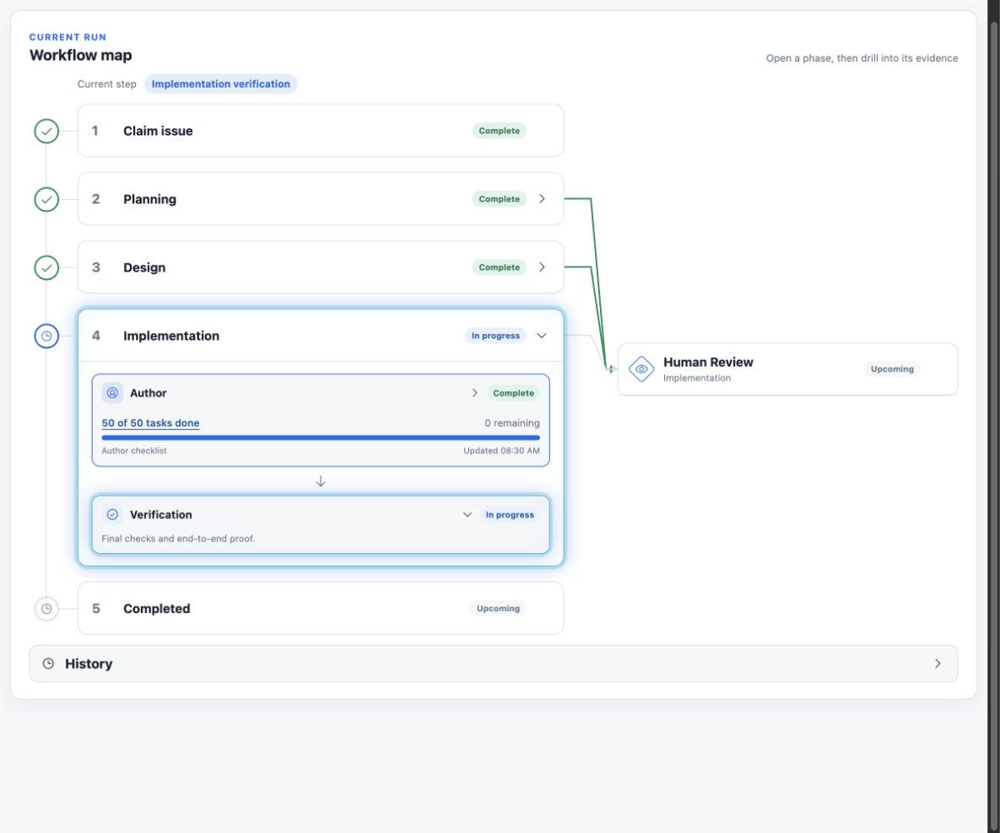
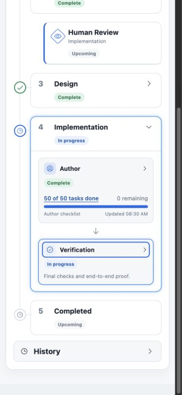
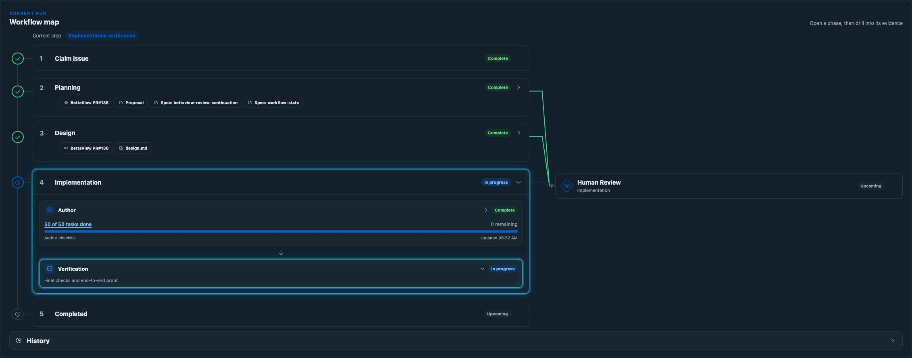

# Author to Verification to Human Review

*2026-09-15T05:33:15Z by Showboat 0.6.1*
<!-- showboat-id: edc3cf6e-812b-48f6-b86c-d0eff54f2ae9 -->

```bash
set -e
cd /Users/sachin/code/deos-sac-172
rtk proxy node --experimental-strip-types --test portal/tests/implementation-steps.test.ts portal/tests/workflow-phases.test.ts
rtk proxy npm run portal:typecheck
rtk proxy npm run portal:build
rtk proxy npx --no-install openspec validate sac-172 --strict --no-interactive
rtk proxy git diff --check

```

```output
✔ a full current checklist starts verification without claiming review readiness (0.666125ms)
✔ empty, partial and reopened checklists stay with Author (0.172917ms)
✔ a new build cannot inherit a previous full checklist or review (0.134125ms)
✔ proof and publication stay active until the durable review handoff (0.101792ms)
✔ clarification pauses the unfinished step and never completes verification (0.094833ms)
✔ failure stays on the interrupted step and recovery resets to the new build (0.078625ms)
✔ merge recheck reopens verification for the reviewed base (0.061958ms)
✔ implementation appears in the existing map before work starts and owns its build visits (1.183042ms)
✔ implementation joins the shared human review branch only at its durable gate (0.194292ms)
✔ implementation failure, retry and final merge preserve the map state (0.622209ms)
✔ version 17 folds granular nodes into progressive planning and design phases (0.149625ms)
✔ gate kind disambiguates the shared Human Review presentation stage (0.072917ms)
✔ the grouped view is selected only for a design-stage definition (0.086792ms)
✔ a visited current phase stays in progress until the run is terminal (0.176291ms)
✔ shared Human Review stays upcoming until both planning and design gates exist (0.116792ms)
✔ a recovered terminal visit does not add a stopped phase or replace the current phase (0.094833ms)
✔ an unfinished author visit stays in progress until the run is terminal (0.13775ms)
✔ a human revision resets old review completion until the new review runs (0.106459ms)
✔ planning and design author failures remain visible in their nested substeps (0.078291ms)
✔ planning author selection includes revisions and excludes independent final trace (0.05675ms)
✔ design author selection follows response and revision visits (0.051833ms)
✔ planning review nodes identify the exact nested substep (0.060709ms)
✔ design checks, rechecks, responses and merges select their own substeps (0.117958ms)
✔ design author completion does not hide a running or failed independent review (0.073541ms)
✔ terminal failures never inherit the success status tone (0.048375ms)
✔ the substantive phase that stops retains its terminal failure status (0.074792ms)
✔ human review collects and selects evidence from the preceding publication visit (0.179042ms)
ℹ tests 27
ℹ suites 0
ℹ pass 27
ℹ fail 0
ℹ cancelled 0
ℹ skipped 0
ℹ todo 0
ℹ duration_ms 103.278

> portal:typecheck
> tsc --noEmit -p portal/tsconfig.json


> portal:build
> vite build --config portal/vite.config.ts && vite build --config portal/vite.settings.config.ts

vite v7.3.6 building client environment for production...
transforming...
✓ 4586 modules transformed.
rendering chunks...
computing gzip size...
dist/index.html                   0.45 kB │ gzip:  0.29 kB
dist/assets/index-Dlhbj2Gl.css   47.05 kB │ gzip:  9.13 kB
dist/assets/index-D0uizeqt.js   342.38 kB │ gzip: 99.43 kB
✓ built in 1.69s
vite v7.3.6 building client environment for production...
transforming...
✓ 4586 modules transformed.
rendering chunks...
computing gzip size...
dist/settings.html                   0.46 kB │ gzip:  0.30 kB
dist/assets/settings-Dlhbj2Gl.css   47.05 kB │ gzip:  9.13 kB
dist/assets/settings-xZvqAHra.js   342.38 kB │ gzip: 99.43 kB
✓ built in 1.70s
Change 'sac-172' is valid
```

```bash
set -e
cd /Users/sachin/code/deos-sac-172
rtk proxy node --experimental-strip-types --test portal/tests/implementation-steps.test.ts portal/tests/workflow-phases.test.ts
rtk proxy npm run portal:typecheck
rtk proxy npm run portal:build
rtk proxy npx --no-install openspec validate sac-172 --strict --no-interactive
rtk proxy git diff --check

```

```output
✔ a full current checklist starts verification without claiming review readiness (0.587333ms)
✔ empty, partial and reopened checklists stay with Author (0.099292ms)
✔ a new build cannot inherit a previous full checklist or review (0.106542ms)
✔ proof and publication stay active until the durable review handoff (0.09875ms)
✔ clarification pauses the unfinished step and never completes verification (0.086458ms)
✔ failure stays on the interrupted step and recovery resets to the new build (0.079666ms)
✔ merge recheck reopens verification for the reviewed base (0.059ms)
✔ implementation appears in the existing map before work starts and owns its build visits (1.165583ms)
✔ implementation joins the shared human review branch only at its durable gate (0.18575ms)
✔ implementation failure, retry and final merge preserve the map state (0.63925ms)
✔ version 17 folds granular nodes into progressive planning and design phases (0.149083ms)
✔ gate kind disambiguates the shared Human Review presentation stage (0.069208ms)
✔ the grouped view is selected only for a design-stage definition (0.084625ms)
✔ a visited current phase stays in progress until the run is terminal (0.115667ms)
✔ shared Human Review stays upcoming until both planning and design gates exist (0.094666ms)
✔ a recovered terminal visit does not add a stopped phase or replace the current phase (0.177375ms)
✔ an unfinished author visit stays in progress until the run is terminal (0.137708ms)
✔ a human revision resets old review completion until the new review runs (0.100166ms)
✔ planning and design author failures remain visible in their nested substeps (0.062416ms)
✔ planning author selection includes revisions and excludes independent final trace (0.051958ms)
✔ design author selection follows response and revision visits (0.048125ms)
✔ planning review nodes identify the exact nested substep (0.090583ms)
✔ design checks, rechecks, responses and merges select their own substeps (0.087791ms)
✔ design author completion does not hide a running or failed independent review (0.08275ms)
✔ terminal failures never inherit the success status tone (0.059125ms)
✔ the substantive phase that stops retains its terminal failure status (0.082583ms)
✔ human review collects and selects evidence from the preceding publication visit (0.194458ms)
ℹ tests 27
ℹ suites 0
ℹ pass 27
ℹ fail 0
ℹ cancelled 0
ℹ skipped 0
ℹ todo 0
ℹ duration_ms 103.726375

> portal:typecheck
> tsc --noEmit -p portal/tsconfig.json


> portal:build
> vite build --config portal/vite.config.ts && vite build --config portal/vite.settings.config.ts

vite v7.3.6 building client environment for production...
transforming...
✓ 4586 modules transformed.
rendering chunks...
computing gzip size...
dist/index.html                   0.45 kB │ gzip:  0.29 kB
dist/assets/index-Dlhbj2Gl.css   47.05 kB │ gzip:  9.13 kB
dist/assets/index-B4RkTsNa.js   342.69 kB │ gzip: 99.52 kB
✓ built in 1.71s
vite v7.3.6 building client environment for production...
transforming...
✓ 4586 modules transformed.
rendering chunks...
computing gzip size...
dist/settings.html                   0.46 kB │ gzip:  0.30 kB
dist/assets/settings-Dlhbj2Gl.css   47.05 kB │ gzip:  9.13 kB
dist/assets/settings-mZPcjDKB.js   342.69 kB │ gzip: 99.52 kB
✓ built in 1.75s
Change 'sac-172' is valid
```

The full portal suite passed all 100 tests before the final refinements above. Local fixture screenshots below verify layout only. The final authenticated staging screenshot shows the real canary. The deployed bundle is `index-B4RkTsNa.js`; Cloudflare read-back reports staging portal `0cd564c5-f900-4825-8c14-58ed565c01b6` at 100 percent traffic. The CLI returned route-list authentication code 10000 after upload/activation; its original output remains in `/tmp/sac172-verification-deploy.log` and the Wrangler log. No backend or canary transition was performed. See [read-back](verification-node-readback.json).







The final live browser also loaded all 50 tasks as done in the popup with no alert. Escape returned focus to the task counter. Both current-step labels used Verification. See [DOM read-back](verification-node-browser.json).
