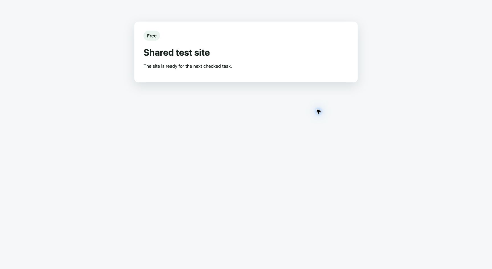

# SAC-182 shared test recovery, 2026-09-29

The trusted Worker used its stored Access service credential against the
lease app's `/api/version` endpoint and received HTTP 200 with `admitted: true`.
The credential was therefore checked by a real deployed Worker call, not just
by a secret timestamp.

Run 2 retained candidate work in PR #137. Its first test lease failed during
setup, before activation or app/provider test work. The coordinator wrote and
read back a failed-setup note on PR #137, removed its four owned resources,
proved each absent, and saved the abort receipt. The site became free at
2026-09-29T06:08:58.475Z. That lease has no test attestation or success close.

The original Cloudflare Workflow instance
`wf-v1-et6zs3l4ndwgsj6qfcetsl5usjwra4wh2z3lwyltor6liv6hbioa` ended
Errored after 5,972 completed steps. Its last successful authority step was
visit 1494; the final system action failed six times. Cloudflare reports
`AggregateError: Original error storage failed; complete errors are in Workers
logs`. The detailed final exception was not written to `workflow_errors` and
was not returned by an Observability query for this instance. Earlier recorded
errors and the original failed-setup fault remain in D1 and R2. The final
exception's cause is unavailable; it must not be presented as diagnosed.

A guarded recovery established a new executor at visit 1495. It stopped before
any new request with `stored workflow definition digest mismatch`. D1 has that
original error under ID `597a5ddc-74a2-4808-b0cd-a6e0c460838a`. The run was
admitted under bundled implementation v44 digest `08ee27af...`, while D1's
older v44 row has digest `5a6cf0b2...`. The bundled v45 definition has the
same content as the admitted v44 bundle except its version field. The next
repair records this exact mismatch and moves only run 2 to registered v45;
the historical v44 definition is retained.

Migration `0068_sac_182_definition_repair.sql` recorded that exact repair in
`workflow_definition_repairs`. A second guarded recovery established instance
`wf-v1-3vl3fmtcwbhyj3i3nhgpazsxxk4osgtmrwujzwhitwvqgs2xmsfq` at visit
1496. It retained PR #137 and candidate commit
`3837087abb16000f115887afe714b4cc2f4acadd`, then requested a new lease:
`21c57acf3c8489cb1cc1438437ad16cc8a835c5a080b5b510a46414bd4ba6b5c`.
The coordinator pinned staging source `f8275c1e21a420febeed40139e16fd90605f7b80`
and created the isolated portal, BettaView, D1, and R2 resources.

The pinned staging app build predates the lease version field. The trusted
lease edge wrapper now reports the fixed base version from its own binding,
and an edge revision tag guards refresh of existing lease Workers. The
BettaView refresh preserves its existing Durable Object migration. Both
protected app origins returned HTTP 200 with the expected source, build, and
base version. D1 saved two service readbacks and moved the lease to `active`
at 2026-09-29T06:44:18.545Z. These facts prove setup and activation only;
candidate, app use, and provider proof remain separate checks.

The trusted candidate build for commit
`3837087abb16000f115887afe714b4cc2f4acadd` was deployed to the two
lease Workers. After Cloudflare rollout settled, D1 stored two matching
readbacks: BettaView version `6aee4ce8-b5ed-430e-a17f-153899c21cc2` at
06:47:50 UTC and portal version `0666c8c5-805f-44ea-87c9-01ecaa01f2da`
at 06:48:53 UTC. The app origins each returned HTTP 200 with that commit and
the saved base version. This is candidate deployment proof, not an app demo.

The first demo agent attempt `12f131c0-a90c-4d7f-942e-543b4178239a`
started at 06:49:09 UTC and blocked at app launch with the saved original
error `test_app_launch_cookie_invalid`. Its Sandbox was destroyed. The
coordinator closed the owned browser, revoked the old app session, retained
its incomplete Showboat as superseded proof, and recorded one exact retry in
`test_demo_attempt_retries` at 07:04:48 UTC. The replacement attempt
`c64950fe-e6c2-4fdf-81de-e841311fab45` started at 07:05:13 UTC. Its
app and provider results must be checked separately.

The replacement got a ready managed browser session, then its real navigation
to the isolated BettaView app returned HTTP 401 `invalid_access_token`.
The pinned SAC-182 candidate predates the test gate auth seam. Its agent
marked all 12 scenarios blocked and retained the original result, validation,
and private blocked-screen capture. A public Showboat readback confirms the
exact checked-out commit, not scenario success.

The first marker update reached Linear at 06:50:50 UTC and was recorded in
the normal signed delivery table. It was not claimed as a test delivery:
Linear indented the marker into the final list item and removed the trailing
newline, so the saved exact after-hash did not match. The marker action
remained incomplete. A later different marker ID was rejected while the old
marker remained. At 07:22 UTC, the original SAC-182 description was restored
and read back through Linear. A temporary blank-line comment showed that
Linear preserves a stand-alone comment with no trailing newline; it too was
removed and the original text read back. Migration 0070 disabled the expired
unclaimed expectation, saved the provider update and restoration as a repair
receipt, and authorized exactly one more blocked-attempt retry. It did not
create a test attestation or provider proof.

The trusted lease wrapper now uses the pinned candidate's exported auth seam
after the lease gate checks Access and its short app session. Candidate Worker
edge refreshes are audited and require two matching running-version reads.
The repair retry is fenced to the recorded attempt, verifies the restored
Linear description hash, closes the prior browser, revokes its app session,
and retains incomplete proof as superseded before rotating the attempt ID.

The third attempt `2a237817-b7a1-4081-a139-76a546ab604f` used refreshed
candidate Workers. BettaView reported the pinned SAC-182 commit and version
`edb1aa50-3306-4241-b9da-d055728cb499`. The agent opened the actual
Settings and PR 137 screens, but `/auth/github` returned HTTP 503 with
`missing_github_client_id`. Its result is `blocked`, with all 12 scenarios
undemonstrated. The original app result and validation are in its complete
R2 manifest `manifest:2a237817-b7a1-4081-a139-76a546ab604f`.
Private screenshots have `sanitizerResult: pending`; none count as public
visual proof.

The third attempt inserted a stand-alone Linear marker. The genuine signed
delivery `6e6fdf39-6fe8-4a6b-b67a-5950d9c762cc` reached ingress at
07:39:48 UTC but followed the normal route, so no test delivery was claimed.
The cause was a missing `TEST_MARKER_KEY_V1` secret on the ingress Worker. The
coordinator has the secret and created the marker. Ingress now resolves the
expected public marker through a private service binding to the coordinator;
the secret stays there. The deployed ingress binding and a later real Linear
event returned HTTP 200. A content-free D1 diagnostic for a manual marker
insertion shows exact issue, team, event time, old and new description hashes,
and stand-alone marker; only the actor and expired expectation window differed.
The manual insertion is not test proof. The temporary marker was removed from
SAC-182, and the original description was read back. A new bounded expectation
and genuine app-actor event are still required.

The candidate app's GitHub OAuth prerequisite was absent from the SAC-253
design. The lease host changes per run, and its exact callback is not yet
registered with the GitHub App. The lease Worker also lacks its OAuth client
configuration. App review and publish paths cannot be claimed as tested until
that prerequisite is designed and provided without giving the candidate
arbitrary provider credentials. The Access token rotation has been proven and
is unrelated to this remaining GitHub authorization blocker.

## 29 September: existing reviewer path and retained failure recovery

The deployed coordinator rechecked the existing test reviewer credential against
GitHub and the frozen provider profile with HTTP 200. This corrects the earlier
claim that another GitHub callback and client secret were required for the
automated demo. The optional OAuth route remains separate. No permissions,
credentials, or provider settings were changed.

The old lease closed at 10:47 UTC through the retained-failure path. It has no
success attestation. Its original candidate, result, transcript, captures, and
failure evidence remain available.

The repaired SAC-182 snapshot is `72c645896dfa63f43d3605f714a37232fcbb5bb7`,
with the current approved main commit as its sole parent. The original history
and repair commits remain on the local backup branch
`codex/sac-182-review-repairs-20260929`. The existing draft PR was updated with
an exact prior-head check. The coordinator adopted the new candidate through
its journaled repair endpoint; no source-run approval or error was overwritten.

Both app bundles, the compiled BettaView Worker, and the candidate's actual
ReviewContinuation/DeosWorkflow module were uploaded and read back with matching
hashes. Two independent runtime builds were byte-identical. Repository tests
passed (654 passed, one skip), the added replacement-receipt test passed, and
all 121 BettaView tests passed. These are local checks and artifact readbacks,
not live review proof.

The fresh lease `a316e923fc780ef96fbec2a08ea1973d0dda1dc9366612228be453c124f1786b`
activated the base apps at 11:45 UTC. Setup found that the new shared runner's
policy omitted the source run's hash-bound test adapter approval. The fixture
loader now reads that original, hash-checked approval through the dispatched
handoff. It does not create a new provider grant.

At 11:50 UTC the disposable review runtime's first version request returned
HTTP 530 / Cloudflare 1016. That original failure is retained. A coordinator
update also interrupted the orchestration heartbeat; the lease was fenced at
11:51 UTC before its demo attempt started. The recovery extension retains its
setup and fixture ledgers before cleanup, rejects any started demo or scenario,
and can produce only a failed setup receipt. The twelve live review scenarios
remain unverified at this point.

The failed setup closed at 11:56:20 UTC with all seven owned resources absent,
including the disposable GitHub pull request/branch and Linear issue. The site
returned to free at revision 1963. Its retained setup ledger has SHA-256
`00a0cba0ea0e316d4621cd1e2a4f15e9491a8745d93660029cc1ddbd965e9d40`.
No test attestation was created. The interrupted executor resumed from its
last idempotent transition using Cloudflare's targeted step restart; earlier
step results and the full pre-restart state were retained.

## Fresh candidate and app checks

Lease `e004f05cb550e79d63f00dfd23c228446ef251edd0d98c80c1736ed4065b1fb4`
uses the repaired commit above. The two app version reads settled at 12:06 UTC:
BettaView `18ffc738-3d48-4f9c-9eef-35d623bf8ccb` and portal
`8f449dc1-845d-4984-b951-fb5542ddfb8b`. The actual candidate review runtime
reported version `57ff8883-642f-4bb7-85d1-ec4a8617f775` with its checked compiled
hash. Early DNS propagation and old-version reads remain in the failure journal.

Demo attempt `9d65b93b-e0ff-47db-ae6f-f9c16a8f9390` started at 12:06:49 UTC.
Its immutable input contains the new review fixture, checked Settings inputs,
and all twelve inherited scenarios. Its workflow prompt is still the frozen
v45 prompt; later capability documentation now travels in the materialized
input so a retry need not alter that approved workflow definition.

The actual BettaView Settings page established the checked reviewer session.
GitHub `/user` returned HTTP 200 through the scoped transport. The candidate
created account policy version 1 at 12:11:39 UTC and version 2 at 12:15:25 UTC;
the database retains version 1 as superseded. Both versions use the same
allowed reviewer. This proves connection and rotation, but does not yet prove
the planned different-user or frozen-run checks. Captures remain private until
the trusted sanitizer passes. No live review scenario is marked complete here.

## 29 September, 12:22 UTC: review page dependency failed

Attempt `9d65b93b-e0ff-47db-ae6f-f9c16a8f9390` ended blocked. Its saved result
and validation say the real BettaView PR page returned `DEOS review story
returned 421`. No review scenario was prepared in the candidate workflow;
Settings reached versions 1 and 2 for the same checked account. None of the
review publication or transition scenarios passed.

The result SHA-256 is
`c63e55f6ef4982e044e08b9c29c6b5d05dedcff91889a2cc81127fb46a9c4bdd`.
The private transcript SHA-256 is
`29f0fcb52e93d80e225989a567edd19a2ca60ddc708e6a1dcfb8b5bdd1425a77`.
Both were downloaded and compared with the accepted artifact records.

The internal BettaView service call uses `https://deos.internal`; the lease
portal edge expected its browser hostname and rejected that call. The repair
uses a named, read-only portal entrypoint. It checks the original lease browser
session and current fence before calling the unchanged candidate portal code.
It allows only review-story and process-artifact reads and strips authority
headers before the candidate handler. Portal provisioning now precedes its
BettaView binding.

The 202,459-byte private Showboat exceeded the previous 200,000-byte collector
limit. The bounded private limit is now 2 MB; the public projection still keeps
only allowlisted output. The OCR parser also preserves an empty final TSV field.
A local Settings projection passed after masking account values. Its public
image has not yet passed the remote sanitizer.

The deployment at this repair is
`9be35d13-c3f7-4322-818a-71145cb49d6f`. The four Sandbox image updates were accepted for rollout to
`sha256:027eb0993c4149a8924b3015b9c1d7517b17a4af61ec0fc31c3fccbcda382714`.
Readback found all 30 variable hashes, 19 secret names, and 60 bindings unchanged.
The full TypeScript suite passed 818 tests, with one existing skip; type checking
passed. These are local checks, not provider review proof.

## 29 September, 12:44 UTC: failed setup retained and closed

The coordinator retained six original attempt artifacts, eighteen capture or
proof source records, and a full snapshot of the lease database's 131 tables.
The private failure record has SHA-256
`c3a873c6d52b2744f1f66df4dc0be4a627417615dca5b34c828a7148d5dca634`.
The record and nested database snapshot were downloaded again and their byte
counts and hashes checked. The marker attestation remains `observed`; it is not
a completed app test.

Cleanup first found a Cloudflare service binding dependency: BettaView still
referenced the review runtime when deletion was attempted. The original
Cloudflare 400/code 10142 response is retained. Cleanup now removes BettaView,
the portal, the review runtime and fixtures, then the stores. All seven owned
resource records were absent when the failed lease closed at
`2026-09-29T12:44:30.495Z`. Its close receipt records revision 2043 and absence
SHA-256 `50da843f6c4c23d9c511f7d7c827ea7600fdd01ab71852d621f9279b02b797ac`.
The environment returned to `free` with no owner.

Migration 0083 adds one explicit retry after a setup-code repair. The operator
request must identify the closed failed lease, unchanged candidate, retained
failure hash, deployed repair revision, and reason. It requires a waiting new
request, no live attempt, no prior review scenario, and a free environment.
It creates no successful test attestation. The next grant checks that exact
retry record. Invalid candidate and revision, replay, failure retention, and
release denial are covered by deterministic tests.

The candidate fixture now retains head changes before later scenarios use
them. A second owned, read-only pull request supports the approved unlinked-PR
check; it cannot accept app review writes and is included in cleanup. This
uses the existing approved test repository and credential. The different-user
part of the Settings scenario remains unverified pending owner direction;
the runner must state that limit and may continue the other approved checks.

Coordinator version `e8084d07-b9c1-421a-b081-4c1ce5e817ad` includes these repairs.
All 30 variable hashes, 19 secret names and 60 bindings match the pre-deploy
snapshot. All four Sandbox apps report `ready` on the repaired image. Type
checking and OpenSpec validation pass; the full TypeScript suite reports 822
passed and one existing skip. The Python suite reports 116 passed. None of
those local checks is a substitute for the fresh app demonstration.

## 29 September, 13:14 UTC: checkout failed before the agent started

Fresh lease `cf726aa84fcf6802a01f2030205ae3f3ee54d7ff6eaf0156a682acfb877deec6`
activated the unchanged `72c6458` candidate. Both candidate services passed two
version reads. Attempt `3d7176d2-cbda-4d00-988b-b04eda1da729` then failed during
repository checkout, before it had a process ID. It retained a complete failure
manifest and destroyed the Sandbox. No app scenario or reviewer session started.

The saved original error was `repository_checkout_transport_failed`. The old
checkout code discarded Git stderr, so its underlying cause cannot be inferred
from that record. The repaired runner retains each retry's stderr, stdout, exit
status and attempt number, with the capability token redacted. The Git proxy
also retains the upstream status, request ID and redacted response body. A
duplicate credential release during startup failure has been removed.

Migration 0084 allows this specific pre-process failure to use the existing
failed-demo cleanup. It requires a complete manifest, destroyed Sandbox, no
started scenario or reviewer session, and verified original error objects. The
retained record has a startup failure and a null agent result; it cannot grant
test approval. Later app failures with started scenarios remain outside this
recovery path.

Coordinator `ce4d6054-3537-4d21-a9e5-a477b2a0bb5c` includes the repair, the
operator-only raw Linear capture importer, and the screenshot OCR update. The
OCR process reads a larger raster while the published image keeps its original
pixels and fixed masks. Local checks accepted a real Linear issue heading and
the earlier authenticated Settings capture. These local copies have not been
published as fresh app proof. All 30 variable hashes, 19 secret names and 60
bindings match the prior deployed settings.

The startup-failure lease closed at `2026-09-29T13:29:38.516Z`, revision 2090.
All seven owned resource records are absent. Its absence hash is
`3640a4c8a4430e8c549910c21af86d790b6b88de66ce28a947a956e831d6f449`.
A separate download verified the retained failure record
`3f7a03265781a6c482658c63b115015040d66f8eccd7d860487b380b9efbec77`,
its complete 131-table database snapshot, and both original error objects.
The record explicitly has a null agent result.

The full TypeScript suite then passed 825 tests, with one existing skip.
Type checking and strict OpenSpec validation passed. Fresh lease
`0ebe69474a9a19ab214e4cd178464db0414f60904211ff559b83a3ab3f521e08`
was authorized through the checked retry operation for the same candidate.

## 29 September, 13:53 UTC: fresh app and public screenshots

The fresh Sandbox checked out the unchanged candidate and started at
`2026-09-29T13:43:32.986Z`. The actual BettaView Settings page connected the
checked reviewer. The next scenario's run froze account policy version 1.
The first scenario was allocated before connection, so it has no frozen
account; that setup alone does not prove rotation or identity isolation.

A fresh Brave capture of the original SAC-182 issue passed the deployed
fixed-mask OCR sanitizer:
https://deos-shared-test-proof.skundu.workers.dev/proof/94e21673-ee3d-4f7d-b7fd-fd377e1d65bc
Its public SHA-256 is
`f6ae5f9af078902e0f0840c03f4ea5071c3dbf9673ac6b767f248e73ef412184`.
This image proves the task identity; it is not a disposable issue transition.

The actual Settings capture also passed after masking account values and
the form controls:
https://deos-shared-test-proof.skundu.workers.dev/proof/7e9c2214-25ca-4b2e-8536-fe0e5ce5bd81
The public URL returned HTTP 200, image/png, 12,943 bytes. SHA-256 is
`7984a0e26c2384f97df405a9441d34dcb64ca600aae96674d7d85b588f3865e2`.
The first masking attempt left a partial button word; OCR blocked it and
retained that error. The corrected mask covers the whole form row.

The review agent is still running. These screenshots do not establish that
review publication, continuation, all twelve scenarios, or cleanup passed.

## 29 September, failed run retained before another attempt

Attempt `b643a592-9f02-41eb-8dfe-5d390beaea64` ended blocked at
14:03:12 UTC. It reached the actual Settings form, activated policy version 1,
and composed two unpublished review drafts. No app review intent, publication,
or gate decision was recorded. The seeded GitHub thread was fixture setup.
Browser reconnects timed out, and later helper calls used an expired 15-minute
capability. These are recorded failures; the app scenarios did not pass.

The private result SHA-256 is
`ac5d23e41915c44e1b2b23e57b6368ecc4d549feceae0bbde659b971cde1e077`.
The full transcript SHA-256 is
`6bbfa7f5b878729c1d7324aa587950da7dab46590d63d0d5ece5cd674eacee0c`.
Both were downloaded and checked before recovery work.

The repair renews the same short-lived agent grant while its attempt, deadline,
lease, and fence remain current. Page actions and browser maintenance now share
one lock. Invalid fixture inputs return a concrete request example. The guide
also explains how to allocate a run after account activation and read current
proof publication status. The browser lock fixes a connection race; a fresh
provider run must still establish whether it resolves the observed timeouts.

Recovery permits only unpublished scenarios: it checks the owned D1, Worker,
and Workflow identities, refuses any review intent or completed gate decision,
stops only the allocated scenario instances, and reads each terminal status
twice. It rechecks effects, retains the original Workflow replies, and then
snapshots the lease stores before removal. The provider contract is
[Cloudflare's instance status API](https://developers.cloudflare.com/api/resources/workflows/subresources/instances/subresources/status/methods/edit/).

Verification: TypeScript and OpenSpec validation passed. The full suite passed
834 tests with one skip and one failure caused by changed diagnostic wording.
Restoring the established diagnostic phrase passed all five focused cleanup
tests. Eight new settlement tests cover existing effects, foreign resources,
changed ownership, retained responses, and repeated cleanup. Live cleanup and
the fresh app demonstration are still pending at this record.

At 14:49:37 UTC, the failed lease closed at revision 2224 after all seven owned
resources passed removal and absence checks. Two old scenario workflows were
already terminated; recovery terminated the third and read all three back
twice. Before and after settling, the lease database had zero review intents,
zero gate decisions, and zero non-fixture provider operations. The retained
snapshot contains all 131 tables and both stored objects. All snapshot bytes
were downloaded and hash-checked before the next lease was authorized.

Failure evidence SHA-256:
`e4997978439049317168964bac3228019597985a1dd160dab7539258bda875a5`.
Workflow settlement SHA-256:
`9ec8b6167a2d0f3c3b525fcd55a63a5550e637d56c7d142875b15d5604d2cf8f`.
Owned absence SHA-256:
`c4d6b3a7eaa4fe726a6acf8e1a93e95f72b1b197c7a433dba1d4395a2289b948`.
No test approval was created by this recovery.

Coordinator `bc240b99-4f3a-491b-a37c-3614b7b3f413` carries migrations 0085 and
0086. Before and after deployment, all 30 variable hashes, 19 secret names,
and 60 total binding records matched. The runner image is
`sha256:cdbf2d32e27f22662fbf025c1654eeda2e015e3fc47061674dddf9ca46cc3bc2`.

The first retry was rejected by the older database trigger with
`test setup retry requires retained closed failure`. Migration 0087 retains
that guard and permits started scenarios only when the same candidate and
cleanup fence have a saved unpublished-workflow settlement. Fifteen focused
recovery tests passed, including missing and mismatched settlement rejection.
The original live error remains in the workflow error store.

## 29 September, fresh repaired run

Fresh lease `8566ef7dc29b67431c182aac293d9ecbd11131706f6e89d87c9e5e732055a100`
was granted with fence 13 for the unchanged SAC-182 candidate. All four runner
classes showed the repaired image ready before the retry request. The lease
owns a new D1 database, R2 bucket, app Workers, review Worker and Workflow,
and disposable Linear issue SAC-264.

A fresh Brave capture of SAC-182 was imported privately. The fixed crop and
OCR sanitizer published only its issue heading:
[task identity image](https://deos-shared-test-proof.skundu.workers.dev/proof/788eee44-a2af-4552-88e0-11c37a458026).
This proves task identity, not the disposable issue's later state changes.

CI for commit `7b3b77f` passed all six push and pull-request jobs. The
[pull-request run](https://github.com/sachinkundu/deos/actions/runs/36586570995)
reports 834 TypeScript tests passed, two skipped, zero failures; 105 portal
and 111 BettaView tests passed; and 116 Python tests passed on both Python 3.11
and 3.14. Builds, binding checks, and configuration validation also passed.
These checks are separate from the pending provider demonstrations.

## 29 September, provider eviction and gate finding

The fresh demo ran from 15:09:37 to 15:24:48 UTC and ended blocked. Cloudflare's
Runs page and its browser binding history both report `BrowserSessionEvicted`
for session `015a07ce-4b5b-48b4-bfd1-36cd6ad850cd`. It started at 15:11:57
and ended 33 seconds later. The previous browser was also evicted. This is a
provider closure, not evidence of a bad Access secret or a browser lock race.

The raw result and transcript remain retained, with these SHA-256 digests:

- Result: `22056397c279baf01bee9b18870d6dabf004e047684cb31a2cd69927346ddd77`.
- Transcript: `076f2eef1bdb6b16629a295d34a3678eab5135ee377d4a1364c5563a29d8da0c`.

The s12 fixture produced signed Linear delivery
`dec7e78c-703d-4102-b11f-e10f2c5283bb`. Its actor differed from the allowed
person, yet the candidate moved from review to the edit wait. The code checked
the allowed ID only for the `implementation` definition. SAC-182 now checks
the saved allowed person on other definitions too. Its new regression test
rejects a different user and then accepts the allowed user exactly once.
All 41 workflow tests passed. This test still needs a fresh provider run.

Recovery retained the s12 failure with its exact fixture, forwarded delivery,
and original payload hash. It verified zero review intents and zero app
provider operations before and after settling all twelve owned Workflows.
The snapshot holds all 131 tables and eleven stored objects. Every object was
read back and hash-checked. All seven owned resources were then removed and
proved absent. The site became free at 15:34:39 UTC, revision 2288.

- Failure evidence: `29e35dddcbe668b40b4afe2781167eb27186aa977f36c67be9845fee8a4ccfd6`.
- Settlement: `c70c82e1229ace146267acf699b40654bbc5d56c9bfacd888f3e77c1dd58a5f5`.
- Absence: `465495bb2b6307f245523873c44dda85ded99175180ad127fce560d15c64afa4`.

Coordinator `ae1d5269-c0a3-4a7c-a66b-7f1a1c142af4` and migration 0088 add one
explicit browser replacement per service and attempt. Two provider inventory
reads must prove absence; the prior ownership row and close history are kept.
No click or submission is replayed. The browser wrapper now preserves a failed
connection's HTTP status and body instead of losing it behind the SDK's null
WebSocket error. All 60 bindings, 30 variable hashes, and 19 secret names match
their pre-deploy values. No provider settings or credentials were changed.

The repaired SAC-182 candidate is `2e8f3bfd65458a92158638666ee7416ba5925460`.
Its parent is still the saved base. The earlier commit has a backup branch and
a retained candidate record. Portal and BettaView builds passed; 121 BettaView
tests passed. Candidate bundles and the review runtime were uploaded, then
downloaded and hash-checked before adoption. No test approval was created.

## 29 September, interrupted setup recovery

Lease `e6b9603323c87d308bd1d9fb11c6cf8b4d59ada85ba3e6599051ac65e515870c`
never started a demo attempt. Setup recorded an HTTP 530 and a missing compiled
BettaView Worker. The raw app bundle and review runtime were present, but the
separate compiled Worker had been omitted. It is now built from the clean,
exact candidate and read back from storage with SHA-256
`9ec415b7565eb222c17ea2af25ad061602a65b7d22c4ab521566422179660680`.

The Workflow also recorded a closed Durable Object connection. Its next
heartbeat was fenced, and it entered `implementation_failed`. All four owned
resources were removed. The site became free at 15:43:21 UTC, revision 2298.
The retained setup receipt was downloaded and hash-checked:
`068666fd81a70d887daae4a4a7e8c172dbacddee1ad74815008cc75fb24b1d25`.
The original connection error remains in the private error store.

The recovery handler now accepts this narrow case: an errored executor, an
exact fenced setup failure, no started demo, and a closed lease with verified
absence. Other terminal failures remain ineligible. Five recovery tests and
the type check passed. The audit transition records the failed node as its
source and keeps the old failure records.

Coordinator `c8c8c431-bba1-42c2-9265-b9783653c4b2` was deployed while there
were zero live agent attempts. Existing binding types, variable hashes, and
secret names matched before and after deployment. Recovery returned HTTP 202
and a new running executor, `wf-v1-bzr3pzs2rqtkahuawd2o4osnzmsdjmaufyaz6et4ffduhkzvhyaa`.
It granted a fresh lease at 15:49:22 UTC with fence 17. App review proof remains
pending; setup recovery is not a passed app test.

## 29 September, draft reload diagnosis

Attempt `14bde650-efec-4850-83a8-b78fb2016126` ended blocked at
16:19:08 UTC. It proved account connection and rotation to policy version 2,
with older runs retaining version 1. It also created real inline and reply
drafts. No review was published. Two signed Linear moves were restored to
Human Review without a gate decision or workflow transition.

The agent inferred that its replacement browser ended from an HTTP 1101
response. The saved original exception at 16:10:09 was instead
`Navigation timeout of 30000 ms exceeded`. BettaView's native leave-drafts
prompt caused the same timeout in a real local browser. An explicit navigation
option now confirms that prompt. The local browser then reloaded its saved
draft and still dismissed an unrelated publish confirmation. Known navigation,
busy, and closed-session errors now give distinct responses with the retained
fault ID. Unknown errors still propagate.

The original result and transcript remain unchanged:

- Result: `8218871358996018e8ae9e3d5f40866e51f8220d94dca82419b5cc9df08097ae`.
- Transcript: `6316e3aac188df728cdd1836d47d8c267a69899437a3e32ff2938e5df157b4d4`.

Failed-demo cleanup now recognizes only the fixed s12 restoration operations
when their exact source and return deliveries are signed, recorded, forwarded,
and bound to the owned fixture. It retains the candidate's original pending
rows; it does not mark them successful or create a test approval. Other
provider operations and any published review still block this recovery path.

The browser fix passed 23 focused tests, including the real local browser.
The failure-response and cleanup checks passed 20 tests. Type checking passed.
Fresh live review publication and successful cleanup remain to be proven.

Cleanup retained all 13 scenario Workflows, the 131-table database, and 12
objects before removal. The saved evidence kept zero review intents, zero gate
decisions, and the three bounded Linear restoration operations. The replacement
browser history confirms `NormalClosure` at cleanup; it had not ended at the
failed draft reload. All seven resources were absent at 16:28:43 UTC, when the
site became free at revision 2369.

- Failure: `d78a2fa9b0dfd790f71b7d60f4d15ae9ecb6c1cd06fa2248ad2c660bcfe73386`.
- Settlement: `66b31f0616d939b347f64ef44d159c587d193d6dc712338b7a64d56f5fa177b7`.
- Absence: `39ace3360cdd3337a24d1547a617552b962ccc2fa5bfd6e0987ec14399088248`.

The proof publisher had rejected the two valid Settings screenshots as a
duplicate kind. It now includes every sanitized app/task image and verifies
each public link before marking the set read. Structured proof remains unique
per kind. All five proof publication tests passed, including an unavailable
second screenshot that must leave the entire set unread.

## 29 September: session renewal and review UI fixes

The coordinator now refreshes browser admission without navigating away from
the current review. Its local browser regression keeps the page and saved
draft intact. Coordinator version `fe9968a6-ff50-40fb-8fe9-89881421d221`
contains that fix. All 60 bindings, 30 variable hashes, and 19 secret names
matched the prior deployment. No provider setting or credential changed.

The next live attempt exposed missing continuation status in the review UI.
The portal returned the link, but BettaView's story filter dropped it. The
candidate repair keeps that server link through the filter. Four API tests
cover ready, unlinked, closed, and stale links while still excluding provider
diagnostics from the story.

The Publish button also passed its DOM click event as the review type. A real
local browser test reproduced `{isTrusted: true}` in the outgoing request where
`COMMENT` was required. The repaired handler uses the saved review type. The
same browser test passed for Comment, Approve, and Request changes and checked
that each request retained its review ID and draft content. These local fixes
still require a fresh pinned candidate and live proof.

## 29 September, 17:18 UTC: retained app failure and next candidate

The v10 attempt visited all 12 scenarios. Draft reload and same-user account
rotation worked. Publishing notes failed because the click handler passed a DOM
event as the review choice. The app also dropped the server's review link while
filtering the story, so the continuation API reported `feature_disabled`. Both
bugs have local regression coverage, including a real browser Publish click.
The repaired candidate is `9a8b2e3873b8968bc17024646d59b2d549021169`.

The no-note approval did create GitHub review `5355828687` on disposable PR 59.
It used the direct path; no linked review intent or continuation was recorded.
Two real Linear moves were restored to Human Review. These are partial results,
not a passed review-flow demo. A different-user reconnect still needs the owner's
choice; same-user rotation does not prove it.

Cleanup first hit a Cloudflare timeout. Its original error was retained. The
idempotent retry closed lease `d1752decb0558306cb40382f981d321971af3025482a67d33291b4f14aaab48d`
at 17:17:58 UTC, revision 2450. All seven owned resources have absence receipts.
The readback checked 13 retained snapshots, including 131 database tables, and
all 13 scenario Workflows were terminated. Failure evidence hash:
`d8f0b9d19a7868ee6628953e03d7382a8d64d51bde2c2af0ba94af2a4e250de7`.
Cleanup hash: `66fa5752f93c9bb3844ede1ecc5a721959c9836d95c78805b41efcaad8c3a43c`.
Absence hash: `338990b94dff342abdce19d2336861dbeb8943193fb864c34b357b70c293cdf8`.

The next demo can read a bounded browser audit: completed resource origins for
the current document and a value-free credential check of local/session storage.
This is not a history of earlier navigations. The event evidence now joins each
Linear event to the exact payload hash accepted by signed ingress and separately
checks the stable app actor ID. Linear's `user` actor label is preserved.

## 29 September, 18:03 UTC: candidate ready, model connection delayed

The new lease `a34db2f565a0af85b54d68f041c0806bb4cfed43d263821ea3107298170166ce`
activated at 17:33 UTC. Both candidate app versions passed two matching reads
for commit `9a8b2e3873b8968bc17024646d59b2d549021169`: BettaView
`c9c627b0-91bc-4538-b7f1-108bf9bd61ef` and portal
`9c8bfc75-f6ee-41a5-85c6-2c7213ba6116`. The disposable fixtures are PR 61
and SAC-267. The fresh task identity image passed sanitization and public
hash readback at [its lasting URL](https://deos-shared-test-proof.skundu.workers.dev/proof/99703a76-b34b-4b16-a251-907b2fda5e34).

Attempt `3111e3a0-3738-42b5-981b-26c3714dbc94` started at 17:41 UTC.
At 18:03 UTC the process and parent Workflow were running, but no browser session
or review scenario had started. Retained Workers Observability events for its
exact container show repeated model response stream disconnects, an HTTP 503
from the response endpoint, and HTTP 500/503 from the model-list endpoint.
The heartbeat proves only that the process is alive. It does not prove model
progress or a passed test. No coordinator update was made during this attempt.

The handoff readback still shows the old v43 run failed with its original
`workflow_executor_timeout`. Its dispatched successor uses v45 and the same
PR 137. The handoff test covers approval identity, preserved source failure,
and the new candidate binding. This completes the handoff implementation
check; the live review and release gates still require fresh proof.

The attempt ended blocked at 18:08:26 UTC and its Sandbox was destroyed after
collection. Its first useful model actions arrived after the 15-minute test
capability had expired. The helper's action-triggered renewal then returned
`invalid_capability` before any app or provider request could be dispatched.
The original proxy CA failure is also retained; using the installed system CA
reached the broker and exposed the authoritative capability rejection.
The isolated database has no account, run, review intent, gate decision, or app
operation from this attempt.

Retained result SHA-256:
`1fba03323c8ee2c0074c4a99e19b4a448e92af110ab30b9f971ac23d2441018a`.
Transcript SHA-256:
`e8716510f1174c7780ffe50769e53eb3406b991af91fc3bb1001e94bf580aed5`.

The controller now refreshes the existing short-lived grant during a healthy
shared-test heartbeat, independent of model activity. The same trusted grant
path rechecks the attempt deadline, task, repository, active lease and fence.
Expired bearer tokens still fail at the public endpoints. A 25-minute-delay
regression proves renewal without extending the attempt deadline; completed
attempts and changed fences cannot mint a replacement. The prompt also names
the installed system CA option for the test helper. No provider credential,
permission or account setting changes are needed.

The blocked lease closed at 18:14:49 UTC, free revision 2536. All seven owned
resources have absence receipts. The retained database snapshot contains all
131 tables and no app account, run, review intent, gate decision, or operation.
Failure evidence hash:
`53cb296269ee4cd44e83eb5b921f869cefb3f30312172f8cbd138bceae095634`.
Cleanup hash: `6bb0b4d408a89ba67c03195895d95796063ec01a4a319266cc89c42feddabc44`.
Absence hash: `ce5a264a78748ec5bea34a0c19e62eab3983ce47993e3093acdb67589e203d2e`.

The focused controller and capability suite passed all 50 tests. The full
suite reported 859 passes, three optional skips and one timed-test cancellation.
That progress-watcher file then passed all five tests on a separate rerun.
Typecheck and strict OpenSpec validation passed.

### Retry after an unstarted setup failure

Lease `465d646dc2bd3b24f006fd20b52043c8534813f665d12aee3140145a812a5254`
expired during preparation. Cloudflare's workflow step at visit 2712 ran
from 18:25:18 to 18:30:47 UTC and reported
`WorkflowInternalError: Attempt failed due to internal workflows error`.
Its retry succeeded at 18:30:49. No demo agent or review scenario started.
The scanner retained the resource-fence faults, published the failed setup
record, and proved all four planned resources absent. It closed the lease
at 18:30:33 UTC with site revision 2540.

Retained failure evidence SHA-256:
`5a75beb3e358d1d43617f1560a14805f5831961ebe937fe3abcab97782960bf2`.
Cleanup SHA-256:
`4f7e18c79d7ba4455c8b7e90d0977d11a0d9d4ab240e07dfc3f85b0916328b3a`.
Absence SHA-256:
`b5684d71d96af928b4ac84ffab8a9b6d1f27d5f466039bbed906b21040cfb190`.

The next queue request exposed a retry lineage bug: the repair authorization
was tied to the request that had just failed during setup. The coordinator
now carries that authorization forward only after its exact candidate and
patch have a closed failed-setup receipt, a completed absence guard, and no
started agent. The repair revision must still match. A later blocked demo
still needs its own repair authorization. Eight focused lifecycle tests pass,
including missing cleanup, changed candidate, stale repair, and started-agent
rejection. This closure does not create a passing test attestation.

## Published reviews and failure cleanup

The lease `be29ec6f1f30615bc8b079b95096026af2e4b986090e06d8b73cd18b5985737a`
produced real linked reviews from candidate `9a8b2e3873b8968bc17024646d59b2d549021169`.
The [provider proof](sac182-linked-review.md) records a change request and
approvals, their signed Linear deliveries, and the resulting workflow paths.
This satisfies the admission and live-use check in task 7.2. It does not yet
satisfy the full demo or cleanup checks.

Failure cleanup previously refused every saved review intent. It now also
accepts bounded cases after the lease write fence advances and the runner
has stopped: completed reviews with checked GitHub and signed Linear receipts;
clearly rejected GitHub writes that never started a task move; reviews abandoned
before a task move; and the labeled withheld-delivery test, with its signed
provider event and retained escalation. It still rejects unfinished and uncertain provider calls,
foreign fixtures, wrong authors or heads, missing deliveries, and changed
receipts. It reads the evidence again after stopping the owned workflows.
Candidate records remain unchanged in the retained private snapshot. A failed
demo still cannot create a passed test attestation or release approval.

The historical `test_review_unpublished_settlements` table stores the checked
receipt. Version 2 of its evidence object distinguishes published review effects
from unpublished fixture work. Existing receipts and guards keep their keys.
All 39 focused cleanup checks pass. They reject invalid evidence before any
workflow termination. Type checking and strict OpenSpec validation pass. The
full local suite recorded 871 passes, three optional skips, and one timeout in
the existing progress test; all five tests in that file then passed on their own.
Remote cleanup with this change is still pending.

## September 29: complete run record and remaining checks

Attempt `a71e7244-23b1-4fae-8cac-f5de76fee795` ended blocked at
19:52:50 UTC. Its runner was destroyed and all six artifacts were accepted.
The saved report marks s04, s05, s09, and s12 demonstrated. The other eight
have gaps; the report is retained unchanged. Result SHA-256:
`d3d0c85a5c1e8a3891927af0159f61223eecedb5a4c9e33bab788d0c34f90e88`.
Validation SHA-256:
`19f755f8287c89fac1765c5d7eb66490301a4c1c1fee6bcae9c33e6121d2ad6a`.
Showboat SHA-256:
`2ab2f656b163a7db30dd0a06087a5c24d7d9a77079f2661272964a819499ed47`.
Transcript SHA-256:
`f93d82c410e9ffa2ccbceeba185e2311a4b0de306184934313dbad0d0b674d89`.

Follow-up diagnosis found three test-control causes. The browser command gate
omitted the supported audit operation. Reusing a retired scenario ID threw a
Worker error instead of returning a clear conflict and recovery step. The
head-change fixture edited the paragraph selected for the replacement inline
note. The app correctly refused that now-missing passage; the original report
called this an app defect before that cause was known. The fixture now changes
a separate paragraph, and the guide uses the stable passage.

The guide requires the exact s03 replay before moving on, explains the
Abandon then Replace recovery for s06, and says to await each browser command
before capturing the s08 final state. s07 can now pair a real lost reply
response with one labeled 429 on its next receipt-list read. The fault affects
only that active scenario, after a successful real reply write. No credential,
permission, or provider setting changes are involved. The different-user part
of s01 remains pending the owner's decision.

An unstarted replacement can now be retained during failed-demo cleanup. It
must have no provider attempt or task operation. Pending work stays pending;
a copied receipt must match its abandoned source intent and a live GitHub
read. These records are saved unchanged, and cannot yield a passed attestation.

The controller suite passed 882 tests with three optional skips. The focused
controller, browser, broker, and cleanup group passed all 52 tests. The app fix
records host-check-required when both a reply response and receipt read fail,
retaining both original errors and stacks. Its 126 app tests and 20 review
service tests passed, with one optional app test skipped.

The first close attempt stopped at `test_unpublished_not_quiescent`.
Three GitHub transport rows from 19:39:22 UTC had no final response: GET
`/user`, GET for the fixture Markdown, and POST `/graphql`. The broker accepts
only one fixed read query at that GraphQL path. Cleanup now retains those
unfinished read records without treating them as writes or marking them done.
Any unfinished review/reply write or Linear request still blocks cleanup.
All 50 focused settlement, snapshot, and request-scope checks pass.

The raw Showboat capture is 3,305,832 bytes, above the older 2 MB projection
limit. Preservation and projection now share an 8 MB cap and verify the full
bytes. The public extract still contains only the checked checkout command.
All four Showboat checks pass, including a 3.6 MB private source whose public
extract excludes its private content. The cloud image sanitizer rejected the
completed-review crop for low-confidence OCR. Its original and local checked
crop remain saved; no cloud publication is claimed for that image.

## Failed-demo cleanup race and withdrawn pass

At 20:12 UTC, the blocked-demo close verified the original artifacts and fenced
lease `be29ec6f1f30615bc8b079b95096026af2e4b986090e06d8b73cd18b5985737a`.
It then stopped at `test_unpublished_not_quiescent`. The scheduled cleanup saw
all six public proof kinds and treated them as enough for successful cleanup.
It removed the seven test resources and closed the lease at 20:14:57.809 UTC,
revision 2711. It also marked the provisional attestation complete and wrote a
passed report. Those success claims are invalid: the original demo was blocked.

The transcript, Showboat record, result, captures, and earlier database reads
remain retained. The final app database snapshot and review settlement were
lost before capture. We cannot reconstruct or claim them. The original cleanup
and absence receipts remain as evidence of resource removal, not test success:

- Cleanup: `21cc7db9fd82ce7593324f5152ea8be0cacd0e15b30a1a85bd6ef37cfa85bf07`.
- Absence: `cb54bd665538171b72dedf7f7827f723b0bed2f351ec4515625281814ede4543`.
- Invalid report: `088295ed49f9e27223c03d1bbd4843c60ae2eca130063f9c3224a24fad05e672`.

The pass section on the draft was withdrawn. Successful cleanup, reports, and
release checks now require the lease's own completed demo, a destroyed runner,
and no abort. Scheduled cleanup waits for blocked-demo evidence before touching
its browser or session data. Regression tests cover the original race and an
old false pass that must no longer serve a report or authorize release.

A recovery receipt records `snapshot_state=lost_before_capture`. It retains the
old close and attestation unchanged, verifies the stored resource-removal hashes,
and attaches the original blocked result. It grants no approval. A changed
candidate still needs a fresh isolated demo. Recovery refuses an active runner,
a changed receipt, or a completed demo. The workflow stopped at its old demo
gate at 20:21:49 UTC with `Demo gate requires its saved ready plan`; no gate agent
started. Recovery may replace that errored executor only after the invalid
close and candidate repair have both been recorded.

The complete controller suite passed 891 tests, with three optional skips and
no failures or cancellations. Type checking passed. The 12 focused recovery
tests include the historical false-close path and the evidence-capture race.

The correction endpoint verified the original artifacts, captures, report, and
absence hashes and returned HTTP 200. The failure correction is saved with hash
`e1daf3f9f397bfbbea45f8b6d7b0a05a1dc10917c3d56b30e9941ab5f2bf8805`.
D1 reads back the blocked attempt, `lost_before_capture`, and a checked abort
receipt. The old report remains preserved as invalid evidence. The repaired
candidate is `67a52b9f41816a6830a0843d3aac0bf183fe6fcb`. Its four app/runtime
build objects passed upload and hash read-back. Candidate repair
`374bae99ba3cb71077b366d4fff09c4fa20ecd8e692f6862c8364a795c9c0ed7`
retains the old candidate and patch. The replacement executor was established
at 20:36:59 UTC. All 60 coordinator bindings match the earlier settings snapshot.

The downstream demo gate also needs the handoff's saved plan. It now inherits
that plan only when the recorded handoff, issue, definition, design, and approved
files match. It never inherits the old verdict. The reviewer gets the exact
completed lease's final report, original result and validation, and hash-checked
public proof. Changed bytes, foreign proof URLs, and blocked or aborted leases
are rejected. All 12 focused gate and close tests pass. This change does not
claim that the fresh remote demo has passed.

The latest complete controller run passed 892 tests, with three optional skips.
CI caught a portal type boundary: an imported row type pulled backend Worker
modules into the portal compiler. The row type now lives with the shared demo
contract. Both the portal and root type checks pass after that correction.

## Fresh run and lost-reply retention

The fresh lease `ad1f28dc296445703e7f792db4477245d444b7bc12bd4ee749cb80437afcbfa6`
activated at 20:42:21 UTC. Both app Workers read back candidate
`67a52b9f41816a6830a0843d3aac0bf183fe6fcb`. Attempt
`f49db796-427f-4c84-b929-296e6395e6ca` started at 20:49:41 UTC.
Its scenarios are still running; this is not a completed demo.
Both CI runs for `c29f7e6` passed, including the portal type check and app build.

The s07 lost-reply test intentionally leaves the candidate's GitHub step at
`host_check_required`. Failure cleanup can now retain that result after a
separate read verifies the one real reply. This path requires the recorded
successful write, consumed lost-response and failed-read injections, the exact
scenario and request times, and a complete GitHub listing with one matching
body, marker, parent, author, path, and head. A changed or duplicate reply,
unfinished or second attempt, task move, or gate decision blocks cleanup.
The app's intent and attempt stay unresolved in the retained snapshot. Cleanup
sends no GitHub write and creates no pass or release approval. All 64 focused
settlement and failure-retention tests pass. Live use remains pending the end
of the current run; this local change has not been deployed over its runner.

At 21:21 UTC, the fresh s07 case sent one real GitHub reply and consumed both
labeled transport faults. The candidate retained review
`01a0ef0a-9ca7-7f02-af01-af2bfb721bc8` as `host_check_required`, with Linear
`not_started`. Its saved diagnostic keeps both the lost reply and failed read.
The new cleanup receipt checker passed against the live read-only database
queries and [GitHub reply 4138451877](https://github.com/sachinkundu/deos-sample-project/pull/65#discussion_r4138451877).
The independent read matched the original body, marker, author, parent, path,
head, fault records, and request times. The retained Showboat observation hash is
`f6ef25575a1b19d3ce97d8d3932b6bbb1523ff8d178cd35e64ff4e001623fb52`.
This verifies the receipt check only. The runner is still active; no cleanup
or full-demo pass is claimed. Both CI runs for `aa0426a` passed.

## Fresh run result and second-stage repairs

Attempt `f49db796-427f-4c84-b929-296e6395e6ca` ended blocked at
21:33:53 UTC. Its Sandbox was destroyed. It demonstrated draft persistence
and approval without notes, and retained partial real results for the other
ten scenarios. Follow-up checks were omitted; those are missing coverage,
not proof of an app failure. All 27 raw screens remain private.
The exact collected artifacts are:

- Result: `ee9d7734b3b6da61308a991f13a977f5c5fdfa01a21d97fb4fd2833a2bae13a3`.
- Validation: `94dee61fb7b4c83bbb43310ad1ebbb72654dce45d92b62e5d84b64d322afe106`.
- Commands: `a4a8c214735ccb0fe89ab5a104a6f5c48379a3e1e21bfe91c9dec66f2597071d`.
- Transcript: `33d0f1f378a5951063daf8220cf28f0ececbc787cbaf7a431ae7b35eba288676`.

The controller read selected text after the app focused its composer. The
first selection could look empty. Repeating that operation while the textarea
already had focus left the document range active. The controller now blurs
the prior field, restores the saved viewport, and records the selected text
before dispatching the app event. A real Chromium regression fails with the
old selection code and passes with the fix, including repeated selection and
filling across reconnects. The guide now requires each authorized subcase and
its readback before the next scenario; it also asks the runner to retain full
outputs in files and inspect short summaries. Neither change waives s01's
pending identity decision.

The uncertain GitHub reply also lacked a stable operator item. The candidate
now records that item with the original fault, leaves Linear untouched, and
retains the gate lease. Two regression cases cover an uncertain result and a
clear rejection; all 13 focused review tests and candidate type checks pass.

The first close attempt stopped before deletion because GitHub had reanchored
reply `4138451877` to the later fixture head. Its original commit remained
`60b6473f023b1cea10dca17cfa45a2af9adc9ce3`; its current commit became
`3dcea6c0216cf50451c3a9a6c8f147da3192bc8c`. GitHub's
[review-comment response contract](https://docs.github.com/en/rest/pulls/comments#list-review-comments-on-a-pull-request)
returns these as separate fields. The cleanup check now requires the original
commit to match the saved intent and the current commit to match either that
commit or the saved fixture head. All other exact receipt checks remain. Its
live read-only verification passed with observation hash
`f20aa1e5a201227a7dd6ea8158f2e3aaaed9494d6ca6590c30ab933482cfbf82`.
All 63 settlement tests pass, including reanchoring and a wrong original commit.
The full controller suite passed 908 tests, with four optional browser skips;
the two browser checks were then run explicitly and passed.

## Retained failure and verified cleanup

The blocked lease closed at 21:51:12 UTC on September 29. The status page
showed Free, with fence 28 and revision 2832. All seven owned resources read
back absent. Before removal, the close path saved and read back all 131 app
database tables, six collected artifacts, 28 captures and proof objects, and
13 snapshots. All 13 scenario workflows were stopped. The retained database
still contains the uncertain s07 result; cleanup did not rewrite it as success.

The saved records are:

- Failure evidence: `bc1f38244c03a5294394b424d023f7b9779214c606c3e3b95d2aa07dc17b9e7a`.
- Settlement: `eeea0bf0fbe312597bab35b839fcdfd4d5c1b35ee15e44deeeb162a6662d8129`.
- Cleanup: `7900e0125a6a9156241ca4008dc3415b344eaf891b7fdc99e38f152798573726`.
- Absence: `ce55d5090097669003f45c7c5af9a60f09e87b52d7b8c6f75889b81813392b97`.

The [sanitized review-status image](https://deos-shared-test-proof.skundu.workers.dev/proof/0ae711a9-5148-42cf-9739-6b0491341260)
passed the private-to-public check and hash readback. It shows a partial s03
result, not full scenario coverage. Its SHA-256 is
`829af494778fb32d2cd8b6ff0b06d264f3723e45dffaa20622de909acee3618d`.

The close record is explicitly `blocked_demo`. It creates no passing report
or release approval. Both CI runs for `17a55b9` passed. The next candidate is
`103b32380b773edcb3f6c1d6152e8c0231816297`, which includes the operator-item
repair and fixes long status text in the narrow review rail.

## V15 audit and follow-up repairs

Candidate `103b32380b773edcb3f6c1d6152e8c0231816297` ran from 22:09 to 23:26 UTC on 29 September. The saved result is blocked, not a passed demo. Its artifact hashes are: result `f41076b0eeb3add6648fafadd2c9b0145fc8d38866728896722d7894ec9fc5bc`, validation `88467eeae829d93311c0ae7dcb5a84c92706403e2c79c5a1f84ccfa62577ac31`, and transcript `5b135d9e2578ed836486f3f6b2ac1d8f85acee5068b7e643d44ff27f756062bb`.

The real review paths, retries, reply adoption, replacement lineage, and signed Linear moves were exercised. The different-user checks remain unproven. The runner also missed the final reply-adoption screenshot and the final recovery of the gate-lock guard scenario. Its claim that s12 was complete was too broad: signed return deliveries existed, but the candidate left restoration operations pending. The candidate repair now waits for each restoration receipt and preserves both fingerprints when an altered request reuses a review ID. These changes need a fresh live run.

Cleanup stopped safely on `test_unpublished_review_effects_present`. A delayed s08 delivery had also caused a restoration; cleanup had assumed all such operations belonged to s12. The fix checks every known scenario against its exact fixture, source delivery, return delivery, actor, target, and digest. A return event may arrive after a scenario retires. Its signed root receipt can prove the cleanup effect without claiming that the candidate consumed it. Both pending and completed operation forms have positive and negative tests. No database has been deleted and no pass or release approval is granted by this repair.

The verified public review image is [request changes](https://deos-shared-test-proof.skundu.workers.dev/proof/bededbb0-ffb1-4e49-bd7d-b68f0eac7118). The [approval image](https://deos-shared-test-proof.skundu.workers.dev/proof/8a6bd509-75a9-4431-b651-cbcd7d5eb398) shows the GitHub and Linear results. The first approval projection was rejected by OCR; a smaller crop passed. Original captures and the rejection remain private.

### V15 cleanup readback

At 00:36:05 UTC on 30 September, all seven owned resources had passed removal and absence checks. The site returned to Free at revision 3020. Before deletion, the retained snapshot included all 131 database tables, 16 stopped workflows, 6 runner artifacts, 44 captures, and 16 store snapshots. Readback verified their hashes. The result remains `blocked_demo`.

- Failure evidence: `ecd24e4fe3d520d00cf46617cc2ea4ace08d055997ec9f91abd97f91250a5f90`.
- Workflow settlement: `8251f64d24eb4d729368fd1199bf98493e36fa4b8372645d72a9346c0fb127dd`.
- Cleanup: `3a64fd60f094790fcd4410a772ad5420245997a2898410838dc7ca8e6e9d0cc8`.
- Absence: `8bbe92726778effa18a230cd4774f34ca4b43bc6aa8ef8cad1c3bc18572b6181`.

Candidate `b73b8dae6c05054f5bd9c707b592ccbb3a9593c5` includes the restoration receipt fix, both id-clash fingerprints, and durable pre-intent authentication diagnostics. Local root tests: 666 passed, one optional skip. Signature, expiry, nonce replay, and checked GitHub identity mismatch tests run through the actual RPC method and verify that no review or provider operation is created. A fresh provider run is still required.

## V16 result correction and fresh candidate

Candidate `b73b8dae6c05054f5bd9c707b592ccbb3a9593c5` ran from 00:55 to 01:57 UTC on 30 September. The runner reported `completed` while its blocker field still listed the two missing different-user checks. That result is invalid. The coordinator had already accepted it and deleted the test database. The final database snapshot and workflow settlement were lost; neither is claimed here.

The explicit recovery path verified the original report, transcript, commands, 46 captures and proof objects, and the old cleanup receipt. It then appended a correction. It did not rewrite the attempt or its artifacts. All seven resources read back absent and the site showed Free at revision 3164. The correction blocks the old result from granting test or release approval. Failure evidence hash: `0d6c23aa7231f0d86454c6217a4285e2f86ab6bfe36a41205568bca90115a4c4`.

The controller now classifies a shared-test report with an unresolved blocker as blocked, even if it claims completion. Tests cover that mismatch, empty and whitespace-only blockers, retained original bytes, invalidation of a false pass, rejection of a genuine success, and fresh-candidate recovery. The full suite passed 942 tests with four optional skips; type checking passed. Migration 0091 and coordinator version `7f201936-30fa-4e84-afda-0c5c96d3d3c9` are active. All 60 bindings matched the prior snapshot, including 30 variables and 19 secret names.

The retained V16 evidence includes real retry, replay, reply adoption, and replacement results. Both unauthorized Linear moves also reached completed restoration records with separate signed returns. These facts do not make the whole demo pass. The unlinked PR still lacked its visible explanation, and no second checked account was used. Candidate `cbb14e5520889b9a4e047614c776ff4b1731c2c6` fixes the missing explanation and queues a checked review that arrives during restoration. It preserves the SAC-182 implementation. A fresh test was accepted at 02:11 UTC; its outcome remains unverified.

## V17 setup failure and retained cleanup

Candidate `cbb14e5520889b9a4e047614c776ff4b1731c2c6` ran from 02:23 to 03:03 UTC on 30 September. It ended blocked. The Settings connection never completed, so the later runs had no checked account and no review continuation intents. The GitHub-only results do not prove the required linked review path.

The runner described the failed connection as Cloudflare error 1101. The saved provider logs identify the original cause: `Node is either not clickable or not an Element` in the browser click command. It never reached the account form. The marker action also reused a global expectation ID from an earlier lease; its original error was `test_marker_plan_conflict`. These were test setup errors, with no evidence of missing provider permission.

The guide now names the visible account form control and requires a checked policy before later scenarios. The setup endpoint enforces that prerequisite. Marker IDs now include the full lease ID. Candidate `663af2bc06baedab0bcd154b59a384c596543d69` also rejects forged page identity fields before creating a review. Its regression tests exercise the actual web transport and signed review entrypoint, including durable fault retention and zero review or provider writes. Root tests passed 672 cases with one optional skip; BettaView passed 132 with one optional skip. Type checks and strict OpenSpec validation passed. These checks do not replace the fresh live run.

The close path saved and read back all 131 database tables, six runner artifacts, 35 captures and proof objects, and 14 store snapshots. All 14 scenario workflows were stopped. All seven owned resources passed removal and absence checks. The site returned to Free at 03:08:06 UTC, fence 34 and revision 3267. The close record remains `blocked_demo` and grants no test or release approval.

- Failure evidence: `30cb73cf9f8577fbff6ac52ee5c9b08322cdef5af6801672a2d74eb602d31917`.
- Workflow settlement: `f5d0c41da33b23ad4a77c8e9c7d037e9749323af1e492025b848aaa358a200aa`.
- Cleanup: `026572c73f17bcd3e71a2338ded5b0260b4ef0c6ebd9f1b15700e4d0e704af09`.
- Absence: `84b6bf347fd50be49413aca5d9b8698b1db64a53b0b6e5fc96400baefdab66e0`.

