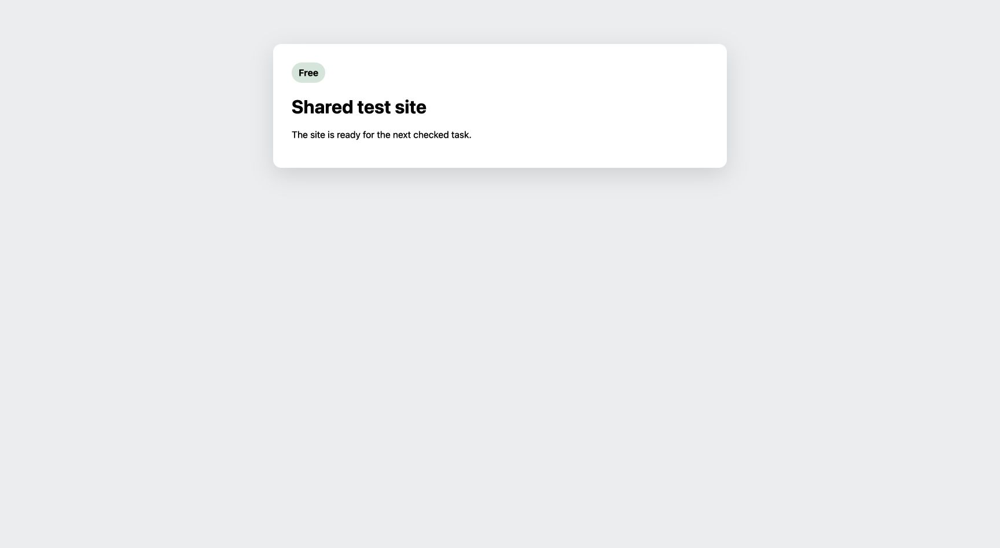

# SAC-182 V20 proof audit

## Result

Partial. Real GitHub records and signed Linear events verify the completed
workflow paths below. Four final app captures were taken too early. Two cases
need a distinct authenticated user and still await owner input. V20 is not a
complete demo or a release approval.

The runner report claimed that all authorized scenarios were demonstrated. This
audit narrows that claim: the final screens for s08-a, s09, s10, and s11 still show
publishing, an earlier failure, or an abandoned intent. D1 completion does not turn
those images into visual proof. The next run must wait for both steps and the
continued outcome before capture.

## Exact subject

- Candidate: `b2596f7e211f20a289e362971e489857f99cd0ea` (PR #137).
- Attempt: `101ba14c-67b0-4044-ad7a-95b76e7f487b`.
- Lease: `b8c0e45df9aff9064e4e70db5a4720db052ed5be585319e3a8b6bc8f4a123655`.
- Disposable fixture: SAC-275 and sample-project PRs #77 and #78.
- Portal version: `c6cb931a-afdf-491d-ab7d-56bc4e8fc84c`.
- BettaView version: `a6747388-3b11-4138-822d-0ea1c2812c7e`.
- Candidate review runtime: `fde102f1-fd33-4e37-828c-5c91d27577b8`.

The app version reads matched the candidate. Each version is treated as serving
100% of traffic, as requested. Provider permissions and credentials were unchanged.
SAC-182 remains on PR #137; no production release or merge occurred.

## Independent checks

The [sanitized readbacks](sac182-v20-facts.json) retain the review, attempt, part,
gate, transition, actor, head, digest, injection, and provider receipt references.
The original private artifacts have SHA-256 entries in that file.

The independent chain check joined all 12 continued reviews to 12 gate
transitions, processed candidate inbox events, and signature-verified root
Linear deliveries. All 18 accepted part references match real GitHub receipts;
17 are unique because a replacement reused a prior reply. No review or reply
marker was duplicated. None of the 34 step attempts was unfinished. The five
non-continued intents caused no checked gate transition.

The checked-in auditor repeats these joins from the saved facts. It also checks
the provider actor, commit, part marker, event order, and selected workflow edge.
Its content checks require the notes, reply, and summary in s03; two inline notes
in s04; no inline notes or replies in s05; and a Comment that replaces the rejected
s06 review before that review starts Linear. A repeated approval does not satisfy
the Comment recovery case:

```sh
rtk proxy python3 scripts/verify_shared_test_review_evidence.py \
  docs/evidence/sac-253/sac182-v20-facts.json \
  --candidate b2596f7e211f20a289e362971e489857f99cd0ea \
  --github-user 233623 --linear-actor f010429f-7734-4f3f-9b4b-13a4abb9b4ab
```

This checks saved receipt consistency and those content rows. It makes no new
live request and does not prove all subcases, screenshots, distinct users,
cleanup, or a completed demo. The tests reject
changed actors, heads, markers, payloads, duplicate or missing transitions, and
unfinished step attempts. They also reject missing content and an invalid s06
replacement.

| Case | Evidence and limit |
| --- | --- |
| s01 | Account policy 1 stayed frozen after same-account rotation to policy 2. A mismatch was rejected. A different Linear user's reconnect remains untested. |
| s02 | Drafts survived reload with no provider effects before publish. The request audit covers the observed document before and after reload. |
| s03 | Request changes published inline content, a reply, and a summary. Exact authenticated replay added no provider write or transition. Review `5361870287`. |
| s04 | Approval with two inline notes reached Merging; the PR stayed unmerged. Review `5361902603`. |
| s05 | Approval had zero inline notes and replies. The app supplies `BettaView review: approve.` for its empty summary. Review `5361917584`; final screen shows both steps done. |
| s06 | A labeled GitHub rejection caused no Linear step. Abandon and Replace produced a Comment and one traversal. Review `5361951084`; final screen checked. |
| s07 | The first lost reply was adopted and continued, with final screen checked. The second real reply was written once; the injected receipt-rate limit left an operator item and no Linear step. |
| s08 | A rejected Linear move retried only that step. A separate real move with its delivery held produced an operator item and no gate transition. The first phase's final image is premature. |
| s09 | Stale-head rejection preserved drafts with no effects. Reload then continued on the new head. The unlinked PR stayed readable and explained that no task can move. The successful final image is premature. |
| s10 | A reply preceded a head change. The original was abandoned with no Linear step. Its replacement reused that reply and continued once. The successful final image is premature. |
| s11 | Forged page identity was rejected before any intent, part, or transition. The active-gate and changed-payload checks retained both digests. Replace then continued once. Its final image is premature; a different authenticated GitHub user remains untested. |
| s12 | Two real unauthorized moves returned to Human Review, each with signed source and return events. Only the later checked Comment caused a traversal. Final screen checked. |

Injected faults affect the outbound test transport and are labeled in the data.
Linear emitted the signed deliveries; these are provider-originated receipts,
not locally signed fake events. The two ambiguous outcomes stay blocked in the
retained candidate store. Cleanup must not rewrite them as successful reviews.

## Visual evidence

Raw app captures remain private. These public images are sanitized crops:

- [Actual SAC-182 task header](https://deos-shared-test-proof.skundu.workers.dev/proof/7eea3ae4-471d-484c-af61-8e6288dd5dcb).
- [Checked-account policy 1](https://deos-shared-test-proof.skundu.workers.dev/proof/d6443ee9-c08c-4ddc-a356-d498bcbc19f9).
- [Checked-account policy 2](https://deos-shared-test-proof.skundu.workers.dev/proof/be2b1d4d-1dc0-42be-b5b0-4a39ad1c7f3e).
- [Approval completion summary](https://deos-shared-test-proof.skundu.workers.dev/proof/82c20411-b86d-439c-acd6-a46fcc4a6426).

The last crop shows the Merging goal and continued footer. Both provider badges
are masked, so the public crop does not prove their appearance. Private source
images provide that view. The public Showboat projection proves checkout only;
the full provider command log is private. Historical fixture-page images and
mocked PR #46 commands are omitted from current proof.

## Cleanup repair

The [original exception](sac182-v20-cleanup-original-error.json) is retained.
Cleanup initially rejected s12's second return because it used the normal
`enter_human_gate` operation while gate entry raced the unauthorized move.
Commit `13e7c52` requires the exact scenario and operation, a completed operation,
one signed and forwarded source with matching provider time, and the exact
signed and forwarded return. It changes no candidate rows. All 141 cleanup tests
pass, including missing, mismatched, ambiguous, and late receipts.

Cleanup finished at `2026-09-30T06:50:12.302Z`. The site returned to Free at
fence 40, revision 3600. All seven owned resource records have provider absence
receipts. All 14 workflow instances were settled. Hash checks succeeded for all
18 retained snapshots, including the database with 131 tables. Six runner
artifacts and 54 captures remain in the private evidence record.

- Failure evidence SHA-256: `cbec04841c308cc8b0e4993759238413c72f826fe95635adb81659b916827218`.
- Settlement SHA-256: `737c37bddb01da0b9cecd4db5297fc788b7e6bc5e43334ffe3f84fbf96d1ec17`.
- Absence SHA-256: `906a9183e0048d212979ac8577c442c1db55cf83b3786a53b8b1e55b049297fd`.



The connected Brave browser also showed Free. Cleanup preserves the partial
outcome and does not grant a demo attestation or production approval.

This proves task 4.9: the exact candidate service and Workflow performed real
linked review publication, signed delivery, gate traversal, and owned cleanup.
The remaining full-demo, final-report, and release-guard tasks remain open.
