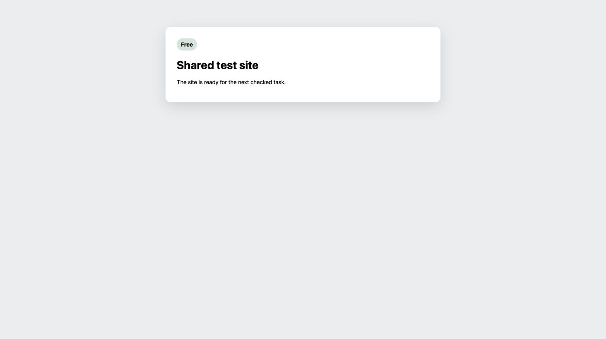

# SAC-182 V21 proof audit

## Result

Blocked. The runner ended at `2026-09-30T09:16:04.015Z`. The site was safely
cleaned and returned to Free. Required subcases remain incomplete, so this
run grants no completed demo attestation or release approval.

V21 uses the same candidate as V20. It has captured a valid final screen for
the Linear-only retry. It has also exposed a misleading success message after
an uncertain GitHub result. A local fix preserves the draft and reports the
uncertainty. Candidate `869264f9b3b25701efc0c64cbd86fdbdbb7e4bd6` contains the UI
fixes. It preserves every file from the preceding candidate plus the fixes;
the pre-squash commit is retained on `codex/sac-182-v22-before-squash`. V21 tested the earlier commit; the new candidate needs fresh live proof.

## Exact subject

- Candidate: `b2596f7e211f20a289e362971e489857f99cd0ea` (PR #137).
- Attempt: `ae5f4a6c-f8ea-471b-b1a2-daf1c7f1ef60`.
- Lease: `d8eafd83d37ba0d5652728fa010b6d0d60154fbe14502f2e6c7699c0ff58808e`.
- Disposable fixture: SAC-276 and sample-project PR #79.
- Portal version: `0a8be289-d5ab-4199-b347-d2d3f92931a4`.
- BettaView version: `2e7564cb-c181-4135-9ec6-22f9856c1773`.
- Candidate review runtime: `0cbac272-8622-4537-b89d-1424d91faa5c`.

Provider permissions and credentials were unchanged. Each returned app version
is treated as serving 100% of traffic, as requested.

## Checked results and limits

| Case | Evidence and limit |
| --- | --- |
| s01 | Connected policy 1 and the labeled identity mismatch rejection were observed. No policy rotation is recorded in V21. The distinct-user case still needs owner input. |
| s02 | One reply survived a reload with no provider effects. The required separate inline draft was not staged. The runner tried clicks; the supported text-selection operation remains available. |
| s03 | Request changes continued once, with one reply and one summary. Exact authenticated replay returned the saved result. It had no inline note, so the full content case is incomplete. Review `5363265424`; both Done badges and the continued footer are visible. |
| s04 | The runner retired this scenario without a review intent. Its baseline screen is not a passed approval case. |
| s05 | Approval continued once with no inline notes or replies and the standard app-generated approval body. Review `5363555141`; final screen verified. |
| s06 | The transcript contains two explicit Approve clicks. The second retried the rejected approval and continued to Merging. There was no abandoned intent or replacement Comment. A later Comment attempt met a closed gate. This does not prove the planned recovery. |
| s07-a | A real reply response was lost. Receipt reconciliation adopted exactly one GitHub reply, `4142564747`, and the flow continued. The final panel is valid, but the old local draft is still visible. |
| s07-b | The real reply was sent once; the labeled receipt-read rate limit left an operator item and no Linear step. A later response showed a false success toast. The UI fix is described below. |
| s08-a | GitHub stayed at generation 1. Linear generation 1 was rejected, then generation 2 succeeded with the same request digest. Exactly one transition is recorded. Review `5363813720`; final screen verified. |
| s08-b | One real Linear mutation succeeded while its signed delivery was held. The app stopped at Host Check Required, retained one operator item, and made no transition. Its final screen offers Reload only. |
| s09 | A Comment continued at head `e90484d`, with one reply and no inline note. The unlinked PR #80 is readable, explains that no task can move, and disables review choices. The final continued screen is missing; stale-head rejection needs transcript and fault checks. |
| s10 | The first fault setup succeeded. Two repeated setup calls failed a uniqueness check. No review was published. Replacement recovery is not proven. |
| s11 | Contradictory page identity was rejected with fault `5bfb5d2b-936c-4660-92b4-86d64d9d1d01` and no intent. The ID-clash, active-lease, replacement, and distinct checked GitHub user cases remain incomplete. |
| s12 | Two real unauthorized moves were restored through succeeded operations and signed return events. The gate stayed open, with no choice or transition. The evidence recorder failed before the final checked human review. |

Counts alone do not prove the replay, replacement, draft persistence, identity,
or visual subcases. Missing checks remain missing until their actual evidence
has been inspected.

## Saved command and receipt evidence

The [Showboat readback](sac182-v21-showboat.md) records live GitHub reads and
preserves the original CLI error before the corrected command. The
[GitHub receipt projection](sac182-v21-github-receipts.json) keeps provider IDs,
actors, head commits, decoded app markers, and source-response hashes.

The [saved D1 and provider facts](sac182-v21-receipt-facts.json) join six
continued reviews to six signed Linear deliveries and gate transitions. The
[partial consistency check](sac182-v21-observed-chain.json) also joined 12
accepted parts to 12 unique provider records. The uncertain s07-b reply is a
thirteenth real GitHub record; its app receipt remained unresolved. No duplicate
review or reply marker was found. This partial audit does not satisfy the full
scenario verifier or fill any missing subcase. The full verifier rejected this
dataset with `ValueError: missing completed publication scenario`.

## Public visual evidence

These are fixed, sanitized crops of real deployed app captures:

- [SAC-182 task header](https://deos-shared-test-proof.skundu.workers.dev/proof/406d990a-0d02-43de-96df-7bc3a70fd21a).
- [Connected account policy 1](https://deos-shared-test-proof.skundu.workers.dev/proof/6d7eacf5-80b1-405f-96e9-46eef20bde63).
- [Request changes completion](https://deos-shared-test-proof.skundu.workers.dev/proof/465d581e-1582-42d8-9069-05a6422bbd72).
- [Approval completion](https://deos-shared-test-proof.skundu.workers.dev/proof/2e7fe92f-f22b-4851-bc37-28433f7ced84).
- [Linear retry completion](https://deos-shared-test-proof.skundu.workers.dev/proof/85f8a441-efc3-428e-9c92-4933c77d9afc).

The public bytes were downloaded and matched their recorded SHA-256 values.
The request-changes and retry crops mask the wrapped Linear state text. Both
Done labels, the In Progress goal, and the continued footer remain visible.
The approval crop masks icons and the word “review”; it retains both Done
labels, Linear Merging, and the continued footer. Original OCR failures are
retained; local OCR checks were not treated as proof of deployed acceptance.

## Repairs requiring a fresh run

The runner's report claims that permitted browser operations cannot select
text. The deployed controller supports `operation:"select"`; V20 used the
same candidate to publish inline notes. V21's recorded attempts used clicks.
The guide now includes the exact selection request and requires inspection
of the composer and staged note before publication.

The report calls the s06 retry automatic. Its transcript records a second
explicit Approve click before Abandon. The guide now explains that selecting
Approve with no staged notes submits immediately. It requires Abandon and
Replace before choosing the corrected review type.

The [saved controller exception](sac182-v21-injection-original-error.json)
shows that s10's repeated injection requests hit the unique armed-fault index.
The original injection already existed. The controller now returns the saved
injection ID and state for an identical request. Consumed or cleared faults
stay spent, and changed parameters return a clear conflict. Focused tests cover
those cases. The correction requires deployment and live readback.

The runner sent full browser HTML into Showboat. A long line then caused
`bufio.Scanner: token too long`, which prevented later commands from running.
The guide now requires full responses in separate files and compact facts plus
their hashes in Showboat. It also explains how to retain a broken log and
continue in a new file. This is an evidence-recorder failure, not a provider
permission failure.

The linked publish endpoint can return a saved `host_check_required` result
without an HTTP error. The client treated that response as confirmed GitHub
publication, cleared the draft, and showed a success message.

The local change checks `continuation.github.complete` before clearing the
draft or announcing success. An unverified result keeps the review ID, reply,
and summary, and shows the safe failure message. A focused browser regression
was added.

The lost-response case also left a recovered note labeled unpublished. The
local fix applies confirmed part receipts only to the matching review and
content IDs. It marks those notes Published, excludes them from the unpublished
count, and retains pending notes. Receipt labels survive reload. A focused
test covers a different review ID, a pending note, a new note, and repeat reads.
The local suite passed 133 tests; its optional automated browser test was
skipped because no executable was configured.

The connected Brave browser separately exercised the changed page against an
explicitly simulated uncertain response. One publish request was recorded;
the summary and draft survived both the response and a reload. This is local
UI evidence, not provider-originated or deployed-candidate proof. A second
local browser check observed one publish request, followed by a simulated
receipt read. The note changed from unpublished to Published and stayed
Published after reload. Both checks are separate from V21's live results.

## Verified cleanup

Cleanup completed at `2026-09-30T09:22:45.274Z`. The site is Free at fence 42,
revision 3863. All seven owned resource records have provider absence receipts.
All 14 workflow instances were settled. Hash and byte checks succeeded for
all 19 retained snapshots, including the database with 131 tables. Six runner
artifacts and 33 proof items remain in the private evidence record.

- Failure evidence SHA-256: `0d4ff38a871edb04469ff0579815044eab4fc6e054c5eb2ff89563c6ebe74839`.
- Settlement SHA-256: `ce05cede1fbeffa007434416c129fbb0e5ef6c084125d3b3f81d539bcd228a01`.
- Absence SHA-256: `e2575153832107aec0ba763ef4f26736199f89d140d071d54da5e234ef92b4cb`.

The connected Brave browser confirmed Free. Cleanup retained the blocked
result. The release guard remains in observe-only mode.
