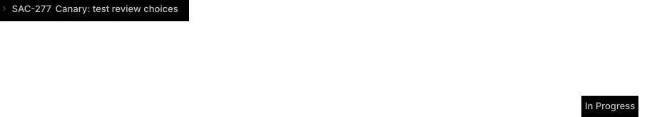

# SAC-182 V22 proof audit

## Result

Blocked at scenario setup. The runner ended at `2026-09-30T10:38:16.905Z`.
This run does not grant a completed demo attestation or release approval.
The app candidate stays unchanged for the next attempt.

## Exact subject

- Candidate: `869264f9b3b25701efc0c64cbd86fdbdbb7e4bd6` (PR #137).
- Attempt: `f29d8201-4065-4807-8dd2-8d95c0cfcc76`.
- Lease: `397987706b20bfa7a2493223352530749a6b0929363a794c71225a4bfb31e9b0`.
- Disposable fixtures: SAC-277 and sample-project PR #81, plus read-only PR #82.
- Portal version: `415a6ebe-9589-4214-9922-716965ea26fc`.
- BettaView version: `3caaedfd-13a8-4540-a0dd-1af5d9d22071`.
- Review runtime version: `f9c1741d-adb0-4e3b-bd12-5be910aa6805`.

Each returned app version is treated as serving 100% of traffic, as requested.
No provider permissions or credentials were changed.

## Checked results and limits

| Case | Observed result |
| --- | --- |
| s01 | Connected policy 1, allocated a run frozen at 1, and reconnected the same identities to policy 2. A labeled identity mismatch was rejected; policy 2 stayed current. The required different Linear user remains unavailable. |
| s02 | Real UI captures show one inline draft and one reply before and after the recorded reload. No app review, lease, or transition was recorded. GitHub stayed at its setup baseline. The browser audit covers each current document, not the whole browsing session. |
| s03 | Request Changes sent one inline note, one reply, and a summary. GitHub review `5364783086` and signed Linear delivery `396ea354-ad32-4c4f-956a-95a807c0249f` led to exactly one edit transition. The final screen shows both steps done and the workflow continued. |
| s03 replay | The recorded authenticated API replay returned HTTP 200, `published:0`, `duplicates:2`, and the saved review ID. Provider response hashes and saved attempt/transition facts stayed unchanged. The exact request file was not collected, so full payload equality cannot be independently rechecked from the retained artifact set. |
| s04 | Approve sent two inline notes and a summary. GitHub review `5364920018` and signed Linear delivery `e8abc86a-aa09-40e1-a191-2ae26674ab7a` led to one approval transition. The final screen shows Merging and both steps done. The PR remained open and unmerged at readback. |
| s05–s12 | No app scenarios ran. The fixture reset for s05 failed, and its pending setup prevented every later prepare. These are missing checks, not passed cases. |

The first s03 completion wait failed on a selector timeout. The runner retained
the error, reloaded without publishing again, and captured the completed state.
The browser error was not evidence of a lost provider session.

## Provider and visual proof

The [Showboat readback](sac182-v22-showboat.md) reads actual GitHub objects.
The [GitHub projection](sac182-v22-github-receipts.json) preserves source hashes,
record IDs, authors, commits, and decoded app markers. The
[D1 and provider facts](sac182-v22-receipt-facts.json) retain two completed
reviews, two signed deliveries, and two gate transitions. No duplicate review
bundle or reply marker was found. Counts do not prove the missing subcases.

The following public images passed the fixed crop, mask, and OCR checks.
Their downloaded bytes matched the recorded hashes:

- [Connected policy 1](https://deos-shared-test-proof.skundu.workers.dev/proof/59c07694-8419-40b4-b122-f22d2a82e67d).
- [Current policy 2](https://deos-shared-test-proof.skundu.workers.dev/proof/2fd24e19-b2c2-428b-895a-5c552f7d9cf3).
- [Request Changes complete](https://deos-shared-test-proof.skundu.workers.dev/proof/3ed727d8-2163-4107-8258-16ffdadf1e11).
- [Approve complete](https://deos-shared-test-proof.skundu.workers.dev/proof/f90430e9-6434-4b89-88dc-596efc30d766).

The provider screenshot above was captured in connected Brave. Its
[sanitizer manifest](sac182-v22-linear-screen-manifest.json) passed. The raw
image, recipe, and manifest were retained privately and read back byte for
byte. A later Merging screenshot failed OCR and stays private. Linear's
activity view can coalesce state changes, so its visible rows are not used
as exact event counts; the signed delivery records supply those facts.

## Original failure and repair

The [original exceptions](sac182-v22-setup-original-errors.json) show a Linear
HTTP 503 during the reset to Human Review at 10:25:41 UTC. The ledger kept that
write uncertain. Retrying the same setup then returned
`provider_test_operation_uncertain`. New scenario IDs hit the unique pending
scenario constraint. The generic Worker 1101 responses had hidden these
separate causes from the runner.

The repair keeps the pending scenario ID and returns a clear conflict when a
caller tries another ID. For a saved uncertain reset, it reads the fixed test
issue first. If the required state is already present, it records that read.
Otherwise it permits at most two separately recorded retries to set Human
Review after rechecking that the prior candidate gate has settled. Running
operations and unknown task states still stop recovery. This path cannot
retry an app review publication. Original uncertain ledger rows stay intact.

The first cleanup request also stopped because s05 had no allocated run ID.
The repaired cleanup compares the full candidate run inventory with all known
allocated scenarios. It can retain an unallocated preparing row only when no
extra candidate run exists. A lost allocation response still blocks cleanup.

Type checking and all 155 focused checks passed. The coordinator deployed at
version `c333fff5-c949-472f-8d5e-35a0a2f13d3d`. All 60 bindings, 30 variable
hashes, and 19 secret names matched before and after deployment.

## Artifact retention limit

Six declared runner files were collected and verified. The full response and
request side files named by the runner were not declared outputs. Their paths
and hashes in Showboat do not retain their contents. The next run's guide now
requires the complete original side files in the collected validation appendix.
The replay response and projected facts above remain useful partial evidence;
this audit does not claim independent exact request verification.

The separate different-user checks still require owner input. Synthetic
identity mismatch evidence cannot substitute for another authenticated user.

## Verified cleanup

Cleanup completed at `2026-09-30T10:47:41.478Z`. The site returned to Free at
fence 44, revision 3987. All seven owned resources have absence receipts.
All four candidate workflows were settled. Four retained snapshots passed
hash and byte checks, including the 131-table app database. Six runner
artifacts and 16 proof items remain in the private failure record.

- Failure evidence: `592fd5fdf8fc80ae47a81a8e1f33178d9794ef0436924ce34048a7de67cd09df`.
- Settlement: `fd8e24934a610b5db557a6c7fe7f12c4bcc551f63662973b5060ff7fcd0f1d9a`.

Connected Brave confirmed the Free state. The blocked result and unfinished
s05 setup remain in the saved evidence. Cleanup grants no release approval.
