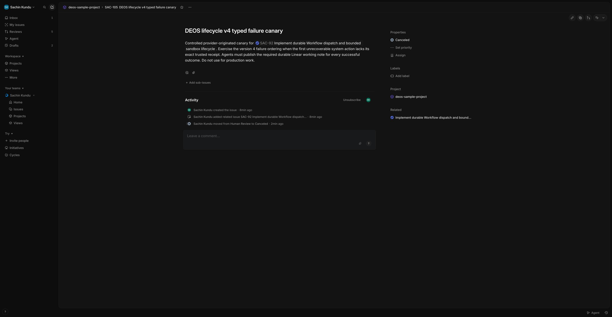
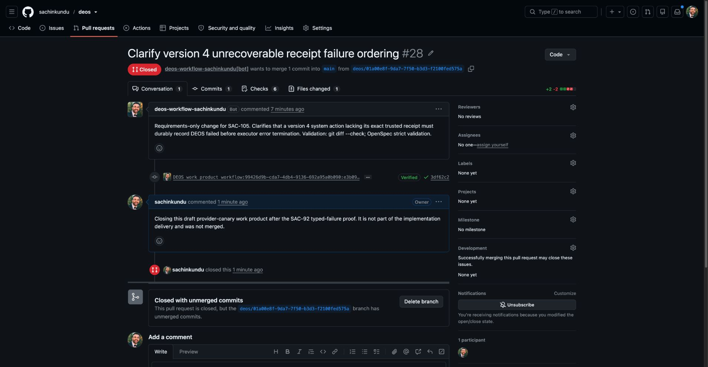

# SAC-92 explicit business lifecycle provider proof

*2026-08-17T06:54:20Z by Showboat 0.6.1*
<!-- showboat-id: a0387d13-9174-4dc3-bf42-7a0fa74f34dd -->

This record separates disabled deployment inspection, schema evidence, provider-originated Linear paths, Cloudflare executor state, and D1 business state. Credentials, raw webhook payloads, issue content, prompts, transcripts, and dependency responses are excluded.

```bash
set -a; source /Users/sachin/code/deos/.env; set +a; export CLOUDFLARE_API_TOKEN="$CLOUDFLARE_TOKEN"; npx wrangler whoami --config wrangler.queue-consumer-ts.jsonc
```

```output

 ⛅️ wrangler 4.123.0
────────────────────
Getting User settings...
👋 You are logged in with an User API Token. Unable to retrieve email for this user. Are you missing the `User->User Details->Read` permission?
ℹ️  The API Token is read from the CLOUDFLARE_API_TOKEN environment variable.
┌──────────────────────────┬──────────────────────────────────┐
│ Account Name             │ Account ID                       │
├──────────────────────────┼──────────────────────────────────┤
│ Skundu@hey.com's Account │ c68856288112af7698f5be52ea94b96e │
└──────────────────────────┴──────────────────────────────────┘
🔓 To see token permissions visit https://dash.cloudflare.com/profile/api-tokens
```

```bash
set -a; source /Users/sachin/code/deos/.env; set +a; export CLOUDFLARE_API_TOKEN="$CLOUDFLARE_TOKEN"; npx wrangler d1 migrations list DB --remote --config wrangler.queue-consumer-ts.jsonc
```

```output

 ⛅️ wrangler 4.123.0
────────────────────
Resource location: remote 

Migrations to be applied:
┌──────────────────────────────────────┐
│ Name                                 │
├──────────────────────────────────────┤
│ 0007_explicit_business_lifecycle.sql │
└──────────────────────────────────────┘
```

```bash
set -a; source /Users/sachin/code/deos/.env; set +a; export CLOUDFLARE_API_TOKEN="$CLOUDFLARE_TOKEN"; npx wrangler d1 execute DB --remote --config wrangler.queue-consumer-ts.jsonc --command "SELECT project_id, definition_version, dispatch_enabled FROM project_workflow_policies; SELECT status, COUNT(*) AS count FROM orchestration_runs GROUP BY status ORDER BY status; PRAGMA foreign_key_check;"
```

```output

 ⛅️ wrangler 4.123.0
────────────────────
Resource location: remote 

🌀 Executing on remote database DB (4e854f8a-018a-42c4-a325-c4b8805c06b2):
🌀 To execute on your local development database, remove the --remote flag from your wrangler command.
🚣 Executed 3 commands in 4.42ms
[
  {
    "results": [
      {
        "project_id": "99426d9b-cda7-4db4-9136-692a95a0b090",
        "definition_version": 3,
        "dispatch_enabled": 0
      }
    ],
    "success": true,
    "meta": {
      "served_by": "v3-prod",
      "served_by_region": "WEUR",
      "served_by_colo": "AMS",
      "served_by_primary": true,
      "timings": {
        "sql_duration_ms": 0.2933
      },
      "duration": 0.2933,
      "changes": 0,
      "last_row_id": 0,
      "changed_db": false,
      "size_after": 536576,
      "rows_read": 1,
      "rows_written": 0,
      "total_attempts": 1
    }
  },
  {
    "results": [
      {
        "status": "active",
        "count": 1
      },
      {
        "status": "blocked",
        "count": 6
      },
      {
        "status": "failed",
        "count": 4
      }
    ],
    "success": true,
    "meta": {
      "served_by": "v3-prod",
      "served_by_region": "WEUR",
      "served_by_colo": "AMS",
      "served_by_primary": true,
      "timings": {
        "sql_duration_ms": 0.4889
      },
      "duration": 0.4889,
      "changes": 0,
      "last_row_id": 0,
      "changed_db": false,
      "size_after": 536576,
      "rows_read": 22,
      "rows_written": 0,
      "total_attempts": 1
    }
  },
  {
    "results": [],
    "success": true,
    "meta": {
      "served_by": "v3-prod",
      "served_by_region": "WEUR",
      "served_by_colo": "AMS",
      "served_by_primary": true,
      "timings": {
        "sql_duration_ms": 3.6405
      },
      "duration": 3.6405,
      "changes": 0,
      "last_row_id": 0,
      "changed_db": false,
      "size_after": 536576,
      "rows_read": 164,
      "rows_written": 0,
      "total_attempts": 1
    }
  }
]
```

```bash
set -a; source /Users/sachin/code/deos/.env; set +a; export CLOUDFLARE_API_TOKEN="$CLOUDFLARE_TOKEN"; npx wrangler d1 export DB --remote --config wrangler.queue-consumer-ts.jsonc --output /tmp/deos-sac92-pre-0007-20260817.sql; stat -f "backup-bytes=%z" /tmp/deos-sac92-pre-0007-20260817.sql
```

```output

 ⛅️ wrangler 4.123.0
────────────────────
Resource location: remote 

? ⚠️ This process may take some time, during which your D1 database will be unavailable to serve queries.
  Ok to proceed?
🤖 Using fallback value in non-interactive context: yes
🌀 Executing on remote database DB (4e854f8a-018a-42c4-a325-c4b8805c06b2):
├ Creating export
│
You can also download your export from a temporary signed URL. [redacted]
├ Downloading SQL to /tmp/deos-sac92-pre-0007-20260817.sql
│
🌀 Downloaded to /tmp/deos-sac92-pre-0007-20260817.sql successfully!
backup-bytes=289082
```

The disabled baseline contains one non-final historical run. Inspect it before enabling scheduled completion reconciliation so the deployment does not surprise the operator.

```bash
set -a; source /Users/sachin/code/deos/.env; set +a; export CLOUDFLARE_API_TOKEN="$CLOUDFLARE_TOKEN"; npx wrangler d1 execute DB --remote --config wrangler.queue-consumer-ts.jsonc --command "SELECT run_id, issue_id, workflow_instance_id, current_node, status, definition_version FROM orchestration_runs WHERE status IN (\"pending_dispatch\",\"active\",\"awaiting_human\",\"awaiting_capability\",\"manual_reconciliation_required\") ORDER BY updated_at;"
```

```output

 ⛅️ wrangler 4.123.0
────────────────────
Resource location: remote 

🌀 Executing on remote database DB (4e854f8a-018a-42c4-a325-c4b8805c06b2):
🌀 To execute on your local development database, remove the --remote flag from your wrangler command.
🚣 Executed 1 command in 1.00ms
[
  {
    "results": [
      {
        "run_id": "workflow:99426d9b-cda7-4db4-9136-692a95a0b090:fbb2c3e5-e993-4a29-8fbe-0998b27305f5:run:8",
        "issue_id": "fbb2c3e5-e993-4a29-8fbe-0998b27305f5",
        "workflow_instance_id": "wf-v1-onhwchev2csei4y2rwvb4v627rh5wmnp62lwbx5wumxviyha3o2a",
        "current_node": "requirements_approval",
        "status": "active",
        "definition_version": 2
      }
    ],
    "success": true,
    "meta": {
      "served_by": "v3-prod",
      "served_by_region": "WEUR",
      "served_by_colo": "AMS",
      "served_by_primary": true,
      "timings": {
        "sql_duration_ms": 0.9958
      },
      "duration": 0.9958,
      "changes": 0,
      "last_row_id": 0,
      "changed_db": false,
      "size_after": 536576,
      "rows_read": 12,
      "rows_written": 0,
      "total_attempts": 1
    }
  }
]
```

```bash
set -a; source /Users/sachin/code/deos/.env; set +a; export CLOUDFLARE_API_TOKEN="$CLOUDFLARE_TOKEN"; npx wrangler workflows instances describe deos-sandbox-codex-workflow wf-v1-onhwchev2csei4y2rwvb4v627rh5wmnp62lwbx5wumxviyha3o2a --config wrangler.queue-consumer-ts.jsonc
```

```output

 ⛅️ wrangler 4.123.0
────────────────────
Describing latest instance:
Workflow Name:         deos-sandbox-codex-workflow
Instance Id:           wf-v1-onhwchev2csei4y2rwvb4v627rh5wmnp62lwbx5wumxviyha3o2a
Version Id:            9932fe56-2b0c-40c9-9613-ab01ff1b594c
Status:                ❌ Errored
Trigger:               🔗 Binding
Queued:                8/16/2026, 11:27:37 AM
Success:               ❌ No
Start:                 8/16/2026, 11:27:38 AM
End:                   8/16/2026, 11:34:56 AM
Duration:              7 minutes
Last Successful Step:  enter-gate:requirements_approval-1
Error:                 Error: Workflow event timeout is invalid
Steps:

  Name:      authority:workflow:99426d9b-cda7-4db4-9136-692a95a0b090:fbb2c3e5-e993-4a29-8fbe-0998b27305f5:run:8-1
  Type:      🎯 Step
  Start:     8/16/2026, 11:27:38 AM
  End:       8/16/2026, 11:27:38 AM
  Duration:  0 seconds
  Success:   ✅ Yes
  Output:    "{\"run_id\":\"workflow:99426d9b-cda7-4db4-9136-692a95a0b090:fbb2c3e5-e993-4a29-8fbe-0998b27305f5:run:8\",\"correlation_id\":\"workflow:99426d9b-cda7-4db4-9136-692a95a0b090:fbb2c3e5-e993-4a29-8fbe-0998b27305f5\",\"run_sequence\":8,\"project_id\":\"99426d9b-cda7-4db4-9136-692a95a0b090\",\"issue_id\":\"fbb2c3e5-e993-4a29-8fbe-0998b27305f5\",\"definition_id\":\"openspec-delivery\",\"definition_version\":2,\"definition_digest\":\"92fa265d1a98376f152b0325f9daa3d93c4eda947befa5948f724507918bb202\",\"workflow_instance_id\":\"wf-v1-onhwchev2csei4y2rwvb4v627rh5wmnp62lwbx5wumxviyha3o2a\",\"previous_node\":null,\"current_node\":\"requirements\",\"gate_origin_node\":null,\"status\":\"active\",\"accumulated_data_json\":\"{}\",\"created_at\":\"2026-08-16T08:27:34.647Z\",\"updated_at\":\"2026-08-16T08:27:34.647Z\",\"terminal_at\":null}"
┌────────────────────────┬────────────────────────┬───────────┬────────────┐
│ Start                  │ End                    │ Duration  │ State      │
├────────────────────────┼────────────────────────┼───────────┼────────────┤
│ 8/16/2026, 11:27:38 AM │ 8/16/2026, 11:27:38 AM │ 0 seconds │ ✅ Success │
└────────────────────────┴────────────────────────┴───────────┴────────────┘

  Name:      agent:requirements-1
  Type:      🎯 Step
  Start:     8/16/2026, 11:27:38 AM
  End:       8/16/2026, 11:27:45 AM
  Duration:  7 seconds
  Success:   ✅ Yes
  Output:    "{\"state\":\"running\",\"attemptId\":\"01a009ae-ff62-7772-87ff-0f4f60c1bb0d\",\"sandboxId\":\"sbx-v1-bxzrcbd35mvfy7usfhpmbr3drjic3uskunik6esvtcxhhw5uvcja\"}"
┌────────────────────────┬────────────────────────┬───────────┬────────────┐
│ Start                  │ End                    │ Duration  │ State      │
├────────────────────────┼────────────────────────┼───────────┼────────────┤
│ 8/16/2026, 11:27:38 AM │ 8/16/2026, 11:27:45 AM │ 7 seconds │ ✅ Success │
└────────────────────────┴────────────────────────┴───────────┴────────────┘

  Name:      agent-event:01a009ae-ff62-7772-87ff-0f4f60c1bb0d-1
  Type:      👀 Waiting for event
  Start:     8/16/2026, 11:27:45 AM
  End:       8/16/2026, 11:28:58 AM
  Duration:  1 minute
  Output:    "{\"deliveryId\":\"04278d91-a474-4b36-b3fa-b9418d1fd480\"}"

  Name:      authority:workflow:99426d9b-cda7-4db4-9136-692a95a0b090:fbb2c3e5-e993-4a29-8fbe-0998b27305f5:run:8-2
  Type:      🎯 Step
  Start:     8/16/2026, 11:28:58 AM
  End:       8/16/2026, 11:28:59 AM
  Duration:  0 seconds
  Success:   ✅ Yes
  Output:    "{\"run_id\":\"workflow:99426d9b-cda7-4db4-9136-692a95a0b090:fbb2c3e5-e993-4a29-8fbe-0998b27305f5:run:8\",\"correlation_id\":\"workflow:99426d9b-cda7-4db4-9136-692a95a0b090:fbb2c3e5-e993-4a29-8fbe-0998b27305f5\",\"run_sequence\":8,\"project_id\":\"99426d9b-cda7-4db4-9136-692a95a0b090\",\"issue_id\":\"fbb2c3e5-e993-4a29-8fbe-0998b27305f5\",\"definition_id\":\"openspec-delivery\",\"definition_version\":2,\"definition_digest\":\"92fa265d1a98376f152b0325f9daa3d93c4eda947befa5948f724507918bb202\",\"workflow_instance_id\":\"wf-v1-onhwchev2csei4y2rwvb4v627rh5wmnp62lwbx5wumxviyha3o2a\",\"previous_node\":null,\"current_node\":\"requirements\",\"gate_origin_node\":null,\"status\":\"active\",\"accumulated_data_json\":\"{}\",\"created_at\":\"2026-08-16T08:27:34.647Z\",\"updated_at\":\"2026-08-16T08:27:34.647Z\",\"terminal_at\":null}"
┌────────────────────────┬────────────────────────┬───────────┬────────────┐
│ Start                  │ End                    │ Duration  │ State      │
├────────────────────────┼────────────────────────┼───────────┼────────────┤
│ 8/16/2026, 11:28:58 AM │ 8/16/2026, 11:28:59 AM │ 0 seconds │ ✅ Success │
└────────────────────────┴────────────────────────┴───────────┴────────────┘

  Name:      agent:requirements-2
  Type:      🎯 Step
  Start:     8/16/2026, 11:28:59 AM
  End:       8/16/2026, 11:28:59 AM
  Duration:  1 second
  Success:   ✅ Yes
  Output:    "{\"state\":\"running\",\"attemptId\":\"01a009ae-ff62-7772-87ff-0f4f60c1bb0d\",\"sandboxId\":\"sbx-v1-bxzrcbd35mvfy7usfhpmbr3drjic3uskunik6esvtcxhhw5uvcja\"}"
┌────────────────────────┬────────────────────────┬──────────┬────────────┐
│ Start                  │ End                    │ Duration │ State      │
├────────────────────────┼────────────────────────┼──────────┼────────────┤
│ 8/16/2026, 11:28:59 AM │ 8/16/2026, 11:28:59 AM │ 1 second │ ✅ Success │
└────────────────────────┴────────────────────────┴──────────┴────────────┘

  Name:      agent-event:01a009ae-ff62-7772-87ff-0f4f60c1bb0d-2
  Type:      👀 Waiting for event
  Start:     8/16/2026, 11:28:59 AM
  End:       8/16/2026, 11:30:46 AM
  Duration:  2 minutes
  Output:    "{\"deliveryId\":\"8d013da8-f5db-4297-9a7f-9b9bea1744d4\"}"

  Name:      authority:workflow:99426d9b-cda7-4db4-9136-692a95a0b090:fbb2c3e5-e993-4a29-8fbe-0998b27305f5:run:8-3
  Type:      🎯 Step
  Start:     8/16/2026, 11:30:46 AM
  End:       8/16/2026, 11:30:47 AM
  Duration:  0 seconds
  Success:   ✅ Yes
  Output:    "{\"run_id\":\"workflow:99426d9b-cda7-4db4-9136-692a95a0b090:fbb2c3e5-e993-4a29-8fbe-0998b27305f5:run:8\",\"correlation_id\":\"workflow:99426d9b-cda7-4db4-9136-692a95a0b090:fbb2c3e5-e993-4a29-8fbe-0998b27305f5\",\"run_sequence\":8,\"project_id\":\"99426d9b-cda7-4db4-9136-692a95a0b090\",\"issue_id\":\"fbb2c3e5-e993-4a29-8fbe-0998b27305f5\",\"definition_id\":\"openspec-delivery\",\"definition_version\":2,\"definition_digest\":\"92fa265d1a98376f152b0325f9daa3d93c4eda947befa5948f724507918bb202\",\"workflow_instance_id\":\"wf-v1-onhwchev2csei4y2rwvb4v627rh5wmnp62lwbx5wumxviyha3o2a\",\"previous_node\":null,\"current_node\":\"requirements\",\"gate_origin_node\":null,\"status\":\"active\",\"accumulated_data_json\":\"{}\",\"created_at\":\"2026-08-16T08:27:34.647Z\",\"updated_at\":\"2026-08-16T08:28:59.650Z\",\"terminal_at\":null}"
┌────────────────────────┬────────────────────────┬───────────┬────────────┐
│ Start                  │ End                    │ Duration  │ State      │
├────────────────────────┼────────────────────────┼───────────┼────────────┤
│ 8/16/2026, 11:30:46 AM │ 8/16/2026, 11:30:47 AM │ 0 seconds │ ✅ Success │
└────────────────────────┴────────────────────────┴───────────┴────────────┘

  Name:      agent:requirements-3
  Type:      🎯 Step
  Start:     8/16/2026, 11:30:47 AM
  End:       8/16/2026, 11:30:57 AM
  Duration:  10 seconds
  Success:   ✅ Yes
  Output:    "{\"state\":\"completed\",\"attemptId\":\"01a009ae-ff62-7772-87ff-0f4f60c1bb0d\",\"sandboxId\":\"sbx-v1-bxzrcbd35mvfy7usfhpmbr3drjic3uskunik6esvtcxhhw5uvcja\",\"manifestId\":\"manifest:01a009ae-ff62-7772-87ff-0f4f60c1bb0d\",\"outcome\":{\"kind\":\"agent\",\"outcome\":\"completed\",\"providerReceiptsComplete\":true}}"
┌────────────────────────┬────────────────────────┬────────────┬────────────┐
│ Start                  │ End                    │ Duration   │ State      │
├────────────────────────┼────────────────────────┼────────────┼────────────┤
│ 8/16/2026, 11:30:47 AM │ 8/16/2026, 11:30:57 AM │ 10 seconds │ ✅ Success │
└────────────────────────┴────────────────────────┴────────────┴────────────┘

  Name:      transition:requirements:completed-1
  Type:      🎯 Step
  Start:     8/16/2026, 11:30:57 AM
  End:       8/16/2026, 11:30:57 AM
  Duration:  0 seconds
  Success:   ✅ Yes
  Output:    "{\"transitioned\":true}"
┌────────────────────────┬────────────────────────┬───────────┬────────────┐
│ Start                  │ End                    │ Duration  │ State      │
├────────────────────────┼────────────────────────┼───────────┼────────────┤
│ 8/16/2026, 11:30:57 AM │ 8/16/2026, 11:30:57 AM │ 0 seconds │ ✅ Success │
└────────────────────────┴────────────────────────┴───────────┴────────────┘

  Name:      authority:workflow:99426d9b-cda7-4db4-9136-692a95a0b090:fbb2c3e5-e993-4a29-8fbe-0998b27305f5:run:8-4
  Type:      🎯 Step
  Start:     8/16/2026, 11:30:57 AM
  End:       8/16/2026, 11:30:57 AM
  Duration:  0 seconds
  Success:   ✅ Yes
  Output:    "{\"run_id\":\"workflow:99426d9b-cda7-4db4-9136-692a95a0b090:fbb2c3e5-e993-4a29-8fbe-0998b27305f5:run:8\",\"correlation_id\":\"workflow:99426d9b-cda7-4db4-9136-692a95a0b090:fbb2c3e5-e993-4a29-8fbe-0998b27305f5\",\"run_sequence\":8,\"project_id\":\"99426d9b-cda7-4db4-9136-692a95a0b090\",\"issue_id\":\"fbb2c3e5-e993-4a29-8fbe-0998b27305f5\",\"definition_id\":\"openspec-delivery\",\"definition_version\":2,\"definition_digest\":\"92fa265d1a98376f152b0325f9daa3d93c4eda947befa5948f724507918bb202\",\"workflow_instance_id\":\"wf-v1-onhwchev2csei4y2rwvb4v627rh5wmnp62lwbx5wumxviyha3o2a\",\"previous_node\":\"requirements\",\"current_node\":\"requirements_review\",\"gate_origin_node\":null,\"status\":\"active\",\"accumulated_data_json\":\"{}\",\"created_at\":\"2026-08-16T08:27:34.647Z\",\"updated_at\":\"2026-08-16T08:30:57.549Z\",\"terminal_at\":null}"
┌────────────────────────┬────────────────────────┬───────────┬────────────┐
│ Start                  │ End                    │ Duration  │ State      │
├────────────────────────┼────────────────────────┼───────────┼────────────┤
│ 8/16/2026, 11:30:57 AM │ 8/16/2026, 11:30:57 AM │ 0 seconds │ ✅ Success │
└────────────────────────┴────────────────────────┴───────────┴────────────┘

  Name:      agent:requirements_review-1
  Type:      🎯 Step
  Start:     8/16/2026, 11:30:57 AM
  End:       8/16/2026, 11:31:15 AM
  Duration:  17 seconds
  Success:   ✅ Yes
  Output:    "{\"state\":\"running\",\"attemptId\":\"01a009b2-0a57-7ded-a434-bf044b2f4d7a\",\"sandboxId\":\"sbx-v1-fy7synrpwggwt5gjtrr7vigtpzm2f6qspozq57trocqhlfa7kymq\"}"
┌────────────────────────┬────────────────────────┬────────────┬────────────┐
│ Start                  │ End                    │ Duration   │ State      │
├────────────────────────┼────────────────────────┼────────────┼────────────┤
│ 8/16/2026, 11:30:57 AM │ 8/16/2026, 11:31:15 AM │ 17 seconds │ ✅ Success │
└────────────────────────┴────────────────────────┴────────────┴────────────┘

  Name:      agent-event:01a009b2-0a57-7ded-a434-bf044b2f4d7a-1
  Type:      👀 Waiting for event
  Start:     8/16/2026, 11:31:15 AM
  End:       8/16/2026, 11:34:38 AM
  Duration:  3 minutes
  Output:    "{\"deliveryId\":\"f2228450-3009-4ba0-ba24-3729385bd3dd\"}"

  Name:      authority:workflow:99426d9b-cda7-4db4-9136-692a95a0b090:fbb2c3e5-e993-4a29-8fbe-0998b27305f5:run:8-5
  Type:      🎯 Step
  Start:     8/16/2026, 11:34:38 AM
  End:       8/16/2026, 11:34:38 AM
  Duration:  0 seconds
  Success:   ✅ Yes
  Output:    "{\"run_id\":\"workflow:99426d9b-cda7-4db4-9136-692a95a0b090:fbb2c3e5-e993-4a29-8fbe-0998b27305f5:run:8\",\"correlation_id\":\"workflow:99426d9b-cda7-4db4-9136-692a95a0b090:fbb2c3e5-e993-4a29-8fbe-0998b27305f5\",\"run_sequence\":8,\"project_id\":\"99426d9b-cda7-4db4-9136-692a95a0b090\",\"issue_id\":\"fbb2c3e5-e993-4a29-8fbe-0998b27305f5\",\"definition_id\":\"openspec-delivery\",\"definition_version\":2,\"definition_digest\":\"92fa265d1a98376f152b0325f9daa3d93c4eda947befa5948f724507918bb202\",\"workflow_instance_id\":\"wf-v1-onhwchev2csei4y2rwvb4v627rh5wmnp62lwbx5wumxviyha3o2a\",\"previous_node\":\"requirements\",\"current_node\":\"requirements_review\",\"gate_origin_node\":null,\"status\":\"active\",\"accumulated_data_json\":\"{}\",\"created_at\":\"2026-08-16T08:27:34.647Z\",\"updated_at\":\"2026-08-16T08:30:57.549Z\",\"terminal_at\":null}"
┌────────────────────────┬────────────────────────┬───────────┬────────────┐
│ Start                  │ End                    │ Duration  │ State      │
├────────────────────────┼────────────────────────┼───────────┼────────────┤
│ 8/16/2026, 11:34:38 AM │ 8/16/2026, 11:34:38 AM │ 0 seconds │ ✅ Success │
└────────────────────────┴────────────────────────┴───────────┴────────────┘

  Name:      agent:requirements_review-2
  Type:      🎯 Step
  Start:     8/16/2026, 11:34:38 AM
  End:       8/16/2026, 11:34:54 AM
  Duration:  16 seconds
  Success:   ✅ Yes
  Output:    "{\"state\":\"completed\",\"attemptId\":\"01a009b2-0a57-7ded-a434-bf044b2f4d7a\",\"sandboxId\":\"sbx-v1-fy7synrpwggwt5gjtrr7vigtpzm2f6qspozq57trocqhlfa7kymq\",\"manifestId\":\"manifest:01a009b2-0a57-7ded-a434-bf044b2f4d7a\",\"outcome\":{\"kind\":\"agent\",\"outcome\":\"approved\",\"providerReceiptsComplete\":true}}"
┌────────────────────────┬────────────────────────┬────────────┬────────────┐
│ Start                  │ End                    │ Duration   │ State      │
├────────────────────────┼────────────────────────┼────────────┼────────────┤
│ 8/16/2026, 11:34:38 AM │ 8/16/2026, 11:34:54 AM │ 16 seconds │ ✅ Success │
└────────────────────────┴────────────────────────┴────────────┴────────────┘

  Name:      transition:requirements_review:approved-1
  Type:      🎯 Step
  Start:     8/16/2026, 11:34:54 AM
  End:       8/16/2026, 11:34:54 AM
  Duration:  0 seconds
  Success:   ✅ Yes
  Output:    "{\"transitioned\":true}"
┌────────────────────────┬────────────────────────┬───────────┬────────────┐
│ Start                  │ End                    │ Duration  │ State      │
├────────────────────────┼────────────────────────┼───────────┼────────────┤
│ 8/16/2026, 11:34:54 AM │ 8/16/2026, 11:34:54 AM │ 0 seconds │ ✅ Success │
└────────────────────────┴────────────────────────┴───────────┴────────────┘

  Name:      authority:workflow:99426d9b-cda7-4db4-9136-692a95a0b090:fbb2c3e5-e993-4a29-8fbe-0998b27305f5:run:8-6
  Type:      🎯 Step
  Start:     8/16/2026, 11:34:54 AM
  End:       8/16/2026, 11:34:54 AM
  Duration:  0 seconds
  Success:   ✅ Yes
  Output:    "{\"run_id\":\"workflow:99426d9b-cda7-4db4-9136-692a95a0b090:fbb2c3e5-e993-4a29-8fbe-0998b27305f5:run:8\",\"correlation_id\":\"workflow:99426d9b-cda7-4db4-9136-692a95a0b090:fbb2c3e5-e993-4a29-8fbe-0998b27305f5\",\"run_sequence\":8,\"project_id\":\"99426d9b-cda7-4db4-9136-692a95a0b090\",\"issue_id\":\"fbb2c3e5-e993-4a29-8fbe-0998b27305f5\",\"definition_id\":\"openspec-delivery\",\"definition_version\":2,\"definition_digest\":\"92fa265d1a98376f152b0325f9daa3d93c4eda947befa5948f724507918bb202\",\"workflow_instance_id\":\"wf-v1-onhwchev2csei4y2rwvb4v627rh5wmnp62lwbx5wumxviyha3o2a\",\"previous_node\":\"requirements_review\",\"current_node\":\"requirements_approval\",\"gate_origin_node\":\"requirements_review\",\"status\":\"active\",\"accumulated_data_json\":\"{}\",\"created_at\":\"2026-08-16T08:27:34.647Z\",\"updated_at\":\"2026-08-16T08:34:54.560Z\",\"terminal_at\":null}"
┌────────────────────────┬────────────────────────┬───────────┬────────────┐
│ Start                  │ End                    │ Duration  │ State      │
├────────────────────────┼────────────────────────┼───────────┼────────────┤
│ 8/16/2026, 11:34:54 AM │ 8/16/2026, 11:34:54 AM │ 0 seconds │ ✅ Success │
└────────────────────────┴────────────────────────┴───────────┴────────────┘

  Name:      enter-gate:requirements_approval-1
  Type:      🎯 Step
  Start:     8/16/2026, 11:34:54 AM
  End:       8/16/2026, 11:34:56 AM
  Duration:  1 second
  Success:   ✅ Yes
  Output:    "{\"providerOperationId\":\"workflow:99426d9b-cda7-4db4-9136-692a95a0b090:fbb2c3e5-e993-4a29-8fbe-0998b27305f5:run:8:requirements_approval:linear-enter-human-gate:1\",\"state\":\"awaiting_delivery\"}"
┌────────────────────────┬────────────────────────┬──────────┬────────────┐
│ Start                  │ End                    │ Duration │ State      │
├────────────────────────┼────────────────────────┼──────────┼────────────┤
│ 8/16/2026, 11:34:54 AM │ 8/16/2026, 11:34:56 AM │ 1 second │ ✅ Success │
└────────────────────────┴────────────────────────┴──────────┴────────────┘
```

With dispatch confirmed disabled and a local D1 export present, apply only migration 0007 and deploy the version 4 runtime using the existing protected secret store.

```bash
set -a; source /Users/sachin/code/deos/.env; set +a; export CLOUDFLARE_API_TOKEN="$CLOUDFLARE_TOKEN"; npx wrangler d1 migrations apply DB --remote --config wrangler.queue-consumer-ts.jsonc
```

```output

 ⛅️ wrangler 4.123.0
────────────────────
Resource location: remote 

Migrations to be applied:
┌──────────────────────────────────────┐
│ name                                 │
├──────────────────────────────────────┤
│ 0007_explicit_business_lifecycle.sql │
└──────────────────────────────────────┘
? About to apply 1 migration(s)
Your database may not be available to serve requests during the migration, continue?
🤖 Using fallback value in non-interactive context: yes
🌀 Executing on remote database DB (4e854f8a-018a-42c4-a325-c4b8805c06b2):
🌀 To execute on your local development database, remove the --remote flag from your wrangler command.
🚣 Executed 16 commands in 6.69ms
┌──────────────────────────────────────┬────────┐
│ name                                 │ status │
├──────────────────────────────────────┼────────┤
│ 0007_explicit_business_lifecycle.sql │ ✅     │
└──────────────────────────────────────┴────────┘
```

```bash
set -a; source /Users/sachin/code/deos/.env; set +a; export CLOUDFLARE_API_TOKEN="$CLOUDFLARE_TOKEN"; npx wrangler deploy --config wrangler.queue-consumer-ts.jsonc --containers-rollout gradual
```

```output

 ⛅️ wrangler 4.123.0
────────────────────
Total Upload: 1051.27 KiB / gzip: 220.00 KiB
Worker Startup Time: 12 ms
Your Worker has access to the following bindings:
Binding                                                                              Resource                  
env.Sandbox (Sandbox)                                                                Durable Object            
env.ORCHESTRATION_WORKFLOW (DeosWorkflow)                                            Workflow                  
env.DB (deos-sample-project)                                                         D1 Database               
env.ARTIFACTS (deos-sample-project-artifacts)                                        R2 Bucket                 
env.LINEAR_API_URL ("https://api.linear.app/graphql")                                Environment Variable      
env.LINEAR_HUMAN_APPROVAL_STATE_ID ("71738607-03fd-49f2-b4be-b2aac29ccd13")          Environment Variable      
env.LINEAR_PROJECT_ID ("99426d9b-cda7-4db4-9136-692a95a0b090")                       Environment Variable      
env.LINEAR_START_STATE_NAME ("In Progress")                                          Environment Variable      
env.LINEAR_APPROVAL_STATE_NAMES ("In Progress")                                      Environment Variable      
env.LINEAR_REJECTION_STATE_NAMES ("Canceled")                                        Environment Variable      
env.LINEAR_APP_ACTOR_ID ("f010429f-7734-4f3f-9b4b-13a4abb9b4ab")                     Environment Variable      
env.LINEAR_TEAM_ID ("ac53207d-68c0-42f1-a245-c1baf047f234")                          Environment Variable      
env.GITHUB_API_URL ("https://api.github.com")                                        Environment Variable      
env.TRIAL_REPOSITORY ("sachinkundu/deos")                                            Environment Variable      
env.TRIAL_DISPATCH_ENABLED ("false")                                                 Environment Variable      
env.CODEX_AUTH_PROFILE_ID ("controlled-trial")                                       Environment Variable      
env.CAPABILITY_BASE_URL ("https://deos-queue-consumer-ts.skundu...")                 Environment Variable      

The following containers are available:
- deos-queue-consumer-ts-sandbox (/Users/sachin/code/deos-worktrees/sac-92-lifecycle-implementation/Dockerfile)

Uploaded deos-queue-consumer-ts (6.04 sec)
Building image deos-queue-consumer-ts-sandbox:8d5b125b
#0 building with "colima" instance using docker driver

#1 [internal] load build definition from Dockerfile
#1 transferring dockerfile: 650B done
#1 DONE 0.0s

#2 [internal] load metadata for docker.io/cloudflare/sandbox:0.13.0-next.738.2@sha256:f4b2137219568aa44539ab93c0e774db6bcab323c134c5088447916e58f15e75
#2 DONE 0.0s

#3 [internal] load .dockerignore
#3 transferring context: 2B done
#3 DONE 0.0s

#4 [1/7] FROM docker.io/cloudflare/sandbox:0.13.0-next.738.2@sha256:f4b2137219568aa44539ab93c0e774db6bcab323c134c5088447916e58f15e75
#4 resolve docker.io/cloudflare/sandbox:0.13.0-next.738.2@sha256:f4b2137219568aa44539ab93c0e774db6bcab323c134c5088447916e58f15e75 done
#4 DONE 0.0s

#5 [internal] load build context
#5 transferring context: 157B done
#5 DONE 0.0s

#6 [3/7] RUN mkdir -p /deos/bin /deos/staging /deos/jobs /deos/auth     && chmod 700 /deos/auth     && chmod 755 /deos/bin /deos/staging /deos/jobs
#6 CACHED

#7 [5/7] COPY container/deos-github /usr/local/bin/deos-github
#7 CACHED

#8 [6/7] COPY container/deos-linear /usr/local/bin/deos-linear
#8 CACHED

#9 [4/7] COPY container/supervisor.mjs /deos/bin/supervisor.mjs
#9 CACHED

#10 [2/7] RUN npm install --global --omit=dev @openai/codex@0.147.0
#10 CACHED

#11 [7/7] RUN chmod 755 /deos/bin/supervisor.mjs /usr/local/bin/deos-github /usr/local/bin/deos-linear     && codex --version
#11 CACHED

#12 exporting to image
#12 exporting layers done
#12 exporting manifest sha256:cbb4fbb4050a3ed2fec6ea879abe6336f3f690e1be96d43b059077c74df62c20 done
#12 exporting config sha256:03b2960f06920d9e77b2f408d24bcb10d425c23ffdc77af0bca80ae025a0f103 done
#12 naming to docker.io/library/deos-queue-consumer-ts-sandbox:8d5b125b done
#12 DONE 0.0s

WARNING! Your credentials are stored unencrypted in '/Users/sachin/.docker/config.json'.
Configure a credential helper to remove this warning. See
https://docs.docker.com/go/credential-store/

Login Succeeded
Image already exists remotely, skipping push
Untagged: deos-queue-consumer-ts-sandbox:8d5b125b

✘ [ERROR] A request to the Cloudflare API (/accounts/c68856288112af7698f5be52ea94b96e/workers/scripts/deos-queue-consumer-ts/versions/8d5b125b-be35-49ec-988c-d69f8d1ce4e6) failed.

  An unknown error has occurred. If this error persists, please file a report in workers-sdk (https://github.com/cloudflare/workers-sdk/issues) or reach out to your account team. [code: 10013]
  
  If you think this is a bug, please open an issue at: https://github.com/cloudflare/workers-sdk/issues/new/choose


🪵  Logs were written to "/Users/sachin/Library/Preferences/.wrangler/logs/wrangler-2026-08-17_06-55-49_361.log"
```

The first version upload reached Cloudflare after the image build but returned API code 10013. Dispatch remained disabled and the prior Worker version stayed active; retry the identical deployment before proceeding.

```bash
set -a; source /Users/sachin/code/deos/.env; set +a; export CLOUDFLARE_API_TOKEN="$CLOUDFLARE_TOKEN"; npx wrangler deploy --config wrangler.queue-consumer-ts.jsonc --containers-rollout gradual
```

```output

 ⛅️ wrangler 4.123.0
────────────────────
Total Upload: 1051.27 KiB / gzip: 220.00 KiB
Worker Startup Time: 10 ms
Your Worker has access to the following bindings:
Binding                                                                              Resource                  
env.Sandbox (Sandbox)                                                                Durable Object            
env.ORCHESTRATION_WORKFLOW (DeosWorkflow)                                            Workflow                  
env.DB (deos-sample-project)                                                         D1 Database               
env.ARTIFACTS (deos-sample-project-artifacts)                                        R2 Bucket                 
env.LINEAR_API_URL ("https://api.linear.app/graphql")                                Environment Variable      
env.LINEAR_HUMAN_APPROVAL_STATE_ID ("71738607-03fd-49f2-b4be-b2aac29ccd13")          Environment Variable      
env.LINEAR_PROJECT_ID ("99426d9b-cda7-4db4-9136-692a95a0b090")                       Environment Variable      
env.LINEAR_START_STATE_NAME ("In Progress")                                          Environment Variable      
env.LINEAR_APPROVAL_STATE_NAMES ("In Progress")                                      Environment Variable      
env.LINEAR_REJECTION_STATE_NAMES ("Canceled")                                        Environment Variable      
env.LINEAR_APP_ACTOR_ID ("f010429f-7734-4f3f-9b4b-13a4abb9b4ab")                     Environment Variable      
env.LINEAR_TEAM_ID ("ac53207d-68c0-42f1-a245-c1baf047f234")                          Environment Variable      
env.GITHUB_API_URL ("https://api.github.com")                                        Environment Variable      
env.TRIAL_REPOSITORY ("sachinkundu/deos")                                            Environment Variable      
env.TRIAL_DISPATCH_ENABLED ("false")                                                 Environment Variable      
env.CODEX_AUTH_PROFILE_ID ("controlled-trial")                                       Environment Variable      
env.CAPABILITY_BASE_URL ("https://deos-queue-consumer-ts.skundu...")                 Environment Variable      

The following containers are available:
- deos-queue-consumer-ts-sandbox (/Users/sachin/code/deos-worktrees/sac-92-lifecycle-implementation/Dockerfile)

Uploaded deos-queue-consumer-ts (7.11 sec)
Building image deos-queue-consumer-ts-sandbox:6c7638eb
#0 building with "colima" instance using docker driver

#1 [internal] load build definition from Dockerfile
#1 transferring dockerfile: 650B done
#1 DONE 0.0s

#2 [internal] load metadata for docker.io/cloudflare/sandbox:0.13.0-next.738.2@sha256:f4b2137219568aa44539ab93c0e774db6bcab323c134c5088447916e58f15e75
#2 DONE 0.0s

#3 [internal] load .dockerignore
#3 transferring context: 2B done
#3 DONE 0.0s

#4 [1/7] FROM docker.io/cloudflare/sandbox:0.13.0-next.738.2@sha256:f4b2137219568aa44539ab93c0e774db6bcab323c134c5088447916e58f15e75
#4 resolve docker.io/cloudflare/sandbox:0.13.0-next.738.2@sha256:f4b2137219568aa44539ab93c0e774db6bcab323c134c5088447916e58f15e75 done
#4 DONE 0.0s

#5 [internal] load build context
#5 transferring context: 157B done
#5 DONE 0.0s

#6 [3/7] RUN mkdir -p /deos/bin /deos/staging /deos/jobs /deos/auth     && chmod 700 /deos/auth     && chmod 755 /deos/bin /deos/staging /deos/jobs
#6 CACHED

#7 [5/7] COPY container/deos-github /usr/local/bin/deos-github
#7 CACHED

#8 [6/7] COPY container/deos-linear /usr/local/bin/deos-linear
#8 CACHED

#9 [4/7] COPY container/supervisor.mjs /deos/bin/supervisor.mjs
#9 CACHED

#10 [2/7] RUN npm install --global --omit=dev @openai/codex@0.147.0
#10 CACHED

#11 [7/7] RUN chmod 755 /deos/bin/supervisor.mjs /usr/local/bin/deos-github /usr/local/bin/deos-linear     && codex --version
#11 CACHED

#12 exporting to image
#12 exporting layers done
#12 exporting manifest sha256:cbb4fbb4050a3ed2fec6ea879abe6336f3f690e1be96d43b059077c74df62c20 done
#12 exporting config sha256:03b2960f06920d9e77b2f408d24bcb10d425c23ffdc77af0bca80ae025a0f103 done
#12 naming to docker.io/library/deos-queue-consumer-ts-sandbox:6c7638eb done
#12 DONE 0.0s

WARNING! Your credentials are stored unencrypted in '/Users/sachin/.docker/config.json'.
Configure a credential helper to remove this warning. See
https://docs.docker.com/go/credential-store/

Login Succeeded
Image already exists remotely, skipping push
Untagged: deos-queue-consumer-ts-sandbox:6c7638eb

✘ [ERROR] A request to the Cloudflare API (/accounts/c68856288112af7698f5be52ea94b96e/workers/scripts/deos-queue-consumer-ts/versions/6c7638eb-8318-43b8-a4ec-82f128f888bc) failed.

  The requested Worker version could not be found, please check the ID being passed and try again. [code: 100146]
  
  If you think this is a bug, please open an issue at: https://github.com/cloudflare/workers-sdk/issues/new/choose


🪵  Logs were written to "/Users/sachin/Library/Preferences/.wrangler/logs/wrangler-2026-08-17_06-56-12_536.log"
```

Cloudflare returned a post-upload container-rollout lookup error, but both uploaded Worker versions became 100% automatic deployments. Verify the current production deployment directly rather than treating the CLI tail error as the authoritative state.

```bash
set -a; source /Users/sachin/code/deos/.env; set +a; export CLOUDFLARE_API_TOKEN="$CLOUDFLARE_TOKEN"; npx wrangler deployments status --config wrangler.queue-consumer-ts.jsonc; npx wrangler versions list --config wrangler.queue-consumer-ts.jsonc | tail -n 9
```

```output

 ⛅️ wrangler 4.123.0
────────────────────
Created:     2026-08-17T06:56:22.683Z
Author:      sachin.kundu@pm.me
Source:      Upload
Message:     Automatic deployment on upload.
Version(s):  (100%) 6c7638eb-8318-43b8-a4ec-82f128f888bc
                 Created:  2026-08-17T06:56:22.683Z
                     Tag:  -
                 Message:  -
Message:     -

Version ID:  6c7638eb-8318-43b8-a4ec-82f128f888bc
Created:     2026-08-17T06:56:22.683Z
Author:      sachin.kundu@pm.me
Source:      Upload
Tag:         -
Message:     -

```

```bash
set -a; source /Users/sachin/code/deos/.env; set +a; export CLOUDFLARE_API_TOKEN="$CLOUDFLARE_TOKEN"; npx wrangler d1 execute DB --remote --config wrangler.queue-consumer-ts.jsonc --command "SELECT project_id, definition_version, dispatch_enabled FROM project_workflow_policies; SELECT status, COUNT(*) AS count FROM orchestration_runs GROUP BY status ORDER BY status; PRAGMA foreign_key_check; SELECT name FROM sqlite_schema WHERE type=\"table\" AND name IN (\"workflow_waits\",\"workflow_wait_deliveries\",\"workflow_completion_reconciliations\") ORDER BY name;"
```

```output

 ⛅️ wrangler 4.123.0
────────────────────
Resource location: remote 

🌀 Executing on remote database DB (4e854f8a-018a-42c4-a325-c4b8805c06b2):
🌀 To execute on your local development database, remove the --remote flag from your wrangler command.
🚣 Executed 4 commands in 3.15ms
[
  {
    "results": [
      {
        "project_id": "99426d9b-cda7-4db4-9136-692a95a0b090",
        "definition_version": 3,
        "dispatch_enabled": 0
      }
    ],
    "success": true,
    "meta": {
      "served_by": "v3-prod",
      "served_by_region": "WEUR",
      "served_by_colo": "AMS",
      "served_by_primary": true,
      "timings": {
        "sql_duration_ms": 0.6749
      },
      "duration": 0.6749,
      "changes": 0,
      "last_row_id": 0,
      "changed_db": false,
      "size_after": 598016,
      "rows_read": 1,
      "rows_written": 0,
      "total_attempts": 1
    }
  },
  {
    "results": [
      {
        "status": "active",
        "count": 1
      },
      {
        "status": "blocked",
        "count": 6
      },
      {
        "status": "failed",
        "count": 4
      }
    ],
    "success": true,
    "meta": {
      "served_by": "v3-prod",
      "served_by_region": "WEUR",
      "served_by_colo": "AMS",
      "served_by_primary": true,
      "timings": {
        "sql_duration_ms": 0.6677
      },
      "duration": 0.6677,
      "changes": 0,
      "last_row_id": 0,
      "changed_db": false,
      "size_after": 598016,
      "rows_read": 22,
      "rows_written": 0,
      "total_attempts": 1
    }
  },
  {
    "results": [],
    "success": true,
    "meta": {
      "served_by": "v3-prod",
      "served_by_region": "WEUR",
      "served_by_colo": "AMS",
      "served_by_primary": true,
      "timings": {
        "sql_duration_ms": 1.5525
      },
      "duration": 1.5525,
      "changes": 0,
      "last_row_id": 0,
      "changed_db": false,
      "size_after": 598016,
      "rows_read": 167,
      "rows_written": 0,
      "total_attempts": 1
    }
  },
  {
    "results": [
      {
        "name": "workflow_completion_reconciliations"
      },
      {
        "name": "workflow_wait_deliveries"
      },
      {
        "name": "workflow_waits"
      }
    ],
    "success": true,
    "meta": {
      "served_by": "v3-prod",
      "served_by_region": "WEUR",
      "served_by_colo": "AMS",
      "served_by_primary": true,
      "timings": {
        "sql_duration_ms": 0.2567
      },
      "duration": 0.2567,
      "changes": 0,
      "last_row_id": 0,
      "changed_db": false,
      "size_after": 598016,
      "rows_read": 74,
      "rows_written": 0,
      "total_attempts": 1
    }
  }
]
```

Linear MCP created SAC-104 in the dedicated test project and moved it to Human Review while dispatch was disabled. The real signed state-change delivery lets the Queue consumer register version 4 without allocating a run.

```bash
set -a; source /Users/sachin/code/deos/.env; set +a; export CLOUDFLARE_API_TOKEN="$CLOUDFLARE_TOKEN"; npx wrangler d1 execute DB --remote --config wrangler.queue-consumer-ts.jsonc --command "SELECT project_id, definition_version, definition_digest, dispatch_enabled FROM project_workflow_policies; SELECT definition_id, version, digest FROM workflow_definitions WHERE version=4; SELECT classification, COUNT(*) AS count FROM deliveries WHERE received_at >= \"2026-08-17T06:57:50Z\" GROUP BY classification ORDER BY classification;"
```

```output

 ⛅️ wrangler 4.123.0
────────────────────
Resource location: remote 

🌀 Executing on remote database DB (4e854f8a-018a-42c4-a325-c4b8805c06b2):
🌀 To execute on your local development database, remove the --remote flag from your wrangler command.
🚣 Executed 3 commands in 1.08ms
[
  {
    "results": [
      {
        "project_id": "99426d9b-cda7-4db4-9136-692a95a0b090",
        "definition_version": 4,
        "definition_digest": "0a6fd3e674f6bb36218e99164f0b93a60beae52458a5b5004c0b55939cf49ff9",
        "dispatch_enabled": 0
      }
    ],
    "success": true,
    "meta": {
      "served_by": "v3-prod",
      "served_by_region": "WEUR",
      "served_by_colo": "AMS",
      "served_by_primary": true,
      "timings": {
        "sql_duration_ms": 0.18
      },
      "duration": 0.18,
      "changes": 0,
      "last_row_id": 0,
      "changed_db": false,
      "size_after": 614400,
      "rows_read": 1,
      "rows_written": 0,
      "total_attempts": 1
    }
  },
  {
    "results": [
      {
        "definition_id": "openspec-delivery",
        "version": 4,
        "digest": "0a6fd3e674f6bb36218e99164f0b93a60beae52458a5b5004c0b55939cf49ff9"
      }
    ],
    "success": true,
    "meta": {
      "served_by": "v3-prod",
      "served_by_region": "WEUR",
      "served_by_colo": "AMS",
      "served_by_primary": true,
      "timings": {
        "sql_duration_ms": 0.1093
      },
      "duration": 0.1093,
      "changes": 0,
      "last_row_id": 0,
      "changed_db": false,
      "size_after": 614400,
      "rows_read": 4,
      "rows_written": 0,
      "total_attempts": 1
    }
  },
  {
    "results": [
      {
        "classification": "irrelevant",
        "count": 1
      },
      {
        "classification": "relevant",
        "count": 1
      }
    ],
    "success": true,
    "meta": {
      "served_by": "v3-prod",
      "served_by_region": "WEUR",
      "served_by_colo": "AMS",
      "served_by_primary": true,
      "timings": {
        "sql_duration_ms": 0.7953
      },
      "duration": 0.7953,
      "changes": 0,
      "last_row_id": 0,
      "changed_db": false,
      "size_after": 614400,
      "rows_read": 219,
      "rows_written": 0,
      "total_attempts": 1
    }
  }
]
```

SAC-104 is back in Backlog. Enable only the already-registered version 4 policy for its dedicated test project; no production project policy is changed.

```bash
set -a; source /Users/sachin/code/deos/.env; set +a; export CLOUDFLARE_API_TOKEN="$CLOUDFLARE_TOKEN"; npx wrangler d1 execute DB --remote --config wrangler.queue-consumer-ts.jsonc --command "UPDATE project_workflow_policies SET dispatch_enabled=1, updated_at=datetime(\"now\") WHERE project_id=\"99426d9b-cda7-4db4-9136-692a95a0b090\" AND definition_version=4 AND dispatch_enabled=0; SELECT project_id, definition_version, dispatch_enabled FROM project_workflow_policies WHERE project_id=\"99426d9b-cda7-4db4-9136-692a95a0b090\";"
```

```output

 ⛅️ wrangler 4.123.0
────────────────────
Resource location: remote 

🌀 Executing on remote database DB (4e854f8a-018a-42c4-a325-c4b8805c06b2):
🌀 To execute on your local development database, remove the --remote flag from your wrangler command.
🚣 Executed 2 commands in 0.34ms
[
  {
    "results": [],
    "success": true,
    "meta": {
      "served_by": "v3-prod",
      "served_by_region": "WEUR",
      "served_by_colo": "AMS",
      "served_by_primary": true,
      "timings": {
        "sql_duration_ms": 0.2334
      },
      "duration": 0.2334,
      "changes": 1,
      "last_row_id": 0,
      "changed_db": true,
      "size_after": 614400,
      "rows_read": 1,
      "rows_written": 1,
      "total_attempts": 1
    }
  },
  {
    "results": [
      {
        "project_id": "99426d9b-cda7-4db4-9136-692a95a0b090",
        "definition_version": 4,
        "dispatch_enabled": 1
      }
    ],
    "success": true,
    "meta": {
      "served_by": "v3-prod",
      "served_by_region": "WEUR",
      "served_by_colo": "AMS",
      "served_by_primary": true,
      "timings": {
        "sql_duration_ms": 0.1025
      },
      "duration": 0.1025,
      "changes": 0,
      "last_row_id": 0,
      "changed_db": false,
      "size_after": 614400,
      "rows_read": 1,
      "rows_written": 0,
      "total_attempts": 1
    }
  }
]
```

Linear MCP moved SAC-104 from Backlog to In Progress at 2026-08-17T07:00:25Z. Query D1 for the provider-ingested delivery, run allocation, and durable wait state.

```bash
set -a; source /Users/sachin/code/deos/.env; set +a; export CLOUDFLARE_API_TOKEN="$CLOUDFLARE_TOKEN"; npx wrangler d1 execute DB --remote --config wrangler.queue-consumer-ts.jsonc --command "SELECT run_id, issue_id, definition_version, workflow_instance_id, previous_node, current_node, status, terminal_cause, created_at, updated_at FROM orchestration_runs WHERE created_at >= \"2026-08-17T07:00:20Z\" ORDER BY created_at; SELECT classification, COUNT(*) AS count FROM deliveries WHERE received_at >= \"2026-08-17T07:00:20Z\" GROUP BY classification ORDER BY classification; SELECT wait_id, run_id, node_id, status, resume_event_type, cancel_event_type, cause_reference, created_at FROM workflow_waits WHERE created_at >= \"2026-08-17T07:00:20Z\" ORDER BY created_at;"
```

```output

 ⛅️ wrangler 4.123.0
────────────────────
Resource location: remote 

🌀 Executing on remote database DB (4e854f8a-018a-42c4-a325-c4b8805c06b2):
🌀 To execute on your local development database, remove the --remote flag from your wrangler command.
🚣 Executed 3 commands in 0.55ms
[
  {
    "results": [
      {
        "run_id": "workflow:99426d9b-cda7-4db4-9136-692a95a0b090:976b22ad-57a8-428e-9d6e-41c71b597509:run:1",
        "issue_id": "976b22ad-57a8-428e-9d6e-41c71b597509",
        "definition_version": 4,
        "workflow_instance_id": "wf-v1-423aaykdxqsuob46m6g3u2us32cktgjdtmquoo2snys4wvnlslsa",
        "previous_node": null,
        "current_node": "requirements",
        "status": "active",
        "terminal_cause": null,
        "created_at": "2026-08-17T07:00:32.945Z",
        "updated_at": "2026-08-17T07:00:32.945Z"
      }
    ],
    "success": true,
    "meta": {
      "served_by": "v3-prod",
      "served_by_region": "WEUR",
      "served_by_colo": "AMS",
      "served_by_primary": true,
      "timings": {
        "sql_duration_ms": 0.3195
      },
      "duration": 0.3195,
      "changes": 0,
      "last_row_id": 1,
      "changed_db": false,
      "size_after": 614400,
      "rows_read": 13,
      "rows_written": 0,
      "total_attempts": 1
    }
  },
  {
    "results": [
      {
        "classification": "relevant",
        "count": 1
      }
    ],
    "success": true,
    "meta": {
      "served_by": "v3-prod",
      "served_by_region": "WEUR",
      "served_by_colo": "AMS",
      "served_by_primary": true,
      "timings": {
        "sql_duration_ms": 0.159
      },
      "duration": 0.159,
      "changes": 0,
      "last_row_id": 1,
      "changed_db": false,
      "size_after": 614400,
      "rows_read": 220,
      "rows_written": 0,
      "total_attempts": 1
    }
  },
  {
    "results": [],
    "success": true,
    "meta": {
      "served_by": "v3-prod",
      "served_by_region": "WEUR",
      "served_by_colo": "AMS",
      "served_by_primary": true,
      "timings": {
        "sql_duration_ms": 0.0759
      },
      "duration": 0.0759,
      "changes": 0,
      "last_row_id": 1,
      "changed_db": false,
      "size_after": 614400,
      "rows_read": 2,
      "rows_written": 0,
      "total_attempts": 1
    }
  }
]
```

The first live canary exposed a read-only review result without a durable provider receipt. Version 4 now routes that invariant through the configured failure node, and the sandbox prompt explicitly requires a Linear working note when a successful job has no GitHub write. Redeploy the corrected bundle while preserving existing secrets.

```bash
set -a; source /Users/sachin/code/deos/.env; set +a; export CLOUDFLARE_API_TOKEN="$CLOUDFLARE_TOKEN"; npx wrangler deploy --config wrangler.queue-consumer-ts.jsonc --containers-rollout gradual
```

```output

 ⛅️ wrangler 4.123.0
────────────────────
Total Upload: 1052.03 KiB / gzip: 220.17 KiB
Worker Startup Time: 9 ms
Your Worker has access to the following bindings:
Binding                                                                              Resource                  
env.Sandbox (Sandbox)                                                                Durable Object            
env.ORCHESTRATION_WORKFLOW (DeosWorkflow)                                            Workflow                  
env.DB (deos-sample-project)                                                         D1 Database               
env.ARTIFACTS (deos-sample-project-artifacts)                                        R2 Bucket                 
env.LINEAR_API_URL ("https://api.linear.app/graphql")                                Environment Variable      
env.LINEAR_HUMAN_APPROVAL_STATE_ID ("71738607-03fd-49f2-b4be-b2aac29ccd13")          Environment Variable      
env.LINEAR_PROJECT_ID ("99426d9b-cda7-4db4-9136-692a95a0b090")                       Environment Variable      
env.LINEAR_START_STATE_NAME ("In Progress")                                          Environment Variable      
env.LINEAR_APPROVAL_STATE_NAMES ("In Progress")                                      Environment Variable      
env.LINEAR_REJECTION_STATE_NAMES ("Canceled")                                        Environment Variable      
env.LINEAR_APP_ACTOR_ID ("f010429f-7734-4f3f-9b4b-13a4abb9b4ab")                     Environment Variable      
env.LINEAR_TEAM_ID ("ac53207d-68c0-42f1-a245-c1baf047f234")                          Environment Variable      
env.GITHUB_API_URL ("https://api.github.com")                                        Environment Variable      
env.TRIAL_REPOSITORY ("sachinkundu/deos")                                            Environment Variable      
env.TRIAL_DISPATCH_ENABLED ("false")                                                 Environment Variable      
env.CODEX_AUTH_PROFILE_ID ("controlled-trial")                                       Environment Variable      
env.CAPABILITY_BASE_URL ("https://deos-queue-consumer-ts.skundu...")                 Environment Variable      

The following containers are available:
- deos-queue-consumer-ts-sandbox (/Users/sachin/code/deos-worktrees/sac-92-lifecycle-implementation/Dockerfile)

Uploaded deos-queue-consumer-ts (6.47 sec)
Building image deos-queue-consumer-ts-sandbox:08ac4216
#0 building with "colima" instance using docker driver

#1 [internal] load build definition from Dockerfile
#1 transferring dockerfile: 650B done
#1 DONE 0.0s

#2 [internal] load metadata for docker.io/cloudflare/sandbox:0.13.0-next.738.2@sha256:f4b2137219568aa44539ab93c0e774db6bcab323c134c5088447916e58f15e75
#2 DONE 0.9s

#3 [internal] load .dockerignore
#3 transferring context: 2B done
#3 DONE 0.0s

#4 [1/7] FROM docker.io/cloudflare/sandbox:0.13.0-next.738.2@sha256:f4b2137219568aa44539ab93c0e774db6bcab323c134c5088447916e58f15e75
#4 resolve docker.io/cloudflare/sandbox:0.13.0-next.738.2@sha256:f4b2137219568aa44539ab93c0e774db6bcab323c134c5088447916e58f15e75 done
#4 DONE 0.0s

#5 [internal] load build context
#5 transferring context: 157B done
#5 DONE 0.0s

#6 [2/7] RUN npm install --global --omit=dev @openai/codex@0.147.0
#6 CACHED

#7 [6/7] COPY container/deos-linear /usr/local/bin/deos-linear
#7 CACHED

#8 [3/7] RUN mkdir -p /deos/bin /deos/staging /deos/jobs /deos/auth     && chmod 700 /deos/auth     && chmod 755 /deos/bin /deos/staging /deos/jobs
#8 CACHED

#9 [4/7] COPY container/supervisor.mjs /deos/bin/supervisor.mjs
#9 CACHED

#10 [5/7] COPY container/deos-github /usr/local/bin/deos-github
#10 CACHED

#11 [7/7] RUN chmod 755 /deos/bin/supervisor.mjs /usr/local/bin/deos-github /usr/local/bin/deos-linear     && codex --version
#11 CACHED

#12 exporting to image
#12 exporting layers done
#12 exporting manifest sha256:cbb4fbb4050a3ed2fec6ea879abe6336f3f690e1be96d43b059077c74df62c20 done
#12 exporting config sha256:03b2960f06920d9e77b2f408d24bcb10d425c23ffdc77af0bca80ae025a0f103 done
#12 naming to docker.io/library/deos-queue-consumer-ts-sandbox:08ac4216 done
#12 DONE 0.0s

WARNING! Your credentials are stored unencrypted in '/Users/sachin/.docker/config.json'.
Configure a credential helper to remove this warning. See
https://docs.docker.com/go/credential-store/

Login Succeeded
Image already exists remotely, skipping push
Untagged: deos-queue-consumer-ts-sandbox:08ac4216
╭ Deploy a container application deploy changes to your application
│
│ Container application changes
│
├ no changes deos-queue-consumer-ts-sandbox
│
╰ No changes to be made 

Deployed deos-queue-consumer-ts triggers (9.66 sec)
  https://deos-queue-consumer-ts.skundu.workers.dev
  schedule: */15 * * * *
  Consumer for deos-sample-project-events
  workflow: deos-sandbox-codex-workflow
Current Version ID: 08ac4216-7e28-444c-a29b-7e7186c9a036
```

SAC-105 exercised the corrected invariant path with real Linear ingress, a real Sandbox attempt, a real GitHub provider operation, and an agent result whose declared receipt set did not match the mechanical receipt. The version 4 runtime followed the configured failed edge and committed the bounded D1 cause before Cloudflare termination.

```bash
set -a; source /Users/sachin/code/deos/.env; set +a; export CLOUDFLARE_API_TOKEN="$CLOUDFLARE_TOKEN"; npx wrangler d1 execute DB --remote --config wrangler.queue-consumer-ts.jsonc --command "SELECT run_id, workflow_instance_id, previous_node, current_node, status, terminal_cause, terminal_at FROM orchestration_runs WHERE issue_id=\"e3b0968e-79ba-468d-8bf4-d42f9d5338e1\"; SELECT node_id, state, result_class, manifest_id, cleanup_state FROM agent_attempts WHERE run_id=\"workflow:99426d9b-cda7-4db4-9136-692a95a0b090:e3b0968e-79ba-468d-8bf4-d42f9d5338e1:run:1\"; SELECT capability, action, state, provider_resource_id FROM provider_operations WHERE run_id=\"workflow:99426d9b-cda7-4db4-9136-692a95a0b090:e3b0968e-79ba-468d-8bf4-d42f9d5338e1:run:1\";"; npx wrangler workflows instances describe deos-sandbox-codex-workflow wf-v1-iiiq3fnfcp7lmzct4spilmtvgjg332pgidv6vaincchtdohax56a --config wrangler.queue-consumer-ts.jsonc | sed -n "1,14p"
```

```output

 ⛅️ wrangler 4.123.0
────────────────────
Resource location: remote 

🌀 Executing on remote database DB (4e854f8a-018a-42c4-a325-c4b8805c06b2):
🌀 To execute on your local development database, remove the --remote flag from your wrangler command.
🚣 Executed 3 commands in 0.57ms
[
  {
    "results": [
      {
        "run_id": "workflow:99426d9b-cda7-4db4-9136-692a95a0b090:e3b0968e-79ba-468d-8bf4-d42f9d5338e1:run:1",
        "workflow_instance_id": "wf-v1-iiiq3fnfcp7lmzct4spilmtvgjg332pgidv6vaincchtdohax56a",
        "previous_node": "requirements",
        "current_node": "agent_failed",
        "status": "failed",
        "terminal_cause": "agent_execution_failed",
        "terminal_at": "2026-08-17T07:15:45.787Z"
      }
    ],
    "success": true,
    "meta": {
      "served_by": "v3-prod",
      "served_by_region": "WEUR",
      "served_by_colo": "AMS",
      "served_by_primary": true,
      "timings": {
        "sql_duration_ms": 0.1986
      },
      "duration": 0.1986,
      "changes": 0,
      "last_row_id": 0,
      "changed_db": false,
      "size_after": 638976,
      "rows_read": 13,
      "rows_written": 0,
      "total_attempts": 1
    }
  },
  {
    "results": [
      {
        "node_id": "requirements",
        "state": "completed",
        "result_class": "completed",
        "manifest_id": "manifest:01a00e8f-9da7-7f50-b3d3-f2100fed575a",
        "cleanup_state": "destroyed"
      }
    ],
    "success": true,
    "meta": {
      "served_by": "v3-prod",
      "served_by_region": "WEUR",
      "served_by_colo": "AMS",
      "served_by_primary": true,
      "timings": {
        "sql_duration_ms": 0.2631
      },
      "duration": 0.2631,
      "changes": 0,
      "last_row_id": 0,
      "changed_db": false,
      "size_after": 638976,
      "rows_read": 17,
      "rows_written": 0,
      "total_attempts": 1
    }
  },
  {
    "results": [
      {
        "capability": "github",
        "action": "publish_work_product",
        "state": "succeeded",
        "provider_resource_id": "4294087848"
      }
    ],
    "success": true,
    "meta": {
      "served_by": "v3-prod",
      "served_by_region": "WEUR",
      "served_by_colo": "AMS",
      "served_by_primary": true,
      "timings": {
        "sql_duration_ms": 0.1087
      },
      "duration": 0.1087,
      "changes": 0,
      "last_row_id": 0,
      "changed_db": false,
      "size_after": 638976,
      "rows_read": 18,
      "rows_written": 0,
      "total_attempts": 1
    }
  }
]

 ⛅️ wrangler 4.123.0
────────────────────
Describing latest instance:
Workflow Name:         deos-sandbox-codex-workflow
Instance Id:           wf-v1-iiiq3fnfcp7lmzct4spilmtvgjg332pgidv6vaincchtdohax56a
Version Id:            25b9e501-4234-43ee-a12d-54ed923100ce
Status:                ❌ Errored
Trigger:               🔗 Binding
Queued:                8/17/2026, 10:11:27 AM
Success:               ❌ No
Start:                 8/17/2026, 10:11:27 AM
End:                   8/17/2026, 10:15:46 AM
Duration:              4 minutes
```

Provider proof stops at the trusted-capability boundary: this deployment has no authorized adapter that can create or reconcile exact openspec.* system-action receipts. Direct D1 receipt insertion would violate the reviewed contract. Disable test-project dispatch before cleanup.

```bash
set -a; source /Users/sachin/code/deos/.env; set +a; export CLOUDFLARE_API_TOKEN="$CLOUDFLARE_TOKEN"; npx wrangler d1 execute DB --remote --config wrangler.queue-consumer-ts.jsonc --command "UPDATE project_workflow_policies SET dispatch_enabled=0, updated_at=datetime(\"now\") WHERE project_id=\"99426d9b-cda7-4db4-9136-692a95a0b090\" AND dispatch_enabled=1; SELECT project_id, definition_version, dispatch_enabled FROM project_workflow_policies WHERE project_id=\"99426d9b-cda7-4db4-9136-692a95a0b090\";"
```

```output

 ⛅️ wrangler 4.123.0
────────────────────
Resource location: remote 

🌀 Executing on remote database DB (4e854f8a-018a-42c4-a325-c4b8805c06b2):
🌀 To execute on your local development database, remove the --remote flag from your wrangler command.
🚣 Executed 2 commands in 0.65ms
[
  {
    "results": [],
    "success": true,
    "meta": {
      "served_by": "v3-prod",
      "served_by_region": "WEUR",
      "served_by_colo": "AMS",
      "served_by_primary": true,
      "timings": {
        "sql_duration_ms": 0.5562
      },
      "duration": 0.5562,
      "changes": 1,
      "last_row_id": 0,
      "changed_db": true,
      "size_after": 638976,
      "rows_read": 1,
      "rows_written": 1,
      "total_attempts": 1
    }
  },
  {
    "results": [
      {
        "project_id": "99426d9b-cda7-4db4-9136-692a95a0b090",
        "definition_version": 4,
        "dispatch_enabled": 0
      }
    ],
    "success": true,
    "meta": {
      "served_by": "v3-prod",
      "served_by_region": "WEUR",
      "served_by_colo": "AMS",
      "served_by_primary": true,
      "timings": {
        "sql_duration_ms": 0.0967
      },
      "duration": 0.0967,
      "changes": 0,
      "last_row_id": 0,
      "changed_db": false,
      "size_after": 638976,
      "rows_read": 1,
      "rows_written": 0,
      "total_attempts": 1
    }
  }
]
```

Deploy the final prompt contract with trial dispatch disabled. The code requires successful agents to use the smallest real provider operation and declare every mechanically captured operation ID.

```bash
set -a; source /Users/sachin/code/deos/.env; set +a; export CLOUDFLARE_API_TOKEN="$CLOUDFLARE_TOKEN"; npx wrangler deploy --config wrangler.queue-consumer-ts.jsonc --containers-rollout gradual
```

```output

 ⛅️ wrangler 4.123.0
────────────────────
Total Upload: 1052.27 KiB / gzip: 220.26 KiB
Worker Startup Time: 13 ms
Your Worker has access to the following bindings:
Binding                                                                              Resource                  
env.Sandbox (Sandbox)                                                                Durable Object            
env.ORCHESTRATION_WORKFLOW (DeosWorkflow)                                            Workflow                  
env.DB (deos-sample-project)                                                         D1 Database               
env.ARTIFACTS (deos-sample-project-artifacts)                                        R2 Bucket                 
env.LINEAR_API_URL ("https://api.linear.app/graphql")                                Environment Variable      
env.LINEAR_HUMAN_APPROVAL_STATE_ID ("71738607-03fd-49f2-b4be-b2aac29ccd13")          Environment Variable      
env.LINEAR_PROJECT_ID ("99426d9b-cda7-4db4-9136-692a95a0b090")                       Environment Variable      
env.LINEAR_START_STATE_NAME ("In Progress")                                          Environment Variable      
env.LINEAR_APPROVAL_STATE_NAMES ("In Progress")                                      Environment Variable      
env.LINEAR_REJECTION_STATE_NAMES ("Canceled")                                        Environment Variable      
env.LINEAR_APP_ACTOR_ID ("f010429f-7734-4f3f-9b4b-13a4abb9b4ab")                     Environment Variable      
env.LINEAR_TEAM_ID ("ac53207d-68c0-42f1-a245-c1baf047f234")                          Environment Variable      
env.GITHUB_API_URL ("https://api.github.com")                                        Environment Variable      
env.TRIAL_REPOSITORY ("sachinkundu/deos")                                            Environment Variable      
env.TRIAL_DISPATCH_ENABLED ("false")                                                 Environment Variable      
env.CODEX_AUTH_PROFILE_ID ("controlled-trial")                                       Environment Variable      
env.CAPABILITY_BASE_URL ("https://deos-queue-consumer-ts.skundu...")                 Environment Variable      

The following containers are available:
- deos-queue-consumer-ts-sandbox (/Users/sachin/code/deos-worktrees/sac-92-lifecycle-implementation/Dockerfile)

Uploaded deos-queue-consumer-ts (6.70 sec)
Building image deos-queue-consumer-ts-sandbox:d07bba60
#0 building with "colima" instance using docker driver

#1 [internal] load build definition from Dockerfile
#1 transferring dockerfile: 650B done
#1 DONE 0.0s

#2 [internal] load metadata for docker.io/cloudflare/sandbox:0.13.0-next.738.2@sha256:f4b2137219568aa44539ab93c0e774db6bcab323c134c5088447916e58f15e75
#2 DONE 0.0s

#3 [internal] load .dockerignore
#3 transferring context: 2B done
#3 DONE 0.0s

#4 [1/7] FROM docker.io/cloudflare/sandbox:0.13.0-next.738.2@sha256:f4b2137219568aa44539ab93c0e774db6bcab323c134c5088447916e58f15e75
#4 resolve docker.io/cloudflare/sandbox:0.13.0-next.738.2@sha256:f4b2137219568aa44539ab93c0e774db6bcab323c134c5088447916e58f15e75 done
#4 DONE 0.0s

#5 [internal] load build context
#5 transferring context: 157B done
#5 DONE 0.0s

#6 [5/7] COPY container/deos-github /usr/local/bin/deos-github
#6 CACHED

#7 [2/7] RUN npm install --global --omit=dev @openai/codex@0.147.0
#7 CACHED

#8 [4/7] COPY container/supervisor.mjs /deos/bin/supervisor.mjs
#8 CACHED

#9 [6/7] COPY container/deos-linear /usr/local/bin/deos-linear
#9 CACHED

#10 [3/7] RUN mkdir -p /deos/bin /deos/staging /deos/jobs /deos/auth     && chmod 700 /deos/auth     && chmod 755 /deos/bin /deos/staging /deos/jobs
#10 CACHED

#11 [7/7] RUN chmod 755 /deos/bin/supervisor.mjs /usr/local/bin/deos-github /usr/local/bin/deos-linear     && codex --version
#11 CACHED

#12 exporting to image
#12 exporting layers done
#12 exporting manifest sha256:cbb4fbb4050a3ed2fec6ea879abe6336f3f690e1be96d43b059077c74df62c20 done
#12 exporting config sha256:03b2960f06920d9e77b2f408d24bcb10d425c23ffdc77af0bca80ae025a0f103 done
#12 naming to docker.io/library/deos-queue-consumer-ts-sandbox:d07bba60 done
#12 DONE 0.0s

WARNING! Your credentials are stored unencrypted in '/Users/sachin/.docker/config.json'.
Configure a credential helper to remove this warning. See
https://docs.docker.com/go/credential-store/

Login Succeeded
Image already exists remotely, skipping push
Untagged: deos-queue-consumer-ts-sandbox:d07bba60
╭ Deploy a container application deploy changes to your application
│
│ Container application changes
│
├ no changes deos-queue-consumer-ts-sandbox
│
╰ No changes to be made 

Deployed deos-queue-consumer-ts triggers (5.64 sec)
  https://deos-queue-consumer-ts.skundu.workers.dev
  schedule: */15 * * * *
  Consumer for deos-sample-project-events
  workflow: deos-sandbox-codex-workflow
Current Version ID: d07bba60-bffd-4eb1-8d2c-30f8b672197b
```

Both canary runs are now durably failed with bounded causes, all three Sandbox attempts are destroyed, trial dispatch is disabled, and the remote schema has no foreign-key violations.

```bash
set -a; source /Users/sachin/code/deos/.env; set +a; export CLOUDFLARE_API_TOKEN="$CLOUDFLARE_TOKEN"; npx wrangler d1 execute DB --remote --config wrangler.queue-consumer-ts.jsonc --command "SELECT project_id,definition_version,dispatch_enabled FROM project_workflow_policies WHERE project_id=\"99426d9b-cda7-4db4-9136-692a95a0b090\"; SELECT issue_id,current_node,status,terminal_cause FROM orchestration_runs WHERE issue_id IN (\"976b22ad-57a8-428e-9d6e-41c71b597509\",\"e3b0968e-79ba-468d-8bf4-d42f9d5338e1\") ORDER BY created_at; SELECT state,cleanup_state,COUNT(*) AS count FROM agent_attempts WHERE run_id IN (\"workflow:99426d9b-cda7-4db4-9136-692a95a0b090:976b22ad-57a8-428e-9d6e-41c71b597509:run:1\",\"workflow:99426d9b-cda7-4db4-9136-692a95a0b090:e3b0968e-79ba-468d-8bf4-d42f9d5338e1:run:1\") GROUP BY state,cleanup_state; PRAGMA foreign_key_check;"
```

```output

 ⛅️ wrangler 4.123.0
────────────────────
Resource location: remote 

🌀 Executing on remote database DB (4e854f8a-018a-42c4-a325-c4b8805c06b2):
🌀 To execute on your local development database, remove the --remote flag from your wrangler command.
🚣 Executed 4 commands in 0.86ms
[
  {
    "results": [
      {
        "project_id": "99426d9b-cda7-4db4-9136-692a95a0b090",
        "definition_version": 4,
        "dispatch_enabled": 0
      }
    ],
    "success": true,
    "meta": {
      "served_by": "v3-prod",
      "served_by_region": "WEUR",
      "served_by_colo": "AMS",
      "served_by_primary": true,
      "timings": {
        "sql_duration_ms": 0.2146
      },
      "duration": 0.2146,
      "changes": 0,
      "last_row_id": 0,
      "changed_db": false,
      "size_after": 638976,
      "rows_read": 1,
      "rows_written": 0,
      "total_attempts": 1
    }
  },
  {
    "results": [
      {
        "issue_id": "976b22ad-57a8-428e-9d6e-41c71b597509",
        "current_node": "agent_failed",
        "status": "failed",
        "terminal_cause": "agent_execution_failed"
      },
      {
        "issue_id": "e3b0968e-79ba-468d-8bf4-d42f9d5338e1",
        "current_node": "agent_failed",
        "status": "failed",
        "terminal_cause": "agent_execution_failed"
      }
    ],
    "success": true,
    "meta": {
      "served_by": "v3-prod",
      "served_by_region": "WEUR",
      "served_by_colo": "AMS",
      "served_by_primary": true,
      "timings": {
        "sql_duration_ms": 0.2809
      },
      "duration": 0.2809,
      "changes": 0,
      "last_row_id": 0,
      "changed_db": false,
      "size_after": 638976,
      "rows_read": 15,
      "rows_written": 0,
      "total_attempts": 1
    }
  },
  {
    "results": [
      {
        "state": "completed",
        "cleanup_state": "destroyed",
        "count": 3
      }
    ],
    "success": true,
    "meta": {
      "served_by": "v3-prod",
      "served_by_region": "WEUR",
      "served_by_colo": "AMS",
      "served_by_primary": true,
      "timings": {
        "sql_duration_ms": 0.1732
      },
      "duration": 0.1732,
      "changes": 0,
      "last_row_id": 0,
      "changed_db": false,
      "size_after": 638976,
      "rows_read": 20,
      "rows_written": 0,
      "total_attempts": 1
    }
  },
  {
    "results": [],
    "success": true,
    "meta": {
      "served_by": "v3-prod",
      "served_by_region": "WEUR",
      "served_by_colo": "AMS",
      "served_by_primary": true,
      "timings": {
        "sql_duration_ms": 0.1946
      },
      "duration": 0.1946,
      "changes": 0,
      "last_row_id": 0,
      "changed_db": false,
      "size_after": 638976,
      "rows_read": 206,
      "rows_written": 0,
      "total_attempts": 1
    }
  }
]
```

Visual proof: the controlled Linear issue is Canceled after cleanup, and the bot-created GitHub canary work product is closed and unmerged.

```bash {image}

```



```bash {image}

```


