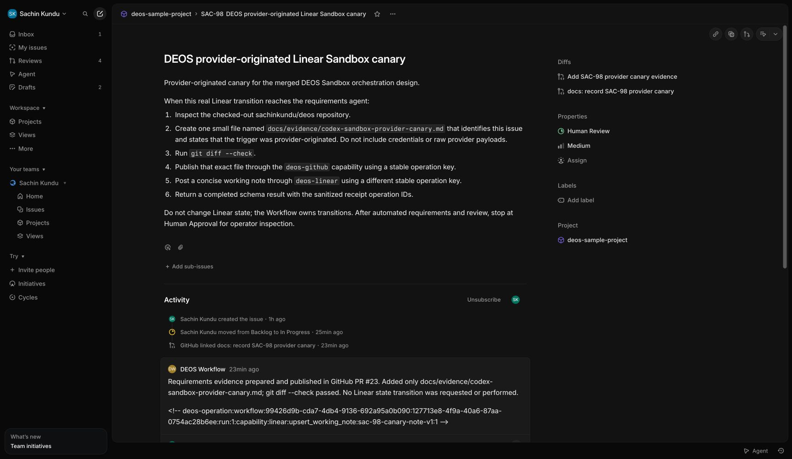
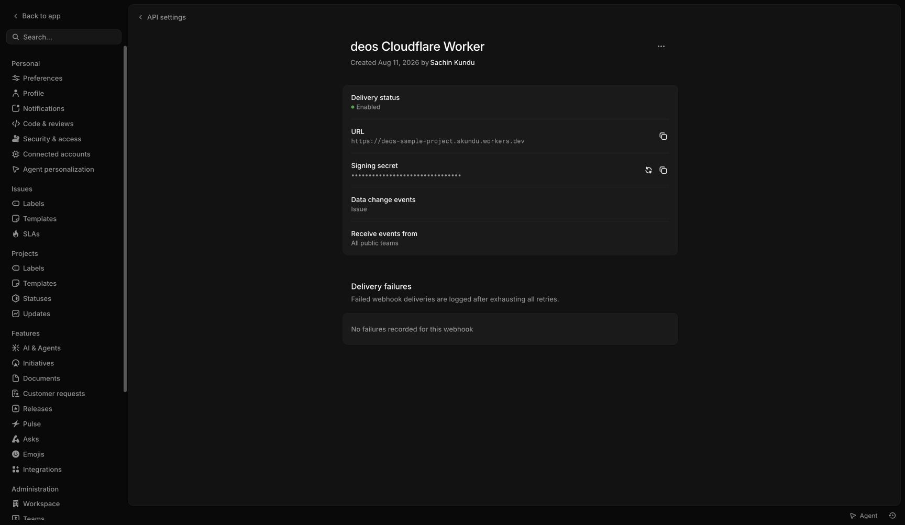
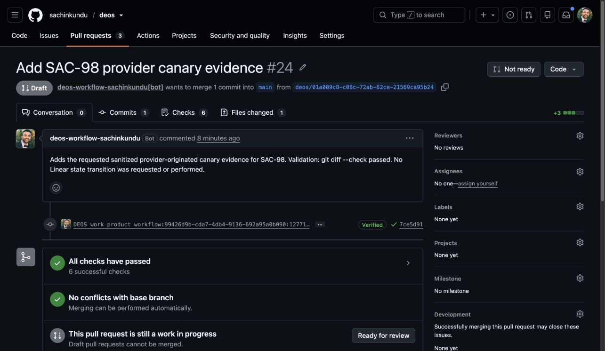
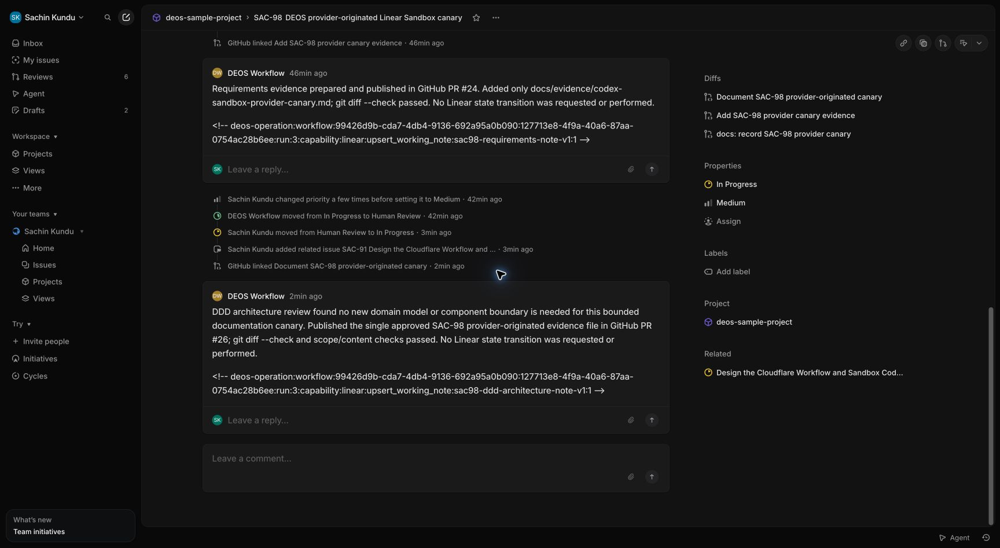

# Sandboxed Codex live deployment and provider proof

*2026-08-16T07:34:31Z by Showboat 0.6.1*
<!-- showboat-id: fc3d8df9-959d-4721-9547-3139a0267753 -->

This evidence record separates disabled deployment inspection, real Sandbox integration, synthetic signed ingress, and provider-originated Linear proof. Secret values, authentication envelopes, prompts, transcripts, patches, and provider response bodies are deliberately excluded.

```bash
rtk zsh -c 'set -a; source /Users/sachin/code/deos/.env; set +a; export CLOUDFLARE_API_TOKEN="$CLOUDFLARE_TOKEN"; exec npx wrangler whoami --config wrangler.queue-consumer-ts.jsonc'
```

```output

 ⛅️ wrangler 4.123.0
────────────────────
Getting User settings...
👋 You are logged in with an User API Token. Unable to retrieve email for this user. Are you missing the `User->User Details->Read` permission?
ℹ️  The API Token is read from the CLOUDFLARE_API_TOKEN environment variable.
┌──────────────────────────┬──────────────────────────────────┐
│ Account Name             │ Account ID                       │
├──────────────────────────┼──────────────────────────────────┤
│ Skundu@hey.com's Account │ c68856288112af7698f5be52ea94b96e │
└──────────────────────────┴──────────────────────────────────┘
🔓 To see token permissions visit https://dash.cloudflare.com/profile/api-tokens
```

Pre-deploy inspection confirms the target account and existing resource state before additive migration or Worker deployment.

```bash
rtk zsh -c 'set -a; source /Users/sachin/code/deos/.env; set +a; export CLOUDFLARE_API_TOKEN="$CLOUDFLARE_TOKEN"; exec npx wrangler d1 migrations list DB --remote --config wrangler.queue-consumer-ts.jsonc'
```

```output

 ⛅️ wrangler 4.123.0
────────────────────
Resource location: remote

Migrations to be applied:
┌────────────────────────────────┐
│ Name                           │
├────────────────────────────────┤
│ 0006_sandbox_orchestration.sql │
└────────────────────────────────┘
```

```bash
rtk zsh -c 'set -a; source /Users/sachin/code/deos/.env; set +a; export CLOUDFLARE_API_TOKEN="$CLOUDFLARE_TOKEN"; exec npx wrangler workflows list --config wrangler.queue-consumer-ts.jsonc'
```

```output

 ⛅️ wrangler 4.123.0
────────────────────
▲ [WARNING] There are no deployed Workflows in this account


```

```bash
rtk zsh -c 'set -a; source /Users/sachin/code/deos/.env; set +a; export CLOUDFLARE_API_TOKEN="$CLOUDFLARE_TOKEN"; exec npx wrangler containers list --config wrangler.queue-consumer-ts.jsonc'
```

```output

✘ [ERROR] There has been an unknown error listing containers.

  {"error":"{\"error\":\"Unauthorized: You do not have access to Cloudflare Containers. Deploying containers requires the Workers Paid plan. Upgrade your plan at https://dash.cloudflare.com/?to=/:account/workers/plans\"}"}


If you think this is a bug then please create an issue at https://github.com/cloudflare/workers-sdk/issues/new/choose
🪵  Logs were written to "/Users/sachin/Library/Preferences/.wrangler/logs/wrangler-2026-08-16_07-35-05_926.log"
```

```bash
rtk zsh -c 'set -a; source /Users/sachin/code/deos/.env; set +a; export CLOUDFLARE_API_TOKEN="$CLOUDFLARE_TOKEN"; exec npx wrangler r2 bucket list --config wrangler.queue-consumer-ts.jsonc'
```

```output

 ⛅️ wrangler 4.123.0
────────────────────
Listing buckets...
name:           deos-sample-project-artifacts
creation_date:  2026-08-11T14:45:46.491Z
```

```bash
rtk zsh -c 'set -a; source /Users/sachin/code/deos/.env; set +a; export CLOUDFLARE_API_TOKEN="$CLOUDFLARE_TOKEN"; exec npx wrangler containers list --config wrangler.queue-consumer-ts.jsonc'
```

```output
No containers found.
```

Workers Paid access is active. The next command applies only additive D1 migration 0006, uploads protected Worker secrets without printing values, deploys the pinned amd64 Sandbox image with trial dispatch disabled, and seeds an encrypted Codex auth envelope. Random service secrets exist only inside the deployment shell and Worker secret store.

```bash
rtk zsh -c 'set -euo pipefail; umask 077; set -a; source /Users/sachin/code/deos/.env; set +a; export CLOUDFLARE_API_TOKEN="$CLOUDFLARE_TOKEN"; export CODEX_AUTH_ENCRYPTION_KEY="$(rtk openssl rand -hex 32)"; export CAPABILITY_SIGNING_SECRET="$(rtk openssl rand -hex 32)"; export CLEANUP_AUDIT_SECRET="$(rtk openssl rand -hex 32)"; task_tmp=/tmp/deos-auth-bootstrap-20260816-01; rtk mkdir -m 700 "$task_tmp"; rtk ./scripts/deploy-orchestration.sh; rtk env CODEX_AUTH_ENCRYPTION_KEY="$CODEX_AUTH_ENCRYPTION_KEY" node scripts/encrypt-codex-auth.mjs /Users/sachin/.codex/auth.json > "$task_tmp/auth.v1.enc"; rtk npx wrangler r2 object put deos-sample-project-artifacts/credentials/controlled-trial/auth.v1.enc --file "$task_tmp/auth.v1.enc" --content-type application/json --config wrangler.queue-consumer-ts.jsonc; rtk rm -f "$task_tmp/auth.v1.enc"; rtk rmdir "$task_tmp"'
```

```output

 ⛅️ wrangler 4.123.0
────────────────────
Resource location: remote

Migrations to be applied:
┌────────────────────────────────┐
│ name                           │
├────────────────────────────────┤
│ 0006_sandbox_orchestration.sql │
└────────────────────────────────┘
? About to apply 1 migration(s)
Your database may not be available to serve requests during the migration, continue?
🤖 Using fallback value in non-interactive context: yes
🌀 Executing on remote database DB (4e854f8a-018a-42c4-a325-c4b8805c06b2):
🌀 To execute on your local development database, remove the --remote flag from your wrangler command.
🚣 Executed 20 commands in 4.86ms
┌────────────────────────────────┬────────┐
│ name                           │ status │
├────────────────────────────────┼────────┤
│ 0006_sandbox_orchestration.sql │ ✅     │
└────────────────────────────────┴────────┘

 ⛅️ wrangler 4.123.0
────────────────────
🌀 Creating the secret for the Worker "deos-queue-consumer-ts"
✨ Success! Uploaded secret LINEAR_APP_ACCESS_TOKEN

 ⛅️ wrangler 4.123.0
────────────────────
🌀 Creating the secret for the Worker "deos-queue-consumer-ts"
✨ Success! Uploaded secret GITHUB_APP_ID

 ⛅️ wrangler 4.123.0
────────────────────
🌀 Creating the secret for the Worker "deos-queue-consumer-ts"
✨ Success! Uploaded secret GITHUB_INSTALLATION_ID

 ⛅️ wrangler 4.123.0
────────────────────
🌀 Creating the secret for the Worker "deos-queue-consumer-ts"
✨ Success! Uploaded secret CODEX_AUTH_ENCRYPTION_KEY

 ⛅️ wrangler 4.123.0
────────────────────
🌀 Creating the secret for the Worker "deos-queue-consumer-ts"
✨ Success! Uploaded secret CAPABILITY_SIGNING_SECRET

 ⛅️ wrangler 4.123.0
────────────────────
🌀 Creating the secret for the Worker "deos-queue-consumer-ts"
✨ Success! Uploaded secret CLEANUP_AUDIT_SECRET

 ⛅️ wrangler 4.123.0
────────────────────
🌀 Creating the secret for the Worker "deos-queue-consumer-ts"
✨ Success! Uploaded secret GITHUB_APP_PRIVATE_KEY

 ⛅️ wrangler 4.123.0
────────────────────
Total Upload: 1011.81 KiB / gzip: 212.85 KiB
Worker Startup Time: 8 ms
Your Worker has access to the following bindings:
Binding                                                                              Resource
env.Sandbox (Sandbox)                                                                Durable Object
env.ORCHESTRATION_WORKFLOW (DeosWorkflow)                                            Workflow
env.DB (deos-sample-project)                                                         D1 Database
env.ARTIFACTS (deos-sample-project-artifacts)                                        R2 Bucket
env.LINEAR_API_URL ("https://api.linear.app/graphql")                                Environment Variable
env.LINEAR_HUMAN_APPROVAL_STATE_ID ("71738607-03fd-49f2-b4be-b2aac29ccd13")          Environment Variable
env.LINEAR_PROJECT_ID ("99426d9b-cda7-4db4-9136-692a95a0b090")                       Environment Variable
env.LINEAR_START_STATE_NAME ("In Progress")                                          Environment Variable
env.LINEAR_APPROVAL_STATE_NAMES ("In Progress")                                      Environment Variable
env.LINEAR_REJECTION_STATE_NAMES ("Canceled")                                        Environment Variable
env.LINEAR_APP_ACTOR_ID ("f010429f-7734-4f3f-9b4b-13a4abb9b4ab")                     Environment Variable
env.LINEAR_TEAM_ID ("ac53207d-68c0-42f1-a245-c1baf047f234")                          Environment Variable
env.GITHUB_API_URL ("https://api.github.com")                                        Environment Variable
env.TRIAL_REPOSITORY ("sachinkundu/deos")                                            Environment Variable
env.TRIAL_DISPATCH_ENABLED ("false")                                                 Environment Variable
env.CODEX_AUTH_PROFILE_ID ("controlled-trial")                                       Environment Variable
env.CAPABILITY_BASE_URL ("https://deos-queue-consumer-ts.skundu...")                 Environment Variable

The following containers are available:
- deos-queue-consumer-ts-sandbox (/private/tmp/deos-sandbox-codex-implementation/Dockerfile)

Uploaded deos-queue-consumer-ts (6.72 sec)
Building image deos-queue-consumer-ts-sandbox:56f29201
#0 building with "colima" instance using docker driver

#1 [internal] load build definition from Dockerfile
#1 transferring dockerfile: 650B done
#1 DONE 0.0s

#2 [internal] load metadata for docker.io/cloudflare/sandbox:0.13.0-next.738.2@sha256:f4b2137219568aa44539ab93c0e774db6bcab323c134c5088447916e58f15e75
#2 DONE 1.1s

#3 [internal] load .dockerignore
#3 transferring context: 2B done
#3 DONE 0.0s

#4 [1/7] FROM docker.io/cloudflare/sandbox:0.13.0-next.738.2@sha256:f4b2137219568aa44539ab93c0e774db6bcab323c134c5088447916e58f15e75
#4 resolve docker.io/cloudflare/sandbox:0.13.0-next.738.2@sha256:f4b2137219568aa44539ab93c0e774db6bcab323c134c5088447916e58f15e75 done
#4 DONE 0.0s

#5 [internal] load build context
#5 transferring context: 157B done
#5 DONE 0.0s

#6 [2/7] RUN npm install --global --omit=dev @openai/codex@0.147.0
#6 CACHED

#7 [3/7] RUN mkdir -p /deos/bin /deos/staging /deos/jobs /deos/auth     && chmod 700 /deos/auth     && chmod 755 /deos/bin /deos/staging /deos/jobs
#7 CACHED

#8 [4/7] COPY container/supervisor.mjs /deos/bin/supervisor.mjs
#8 CACHED

#9 [5/7] COPY container/deos-github /usr/local/bin/deos-github
#9 CACHED

#10 [6/7] COPY container/deos-linear /usr/local/bin/deos-linear
#10 CACHED

#11 [7/7] RUN chmod 755 /deos/bin/supervisor.mjs /usr/local/bin/deos-github /usr/local/bin/deos-linear     && codex --version
#11 CACHED

#12 exporting to image
#12 exporting layers done
#12 exporting manifest sha256:ebe9714b713ca2837abd5788beebe828dd13355e75f40a482d5849b0fa8d9709 done
#12 exporting config sha256:205a044350d75cc076b7a16a7433499060a1b768459ea0a7d8070b979ea06f08 done
#12 naming to docker.io/library/deos-queue-consumer-ts-sandbox:56f29201 done
#12 DONE 0.0s

WARNING! Your credentials are stored unencrypted in '/Users/sachin/.docker/config.json'.
Configure a credential helper to remove this warning. See
https://docs.docker.com/go/credential-store/

Login Succeeded
no such manifest: registry.cloudflare.com/c68856288112af7698f5be52ea94b96e/deos-queue-consumer-ts-sandbox@sha256:ebe9714b713ca2837abd5788beebe828dd13355e75f40a482d5849b0fa8d9709
Image does not exist remotely, pushing: registry.cloudflare.com/c68856288112af7698f5be52ea94b96e/deos-queue-consumer-ts-sandbox:56f29201
The push refers to repository [registry.cloudflare.com/c68856288112af7698f5be52ea94b96e/deos-queue-consumer-ts-sandbox]
454f0e71675c: Waiting
3cb5a8b13f9c: Waiting
4ae38ac09d90: Waiting
314925a215b8: Waiting
bb5b798dbd34: Waiting
fa85debb9563: Waiting
c8b0a6b8b93c: Waiting
b4c813ead46f: Waiting
4f4fb700ef54: Waiting
08afb06c6a78: Waiting
87b22a7310bc: Waiting
43bc55a634a4: Waiting
d35efc45caf0: Waiting
da2025239b5f: Waiting
b2221350f0e5: Waiting
975eaabc6742: Waiting
64fd49aed2a9: Waiting
1fd637621278: Waiting
fd28870dde71: Waiting
1fd637621278: Waiting
fd28870dde71: Waiting
454f0e71675c: Waiting
3cb5a8b13f9c: Waiting
4ae38ac09d90: Waiting
314925a215b8: Waiting
bb5b798dbd34: Waiting
fa85debb9563: Waiting
c8b0a6b8b93c: Waiting
b4c813ead46f: Waiting
4f4fb700ef54: Waiting
08afb06c6a78: Waiting
87b22a7310bc: Waiting
43bc55a634a4: Waiting
d35efc45caf0: Waiting
da2025239b5f: Waiting
b2221350f0e5: Waiting
975eaabc6742: Waiting
64fd49aed2a9: Waiting
d35efc45caf0: Waiting
da2025239b5f: Waiting
b2221350f0e5: Waiting
975eaabc6742: Waiting
64fd49aed2a9: Waiting
1fd637621278: Waiting
fd28870dde71: Waiting
454f0e71675c: Waiting
3cb5a8b13f9c: Waiting
4ae38ac09d90: Waiting
314925a215b8: Waiting
bb5b798dbd34: Waiting
fa85debb9563: Waiting
c8b0a6b8b93c: Waiting
b4c813ead46f: Waiting
4f4fb700ef54: Waiting
08afb06c6a78: Waiting
87b22a7310bc: Waiting
43bc55a634a4: Waiting
314925a215b8: Waiting
bb5b798dbd34: Waiting
fa85debb9563: Waiting
c8b0a6b8b93c: Waiting
b4c813ead46f: Waiting
4f4fb700ef54: Waiting
08afb06c6a78: Waiting
87b22a7310bc: Waiting
43bc55a634a4: Waiting
d35efc45caf0: Waiting
da2025239b5f: Waiting
b2221350f0e5: Waiting
975eaabc6742: Waiting
64fd49aed2a9: Waiting
1fd637621278: Waiting
fd28870dde71: Waiting
454f0e71675c: Waiting
3cb5a8b13f9c: Waiting
4ae38ac09d90: Waiting
fd28870dde71: Waiting
454f0e71675c: Waiting
3cb5a8b13f9c: Waiting
4ae38ac09d90: Waiting
314925a215b8: Waiting
bb5b798dbd34: Waiting
fa85debb9563: Waiting
c8b0a6b8b93c: Waiting
b4c813ead46f: Waiting
4f4fb700ef54: Waiting
08afb06c6a78: Waiting
87b22a7310bc: Waiting
43bc55a634a4: Waiting
d35efc45caf0: Waiting
da2025239b5f: Waiting
b2221350f0e5: Waiting
975eaabc6742: Waiting
64fd49aed2a9: Waiting
1fd637621278: Waiting
bb5b798dbd34: Waiting
fa85debb9563: Waiting
c8b0a6b8b93c: Waiting
b4c813ead46f: Waiting
4f4fb700ef54: Waiting
08afb06c6a78: Waiting
87b22a7310bc: Waiting
43bc55a634a4: Waiting
d35efc45caf0: Waiting
da2025239b5f: Waiting
b2221350f0e5: Waiting
975eaabc6742: Waiting
64fd49aed2a9: Waiting
1fd637621278: Waiting
fd28870dde71: Waiting
454f0e71675c: Waiting
3cb5a8b13f9c: Waiting
4ae38ac09d90: Waiting
314925a215b8: Waiting
975eaabc6742: Waiting
64fd49aed2a9: Waiting
1fd637621278: Waiting
fd28870dde71: Waiting
454f0e71675c: Waiting
3cb5a8b13f9c: Waiting
4ae38ac09d90: Waiting
314925a215b8: Waiting
bb5b798dbd34: Waiting
fa85debb9563: Waiting
c8b0a6b8b93c: Waiting
b4c813ead46f: Waiting
4f4fb700ef54: Waiting
08afb06c6a78: Waiting
87b22a7310bc: Waiting
43bc55a634a4: Waiting
d35efc45caf0: Waiting
da2025239b5f: Waiting
b2221350f0e5: Waiting
fa85debb9563: Waiting
c8b0a6b8b93c: Waiting
b4c813ead46f: Waiting
4f4fb700ef54: Waiting
08afb06c6a78: Waiting
87b22a7310bc: Waiting
43bc55a634a4: Waiting
d35efc45caf0: Waiting
da2025239b5f: Waiting
b2221350f0e5: Waiting
975eaabc6742: Waiting
64fd49aed2a9: Waiting
1fd637621278: Waiting
fd28870dde71: Waiting
454f0e71675c: Waiting
3cb5a8b13f9c: Waiting
4ae38ac09d90: Waiting
314925a215b8: Waiting
bb5b798dbd34: Waiting
4ae38ac09d90: Waiting
314925a215b8: Waiting
bb5b798dbd34: Waiting
fa85debb9563: Waiting
c8b0a6b8b93c: Waiting
b4c813ead46f: Waiting
4f4fb700ef54: Waiting
08afb06c6a78: Waiting
87b22a7310bc: Waiting
43bc55a634a4: Waiting
d35efc45caf0: Waiting
da2025239b5f: Waiting
b2221350f0e5: Waiting
975eaabc6742: Waiting
64fd49aed2a9: Waiting
1fd637621278: Waiting
fd28870dde71: Waiting
454f0e71675c: Waiting
3cb5a8b13f9c: Waiting
bb5b798dbd34: Waiting
fa85debb9563: Waiting
c8b0a6b8b93c: Waiting
b4c813ead46f: Waiting
4f4fb700ef54: Waiting
08afb06c6a78: Waiting
87b22a7310bc: Waiting
43bc55a634a4: Waiting
d35efc45caf0: Waiting
da2025239b5f: Waiting
b2221350f0e5: Waiting
975eaabc6742: Waiting
64fd49aed2a9: Waiting
1fd637621278: Waiting
fd28870dde71: Waiting
454f0e71675c: Waiting
3cb5a8b13f9c: Waiting
4ae38ac09d90: Waiting
314925a215b8: Waiting
975eaabc6742: Waiting
64fd49aed2a9: Waiting
1fd637621278: Waiting
fd28870dde71: Waiting
454f0e71675c: Waiting
3cb5a8b13f9c: Waiting
4ae38ac09d90: Waiting
314925a215b8: Waiting
bb5b798dbd34: Waiting
fa85debb9563: Waiting
c8b0a6b8b93c: Waiting
b4c813ead46f: Waiting
4f4fb700ef54: Waiting
08afb06c6a78: Waiting
87b22a7310bc: Waiting
43bc55a634a4: Waiting
d35efc45caf0: Waiting
da2025239b5f: Waiting
b2221350f0e5: Waiting
b2221350f0e5: Waiting
975eaabc6742: Waiting
64fd49aed2a9: Waiting
1fd637621278: Waiting
fd28870dde71: Waiting
454f0e71675c: Waiting
3cb5a8b13f9c: Waiting
4ae38ac09d90: Waiting
314925a215b8: Waiting
bb5b798dbd34: Waiting
fa85debb9563: Waiting
c8b0a6b8b93c: Waiting
b4c813ead46f: Waiting
4f4fb700ef54: Waiting
08afb06c6a78: Waiting
87b22a7310bc: Waiting
43bc55a634a4: Waiting
d35efc45caf0: Waiting
da2025239b5f: Waiting
975eaabc6742: Waiting
64fd49aed2a9: Waiting
1fd637621278: Waiting
fd28870dde71: Waiting
454f0e71675c: Waiting
3cb5a8b13f9c: Waiting
4ae38ac09d90: Waiting
314925a215b8: Waiting
bb5b798dbd34: Waiting
fa85debb9563: Waiting
c8b0a6b8b93c: Waiting
b4c813ead46f: Waiting
4f4fb700ef54: Waiting
08afb06c6a78: Waiting
87b22a7310bc: Waiting
43bc55a634a4: Waiting
d35efc45caf0: Waiting
da2025239b5f: Waiting
b2221350f0e5: Waiting
43bc55a634a4: Waiting
d35efc45caf0: Waiting
da2025239b5f: Waiting
b2221350f0e5: Waiting
975eaabc6742: Waiting
64fd49aed2a9: Waiting
1fd637621278: Waiting
fd28870dde71: Waiting
454f0e71675c: Waiting
3cb5a8b13f9c: Waiting
4ae38ac09d90: Waiting
314925a215b8: Waiting
bb5b798dbd34: Waiting
fa85debb9563: Waiting
c8b0a6b8b93c: Waiting
b4c813ead46f: Waiting
4f4fb700ef54: Waiting
08afb06c6a78: Waiting
87b22a7310bc: Waiting
454f0e71675c: Waiting
3cb5a8b13f9c: Waiting
4ae38ac09d90: Waiting
314925a215b8: Waiting
bb5b798dbd34: Waiting
fa85debb9563: Waiting
c8b0a6b8b93c: Waiting
b4c813ead46f: Waiting
4f4fb700ef54: Waiting
08afb06c6a78: Waiting
87b22a7310bc: Waiting
43bc55a634a4: Waiting
d35efc45caf0: Waiting
da2025239b5f: Waiting
b2221350f0e5: Waiting
975eaabc6742: Waiting
64fd49aed2a9: Waiting
1fd637621278: Waiting
fd28870dde71: Waiting
d35efc45caf0: Waiting
da2025239b5f: Waiting
b2221350f0e5: Waiting
975eaabc6742: Waiting
64fd49aed2a9: Waiting
1fd637621278: Waiting
fd28870dde71: Waiting
454f0e71675c: Waiting
3cb5a8b13f9c: Waiting
4ae38ac09d90: Waiting
314925a215b8: Waiting
bb5b798dbd34: Waiting
fa85debb9563: Waiting
c8b0a6b8b93c: Waiting
b4c813ead46f: Waiting
4f4fb700ef54: Waiting
08afb06c6a78: Waiting
87b22a7310bc: Waiting
43bc55a634a4: Waiting
da2025239b5f: Waiting
b2221350f0e5: Waiting
975eaabc6742: Waiting
64fd49aed2a9: Waiting
1fd637621278: Waiting
fd28870dde71: Waiting
454f0e71675c: Waiting
3cb5a8b13f9c: Waiting
4ae38ac09d90: Waiting
314925a215b8: Waiting
bb5b798dbd34: Waiting
fa85debb9563: Waiting
c8b0a6b8b93c: Waiting
b4c813ead46f: Waiting
4f4fb700ef54: Waiting
08afb06c6a78: Waiting
87b22a7310bc: Waiting
43bc55a634a4: Waiting
d35efc45caf0: Waiting
314925a215b8: Waiting
bb5b798dbd34: Waiting
fa85debb9563: Waiting
c8b0a6b8b93c: Waiting
b4c813ead46f: Waiting
08afb06c6a78: Waiting
87b22a7310bc: Waiting
43bc55a634a4: Waiting
d35efc45caf0: Waiting
da2025239b5f: Waiting
b2221350f0e5: Waiting
1fd637621278: Waiting
fd28870dde71: Waiting
454f0e71675c: Waiting
3cb5a8b13f9c: Waiting
4ae38ac09d90: Waiting
c8b0a6b8b93c: Waiting
b4c813ead46f: Waiting
08afb06c6a78: Waiting
87b22a7310bc: Waiting
43bc55a634a4: Waiting
d35efc45caf0: Waiting
da2025239b5f: Waiting
b2221350f0e5: Waiting
1fd637621278: Waiting
fd28870dde71: Waiting
454f0e71675c: Waiting
3cb5a8b13f9c: Waiting
4ae38ac09d90: Waiting
314925a215b8: Waiting
bb5b798dbd34: Waiting
fa85debb9563: Waiting
08afb06c6a78: Waiting
87b22a7310bc: Waiting
43bc55a634a4: Waiting
d35efc45caf0: Waiting
da2025239b5f: Waiting
b2221350f0e5: Waiting
1fd637621278: Waiting
fd28870dde71: Waiting
454f0e71675c: Waiting
3cb5a8b13f9c: Waiting
4ae38ac09d90: Waiting
314925a215b8: Waiting
bb5b798dbd34: Waiting
c8b0a6b8b93c: Waiting
b4c813ead46f: Waiting
bb5b798dbd34: Waiting
c8b0a6b8b93c: Waiting
b4c813ead46f: Waiting
87b22a7310bc: Waiting
43bc55a634a4: Waiting
d35efc45caf0: Waiting
b2221350f0e5: Waiting
1fd637621278: Waiting
fd28870dde71: Waiting
454f0e71675c: Waiting
3cb5a8b13f9c: Waiting
4ae38ac09d90: Waiting
43bc55a634a4: Waiting
d35efc45caf0: Waiting
b2221350f0e5: Waiting
1fd637621278: Waiting
fd28870dde71: Waiting
454f0e71675c: Waiting
3cb5a8b13f9c: Waiting
4ae38ac09d90: Waiting
bb5b798dbd34: Waiting
c8b0a6b8b93c: Waiting
b4c813ead46f: Waiting
1fd637621278: Waiting
3cb5a8b13f9c: Waiting
4ae38ac09d90: Waiting
bb5b798dbd34: Waiting
c8b0a6b8b93c: Waiting
43bc55a634a4: Waiting
d35efc45caf0: Waiting
3cb5a8b13f9c: Waiting
43bc55a634a4: Waiting
d35efc45caf0: Waiting
3cb5a8b13f9c: Waiting
d35efc45caf0: Waiting
3cb5a8b13f9c: Waiting
3cb5a8b13f9c: Waiting
3cb5a8b13f9c: Waiting
3cb5a8b13f9c: Waiting
64fd49aed2a9: Pushed
4f4fb700ef54: Pushed
975eaabc6742: Pushed
fa85debb9563: Pushed
87b22a7310bc: Pushed
fd28870dde71: Pushed
bb5b798dbd34: Pushed
4ae38ac09d90: Pushed
08afb06c6a78: Pushed
b2221350f0e5: Pushed
454f0e71675c: Pushed
d35efc45caf0: Pushed
314925a215b8: Pushed
1fd637621278: Pushed
43bc55a634a4: Pushed
b4c813ead46f: Pushed
c8b0a6b8b93c: Pushed
3cb5a8b13f9c: Pushed
da2025239b5f: Pushed
56f29201: digest: sha256:ebe9714b713ca2837abd5788beebe828dd13355e75f40a482d5849b0fa8d9709 size: 4418
╭ Deploy a container application deploy changes to your application
│
│ Container application changes
│
├ NEW deos-queue-consumer-ts-sandbox
│
│   {
│     "containers": [
│       {
│         "name": "deos-queue-consumer-ts-sandbox",
│         "scheduling_policy": "default",
│         "configuration": {
│           "image": "registry.cloudflare.com/c68856288112af7698f5be52ea94b96e/deos-queue-consumer-ts-sandbox@sha256:ebe9714b713ca2837abd5788beebe828dd13355e75f40a482d5849b0fa8d9709",
│           "instance_type": "basic",
│           "observability": {
│             "logs": {
│               "enabled": true
│             }
│           }
│         },
│         "instances": 0,
│         "max_instances": 5,
│         "constraints": {
│           "tiers": [
│             1,
│             2
│           ]
│         },
│         "durable_objects": {
│           "namespace_id": "3132c2f21e9c48339cb72292268a1589"
│         },
│         "rollout_active_grace_period": 0
│       }
│     ]
│   }
│
│
│  SUCCESS  Created application deos-queue-consumer-ts-sandbox (Application ID: a0344373-884d-4c06-b4c2-4e58295de498)
│
╰ Applied changes

Deployed deos-queue-consumer-ts triggers (6.46 sec)
  https://deos-queue-consumer-ts.skundu.workers.dev
  schedule: */15 * * * *
  Consumer for deos-sample-project-events
  workflow: deos-sandbox-codex-workflow
Current Version ID: 56f29201-93f0-4049-a36c-f812d40da777
 ⛅️ wrangler 4.123.0
────────────────────
Resource location: local
Use --remote if you want to access the remote instance.
Creating object "credentials/controlled-trial/auth.v1.enc" in bucket "deos-sample-project-artifacts".
Upload complete.
```

Post-deploy inspection is read-only. It verifies migration completion, secret names only, Workflow and Container registration, image digest, zero live instances, and protected auth-object presence without reading its contents.

```bash
rtk zsh -c 'set -a; source /Users/sachin/code/deos/.env; set +a; export CLOUDFLARE_API_TOKEN="$CLOUDFLARE_TOKEN"; exec npx wrangler d1 migrations list DB --remote --config wrangler.queue-consumer-ts.jsonc'
```

```output

 ⛅️ wrangler 4.123.0
────────────────────
Resource location: remote

✅ No migrations to apply!
```

```bash
rtk zsh -c 'set -a; source /Users/sachin/code/deos/.env; set +a; export CLOUDFLARE_API_TOKEN="$CLOUDFLARE_TOKEN"; exec npx wrangler secret list --config wrangler.queue-consumer-ts.jsonc'
```

```output
[
  {
    "name": "CAPABILITY_SIGNING_SECRET",
    "type": "secret_text"
  },
  {
    "name": "CLEANUP_AUDIT_SECRET",
    "type": "secret_text"
  },
  {
    "name": "CODEX_AUTH_ENCRYPTION_KEY",
    "type": "secret_text"
  },
  {
    "name": "GITHUB_APP_ID",
    "type": "secret_text"
  },
  {
    "name": "GITHUB_APP_PRIVATE_KEY",
    "type": "secret_text"
  },
  {
    "name": "GITHUB_INSTALLATION_ID",
    "type": "secret_text"
  },
  {
    "name": "LINEAR_API_KEY",
    "type": "secret_text"
  },
  {
    "name": "LINEAR_APP_ACCESS_TOKEN",
    "type": "secret_text"
  }
]
```

```bash
rtk zsh -c 'set -a; source /Users/sachin/code/deos/.env; set +a; export CLOUDFLARE_API_TOKEN="$CLOUDFLARE_TOKEN"; exec npx wrangler workflows list --config wrangler.queue-consumer-ts.jsonc'
```

```output

 ⛅️ wrangler 4.123.0
────────────────────
Showing 1 workflow from page 1:
┌─────────────────────────────┬────────────────────────┬──────────────┬────────────────────────┬────────────────────────┐
│ Name                        │ Script name            │ Class name   │ Created                │ Modified               │
├─────────────────────────────┼────────────────────────┼──────────────┼────────────────────────┼────────────────────────┤
│ deos-sandbox-codex-workflow │ deos-queue-consumer-ts │ DeosWorkflow │ 8/16/2026, 10:52:28 AM │ 8/16/2026, 10:52:28 AM │
└─────────────────────────────┴────────────────────────┴──────────────┴────────────────────────┴────────────────────────┘
```

```bash
rtk zsh -c 'set -a; source /Users/sachin/code/deos/.env; set +a; export CLOUDFLARE_API_TOKEN="$CLOUDFLARE_TOKEN"; exec npx wrangler containers list --config wrangler.queue-consumer-ts.jsonc'
```

```output
┌──────────────────────────────────────┬────────────────────────────────┬──────────────┬────────────────┬────────────────────────────────┐
│ ID                                   │ NAME                           │ STATE        │ LIVE INSTANCES │ LAST MODIFIED                  │
├──────────────────────────────────────┼────────────────────────────────┼──────────────┼────────────────┼────────────────────────────────┤
│ a0344373-884d-4c06-b4c2-4e58295de498 │ deos-queue-consumer-ts-sandbox │ provisioning │ 5              │ 2026-08-16T07:52:22.603000064Z │
└──────────────────────────────────────┴────────────────────────────────┴──────────────┴────────────────┴────────────────────────────────┘
```

```bash
rtk zsh -c 'set -a; source /Users/sachin/code/deos/.env; set +a; export CLOUDFLARE_API_TOKEN="$CLOUDFLARE_TOKEN"; exec npx wrangler containers images list --config wrangler.queue-consumer-ts.jsonc'
```

```output
REPOSITORY                      TAG
deos-queue-consumer-ts-sandbox  56f29201
```

```bash
rtk zsh -c 'set -a; source /Users/sachin/code/deos/.env; set +a; export CLOUDFLARE_API_TOKEN="$CLOUDFLARE_TOKEN"; exec npx wrangler versions list --config wrangler.queue-consumer-ts.jsonc'
```

```output

 ⛅️ wrangler 4.123.0
────────────────────
Version ID:  89b470c7-1133-42b9-bb21-b5d4ff100b5f
Created:     2026-08-12T11:04:06.721Z
Author:      sachin.kundu@pm.me
Source:      Unknown (version_upload)
Tag:         -
Message:     -

Version ID:  a502f656-cdd3-490d-a611-f8fdf5e469d8
Created:     2026-08-14T05:17:39.038Z
Author:      sachin.kundu@pm.me
Source:      Unknown (version_upload)
Tag:         -
Message:     -

Version ID:  fe40ff09-3a7a-4dfe-bcf2-90d0720b5997
Created:     2026-08-16T07:43:43.065Z
Author:      sachin.kundu@pm.me
Source:      Secret Change
Tag:         -
Message:     -

Version ID:  9115368c-01ae-4274-89fb-deca74dab17e
Created:     2026-08-16T07:43:45.244Z
Author:      sachin.kundu@pm.me
Source:      Secret Change
Tag:         -
Message:     -

Version ID:  e38a610e-81b6-4235-b281-7c927ab1ddb8
Created:     2026-08-16T07:43:47.245Z
Author:      sachin.kundu@pm.me
Source:      Secret Change
Tag:         -
Message:     -

Version ID:  2d83151c-8458-4673-b48d-5244d9d4f8aa
Created:     2026-08-16T07:43:49.248Z
Author:      sachin.kundu@pm.me
Source:      Secret Change
Tag:         -
Message:     -

Version ID:  892f15c3-fe21-4097-8807-5899a48ebc05
Created:     2026-08-16T07:43:51.286Z
Author:      sachin.kundu@pm.me
Source:      Secret Change
Tag:         -
Message:     -

Version ID:  2712e421-0121-4bea-b8ce-b30e5f93dd08
Created:     2026-08-16T07:43:53.268Z
Author:      sachin.kundu@pm.me
Source:      Secret Change
Tag:         -
Message:     -

Version ID:  43f519e2-d0ef-48ba-bb2e-e4b02fae874a
Created:     2026-08-16T07:43:55.207Z
Author:      sachin.kundu@pm.me
Source:      Secret Change
Tag:         -
Message:     -

Version ID:  56f29201-93f0-4049-a36c-f812d40da777
Created:     2026-08-16T07:44:06.567Z
Author:      sachin.kundu@pm.me
Source:      Upload
Tag:         -
Message:     -

```

```bash
rtk zsh -c 'set -a; source /Users/sachin/code/deos/.env; set +a; export CLOUDFLARE_API_TOKEN="$CLOUDFLARE_TOKEN"; exec npx wrangler d1 execute DB --remote --config wrangler.queue-consumer-ts.jsonc --command "SELECT name FROM sqlite_master WHERE type = char(116,97,98,108,101) AND name IN (char(97,103,101,110,116,95,97,116,116,101,109,112,116,115), char(111,114,99,104,101,115,116,114,97,116,105,111,110,95,114,117,110,115), char(112,114,111,106,101,99,116,95,119,111,114,107,102,108,111,119,95,112,111,108,105,99,105,101,115)) ORDER BY name"'
```

```output

 ⛅️ wrangler 4.123.0
────────────────────
Resource location: remote

🌀 Executing on remote database DB (4e854f8a-018a-42c4-a325-c4b8805c06b2):
🌀 To execute on your local development database, remove the --remote flag from your wrangler command.
🚣 Executed 1 command in 0.44ms
[
  {
    "results": [
      {
        "name": "agent_attempts"
      },
      {
        "name": "orchestration_runs"
      },
      {
        "name": "project_workflow_policies"
      }
    ],
    "success": true,
    "meta": {
      "served_by": "v3-prod",
      "served_by_region": "WEUR",
      "served_by_colo": "AMS",
      "served_by_primary": true,
      "timings": {
        "sql_duration_ms": 0.4439
      },
      "duration": 0.4439,
      "changes": 0,
      "last_row_id": 0,
      "changed_db": false,
      "size_after": 315392,
      "rows_read": 60,
      "rows_written": 0,
      "total_attempts": 1
    }
  }
]
```

```bash
rtk zsh -c 'set -a; source /Users/sachin/code/deos/.env; set +a; export CLOUDFLARE_API_TOKEN="$CLOUDFLARE_TOKEN"; exec npx wrangler r2 object get deos-sample-project-artifacts/credentials/controlled-trial/auth.v1.enc --file /dev/null --config wrangler.queue-consumer-ts.jsonc'
```

```output

 ⛅️ wrangler 4.123.0
────────────────────
Resource location: local

Use --remote if you want to access the remote instance.

Downloading "credentials/controlled-trial/auth.v1.enc" from "deos-sample-project-artifacts".
Download complete.
```

Correction: Wrangler 4.123 treated the first R2 object command as local because --remote was omitted. That output is retained above as audit evidence. The next command atomically rotates only the Worker encryption secret and uploads a newly encrypted envelope to remote R2 with --remote.

```bash
rtk zsh -c 'set -euo pipefail; umask 077; set -a; source /Users/sachin/code/deos/.env; set +a; export CLOUDFLARE_API_TOKEN="$CLOUDFLARE_TOKEN"; export CODEX_AUTH_ENCRYPTION_KEY="$(rtk openssl rand -hex 32)"; task_tmp=/tmp/deos-auth-remote-20260816-01; rtk mkdir -m 700 "$task_tmp"; printf %s "$CODEX_AUTH_ENCRYPTION_KEY" | rtk npx wrangler secret put CODEX_AUTH_ENCRYPTION_KEY --config wrangler.queue-consumer-ts.jsonc; rtk env CODEX_AUTH_ENCRYPTION_KEY="$CODEX_AUTH_ENCRYPTION_KEY" node scripts/encrypt-codex-auth.mjs /Users/sachin/.codex/auth.json > "$task_tmp/auth.v1.enc"; rtk npx wrangler r2 object put deos-sample-project-artifacts/credentials/controlled-trial/auth.v1.enc --remote --file "$task_tmp/auth.v1.enc" --content-type application/json --config wrangler.queue-consumer-ts.jsonc; rtk rm -f "$task_tmp/auth.v1.enc"; rtk rmdir "$task_tmp"'
```

```output
 ⛅️ wrangler 4.123.0
────────────────────
🌀 Creating the secret for the Worker "deos-queue-consumer-ts"
✨ Success! Uploaded secret CODEX_AUTH_ENCRYPTION_KEY
 ⛅️ wrangler 4.123.0
────────────────────
Resource location: remote
Creating object "credentials/controlled-trial/auth.v1.enc" in bucket "deos-sample-project-artifacts".
Upload complete.
```

```bash
rtk zsh -c 'set -a; source /Users/sachin/code/deos/.env; set +a; export CLOUDFLARE_API_TOKEN="$CLOUDFLARE_TOKEN"; exec npx wrangler r2 object get deos-sample-project-artifacts/credentials/controlled-trial/auth.v1.enc --remote --file /dev/null --config wrangler.queue-consumer-ts.jsonc'
```

```output

 ⛅️ wrangler 4.123.0
────────────────────
Resource location: remote

Downloading "credentials/controlled-trial/auth.v1.enc" from "deos-sample-project-artifacts".
Download complete.
```

```bash
rtk zsh -c 'set -a; source /Users/sachin/code/deos/.env; set +a; export CLOUDFLARE_API_TOKEN="$CLOUDFLARE_TOKEN"; exec npx wrangler containers info a0344373-884d-4c06-b4c2-4e58295de498 --config wrangler.queue-consumer-ts.jsonc'
```

```output
{
    "id": "a0344373-884d-4c06-b4c2-4e58295de498",
    "created_at": "2026-08-16T07:52:21.590000128Z",
    "updated_at": "2026-08-16T07:52:22.603000064Z",
    "account_id": "c68856288112af7698f5be52ea94b96e",
    "name": "deos-queue-consumer-ts-sandbox",
    "version": 1,
    "scheduling_policy": "default",
    "instances": 5,
    "max_instances": 5,
    "configuration": {
        "image": "registry.cloudflare.com/c68856288112af7698f5be52ea94b96e/deos-queue-consumer-ts-sandbox@sha256:ebe9714b713ca2837abd5788beebe828dd13355e75f40a482d5849b0fa8d9709",
        "vcpu": 0.25,
        "memory": "1GiB",
        "memory_mib": 1024,
        "disk": {
            "size_mb": 4000,
            "size": "4GB"
        },
        "network": {
            "assign_ipv6": "none",
            "assign_ipv4": "none",
            "mode": "private"
        },
        "command": [],
        "entrypoint": [],
        "runtime": "firecracker",
        "observability": {
            "logs": {
                "enabled": true
            }
        }
    },
    "constraints": {
        "tiers": [
            1,
            2
        ]
    },
    "durable_objects": {
        "namespace_id": "3132c2f21e9c48339cb72292268a1589"
    },
    "rollout_active_grace_period": 0,
    "health": {
        "errors": [],
        "instances": {
            "active": 0,
            "assigned": 0,
            "healthy": 5,
            "stopped": 0,
            "failed": 0,
            "scheduling": 0,
            "starting": 0
        }
    },
    "network": {
        "bandwidth_limit_mbps": 250
    }
}
```

Before the first paid Sandbox attempt, the controller was corrected to materialize the real Linear issue and prior durable results into the immutable job, and the trusted container now captures patch and provider receipts mechanically. The redeploy below preserves the already-rotated Worker secrets and remote encrypted auth seed.

```bash
rtk zsh -c 'set -a; source /Users/sachin/code/deos/.env; set +a; export CLOUDFLARE_API_TOKEN="$CLOUDFLARE_TOKEN"; exec npx wrangler deploy --config wrangler.queue-consumer-ts.jsonc --containers-rollout gradual'
```

```output

 ⛅️ wrangler 4.123.0
────────────────────
Total Upload: 1017.36 KiB / gzip: 214.32 KiB
Worker Startup Time: 8 ms
Your Worker has access to the following bindings:
Binding                                                                              Resource
env.Sandbox (Sandbox)                                                                Durable Object
env.ORCHESTRATION_WORKFLOW (DeosWorkflow)                                            Workflow
env.DB (deos-sample-project)                                                         D1 Database
env.ARTIFACTS (deos-sample-project-artifacts)                                        R2 Bucket
env.LINEAR_API_URL ("https://api.linear.app/graphql")                                Environment Variable
env.LINEAR_HUMAN_APPROVAL_STATE_ID ("71738607-03fd-49f2-b4be-b2aac29ccd13")          Environment Variable
env.LINEAR_PROJECT_ID ("99426d9b-cda7-4db4-9136-692a95a0b090")                       Environment Variable
env.LINEAR_START_STATE_NAME ("In Progress")                                          Environment Variable
env.LINEAR_APPROVAL_STATE_NAMES ("In Progress")                                      Environment Variable
env.LINEAR_REJECTION_STATE_NAMES ("Canceled")                                        Environment Variable
env.LINEAR_APP_ACTOR_ID ("f010429f-7734-4f3f-9b4b-13a4abb9b4ab")                     Environment Variable
env.LINEAR_TEAM_ID ("ac53207d-68c0-42f1-a245-c1baf047f234")                          Environment Variable
env.GITHUB_API_URL ("https://api.github.com")                                        Environment Variable
env.TRIAL_REPOSITORY ("sachinkundu/deos")                                            Environment Variable
env.TRIAL_DISPATCH_ENABLED ("false")                                                 Environment Variable
env.CODEX_AUTH_PROFILE_ID ("controlled-trial")                                       Environment Variable
env.CAPABILITY_BASE_URL ("https://deos-queue-consumer-ts.skundu...")                 Environment Variable

The following containers are available:
- deos-queue-consumer-ts-sandbox (/private/tmp/deos-sandbox-codex-implementation/Dockerfile)

Uploaded deos-queue-consumer-ts (6.66 sec)
Building image deos-queue-consumer-ts-sandbox:1b2792d7
#0 building with "colima" instance using docker driver

#1 [internal] load build definition from Dockerfile
#1 transferring dockerfile: 650B done
#1 DONE 0.0s

#2 [internal] load metadata for docker.io/cloudflare/sandbox:0.13.0-next.738.2@sha256:f4b2137219568aa44539ab93c0e774db6bcab323c134c5088447916e58f15e75
#2 DONE 1.1s

#3 [internal] load .dockerignore
#3 transferring context: 2B done
#3 DONE 0.0s

#4 [1/7] FROM docker.io/cloudflare/sandbox:0.13.0-next.738.2@sha256:f4b2137219568aa44539ab93c0e774db6bcab323c134c5088447916e58f15e75
#4 resolve docker.io/cloudflare/sandbox:0.13.0-next.738.2@sha256:f4b2137219568aa44539ab93c0e774db6bcab323c134c5088447916e58f15e75 done
#4 DONE 0.0s

#5 [internal] load build context
#5 transferring context: 8.50kB done
#5 DONE 0.0s

#6 [2/7] RUN npm install --global --omit=dev @openai/codex@0.147.0
#6 CACHED

#7 [3/7] RUN mkdir -p /deos/bin /deos/staging /deos/jobs /deos/auth     && chmod 700 /deos/auth     && chmod 755 /deos/bin /deos/staging /deos/jobs
#7 CACHED

#8 [4/7] COPY container/supervisor.mjs /deos/bin/supervisor.mjs
#8 DONE 0.0s

#9 [5/7] COPY container/deos-github /usr/local/bin/deos-github
#9 DONE 0.0s

#10 [6/7] COPY container/deos-linear /usr/local/bin/deos-linear
#10 DONE 0.0s

#11 [7/7] RUN chmod 755 /deos/bin/supervisor.mjs /usr/local/bin/deos-github /usr/local/bin/deos-linear     && codex --version
#11 0.783 codex-cli 0.147.0
#11 DONE 0.8s

#12 exporting to image
#12 exporting layers 0.1s done
#12 exporting manifest sha256:cbb4fbb4050a3ed2fec6ea879abe6336f3f690e1be96d43b059077c74df62c20 done
#12 exporting config sha256:03b2960f06920d9e77b2f408d24bcb10d425c23ffdc77af0bca80ae025a0f103 done
#12 naming to docker.io/library/deos-queue-consumer-ts-sandbox:1b2792d7 done
#12 DONE 0.1s

WARNING! Your credentials are stored unencrypted in '/Users/sachin/.docker/config.json'.
Configure a credential helper to remove this warning. See
https://docs.docker.com/go/credential-store/

Login Succeeded
no such manifest: registry.cloudflare.com/c68856288112af7698f5be52ea94b96e/deos-queue-consumer-ts-sandbox@sha256:cbb4fbb4050a3ed2fec6ea879abe6336f3f690e1be96d43b059077c74df62c20
Image does not exist remotely, pushing: registry.cloudflare.com/c68856288112af7698f5be52ea94b96e/deos-queue-consumer-ts-sandbox:1b2792d7
The push refers to repository [registry.cloudflare.com/c68856288112af7698f5be52ea94b96e/deos-queue-consumer-ts-sandbox]
fa85debb9563: Waiting
fd28870dde71: Waiting
b4c813ead46f: Waiting
314925a215b8: Waiting
4f4fb700ef54: Waiting
43bc55a634a4: Waiting
da2025239b5f: Waiting
c8b0a6b8b93c: Waiting
760934d72e3b: Waiting
3cb5a8b13f9c: Waiting
4ae38ac09d90: Waiting
b8c875f2a5d1: Waiting
b2221350f0e5: Waiting
d35efc45caf0: Waiting
1fd637621278: Waiting
847ba000227e: Waiting
64fd49aed2a9: Waiting
975eaabc6742: Waiting
6e9ae6e95a72: Waiting
4f4fb700ef54: Waiting
43bc55a634a4: Waiting
da2025239b5f: Waiting
c8b0a6b8b93c: Waiting
760934d72e3b: Waiting
3cb5a8b13f9c: Waiting
4ae38ac09d90: Waiting
b8c875f2a5d1: Waiting
b2221350f0e5: Waiting
d35efc45caf0: Waiting
1fd637621278: Waiting
847ba000227e: Waiting
64fd49aed2a9: Waiting
975eaabc6742: Waiting
6e9ae6e95a72: Waiting
fa85debb9563: Waiting
fd28870dde71: Waiting
b4c813ead46f: Waiting
314925a215b8: Waiting
3cb5a8b13f9c: Waiting
4ae38ac09d90: Waiting
b8c875f2a5d1: Waiting
b2221350f0e5: Waiting
d35efc45caf0: Waiting
1fd637621278: Waiting
847ba000227e: Waiting
64fd49aed2a9: Waiting
975eaabc6742: Waiting
6e9ae6e95a72: Waiting
fa85debb9563: Waiting
fd28870dde71: Waiting
b4c813ead46f: Waiting
314925a215b8: Waiting
4f4fb700ef54: Waiting
43bc55a634a4: Waiting
da2025239b5f: Waiting
c8b0a6b8b93c: Waiting
760934d72e3b: Waiting
fa85debb9563: Waiting
fd28870dde71: Waiting
b4c813ead46f: Waiting
314925a215b8: Waiting
4f4fb700ef54: Waiting
43bc55a634a4: Waiting
da2025239b5f: Waiting
c8b0a6b8b93c: Waiting
760934d72e3b: Waiting
3cb5a8b13f9c: Waiting
4ae38ac09d90: Waiting
b8c875f2a5d1: Waiting
b2221350f0e5: Waiting
d35efc45caf0: Waiting
1fd637621278: Waiting
847ba000227e: Waiting
64fd49aed2a9: Waiting
975eaabc6742: Waiting
6e9ae6e95a72: Waiting
4f4fb700ef54: Waiting
43bc55a634a4: Waiting
da2025239b5f: Waiting
c8b0a6b8b93c: Layer already exists
760934d72e3b: Waiting
3cb5a8b13f9c: Layer already exists
4ae38ac09d90: Layer already exists
b8c875f2a5d1: Waiting
b2221350f0e5: Waiting
d35efc45caf0: Waiting
1fd637621278: Layer already exists
847ba000227e: Waiting
64fd49aed2a9: Waiting
975eaabc6742: Layer already exists
6e9ae6e95a72: Waiting
fa85debb9563: Waiting
fd28870dde71: Layer already exists
b4c813ead46f: Waiting
314925a215b8: Waiting
760934d72e3b: Waiting
b8c875f2a5d1: Waiting
b2221350f0e5: Waiting
d35efc45caf0: Waiting
847ba000227e: Waiting
64fd49aed2a9: Waiting
6e9ae6e95a72: Waiting
fa85debb9563: Waiting
b4c813ead46f: Waiting
314925a215b8: Waiting
4f4fb700ef54: Waiting
43bc55a634a4: Layer already exists
da2025239b5f: Waiting
fa85debb9563: Waiting
b4c813ead46f: Waiting
314925a215b8: Layer already exists
4f4fb700ef54: Layer already exists
da2025239b5f: Layer already exists
760934d72e3b: Waiting
b8c875f2a5d1: Waiting
b2221350f0e5: Waiting
d35efc45caf0: Layer already exists
847ba000227e: Waiting
64fd49aed2a9: Layer already exists
6e9ae6e95a72: Waiting
760934d72e3b: Waiting
b8c875f2a5d1: Waiting
b2221350f0e5: Layer already exists
847ba000227e: Waiting
6e9ae6e95a72: Waiting
fa85debb9563: Layer already exists
b4c813ead46f: Layer already exists
b8c875f2a5d1: Waiting
847ba000227e: Waiting
6e9ae6e95a72: Waiting
760934d72e3b: Waiting
760934d72e3b: Waiting
b8c875f2a5d1: Waiting
847ba000227e: Waiting
6e9ae6e95a72: Waiting
760934d72e3b: Waiting
b8c875f2a5d1: Waiting
847ba000227e: Waiting
6e9ae6e95a72: Waiting
847ba000227e: Waiting
6e9ae6e95a72: Waiting
760934d72e3b: Waiting
b8c875f2a5d1: Waiting
760934d72e3b: Waiting
b8c875f2a5d1: Waiting
847ba000227e: Waiting
6e9ae6e95a72: Waiting
760934d72e3b: Waiting
b8c875f2a5d1: Waiting
847ba000227e: Waiting
6e9ae6e95a72: Waiting
847ba000227e: Waiting
6e9ae6e95a72: Waiting
760934d72e3b: Waiting
b8c875f2a5d1: Waiting
b8c875f2a5d1: Waiting
b8c875f2a5d1: Waiting
b8c875f2a5d1: Waiting
b8c875f2a5d1: Waiting
b8c875f2a5d1: Waiting
b8c875f2a5d1: Waiting
b8c875f2a5d1: Waiting
760934d72e3b: Pushed
847ba000227e: Pushed
6e9ae6e95a72: Pushed
b8c875f2a5d1: Pushed
1b2792d7: digest: sha256:cbb4fbb4050a3ed2fec6ea879abe6336f3f690e1be96d43b059077c74df62c20 size: 4418
╭ Deploy a container application deploy changes to your application
│
│ Container application changes
│
├ EDIT deos-queue-consumer-ts-sandbox
│
│         "configuration": {
│           "command": [],
│           "entrypoint": [],
│ -         "image": "registry.cloudflare.com/c68856288112af7698f5be52ea94b96e/deos-queue-consumer-ts-sandbox@sha256:ebe9714b713ca2837abd5788beebe828dd13355e75f40a482d5849b0fa8d9709",
│ +         "image": "registry.cloudflare.com/c68856288112af7698f5be52ea94b96e/deos-queue-consumer-ts-sandbox@sha256:cbb4fbb4050a3ed2fec6ea879abe6336f3f690e1be96d43b059077c74df62c20",
│           "instance_type": "basic",
│           "network": {
│             "assign_ipv4": "none",
│
│
│  SUCCESS  Modified application deos-queue-consumer-ts-sandbox (Application ID: a0344373-884d-4c06-b4c2-4e58295de498)
│
╰ Applied changes

Deployed deos-queue-consumer-ts triggers (6.51 sec)
  https://deos-queue-consumer-ts.skundu.workers.dev
  schedule: */15 * * * *
  Consumer for deos-sample-project-events
  workflow: deos-sandbox-codex-workflow
Current Version ID: 1b2792d7-81b2-43b5-b589-ea7bb5761a5f
```

```bash
rtk docker logout registry.cloudflare.com && rtk jq -c '{registryAuthKeys:(.auths | keys)}' /Users/sachin/.docker/config.json
```

```output
Removing login credentials for registry.cloudflare.com
{"registryAuthKeys":[]}
```

```bash
rtk zsh -c 'set -a; source /Users/sachin/code/deos/.env; set +a; export CLOUDFLARE_API_TOKEN="$CLOUDFLARE_TOKEN"; exec npx wrangler d1 execute DB --remote --config wrangler.queue-consumer-ts.jsonc --command "SELECT project_id, definition_id, definition_version, trial_repository, start_state_name, dispatch_enabled, updated_at FROM project_workflow_policies ORDER BY project_id"'
```

```output

 ⛅️ wrangler 4.123.0
────────────────────
Resource location: remote

🌀 Executing on remote database DB (4e854f8a-018a-42c4-a325-c4b8805c06b2):
🌀 To execute on your local development database, remove the --remote flag from your wrangler command.
🚣 Executed 1 command in 0.27ms
[
  {
    "results": [],
    "success": true,
    "meta": {
      "served_by": "v3-prod",
      "served_by_region": "WEUR",
      "served_by_colo": "AMS",
      "served_by_primary": true,
      "timings": {
        "sql_duration_ms": 0.2659
      },
      "duration": 0.2659,
      "changes": 0,
      "last_row_id": 0,
      "changed_db": false,
      "size_after": 315392,
      "rows_read": 1,
      "rows_written": 0,
      "total_attempts": 1
    }
  }
]
```

The first synthetic policy-seed request authenticated but returned ignored because the live Python ingress still predated the merged state-change translation. It created no Queue/Workflow/Sandbox work. The following deploy updates ingress code while preserving its synchronized secret.

```bash
rtk zsh -c 'set -a; source /Users/sachin/code/deos/.env; set +a; export CLOUDFLARE_API_TOKEN="$CLOUDFLARE_TOKEN"; exec npx wrangler deploy --config wrangler.jsonc'
```

```output

 ⛅️ wrangler 4.123.0
────────────────────
Attaching additional modules:
┌─────────────────────┬────────┬───────────┐
│ Name                │ Type   │ Size      │
├─────────────────────┼────────┼───────────┤
│ deos/__init__.py    │ python │ 0.20 KiB  │
├─────────────────────┼────────┼───────────┤
│ deos/dispatch.py    │ python │ 4.21 KiB  │
├─────────────────────┼────────┼───────────┤
│ deos/fakes.py       │ python │ 2.29 KiB  │
├─────────────────────┼────────┼───────────┤
│ deos/ingress.py     │ python │ 7.70 KiB  │
├─────────────────────┼────────┼───────────┤
│ deos/ports.py       │ python │ 3.75 KiB  │
├─────────────────────┼────────┼───────────┤
│ deos/telemetry.py   │ python │ 3.77 KiB  │
├─────────────────────┼────────┼───────────┤
│ deos/worker.py      │ python │ 0.80 KiB  │
├─────────────────────┼────────┼───────────┤
│ worker_telemetry.py │ python │ 0.65 KiB  │
├─────────────────────┼────────┼───────────┤
│ Total (8 modules)   │        │ 23.38 KiB │
└─────────────────────┴────────┴───────────┘
Total Upload: 29.85 KiB / gzip: 7.29 KiB
Your Worker has access to the following bindings:
Binding                                                                        Resource
env.QUEUE (inherited)                                                          Queue
env.DB (deos-sample-project)                                                   D1 Database
env.ARTIFACTS (deos-sample-project-artifacts)                                  R2 Bucket
env.LINEAR_PROJECT_IDS ("99426d9b-cda7-4db4-9136-692a95a0b090")                Environment Variable
env.LINEAR_START_TRANSITIONS ("In Progress")                                   Environment Variable
env.LINEAR_APPROVAL_TRANSITIONS ("In Progress")                                Environment Variable
env.LINEAR_REJECTION_TRANSITIONS ("Canceled")                                  Environment Variable


✘ [ERROR] A request to the Cloudflare API (/accounts/c68856288112af7698f5be52ea94b96e/workers/scripts/deos-sample-project/versions) failed.

  Uncaught Error: PythonError: Traceback (most recent call last):
    File "/lib/python313.zip/_pyodide/_base.py", line 523, in eval_code
      .run(globals, locals)
       ~~~^^^^^^^^^^^^^^^^^
    File "/lib/python313.zip/_pyodide/_base.py", line 357, in run
      coroutine = eval(self.code, globals, locals)
    File "<exec>", line 9, in <module>
    File "/lib/python313.zip/_pyodide/_base.py", line 666, in pyimport_impl
      res = __import__(stem, fromlist=fromlist)
    File "/session/metadata/entry.py", line 8, in <module>
      from workers import Response, WorkerEntrypoint
    File "/lib/python3.13/site-packages/workers/__init__.py", line 3, in <module>
      raise err
  ModuleNotFoundError: No module named 'workers'
  You need to update to workers-py >= 1.90 or to pass disable_python_external_sdk

    at null.<anonymous> (pyodideRuntime-internal:emscriptenSetup:19919:14) in new_error
    at [object Object] in $wrap_exception
    at [object Object] in $pythonexc2js
    at null.<anonymous> (pyodideRuntime-internal:emscriptenSetup:22411:37) in callPyObjectKwargs
    at null.<anonymous> (pyodideRuntime-internal:emscriptenSetup:23309:20) in callKwargs
    at null.<anonymous> (pyodideRuntime-internal:emscriptenSetup:24469:87) in runPython
    at null.<anonymous> (pyodide:python-entrypoint-helper:73:17) in handleSrcImport
    at null.<anonymous> (pyodide:python-entrypoint-helper:190:17)
   [code: 10021]
  To learn more about this error, visit: https://developers.cloudflare.com/workers/observability/errors/#validation-errors-10021


  If you think this is a bug, please open an issue at: https://github.com/cloudflare/workers-sdk/issues/new/choose


🪵  Logs were written to "/Users/sachin/Library/Preferences/.wrangler/logs/wrangler-2026-08-16_08-07-29_126.log"
```

Cloudflare rejected the direct Python Wrangler deploy before activation because the current runtime requires workers-py >= 1.90. The prior ingress version remained active. The repository-supported pywrangler deployment path follows.

```bash
rtk zsh -c 'set -a; source /Users/sachin/code/deos/.env; set +a; export CLOUDFLARE_API_TOKEN="$CLOUDFLARE_TOKEN"; export LINEAR_WEBHOOK_SECRET="$(pbpaste)"; exec ./scripts/deploy-cloudflare.sh wrangler.jsonc'
```

```output
Applying D1 migrations...

 ⛅️ wrangler 4.123.0
────────────────────
Resource location: remote

✅ No migrations to apply!
Uploading Linear webhook secret...

 ⛅️ wrangler 4.123.0
────────────────────
🌀 Creating the secret for the Worker "deos-sample-project"
✨ Success! Uploaded secret LINEAR_WEBHOOK_SECRET
Deploying Python Worker...
Using CPython 3.13.15
Creating virtual environment at: .venv-workers
Activate with: source .venv-workers/bin/activate
Using CPython 3.13.2
Creating virtual environment at: .venv-workers/pyodide-venv
Activate with: source .venv-workers/pyodide-venv/bin/activate
INFO     Resolved 1 requirements from
         /private/tmp/deos-sandbox-codex-implementation/pylock.toml.
INFO     Installing packages into python_modules...
INFO     Installing packages into .venv-workers...
INFO     Packages installed in .venv-workers.
WARNING  error: Failed to inspect Python interpreter from provided path at
         `.venv-workers/pyodide-venv`
           Caused by: Querying Python at
         `/private/tmp/deos-sandbox-codex-implementation/.venv-workers/pyodide-v
         env/bin/python3` failed with exit status exit status: 9

             [stderr]
             node: bad option: --experimental-wasm-stack-switching
ERROR    Installation of packages into the Python Worker failed. Possibly
         because these packages are not currently supported. See above for
         details.
```

The repository-supported pywrangler command also stopped before deployment because Node 26 removed a WebAssembly flag that its packaging runtime still invokes. The retry pins the already-installed Node 22 toolchain and regenerates the ignored packaging directories.

```bash
rtk zsh -c 'export PATH="/opt/homebrew/opt/node@22/bin:$PATH"; set -a; source /Users/sachin/code/deos/.env; set +a; export CLOUDFLARE_API_TOKEN="$CLOUDFLARE_TOKEN"; export LINEAR_WEBHOOK_SECRET="$(pbpaste)"; exec ./scripts/deploy-cloudflare.sh wrangler.jsonc'
```

```output
Applying D1 migrations...

 ⛅️ wrangler 4.123.0
────────────────────
Resource location: remote

✅ No migrations to apply!
Uploading Linear webhook secret...

 ⛅️ wrangler 4.123.0
────────────────────
🌀 Creating the secret for the Worker "deos-sample-project"
✨ Success! Uploaded secret LINEAR_WEBHOOK_SECRET
Deploying Python Worker...
Using CPython 3.13.15
Creating virtual environment at: .venv-workers
Activate with: source .venv-workers/bin/activate
Using CPython 3.13.2
Creating virtual environment at: .venv-workers/pyodide-venv
Activate with: source .venv-workers/pyodide-venv/bin/activate
INFO     Resolved 1 requirements from
         /private/tmp/deos-sandbox-codex-implementation/pylock.toml.
INFO     Installing packages into python_modules...
INFO     Packages installed in python_modules.
INFO     Installing packages into .venv-workers...
INFO     Packages installed in .venv-workers.
INFO     Passing command to npx wrangler: npx --yes wrangler deploy

 ⛅️ wrangler 4.123.0
────────────────────
Attaching additional modules:
┌─────────────────────┬────────┬────────────┐
│ Name                │ Type   │ Size       │
├─────────────────────┼────────┼────────────┤
│ deos/__init__.py    │ python │ 0.20 KiB   │
├─────────────────────┼────────┼────────────┤
│ deos/dispatch.py    │ python │ 4.21 KiB   │
├─────────────────────┼────────┼────────────┤
│ deos/fakes.py       │ python │ 2.29 KiB   │
├─────────────────────┼────────┼────────────┤
│ deos/ingress.py     │ python │ 7.70 KiB   │
├─────────────────────┼────────┼────────────┤
│ deos/ports.py       │ python │ 3.75 KiB   │
├─────────────────────┼────────┼────────────┤
│ deos/telemetry.py   │ python │ 3.77 KiB   │
├─────────────────────┼────────┼────────────┤
│ deos/worker.py      │ python │ 0.80 KiB   │
├─────────────────────┼────────┼────────────┤
│ worker_telemetry.py │ python │ 0.65 KiB   │
├─────────────────────┼────────┼────────────┤
│ Vendored Modules    │        │ 94.44 KiB  │
├─────────────────────┼────────┼────────────┤
│ Total (35 modules)  │        │ 117.82 KiB │
└─────────────────────┴────────┴────────────┘
Total Upload: 124.30 KiB / gzip: 33.13 KiB
Worker Startup Time: 507 ms
Your Worker has access to the following bindings:
Binding                                                                        Resource
env.QUEUE (inherited)                                                          Queue
env.DB (deos-sample-project)                                                   D1 Database
env.ARTIFACTS (deos-sample-project-artifacts)                                  R2 Bucket
env.LINEAR_PROJECT_IDS ("99426d9b-cda7-4db4-9136-692a95a0b090")                Environment Variable
env.LINEAR_START_TRANSITIONS ("In Progress")                                   Environment Variable
env.LINEAR_APPROVAL_TRANSITIONS ("In Progress")                                Environment Variable
env.LINEAR_REJECTION_TRANSITIONS ("Canceled")                                  Environment Variable

Uploaded deos-sample-project (10.35 sec)
Deployed deos-sample-project triggers (2.40 sec)
  https://deos-sample-project.skundu.workers.dev
  Producer for deos-sample-project-events
Current Version ID: c5efb8da-0591-45e6-96c7-9384f6b7c7bf
```

```bash
rtk zsh -c 'set -a; source /Users/sachin/code/deos/.env; set +a; export LINEAR_WEBHOOK_SECRET="$(pbpaste)"; exec bash scripts/send-synthetic-linear-event.sh SAC-97 Backlog'
```

```output
SYNTHETIC delivery=46457979-16da-4e19-8b36-e64a6f9694a4 issue=SAC-97 transition=Backlog response=accepted
```

The accepted Backlog delivery seeded the reviewed workflow definition and project policy with dispatch disabled, as designed. The next exact-row update enables only the isolated deos-sample-project canary.

```bash
rtk zsh -c 'set -a; source /Users/sachin/code/deos/.env; set +a; export CLOUDFLARE_API_TOKEN="$CLOUDFLARE_TOKEN"; exec npx wrangler d1 execute DB --remote --config wrangler.queue-consumer-ts.jsonc --command "UPDATE project_workflow_policies SET dispatch_enabled = 1, updated_at = datetime('"'now'"') WHERE project_id = '"'99426d9b-cda7-4db4-9136-692a95a0b090'"' AND dispatch_enabled = 0; SELECT project_id, definition_id, definition_version, start_state_name, dispatch_enabled FROM project_workflow_policies WHERE project_id = '"'99426d9b-cda7-4db4-9136-692a95a0b090'"';"'
```

```output

 ⛅️ wrangler 4.123.0
────────────────────
Resource location: remote

🌀 Executing on remote database DB (4e854f8a-018a-42c4-a325-c4b8805c06b2):
🌀 To execute on your local development database, remove the --remote flag from your wrangler command.
🚣 Executed 2 commands in 0.25ms
[
  {
    "results": [],
    "success": true,
    "meta": {
      "served_by": "v3-prod",
      "served_by_region": "WEUR",
      "served_by_colo": "AMS",
      "served_by_primary": true,
      "timings": {
        "sql_duration_ms": 0.148
      },
      "duration": 0.148,
      "changes": 1,
      "last_row_id": 0,
      "changed_db": true,
      "size_after": 327680,
      "rows_read": 1,
      "rows_written": 1,
      "total_attempts": 1
    }
  },
  {
    "results": [
      {
        "project_id": "99426d9b-cda7-4db4-9136-692a95a0b090",
        "definition_id": "openspec-delivery",
        "definition_version": 1,
        "start_state_name": "In Progress",
        "dispatch_enabled": 1
      }
    ],
    "success": true,
    "meta": {
      "served_by": "v3-prod",
      "served_by_region": "WEUR",
      "served_by_colo": "AMS",
      "served_by_primary": true,
      "timings": {
        "sql_duration_ms": 0.1033
      },
      "duration": 0.1033,
      "changes": 0,
      "last_row_id": 0,
      "changed_db": false,
      "size_after": 327680,
      "rows_read": 1,
      "rows_written": 0,
      "total_attempts": 1
    }
  }
]
```

Synthetic ingress proof begins here. The request is locally generated, HMAC-signed with the configured secret, and sent directly to the deployed ingress. It is not a provider-originated Linear delivery.

```bash
rtk zsh -c 'set -a; source /Users/sachin/code/deos/.env; set +a; export LINEAR_WEBHOOK_SECRET="$(pbpaste)"; exec bash scripts/send-synthetic-linear-event.sh SAC-97 "In Progress"'
```

```output
SYNTHETIC delivery=e4a808d9-d238-4872-8eaa-c6bb1df7e33d issue=SAC-97 transition=In Progress response=accepted
```

The first Workflow instance errored before Sandbox allocation because the step RPC method was invoked through JavaScript Function.call. The direct typed step.do and step.waitForEvent calls are now validated locally and redeployed below.

```bash
rtk zsh -c 'set -a; source /Users/sachin/code/deos/.env; set +a; export CLOUDFLARE_API_TOKEN="$CLOUDFLARE_TOKEN"; exec npx wrangler deploy --config wrangler.queue-consumer-ts.jsonc --containers-rollout gradual'
```

```output

 ⛅️ wrangler 4.123.0
────────────────────
Total Upload: 1017.33 KiB / gzip: 214.30 KiB
Worker Startup Time: 9 ms
Your Worker has access to the following bindings:
Binding                                                                              Resource
env.Sandbox (Sandbox)                                                                Durable Object
env.ORCHESTRATION_WORKFLOW (DeosWorkflow)                                            Workflow
env.DB (deos-sample-project)                                                         D1 Database
env.ARTIFACTS (deos-sample-project-artifacts)                                        R2 Bucket
env.LINEAR_API_URL ("https://api.linear.app/graphql")                                Environment Variable
env.LINEAR_HUMAN_APPROVAL_STATE_ID ("71738607-03fd-49f2-b4be-b2aac29ccd13")          Environment Variable
env.LINEAR_PROJECT_ID ("99426d9b-cda7-4db4-9136-692a95a0b090")                       Environment Variable
env.LINEAR_START_STATE_NAME ("In Progress")                                          Environment Variable
env.LINEAR_APPROVAL_STATE_NAMES ("In Progress")                                      Environment Variable
env.LINEAR_REJECTION_STATE_NAMES ("Canceled")                                        Environment Variable
env.LINEAR_APP_ACTOR_ID ("f010429f-7734-4f3f-9b4b-13a4abb9b4ab")                     Environment Variable
env.LINEAR_TEAM_ID ("ac53207d-68c0-42f1-a245-c1baf047f234")                          Environment Variable
env.GITHUB_API_URL ("https://api.github.com")                                        Environment Variable
env.TRIAL_REPOSITORY ("sachinkundu/deos")                                            Environment Variable
env.TRIAL_DISPATCH_ENABLED ("false")                                                 Environment Variable
env.CODEX_AUTH_PROFILE_ID ("controlled-trial")                                       Environment Variable
env.CAPABILITY_BASE_URL ("https://deos-queue-consumer-ts.skundu...")                 Environment Variable

The following containers are available:
- deos-queue-consumer-ts-sandbox (/private/tmp/deos-sandbox-codex-implementation/Dockerfile)

Uploaded deos-queue-consumer-ts (6.30 sec)
Building image deos-queue-consumer-ts-sandbox:3383ef8a
#0 building with "colima" instance using docker driver

#1 [internal] load build definition from Dockerfile
#1 transferring dockerfile: 650B done
#1 DONE 0.0s

#2 [internal] load metadata for docker.io/cloudflare/sandbox:0.13.0-next.738.2@sha256:f4b2137219568aa44539ab93c0e774db6bcab323c134c5088447916e58f15e75
#2 DONE 0.0s

#3 [internal] load .dockerignore
#3 transferring context: 2B done
#3 DONE 0.0s

#4 [1/7] FROM docker.io/cloudflare/sandbox:0.13.0-next.738.2@sha256:f4b2137219568aa44539ab93c0e774db6bcab323c134c5088447916e58f15e75
#4 resolve docker.io/cloudflare/sandbox:0.13.0-next.738.2@sha256:f4b2137219568aa44539ab93c0e774db6bcab323c134c5088447916e58f15e75 done
#4 DONE 0.0s

#5 [internal] load build context
#5 transferring context: 157B done
#5 DONE 0.0s

#6 [4/7] COPY container/supervisor.mjs /deos/bin/supervisor.mjs
#6 CACHED

#7 [6/7] COPY container/deos-linear /usr/local/bin/deos-linear
#7 CACHED

#8 [2/7] RUN npm install --global --omit=dev @openai/codex@0.147.0
#8 CACHED

#9 [5/7] COPY container/deos-github /usr/local/bin/deos-github
#9 CACHED

#10 [3/7] RUN mkdir -p /deos/bin /deos/staging /deos/jobs /deos/auth     && chmod 700 /deos/auth     && chmod 755 /deos/bin /deos/staging /deos/jobs
#10 CACHED

#11 [7/7] RUN chmod 755 /deos/bin/supervisor.mjs /usr/local/bin/deos-github /usr/local/bin/deos-linear     && codex --version
#11 CACHED

#12 exporting to image
#12 exporting layers done
#12 exporting manifest sha256:cbb4fbb4050a3ed2fec6ea879abe6336f3f690e1be96d43b059077c74df62c20 done
#12 exporting config sha256:03b2960f06920d9e77b2f408d24bcb10d425c23ffdc77af0bca80ae025a0f103 done
#12 naming to docker.io/library/deos-queue-consumer-ts-sandbox:3383ef8a done
#12 DONE 0.0s

WARNING! Your credentials are stored unencrypted in '/Users/sachin/.docker/config.json'.
Configure a credential helper to remove this warning. See
https://docs.docker.com/go/credential-store/

Login Succeeded
Image already exists remotely, skipping push
Untagged: deos-queue-consumer-ts-sandbox:3383ef8a
╭ Deploy a container application deploy changes to your application
│
│ Container application changes
│
├ no changes deos-queue-consumer-ts-sandbox
│
╰ No changes to be made

Deployed deos-queue-consumer-ts triggers (5.87 sec)
  https://deos-queue-consumer-ts.skundu.workers.dev
  schedule: */15 * * * *
  Consumer for deos-sample-project-events
  workflow: deos-sandbox-codex-workflow
Current Version ID: 3383ef8a-7595-4689-99ed-2be3a5019014
```

```bash
rtk zsh -c 'set -a; source /Users/sachin/code/deos/.env; set +a; export CLOUDFLARE_API_TOKEN="$CLOUDFLARE_TOKEN"; exec npx wrangler d1 execute DB --remote --config wrangler.queue-consumer-ts.jsonc --command "UPDATE orchestration_runs SET status = '"'failed'"', terminal_at = datetime('"'now'"'), updated_at = datetime('"'now'"') WHERE run_id = '"'workflow:99426d9b-cda7-4db4-9136-692a95a0b090:fbb2c3e5-e993-4a29-8fbe-0998b27305f5:run:1'"' AND status = '"'active'"' AND current_node = '"'requirements'"'; SELECT run_id, current_node, status FROM orchestration_runs WHERE issue_id = '"'fbb2c3e5-e993-4a29-8fbe-0998b27305f5'"' ORDER BY run_sequence;"'
```

```output

 ⛅️ wrangler 4.123.0
────────────────────
Resource location: remote

🌀 Executing on remote database DB (4e854f8a-018a-42c4-a325-c4b8805c06b2):
🌀 To execute on your local development database, remove the --remote flag from your wrangler command.
🚣 Executed 2 commands in 0.33ms
[
  {
    "results": [],
    "success": true,
    "meta": {
      "served_by": "v3-prod",
      "served_by_region": "WEUR",
      "served_by_colo": "AMS",
      "served_by_primary": true,
      "timings": {
        "sql_duration_ms": 0.2392
      },
      "duration": 0.2392,
      "changes": 1,
      "last_row_id": 0,
      "changed_db": true,
      "size_after": 327680,
      "rows_read": 2,
      "rows_written": 1,
      "total_attempts": 1
    }
  },
  {
    "results": [
      {
        "run_id": "workflow:99426d9b-cda7-4db4-9136-692a95a0b090:fbb2c3e5-e993-4a29-8fbe-0998b27305f5:run:1",
        "current_node": "requirements",
        "status": "failed"
      }
    ],
    "success": true,
    "meta": {
      "served_by": "v3-prod",
      "served_by_region": "WEUR",
      "served_by_colo": "AMS",
      "served_by_primary": true,
      "timings": {
        "sql_duration_ms": 0.0867
      },
      "duration": 0.0867,
      "changes": 0,
      "last_row_id": 0,
      "changed_db": false,
      "size_after": 327680,
      "rows_read": 2,
      "rows_written": 0,
      "total_attempts": 1
    }
  }
]
```

Because run 1 had no Sandbox attempt and its provider Workflow instance was terminally errored, the exact D1 run was closed as failed before retry. A new synthetic delivery now allocates run sequence 2 with a fresh deterministic Workflow identity.

```bash
rtk zsh -c 'set -a; source /Users/sachin/code/deos/.env; set +a; export LINEAR_WEBHOOK_SECRET="$(pbpaste)"; exec bash scripts/send-synthetic-linear-event.sh SAC-97 "In Progress"'
```

```output
SYNTHETIC delivery=b047ca42-7b8e-4ede-a356-679725902329 issue=SAC-97 transition=In Progress response=accepted
```

Run 2 reached the agent step but the cast receiver still caused an illegal invocation. The exact retrying instance was terminated. The adapter now invokes the installed WorkflowStep methods directly on their original receiver.

```bash
rtk zsh -c 'set -a; source /Users/sachin/code/deos/.env; set +a; export CLOUDFLARE_API_TOKEN="$CLOUDFLARE_TOKEN"; exec npx wrangler deploy --config wrangler.queue-consumer-ts.jsonc --containers-rollout gradual'
```

```output

 ⛅️ wrangler 4.123.0
────────────────────
Total Upload: 1017.28 KiB / gzip: 214.29 KiB
Worker Startup Time: 8 ms
Your Worker has access to the following bindings:
Binding                                                                              Resource
env.Sandbox (Sandbox)                                                                Durable Object
env.ORCHESTRATION_WORKFLOW (DeosWorkflow)                                            Workflow
env.DB (deos-sample-project)                                                         D1 Database
env.ARTIFACTS (deos-sample-project-artifacts)                                        R2 Bucket
env.LINEAR_API_URL ("https://api.linear.app/graphql")                                Environment Variable
env.LINEAR_HUMAN_APPROVAL_STATE_ID ("71738607-03fd-49f2-b4be-b2aac29ccd13")          Environment Variable
env.LINEAR_PROJECT_ID ("99426d9b-cda7-4db4-9136-692a95a0b090")                       Environment Variable
env.LINEAR_START_STATE_NAME ("In Progress")                                          Environment Variable
env.LINEAR_APPROVAL_STATE_NAMES ("In Progress")                                      Environment Variable
env.LINEAR_REJECTION_STATE_NAMES ("Canceled")                                        Environment Variable
env.LINEAR_APP_ACTOR_ID ("f010429f-7734-4f3f-9b4b-13a4abb9b4ab")                     Environment Variable
env.LINEAR_TEAM_ID ("ac53207d-68c0-42f1-a245-c1baf047f234")                          Environment Variable
env.GITHUB_API_URL ("https://api.github.com")                                        Environment Variable
env.TRIAL_REPOSITORY ("sachinkundu/deos")                                            Environment Variable
env.TRIAL_DISPATCH_ENABLED ("false")                                                 Environment Variable
env.CODEX_AUTH_PROFILE_ID ("controlled-trial")                                       Environment Variable
env.CAPABILITY_BASE_URL ("https://deos-queue-consumer-ts.skundu...")                 Environment Variable

The following containers are available:
- deos-queue-consumer-ts-sandbox (/private/tmp/deos-sandbox-codex-implementation/Dockerfile)

Uploaded deos-queue-consumer-ts (5.86 sec)
Building image deos-queue-consumer-ts-sandbox:5fca3b70
#0 building with "colima" instance using docker driver

#1 [internal] load build definition from Dockerfile
#1 transferring dockerfile: 650B done
#1 DONE 0.0s

#2 [internal] load metadata for docker.io/cloudflare/sandbox:0.13.0-next.738.2@sha256:f4b2137219568aa44539ab93c0e774db6bcab323c134c5088447916e58f15e75
#2 DONE 0.0s

#3 [internal] load .dockerignore
#3 transferring context: 2B done
#3 DONE 0.0s

#4 [1/7] FROM docker.io/cloudflare/sandbox:0.13.0-next.738.2@sha256:f4b2137219568aa44539ab93c0e774db6bcab323c134c5088447916e58f15e75
#4 resolve docker.io/cloudflare/sandbox:0.13.0-next.738.2@sha256:f4b2137219568aa44539ab93c0e774db6bcab323c134c5088447916e58f15e75 done
#4 DONE 0.0s

#5 [internal] load build context
#5 transferring context: 157B done
#5 DONE 0.0s

#6 [6/7] COPY container/deos-linear /usr/local/bin/deos-linear
#6 CACHED

#7 [3/7] RUN mkdir -p /deos/bin /deos/staging /deos/jobs /deos/auth     && chmod 700 /deos/auth     && chmod 755 /deos/bin /deos/staging /deos/jobs
#7 CACHED

#8 [5/7] COPY container/deos-github /usr/local/bin/deos-github
#8 CACHED

#9 [4/7] COPY container/supervisor.mjs /deos/bin/supervisor.mjs
#9 CACHED

#10 [2/7] RUN npm install --global --omit=dev @openai/codex@0.147.0
#10 CACHED

#11 [7/7] RUN chmod 755 /deos/bin/supervisor.mjs /usr/local/bin/deos-github /usr/local/bin/deos-linear     && codex --version
#11 CACHED

#12 exporting to image
#12 exporting layers done
#12 exporting manifest sha256:cbb4fbb4050a3ed2fec6ea879abe6336f3f690e1be96d43b059077c74df62c20 done
#12 exporting config sha256:03b2960f06920d9e77b2f408d24bcb10d425c23ffdc77af0bca80ae025a0f103 done
#12 naming to docker.io/library/deos-queue-consumer-ts-sandbox:5fca3b70 done
#12 DONE 0.0s

WARNING! Your credentials are stored unencrypted in '/Users/sachin/.docker/config.json'.
Configure a credential helper to remove this warning. See
https://docs.docker.com/go/credential-store/

Login Succeeded
Image already exists remotely, skipping push
Untagged: deos-queue-consumer-ts-sandbox:5fca3b70
╭ Deploy a container application deploy changes to your application
│
│ Container application changes
│
├ no changes deos-queue-consumer-ts-sandbox
│
╰ No changes to be made

Deployed deos-queue-consumer-ts triggers (6.05 sec)
  https://deos-queue-consumer-ts.skundu.workers.dev
  schedule: */15 * * * *
  Consumer for deos-sample-project-events
  workflow: deos-sandbox-codex-workflow
Current Version ID: 5fca3b70-6ab5-452a-862b-cda3fd55cceb
```

```bash
rtk zsh -c 'set -a; source /Users/sachin/code/deos/.env; set +a; export LINEAR_WEBHOOK_SECRET="$(pbpaste)"; exec bash scripts/send-synthetic-linear-event.sh SAC-97 "In Progress"'
```

```output
SYNTHETIC delivery=319f608c-f551-4d4a-a848-91e7a1e0b42d issue=SAC-97 transition=In Progress response=accepted
```

Run 3 proved Workflow step RPC invocation but exposed receiver-sensitive global fetch inside the trusted Linear reader. Every trusted default fetch adapter (input, Linear transition/capability, GitHub token/capability, cleanup) now uses a lexical wrapper; injected test fetches remain unchanged.

```bash
rtk zsh -c 'set -a; source /Users/sachin/code/deos/.env; set +a; export CLOUDFLARE_API_TOKEN="$CLOUDFLARE_TOKEN"; exec npx wrangler deploy --config wrangler.queue-consumer-ts.jsonc --containers-rollout gradual'
```

```output

 ⛅️ wrangler 4.123.0
────────────────────
Total Upload: 1017.48 KiB / gzip: 214.32 KiB
Worker Startup Time: 12 ms
Your Worker has access to the following bindings:
Binding                                                                              Resource
env.Sandbox (Sandbox)                                                                Durable Object
env.ORCHESTRATION_WORKFLOW (DeosWorkflow)                                            Workflow
env.DB (deos-sample-project)                                                         D1 Database
env.ARTIFACTS (deos-sample-project-artifacts)                                        R2 Bucket
env.LINEAR_API_URL ("https://api.linear.app/graphql")                                Environment Variable
env.LINEAR_HUMAN_APPROVAL_STATE_ID ("71738607-03fd-49f2-b4be-b2aac29ccd13")          Environment Variable
env.LINEAR_PROJECT_ID ("99426d9b-cda7-4db4-9136-692a95a0b090")                       Environment Variable
env.LINEAR_START_STATE_NAME ("In Progress")                                          Environment Variable
env.LINEAR_APPROVAL_STATE_NAMES ("In Progress")                                      Environment Variable
env.LINEAR_REJECTION_STATE_NAMES ("Canceled")                                        Environment Variable
env.LINEAR_APP_ACTOR_ID ("f010429f-7734-4f3f-9b4b-13a4abb9b4ab")                     Environment Variable
env.LINEAR_TEAM_ID ("ac53207d-68c0-42f1-a245-c1baf047f234")                          Environment Variable
env.GITHUB_API_URL ("https://api.github.com")                                        Environment Variable
env.TRIAL_REPOSITORY ("sachinkundu/deos")                                            Environment Variable
env.TRIAL_DISPATCH_ENABLED ("false")                                                 Environment Variable
env.CODEX_AUTH_PROFILE_ID ("controlled-trial")                                       Environment Variable
env.CAPABILITY_BASE_URL ("https://deos-queue-consumer-ts.skundu...")                 Environment Variable

The following containers are available:
- deos-queue-consumer-ts-sandbox (/private/tmp/deos-sandbox-codex-implementation/Dockerfile)

Uploaded deos-queue-consumer-ts (5.81 sec)
Building image deos-queue-consumer-ts-sandbox:33521abd
#0 building with "colima" instance using docker driver

#1 [internal] load build definition from Dockerfile
#1 transferring dockerfile: 650B done
#1 DONE 0.0s

#2 [internal] load metadata for docker.io/cloudflare/sandbox:0.13.0-next.738.2@sha256:f4b2137219568aa44539ab93c0e774db6bcab323c134c5088447916e58f15e75
#2 DONE 1.1s

#3 [internal] load .dockerignore
#3 transferring context: 2B done
#3 DONE 0.0s

#4 [1/7] FROM docker.io/cloudflare/sandbox:0.13.0-next.738.2@sha256:f4b2137219568aa44539ab93c0e774db6bcab323c134c5088447916e58f15e75
#4 resolve docker.io/cloudflare/sandbox:0.13.0-next.738.2@sha256:f4b2137219568aa44539ab93c0e774db6bcab323c134c5088447916e58f15e75 done
#4 DONE 0.0s

#5 [internal] load build context
#5 transferring context: 157B done
#5 DONE 0.0s

#6 [6/7] COPY container/deos-linear /usr/local/bin/deos-linear
#6 CACHED

#7 [3/7] RUN mkdir -p /deos/bin /deos/staging /deos/jobs /deos/auth     && chmod 700 /deos/auth     && chmod 755 /deos/bin /deos/staging /deos/jobs
#7 CACHED

#8 [5/7] COPY container/deos-github /usr/local/bin/deos-github
#8 CACHED

#9 [4/7] COPY container/supervisor.mjs /deos/bin/supervisor.mjs
#9 CACHED

#10 [2/7] RUN npm install --global --omit=dev @openai/codex@0.147.0
#10 CACHED

#11 [7/7] RUN chmod 755 /deos/bin/supervisor.mjs /usr/local/bin/deos-github /usr/local/bin/deos-linear     && codex --version
#11 CACHED

#12 exporting to image
#12 exporting layers done
#12 exporting manifest sha256:cbb4fbb4050a3ed2fec6ea879abe6336f3f690e1be96d43b059077c74df62c20 done
#12 exporting config sha256:03b2960f06920d9e77b2f408d24bcb10d425c23ffdc77af0bca80ae025a0f103 done
#12 naming to docker.io/library/deos-queue-consumer-ts-sandbox:33521abd done
#12 DONE 0.0s

WARNING! Your credentials are stored unencrypted in '/Users/sachin/.docker/config.json'.
Configure a credential helper to remove this warning. See
https://docs.docker.com/go/credential-store/

Login Succeeded
Image already exists remotely, skipping push
Untagged: deos-queue-consumer-ts-sandbox:33521abd
╭ Deploy a container application deploy changes to your application
│
│ Container application changes
│
├ no changes deos-queue-consumer-ts-sandbox
│
╰ No changes to be made

Deployed deos-queue-consumer-ts triggers (6.21 sec)
  https://deos-queue-consumer-ts.skundu.workers.dev
  schedule: */15 * * * *
  Consumer for deos-sample-project-events
  workflow: deos-sandbox-codex-workflow
Current Version ID: 33521abd-e5ad-41df-851e-8aa1b746d1c6
```

```bash
rtk zsh -c 'set -a; source /Users/sachin/code/deos/.env; set +a; export LINEAR_WEBHOOK_SECRET="$(pbpaste)"; exec bash scripts/send-synthetic-linear-event.sh SAC-97 "In Progress"'
```

```output
SYNTHETIC delivery=8d316a01-6876-45dc-9baa-fe55ed200210 issue=SAC-97 transition=In Progress response=accepted
```

Run 4 allocated and destroyed a real Sandbox but failed closed while authenticating the encrypted Codex seed. The installed secret and remote envelope were not a pair. The next command rotates only that encryption key and re-encrypts the local ChatGPT auth into the exact remote profile key in one shell; no credential bytes are printed.

```bash
rtk zsh -c 'set -euo pipefail; umask 077; set -a; source /Users/sachin/code/deos/.env; set +a; export CLOUDFLARE_API_TOKEN="$CLOUDFLARE_TOKEN"; export CODEX_AUTH_ENCRYPTION_KEY="$(rtk openssl rand -hex 32)"; task_tmp=$(mktemp -d /tmp/deos-auth-rotation.XXXXXX); trap "rtk rm -f $task_tmp/auth.v1.enc; rtk rmdir $task_tmp" EXIT; printf %s "$CODEX_AUTH_ENCRYPTION_KEY" | rtk npx wrangler secret put CODEX_AUTH_ENCRYPTION_KEY --config wrangler.queue-consumer-ts.jsonc; rtk env CODEX_AUTH_ENCRYPTION_KEY="$CODEX_AUTH_ENCRYPTION_KEY" node scripts/encrypt-codex-auth.mjs /Users/sachin/.codex/auth.json > "$task_tmp/auth.v1.enc"; rtk npx wrangler r2 object put deos-sample-project-artifacts/credentials/controlled-trial/auth.v1.enc --remote --file "$task_tmp/auth.v1.enc" --content-type application/json --config wrangler.queue-consumer-ts.jsonc; rtk npx wrangler r2 object get deos-sample-project-artifacts/credentials/controlled-trial/auth.v1.enc --remote --file /dev/null --config wrangler.queue-consumer-ts.jsonc'
```

```output
 ⛅️ wrangler 4.123.0
────────────────────
🌀 Creating the secret for the Worker "deos-queue-consumer-ts"
✨ Success! Uploaded secret CODEX_AUTH_ENCRYPTION_KEY
 ⛅️ wrangler 4.123.0
────────────────────
Resource location: remote
Creating object "credentials/controlled-trial/auth.v1.enc" in bucket "deos-sample-project-artifacts".
Upload complete.
 ⛅️ wrangler 4.123.0
────────────────────
Resource location: remote
Downloading "credentials/controlled-trial/auth.v1.enc" from "deos-sample-project-artifacts".
Download complete.
```

Startup categories are diagnostic facts, not graph outcomes. The controller now maps any terminal failed/interrupted/timeout attempt to the configured failed edge while retaining result_class in D1; a new deterministic replay test covers startup_failed.

```bash
rtk zsh -c 'set -a; source /Users/sachin/code/deos/.env; set +a; export CLOUDFLARE_API_TOKEN="$CLOUDFLARE_TOKEN"; exec npx wrangler deploy --config wrangler.queue-consumer-ts.jsonc --containers-rollout gradual'
```

```output

 ⛅️ wrangler 4.123.0
────────────────────
Total Upload: 1017.58 KiB / gzip: 214.34 KiB
Worker Startup Time: 9 ms
Your Worker has access to the following bindings:
Binding                                                                              Resource
env.Sandbox (Sandbox)                                                                Durable Object
env.ORCHESTRATION_WORKFLOW (DeosWorkflow)                                            Workflow
env.DB (deos-sample-project)                                                         D1 Database
env.ARTIFACTS (deos-sample-project-artifacts)                                        R2 Bucket
env.LINEAR_API_URL ("https://api.linear.app/graphql")                                Environment Variable
env.LINEAR_HUMAN_APPROVAL_STATE_ID ("71738607-03fd-49f2-b4be-b2aac29ccd13")          Environment Variable
env.LINEAR_PROJECT_ID ("99426d9b-cda7-4db4-9136-692a95a0b090")                       Environment Variable
env.LINEAR_START_STATE_NAME ("In Progress")                                          Environment Variable
env.LINEAR_APPROVAL_STATE_NAMES ("In Progress")                                      Environment Variable
env.LINEAR_REJECTION_STATE_NAMES ("Canceled")                                        Environment Variable
env.LINEAR_APP_ACTOR_ID ("f010429f-7734-4f3f-9b4b-13a4abb9b4ab")                     Environment Variable
env.LINEAR_TEAM_ID ("ac53207d-68c0-42f1-a245-c1baf047f234")                          Environment Variable
env.GITHUB_API_URL ("https://api.github.com")                                        Environment Variable
env.TRIAL_REPOSITORY ("sachinkundu/deos")                                            Environment Variable
env.TRIAL_DISPATCH_ENABLED ("false")                                                 Environment Variable
env.CODEX_AUTH_PROFILE_ID ("controlled-trial")                                       Environment Variable
env.CAPABILITY_BASE_URL ("https://deos-queue-consumer-ts.skundu...")                 Environment Variable

The following containers are available:
- deos-queue-consumer-ts-sandbox (/private/tmp/deos-sandbox-codex-implementation/Dockerfile)

Uploaded deos-queue-consumer-ts (5.89 sec)
Building image deos-queue-consumer-ts-sandbox:e64f9c4d
#0 building with "colima" instance using docker driver

#1 [internal] load build definition from Dockerfile
#1 transferring dockerfile: 650B done
#1 DONE 0.0s

#2 [internal] load metadata for docker.io/cloudflare/sandbox:0.13.0-next.738.2@sha256:f4b2137219568aa44539ab93c0e774db6bcab323c134c5088447916e58f15e75
#2 DONE 0.0s

#3 [internal] load .dockerignore
#3 transferring context: 2B done
#3 DONE 0.0s

#4 [1/7] FROM docker.io/cloudflare/sandbox:0.13.0-next.738.2@sha256:f4b2137219568aa44539ab93c0e774db6bcab323c134c5088447916e58f15e75
#4 resolve docker.io/cloudflare/sandbox:0.13.0-next.738.2@sha256:f4b2137219568aa44539ab93c0e774db6bcab323c134c5088447916e58f15e75 done
#4 DONE 0.0s

#5 [internal] load build context
#5 transferring context: 157B done
#5 DONE 0.0s

#6 [2/7] RUN npm install --global --omit=dev @openai/codex@0.147.0
#6 CACHED

#7 [3/7] RUN mkdir -p /deos/bin /deos/staging /deos/jobs /deos/auth     && chmod 700 /deos/auth     && chmod 755 /deos/bin /deos/staging /deos/jobs
#7 CACHED

#8 [4/7] COPY container/supervisor.mjs /deos/bin/supervisor.mjs
#8 CACHED

#9 [5/7] COPY container/deos-github /usr/local/bin/deos-github
#9 CACHED

#10 [6/7] COPY container/deos-linear /usr/local/bin/deos-linear
#10 CACHED

#11 [7/7] RUN chmod 755 /deos/bin/supervisor.mjs /usr/local/bin/deos-github /usr/local/bin/deos-linear     && codex --version
#11 CACHED

#12 exporting to image
#12 exporting layers done
#12 exporting manifest sha256:cbb4fbb4050a3ed2fec6ea879abe6336f3f690e1be96d43b059077c74df62c20 done
#12 exporting config sha256:03b2960f06920d9e77b2f408d24bcb10d425c23ffdc77af0bca80ae025a0f103 done
#12 naming to docker.io/library/deos-queue-consumer-ts-sandbox:e64f9c4d done
#12 DONE 0.0s

WARNING! Your credentials are stored unencrypted in '/Users/sachin/.docker/config.json'.
Configure a credential helper to remove this warning. See
https://docs.docker.com/go/credential-store/

Login Succeeded
Image already exists remotely, skipping push
Untagged: deos-queue-consumer-ts-sandbox:e64f9c4d
╭ Deploy a container application deploy changes to your application
│
│ Container application changes
│
├ no changes deos-queue-consumer-ts-sandbox
│
╰ No changes to be made

Deployed deos-queue-consumer-ts triggers (5.80 sec)
  https://deos-queue-consumer-ts.skundu.workers.dev
  schedule: */15 * * * *
  Consumer for deos-sample-project-events
  workflow: deos-sandbox-codex-workflow
Current Version ID: e64f9c4d-11ab-4f42-b6ea-033d7095c2a9
```

```bash
rtk zsh -c 'set -a; source /Users/sachin/code/deos/.env; set +a; export LINEAR_WEBHOOK_SECRET="$(pbpaste)"; exec bash scripts/send-synthetic-linear-event.sh SAC-97 "In Progress"'
```

```output
SYNTHETIC delivery=ba073fb3-a05f-4b1a-8e0b-c3891bb04a65 issue=SAC-97 transition=In Progress response=accepted
```

Run 5 confirmed failed-edge mapping and Sandbox destruction, but the post-rotation code deploy restored a version whose encryption secret did not match the new envelope. The final credential rotation is intentionally performed after the final code deploy, with no subsequent deploy before the trial.

```bash
rtk zsh -c 'set -euo pipefail; umask 077; set -a; source /Users/sachin/code/deos/.env; set +a; export CLOUDFLARE_API_TOKEN="$CLOUDFLARE_TOKEN"; export CODEX_AUTH_ENCRYPTION_KEY="$(rtk openssl rand -hex 32)"; task_tmp=$(mktemp -d /tmp/deos-auth-final.XXXXXX); trap "rtk rm -f $task_tmp/auth.v1.enc; rtk rmdir $task_tmp" EXIT; printf %s "$CODEX_AUTH_ENCRYPTION_KEY" | rtk npx wrangler secret put CODEX_AUTH_ENCRYPTION_KEY --config wrangler.queue-consumer-ts.jsonc; rtk env CODEX_AUTH_ENCRYPTION_KEY="$CODEX_AUTH_ENCRYPTION_KEY" node scripts/encrypt-codex-auth.mjs /Users/sachin/.codex/auth.json > "$task_tmp/auth.v1.enc"; rtk npx wrangler r2 object put deos-sample-project-artifacts/credentials/controlled-trial/auth.v1.enc --remote --file "$task_tmp/auth.v1.enc" --content-type application/json --config wrangler.queue-consumer-ts.jsonc; rtk npx wrangler r2 object get deos-sample-project-artifacts/credentials/controlled-trial/auth.v1.enc --remote --file /dev/null --config wrangler.queue-consumer-ts.jsonc'
```

```output
 ⛅️ wrangler 4.123.0
────────────────────
🌀 Creating the secret for the Worker "deos-queue-consumer-ts"
✨ Success! Uploaded secret CODEX_AUTH_ENCRYPTION_KEY
 ⛅️ wrangler 4.123.0
────────────────────
Resource location: remote
Creating object "credentials/controlled-trial/auth.v1.enc" in bucket "deos-sample-project-artifacts".
Upload complete.
 ⛅️ wrangler 4.123.0
────────────────────
Resource location: remote
Downloading "credentials/controlled-trial/auth.v1.enc" from "deos-sample-project-artifacts".
Download complete.
```

```bash
rtk zsh -c 'set -a; source /Users/sachin/code/deos/.env; set +a; export LINEAR_WEBHOOK_SECRET="$(pbpaste)"; exec bash scripts/send-synthetic-linear-event.sh SAC-97 "In Progress"'
```

```output
SYNTHETIC delivery=5512b3c4-2fdc-4d6e-b0d9-32aa9c91e842 issue=SAC-97 transition=In Progress response=accepted
```

Cloudflare Workflows stayed pinned to Workflow version 14fb4389 even after standalone secret updates. The documented version-safe correction deploys code and CODEX_AUTH_ENCRYPTION_KEY together through --secrets-file, then uploads the matching encrypted R2 envelope before any new dispatch.

```bash
rtk zsh -c 'set -a; source /Users/sachin/code/deos/.env; set +a; export CLOUDFLARE_API_TOKEN="$CLOUDFLARE_TOKEN"; rtk bash scripts/deploy-versioned-codex-auth.sh /Users/sachin/.codex/auth.json wrangler.queue-consumer-ts.jsonc; rtk docker logout registry.cloudflare.com'
```

```output

 ⛅️ wrangler 4.123.0
────────────────────
Total Upload: 1017.58 KiB / gzip: 214.34 KiB
Worker Startup Time: 8 ms
Your Worker has access to the following bindings:
Binding                                                                              Resource
env.Sandbox (Sandbox)                                                                Durable Object
env.ORCHESTRATION_WORKFLOW (DeosWorkflow)                                            Workflow
env.DB (deos-sample-project)                                                         D1 Database
env.ARTIFACTS (deos-sample-project-artifacts)                                        R2 Bucket
env.LINEAR_API_URL ("https://api.linear.app/graphql")                                Environment Variable
env.LINEAR_HUMAN_APPROVAL_STATE_ID ("71738607-03fd-49f2-b4be-b2aac29ccd13")          Environment Variable
env.LINEAR_PROJECT_ID ("99426d9b-cda7-4db4-9136-692a95a0b090")                       Environment Variable
env.LINEAR_START_STATE_NAME ("In Progress")                                          Environment Variable
env.LINEAR_APPROVAL_STATE_NAMES ("In Progress")                                      Environment Variable
env.LINEAR_REJECTION_STATE_NAMES ("Canceled")                                        Environment Variable
env.LINEAR_APP_ACTOR_ID ("f010429f-7734-4f3f-9b4b-13a4abb9b4ab")                     Environment Variable
env.LINEAR_TEAM_ID ("ac53207d-68c0-42f1-a245-c1baf047f234")                          Environment Variable
env.GITHUB_API_URL ("https://api.github.com")                                        Environment Variable
env.TRIAL_REPOSITORY ("sachinkundu/deos")                                            Environment Variable
env.TRIAL_DISPATCH_ENABLED ("false")                                                 Environment Variable
env.CODEX_AUTH_PROFILE_ID ("controlled-trial")                                       Environment Variable
env.CAPABILITY_BASE_URL ("https://deos-queue-consumer-ts.skundu...")                 Environment Variable
env.CODEX_AUTH_ENCRYPTION_KEY ("(hidden)")                                           Environment Variable

The following containers are available:
- deos-queue-consumer-ts-sandbox (/private/tmp/deos-sandbox-codex-implementation/Dockerfile)

Uploaded deos-queue-consumer-ts (6.01 sec)
Building image deos-queue-consumer-ts-sandbox:c33ed807
#0 building with "colima" instance using docker driver

#1 [internal] load build definition from Dockerfile
#1 transferring dockerfile: 650B done
#1 DONE 0.0s

#2 [internal] load metadata for docker.io/cloudflare/sandbox:0.13.0-next.738.2@sha256:f4b2137219568aa44539ab93c0e774db6bcab323c134c5088447916e58f15e75
#2 DONE 0.0s

#3 [internal] load .dockerignore
#3 transferring context: 2B done
#3 DONE 0.0s

#4 [1/7] FROM docker.io/cloudflare/sandbox:0.13.0-next.738.2@sha256:f4b2137219568aa44539ab93c0e774db6bcab323c134c5088447916e58f15e75
#4 resolve docker.io/cloudflare/sandbox:0.13.0-next.738.2@sha256:f4b2137219568aa44539ab93c0e774db6bcab323c134c5088447916e58f15e75 done
#4 DONE 0.0s

#5 [internal] load build context
#5 transferring context: 157B done
#5 DONE 0.0s

#6 [3/7] RUN mkdir -p /deos/bin /deos/staging /deos/jobs /deos/auth     && chmod 700 /deos/auth     && chmod 755 /deos/bin /deos/staging /deos/jobs
#6 CACHED

#7 [4/7] COPY container/supervisor.mjs /deos/bin/supervisor.mjs
#7 CACHED

#8 [2/7] RUN npm install --global --omit=dev @openai/codex@0.147.0
#8 CACHED

#9 [5/7] COPY container/deos-github /usr/local/bin/deos-github
#9 CACHED

#10 [6/7] COPY container/deos-linear /usr/local/bin/deos-linear
#10 CACHED

#11 [7/7] RUN chmod 755 /deos/bin/supervisor.mjs /usr/local/bin/deos-github /usr/local/bin/deos-linear     && codex --version
#11 CACHED

#12 exporting to image
#12 exporting layers done
#12 exporting manifest sha256:cbb4fbb4050a3ed2fec6ea879abe6336f3f690e1be96d43b059077c74df62c20 done
#12 exporting config sha256:03b2960f06920d9e77b2f408d24bcb10d425c23ffdc77af0bca80ae025a0f103 done
#12 naming to docker.io/library/deos-queue-consumer-ts-sandbox:c33ed807 done
#12 DONE 0.0s

WARNING! Your credentials are stored unencrypted in '/Users/sachin/.docker/config.json'.
Configure a credential helper to remove this warning. See
https://docs.docker.com/go/credential-store/

Login Succeeded
Image already exists remotely, skipping push
Untagged: deos-queue-consumer-ts-sandbox:c33ed807
╭ Deploy a container application deploy changes to your application
│
│ Container application changes
│
├ no changes deos-queue-consumer-ts-sandbox
│
╰ No changes to be made

Deployed deos-queue-consumer-ts triggers (6.11 sec)
  https://deos-queue-consumer-ts.skundu.workers.dev
  schedule: */15 * * * *
  Consumer for deos-sample-project-events
  workflow: deos-sandbox-codex-workflow
Current Version ID: c33ed807-d398-4d8f-bcb2-d8a5f42d87fe

 ⛅️ wrangler 4.123.0
────────────────────
Resource location: remote

Creating object "credentials/controlled-trial/auth.v1.enc" in bucket "deos-sample-project-artifacts".
Upload complete.

 ⛅️ wrangler 4.123.0
────────────────────
Resource location: remote

Downloading "credentials/controlled-trial/auth.v1.enc" from "deos-sample-project-artifacts".
Download complete.
Removing login credentials for registry.cloudflare.com
```

```bash
rtk zsh -c 'set -a; source /Users/sachin/code/deos/.env; set +a; export LINEAR_WEBHOOK_SECRET="$(pbpaste)"; exec bash scripts/send-synthetic-linear-event.sh SAC-97 "In Progress"'
```

```output
SYNTHETIC delivery=bec313d3-5a5d-497c-be74-7391c53e674a issue=SAC-97 transition=In Progress response=accepted
```

The schema failure was reproduced with the exact Codex 0.147.0 command and corrected locally. A schema-constrained ChatGPT-authenticated probe now returns completed JSON. The immutable workflow bundle is version 2, and the full 14 Python / 64 TypeScript checks plus strict OpenSpec validation pass before this atomic code+auth deployment.

```bash
rtk zsh -c 'set -a; source /Users/sachin/code/deos/.env; set +a; export CLOUDFLARE_API_TOKEN="$CLOUDFLARE_TOKEN"; rtk bash scripts/deploy-versioned-codex-auth.sh /Users/sachin/.codex/auth.json wrangler.queue-consumer-ts.jsonc; rtk docker logout registry.cloudflare.com'
```

```output

 ⛅️ wrangler 4.123.0
────────────────────
Total Upload: 1017.74 KiB / gzip: 214.37 KiB
Worker Startup Time: 9 ms
Your Worker has access to the following bindings:
Binding                                                                              Resource
env.Sandbox (Sandbox)                                                                Durable Object
env.ORCHESTRATION_WORKFLOW (DeosWorkflow)                                            Workflow
env.DB (deos-sample-project)                                                         D1 Database
env.ARTIFACTS (deos-sample-project-artifacts)                                        R2 Bucket
env.LINEAR_API_URL ("https://api.linear.app/graphql")                                Environment Variable
env.LINEAR_HUMAN_APPROVAL_STATE_ID ("71738607-03fd-49f2-b4be-b2aac29ccd13")          Environment Variable
env.LINEAR_PROJECT_ID ("99426d9b-cda7-4db4-9136-692a95a0b090")                       Environment Variable
env.LINEAR_START_STATE_NAME ("In Progress")                                          Environment Variable
env.LINEAR_APPROVAL_STATE_NAMES ("In Progress")                                      Environment Variable
env.LINEAR_REJECTION_STATE_NAMES ("Canceled")                                        Environment Variable
env.LINEAR_APP_ACTOR_ID ("f010429f-7734-4f3f-9b4b-13a4abb9b4ab")                     Environment Variable
env.LINEAR_TEAM_ID ("ac53207d-68c0-42f1-a245-c1baf047f234")                          Environment Variable
env.GITHUB_API_URL ("https://api.github.com")                                        Environment Variable
env.TRIAL_REPOSITORY ("sachinkundu/deos")                                            Environment Variable
env.TRIAL_DISPATCH_ENABLED ("false")                                                 Environment Variable
env.CODEX_AUTH_PROFILE_ID ("controlled-trial")                                       Environment Variable
env.CAPABILITY_BASE_URL ("https://deos-queue-consumer-ts.skundu...")                 Environment Variable
env.CODEX_AUTH_ENCRYPTION_KEY ("(hidden)")                                           Environment Variable

The following containers are available:
- deos-queue-consumer-ts-sandbox (/private/tmp/deos-sandbox-codex-implementation/Dockerfile)

Uploaded deos-queue-consumer-ts (6.42 sec)
Building image deos-queue-consumer-ts-sandbox:040c6010
#0 building with "colima" instance using docker driver

#1 [internal] load build definition from Dockerfile
#1 transferring dockerfile: 650B done
#1 DONE 0.0s

#2 [internal] load metadata for docker.io/cloudflare/sandbox:0.13.0-next.738.2@sha256:f4b2137219568aa44539ab93c0e774db6bcab323c134c5088447916e58f15e75
#2 DONE 0.0s

#3 [internal] load .dockerignore
#3 transferring context: 2B done
#3 DONE 0.0s

#4 [1/7] FROM docker.io/cloudflare/sandbox:0.13.0-next.738.2@sha256:f4b2137219568aa44539ab93c0e774db6bcab323c134c5088447916e58f15e75
#4 resolve docker.io/cloudflare/sandbox:0.13.0-next.738.2@sha256:f4b2137219568aa44539ab93c0e774db6bcab323c134c5088447916e58f15e75 done
#4 DONE 0.0s

#5 [internal] load build context
#5 transferring context: 157B done
#5 DONE 0.0s

#6 [2/7] RUN npm install --global --omit=dev @openai/codex@0.147.0
#6 CACHED

#7 [4/7] COPY container/supervisor.mjs /deos/bin/supervisor.mjs
#7 CACHED

#8 [3/7] RUN mkdir -p /deos/bin /deos/staging /deos/jobs /deos/auth     && chmod 700 /deos/auth     && chmod 755 /deos/bin /deos/staging /deos/jobs
#8 CACHED

#9 [6/7] COPY container/deos-linear /usr/local/bin/deos-linear
#9 CACHED

#10 [5/7] COPY container/deos-github /usr/local/bin/deos-github
#10 CACHED

#11 [7/7] RUN chmod 755 /deos/bin/supervisor.mjs /usr/local/bin/deos-github /usr/local/bin/deos-linear     && codex --version
#11 CACHED

#12 exporting to image
#12 exporting layers done
#12 exporting manifest sha256:cbb4fbb4050a3ed2fec6ea879abe6336f3f690e1be96d43b059077c74df62c20 done
#12 exporting config sha256:03b2960f06920d9e77b2f408d24bcb10d425c23ffdc77af0bca80ae025a0f103 done
#12 naming to docker.io/library/deos-queue-consumer-ts-sandbox:040c6010 done
#12 DONE 0.0s

WARNING! Your credentials are stored unencrypted in '/Users/sachin/.docker/config.json'.
Configure a credential helper to remove this warning. See
https://docs.docker.com/go/credential-store/

Login Succeeded
Image already exists remotely, skipping push
Untagged: deos-queue-consumer-ts-sandbox:040c6010
╭ Deploy a container application deploy changes to your application
│
│ Container application changes
│
├ no changes deos-queue-consumer-ts-sandbox
│
╰ No changes to be made

Deployed deos-queue-consumer-ts triggers (5.78 sec)
  https://deos-queue-consumer-ts.skundu.workers.dev
  schedule: */15 * * * *
  Consumer for deos-sample-project-events
  workflow: deos-sandbox-codex-workflow
Current Version ID: 040c6010-15e6-4f94-8011-f43ead1f721c

 ⛅️ wrangler 4.123.0
────────────────────
Resource location: remote

Creating object "credentials/controlled-trial/auth.v1.enc" in bucket "deos-sample-project-artifacts".
Upload complete.

 ⛅️ wrangler 4.123.0
────────────────────
Resource location: remote

Downloading "credentials/controlled-trial/auth.v1.enc" from "deos-sample-project-artifacts".
Download complete.
Removing login credentials for registry.cloudflare.com
```

```bash
rtk zsh -c 'set -a; source /Users/sachin/code/deos/.env; set +a; export LINEAR_WEBHOOK_SECRET="$(pbpaste)"; exec bash scripts/send-synthetic-linear-event.sh SAC-97 "In Progress"'
```

```output
SYNTHETIC delivery=ee65d965-8b77-46f3-a642-2126168115de issue=SAC-97 transition=In Progress response=accepted
```

## Final provider-originated canary (SAC-98 run 3)

A real Linear transition to In Progress created run 3. The requirements and review agents ran in distinct Cloudflare Sandboxes, published the bounded GitHub and Linear work products, wrote immutable five-object manifests, destroyed both Sandboxes, and reached the Workflow-owned Human Review gate. The gate delivery identified the configured OAuth app actor by stable actor ID; Linear serialized its actor type as user. A replay from the corrected exact-equality gate step set the durable run status to awaiting_human.

```bash
set -a; source /Users/sachin/code/deos/.env; set +a; export CLOUDFLARE_API_TOKEN="${CLOUDFLARE_API_TOKEN:-$CLOUDFLARE_TOKEN}"; npm exec wrangler -- d1 execute DB --remote --config wrangler.queue-consumer-ts.jsonc --command "SELECT current_node, status FROM orchestration_runs WHERE run_id = 'workflow:99426d9b-cda7-4db4-9136-692a95a0b090:127713e8-4f9a-40a6-87aa-0754ac28b6ee:run:3'; SELECT node_id, state, result_class, manifest_id, cleanup_state FROM agent_attempts WHERE run_id = 'workflow:99426d9b-cda7-4db4-9136-692a95a0b090:127713e8-4f9a-40a6-87aa-0754ac28b6ee:run:3' ORDER BY created_at; SELECT capability, action, state, provider_resource_id, latest_delivery_id, safe_error_category FROM provider_operations WHERE run_id = 'workflow:99426d9b-cda7-4db4-9136-692a95a0b090:127713e8-4f9a-40a6-87aa-0754ac28b6ee:run:3' ORDER BY started_at; SELECT attempt_id, state, object_count, total_bytes, aggregate_digest FROM artifact_manifests WHERE run_id = 'workflow:99426d9b-cda7-4db4-9136-692a95a0b090:127713e8-4f9a-40a6-87aa-0754ac28b6ee:run:3' ORDER BY completed_at;" --json | jq -c 'map(.results)'
```

```output
[[{"current_node":"requirements_approval","status":"awaiting_human"}],[{"node_id":"requirements","state":"completed","result_class":"completed","manifest_id":"manifest:01a009c8-c08c-72ab-82ce-21569ca95b24","cleanup_state":"destroyed"},{"node_id":"requirements_review","state":"completed","result_class":"approved","manifest_id":"manifest:01a009ca-f716-76a4-bcc5-3f3fe39eac52","cleanup_state":"destroyed"}],[{"capability":"github","action":"publish_work_product","state":"succeeded","provider_resource_id":"4289460850","latest_delivery_id":null,"safe_error_category":null},{"capability":"linear","action":"upsert_working_note","state":"succeeded","provider_resource_id":"01dde99b-d815-41c5-a612-ab4da0948866","latest_delivery_id":null,"safe_error_category":null},{"capability":"linear.transition","action":"enter_human_gate","state":"succeeded","provider_resource_id":null,"latest_delivery_id":"7ac10ba6-59a4-4a6e-824d-40e92bd68d38","safe_error_category":null}],[{"attempt_id":"01a009c8-c08c-72ab-82ce-21569ca95b24","state":"complete","object_count":5,"total_bytes":15397,"aggregate_digest":"926916d5138dd3d9d368ac59ad20e5ea048e55bd3afd41e792b56604f9a0dd0d"},{"attempt_id":"01a009ca-f716-76a4-bcc5-3f3fe39eac52","state":"complete","object_count":5,"total_bytes":14437,"aggregate_digest":"e945ab4309b1ca4a7e46b94a241307664604a98301cd653efcfd039f5ecd262f"}]]
```

Cloudflare Workers Observability returned 95 events for SAC-98's stable
correlation ID between 08:30 and 09:15 UTC. The trail includes successful
provider operations (4), artifact manifests (4), Sandbox cleanup (5), Workflow
steps (5), and the final Linear delivery's successful ingress, queue publish,
and queue consume events. The same bounded query also preserves earlier failed
or blocked canary attempts, so those records are not presented as part of the
clean run-3 result above.

```bash {image}

```



```bash {image}

```



```bash {image}

```



```bash
set -a; source /Users/sachin/code/deos/.env; set +a; export CLOUDFLARE_API_TOKEN="${CLOUDFLARE_API_TOKEN:-$CLOUDFLARE_TOKEN}"; npm exec wrangler -- d1 execute DB --remote --config wrangler.queue-consumer-ts.jsonc --command "UPDATE project_workflow_policies SET dispatch_enabled = 0, updated_at = datetime('now') WHERE project_id = '99426d9b-cda7-4db4-9136-692a95a0b090'; SELECT project_id, dispatch_enabled, start_state_name, definition_version FROM project_workflow_policies WHERE project_id = '99426d9b-cda7-4db4-9136-692a95a0b090';" --json | jq -c 'map(.results)'
```

```output
[[],[{"project_id":"99426d9b-cda7-4db4-9136-692a95a0b090","dispatch_enabled":0,"start_state_name":"In Progress","definition_version":2}]]
```

## Human Review gate correction and continuation

The provider canary exposed that Linear supplies the prior state ID while the prior state name can be absent. The corrected evaluator treats the configured provider state ID as authoritative and uses the reviewed name only when no ID is available. This preserves the real human actor and provider delivery evidence without rewriting the inbox.

```bash
set -a; source /Users/sachin/code/deos/.env; set +a; export CLOUDFLARE_API_TOKEN="${CLOUDFLARE_API_TOKEN:-$CLOUDFLARE_TOKEN}"; npm exec wrangler -- deploy --config wrangler.queue-consumer-ts.jsonc --containers-rollout gradual
```

```output

 ⛅️ wrangler 4.123.0
────────────────────
Total Upload: 1018.00 KiB / gzip: 214.56 KiB
Worker Startup Time: 8 ms
Your Worker has access to the following bindings:
Binding                                                                              Resource
env.Sandbox (Sandbox)                                                                Durable Object
env.ORCHESTRATION_WORKFLOW (DeosWorkflow)                                            Workflow
env.DB (deos-sample-project)                                                         D1 Database
env.ARTIFACTS (deos-sample-project-artifacts)                                        R2 Bucket
env.LINEAR_API_URL ("https://api.linear.app/graphql")                                Environment Variable
env.LINEAR_HUMAN_APPROVAL_STATE_ID ("71738607-03fd-49f2-b4be-b2aac29ccd13")          Environment Variable
env.LINEAR_PROJECT_ID ("99426d9b-cda7-4db4-9136-692a95a0b090")                       Environment Variable
env.LINEAR_START_STATE_NAME ("In Progress")                                          Environment Variable
env.LINEAR_APPROVAL_STATE_NAMES ("In Progress")                                      Environment Variable
env.LINEAR_REJECTION_STATE_NAMES ("Canceled")                                        Environment Variable
env.LINEAR_APP_ACTOR_ID ("f010429f-7734-4f3f-9b4b-13a4abb9b4ab")                     Environment Variable
env.LINEAR_TEAM_ID ("ac53207d-68c0-42f1-a245-c1baf047f234")                          Environment Variable
env.GITHUB_API_URL ("https://api.github.com")                                        Environment Variable
env.TRIAL_REPOSITORY ("sachinkundu/deos")                                            Environment Variable
env.TRIAL_DISPATCH_ENABLED ("false")                                                 Environment Variable
env.CODEX_AUTH_PROFILE_ID ("controlled-trial")                                       Environment Variable
env.CAPABILITY_BASE_URL ("https://deos-queue-consumer-ts.skundu...")                 Environment Variable

The following containers are available:
- deos-queue-consumer-ts-sandbox (/private/tmp/deos-sandbox-codex-implementation/Dockerfile)

Uploaded deos-queue-consumer-ts (6.88 sec)
Building image deos-queue-consumer-ts-sandbox:a9d604f5
#0 building with "colima" instance using docker driver

#1 [internal] load build definition from Dockerfile
#1 transferring dockerfile: 650B done
#1 DONE 0.0s

#2 [internal] load metadata for docker.io/cloudflare/sandbox:0.13.0-next.738.2@sha256:f4b2137219568aa44539ab93c0e774db6bcab323c134c5088447916e58f15e75
#2 DONE 1.2s

#3 [internal] load .dockerignore
#3 transferring context: 2B done
#3 DONE 0.0s

#4 [1/7] FROM docker.io/cloudflare/sandbox:0.13.0-next.738.2@sha256:f4b2137219568aa44539ab93c0e774db6bcab323c134c5088447916e58f15e75
#4 resolve docker.io/cloudflare/sandbox:0.13.0-next.738.2@sha256:f4b2137219568aa44539ab93c0e774db6bcab323c134c5088447916e58f15e75 done
#4 DONE 0.0s

#5 [internal] load build context
#5 transferring context: 157B done
#5 DONE 0.0s

#6 [4/7] COPY container/supervisor.mjs /deos/bin/supervisor.mjs
#6 CACHED

#7 [5/7] COPY container/deos-github /usr/local/bin/deos-github
#7 CACHED

#8 [6/7] COPY container/deos-linear /usr/local/bin/deos-linear
#8 CACHED

#9 [2/7] RUN npm install --global --omit=dev @openai/codex@0.147.0
#9 CACHED

#10 [3/7] RUN mkdir -p /deos/bin /deos/staging /deos/jobs /deos/auth     && chmod 700 /deos/auth     && chmod 755 /deos/bin /deos/staging /deos/jobs
#10 CACHED

#11 [7/7] RUN chmod 755 /deos/bin/supervisor.mjs /usr/local/bin/deos-github /usr/local/bin/deos-linear     && codex --version
#11 CACHED

#12 exporting to image
#12 exporting layers done
#12 exporting manifest sha256:cbb4fbb4050a3ed2fec6ea879abe6336f3f690e1be96d43b059077c74df62c20 done
#12 exporting config sha256:03b2960f06920d9e77b2f408d24bcb10d425c23ffdc77af0bca80ae025a0f103 done
#12 naming to docker.io/library/deos-queue-consumer-ts-sandbox:a9d604f5 done
#12 DONE 0.0s

WARNING! Your credentials are stored unencrypted in '/Users/sachin/.docker/config.json'.
Configure a credential helper to remove this warning. See
https://docs.docker.com/go/credential-store/

Login Succeeded
Image already exists remotely, skipping push
Untagged: deos-queue-consumer-ts-sandbox:a9d604f5
╭ Deploy a container application deploy changes to your application
│
│ Container application changes
│
├ no changes deos-queue-consumer-ts-sandbox
│
╰ No changes to be made

Deployed deos-queue-consumer-ts triggers (5.95 sec)
  https://deos-queue-consumer-ts.skundu.workers.dev
  schedule: */15 * * * *
  Consumer for deos-sample-project-events
  workflow: deos-sandbox-codex-workflow
Current Version ID: a9d604f5-6d91-4df1-b58b-8e138e5c13ba
```

```bash
set -a; source /Users/sachin/code/deos/.env; set +a; export CLOUDFLARE_API_TOKEN="${CLOUDFLARE_API_TOKEN:-$CLOUDFLARE_TOKEN}"; npm exec wrangler -- workflows instances restart deos-sandbox-codex-workflow wf-v1-bqtfvbyevqkeektyhuss352exsgvczk2x3y2i7lhioutbo5wybaa --from-step-name linear-event:requirements_approval --from-step-type waitForEvent --from-step-count 1 --config wrangler.queue-consumer-ts.jsonc
```

```output

 ⛅️ wrangler 4.123.0
────────────────────
🥷 The instance "wf-v1-bqtfvbyevqkeektyhuss352exsgvczk2x3y2i7lhioutbo5wybaa" from deos-sandbox-codex-workflow was restarted successfully
```

A real user then moved SAC-98 from Human Review to In Progress. Linear delivery 843e470c-c29d-4f4f-919e-2cd67345320b carried the configured Human Review state ID even though updatedFrom.stateName was absent. The Workflow claimed it once, attributed it to the human user, committed the approved edge, and marked the delivery processed.

```bash
set -a; source /Users/sachin/code/deos/.env; set +a; export CLOUDFLARE_API_TOKEN="${CLOUDFLARE_API_TOKEN:-$CLOUDFLARE_TOKEN}"; npm exec wrangler -- d1 execute DB --remote --config wrangler.queue-consumer-ts.jsonc --command "SELECT delivery_id, from_state_id, from_state_name, to_state_id, to_state_name, actor_id, actor_type, state, processed_at FROM workflow_event_inbox WHERE delivery_id = '843e470c-c29d-4f4f-919e-2cd67345320b'; SELECT from_node, to_node, cause_type, cause_reference, actor_id, actor_type, occurred_at FROM workflow_transitions_v2 WHERE cause_reference = '843e470c-c29d-4f4f-919e-2cd67345320b';" --json | jq -c 'map(.results)'
```

```output
[[{"delivery_id":"843e470c-c29d-4f4f-919e-2cd67345320b","from_state_id":"71738607-03fd-49f2-b4be-b2aac29ccd13","from_state_name":null,"to_state_id":"700c1b00-b9dd-4cfb-9d59-bd60c1d8d471","to_state_name":"In Progress","actor_id":"8efc07d8-0d85-430f-84e7-f51bc6833a0b","actor_type":"user","state":"processed","processed_at":"2026-08-16T09:33:03.525Z"}],[{"from_node":"requirements_approval","to_node":"openspec_proposal","cause_type":"linear_event","cause_reference":"843e470c-c29d-4f4f-919e-2cd67345320b","actor_id":"8efc07d8-0d85-430f-84e7-f51bc6833a0b","actor_type":"user","occurred_at":"2026-08-16T09:33:03.326Z"}]]
```

```bash {image}

```



The final deployment ships definition v3 with the exact Linear Human Review gate name. Active older runs remain frozen: if the deployed bundle differs, the Workflow restores the selected canonical definition from D1 and verifies its digest before continuing.

```bash
set -a; source /Users/sachin/code/deos/.env; set +a; export CLOUDFLARE_API_TOKEN="${CLOUDFLARE_API_TOKEN:-$CLOUDFLARE_TOKEN}"; npm exec wrangler -- deploy --config wrangler.queue-consumer-ts.jsonc --containers-rollout gradual
```

```output

 ⛅️ wrangler 4.123.0
────────────────────
Total Upload: 1022.07 KiB / gzip: 215.20 KiB
Worker Startup Time: 10 ms
Your Worker has access to the following bindings:
Binding                                                                              Resource
env.Sandbox (Sandbox)                                                                Durable Object
env.ORCHESTRATION_WORKFLOW (DeosWorkflow)                                            Workflow
env.DB (deos-sample-project)                                                         D1 Database
env.ARTIFACTS (deos-sample-project-artifacts)                                        R2 Bucket
env.LINEAR_API_URL ("https://api.linear.app/graphql")                                Environment Variable
env.LINEAR_HUMAN_APPROVAL_STATE_ID ("71738607-03fd-49f2-b4be-b2aac29ccd13")          Environment Variable
env.LINEAR_PROJECT_ID ("99426d9b-cda7-4db4-9136-692a95a0b090")                       Environment Variable
env.LINEAR_START_STATE_NAME ("In Progress")                                          Environment Variable
env.LINEAR_APPROVAL_STATE_NAMES ("In Progress")                                      Environment Variable
env.LINEAR_REJECTION_STATE_NAMES ("Canceled")                                        Environment Variable
env.LINEAR_APP_ACTOR_ID ("f010429f-7734-4f3f-9b4b-13a4abb9b4ab")                     Environment Variable
env.LINEAR_TEAM_ID ("ac53207d-68c0-42f1-a245-c1baf047f234")                          Environment Variable
env.GITHUB_API_URL ("https://api.github.com")                                        Environment Variable
env.TRIAL_REPOSITORY ("sachinkundu/deos")                                            Environment Variable
env.TRIAL_DISPATCH_ENABLED ("false")                                                 Environment Variable
env.CODEX_AUTH_PROFILE_ID ("controlled-trial")                                       Environment Variable
env.CAPABILITY_BASE_URL ("https://deos-queue-consumer-ts.skundu...")                 Environment Variable

The following containers are available:
- deos-queue-consumer-ts-sandbox (/private/tmp/deos-sandbox-codex-implementation/Dockerfile)

Uploaded deos-queue-consumer-ts (6.22 sec)
Building image deos-queue-consumer-ts-sandbox:f5a4e41b
#0 building with "colima" instance using docker driver

#1 [internal] load build definition from Dockerfile
#1 transferring dockerfile: 650B done
#1 DONE 0.0s

#2 [internal] load metadata for docker.io/cloudflare/sandbox:0.13.0-next.738.2@sha256:f4b2137219568aa44539ab93c0e774db6bcab323c134c5088447916e58f15e75
#2 DONE 1.1s

#3 [internal] load .dockerignore
#3 transferring context: 2B done
#3 DONE 0.0s

#4 [1/7] FROM docker.io/cloudflare/sandbox:0.13.0-next.738.2@sha256:f4b2137219568aa44539ab93c0e774db6bcab323c134c5088447916e58f15e75
#4 resolve docker.io/cloudflare/sandbox:0.13.0-next.738.2@sha256:f4b2137219568aa44539ab93c0e774db6bcab323c134c5088447916e58f15e75 done
#4 DONE 0.0s

#5 [internal] load build context
#5 transferring context: 157B done
#5 DONE 0.0s

#6 [4/7] COPY container/supervisor.mjs /deos/bin/supervisor.mjs
#6 CACHED

#7 [2/7] RUN npm install --global --omit=dev @openai/codex@0.147.0
#7 CACHED

#8 [3/7] RUN mkdir -p /deos/bin /deos/staging /deos/jobs /deos/auth     && chmod 700 /deos/auth     && chmod 755 /deos/bin /deos/staging /deos/jobs
#8 CACHED

#9 [6/7] COPY container/deos-linear /usr/local/bin/deos-linear
#9 CACHED

#10 [5/7] COPY container/deos-github /usr/local/bin/deos-github
#10 CACHED

#11 [7/7] RUN chmod 755 /deos/bin/supervisor.mjs /usr/local/bin/deos-github /usr/local/bin/deos-linear     && codex --version
#11 CACHED

#12 exporting to image
#12 exporting layers done
#12 exporting manifest sha256:cbb4fbb4050a3ed2fec6ea879abe6336f3f690e1be96d43b059077c74df62c20 done
#12 exporting config sha256:03b2960f06920d9e77b2f408d24bcb10d425c23ffdc77af0bca80ae025a0f103 done
#12 naming to docker.io/library/deos-queue-consumer-ts-sandbox:f5a4e41b done
#12 DONE 0.0s

WARNING! Your credentials are stored unencrypted in '/Users/sachin/.docker/config.json'.
Configure a credential helper to remove this warning. See
https://docs.docker.com/go/credential-store/

Login Succeeded
Image already exists remotely, skipping push
Untagged: deos-queue-consumer-ts-sandbox:f5a4e41b
╭ Deploy a container application deploy changes to your application
│
│ Container application changes
│
├ no changes deos-queue-consumer-ts-sandbox
│
╰ No changes to be made

Deployed deos-queue-consumer-ts triggers (6.05 sec)
  https://deos-queue-consumer-ts.skundu.workers.dev
  schedule: */15 * * * *
  Consumer for deos-sample-project-events
  workflow: deos-sandbox-codex-workflow
Current Version ID: f5a4e41b-bb6d-4377-828b-509bcfd51cd0
```

After the approved edge, the frozen v2 run continued through the bounded BDD and DDD agents and stopped at the next Human Review node, architecture_approval. Every attempt has an immutable manifest and cleanup_state destroyed. The provider-originated gate transition also registered immutable definition v3 while preserving dispatch_enabled=0.

```bash
set -a; source /Users/sachin/code/deos/.env; set +a; export CLOUDFLARE_API_TOKEN="${CLOUDFLARE_API_TOKEN:-$CLOUDFLARE_TOKEN}"; npm exec wrangler -- d1 execute DB --remote --config wrangler.queue-consumer-ts.jsonc --command "SELECT current_node, status, previous_node, gate_origin_node, definition_version FROM orchestration_runs WHERE run_id = 'workflow:99426d9b-cda7-4db4-9136-692a95a0b090:127713e8-4f9a-40a6-87aa-0754ac28b6ee:run:3'; SELECT node_id, state, result_class, manifest_id, cleanup_state FROM agent_attempts WHERE run_id = 'workflow:99426d9b-cda7-4db4-9136-692a95a0b090:127713e8-4f9a-40a6-87aa-0754ac28b6ee:run:3' ORDER BY created_at; SELECT definition_version, dispatch_enabled FROM project_workflow_policies WHERE project_id = '99426d9b-cda7-4db4-9136-692a95a0b090';" --json | jq -c 'map(.results)'
```

```output
[[{"current_node":"architecture_approval","status":"awaiting_human","previous_node":"ddd_review","gate_origin_node":"ddd_review","definition_version":2}],[{"node_id":"requirements","state":"completed","result_class":"completed","manifest_id":"manifest:01a009c8-c08c-72ab-82ce-21569ca95b24","cleanup_state":"destroyed"},{"node_id":"requirements_review","state":"completed","result_class":"approved","manifest_id":"manifest:01a009ca-f716-76a4-bcc5-3f3fe39eac52","cleanup_state":"destroyed"},{"node_id":"bdd_review","state":"completed","result_class":"approved","manifest_id":"manifest:01a009ea-ea1e-7d9b-adaa-84f680911d1a","cleanup_state":"destroyed"},{"node_id":"ddd_architecture","state":"completed","result_class":"completed","manifest_id":"manifest:01a009ef-d3d2-7492-bb09-037f05461a6b","cleanup_state":"destroyed"},{"node_id":"ddd_review","state":"completed","result_class":"approved","manifest_id":"manifest:01a009f5-ad30-734f-bffd-3ab81a399dc3","cleanup_state":"destroyed"}],[{"definition_version":3,"dispatch_enabled":0}]]
```
