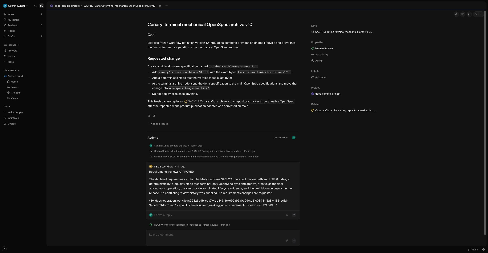

# Terminal mechanical OpenSpec archive canary

*2026-08-18T08:10:47Z by Showboat 0.6.1*
<!-- showboat-id: 9b157d56-8d76-4c13-b3d0-fe32fbf30906 -->

SAC-112 changes newly admitted runs to definition version 10, where final approval is the last authority gate and only native OpenSpec archive may follow. This record separates disabled rollout checks, provider-originated Linear evidence, D1 business state, R2 artifacts, Sandbox cleanup, and Cloudflare executor state.

```bash
set -euo pipefail
set -a
source ./.env
set +a
export CLOUDFLARE_API_TOKEN="${CLOUDFLARE_API_TOKEN:-$CLOUDFLARE_TOKEN}"
npx wrangler d1 execute DB --remote --config wrangler.queue-consumer-ts.jsonc --command "SELECT project_id, definition_id, definition_version, dispatch_enabled, updated_at FROM project_workflow_policies; SELECT run_id, current_node, status, definition_version, updated_at FROM orchestration_runs ORDER BY updated_at DESC LIMIT 10;"
```

```output

 ⛅️ wrangler 4.123.0
────────────────────
Resource location: remote 

🌀 Executing on remote database DB (4e854f8a-018a-42c4-a325-c4b8805c06b2):
🌀 To execute on your local development database, remove the --remote flag from your wrangler command.
🚣 Executed 2 commands in 1.54ms
[
  {
    "results": [
      {
        "project_id": "99426d9b-cda7-4db4-9136-692a95a0b090",
        "definition_id": "openspec-delivery",
        "definition_version": 9,
        "dispatch_enabled": 0,
        "updated_at": "2026-08-18T08:01:50.673Z"
      }
    ],
    "success": true,
    "meta": {
      "served_by": "v3-prod",
      "served_by_region": "WEUR",
      "served_by_colo": "AMS",
      "served_by_primary": true,
      "timings": {
        "sql_duration_ms": 0.6694
      },
      "duration": 0.6694,
      "changes": 0,
      "last_row_id": 0,
      "changed_db": false,
      "size_after": 1515520,
      "rows_read": 1,
      "rows_written": 0,
      "total_attempts": 1
    }
  },
  {
    "results": [
      {
        "run_id": "workflow:99426d9b-cda7-4db4-9136-692a95a0b090:fbb2c3e5-e993-4a29-8fbe-0998b27305f5:run:8",
        "current_node": "requirements_approval",
        "status": "failed",
        "definition_version": 2,
        "updated_at": "2026-08-18 07:33:35"
      },
      {
        "run_id": "workflow:99426d9b-cda7-4db4-9136-692a95a0b090:6839b197-f5b4-4ea5-be4d-78ee0ecf713c:run:1",
        "current_node": "requirements",
        "status": "failed",
        "definition_version": 5,
        "updated_at": "2026-08-18 07:33:35"
      },
      {
        "run_id": "workflow:99426d9b-cda7-4db4-9136-692a95a0b090:8e9ae257-8cc6-445c-81b4-d50f9bfea92b:run:1",
        "current_node": "requirements_review",
        "status": "failed",
        "definition_version": 6,
        "updated_at": "2026-08-18 07:33:35"
      },
      {
        "run_id": "workflow:99426d9b-cda7-4db4-9136-692a95a0b090:2fd18891-2272-453e-a3cc-174a236e28f9:run:1",
        "current_node": "release_approval",
        "status": "canceled",
        "definition_version": 8,
        "updated_at": "2026-08-18 07:33:35"
      },
      {
        "run_id": "workflow:99426d9b-cda7-4db4-9136-692a95a0b090:f8f5ec87-10e3-4128-9fe8-67ee14a90a01:run:1",
        "current_node": "openspec_tasks",
        "status": "canceled",
        "definition_version": 9,
        "updated_at": "2026-08-18 07:09:03"
      },
      {
        "run_id": "workflow:99426d9b-cda7-4db4-9136-692a95a0b090:050c7a52-d4fe-4e95-9ec3-6d228daec3d6:run:1",
        "current_node": "requirements",
        "status": "failed",
        "definition_version": 9,
        "updated_at": "2026-08-18 06:09:50"
      },
      {
        "run_id": "workflow:99426d9b-cda7-4db4-9136-692a95a0b090:9bbfbd28-224c-484f-975f-538b50524d18:run:1",
        "current_node": "blocked",
        "status": "blocked",
        "definition_version": 7,
        "updated_at": "2026-08-17T12:07:52.475Z"
      },
      {
        "run_id": "workflow:99426d9b-cda7-4db4-9136-692a95a0b090:e3b0968e-79ba-468d-8bf4-d42f9d5338e1:run:1",
        "current_node": "agent_failed",
        "status": "failed",
        "definition_version": 4,
        "updated_at": "2026-08-17T07:15:45.787Z"
      },
      {
        "run_id": "workflow:99426d9b-cda7-4db4-9136-692a95a0b090:976b22ad-57a8-428e-9d6e-41c71b597509:run:1",
        "current_node": "agent_failed",
        "status": "failed",
        "definition_version": 4,
        "updated_at": "2026-08-17T07:11:18.395Z"
      },
      {
        "run_id": "workflow:99426d9b-cda7-4db4-9136-692a95a0b090:127713e8-4f9a-40a6-87aa-0754ac28b6ee:run:3",
        "current_node": "blocked",
        "status": "blocked",
        "definition_version": 2,
        "updated_at": "2026-08-16T10:41:55.082Z"
      }
    ],
    "success": true,
    "meta": {
      "served_by": "v3-prod",
      "served_by_region": "WEUR",
      "served_by_colo": "AMS",
      "served_by_primary": true,
      "timings": {
        "sql_duration_ms": 0.8687
      },
      "duration": 0.8687,
      "changes": 0,
      "last_row_id": 0,
      "changed_db": false,
      "size_after": 1515520,
      "rows_read": 38,
      "rows_written": 0,
      "total_attempts": 1
    }
  }
]
```

Before deployment, remote D1 showed the sole project policy disabled at definition version 9 and no recent active or waiting run. The supported deployment script keeps the checked TRIAL_DISPATCH_ENABLED=false configuration while applying migrations, refreshing secrets, and rolling out the Worker and pinned Sandbox container.

```bash
set -euo pipefail
set -a
source ./.env
set +a
export CLOUDFLARE_API_TOKEN="${CLOUDFLARE_API_TOKEN:-$CLOUDFLARE_TOKEN}"
./scripts/deploy-orchestration.sh
```

```output
Required secret is not set: CODEX_AUTH_ENCRYPTION_KEY
```

The supported wrapper stopped before mutation because this checkout intentionally does not retain the Codex encryption key. This change needs no secret rotation or schema migration, so the rollout continues as a code-only Wrangler deployment that preserves the already-deployed secret bindings.

```bash
set -euo pipefail
set -a
source ./.env
set +a
export CLOUDFLARE_API_TOKEN="${CLOUDFLARE_API_TOKEN:-$CLOUDFLARE_TOKEN}"
npx wrangler secret list --config wrangler.queue-consumer-ts.jsonc
npx wrangler d1 migrations list DB --remote --config wrangler.queue-consumer-ts.jsonc
npx wrangler versions list --config wrangler.queue-consumer-ts.jsonc
```

```output
[
  {
    "name": "CAPABILITY_SIGNING_SECRET",
    "type": "secret_text"
  },
  {
    "name": "CLEANUP_AUDIT_SECRET",
    "type": "secret_text"
  },
  {
    "name": "CODEX_AUTH_ENCRYPTION_KEY",
    "type": "secret_text"
  },
  {
    "name": "GITHUB_APP_ID",
    "type": "secret_text"
  },
  {
    "name": "GITHUB_APP_PRIVATE_KEY",
    "type": "secret_text"
  },
  {
    "name": "GITHUB_INSTALLATION_ID",
    "type": "secret_text"
  },
  {
    "name": "LINEAR_API_KEY",
    "type": "secret_text"
  },
  {
    "name": "LINEAR_APP_ACCESS_TOKEN",
    "type": "secret_text"
  }
]

 ⛅️ wrangler 4.123.0
────────────────────
Resource location: remote 

✅ No migrations to apply!

 ⛅️ wrangler 4.123.0
────────────────────
Version ID:  6c7638eb-8318-43b8-a4ec-82f128f888bc
Created:     2026-08-17T06:56:22.683Z
Author:      sachin.kundu@pm.me
Source:      Upload
Tag:         -
Message:     -

Version ID:  08ac4216-7e28-444c-a29b-7e7186c9a036
Created:     2026-08-17T07:09:56.964Z
Author:      sachin.kundu@pm.me
Source:      Upload
Tag:         -
Message:     -

Version ID:  d07bba60-bffd-4eb1-8d2c-30f8b672197b
Created:     2026-08-17T07:18:38.118Z
Author:      sachin.kundu@pm.me
Source:      Upload
Tag:         -
Message:     -

Version ID:  09d963d7-421c-403b-ae8e-31053dbf543c
Created:     2026-08-17T11:00:51.306Z
Author:      sachin.kundu@pm.me
Source:      Upload
Tag:         -
Message:     -

Version ID:  33de7fba-d0dd-493e-a3c9-65dcc4d6d898
Created:     2026-08-17T11:08:36.759Z
Author:      sachin.kundu@pm.me
Source:      Upload
Tag:         -
Message:     -

Version ID:  d2ce6452-16a8-467d-8144-82480b0303db
Created:     2026-08-17T11:23:24.306Z
Author:      sachin.kundu@pm.me
Source:      Upload
Tag:         -
Message:     -

Version ID:  4bf61aad-e173-4da3-a123-5f618e3fc771
Created:     2026-08-17T11:36:58.495Z
Author:      sachin.kundu@pm.me
Source:      Upload
Tag:         -
Message:     -

Version ID:  23738e32-dafd-488f-b046-5ef41dd5110c
Created:     2026-08-17T12:05:53.081Z
Author:      sachin.kundu@pm.me
Source:      Upload
Tag:         -
Message:     -

Version ID:  d2062f82-6d7b-4d0c-afa7-a671bd5bba71
Created:     2026-08-17T13:22:04.839Z
Author:      sachin.kundu@pm.me
Source:      Upload
Tag:         -
Message:     -

Version ID:  145b65b3-5966-4da6-a20f-06c9cca52c61
Created:     2026-08-18T05:58:29.824Z
Author:      sachin.kundu@pm.me
Source:      Upload
Tag:         -
Message:     -

```

```bash
set -euo pipefail
set -a
source ./.env
set +a
export CLOUDFLARE_API_TOKEN="${CLOUDFLARE_API_TOKEN:-$CLOUDFLARE_TOKEN}"
npx wrangler deploy --config wrangler.queue-consumer-ts.jsonc --containers-rollout gradual
```

```output

 ⛅️ wrangler 4.123.0
────────────────────
Total Upload: 1038.25 KiB / gzip: 218.60 KiB
Worker Startup Time: 9 ms
Your Worker has access to the following bindings:
Binding                                                                              Resource                  
env.Sandbox (Sandbox)                                                                Durable Object            
env.ORCHESTRATION_WORKFLOW (DeosWorkflow)                                            Workflow                  
env.DB (deos-sample-project)                                                         D1 Database               
env.ARTIFACTS (deos-sample-project-artifacts)                                        R2 Bucket                 
env.LINEAR_API_URL ("https://api.linear.app/graphql")                                Environment Variable      
env.LINEAR_HUMAN_APPROVAL_STATE_ID ("71738607-03fd-49f2-b4be-b2aac29ccd13")          Environment Variable      
env.LINEAR_PROJECT_ID ("99426d9b-cda7-4db4-9136-692a95a0b090")                       Environment Variable      
env.LINEAR_START_STATE_NAME ("In Progress")                                          Environment Variable      
env.LINEAR_APPROVAL_STATE_NAMES ("In Progress")                                      Environment Variable      
env.LINEAR_REJECTION_STATE_NAMES ("Canceled")                                        Environment Variable      
env.LINEAR_APP_ACTOR_ID ("f010429f-7734-4f3f-9b4b-13a4abb9b4ab")                     Environment Variable      
env.LINEAR_TEAM_ID ("ac53207d-68c0-42f1-a245-c1baf047f234")                          Environment Variable      
env.GITHUB_API_URL ("https://api.github.com")                                        Environment Variable      
env.TRIAL_REPOSITORY ("sachinkundu/deos")                                            Environment Variable      
env.TRIAL_DISPATCH_ENABLED ("false")                                                 Environment Variable      
env.CODEX_AUTH_PROFILE_ID ("controlled-trial")                                       Environment Variable      
env.CAPABILITY_BASE_URL ("https://deos-queue-consumer-ts.skundu...")                 Environment Variable      

The following containers are available:
- deos-queue-consumer-ts-sandbox (/Users/sachin/code/deos/Dockerfile)

Uploaded deos-queue-consumer-ts (6.19 sec)
Building image deos-queue-consumer-ts-sandbox:747be2d7
#0 building with "colima" instance using docker driver

#1 [internal] load build definition from Dockerfile
#1 transferring dockerfile: 766B done
#1 DONE 0.0s

#2 [internal] load metadata for docker.io/cloudflare/sandbox:0.13.0-next.738.2@sha256:f4b2137219568aa44539ab93c0e774db6bcab323c134c5088447916e58f15e75
#2 DONE 0.0s

#3 [internal] load .dockerignore
#3 transferring context: 2B done
#3 DONE 0.0s

#4 [1/8] FROM docker.io/cloudflare/sandbox:0.13.0-next.738.2@sha256:f4b2137219568aa44539ab93c0e774db6bcab323c134c5088447916e58f15e75
#4 resolve docker.io/cloudflare/sandbox:0.13.0-next.738.2@sha256:f4b2137219568aa44539ab93c0e774db6bcab323c134c5088447916e58f15e75 done
#4 DONE 0.0s

#5 [internal] load build context
#5 transferring context: 204B done
#5 DONE 0.0s

#6 [4/8] COPY container/supervisor.mjs /deos/bin/supervisor.mjs
#6 CACHED

#7 [3/8] RUN mkdir -p /deos/bin /deos/staging /deos/jobs /deos/auth     && chmod 700 /deos/auth     && chmod 755 /deos/bin /deos/staging /deos/jobs
#7 CACHED

#8 [2/8] RUN npm install --global --omit=dev @openai/codex@0.147.0 @fission-ai/openspec@1.8.0
#8 CACHED

#9 [6/8] COPY container/deos-github /usr/local/bin/deos-github
#9 CACHED

#10 [5/8] COPY container/patch-capture.mjs /deos/bin/patch-capture.mjs
#10 CACHED

#11 [7/8] COPY container/deos-linear /usr/local/bin/deos-linear
#11 CACHED

#12 [8/8] RUN chmod 755 /deos/bin/supervisor.mjs /usr/local/bin/deos-github /usr/local/bin/deos-linear     && codex --version     && openspec --version
#12 CACHED

#13 exporting to image
#13 exporting layers done
#13 exporting manifest sha256:5a8186dc62b3d354ffd79bdf490ca0677748f108c37401e1d65dcf0a85085656 done
#13 exporting config sha256:ecf2f04d5580b07a6c6e8b3dde4b2b4d31eaf32b6fe36c1db7336e6912f1abbf done
#13 naming to docker.io/library/deos-queue-consumer-ts-sandbox:747be2d7 done
#13 DONE 0.0s

WARNING! Your credentials are stored unencrypted in '/Users/sachin/.docker/config.json'.
Configure a credential helper to remove this warning. See
https://docs.docker.com/go/credential-store/

Login Succeeded
Image already exists remotely, skipping push
Untagged: deos-queue-consumer-ts-sandbox:747be2d7
╭ Deploy a container application deploy changes to your application
│
│ Container application changes
│
├ no changes deos-queue-consumer-ts-sandbox
│
╰ No changes to be made 

Deployed deos-queue-consumer-ts triggers (6.42 sec)
  https://deos-queue-consumer-ts.skundu.workers.dev
  schedule: */15 * * * *
  Consumer for deos-sample-project-events
  workflow: deos-sandbox-codex-workflow
Current Version ID: 747be2d7-00e6-482d-a392-25a586c4a645
```

```bash
set -euo pipefail
set -a
source ./.env
set +a
export CLOUDFLARE_API_TOKEN="${CLOUDFLARE_API_TOKEN:-$CLOUDFLARE_TOKEN}"
npx wrangler versions list --config wrangler.queue-consumer-ts.jsonc --json | jq -c ".[ -1 ] | {id, created_on: .metadata.created_on}"
npx wrangler d1 execute DB --remote --config wrangler.queue-consumer-ts.jsonc --command "SELECT project_id, definition_version, dispatch_enabled FROM project_workflow_policies; SELECT definition_id, version, digest, json_extract(canonical_json, char(36) || char(46) || char(110) || char(111) || char(100) || char(101) || char(115) || char(46) || char(111) || char(112) || char(101) || char(110) || char(115) || char(112) || char(101) || char(99) || char(95) || char(118) || char(101) || char(114) || char(105) || char(102) || char(121) || char(46) || char(101) || char(100) || char(103) || char(101) || char(115) || char(46) || char(99) || char(111) || char(109) || char(112) || char(108) || char(101) || char(116) || char(101) || char(100)) AS verify_next, json_extract(canonical_json, char(36) || char(46) || char(110) || char(111) || char(100) || char(101) || char(115) || char(46) || char(102) || char(105) || char(110) || char(97) || char(108) || char(95) || char(97) || char(112) || char(112) || char(114) || char(111) || char(118) || char(97) || char(108) || char(46) || char(101) || char(100) || char(103) || char(101) || char(115) || char(46) || char(97) || char(112) || char(112) || char(114) || char(111) || char(118) || char(101) || char(100)) AS approval_next FROM workflow_definitions ORDER BY version DESC LIMIT 1;" --json | jq -c "map(.results)"
```

```output
{"id":"747be2d7-00e6-482d-a392-25a586c4a645","created_on":"2026-08-18T08:11:44.460242Z"}
[[{"project_id":"99426d9b-cda7-4db4-9136-692a95a0b090","definition_version":10,"dispatch_enabled":0}],[{"definition_id":"openspec-delivery","version":10,"digest":"b648d257f546ab130984c26d564c162de648a5929e3520dd1f12e594f0e6db12","verify_next":"final_approval","approval_next":"sync_and_archive"}]]
```

SAC-116 was the real provider registration probe only; dispatch stayed disabled and no run was allocated. After exact version-10 graph verification, the one configured test-project policy is enabled for a fresh canary admission.

```bash
set -euo pipefail
set -a
source ./.env
set +a
export CLOUDFLARE_API_TOKEN="${CLOUDFLARE_API_TOKEN:-$CLOUDFLARE_TOKEN}"
npx wrangler d1 execute DB --remote --config wrangler.queue-consumer-ts.jsonc --command "UPDATE project_workflow_policies SET dispatch_enabled = 1, updated_at = datetime(\"now\") WHERE project_id = \"99426d9b-cda7-4db4-9136-692a95a0b090\"; SELECT project_id, definition_version, definition_digest, dispatch_enabled FROM project_workflow_policies WHERE project_id = \"99426d9b-cda7-4db4-9136-692a95a0b090\";" --json | jq -c "map(.results)"
```

```output
[[],[{"project_id":"99426d9b-cda7-4db4-9136-692a95a0b090","definition_version":10,"definition_digest":"b648d257f546ab130984c26d564c162de648a5929e3520dd1f12e594f0e6db12","dispatch_enabled":1}]]
```

```bash
set -euo pipefail
set -a
source ./.env
set +a
export CLOUDFLARE_API_TOKEN="${CLOUDFLARE_API_TOKEN:-$CLOUDFLARE_TOKEN}"
npx wrangler d1 execute DB --remote --config wrangler.queue-consumer-ts.jsonc --command "SELECT run_id, issue_id, workflow_instance_id, current_node, current_visit_sequence, status, definition_version, definition_digest, created_at, updated_at FROM orchestration_runs WHERE definition_version = 10 ORDER BY created_at DESC; SELECT delivery_id, classification, received_at FROM deliveries ORDER BY received_at DESC LIMIT 5;" --json | jq -c "map(.results)"
```

```output
[[{"run_id":"workflow:99426d9b-cda7-4db4-9136-692a95a0b090:db9d3444-1bc5-43af-bd80-3499a1e77d6b:run:1","issue_id":"db9d3444-1bc5-43af-bd80-3499a1e77d6b","workflow_instance_id":"wf-v1-apccvv7oaedgnm35fach2kwxavmeaayklhmo3qcv5a57jco7ae5q","current_node":"requirements","current_visit_sequence":1,"status":"active","definition_version":10,"definition_digest":"b648d257f546ab130984c26d564c162de648a5929e3520dd1f12e594f0e6db12","created_at":"2026-08-18T08:14:18.459Z","updated_at":"2026-08-18T08:14:18.459Z"}],[{"delivery_id":"8c3831a1-6406-45fc-a9b2-89f939968788","classification":"relevant","received_at":"2026-08-18T08:14:12.236999+00:00"},{"delivery_id":"42c6108b-46f2-4321-a7f5-8bd2b77cace4","classification":"relevant","received_at":"2026-08-18T08:13:49.300999+00:00"},{"delivery_id":"25e98f66-89f7-4a56-9508-e5ad5152578d","classification":"relevant","received_at":"2026-08-18T08:12:53.772000+00:00"},{"delivery_id":"90520b69-9c4d-45cc-93b3-762d93cfbb1f","classification":"relevant","received_at":"2026-08-18T08:01:44.481999+00:00"},{"delivery_id":"99724211-c718-4cd9-894b-28dc51d4cf58","classification":"relevant","received_at":"2026-08-18T07:53:00.497999+00:00"}]]
```

```bash
set -euo pipefail
set -a
source ./.env
set +a
export CLOUDFLARE_API_TOKEN="${CLOUDFLARE_API_TOKEN:-$CLOUDFLARE_TOKEN}"
npx wrangler d1 execute DB --remote --config wrangler.queue-consumer-ts.jsonc --command "SELECT run_id, current_node, current_visit_sequence, status, updated_at FROM orchestration_runs WHERE run_id = \"workflow:99426d9b-cda7-4db4-9136-692a95a0b090:db9d3444-1bc5-43af-bd80-3499a1e77d6b:run:1\"; SELECT node_id, attempt_id, state, result_class, cleanup_state, manifest_id, created_at, updated_at FROM agent_attempts WHERE run_id = \"workflow:99426d9b-cda7-4db4-9136-692a95a0b090:db9d3444-1bc5-43af-bd80-3499a1e77d6b:run:1\" ORDER BY created_at; SELECT from_node, to_node, from_visit_sequence, to_visit_sequence, cause_type, cause_reference FROM workflow_transitions_v2 WHERE run_id = \"workflow:99426d9b-cda7-4db4-9136-692a95a0b090:db9d3444-1bc5-43af-bd80-3499a1e77d6b:run:1\" ORDER BY from_visit_sequence;" --json | jq -c "map(.results)"
```

```output
[[{"run_id":"workflow:99426d9b-cda7-4db4-9136-692a95a0b090:db9d3444-1bc5-43af-bd80-3499a1e77d6b:run:1","current_node":"requirements","current_visit_sequence":1,"status":"active","updated_at":"2026-08-18T08:14:18.459Z"}],[{"node_id":"requirements","attempt_id":"01a013ef-9ce3-7a05-8f28-5a5038789435","state":"failed","result_class":"startup_failed","cleanup_state":"destroyed","manifest_id":null,"created_at":"2026-08-18T08:14:25.507Z","updated_at":"2026-08-18T08:14:30.035Z"}],[]]
```

SAC-117 was admitted under version 10, but its first requirements attempt failed during startup and cleaned up. The bounded telemetry helper found no retained Workers Observability events for the exact issue UUID, so diagnosis continues from D1 and the exact Cloudflare Workflow instance.

```bash
set -euo pipefail
set -a
source ./.env
set +a
export CLOUDFLARE_API_TOKEN="${CLOUDFLARE_API_TOKEN:-$CLOUDFLARE_TOKEN}"
npx wrangler workflows instances describe deos-sandbox-codex-workflow wf-v1-apccvv7oaedgnm35fach2kwxavmeaayklhmo3qcv5a57jco7ae5q --config wrangler.queue-consumer-ts.jsonc
```

```output

 ⛅️ wrangler 4.123.0
────────────────────
Describing latest instance:
Workflow Name:         deos-sandbox-codex-workflow
Instance Id:           wf-v1-apccvv7oaedgnm35fach2kwxavmeaayklhmo3qcv5a57jco7ae5q
Version Id:            0c4c084c-9bc1-4d45-a01c-82109aa05b0b
Status:                ✅ Completed
Trigger:               🔗 Binding
Queued:                8/18/2026, 11:14:22 AM
Success:               ✅ Yes
Start:                 8/18/2026, 11:14:24 AM
End:                   8/18/2026, 11:14:41 AM
Duration:              16 seconds
Last Successful Step:  authority:workflow:99426d9b-cda7-4db4-9136-692a95a0b090:db9d3444-1bc5-43af-bd80-3499a1e77d6b:run:1-2
Steps:

  Name:      authority:workflow:99426d9b-cda7-4db4-9136-692a95a0b090:db9d3444-1bc5-43af-bd80-3499a1e77d6b:run:1-1
  Type:      🎯 Step
  Start:     8/18/2026, 11:14:24 AM
  End:       8/18/2026, 11:14:25 AM
  Duration:  0 seconds
  Success:   ✅ Yes
  Output:    "{\"run_id\":\"workflow:99426d9b-cda7-4db4-9136-692a95a0b090:db9d3444-1bc5-43af-bd80-3499a1e77d6b:run:1\",\"correlation_id\":\"workflow:99426d9b-cda7-4db4-9136-692a95a0b090:db9d3444-1bc5-43af-bd80-3499a1e77d6b\",\"run_sequence\":1,\"project_id\":\"99426d9b-cda7-4db4-9136-692a95a0b090\",\"issue_id\":\"db9d3444-1bc5-43af-bd80-3499a1e77d6b\",\"definition_id\":\"openspec-delivery\",\"definition_version\":10,\"definition_digest\":\"b648d257f546ab130984c26d564c162de648a5929e3520dd1f12e594f0e6db12\",\"workflow_instance_id\":\"wf-v1-apccvv7oaedgnm35fach2kwxavmeaayklhmo3qcv5a57jco7ae5q\",\"previous_node\":null,\"current_node\":\"requirements\",\"gate_origin_node\":null,\"status\":\"active\",\"accumulated_data_json\":\"{}\",\"created_at\":\"2026-08-18T08:14:18.459Z\",\"updated_at\":\"2026-08-18T08:14:18.459Z\",\"terminal_at\":null,\"terminal_cause\":null,\"current_visit_sequence\":1,\"last_transition_id\":null}"
┌────────────────────────┬────────────────────────┬───────────┬────────────┐
│ Start                  │ End                    │ Duration  │ State      │
├────────────────────────┼────────────────────────┼───────────┼────────────┤
│ 8/18/2026, 11:14:24 AM │ 8/18/2026, 11:14:25 AM │ 0 seconds │ ✅ Success │
└────────────────────────┴────────────────────────┴───────────┴────────────┘

  Name:      agent:requirements:visit:1-1
  Type:      🎯 Step
  Start:     8/18/2026, 11:14:25 AM
  End:       8/18/2026, 11:14:40 AM
  Duration:  15 seconds
  Success:   ✅ Yes
  Output:    "{\"state\":\"completed\",\"attemptId\":\"01a013ef-9ce3-7a05-8f28-5a5038789435\",\"sandboxId\":\"sbx-v1-kbyvyzytoblpkk44e4mupxlwaf7dzcqmxx3dfbzlmmi7t65vyh5a\",\"manifestId\":null,\"outcome\":{\"kind\":\"agent\",\"outcome\":\"failed\",\"providerReceiptsPresent\":false,\"providerReceiptsComplete\":false}}"
┌────────────────────────┬────────────────────────┬───────────┬────────────┬───────────────────────────────────────────────────┐
│ Start                  │ End                    │ Duration  │ State      │ Error                                             │
├────────────────────────┼────────────────────────┼───────────┼────────────┼───────────────────────────────────────────────────┤
│ 8/18/2026, 11:14:25 AM │ 8/18/2026, 11:14:30 AM │ 5 seconds │ ❌ Error   │ Error: Codex credential profile is already leased │
├────────────────────────┼────────────────────────┼───────────┼────────────┼───────────────────────────────────────────────────┤
│ 8/18/2026, 11:14:40 AM │ 8/18/2026, 11:14:40 AM │ 0 seconds │ ✅ Success │                                                   │
└────────────────────────┴────────────────────────┴───────────┴────────────┴───────────────────────────────────────────────────┘

  Name:      transition:requirements:failed:visit:1-1
  Type:      🎯 Step
  Start:     8/18/2026, 11:14:40 AM
  End:       8/18/2026, 11:14:40 AM
  Duration:  0 seconds
  Success:   ✅ Yes
  Output:    "{\"transitioned\":true}"
┌────────────────────────┬────────────────────────┬───────────┬────────────┐
│ Start                  │ End                    │ Duration  │ State      │
├────────────────────────┼────────────────────────┼───────────┼────────────┤
│ 8/18/2026, 11:14:40 AM │ 8/18/2026, 11:14:40 AM │ 0 seconds │ ✅ Success │
└────────────────────────┴────────────────────────┴───────────┴────────────┘

  Name:      authority:workflow:99426d9b-cda7-4db4-9136-692a95a0b090:db9d3444-1bc5-43af-bd80-3499a1e77d6b:run:1-2
  Type:      🎯 Step
  Start:     8/18/2026, 11:14:40 AM
  End:       8/18/2026, 11:14:41 AM
  Duration:  0 seconds
  Success:   ✅ Yes
  Output:    "{\"run_id\":\"workflow:99426d9b-cda7-4db4-9136-692a95a0b090:db9d3444-1bc5-43af-bd80-3499a1e77d6b:run:1\",\"correlation_id\":\"workflow:99426d9b-cda7-4db4-9136-692a95a0b090:db9d3444-1bc5-43af-bd80-3499a1e77d6b\",\"run_sequence\":1,\"project_id\":\"99426d9b-cda7-4db4-9136-692a95a0b090\",\"issue_id\":\"db9d3444-1bc5-43af-bd80-3499a1e77d6b\",\"definition_id\":\"openspec-delivery\",\"definition_version\":10,\"definition_digest\":\"b648d257f546ab130984c26d564c162de648a5929e3520dd1f12e594f0e6db12\",\"workflow_instance_id\":\"wf-v1-apccvv7oaedgnm35fach2kwxavmeaayklhmo3qcv5a57jco7ae5q\",\"previous_node\":\"requirements\",\"current_node\":\"blocked\",\"gate_origin_node\":null,\"status\":\"blocked\",\"accumulated_data_json\":\"{}\",\"created_at\":\"2026-08-18T08:14:18.459Z\",\"updated_at\":\"2026-08-18T08:14:40.533Z\",\"terminal_at\":\"2026-08-18T08:14:40.533Z\",\"terminal_cause\":null,\"current_visit_sequence\":2,\"last_transition_id\":\"workflow:99426d9b-cda7-4db4-9136-692a95a0b090:db9d3444-1bc5-43af-bd80-3499a1e77d6b:run:1:visit:1:transition\"}"
┌────────────────────────┬────────────────────────┬───────────┬────────────┐
│ Start                  │ End                    │ Duration  │ State      │
├────────────────────────┼────────────────────────┼───────────┼────────────┤
│ 8/18/2026, 11:14:40 AM │ 8/18/2026, 11:14:41 AM │ 0 seconds │ ✅ Success │
└────────────────────────┴────────────────────────┴───────────┴────────────┘
```

```bash
set -euo pipefail
set -a
source ./.env
set +a
export CLOUDFLARE_API_TOKEN="${CLOUDFLARE_API_TOKEN:-$CLOUDFLARE_TOKEN}"
npx wrangler d1 execute DB --remote --config wrangler.queue-consumer-ts.jsonc --command "SELECT profile_id, attempt_id, lease_expires_at, created_at, updated_at, refresh_outcome FROM credential_leases; SELECT run_id, node_id, state, cleanup_state, ended_at, updated_at FROM agent_attempts WHERE attempt_id IN (SELECT attempt_id FROM credential_leases);" --json | jq -c "map(.results)"
```

```output
[[{"profile_id":"controlled-trial","attempt_id":"01a013b2-9f38-76ec-b531-077b2f09f20e","lease_expires_at":"2026-08-19T07:22:52.030Z","created_at":"2026-08-18T07:07:52.030Z","updated_at":"2026-08-18T07:07:52.030Z","refresh_outcome":null}],[{"run_id":"workflow:99426d9b-cda7-4db4-9136-692a95a0b090:f8f5ec87-10e3-4128-9fe8-67ee14a90a01:run:1","node_id":"openspec_tasks","state":"canceled","cleanup_state":"destroyed","ended_at":"2026-08-18 07:09:03","updated_at":"2026-08-18T07:15:08.989Z"}]]
```

```bash
set -euo pipefail
set -a
source ./.env
set +a
export CLOUDFLARE_API_TOKEN="${CLOUDFLARE_API_TOKEN:-$CLOUDFLARE_TOKEN}"
npx wrangler containers instances a0344373-884d-4c06-b4c2-4e58295de498 --search sbx-v1-pf4olnsjb5fetbwxlzlnwph6oavxgqtdzfj2jejqhdj7imbafaoa --json
```

```output
[]
```

```bash
set -euo pipefail
set -a
source ./.env
set +a
export CLOUDFLARE_API_TOKEN="${CLOUDFLARE_API_TOKEN:-$CLOUDFLARE_TOKEN}"
npx wrangler containers instances a0344373-884d-4c06-b4c2-4e58295de498 --search sbx-v1-34vja2l36f4f5z2xzhqq4qk4hw7o2kwcwyn2qp3652x2wxxzd3wq --json
```

```output
[
    {
        "id": "5f90e256a7c0d3710ac26eb441e0d8c828ee07bcb1295c70dd187cae18d74e38",
        "name": "sbx-v1-34vja2l36f4f5z2xzhqq4qk4hw7o2kwcwyn2qp3652x2wxxzd3wq",
        "state": "inactive",
        "location": null,
        "version": null,
        "created": "2026-08-18T07:15:09Z"
    }
]
```

The failed SAC-117 attempt exposed a stale credential lease from a prior canceled SAC-110 attempt. D1 marks that exact attempt canceled and cleanup destroyed; Cloudflare inventory shows its named Sandbox inactive. The next mutation deletes only that exact lease under terminal-attempt and destroyed-cleanup guards.

```bash
set -euo pipefail
set -a
source ./.env
set +a
export CLOUDFLARE_API_TOKEN="${CLOUDFLARE_API_TOKEN:-$CLOUDFLARE_TOKEN}"
npx wrangler d1 execute DB --remote --config wrangler.queue-consumer-ts.jsonc --command "DELETE FROM credential_leases WHERE profile_id = \"controlled-trial\" AND attempt_id = \"01a013b2-9f38-76ec-b531-077b2f09f20e\" AND EXISTS (SELECT 1 FROM agent_attempts WHERE attempt_id = \"01a013b2-9f38-76ec-b531-077b2f09f20e\" AND state = \"canceled\" AND cleanup_state = \"destroyed\"); SELECT profile_id, attempt_id FROM credential_leases;" --json | jq -c "map(.results)"
```

```output
[[],[]]
```

SAC-118's requirements agent published PR #41. GitHub read-back proved the second operation wrote commit ed7fa02e to the same forced attempt branch after PR creation; PR REST id 4302820440 and both exact operation markers are now present. The following guarded update reconciles only that provider-backed operation.

```bash
set -euo pipefail
set -a
source ./.env
set +a
export CLOUDFLARE_API_TOKEN="${CLOUDFLARE_API_TOKEN:-$CLOUDFLARE_TOKEN}"
npx wrangler d1 execute DB --remote --config wrangler.queue-consumer-ts.jsonc --command "UPDATE provider_operations SET state = \"reconciled\", provider_resource_id = \"4302820440\", safe_error_category = NULL, updated_at = datetime(\"now\"), completed_at = datetime(\"now\") WHERE operation_id = \"workflow:99426d9b-cda7-4db4-9136-692a95a0b090:c4263ed8-c9dc-4b7b-bef5-8757adefebec:run:1:capability:github:publish_work_product:requirements-publish-sac-118-v2:1\" AND state = \"manual_reconciliation_required\"; SELECT operation_id, state, provider_resource_id FROM provider_operations WHERE attempt_id = \"01a013f2-0979-71d1-bf02-fd3a06a7e609\" ORDER BY started_at;" --json | jq -c "map(.results)"
```

```output
[[],[{"operation_id":"workflow:99426d9b-cda7-4db4-9136-692a95a0b090:c4263ed8-c9dc-4b7b-bef5-8757adefebec:run:1:capability:github:publish_work_product:requirements-publish-sac-118-v1:1","state":"succeeded","provider_resource_id":"4302820440"},{"operation_id":"workflow:99426d9b-cda7-4db4-9136-692a95a0b090:c4263ed8-c9dc-4b7b-bef5-8757adefebec:run:1:capability:github:publish_work_product:requirements-publish-sac-118-v2:1","state":"reconciled","provider_resource_id":"4302820440"}]]
```

Manual receipt reconciliation cannot change the cached output of the already-completed Workflow step, so SAC-118 cannot recover without inventing a transition. Admission is disabled before terminating only this stuck canary executor and marking its run failed.

```bash
set -euo pipefail
set -a
source ./.env
set +a
export CLOUDFLARE_API_TOKEN="${CLOUDFLARE_API_TOKEN:-$CLOUDFLARE_TOKEN}"
npx wrangler d1 execute DB --remote --config wrangler.queue-consumer-ts.jsonc --command "UPDATE project_workflow_policies SET dispatch_enabled = 0, updated_at = datetime(\"now\") WHERE project_id = \"99426d9b-cda7-4db4-9136-692a95a0b090\"; SELECT project_id, definition_version, dispatch_enabled FROM project_workflow_policies;" --json | jq -c "map(.results)"
npx wrangler workflows instances terminate deos-sandbox-codex-workflow wf-v1-qrzgcz33igsx3qxkpzfjp3xcwtu7leyomafcvzw3ehsrmffuit5q --config wrangler.queue-consumer-ts.jsonc
npx wrangler d1 execute DB --remote --config wrangler.queue-consumer-ts.jsonc --command "UPDATE orchestration_runs SET status = \"failed\", terminal_cause = \"canary_cached_receipt_incomplete\", terminal_at = datetime(\"now\"), updated_at = datetime(\"now\") WHERE run_id = \"workflow:99426d9b-cda7-4db4-9136-692a95a0b090:c4263ed8-c9dc-4b7b-bef5-8757adefebec:run:1\" AND current_node = \"requirements\" AND status = \"active\"; SELECT run_id, current_node, status, terminal_cause FROM orchestration_runs WHERE issue_id = \"c4263ed8-c9dc-4b7b-bef5-8757adefebec\";" --json | jq -c "map(.results)"
```

```output
[[],[{"project_id":"99426d9b-cda7-4db4-9136-692a95a0b090","definition_version":10,"dispatch_enabled":0}]]

 ⛅️ wrangler 4.123.0
────────────────────
🥷 The instance "wf-v1-qrzgcz33igsx3qxkpzfjp3xcwtu7leyomafcvzw3ehsrmffuit5q" from deos-sandbox-codex-workflow was terminated successfully
[[],[{"run_id":"workflow:99426d9b-cda7-4db4-9136-692a95a0b090:c4263ed8-c9dc-4b7b-bef5-8757adefebec:run:1","current_node":"requirements","status":"failed","terminal_cause":"canary_cached_receipt_incomplete"}]]
```

The live blocker led to commit 71bedc3 on main. A later publish on one forced attempt branch now updates the existing PR with the exact new operation marker and returns that provider receipt. All local delivery gates passed before this disabled redeploy.

```bash
set -euo pipefail
set -a
source ./.env
set +a
export CLOUDFLARE_API_TOKEN="${CLOUDFLARE_API_TOKEN:-$CLOUDFLARE_TOKEN}"
npx wrangler deploy --config wrangler.queue-consumer-ts.jsonc --containers-rollout gradual
```

```output

 ⛅️ wrangler 4.123.0
────────────────────
Total Upload: 1038.98 KiB / gzip: 218.75 KiB
Worker Startup Time: 10 ms
Your Worker has access to the following bindings:
Binding                                                                              Resource                  
env.Sandbox (Sandbox)                                                                Durable Object            
env.ORCHESTRATION_WORKFLOW (DeosWorkflow)                                            Workflow                  
env.DB (deos-sample-project)                                                         D1 Database               
env.ARTIFACTS (deos-sample-project-artifacts)                                        R2 Bucket                 
env.LINEAR_API_URL ("https://api.linear.app/graphql")                                Environment Variable      
env.LINEAR_HUMAN_APPROVAL_STATE_ID ("71738607-03fd-49f2-b4be-b2aac29ccd13")          Environment Variable      
env.LINEAR_PROJECT_ID ("99426d9b-cda7-4db4-9136-692a95a0b090")                       Environment Variable      
env.LINEAR_START_STATE_NAME ("In Progress")                                          Environment Variable      
env.LINEAR_APPROVAL_STATE_NAMES ("In Progress")                                      Environment Variable      
env.LINEAR_REJECTION_STATE_NAMES ("Canceled")                                        Environment Variable      
env.LINEAR_APP_ACTOR_ID ("f010429f-7734-4f3f-9b4b-13a4abb9b4ab")                     Environment Variable      
env.LINEAR_TEAM_ID ("ac53207d-68c0-42f1-a245-c1baf047f234")                          Environment Variable      
env.GITHUB_API_URL ("https://api.github.com")                                        Environment Variable      
env.TRIAL_REPOSITORY ("sachinkundu/deos")                                            Environment Variable      
env.TRIAL_DISPATCH_ENABLED ("false")                                                 Environment Variable      
env.CODEX_AUTH_PROFILE_ID ("controlled-trial")                                       Environment Variable      
env.CAPABILITY_BASE_URL ("https://deos-queue-consumer-ts.skundu...")                 Environment Variable      

The following containers are available:
- deos-queue-consumer-ts-sandbox (/Users/sachin/code/deos/Dockerfile)

Uploaded deos-queue-consumer-ts (6.74 sec)
Building image deos-queue-consumer-ts-sandbox:721e8399
#0 building with "colima" instance using docker driver

#1 [internal] load build definition from Dockerfile
#1 transferring dockerfile: 766B done
#1 DONE 0.0s

#2 [internal] load metadata for docker.io/cloudflare/sandbox:0.13.0-next.738.2@sha256:f4b2137219568aa44539ab93c0e774db6bcab323c134c5088447916e58f15e75
#2 DONE 0.0s

#3 [internal] load .dockerignore
#3 transferring context: 2B done
#3 DONE 0.0s

#4 [1/8] FROM docker.io/cloudflare/sandbox:0.13.0-next.738.2@sha256:f4b2137219568aa44539ab93c0e774db6bcab323c134c5088447916e58f15e75
#4 resolve docker.io/cloudflare/sandbox:0.13.0-next.738.2@sha256:f4b2137219568aa44539ab93c0e774db6bcab323c134c5088447916e58f15e75 done
#4 DONE 0.0s

#5 [internal] load build context
#5 transferring context: 204B done
#5 DONE 0.0s

#6 [4/8] COPY container/supervisor.mjs /deos/bin/supervisor.mjs
#6 CACHED

#7 [3/8] RUN mkdir -p /deos/bin /deos/staging /deos/jobs /deos/auth     && chmod 700 /deos/auth     && chmod 755 /deos/bin /deos/staging /deos/jobs
#7 CACHED

#8 [7/8] COPY container/deos-linear /usr/local/bin/deos-linear
#8 CACHED

#9 [2/8] RUN npm install --global --omit=dev @openai/codex@0.147.0 @fission-ai/openspec@1.8.0
#9 CACHED

#10 [6/8] COPY container/deos-github /usr/local/bin/deos-github
#10 CACHED

#11 [5/8] COPY container/patch-capture.mjs /deos/bin/patch-capture.mjs
#11 CACHED

#12 [8/8] RUN chmod 755 /deos/bin/supervisor.mjs /usr/local/bin/deos-github /usr/local/bin/deos-linear     && codex --version     && openspec --version
#12 CACHED

#13 exporting to image
#13 exporting layers done
#13 exporting manifest sha256:5a8186dc62b3d354ffd79bdf490ca0677748f108c37401e1d65dcf0a85085656 done
#13 exporting config sha256:ecf2f04d5580b07a6c6e8b3dde4b2b4d31eaf32b6fe36c1db7336e6912f1abbf done
#13 naming to docker.io/library/deos-queue-consumer-ts-sandbox:721e8399 done
#13 DONE 0.0s

WARNING! Your credentials are stored unencrypted in '/Users/sachin/.docker/config.json'.
Configure a credential helper to remove this warning. See
https://docs.docker.com/go/credential-store/

Login Succeeded
Image already exists remotely, skipping push
Untagged: deos-queue-consumer-ts-sandbox:721e8399
╭ Deploy a container application deploy changes to your application
│
│ Container application changes
│
├ no changes deos-queue-consumer-ts-sandbox
│
╰ No changes to be made 

Deployed deos-queue-consumer-ts triggers (6.07 sec)
  https://deos-queue-consumer-ts.skundu.workers.dev
  schedule: */15 * * * *
  Consumer for deos-sample-project-events
  workflow: deos-sandbox-codex-workflow
Current Version ID: 721e8399-57a5-44f1-a472-8c018e48b611
```

```bash
set -euo pipefail
set -a
source ./.env
set +a
export CLOUDFLARE_API_TOKEN="${CLOUDFLARE_API_TOKEN:-$CLOUDFLARE_TOKEN}"
npx wrangler d1 execute DB --remote --config wrangler.queue-consumer-ts.jsonc --command "UPDATE project_workflow_policies SET dispatch_enabled = 1, updated_at = datetime(\"now\") WHERE project_id = \"99426d9b-cda7-4db4-9136-692a95a0b090\" AND definition_version = 10 AND dispatch_enabled = 0; SELECT project_id, definition_id, definition_version, definition_digest, dispatch_enabled FROM project_workflow_policies WHERE project_id = \"99426d9b-cda7-4db4-9136-692a95a0b090\";" --json | jq -c "map(.results)"
```

```output
[[],[{"project_id":"99426d9b-cda7-4db4-9136-692a95a0b090","definition_id":"openspec-delivery","definition_version":10,"definition_digest":"b648d257f546ab130984c26d564c162de648a5929e3520dd1f12e594f0e6db12","dispatch_enabled":1}]]
```

SAC-119 reached the requirements_approval human gate after two independent provider-backed agent attempts. Linear visibly records the DEOS Workflow review note and the provider-authored transition from In Progress to Human Review.

```bash {image}

```



```bash
set -euo pipefail
set -a
source ./.env
set +a
export CLOUDFLARE_API_TOKEN="${CLOUDFLARE_API_TOKEN:-$CLOUDFLARE_TOKEN}"
npx wrangler d1 execute DB --remote --config wrangler.queue-consumer-ts.jsonc --command "UPDATE project_workflow_policies SET dispatch_enabled = 0, updated_at = datetime(\"now\") WHERE project_id = \"99426d9b-cda7-4db4-9136-692a95a0b090\"; SELECT project_id, definition_version, dispatch_enabled FROM project_workflow_policies WHERE project_id = \"99426d9b-cda7-4db4-9136-692a95a0b090\";" --json | jq -c "map(.results)"
```

```output
[[],[{"project_id":"99426d9b-cda7-4db4-9136-692a95a0b090","definition_version":10,"dispatch_enabled":0}]]
```

```bash
set -euo pipefail
set -a
source ./.env
set +a
export CLOUDFLARE_API_TOKEN="${CLOUDFLARE_API_TOKEN:-$CLOUDFLARE_TOKEN}"
npx wrangler deploy --config wrangler.queue-consumer-ts.jsonc --containers-rollout gradual
```

```output

 ⛅️ wrangler 4.123.0
────────────────────
Total Upload: 1039.30 KiB / gzip: 218.79 KiB
Worker Startup Time: 11 ms
Your Worker has access to the following bindings:
Binding                                                                              Resource                  
env.Sandbox (Sandbox)                                                                Durable Object            
env.ORCHESTRATION_WORKFLOW (DeosWorkflow)                                            Workflow                  
env.DB (deos-sample-project)                                                         D1 Database               
env.ARTIFACTS (deos-sample-project-artifacts)                                        R2 Bucket                 
env.LINEAR_API_URL ("https://api.linear.app/graphql")                                Environment Variable      
env.LINEAR_HUMAN_APPROVAL_STATE_ID ("71738607-03fd-49f2-b4be-b2aac29ccd13")          Environment Variable      
env.LINEAR_PROJECT_ID ("99426d9b-cda7-4db4-9136-692a95a0b090")                       Environment Variable      
env.LINEAR_START_STATE_NAME ("In Progress")                                          Environment Variable      
env.LINEAR_APPROVAL_STATE_NAMES ("In Progress")                                      Environment Variable      
env.LINEAR_REJECTION_STATE_NAMES ("Canceled")                                        Environment Variable      
env.LINEAR_APP_ACTOR_ID ("f010429f-7734-4f3f-9b4b-13a4abb9b4ab")                     Environment Variable      
env.LINEAR_TEAM_ID ("ac53207d-68c0-42f1-a245-c1baf047f234")                          Environment Variable      
env.GITHUB_API_URL ("https://api.github.com")                                        Environment Variable      
env.TRIAL_REPOSITORY ("sachinkundu/deos")                                            Environment Variable      
env.TRIAL_DISPATCH_ENABLED ("false")                                                 Environment Variable      
env.CODEX_AUTH_PROFILE_ID ("controlled-trial")                                       Environment Variable      
env.CAPABILITY_BASE_URL ("https://deos-queue-consumer-ts.skundu...")                 Environment Variable      

The following containers are available:
- deos-queue-consumer-ts-sandbox (/Users/sachin/code/deos/Dockerfile)

Uploaded deos-queue-consumer-ts (6.45 sec)
Building image deos-queue-consumer-ts-sandbox:e584c157
#0 building with "colima" instance using docker driver

#1 [internal] load build definition from Dockerfile
#1 transferring dockerfile: 766B done
#1 DONE 0.0s

#2 [internal] load metadata for docker.io/cloudflare/sandbox:0.13.0-next.738.2@sha256:f4b2137219568aa44539ab93c0e774db6bcab323c134c5088447916e58f15e75
#2 DONE 0.0s

#3 [internal] load .dockerignore
#3 transferring context: 2B done
#3 DONE 0.0s

#4 [1/8] FROM docker.io/cloudflare/sandbox:0.13.0-next.738.2@sha256:f4b2137219568aa44539ab93c0e774db6bcab323c134c5088447916e58f15e75
#4 resolve docker.io/cloudflare/sandbox:0.13.0-next.738.2@sha256:f4b2137219568aa44539ab93c0e774db6bcab323c134c5088447916e58f15e75 done
#4 DONE 0.0s

#5 [internal] load build context
#5 transferring context: 204B done
#5 DONE 0.0s

#6 [4/8] COPY container/supervisor.mjs /deos/bin/supervisor.mjs
#6 CACHED

#7 [5/8] COPY container/patch-capture.mjs /deos/bin/patch-capture.mjs
#7 CACHED

#8 [6/8] COPY container/deos-github /usr/local/bin/deos-github
#8 CACHED

#9 [3/8] RUN mkdir -p /deos/bin /deos/staging /deos/jobs /deos/auth     && chmod 700 /deos/auth     && chmod 755 /deos/bin /deos/staging /deos/jobs
#9 CACHED

#10 [7/8] COPY container/deos-linear /usr/local/bin/deos-linear
#10 CACHED

#11 [2/8] RUN npm install --global --omit=dev @openai/codex@0.147.0 @fission-ai/openspec@1.8.0
#11 CACHED

#12 [8/8] RUN chmod 755 /deos/bin/supervisor.mjs /usr/local/bin/deos-github /usr/local/bin/deos-linear     && codex --version     && openspec --version
#12 CACHED

#13 exporting to image
#13 exporting layers done
#13 exporting manifest sha256:5a8186dc62b3d354ffd79bdf490ca0677748f108c37401e1d65dcf0a85085656 done
#13 exporting config sha256:ecf2f04d5580b07a6c6e8b3dde4b2b4d31eaf32b6fe36c1db7336e6912f1abbf done
#13 naming to docker.io/library/deos-queue-consumer-ts-sandbox:e584c157 done
#13 DONE 0.0s

WARNING! Your credentials are stored unencrypted in '/Users/sachin/.docker/config.json'.
Configure a credential helper to remove this warning. See
https://docs.docker.com/go/credential-store/

Login Succeeded
Image already exists remotely, skipping push
Untagged: deos-queue-consumer-ts-sandbox:e584c157
╭ Deploy a container application deploy changes to your application
│
│ Container application changes
│
├ no changes deos-queue-consumer-ts-sandbox
│
╰ No changes to be made 

Deployed deos-queue-consumer-ts triggers (7.59 sec)
  https://deos-queue-consumer-ts.skundu.workers.dev
  schedule: */15 * * * *
  Consumer for deos-sample-project-events
  workflow: deos-sandbox-codex-workflow
Current Version ID: e584c157-b65f-4760-8fe3-b9cde3a238f4
```

```bash
set -euo pipefail
set -a
source ./.env
set +a
export CLOUDFLARE_API_TOKEN="${CLOUDFLARE_API_TOKEN:-$CLOUDFLARE_TOKEN}"
npx wrangler d1 execute DB --remote --config wrangler.queue-consumer-ts.jsonc --command "UPDATE project_workflow_policies SET dispatch_enabled = 1, updated_at = datetime(\"now\") WHERE project_id = \"99426d9b-cda7-4db4-9136-692a95a0b090\" AND definition_version = 10 AND dispatch_enabled = 0; SELECT project_id, definition_id, definition_version, definition_digest, dispatch_enabled FROM project_workflow_policies WHERE project_id = \"99426d9b-cda7-4db4-9136-692a95a0b090\";" --json | jq -c "map(.results)"
```

```output
[[],[{"project_id":"99426d9b-cda7-4db4-9136-692a95a0b090","definition_id":"openspec-delivery","definition_version":10,"definition_digest":"b648d257f546ab130984c26d564c162de648a5929e3520dd1f12e594f0e6db12","dispatch_enabled":1}]]
```

SAC-120 provider-originated proof completed the frozen version 10 graph. Linear MCP supplied only the three explicitly authorized human approvals; the archive itself remained the autonomous final agent operation. The following durable queries are the authoritative completion evidence.

```bash
set -euo pipefail
set -a
source ./.env
set +a
export CLOUDFLARE_API_TOKEN="${CLOUDFLARE_API_TOKEN:-$CLOUDFLARE_TOKEN}"
RUN_ID="workflow:99426d9b-cda7-4db4-9136-692a95a0b090:a87d0511-29db-4ac9-bb14-52951b5aa702:run:1"
npx wrangler d1 execute DB --remote --config wrangler.queue-consumer-ts.jsonc --command "SELECT run_id, workflow_instance_id, definition_version, definition_digest, previous_node, current_node, status, terminal_at, terminal_cause FROM orchestration_runs WHERE run_id = \"$RUN_ID\"; SELECT node_id, state, cleanup_state, result_class, manifest_id, started_at, ended_at FROM agent_attempts WHERE run_id = \"$RUN_ID\" ORDER BY created_at; SELECT node_id, json_extract(job_spec_json, \"$.openspecInstruction\") AS openspec_instruction, json_extract(job_spec_json, \"$.openspecChange\") AS openspec_change, state, cleanup_state, result_class FROM agent_attempts WHERE run_id = \"$RUN_ID\" AND node_id = \"sync_and_archive\"; SELECT from_node, to_node, cause_type, from_visit_sequence, to_visit_sequence, occurred_at FROM workflow_transitions_v2 WHERE run_id = \"$RUN_ID\" AND from_visit_sequence >= 17 ORDER BY from_visit_sequence; SELECT state, cleanup_state, COUNT(*) AS attempt_count FROM agent_attempts WHERE run_id = \"$RUN_ID\" GROUP BY state, cleanup_state; SELECT COUNT(*) AS forbidden_agent_nodes FROM agent_attempts WHERE run_id = \"$RUN_ID\" AND (lower(node_id) LIKE \"%deploy%\" OR lower(node_id) LIKE \"%release%\"); SELECT COUNT(*) AS forbidden_transitions FROM workflow_transitions_v2 WHERE run_id = \"$RUN_ID\" AND (lower(from_node) LIKE \"%deploy%\" OR lower(to_node) LIKE \"%deploy%\" OR lower(from_node) LIKE \"%release%\" OR lower(to_node) LIKE \"%release%\"); SELECT capability, action, state, COUNT(*) AS operation_count FROM provider_operations WHERE run_id = \"$RUN_ID\" GROUP BY capability, action, state ORDER BY capability, action, state; SELECT manifest_id, state, aggregate_digest, object_count, total_bytes, completed_at FROM artifact_manifests WHERE manifest_id = \"manifest:01a01481-3d3b-77f7-869e-da59894cba0d\"; SELECT logical_name, byte_size, sha256, policy_outcome FROM artifacts WHERE manifest_id = \"manifest:01a01481-3d3b-77f7-869e-da59894cba0d\" ORDER BY logical_name;" --json | jq -c "map(.results)"
```

```output
[[{"run_id":"workflow:99426d9b-cda7-4db4-9136-692a95a0b090:a87d0511-29db-4ac9-bb14-52951b5aa702:run:1","workflow_instance_id":"wf-v1-umowue5mjv3s54nmruy3s6nbqfbbzdeleeadnkq4gsun37p3mbfa","definition_version":10,"definition_digest":"b648d257f546ab130984c26d564c162de648a5929e3520dd1f12e594f0e6db12","previous_node":"sync_and_archive","current_node":"done","status":"succeeded","terminal_at":"2026-08-18T10:58:59.173Z","terminal_cause":null}],[{"node_id":"requirements","state":"completed","cleanup_state":"destroyed","result_class":"completed","manifest_id":"manifest:01a0142c-622a-79fc-925d-efcbe95e66ff","started_at":"2026-08-18T09:20:55.854Z","ended_at":"2026-08-18T09:26:08.853Z"},{"node_id":"requirements_review","state":"completed","cleanup_state":"destroyed","result_class":"approved","manifest_id":"manifest:01a01431-4a3b-7141-a532-e234ab3f3ab2","started_at":"2026-08-18T09:26:33.702Z","ended_at":"2026-08-18T09:32:47.844Z"},{"node_id":"openspec_proposal","state":"completed","cleanup_state":"destroyed","result_class":"completed","manifest_id":"manifest:01a01438-20ca-70d5-84b4-cd2645c110d1","started_at":"2026-08-18T09:33:48.498Z","ended_at":"2026-08-18T09:39:03.275Z"},{"node_id":"openspec_specs","state":"completed","cleanup_state":"destroyed","result_class":"completed","manifest_id":"manifest:01a0143d-1b34-7058-bef6-16db572c40f5","started_at":"2026-08-18T09:39:29.088Z","ended_at":"2026-08-18T09:44:48.981Z"},{"node_id":"bdd_review","state":"completed","cleanup_state":"destroyed","result_class":"changes_requested","manifest_id":"manifest:01a01442-61a6-7dab-80f1-28521af69158","started_at":"2026-08-18T09:45:00.341Z","ended_at":"2026-08-18T09:50:14.818Z"},{"node_id":"openspec_specs","state":"completed","cleanup_state":"destroyed","result_class":"completed","manifest_id":"manifest:01a01447-5aa3-7785-8cbf-9cec55a7e5a6","started_at":"2026-08-18T09:50:42.286Z","ended_at":"2026-08-18T09:56:01.675Z"},{"node_id":"bdd_review","state":"completed","cleanup_state":"destroyed","result_class":"approved","manifest_id":"manifest:01a0144c-a577-7b64-83cd-56fc0f52bbd6","started_at":"2026-08-18T09:56:13.493Z","ended_at":"2026-08-18T10:01:27.640Z"},{"node_id":"ddd_architecture","state":"completed","cleanup_state":"destroyed","result_class":"completed","manifest_id":"manifest:01a01451-9f71-77d7-b0f9-c5eff2c0b51c","started_at":"2026-08-18T10:01:53.958Z","ended_at":"2026-08-18T10:07:17.109Z"},{"node_id":"ddd_review","state":"completed","cleanup_state":"destroyed","result_class":"approved","manifest_id":"manifest:01a01456-f3c2-7686-83c6-a599471619a5","started_at":"2026-08-18T10:07:29.534Z","ended_at":"2026-08-18T10:12:44.044Z"},{"node_id":"openspec_tasks","state":"completed","cleanup_state":"destroyed","result_class":"completed","manifest_id":"manifest:01a0145c-a580-7624-a418-31dba4a1e91c","started_at":"2026-08-18T10:13:42.581Z","ended_at":"2026-08-18T10:18:57.445Z"},{"node_id":"implementation","state":"completed","cleanup_state":"destroyed","result_class":"completed","manifest_id":"manifest:01a01461-a376-7145-8846-17ae04d06561","started_at":"2026-08-18T10:19:24.489Z","ended_at":"2026-08-18T10:24:45.674Z"},{"node_id":"code_review","state":"completed","cleanup_state":"destroyed","result_class":"changes_requested","manifest_id":"manifest:01a01466-f3dc-7de9-b059-8192405f168e","started_at":"2026-08-18T10:24:58.788Z","ended_at":"2026-08-18T10:30:14.921Z"},{"node_id":"implementation","state":"completed","cleanup_state":"destroyed","result_class":"completed","manifest_id":"manifest:01a0146b-f9ea-740f-a51a-f4703392b9ff","started_at":"2026-08-18T10:30:42.158Z","ended_at":"2026-08-18T10:36:02.542Z"},{"node_id":"code_review","state":"completed","cleanup_state":"destroyed","result_class":"approved","manifest_id":"manifest:01a01471-47fb-7537-95fd-30576a0a9a44","started_at":"2026-08-18T10:36:16.987Z","ended_at":"2026-08-18T10:41:33.672Z"},{"node_id":"evidence_verification","state":"completed","cleanup_state":"destroyed","result_class":"certified","manifest_id":"manifest:01a01476-5543-7036-ae14-58f44fc6f4d2","started_at":"2026-08-18T10:42:01.294Z","ended_at":"2026-08-18T10:47:21.957Z"},{"node_id":"openspec_verify","state":"completed","cleanup_state":"destroyed","result_class":"completed","manifest_id":"manifest:01a0147b-a5c8-77a9-bdd0-7bdcd774ffda","started_at":"2026-08-18T10:47:35.481Z","ended_at":"2026-08-18T10:52:51.132Z"},{"node_id":"sync_and_archive","state":"completed","cleanup_state":"destroyed","result_class":"completed","manifest_id":"manifest:01a01481-3d3b-77f7-869e-da59894cba0d","started_at":"2026-08-18T10:53:42.616Z","ended_at":"2026-08-18T10:58:58.981Z"}],[{"node_id":"sync_and_archive","openspec_instruction":"/opsx:archive","openspec_change":"sac-120","state":"completed","cleanup_state":"destroyed","result_class":"completed"}],[{"from_node":"evidence_verification","to_node":"openspec_verify","cause_type":"agent","from_visit_sequence":17,"to_visit_sequence":18,"occurred_at":"2026-08-18T10:47:22.137Z"},{"from_node":"openspec_verify","to_node":"final_approval","cause_type":"agent","from_visit_sequence":18,"to_visit_sequence":19,"occurred_at":"2026-08-18T10:52:51.321Z"},{"from_node":"final_approval","to_node":"sync_and_archive","cause_type":"linear_event","from_visit_sequence":19,"to_visit_sequence":20,"occurred_at":"2026-08-18T10:53:28.390Z"},{"from_node":"sync_and_archive","to_node":"done","cause_type":"agent","from_visit_sequence":20,"to_visit_sequence":21,"occurred_at":"2026-08-18T10:58:59.173Z"}],[{"state":"completed","cleanup_state":"destroyed","attempt_count":17}],[{"forbidden_agent_nodes":0}],[{"forbidden_transitions":0}],[{"capability":"github","action":"publish_work_product","state":"succeeded","operation_count":1},{"capability":"linear","action":"upsert_working_note","state":"succeeded","operation_count":7},{"capability":"linear.transition","action":"enter_human_gate","state":"succeeded","operation_count":3}],[{"manifest_id":"manifest:01a01481-3d3b-77f7-869e-da59894cba0d","state":"complete","aggregate_digest":"d8c9455bc0c9a007eec244a20bacbd2357426c9824a0fd262eea7cab849e1926","object_count":5,"total_bytes":17073,"completed_at":"2026-08-18T10:58:57.977Z"}],[{"logical_name":"patch.diff","byte_size":14036,"sha256":"8231592bc3160ec818b1e885b55cc5d0e3d44a18bc5a9e5a29ff32b67459753e","policy_outcome":"accepted"},{"logical_name":"provider-references.json","byte_size":3,"sha256":"37517e5f3dc66819f61f5a7bb8ace1921282415f10551d2defa5c3eb0985b570","policy_outcome":"accepted"},{"logical_name":"result.json","byte_size":948,"sha256":"cce7fc5bac25fb7ee62ce0aefef5c6ffdad583be27078feab0b06c3dd8efd3cc","policy_outcome":"accepted"},{"logical_name":"transcript.jsonl","byte_size":619,"sha256":"8c35d3ebce6b2d97fea69f7463941bffb78408d92d41ec885fecc9a5c2fa9130","policy_outcome":"accepted"},{"logical_name":"validation.txt","byte_size":1467,"sha256":"e08cd646439a58b19ac63713d6f88b9f602b1907026921421e075c01bbf96ce7","policy_outcome":"accepted"}]]
```

```bash
set -euo pipefail
set -a
source ./.env
set +a
export CLOUDFLARE_API_TOKEN="${CLOUDFLARE_API_TOKEN:-$CLOUDFLARE_TOKEN}"
PROOF_DIR=$(mktemp -d /tmp/deos-sac120-r2-proof.XXXXXX)
BASE_KEY="runs/workflow%253A99426d9b-cda7-4db4-9136-692a95a0b090%253Aa87d0511-29db-4ac9-bb14-52951b5aa702%253Arun%253A1/attempts/01a01481-3d3b-77f7-869e-da59894cba0d"
npx wrangler r2 object get "deos-sample-project-artifacts/$BASE_KEY/patch.diff" --file "$PROOF_DIR/patch.diff" --remote --config wrangler.queue-consumer-ts.jsonc >/dev/null
npx wrangler r2 object get "deos-sample-project-artifacts/$BASE_KEY/result.json" --file "$PROOF_DIR/result.json" --remote --config wrangler.queue-consumer-ts.jsonc >/dev/null
npx wrangler r2 object get "deos-sample-project-artifacts/$BASE_KEY/validation.txt" --file "$PROOF_DIR/validation.txt" --remote --config wrangler.queue-consumer-ts.jsonc >/dev/null
shasum -a 256 "$PROOF_DIR/patch.diff" "$PROOF_DIR/result.json" "$PROOF_DIR/validation.txt"
wc -c "$PROOF_DIR/patch.diff" "$PROOF_DIR/result.json" "$PROOF_DIR/validation.txt"
jq -c "." "$PROOF_DIR/result.json"
git clone --quiet --no-hardlinks /Users/sachin/code/deos "$PROOF_DIR/repository"
cd "$PROOF_DIR/repository"
git apply --check "$PROOF_DIR/patch.diff"
git apply "$PROOF_DIR/patch.diff"
ACTUAL_SHA=$(shasum -a 256 canary/terminal-archive-v10.txt | cut -d" " -f1)
ACTUAL_BYTES=$(wc -c < canary/terminal-archive-v10.txt | tr -d " ")
EXPECTED_SHA=$(printf "terminal-mechanical-archive-v10\n" | shasum -a 256 | cut -d" " -f1)
test "$ACTUAL_SHA" = "$EXPECTED_SHA"
test "$ACTUAL_BYTES" = "32"
test -f openspec/specs/terminal-archive-canary-marker/spec.md
test -d openspec/changes/archive/2026-08-18-sac-120
test ! -e openspec/changes/sac-120
test ! -e openspec/changes/terminal-archive-canary-marker
node --experimental-strip-types --test tests/terminal-archive-canary.test.ts
openspec validate --all --strict
git diff --check
printf "marker_sha256=%s marker_bytes=%s\n" "$ACTUAL_SHA" "$ACTUAL_BYTES"
printf "archive_path=openspec/changes/archive/2026-08-18-sac-120\nmain_spec=openspec/specs/terminal-archive-canary-marker/spec.md\nactive_change_absent=yes\nphantom_change_absent=yes\n"
```

```output
8231592bc3160ec818b1e885b55cc5d0e3d44a18bc5a9e5a29ff32b67459753e  /tmp/deos-sac120-r2-proof.2AGCuO/patch.diff
cce7fc5bac25fb7ee62ce0aefef5c6ffdad583be27078feab0b06c3dd8efd3cc  /tmp/deos-sac120-r2-proof.2AGCuO/result.json
e08cd646439a58b19ac63713d6f88b9f602b1907026921421e075c01bbf96ce7  /tmp/deos-sac120-r2-proof.2AGCuO/validation.txt
   14036 /tmp/deos-sac120-r2-proof.2AGCuO/patch.diff
     948 /tmp/deos-sac120-r2-proof.2AGCuO/result.json
    1467 /tmp/deos-sac120-r2-proof.2AGCuO/validation.txt
   16451 total
{"outcome":"completed","summary":"Synchronized the sac-120 delta into the main terminal-archive-canary-marker specification and archived the completed change at openspec/changes/archive/2026-08-18-sac-120. No deployment, release, GitHub operation, Linear operation, or provider effect was performed.","workProducts":{"pullRequest":null,"branch":"deos/01a01481-3d3b-77f7-869e-da59894cba0d","commit":null,"validation":["openspec validate --specs: 7 passed, 0 failed before archive","Delta-to-main sync comparison: all four requirements and Purpose match","openspec validate --all --strict: 10 passed, 0 failed after archive","Focused Node test passed from repository root and /tmp","Marker assertion passed: exactly 32 bytes ending in LF","Active sac-120 absent; archived delta and synced main spec exist","git diff --check passed","All required durable outputs validated under /deos/output"],"workingNote":null},"providerReceipts":[],"blocker":null}
✔ terminal archive v10 marker has the exact required bytes (2.22575ms)
ℹ tests 1
ℹ suites 0
ℹ pass 1
ℹ fail 0
ℹ cancelled 0
ℹ skipped 0
ℹ todo 0
ℹ duration_ms 86.024042
- Validating...
✓ change/end-openspec-workflow-with-mechanical-archive
✓ change/let-sandbox-agents-complete-openspec-steps
✓ spec/linear-event-ingress
✓ spec/provider-capability-access
✓ spec/sandbox-agent-execution
✓ change/separate-executor-and-business-lifecycle
✓ spec/terminal-archive-canary-marker
✓ spec/workflow-dispatch
✓ spec/workflow-observability
✓ spec/workflow-state
Totals: 10 passed, 0 failed (10 items)
marker_sha256=f625812ef1d080fe2408f5314a3e4e097e99fad66421edf531e1636c60ecce76 marker_bytes=32
archive_path=openspec/changes/archive/2026-08-18-sac-120
main_spec=openspec/specs/terminal-archive-canary-marker/spec.md
active_change_absent=yes
phantom_change_absent=yes
```

```bash
set -euo pipefail
set -a
source ./.env
set +a
export CLOUDFLARE_API_TOKEN="${CLOUDFLARE_API_TOKEN:-$CLOUDFLARE_TOKEN}"
npx wrangler containers instances a0344373-884d-4c06-b4c2-4e58295de498 --config wrangler.queue-consumer-ts.jsonc | rg "INSTANCE|sbx-v1-c6fzxlu5hli4vkj6qoejtrhq2u6pt6tbffyc5t6bepvujy3fkf6q"
```

```output
│ INSTANCE                                                         │ NAME                                                        │ STATE    │ LOCATION │ VERSION │ CREATED              │
│ 36346bfb75dfee8a2242ad1f7c96db2e951f3b89891e8b2e24bed728e994293d │ sbx-v1-c6fzxlu5hli4vkj6qoejtrhq2u6pt6tbffyc5t6bepvujy3fkf6q │ inactive │ -        │ -       │ 2026-08-18T10:58:59Z │
```

```bash
set -euo pipefail
set -a
source ./.env
set +a
export CLOUDFLARE_API_TOKEN="${CLOUDFLARE_API_TOKEN:-$CLOUDFLARE_TOKEN}"
WORKFLOW_OUTPUT=$(mktemp /tmp/deos-sac120-workflow.XXXXXX)
npx wrangler workflows instances describe deos-sandbox-codex-workflow wf-v1-umowue5mjv3s54nmruy3s6nbqfbbzdeleeadnkq4gsun37p3mbfa --config wrangler.queue-consumer-ts.jsonc > "$WORKFLOW_OUTPUT"
sed -n "1,15p" "$WORKFLOW_OUTPUT"
tail -85 "$WORKFLOW_OUTPUT"
```

```output

 ⛅️ wrangler 4.123.0
────────────────────
Describing latest instance:
Workflow Name:         deos-sandbox-codex-workflow
Instance Id:           wf-v1-umowue5mjv3s54nmruy3s6nbqfbbzdeleeadnkq4gsun37p3mbfa
Version Id:            82e3de32-efb2-491a-8ece-c4b0b811426f
Status:                ✅ Completed
Trigger:               🔗 Binding
Queued:                8/18/2026, 12:20:44 PM
Success:               ✅ Yes
Start:                 8/18/2026, 12:20:47 PM
End:                   8/18/2026, 1:58:59 PM
Duration:              2 hours
Last Successful Step:  authority:workflow:99426d9b-cda7-4db4-9136-692a95a0b090:a87d0511-29db-4ac9-bb14-52951b5aa702:run:1-42
└───────────────────────┴───────────────────────┴───────────┴────────────┘

  Name:      authority:workflow:99426d9b-cda7-4db4-9136-692a95a0b090:a87d0511-29db-4ac9-bb14-52951b5aa702:run:1-40
  Type:      🎯 Step
  Start:     8/18/2026, 1:53:28 PM
  End:       8/18/2026, 1:53:29 PM
  Duration:  0 seconds
  Success:   ✅ Yes
  Output:    "{\"run_id\":\"workflow:99426d9b-cda7-4db4-9136-692a95a0b090:a87d0511-29db-4ac9-bb14-52951b5aa702:run:1\",\"correlation_id\":\"workflow:99426d9b-cda7-4db4-9136-692a95a0b090:a87d0511-29db-4ac9-bb14-52951b5aa702\",\"run_sequence\":1,\"project_id\":\"99426d9b-cda7-4db4-9136-692a95a0b090\",\"issue_id\":\"a87d0511-29db-4ac9-bb14-52951b5aa702\",\"definition_id\":\"openspec-delivery\",\"definition_version\":10,\"definition_digest\":\"b648d257f546ab130984c26d564c162de648a5929e3520dd1f12e594f0e6db12\",\"workflow_instance_id\":\"wf-v1-umowue5mjv3s54nmruy3s6nbqfbbzdeleeadnkq4gsun37p3mbfa\",\"previous_node\":\"final_approval\",\"current_node\":\"sync_and_archive\",\"gate_origin_node\":null,\"status\":\"active\",\"accumulated_data_json\":\"{}\",\"created_at\":\"2026-08-18T09:20:41.762Z\",\"updated_at\":\"2026-08-18T10:53:28.390Z\",\"terminal_at\":null,\"terminal_cause\":null,\"current_visit_sequence\":20,\"last_transition_id\":\"workflow:99426d9b-cda7-4db4-9136-692a95a0b090:a87d0511-29db-4ac9-bb14-52951b5aa702:run:1:visit:19:transition\"}"
┌───────────────────────┬───────────────────────┬───────────┬────────────┐
│ Start                 │ End                   │ Duration  │ State      │
├───────────────────────┼───────────────────────┼───────────┼────────────┤
│ 8/18/2026, 1:53:28 PM │ 8/18/2026, 1:53:29 PM │ 0 seconds │ ✅ Success │
└───────────────────────┴───────────────────────┴───────────┴────────────┘

  Name:      agent:sync_and_archive:visit:20-1
  Type:      🎯 Step
  Start:     8/18/2026, 1:53:29 PM
  End:       8/18/2026, 1:53:42 PM
  Duration:  14 seconds
  Success:   ✅ Yes
  Output:    "{\"state\":\"running\",\"attemptId\":\"01a01481-3d3b-77f7-869e-da59894cba0d\",\"sandboxId\":\"sbx-v1-c6fzxlu5hli4vkj6qoejtrhq2u6pt6tbffyc5t6bepvujy3fkf6q\"}"
┌───────────────────────┬───────────────────────┬────────────┬────────────┐
│ Start                 │ End                   │ Duration   │ State      │
├───────────────────────┼───────────────────────┼────────────┼────────────┤
│ 8/18/2026, 1:53:29 PM │ 8/18/2026, 1:53:42 PM │ 14 seconds │ ✅ Success │
└───────────────────────┴───────────────────────┴────────────┴────────────┘

  Name:      agent-event:01a01481-3d3b-77f7-869e-da59894cba0d-1
  Type:      👀 Waiting for event
  Start:     8/18/2026, 1:53:42 PM
  End:       8/18/2026, 1:58:47 PM
  Duration:  5 minutes

  Name:      authority:workflow:99426d9b-cda7-4db4-9136-692a95a0b090:a87d0511-29db-4ac9-bb14-52951b5aa702:run:1-41
  Type:      🎯 Step
  Start:     8/18/2026, 1:58:47 PM
  End:       8/18/2026, 1:58:47 PM
  Duration:  0 seconds
  Success:   ✅ Yes
  Output:    "{\"run_id\":\"workflow:99426d9b-cda7-4db4-9136-692a95a0b090:a87d0511-29db-4ac9-bb14-52951b5aa702:run:1\",\"correlation_id\":\"workflow:99426d9b-cda7-4db4-9136-692a95a0b090:a87d0511-29db-4ac9-bb14-52951b5aa702\",\"run_sequence\":1,\"project_id\":\"99426d9b-cda7-4db4-9136-692a95a0b090\",\"issue_id\":\"a87d0511-29db-4ac9-bb14-52951b5aa702\",\"definition_id\":\"openspec-delivery\",\"definition_version\":10,\"definition_digest\":\"b648d257f546ab130984c26d564c162de648a5929e3520dd1f12e594f0e6db12\",\"workflow_instance_id\":\"wf-v1-umowue5mjv3s54nmruy3s6nbqfbbzdeleeadnkq4gsun37p3mbfa\",\"previous_node\":\"final_approval\",\"current_node\":\"sync_and_archive\",\"gate_origin_node\":null,\"status\":\"active\",\"accumulated_data_json\":\"{}\",\"created_at\":\"2026-08-18T09:20:41.762Z\",\"updated_at\":\"2026-08-18T10:53:28.390Z\",\"terminal_at\":null,\"terminal_cause\":null,\"current_visit_sequence\":20,\"last_transition_id\":\"workflow:99426d9b-cda7-4db4-9136-692a95a0b090:a87d0511-29db-4ac9-bb14-52951b5aa702:run:1:visit:19:transition\"}"
┌───────────────────────┬───────────────────────┬───────────┬────────────┐
│ Start                 │ End                   │ Duration  │ State      │
├───────────────────────┼───────────────────────┼───────────┼────────────┤
│ 8/18/2026, 1:58:47 PM │ 8/18/2026, 1:58:47 PM │ 0 seconds │ ✅ Success │
└───────────────────────┴───────────────────────┴───────────┴────────────┘

  Name:      agent:sync_and_archive:visit:20-2
  Type:      🎯 Step
  Start:     8/18/2026, 1:58:47 PM
  End:       8/18/2026, 1:58:59 PM
  Duration:  11 seconds
  Success:   ✅ Yes
  Output:    "{\"state\":\"completed\",\"attemptId\":\"01a01481-3d3b-77f7-869e-da59894cba0d\",\"sandboxId\":\"sbx-v1-c6fzxlu5hli4vkj6qoejtrhq2u6pt6tbffyc5t6bepvujy3fkf6q\",\"manifestId\":\"manifest:01a01481-3d3b-77f7-869e-da59894cba0d\",\"outcome\":{\"kind\":\"agent\",\"outcome\":\"completed\",\"providerReceiptsPresent\":false,\"providerReceiptsComplete\":false}}"
┌───────────────────────┬───────────────────────┬────────────┬────────────┐
│ Start                 │ End                   │ Duration   │ State      │
├───────────────────────┼───────────────────────┼────────────┼────────────┤
│ 8/18/2026, 1:58:47 PM │ 8/18/2026, 1:58:59 PM │ 11 seconds │ ✅ Success │
└───────────────────────┴───────────────────────┴────────────┴────────────┘

  Name:      transition:sync_and_archive:completed:visit:20-1
  Type:      🎯 Step
  Start:     8/18/2026, 1:58:59 PM
  End:       8/18/2026, 1:58:59 PM
  Duration:  0 seconds
  Success:   ✅ Yes
  Output:    "{\"transitioned\":true}"
┌───────────────────────┬───────────────────────┬───────────┬────────────┐
│ Start                 │ End                   │ Duration  │ State      │
├───────────────────────┼───────────────────────┼───────────┼────────────┤
│ 8/18/2026, 1:58:59 PM │ 8/18/2026, 1:58:59 PM │ 0 seconds │ ✅ Success │
└───────────────────────┴───────────────────────┴───────────┴────────────┘

  Name:      authority:workflow:99426d9b-cda7-4db4-9136-692a95a0b090:a87d0511-29db-4ac9-bb14-52951b5aa702:run:1-42
  Type:      🎯 Step
  Start:     8/18/2026, 1:58:59 PM
  End:       8/18/2026, 1:58:59 PM
  Duration:  0 seconds
  Success:   ✅ Yes
  Output:    "{\"run_id\":\"workflow:99426d9b-cda7-4db4-9136-692a95a0b090:a87d0511-29db-4ac9-bb14-52951b5aa702:run:1\",\"correlation_id\":\"workflow:99426d9b-cda7-4db4-9136-692a95a0b090:a87d0511-29db-4ac9-bb14-52951b5aa702\",\"run_sequence\":1,\"project_id\":\"99426d9b-cda7-4db4-9136-692a95a0b090\",\"issue_id\":\"a87d0511-29db-4ac9-bb14-52951b5aa702\",\"definition_id\":\"openspec-delivery\",\"definition_version\":10,\"definition_digest\":\"b648d257f546ab130984c26d564c162de648a5929e3520dd1f12e594f0e6db12\",\"workflow_instance_id\":\"wf-v1-umowue5mjv3s54nmruy3s6nbqfbbzdeleeadnkq4gsun37p3mbfa\",\"previous_node\":\"sync_and_archive\",\"current_node\":\"done\",\"gate_origin_node\":null,\"status\":\"succeeded\",\"accumulated_data_json\":\"{}\",\"created_at\":\"2026-08-18T09:20:41.762Z\",\"updated_at\":\"2026-08-18T10:58:59.173Z\",\"terminal_at\":\"2026-08-18T10:58:59.173Z\",\"terminal_cause\":null,\"current_visit_sequence\":21,\"last_transition_id\":\"workflow:99426d9b-cda7-4db4-9136-692a95a0b090:a87d0511-29db-4ac9-bb14-52951b5aa702:run:1:visit:20:transition\"}"
┌───────────────────────┬───────────────────────┬───────────┬────────────┐
│ Start                 │ End                   │ Duration  │ State      │
├───────────────────────┼───────────────────────┼───────────┼────────────┤
│ 8/18/2026, 1:58:59 PM │ 8/18/2026, 1:58:59 PM │ 0 seconds │ ✅ Success │
└───────────────────────┴───────────────────────┴───────────┴────────────┘
```

```bash
set -euo pipefail
set -a
source ./.env
set +a
export CLOUDFLARE_API_TOKEN="${CLOUDFLARE_API_TOKEN:-$CLOUDFLARE_TOKEN}"
npx wrangler d1 execute DB --remote --config wrangler.queue-consumer-ts.jsonc --command "UPDATE project_workflow_policies SET dispatch_enabled = 0, updated_at = datetime(\"now\") WHERE project_id = \"99426d9b-cda7-4db4-9136-692a95a0b090\" AND definition_version = 10 AND dispatch_enabled = 1; SELECT project_id, definition_id, definition_version, definition_digest, dispatch_enabled, updated_at FROM project_workflow_policies WHERE project_id = \"99426d9b-cda7-4db4-9136-692a95a0b090\";" --json | jq -c "map(.results)"
```

```output
[[],[{"project_id":"99426d9b-cda7-4db4-9136-692a95a0b090","definition_id":"openspec-delivery","definition_version":10,"definition_digest":"b648d257f546ab130984c26d564c162de648a5929e3520dd1f12e594f0e6db12","dispatch_enabled":0,"updated_at":"2026-08-18 11:02:40"}]]
```

Linear MCP read-back for SAC-120 shows three Human Review intervals followed by user-actor transitions back to In Progress at 2026-08-18T09:33:28.779Z, 10:13:21.314Z, and 10:53:19.762Z. The final transition produced delivery e89c48a4-172e-4502-8004-823c5bed712c and admitted sync_and_archive. No additional interactive-browser screenshot was taken after the operator requested isolated headless browsing; the earlier sanitized version-10 Human Review screenshot remains the visual provider-state example, while SAC-120 completion is proven by Linear MCP plus D1, R2, Workflow, and Sandbox records above.

```bash
set -euo pipefail
set -a
source ./.env
set +a
export CLOUDFLARE_API_TOKEN="${CLOUDFLARE_API_TOKEN:-$CLOUDFLARE_TOKEN}"
npx wrangler d1 execute DB --remote --config wrangler.queue-consumer-ts.jsonc --command "SELECT project_id, definition_id, definition_version, definition_digest, dispatch_enabled, updated_at FROM project_workflow_policies WHERE project_id = \"99426d9b-cda7-4db4-9136-692a95a0b090\"; SELECT run_id, current_node, status, terminal_at FROM orchestration_runs WHERE run_id = \"workflow:99426d9b-cda7-4db4-9136-692a95a0b090:a87d0511-29db-4ac9-bb14-52951b5aa702:run:1\";" --json | jq -c "map(.results)"
```

```output
[[{"project_id":"99426d9b-cda7-4db4-9136-692a95a0b090","definition_id":"openspec-delivery","definition_version":10,"definition_digest":"b648d257f546ab130984c26d564c162de648a5929e3520dd1f12e594f0e6db12","dispatch_enabled":0,"updated_at":"2026-08-18 11:05:13"}],[{"run_id":"workflow:99426d9b-cda7-4db4-9136-692a95a0b090:a87d0511-29db-4ac9-bb14-52951b5aa702:run:1","current_node":"done","status":"succeeded","terminal_at":"2026-08-18T10:58:59.173Z"}]]
```
