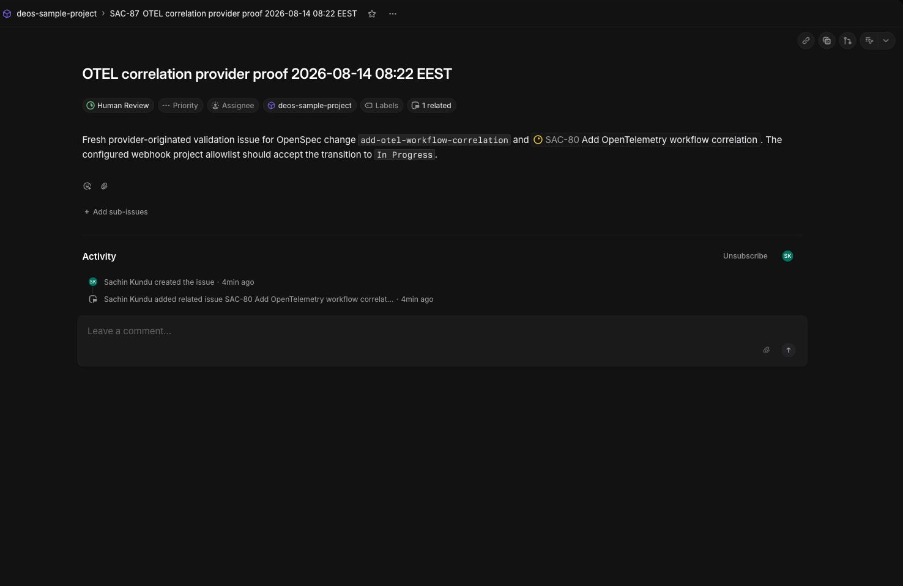

# Workflow observability provider proof

Validated on 2026-08-14 against the dedicated `deos-sample-project` Cloudflare
resources and the real Linear workspace. The proof issue was created and
transitioned through Linear itself; it was not a synthetic webhook request.

## Outcome

- Linear issue: [SAC-87](https://linear.app/sachinkundu/issue/SAC-87/otel-correlation-provider-proof-2026-08-14-0822-eest)
- Provider transition: `Backlog` -> `In Progress`
- Worker result: `Human Review`
- Correlation ID: `workflow:99426d9b-cda7-4db4-9136-692a95a0b090:0b1681ec-c651-4572-a0c7-bd95f2a6d09c`
- Linear delivery ID: `f735807c-d182-4d57-8084-87019d0a367e`
- Queue message ID: `f6b668a5435a4337707b23e14b1d306d`
- Queue attempt: `1`



## Deployment order and resource safety

The remote D1 database had only migration `0005_workflow_correlation.sql`
pending. It was applied before the ingress Worker and Queue consumer were
deployed. The deployed versions were:

- ingress: `cea15cae-d369-426d-80df-2e9b1debabba`
- consumer: `a502f656-cdd3-490d-a611-f8fdf5e469d8`

Before deployment, the exact dedicated queue
`deos-sample-project-events` (`5895ad3935824a088891edd6abb16699`) was
inspected through the Queue metrics API:

```json
{"backlog_count":0,"backlog_bytes":0,"oldest_message_timestamp_ms":0}
```

Because the queue was empty, no purge was performed.

## Durable D1 evidence

The delivery and workflow records joined on the canonical correlation ID:

| Record | Result |
| --- | --- |
| `deliveries` | relevant delivery `f735807c-d182-4d57-8084-87019d0a367e` stored with the canonical correlation ID |
| `workflow_runs` | `run_id = correlation_id`, current state `awaiting_human_approval` |
| `workflow_transitions` | `received -> queued -> requirements_in_progress -> awaiting_human_approval` |

The provider's follow-up `Human Review` webhook was recorded as irrelevant,
which confirms the allowlist did not create a second workflow run.

## Persisted Workers Logs evidence

The Workers Observability telemetry query API was queried by the canonical
correlation ID after the run completed. Query run
`kw08e2waq2kk8j4ukptf8a1a` completed with 13 indexed events across both
Workers:

| Service | Stage | Outcomes |
| --- | --- | --- |
| `deos-sample-project` | `ingress.delivery_record` | `succeeded` |
| `deos-sample-project` | `queue.publish` | `started`, `succeeded` |
| `deos-queue-consumer-ts` | `queue.consume` | `started`, `succeeded` |
| `deos-queue-consumer-ts` | three workflow transitions | `started`, `succeeded` for each transition |
| `deos-queue-consumer-ts` | `linear.issue_update` | `started`, `succeeded` |

The indexed event fields included `correlation_id`, `run_id`, `delivery_id`,
`project_id`, `issue_id`, `stage`, and `outcome`. Consumer events additionally
included the platform queue message ID and attempt. No webhook body, Linear API
response, secret, or raw dependency error was emitted.

This proof intentionally does not claim the separate state-first retry
correctness gap is fixed. The implementation makes attempts and reprocessing
observable while preserving that approved non-goal.

## Reproducible checks

The remote checks used credentials loaded from the ignored local `.env`; no
secret value was printed or stored in this repository. The relevant read-only
commands were equivalent to:

```sh
npx --yes wrangler@4.123.0 d1 execute deos-sample-project --remote --command \
  "SELECT correlation_id, current_state FROM workflow_runs ORDER BY created_at DESC LIMIT 5"

curl --fail-with-body --silent --show-error \
  -H "Authorization: Bearer ${CLOUDFLARE_API_TOKEN}" \
  -H "Content-Type: application/json" \
  -X POST \
  "https://api.cloudflare.com/client/v4/accounts/${CLOUDFLARE_ACCOUNT_ID}/workers/observability/telemetry/query" \
  --data @sanitized-query.json
```

The telemetry query used an inline time range and a needle filter for the
canonical correlation ID. `sanitized-query.json` is illustrative and was not
committed because the exact query response is summarized above without
including unrelated account telemetry.
