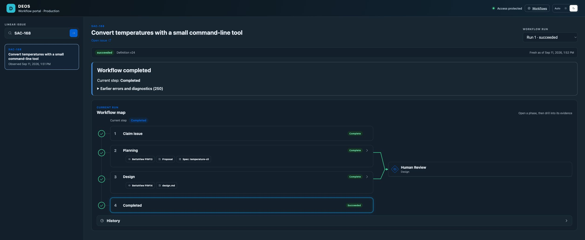
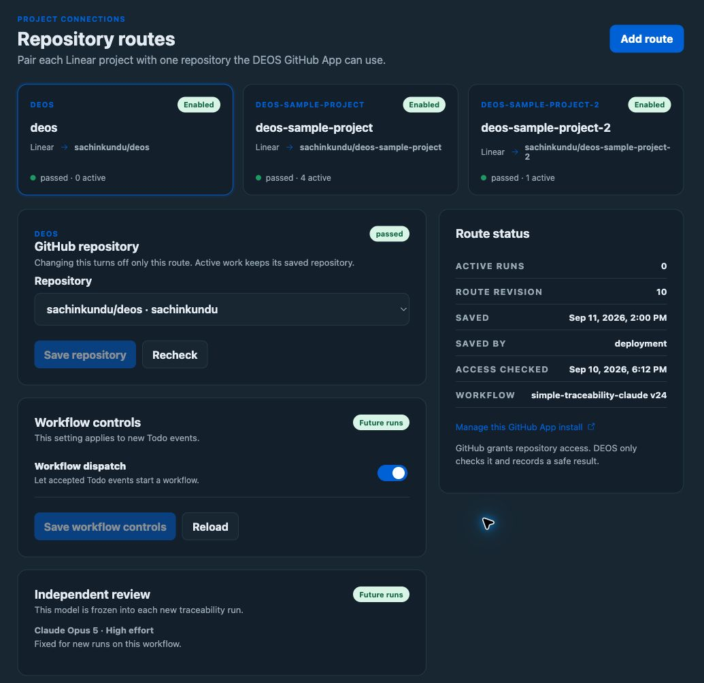
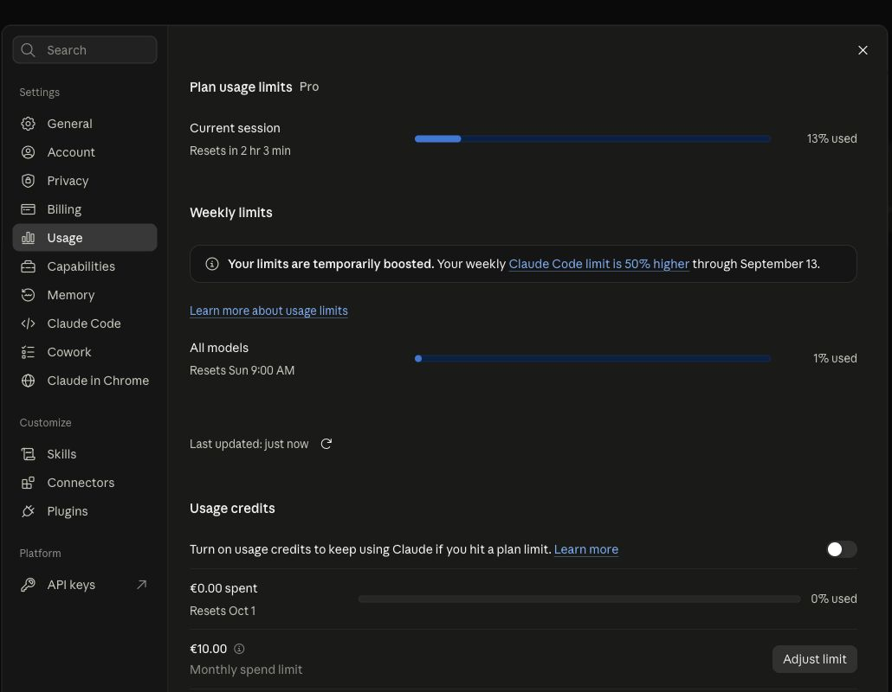

# SAC-167 release proof

The real Linear canary SAC-168 completed on September 11, 2026 at 10:52 UTC.
DEOS merged its [plan](https://github.com/sachinkundu/deos-sample-project/pull/13)
and [design](https://github.com/sachinkundu/deos-sample-project/pull/14).
The operator advanced both review gates through Linear Merging under the user's
explicit canary authorization. No workflow gate was removed. The canary stops at
the completed planning and design flow; a sample CLI implementation is not part
of this evidence.

The two planning calls and one design call ran through the deployed Claude
adapter. Planning passed. Design raised five low concerns, which the author
addressed in the merged design. All three protected receipts were read from R2
and checked against D1 hashes. They record Opus 5, applied high effort, the enrolled
setup-token version, and subscription use with overage disabled. Both Sandboxes
were destroyed before review acceptance. All canary attempts are now cleaned up.

- [Executable Showboat record with real D1/R2 output](canary.md)
- [Provider contract trials and fixes found by the live canary](contract-discovery.md)
- [Local checks: 374 backend, 69 portal, and 56 Python tests](local-checks.json)
- [Deployed versions and canary completion](release.json)
- [Three promoted defaults and verified route digests](promoted-defaults.json)
- [All 76 pre-existing run profiles unchanged after promotion](frozen-run-check.json)

The final Worker version serves 100% of traffic and uses the verified container
image. The scheduled registry refresh promoted all three project defaults at
11:00 UTC. Retained OpenRouter settings still support the prior workflow. A
guarded manual promotion attempted during that refresh matched no rows; the
recorded activation came from the registry. No frozen run was migrated.

The initial canary exposed two real client compatibility issues: the pinned
client rejected the root schema dialect declaration, and the model requested a
root-qualified repository listing. Both were fixed and retried as new attempts
after cleanup. Failed attempts remain in the record. Auth, quota, replay, bad
receipt and cleanup failure cases are covered by automated contract tests;
those tests are not presented as provider-originated canaries.

The [review follow-up](review-fixes.md) records the recovery fixes added after the canary.
