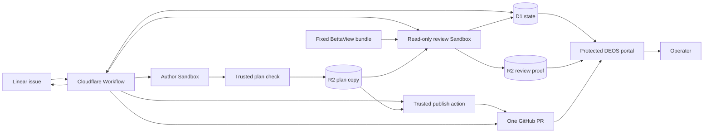
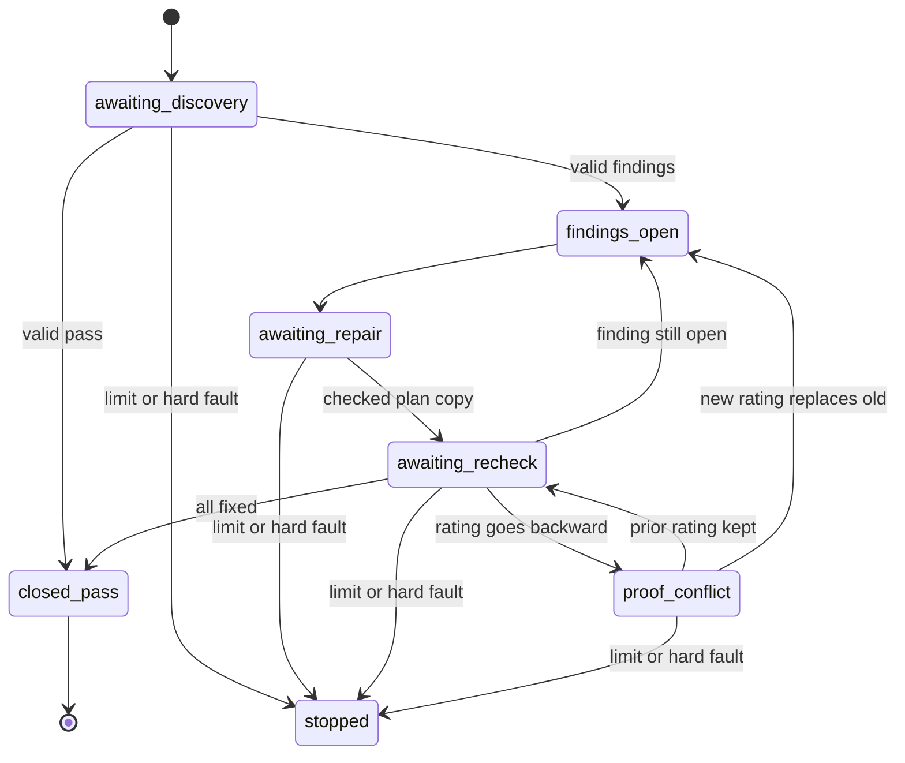

## Context

The simple flow has one planning agent today. It writes the proposal and specs. It can also publish them to GitHub. The flow then waits for a person.

This change adds a private review before that wait. It also adds a second review after the first publish. Both reviews use BettaView. They must leave a clear trail. They must not waste work when the input has not changed.

DEOS will still own the flow. D1 will own its state. R2 will hold the full proof. Each Codex job will use a fresh Sandbox. Only trusted Worker code may use GitHub or Linear rights.

BettaView will supply the review rules. Its bundle will find the plan files, number each line, shape the model result, map quotes back to source, and check the final trace. These checks prove that the trace is well formed and fresh. They do not prove that the model is right.

The current agent can edit files after it runs a check. The new flow will close that gap. Trusted code will build and check one plan copy after Codex exits. No job may change that copy before review or publish.

The flow also needs a firm stop rule. The same review input will reuse the saved result. A pass will close the phase. A later change from fixed to open will become a proof conflict. It will not start another author fix by itself.

## Goals / Non-Goals

**Goals:**

- Split plan writing from plan publish.
- Run trusted file, OpenSpec, and reading checks before each model review.
- Run each review as a read-only job with a fixed model.
- Reuse a good saved result when the review input is the same.
- Set clear limits for review repair and author repair.
- Keep the full review trail in D1 and R2.
- Use one planning pull request for publish and later fixes.
- Show the real review cycle in the DEOS portal.
- Keep GitHub and Linear updates short. Link them to the portal.

**Non-Goals:**

- Change the standard OpenSpec file form.
- Add review sidecars to a planning pull request.
- Let a review job write files or call a provider.
- Call a model result hard proof of meaning.
- Run the BettaView web server in production.
- Turn on the new live flow as part of this design gate.

## Component diagram

## Decisions

### 1. Keep one DEOS flow

The simple flow will gain clear nodes for writing, review, decisions, publish, and the human gate. Cloudflare Workflow will stay in charge. BettaView will run as a fixed part of each review job.

The first trial will pin these settings:

- author: `gpt-5.6-sol` with high thought;
- first reviewer: `gpt-5.6-sol` with high thought and fresh context;
- second reviewer: `gpt-5.5` with high thought; and
- conflict referee: the model for that phase with a separate fixed prompt.

Each job record will name its model, thought level, role, and provider rights. The saved flow hash will cover all four fields. The job runner will pass the saved model and thought level to Codex. It will not use an account default.

New author and review jobs will have no provider rights. Old saved flows will keep their old rules. Trusted code will set the repo, base, branch, change name, and future pull request before the author starts.

We will not let the author call BettaView or publish on its own. That would mix plan work, model work, and provider rights in one job.

### 2. Save one checked plan after Codex exits

Codex will exit before DEOS accepts a plan. Trusted code will then build `planning-candidate.json`. It will hold the base commit, change name, allowed file list, file text, byte size, and file hash. It will also hold one hash for all plan files and one hash for the files under review.

Trusted code will then:

1. reject any file outside the allowed set;
2. run strict OpenSpec checks;
3. run the reading check;
4. save `candidate-validation.json` in R2; and
5. read both files back before the flow moves on.

No job may edit that saved plan. A failed check returns to the author within its fix limit. Review and publish may only use a plan that passed.

### 3. Use a fixed BettaView bundle

The container will include a pinned review bundle. It will hold the prompt, schema, file scan, source builder, quote mapper, and validator. Its manifest will name the BettaView source commit and a hash for every file.

One review job will start one Codex process. It will not start another Codex process. The job will get only the saved plan, the fixed bundle, the phase, the review mode, and any fixed finding list. It must return an empty patch.

The first reviewer will use a fresh context. It may not read the author job or notes that are not in the saved plan. Each review job will also have a firm time limit. A timeout will use one job try and will not produce gate proof.

Host code will map and check the raw result after Codex exits. It will choose the flow outcome from the checked result. The model may not choose its own next step.

### 4. Give each review input a stable name

DEOS will hash all facts that can change the answer. This includes the source file list and hash, phase, mode, round, fixed findings, model, thought level, prompt hash, and bundle hash.

The dispatcher will look up that input before it creates an attempt. If a good result already exists, it will reuse it. It will not create a job try, Sandbox, or model call. The portal will show that reuse as its own event.

A new GitHub head may reuse an old result only when trusted code proves that every reviewed file has the same bytes. Any change to a reviewed byte creates a new input. A change to files outside the review set does not create a new model call, but the new head link will show its own proof.

### 5. Keep phase state and limits in D1

Each review phase will have one current row and a compare-and-set revision. Its state will be one of:

- `awaiting_discovery`;
- `findings_open`;
- `awaiting_repair`;
- `awaiting_recheck`;
- `proof_conflict`;
- `closed_pass`; or
- `stopped`.

The row will track three separate counts: author fixes, review jobs, and proof repairs. Reuse will raise none of them. A saved pass will move the phase to `closed_pass`. Dispatch will refuse any later recheck for that closed phase.

Human feedback starts a new round. It does not reopen the old round.

### 6. Keep one fixed finding list per phase

Discovery creates the base finding list. Each finding gets a stable ID, source point, text, and first rating. A recheck may only rate that same list. It may not add, drop, rename, or join findings.

Each finding will also set the exact plan ranges that the author may change. Trusted code will reject any other changed byte. A recheck will read each changed range, its full OpenSpec block, and every block joined to it by the two-way trace. A new gap or broken link will keep that finding open.

When a finding moves from open to fixed, the saved evidence will name the plan change that fixed it. If a later recheck marks it open with no relevant plan change, DEOS will reject the lower rating. It will keep the prior result.

If there was a relevant plan change, the phase will enter `proof_conflict`. One fixed referee job may compare the two ratings and the source change. Only a saved result that replaces the old decision may reopen the finding. Only then may the flow spend another author fix.

This path has its own proof-repair limit. It does not spend the author limit unless the proof says the plan still needs work.

### 7. Publish through trusted code

The author will never receive a GitHub token. A trusted action will publish the saved R2 plan to the run branch. It will create or update one planning pull request. It will then read back the branch, pull request, and exact head.

The first review happens before publish. The second review happens on the exact published head. If the second review finds a real issue, the author will repair the same plan and trusted code will update the same pull request.

After such a repair, both reviewers must check the exact new head. The first reviewer will see the second reviewer's fixed finding list, the changed blocks, and their linked blocks. It may only rate that list. The second reviewer will then rate its own fixed list. The flow may enter the human gate only when both saved results pass for the live head. A model pass is never human approval.

Trusted code will reply to any related review thread with the exact change made. It will leave the thread open for the reviewer.

### 8. Put full proof in R2 and the index in D1

R2 will hold the raw model output, clean result, trace sidecar, source list, quote map, check result, job transcript, plan copies, and decision record. Each object will use a create-only key. D1 will store its hash, size, kind, and safe link.

D1 will also store the phase state and direct IDs for each review. It will record reuse, stale links, conflicts, and results that replace older results. The flow will read back D1 and R2 before it calls a review final.

### 9. Add a review page to the DEOS portal

The portal will add `/runs/<encoded-run-id>/review`. It will read D1 first. It will fetch an R2 object only through a safe route with an allowlist, hash check, and `no-store` header.

Cloudflare Access will guard both the page and its file routes. The page will compare the saved review head with the live pull request head. It may show an older view, but its stale mark must stay in sight.

The page will show:

- each plan copy and its checks;
- each review job in time order;
- the exact input and model settings;
- the fixed finding list and rating changes;
- the author change tied to each fix;
- reuse with no model call;
- stale head links;
- proof conflicts and the result that replaced an old result; and
- links to safe raw proof.

The normal run page will load as it does now. It will show a link when review proof exists. It will not build a trace during page load.

### 10. Keep provider status short

A GitHub Check Run will show the phase, result, counts, reviewed head, and portal link. Linear will get one marked portal link and a short state note. Stable operation IDs will stop duplicate updates.

Only trusted Worker code may make these calls. If a call has an unclear result, DEOS will read the provider state before it retries.

The action will also check that the repo, pull request, head, and Linear issue match the saved review target. Review input will use safe IDs and guarded files. It will never include a raw provider secret.

### 11. Keep logs safe

Events may name the run, round, phase, mode, input ID, result ID, model, thought level, state, counts, reuse, conflict, duration, and error class.

Logs will not hold plan text, findings, prompts, model output, transcripts, or provider secrets. Those items belong in guarded R2 proof.

## State flow

## Event flow

For an author step:

1. The flow freezes the repo, change, round, job, model, and limits.
2. A fresh Sandbox restores the last good plan patch.
3. Codex edits only the allowed plan files.
4. Codex exits.
5. Trusted code builds and checks the plan copy.
6. DEOS saves and reads back the proof.
7. The flow may now start review or publish.

For a review step:

1. DEOS computes the review input ID.
2. It reuses a good match with no attempt.
3. If none exists, a fresh read-only Sandbox runs one fixed review.
4. Host code maps and checks the result.
5. D1 saves the result and state change as one guarded action.
6. DEOS reads back the R2 proof before cleanup.
7. The flow follows the host result.

## Minimal data model

| Record | Main facts | Use |
| --- | --- | --- |
| Existing `run_work_products` | Repo, base, branch, pull request, head, and provider receipts. | Keeps one plan pull request. |
| `planning_candidates` | Plan ID, run, round, source attempt, base, file hashes, check result, state, and times. | Names one fixed plan copy. |
| `trace_review_phases` | Run, round, phase, state, current plan, base findings, accepted review, three counts, and revision. | Owns limits and phase closure. |
| `trace_reviews` | Review and input IDs, phase, mode, plan, head, attempt, model settings, bundle hashes, result, reuse, replaced result, and times. | Indexes each review fact. |
| `trace_review_head_bindings` | Review, repo, pull request, head, file hash, check receipt, and time. | Proves safe reuse on a new head. |
| Existing artifact tables | R2 key, hash, size, policy result, and state. | Holds fixed proof. |
| Existing provider tables | Stable action ID, result, and guarded URL. | Makes provider work safe to retry. |

No table will hold a provider secret. Full plan text and full review text will stay in R2.

## Failure modes

| Failure | Response |
| --- | --- |
| Author changes a banned file. | Reject the plan. Keep the attempt. Do not review or publish it. |
| OpenSpec or reading check fails. | Return to author repair within the limit. |
| Plan proof cannot be saved and read back. | Do not move on. Keep the Sandbox for normal recovery. |
| The same good review input appears again. | Save a reuse event. Do not run a job or model. |
| A reviewed file changes. | Mark the old result stale. Make a new input. |
| A review job changes a file. | Reject its proof. Use the proof-repair path. |
| The result or sidecar fails a check. | Keep the bad proof. Retry only within the proof limit. |
| Recheck changes the fixed finding list. | Reject it. Keep the prior list and state. |
| A fixed finding becomes open again. | Enter proof conflict before any author fix. |
| A limit ends. | Save `stopped`. Do not enter human review. |
| Pull request head changes. | Mark the link stale. Reuse only after exact file checks. |
| A provider call is unclear. | Read exact provider state before retry. |
| A portal artifact fails its hash. | Hide it as accepted proof. Show a guarded error. |
| Portal or R2 is down. | Keep D1 as flow authority. The page must not run the flow. |
| Cleanup fails. | Keep the review non-final until cleanup is reconciled. |

## Risks / Trade-offs

- The new state adds flow code. We will keep review choices in four small D1 records. We will reuse current attempt, artifact, provider, and cleanup code.
- A pinned model may go away. The job will fail before dispatch. A reviewed flow version can then pin a new model.
- The BettaView bundle can drift from its source. Its manifest will record the source commit and file hashes. An upgrade will be a clear dependency change.
- Saved plan copies use more R2 space. They give us the exact input for each decision. The cost is small and bounded.
- Head reuse can look like a new review. The portal will show the old result and new head proof as two events. It will state that no model ran.
- A conflict referee adds one rare model call. It stops a loop from hiding a change in reviewer judgment.
- The portal will show private proof. Access, safe routes, hash checks, and no-store headers will guard it.
- GitHub may need `checks:write`. We will check and grant only that right before the live trial.

## Migration Plan

1. Add the pinned BettaView bundle and its manifest to the container. Add model and provider-right fields to new jobs. Keep the old live flow in use.
2. Add the trusted plan builder. Prove path checks, strict OpenSpec, reading checks, hashes, R2 save, and read-back.
3. Add the four D1 review records. Add guarded state updates, exact-input reuse, limits, phase close, stale state, and proof conflict.
4. Add result forms for discovery, recheck, safety faults, and conflict review. Add host-owned outcomes and a clear author feedback input.
5. Split writing from publish. Add trusted plan identity and publish actions. Give new author and review jobs no provider rights.
6. Add both review phases to a new fixed simple flow version. Keep its selector off. Prove old saved flows still work with the same hash and rights.
7. Add the portal page, D1 view, safe R2 reads, trace view, raw proof links, reuse labels, stale state, and conflict history.
8. Add the GitHub check and Linear portal link. Use stable action IDs and provider read-back. Check the GitHub App right before deploy.
9. Run repo tests, strict OpenSpec checks, schema checks, graph tests, prompt snapshots, reuse tests, limit tests, proof read-back tests, and portal tests.
10. Update `docs/current-architecture.md` only for behavior that now exists.
11. Deploy D1, Worker, portal, and container while the new selector stays off. Read back the flow, bundle hash, bindings, and portal Access rule.
12. After a separate live-run approval, turn the flow on for one test project and repo. Trigger it from a real Linear issue. Prove both review phases, one pull request, exact-head checks, the human gate, portal history, provider links, cleanup, and D1/R2 records.
13. To roll back, turn off the selector for new runs. Active runs will keep their saved flow. Audit proof will remain in D1 and R2.
