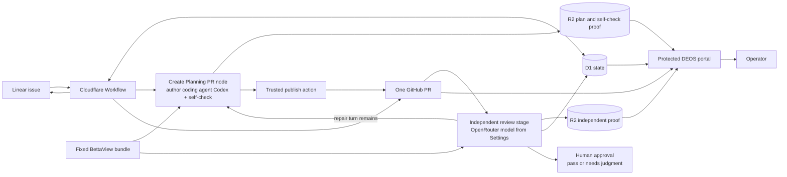
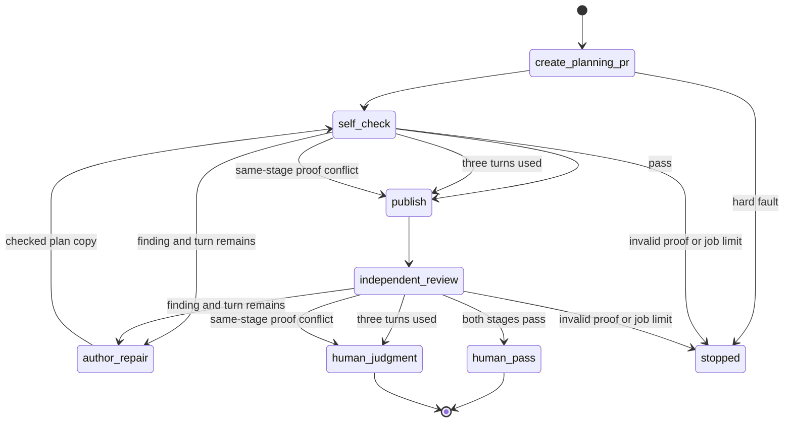

## Context

The simple flow has one planning agent today. It writes the proposal and specs. It can also publish them to GitHub. The flow then waits for a person.

This change adds a Codex self-check before publish. It also adds an independent review after publish. The self-check uses Codex, like the author coding agent Codex. The independent stage uses another supported model through OpenRouter. Both stages use BettaView. They must leave a clear trail. They must not waste work when the input has not changed.

DEOS will still own the flow. D1 will own its state. R2 will hold the full proof. Each author coding agent Codex or review job will use a fresh Sandbox. Only trusted Worker code may use GitHub or Linear rights. A trusted model adapter will call OpenRouter without giving its key to a Sandbox.

BettaView will supply the review rules. Its bundle will find the plan files, number each line, shape the model result, map quotes back to source, and check the final trace. These checks prove that the trace is well formed and fresh. The models try to check meaning. Their results cannot be absolute because model output is probabilistic.

The current author coding agent Codex can edit files after it runs a check. The new flow will close that gap. Trusted code will build and check one plan copy after the author coding agent Codex exits. No job may change that copy before review or publish.

The flow also needs a firm stop rule. The same review input will reuse the saved result. A pass will close that stage for the same input. Changed reviewed bytes will make the old pass stale and open the needed recheck. If one stage reverses its own fixed rating with no matching source change, DEOS will show both results to a person. The independent reviewer may disagree with the self-check. That is a valid independent view, not a proof fault.

## Goals / Non-Goals

**Goals:**

- Split plan writing from plan publish.
- Run trusted file, OpenSpec, and reading checks before each model review.
- Run the self-check with the author coding agent Codex model. Run the independent stage with an OpenRouter model chosen in settings and saved with the run.
- Reuse a good saved result when the review input is the same.
- Allow no more than three shared author-repair turns before human judgment.
- Keep the full review trail in D1 and R2.
- Use one planning pull request for publish and later fixes.
- Show the real review cycle in the DEOS portal.
- Keep GitHub and Linear updates short. Link them to the portal.

**Non-Goals:**

- Change the standard OpenSpec file form.
- Add review sidecars to a planning pull request.
- Let a review job write files or call GitHub or Linear.
- Call a model result hard proof of meaning.
- Run the BettaView web server in production.
- Turn on the new live flow as part of this design gate.

## Component diagram

## Decisions

### 1. Keep one DEOS flow

The portal graph will keep `Create Planning PR` as one node. Plan writing and the Codex self-check both happen inside that stage. The graph will add a visible independent review stage after publish. Human approval stays after that stage. Cloudflare Workflow will stay in charge. BettaView will run as a fixed part of both review stages.

The first trial will use these settings:

- author coding agent Codex: the model and thought level saved by the planning flow;
- Codex self-check: that same saved Codex model and thought level, with fresh context; and
- independent reviewer: a supported OpenRouter model chosen on the DEOS settings page.

The settings page will save the OpenRouter model for new runs. A run will copy that provider and model into its fixed data before work starts. A later settings change will not affect active work. The selected independent model must differ from the author coding agent Codex model.

Each job record will name its model provider, model, thought setting, role, and provider rights. The saved flow hash will cover those fields. The runner will pass the saved Codex settings to Codex. A trusted model adapter will pass the saved independent setting to OpenRouter. Neither path will use an image, account, or user default.

The author coding agent Codex and both review jobs will have no GitHub or Linear rights. The independent job will have only a narrow model-inference channel. It will never receive the OpenRouter key. Old saved flows will keep their old rules. Trusted code will set the repo, base, branch, change name, and future pull request before the author coding agent Codex starts.

We will not let the author coding agent Codex call BettaView or publish on its own. That would mix plan work, model work, and provider rights in one job.

### 2. Save one checked plan after Codex exits

The author coding agent Codex will exit before DEOS accepts a plan. Trusted code will then build `planning-candidate.json`. It will hold the base commit, change name, allowed file list, file text, byte size, and file hash. It will also hold one hash for all plan files and one hash for the files under review.

Trusted code will then:

1. reject any file outside the allowed set;
2. run strict OpenSpec checks;
3. run the reading check;
4. save `candidate-validation.json` in R2; and
5. read both files back before the flow moves on.

No job may edit that saved plan. A failed check returns to the author coding agent Codex. Deterministic checks do not use the three semantic repair turns. Review and publish may only use a plan that passed all deterministic checks.

### 3. Use a fixed BettaView bundle

The container will include a pinned review bundle. It will hold the prompt, schema, file scan, source builder, quote mapper, and validator. Its manifest will name the BettaView source commit and a hash for every file.

One review job will make one semantic model call. The self-check will start one Codex process. The independent stage will call one saved OpenRouter model through the trusted model adapter. Neither job may start another model process or model call. The job will get only the saved plan, fixed bundle, stage, review mode, and any fixed finding list. It must return an empty patch.

The Codex self-check will use a fresh context. It may not read the author coding agent Codex job or notes that are not in the saved plan. The independent reviewer will receive only the saved review input. Each review job will also have a firm time limit. A timeout will use one job try and will not produce gate proof.

Trusted DEOS controller code outside the model and Sandbox will map and check the raw result. It will choose the flow outcome from the checked result. The model may not choose its own next step.

### 4. Give each review input a stable name

DEOS will hash all facts that can change the answer. This includes the source file list and hash, stage, mode, round, fixed findings, model provider, model, thought setting, prompt hash, and bundle hash.

The dispatcher will look up that input before it creates an attempt. If a good result already exists, it will reuse it. It will not create a job try, Sandbox, or model call. The portal will show that reuse as its own event.

A new GitHub head may reuse an old result only when trusted code proves that every reviewed file has the same bytes. Any change to a reviewed byte creates a new input. A change to files outside the review set does not create a new model call, but the new head link will show its own proof.

### 5. Keep review state and limits in D1

Each review stage will have one current row and a compare-and-set revision. Its state will be one of:

- `awaiting_discovery`;
- `findings_open`;
- `awaiting_repair`;
- `awaiting_recheck`;
- `proof_conflict`;
- `closed_pass`; or
- `closed_needs_judgment`; or
- `stopped`.

The round will allow three shared author-repair turns across the self-check and independent stage. Each stage will also track review jobs and proof repairs. Reuse will raise none of these counts. A saved pass will move that stage to `closed_pass` for its exact input.

An identical input sent to a closed stage will reuse its result. If reviewed bytes change, DEOS will mark the old result stale, create a new input ID, and reopen only the needed recheck. When all three repair turns are used, DEOS will finish one independent review on the current valid head. It will then save `closed_needs_judgment` if findings remain and enter the human gate. Invalid plan form, missing proof, unsafe input, and failed review jobs still use the stop or help path.

Human feedback starts a new round. It does not reopen the old round.

### 6. Keep one fixed finding list per review stage

Discovery creates the base finding list for that stage. Each finding gets a stable ID, source point, text, and first rating. A recheck may only rate that same list. It may not add, drop, rename, or join findings. The independent stage makes its own list. It may disagree with the Codex self-check or find a concern that the self-check missed.

Each finding will also set the exact plan ranges that the author coding agent Codex may change. Trusted code will reject any other changed byte. A recheck will read each changed range, its full OpenSpec block, and every block joined to it by the two-way trace. A new gap or broken link will keep that finding open.

When a finding moves from open to fixed, the saved evidence will name the plan change that fixed it. If the same stage later marks it open with no relevant source change, DEOS will reject the lower rating for automation. It will keep both results and flag their conflict for the person.

If there was a relevant plan change, the old review input is stale. DEOS will create a new input and run the needed closed-set recheck if a shared repair turn remains. If there was no relevant change, DEOS will not run a referee model or start another author repair. A self-check conflict will travel with the valid plan into the independent stage. Human review will wait until that independent stage finishes.

The proof-repair limit now covers malformed or missing review output. It does not cover a semantic disagreement between the self-check and independent reviewer. That disagreement is valid review evidence.

### 7. Publish through trusted code

The author coding agent Codex will never receive a GitHub token. A trusted action will publish the saved R2 plan to the run branch. It will create or update one planning pull request. It will then read back the branch, pull request, and exact head.

The Codex self-check happens inside the `Create Planning PR` stage before publish. Trusted code publishes when that check passes or the shared three-turn repair limit is used. The independent OpenRouter review happens on the exact published head. If it finds a concern and a shared repair turn remains, the author coding agent Codex will repair the same plan. Trusted code will update the same pull request.

After such a repair, both stages must check the exact new head. The Codex self-check will see the independent finding list, changed blocks, and linked blocks. It may only rate that list during this recheck. The OpenRouter reviewer will then rate its own fixed list.

The flow will enter the human gate in either of two cases. Both stages pass for the live head, or all three shared author-repair turns are used and the independent review is complete for the current valid head. The second case will be labeled `needs judgment`. It will show every open finding and model disagreement. A model result is never human approval.

Trusted code will reply to any related review thread with the exact change made. It will leave the thread open for the reviewer.

### 8. Put full proof in R2 and the index in D1

R2 will hold the raw model output, clean result, trace sidecar, source list, quote map, check result, job transcript, plan copies, and decision record. Each object will use a create-only key. D1 will store its hash, size, kind, and safe link.

D1 will also store the stage state and direct IDs for each review. It will record reuse, stale links, conflicts, and human-escalation decisions.

Trusted DEOS controller code will first save the complete review proof to R2 and read it back by hash. Only after that succeeds will one guarded D1 action save the accepted result and close or advance the stage. If D1 fails after the R2 check, the R2 object remains unaccepted proof for normal recovery. An identical-input lookup may reuse only a D1 result that points to proof that passed read-back.

### 9. Add a review page to the DEOS portal

The portal will add `/runs/<encoded-run-id>/review`. The `Create Planning PR` node popup will show a `View review trace` link when proof exists. The self-check will not appear as another workflow node. The independent review will remain a clear workflow stage. The detail page will read D1 first. It will fetch an R2 object only through a safe route with an allowlist, hash check, and `no-store` header.

Cloudflare Access will guard both the page and its file routes. The page will compare the saved review head with the live pull request head. It may show an older view, but its stale mark must stay in sight.

The page will show:

- each plan copy and its checks;
- each review job in time order;
- the exact input, model provider, and model settings;
- the fixed finding list and rating changes;
- the author coding agent Codex change tied to each fix;
- reuse with no model call;
- stale head links;
- same-stage proof conflicts, cross-stage model disagreements, and turn-limit escalation; and
- links to safe raw proof.

The normal run page will load as it does now. The link will live in the `Create Planning PR` popup. It will not build a trace during page load.

### 10. Keep provider status short

A GitHub Check Run will show the stage, result, counts, reviewed head, and portal link. Linear will get one marked portal link and a short state note. Stable operation IDs will stop duplicate updates.

Only trusted Worker code may make these calls. If a call has an unclear result, DEOS will read the provider state before it retries.

The action will also check that the repo, pull request, head, and Linear issue match the saved review target. Review input will use safe IDs and guarded files. It will never include a raw provider secret.

### 11. Keep logs safe

Events may name the run, round, stage, mode, input ID, result ID, model provider, model, thought setting, state, counts, reuse, conflict, duration, and error class.

Logs will not hold plan text, findings, prompts, model output, transcripts, or provider secrets. Those items belong in guarded R2 proof.

## State flow

## Event flow

For an author coding agent Codex step:

1. The flow freezes the repo, change, round, job, model, and limits.
2. A fresh Sandbox restores the last good plan patch.
3. The author coding agent Codex edits only the allowed plan files.
4. The author coding agent Codex exits.
5. Trusted code builds and checks the plan copy.
6. DEOS saves and reads back the proof.
7. The flow may now start review or publish.

For a review step:

1. DEOS computes the review input ID.
2. It reuses a good match with no attempt.
3. If none exists, a fresh read-only job runs one saved model review.
4. Trusted DEOS controller code maps and checks the result.
5. DEOS saves the complete R2 proof and reads it back by hash.
6. One guarded D1 action accepts the result and changes stage state.
7. The flow follows the trusted controller result and then cleans up.

## Minimal data model

| Record | Main facts | Use |
| --- | --- | --- |
| Existing `run_work_products` | Repo, base, branch, pull request, head, and provider receipts. | Keeps one plan pull request. |
| `planning_candidates` | Plan ID, run, round, source attempt, base, file hashes, check result, state, and times. | Names one fixed plan copy. |
| `trace_review_phases` | Run, round, stage, state, current plan, base findings, accepted review, shared repair turns, job and proof counts, and revision. | Owns limits, pass, and human escalation. |
| `trace_reviews` | Review and input IDs, stage, mode, plan, head, attempt, model provider and settings, bundle hashes, result, reuse, conflict, and times. | Indexes each review fact. |
| `trace_review_head_bindings` | Review, repo, pull request, head, file hash, check receipt, and time. | Proves safe reuse on a new head. |
| Existing artifact tables | R2 key, hash, size, policy result, and state. | Holds fixed proof. |
| Existing provider tables | Stable action ID, result, and guarded URL. | Makes provider work safe to retry. |

No table will hold a provider secret. Full plan text and full review text will stay in R2.

## Failure modes

| Failure | Response |
| --- | --- |
| Author coding agent Codex changes a banned file. | Reject the plan. Keep the attempt. Do not review or publish it. |
| OpenSpec or reading check fails. | Return to the author coding agent Codex. Do not spend a semantic repair turn. |
| Plan proof cannot be saved and read back. | Do not move on. Keep the Sandbox for normal recovery. |
| The same good review input appears again. | Save a reuse event. Do not run a job or model. |
| A reviewed file changes. | Mark the old result stale. Make a new input. |
| A review job changes a file. | Reject its proof. Use the proof-repair path. |
| The result or sidecar fails a check. | Keep the bad proof. Retry only within the proof limit. |
| Recheck changes the fixed finding list. | Reject it. Keep the prior list and state. |
| One stage reopens its own fixed finding with no source change. | Keep both proofs. Run no referee or author repair. Finish the independent stage, then send the conflict to human judgment. |
| The independent reviewer disagrees with the self-check. | Keep the independent finding as a valid view. Use a shared repair turn if one remains. |
| Three author-repair turns are used. | Finish the independent review on the current valid head. Enter human review with `needs judgment`. |
| A review job or proof limit ends without valid proof. | Save `stopped`. Do not enter human review. |
| Pull request head changes. | Mark the link stale. Reuse only after exact file checks. |
| A provider call is unclear. | Read exact provider state before retry. |
| A portal artifact fails its hash. | Hide it as accepted proof. Show a guarded error. |
| Portal or R2 is down. | Keep D1 as flow authority. The page must not run the flow. |
| Cleanup fails. | Keep the review non-final until cleanup is reconciled. |

## Risks / Trade-offs

- The new state adds flow code. We will keep review choices in four small D1 records. We will reuse current attempt, artifact, provider, and cleanup code.
- A chosen OpenRouter model may go away. Settings will show only supported choices. An active run will fail before dispatch instead of changing models. A person may start a later run with a new saved choice.
- The BettaView bundle can drift from its source. Its manifest will record the source commit and file hashes. An upgrade will be a clear dependency change.
- Saved plan copies use more R2 space. They give us the exact input for each decision. The cost is small and bounded.
- Head reuse can look like a new review. The portal will show the old result and new head proof as two events. It will state that no model ran.
- Human escalation may send open model concerns to a person. That is intentional after three repair turns. The portal will separate a pass from `needs judgment`.
- The portal will show private proof. Access, safe routes, hash checks, and no-store headers will guard it.
- GitHub may need `checks:write`. We will check and grant only that right before the live trial.

## Migration Plan

1. Add the pinned BettaView bundle and its manifest to the container. Add model-provider, model, thought-setting, and provider-right fields to new jobs. Keep the old live flow in use.
2. Add the trusted plan builder. Prove path checks, strict OpenSpec, reading checks, hashes, R2 save, and read-back.
3. Add the four D1 review records. Add guarded state updates, exact-input reuse, the shared three-turn limit, stage close, stale state, and human escalation. Make R2 read-back happen before D1 accepts a result.
4. Add result forms for discovery, recheck, and safety faults. Add trusted-controller outcomes and a clear author coding agent Codex feedback input. Do not add a referee model.
5. Add the OpenRouter model choice to the DEOS settings page. Save it for new runs. Add the trusted model adapter and secret binding. Prove that no Sandbox or prompt receives the raw key.
6. Split writing from publish. Add trusted plan identity and publish actions. Give new author and review jobs no GitHub or Linear rights.
7. Keep self-check inside `Create Planning PR`. Add the independent review stage to a new fixed simple flow version. Keep its selector off. Prove old saved flows still work with the same hash and rights.
8. Add the portal page, `View review trace` link in the planning-node popup, D1 view, safe R2 reads, trace view, raw proof links, reuse labels, stale state, and conflict history.
9. Add the GitHub check and Linear portal link. Use stable action IDs and provider read-back. Check the GitHub App right before deploy.
10. Run repo tests, strict OpenSpec checks, schema checks, graph tests, prompt snapshots, reuse tests, limit tests, proof read-back tests, and portal tests.
11. Update `docs/current-architecture.md` only for behavior that now exists.
12. Deploy D1, Worker, portal, settings, and container while the new selector stays off. Read back the flow, bundle hash, OpenRouter setting, secret binding, other bindings, and portal Access rule.
13. After a separate live-run approval, turn the flow on for one test project and repo. Trigger it from a real Linear issue. Prove both review stages, one pull request, exact-head checks, pass and `needs judgment` gates, portal history, provider links, cleanup, and D1/R2 records.
14. To roll back, turn off the selector for new runs. Active runs will keep their saved flow. Audit proof will remain in D1 and R2.
