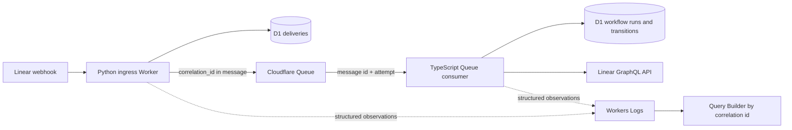
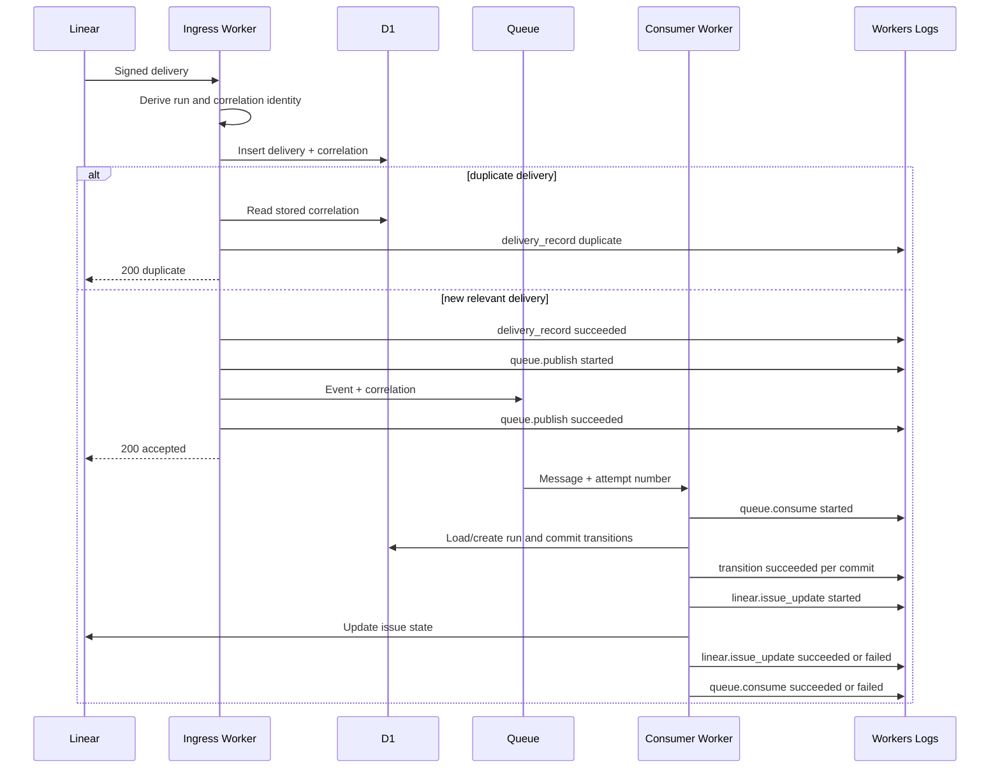

## Context

A relevant Linear event currently crosses two Workers and three operational boundaries: authenticated HTTP ingress, a Cloudflare Queue handoff, durable D1 workflow transitions, and an outbound Linear GraphQL call. `workflow_runs` already stores a correlation identifier, but later deliveries, Queue messages, retries, and emitted logs do not consistently carry or query it. The result is durable state without a single operational narrative.

Cloudflare Workers Logs is the initial telemetry store. Both Workers will emit the same structured, OpenTelemetry-compatible log envelope to `console`, and Workers Observability will retain and index those fields for Query Builder. This avoids an application-level exporter, exporter credentials, or a new telemetry vendor while keeping the observations exportable through Cloudflare's OpenTelemetry support later.

This design applies only to service-authored workflow observations. It deliberately limits the attributes the service constructs; it does not attempt general-purpose redaction of arbitrary error text or provider payloads.

## Goals / Non-Goals

### Goals

- Preserve one correlation identifier from a workflow's first relevant Linear delivery through later provider deliveries, Queue attempts, D1 transitions, and outbound Linear calls.
- Make each fallible post-admission stage show `started` followed by exactly one terminal `succeeded` or `failed` observation, so an operator can locate an incomplete stage.
- Distinguish Queue retries without turning each retry into a new workflow.
- Keep application-authored telemetry limited to service-owned values and the approved Linear identifiers.
- Make the correlation queryable across both deployed Workers using native Cloudflare observability.

### Non-Goals

- Building a custom observability UI or selecting a third-party telemetry backend.
- Introducing an application-managed OpenTelemetry SDK, collector, or OTLP exporter in this change.
- Replacing D1 as the durable workflow and audit record.
- Capturing request bodies, provider response bodies, user content, or arbitrary exception messages and then trying to redact them.
- Changing workflow states, approval behavior, retry policy, or idempotency semantics.

## Decisions

### 1. The workflow correlation identifier is deterministic workflow identity

The canonical correlation identifier is the deterministic workflow run identifier, `workflow:{project_id}:{issue_id}`. The current data model permits only one run for a `(project_id, issue_id)` pair, so this value is stable across the first delivery, later approval or rejection deliveries, duplicate provider delivery, and every Queue attempt. It is available immediately after authenticated ACL translation and does not depend on a successful D1 lookup.

Ingress assigns the identifier after authentication and ACL translation:

1. Derive the workflow run identifier from the translated project and issue identifiers.
2. Use the same value as `correlation_id`.
3. Persist it on the delivery record.
4. Publish it explicitly in the Queue body.

If inserting a delivery reports a duplicate, ingress reads the stored delivery correlation identifier and emits one terminal `duplicate` observation. It returns HTTP 200 and neither publishes another message nor starts or advances workflow state.

The Queue consumer requires an explicit Queue correlation value and validates that it matches the deterministic run identifier. Messages from the old producer are removed from the dedicated test queue before this strict consumer deploys. `workflow_runs.run_id` and `workflow_runs.correlation_id` therefore hold the same canonical value; retaining both columns keeps the correlation role explicit at storage and query boundaries.

### 2. One logical event envelope is implemented in both runtimes

Python ingress and the TypeScript Queue consumer will each have a small adapter that accepts a closed set of fields and emits one JSON object. The adapters share the following logical schema and enumerations; they do not accept arbitrary provider payload fields or exception objects.

| Attribute | Required | Meaning |
| --- | --- | --- |
| `event.time` | yes | UTC ISO-8601 time at emission |
| `event.name` | yes | Stable service-authored event name |
| `service.name` | yes | Deployed Worker name |
| `deos.telemetry.schema_version` | yes | Envelope version, initially `1` |
| `deos.workflow.correlation_id` | yes | Stable workflow correlation identifier |
| `deos.workflow.stage` | yes | Closed stage name |
| `deos.workflow.outcome` | yes | `started`, `succeeded`, `failed`, or `duplicate` |
| `linear.delivery.id` | yes | Current provider delivery identifier |
| `linear.issue.id` | yes | Related Linear issue identifier |
| `linear.project.id` | yes | Related Linear project identifier |
| `deos.workflow.run_id` | yes | Durable workflow run identifier |
| `messaging.message.id` | Queue only | Cloudflare-generated Queue message identifier |
| `deos.workflow.attempt.number` | Queue only | Cloudflare Queue delivery attempt, starting at 1 |
| `error.type` | failed only | Closed, service-authored failure category |

Stage names are `ingress.delivery_record`, `queue.publish`, `queue.consume`, `workflow.transition`, and `linear.issue_update`. Transition observations may additionally contain the service-authored previous state, next state, and cause. No free-form `message`, raw exception, request, response, or provider object is part of the envelope.

The initial error categories are `correlation_mismatch`, `d1_operation_failed`, `queue_publish_failed`, `linear_transport_failed`, `linear_http_failed`, `linear_graphql_failed`, and `unexpected_failure`. Dependency adapters convert failures to these categories without copying response text. This is construction-time data minimization, not a generic PII or secret scrubber.

### 3. Stage observations surround the operation they describe

For each fallible post-admission stage, the service emits `started` before the operation and one terminal observation after it:

- Queue publication: `queue.publish`.
- Each Queue message attempt: `queue.consume`, including message ID and attempt number.
- Each committed D1 state change: `workflow.transition`, emitted as succeeded only after the write completes.
- The outbound Linear mutation: `linear.issue_update`, with failure categorized before the typed failure is rethrown so Cloudflare can deliver another Queue attempt. This telemetry change does not claim that the current state-first workflow logic will re-run the mutation on that attempt.

Delivery persistence emits one terminal `ingress.delivery_record` observation after D1 classifies the attempt: `succeeded`, `duplicate`, or `failed`. This permits the duplicate path to emit only its required duplicate outcome. An irrelevant delivery is still acknowledged but does not create workflow telemetry. Success is never emitted in a `finally` block or before the underlying operation completes.

### 4. Native Workers Logs is the first query surface

Workers Observability logs will be explicitly enabled for the ingress and Queue-consumer deployments with full head sampling for this low-volume validation environment. Structured observations go to the Workers Logs dataset and are queried by `deos.workflow.correlation_id` across the two service names. Real-time tail output can aid diagnosis but is not completion evidence because it is not a retained query result.

Native invocation logs or traces may add platform context, but they do not replace the application envelope and are not used as the cross-Queue correlation mechanism. Direct OTLP export remains a later operational choice; no application contract depends on a particular destination.

### Component diagram

### Event flow

### Minimal data model

- `deliveries`: add nullable `correlation_id`. New rows always set it. Historical rows are backfilled with their delivery ID and are explicitly outside the completeness guarantee for pre-deployment telemetry.
- Queue body: add required `correlation_id`. The strict consumer does not support messages from the old producer; the dedicated test queue is emptied before that consumer deploys.
- `workflow_runs`: retain the existing non-null `correlation_id` and normalize it to equal the deterministic `run_id` before the new Workers deploy.
- `workflow_transitions`: no correlation column is added because a transition joins to its run by `run_id`.
- Workers Logs: no application-managed table. Each observation carries the query attributes defined above.

## Failure Modes

| Failure | Observable result | Workflow behavior |
| --- | --- | --- |
| D1 delivery insert or lookup fails | `ingress.delivery_record` failed with `d1_operation_failed` | Deterministic correlation is still available; request follows existing failure behavior and no false accepted or published observation is emitted |
| Queue correlation is missing or differs from its deterministic run identity | Queue consumption fails with `correlation_mismatch` | This can occur only through a producer/consumer contract defect or a manually injected malformed message after the queue purge; no workflow state is created or advanced |
| Queue publication fails | `queue.publish` failed with `queue_publish_failed` | Delivery remains durable in D1; no publish success is emitted |
| Consumer D1 operation fails | Current attempt and stage fail with `d1_operation_failed` | Error is rethrown so Cloudflare Queue retry policy applies |
| Linear transport, HTTP, or GraphQL failure | `linear.issue_update` fails with the corresponding service category | The typed error is rethrown and Cloudflare retries the message, but the current state-first consumer does not reliably re-run the Linear mutation and has no post-exhaustion follow-up; that pre-existing workflow correctness gap is outside this telemetry change |
| Worker stops after a `started` event | No terminal event for that stage | Operator sees the incomplete stage; a later Queue attempt has the same correlation and a higher attempt number |
| Duplicate provider delivery | One `duplicate` observation under the stored correlation | HTTP 200; no Queue message or workflow transition |
| Workers Logs unavailable or outside retention | D1 state remains authoritative but the operational narrative is incomplete | No workflow mutation is rolled back or retried solely because telemetry is unavailable |

## Risks / Trade-offs

- **Console-backed telemetry is not a durable audit log.** Workers Logs retention and availability bound the query window; D1 remains the durable record and provider-originated evidence must be captured promptly.
- **Full sampling increases log volume.** The environment is currently low volume, and complete traces are more valuable than sampling for initial verification. Sampling can be revisited only with an explicit change to the observability guarantee.
- **Two runtime adapters can drift.** A shared schema fixture and contract tests will assert identical keys, enums, and forbidden-field behavior without forcing a cross-runtime library.
- **Typed error categories contain less diagnostic detail.** This is intentional: raw dependency responses are excluded. HTTP status may be represented only through an approved bounded value if later required by the spec.
- **Historical delivery correlations may be approximate.** Backfilling old rows with their own delivery identifiers avoids inventing links. The complete cross-boundary guarantee begins with the deployed schema and adapters.
- **A Queue retry is not yet a reliable Linear follow-up.** The current consumer persists workflow state before calling Linear, so a later attempt can be classified from that advanced state instead of repeating the failed mutation. This change makes the attempts visible but does not change workflow semantics; remediation requires a separate workflow-correctness change.

## Migration Plan

1. Apply an additive D1 migration for `deliveries.correlation_id`; leave the column nullable for compatibility, backfill existing delivery rows with `delivery_id`, and normalize existing workflow-run correlations to their deterministic `run_id`.
2. Deploy ingress first so every newly published Queue message carries the required correlation field; the existing consumer ignores the additional property.
3. Resolve the exact dedicated test queue, inspect it, and purge any remaining pre-deployment messages immediately before deploying the strict consumer. Purge is intentionally limited to this test queue and is treated as irreversible. Messages arriving during the purge are safe because the new ingress already supplies the field.
4. Deploy the Queue consumer that requires and validates the explicit correlation field.
5. Enable Workers Observability logs for both Workers at full sampling, then verify a synthetic correlation query for wiring only.
6. Trigger a fresh relevant event from Linear and retain the provider configuration, Query Builder result, and matching D1 state as provider-originated proof.

Rollback uses the prior Worker versions without reversing the additive D1 column. Roll back the consumer before ingress: the older consumer ignores the extra Queue property, while the strict consumer must not receive messages from the old producer.
