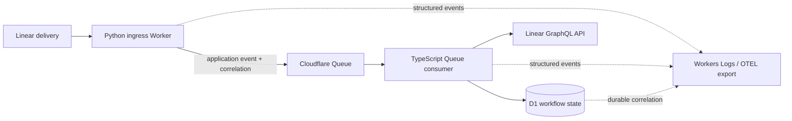
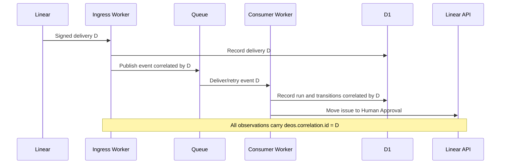

## Context

See `proposal.md` for motivation. The merged system has a Python HTTP ingress Worker, a TypeScript Queue consumer, D1 delivery/workflow state, and a source-delivery identifier already carried in each application event. Draft PR #7 adds telemetry code before stage approval and also changes an unrelated Queue-consumer outcome return value.

Cloudflare Workers Logs can index structured JSON and can export through OpenTelemetry; observability must be explicitly enabled in Wrangler configuration. The low-volume test deployment can use full head sampling, but that is not a production sampling decision. See [Cloudflare Workers Logs](https://developers.cloudflare.com/workers/observability/logs/workers-logs/).

## Goals / Non-Goals

**Goals:**

- Make one accepted provider delivery queryable across both Workers and durable state changes.
- Use one allowlisted event envelope in Python and TypeScript.
- Record success only after the observed operation succeeds and retain retry semantics on failure.
- Produce provider-originated evidence that a reviewer can reproduce without a custom UI.
- Recover the valid telemetry portion of PR #7 only after this plan is approved.

**Non-Goals:**

- Introduce a custom trace collector, application dashboard, or third-party SaaS.
- Put raw Linear payloads, secrets, or authorization data into telemetry.
- Change workflow decisions, approval semantics, or durable idempotency.
- Preserve the unrelated outcome-return fix in PR #7; that change must be removed from the telemetry diff and handled separately if still required.

## Decisions

### Use the source delivery identifier as the cross-boundary correlation identifier

`Linear-Delivery` is authenticated with the request context, is already the ingress idempotency key, and is carried in the canonical application event. It becomes `deos.correlation.id` and the D1 `workflow_runs.correlation_id`. The workflow run identifier remains a separate issue-stable identity.

Alternative considered: create a random trace identifier at each Worker boundary. Rejected because it requires a separate join map and can split one delivery across unrelated traces on retry.

### Emit an allowlisted structured event envelope

Every event uses this logical shape:

- `event.name`
- `observed_at`
- `service.name`
- `severity.number` and `severity.text`
- `deos.correlation.id`
- optional allowlisted identifiers: delivery, issue, project, and workflow run
- operation-specific attributes such as prior/next state, cause, target hostname, retry classification, and outcome

Python and TypeScript adapters produce the same field names and scalar types. Error events contain an allowlisted error type and operation classification, not an unfiltered provider response or raw exception payload.

Alternative considered: log formatted strings. Rejected because structured JSON is directly indexed and filterable by Workers Logs.

### Observe each side-effect boundary explicitly

The minimum event set covers:

- ingress accepted, ignored, duplicate, rejected, and Queue publication failure;
- Queue message consumed and replayed;
- workflow run created or reused;
- each durable state transition;
- outbound Linear issue-update started, succeeded, or failed.

Success events occur after the Queue send, D1 statement, or external call succeeds. A caught failure is emitted and rethrown so existing Queue retry behavior remains authoritative.

### Use Cloudflare-native logs and traces for the first deployed proof

Both Workers enable observability and emit structured JSON. The test deployment uses a head sampling rate of `1` so the single acceptance delivery is not intentionally sampled out. Evidence records the Worker version and a query filtered by `deos.correlation.id`. OpenTelemetry export remains possible without changing the event contract.

Alternative considered: add a direct OTLP exporter in application code. Deferred because it adds network delivery, credentials, batching, and failure behavior that are not needed to prove the contract.

### Treat draft PR #7 as recoverable code, not approved scope

After this planning PR is approved, PR #7 must be relinked to SAC-80 and rebased onto the approved plan. Its diff is reviewed requirement by requirement. The Queue-consumer change that converts internal `approve`/`reject` action names to `approved`/`rejected` outcomes is removed from the telemetry PR; if the full TypeScript gate still exposes that defect, it receives its own issue and PR.

### Component and event flow

### Minimal data model

- `correlation_id`: exact source delivery identifier for the accepted application event.
- `event_name`: stable dotted operation name.
- `service_name`: emitting Worker identity.
- `observed_at`: UTC observation time.
- `outcome`: accepted, ignored, duplicate, succeeded, failed, or replayed as applicable.
- optional context: delivery, issue, project, workflow run, transition states/cause, target host, and allowlisted error type.

## Risks / Trade-offs

- [Structured events drift between runtimes] → Share a documented fixture contract and run equivalent Python/TypeScript schema tests.
- [Head sampling hides acceptance evidence] → Use full sampling only for the low-volume test deployment and record the deployed configuration.
- [Logs claim success before durable state] → Emit success after awaited operations and cover ordering with deterministic fakes.
- [Retries create misleading duplicate transition events] → Inspect durable write results and label replay separately from a new state change.
- [Error messages leak provider data] → Emit only allowlisted classifications and test with credential-shaped sentinel values.
- [PR #7 hides unrelated behavior changes] → Remove the outcome-contract edit before telemetry approval; do not broaden SAC-80 retroactively.

## Migration Plan

1. Keep PR #7 draft while this planning PR is reviewed.
2. After approval, rebase PR #7 onto the approved planning commit and relink it to SAC-80.
3. Remove or split the Queue-consumer outcome-contract fix and map the remaining diff to the spec and task checklist.
4. Run deterministic schema, propagation, retry, redaction, and failure tests plus existing gates.
5. Deploy both Workers to the test environment with observability enabled and record their version identifiers.
6. Trigger one real Linear transition, query by correlation identifier, and capture fresh D1 plus sanitized visual evidence.
7. Roll back the Worker version or configuration if telemetry causes request, Queue, or external-call behavior to regress.

