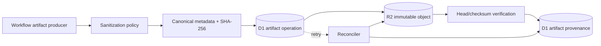
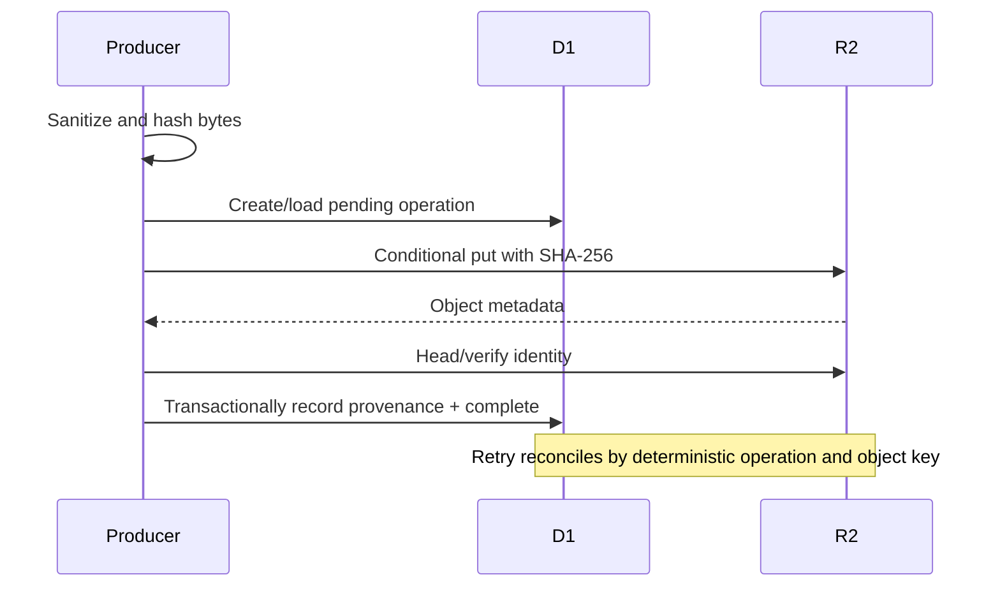

## Context

See `proposal.md` for motivation. The test deployment already binds an R2 bucket and D1 stores workflow runs and transitions, but the merged `ArtifactStore` boundary is only a deterministic fake. R2 object writes are strongly consistent after a successful `put`, support SHA-256 integrity checking and custom metadata, and return stored-object metadata. See the [R2 Workers API](https://developers.cloudflare.com/r2/api/workers/workers-api-reference/).

D1 can make a group of SQL statements transactional within one database, but that transaction cannot include an R2 operation. See the [D1 database API](https://developers.cloudflare.com/d1/worker-api/d1-database/). The design therefore treats R2/D1 coordination as an idempotent state machine rather than claiming cross-service atomicity.

## Goals / Non-Goals

**Goals:**

- Make artifact bytes immutable and independently verifiable by SHA-256.
- Keep full provenance queryable in D1 while storing only a safe metadata subset with the R2 object.
- Recover deterministically from failure before or after the R2 write.
- Prevent forbidden evidence from reaching object storage.
- Verify the design against the existing isolated test bucket and database.

**Non-Goals:**

- Delete or overwrite artifacts automatically.
- Add an artifact browser, retention engine, or general-purpose file API.
- Claim a distributed transaction across R2 and D1.
- Store raw provider payloads or production data.

## Decisions

### Use content-addressed immutable object keys

The canonical key shape is:

`runs/<run-id>/<capability>/<kind>/sha256/<digest><safe-extension>`

All path components are validated slugs or opaque identifiers; user-controlled paths cannot add `..`, empty segments, or alternate separators. The producer computes SHA-256 before upload and supplies it to R2 as the integrity checksum. A conditional write prevents replacement of an existing key; if the key already exists, recovery uses `head`/`get` metadata and hash verification to distinguish an idempotent replay from conflict.

Alternative considered: timestamp-only keys with overwrite. Rejected because retry could silently replace evidence and break provenance.

### Separate artifact operations from completed provenance

D1 adds an `artifact_operations` record with a deterministic operation identity and states `pending`, `complete`, or `failed`. The operation identity is derived from workflow run, capability, kind, and content hash. A successful operation points to one immutable `artifacts` provenance record; D1 statements that finalize the operation and provenance are executed transactionally together.

The sequence is:

1. sanitize and canonicalize metadata;
2. compute key, SHA-256, size, and deterministic operation identity;
3. insert or load the D1 pending operation;
4. conditionally put the R2 object with checksum and safe custom metadata;
5. verify returned or headed object metadata;
6. transactionally create provenance and mark the operation complete.

Alternative considered: write D1 only after R2. Rejected because a D1 outage after upload would leave no durable recovery identity.

### Keep full provenance in D1 and minimal metadata in R2

R2 custom metadata contains only the artifact identifier, workflow run identifier, SHA-256 hash, artifact kind, and evidence-policy version. D1 carries the full joinable provenance. This limits duplicated high-cardinality data and makes policy upgrades explicit.

### Make sanitization an allowlist gate before upload

Evidence producers submit typed artifacts and metadata. A policy selects permitted kinds, content types, metadata fields, and maximum approved evidence content. Credential-shaped sentinels and known secret fields cause rejection before any R2 call. The stored provenance records the policy version.

Alternative considered: upload then redact in place. Rejected because immutable content-addressed objects must never contain forbidden original bytes.

### Recover by idempotent reconciliation, never blind overwrite

Retry loads the existing operation. If R2 has the expected key and checksum, it completes D1 provenance. If the object is absent, it retries the conditional put. If metadata or hash conflict, it marks the operation failed for manual review. Recovery does not delete unexpected objects automatically.

### Component and event flow

### Minimal data model

`artifact_operations`:

- `operation_id`, `workflow_run_id`, `capability`, `artifact_kind`
- `object_key`, `sha256`, `byte_size`, `content_type`
- `status`, `attempt_count`, `last_error_code`
- `created_at`, `updated_at`

`artifacts`:

- `artifact_id`, `operation_id`, `workflow_run_id`
- `linear_issue_id`, `source_delivery_id`, `correlation_id`
- `capability`, `artifact_kind`, `content_type`
- `producer`, `producer_version`, `policy_version`
- `object_key`, `r2_version`, `etag`, `sha256`, `byte_size`, `created_at`

## Risks / Trade-offs

- [R2 succeeds and D1 fails] → Persist pending intent first and reconcile by immutable key and checksum.
- [D1 pending intent exists but R2 never received bytes] → Retry the conditional put with the same operation identity.
- [Same logical kind legitimately changes] → New bytes produce a new digest and immutable object; no overwrite occurs.
- [Metadata exceeds object-store constraints] → Store only the safe minimal subset in R2 and keep full provenance in D1.
- [Sanitizer misses novel secrets] → Use allowlisted artifact types and metadata rather than blacklist-only replacement.
- [Orphan cleanup deletes evidence] → Do not automate deletion in this stage; report conflicts for explicit review.

## Migration Plan

1. Add D1 operation/provenance tables and indexes without altering existing workflow rows.
2. Extend the domain artifact contract and deterministic fakes; prove success, replay, conflict, and both partial-failure directions.
3. Add the R2 adapter using conditional immutable writes, SHA-256 verification, and minimal custom metadata.
4. Integrate one safe evidence-pack write after the applicable workflow step; do not add live agent execution.
5. Apply the additive D1 migration to isolated test resources and deploy with the existing test R2 binding.
6. Store one sanitized test artifact, verify R2 metadata and matching D1 provenance read-only, and capture executable evidence.
7. On failure, disable the artifact-writing path while retaining additive tables and immutable test objects for diagnosis; no destructive rollback is required.

