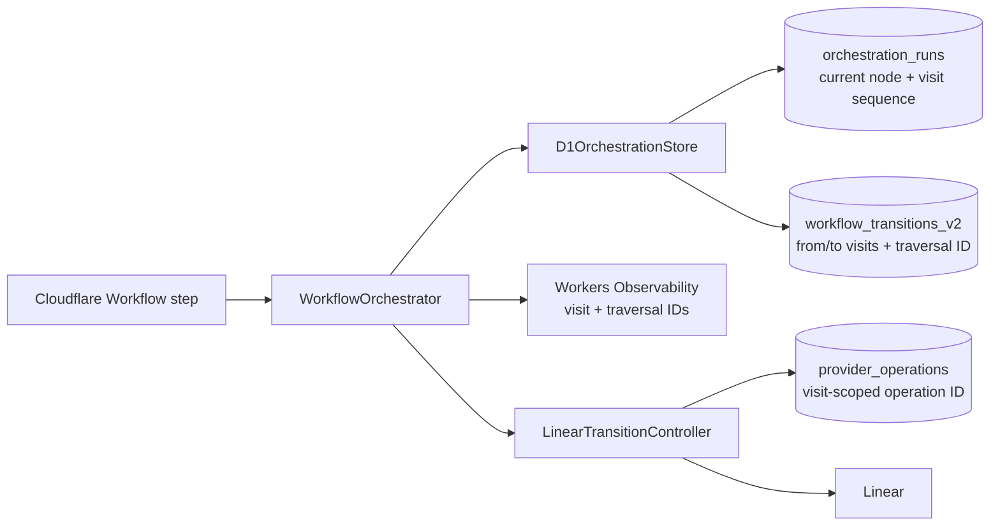

## Context

See `proposal.md` for the defect and motivation. The approved `workflow-state`
and `workflow-observability` deltas require a durable identity for each genuine
node visit, atomic agreement between the run row and transition ledger, exact
replay detection, visit-scoped human-gate operations, and truthful telemetry.

Today `orchestration_runs` identifies only the current node. Transition IDs are
derived from the run, source node, outcome/cause, and a constant ordinal of one.
Consequently a later genuine traversal with the same facts collides with the
first transition. `D1Database.batch()` is already the write boundary, but the
current `UPDATE` can succeed while `INSERT OR IGNORE` silently suppresses the
ledger row. Cloudflare Workflow steps can retry, so the D1 operation must be
idempotent independently of Workflow step caching.

## Goals / Non-Goals

**Goals:**

- Give the authoritative current node a monotonic, durable visit sequence.
- Derive one stable transition identity from each source visit.
- Commit the guarded run update and matching ledger insert atomically.
- Distinguish exact traversal replay, stale authority, and identity conflict.
- Scope Linear human-gate entry operations and workflow telemetry to a visit.
- Migrate existing runs and transitions without rewriting historical identities.

**Non-Goals:**

- Repair transition rows omitted before this change or reinterpret old graph
  history.
- Change graph evaluation, Sandbox attempt identity, delivery idempotency, or
  terminal business-state semantics.
- Deploy a new workflow graph or complete the SAC-112 archive canary.

## Component Diagram



## Event Flow

1. The Workflow reloads the run, including `current_visit_sequence`, inside its
   authority step.
2. Node evaluation produces the selected edge and its cause facts.
3. The orchestrator derives `visit_id` from `(run_id, current_visit_sequence)`
   and `transition_id` from that visit. The next visit is the current sequence
   plus one.
4. D1 executes one transactional batch:
   - update the run only when run ID, source node, source visit, and active
     transition identity still match and that transition identity is absent;
   - insert the matching ledger row only from the run state produced by that
     guarded update.
5. If both statements change one row, the traversal committed. Otherwise the
   store reads the named transition:
   - an exact fact match is an idempotent replay;
   - different facts under the same identity are an identity conflict;
   - no named transition is a stale compare-and-set and the Workflow reloads
     D1 authority before further work.
6. Observability reports `succeeded` only for the new commit and `duplicate`
   only for the exact replay, with both visit and traversal identities.
7. On a human-gate visit, the Linear entry operation uses the visit sequence as
   its ordinal. A retry of the same visit reuses the operation; a later visit to
   the same gate gets a different operation.

## Minimal Data Model

```text
orchestration_runs
  run_id                   TEXT PRIMARY KEY
  current_node             TEXT NOT NULL
  current_visit_sequence   INTEGER NOT NULL CHECK (> 0)
  last_transition_id       TEXT
  previous_node            TEXT
  ...existing lifecycle fields

workflow_transitions_v2
  transition_id            TEXT PRIMARY KEY
  run_id                   TEXT NOT NULL
  from_node / to_node       TEXT NOT NULL
  from_visit_sequence      INTEGER NOT NULL CHECK (> 0)
  to_visit_sequence        INTEGER NOT NULL CHECK (> 0)
  ...existing cause, actor, provider-operation, and time fields

UNIQUE (run_id, from_visit_sequence)
```

The initial node is visit one. `last_transition_id` links the authoritative run
state to the ledger row that produced it. Each committed traversal from visit `n` records
`from_visit_sequence = n`, `to_visit_sequence = n + 1`, and leaves the run at
visit `n + 1`. The unique index makes “one transition per genuine source
visit” a database invariant.

## Decisions

### Use a monotonic visit sequence stored on the run

The sequence is small, readable, deterministic, and available in the same D1
authority row used for graph decisions. It also gives human-gate operations a
stable ordinal without introducing another allocator.

Alternatives considered:

- A random UUID generated by the Workflow would require persisting the UUID
  before any side effect and carefully carrying it through replay boundaries.
- Counting matching historical edges would be ambiguous under omitted rows and
  would require an extra read susceptible to stale authority.
- Using cause references would still collide when a later traversal has the
  same deterministic agent/system outcome.

### Derive traversal identity from the source visit

There is at most one selected edge from a committed source visit, so
`(run_id, from_visit_sequence)` is the logical traversal identity. Edge and
cause facts remain stored and are compared before a collision is accepted as a
replay. This separates identity from mutable or repeatable outcome text.

### Keep the update and insert in one guarded D1 batch

D1 batches execute sequentially as a transaction and roll back on statement
failure. The run update adds the visit compare-and-set and an absence guard for
the proposed transition, and stores that identity as `last_transition_id`. The
insert is conditional on the exact post-update run facts and identity. A
successful result requires one changed row from each statement;
all other results are reconciled by reading the transition identity.

An insert-first design was rejected because a stale attempt could create an
orphan ledger row before discovering that it no longer owned the run visit.
Separate statements were rejected because they preserve the existing split-
brain window.

### Make replay classification an exact stored-fact comparison

The store returns `committed`, `replayed`, or `stale`; it throws on an identity
conflict. The orchestrator no longer infers replay merely because the current
node equals the proposed target. Exact comparison covers run, visits, edge,
cause, actor, and provider-operation facts.

### Reuse the visit sequence for human-gate and telemetry lineage

Linear entry operation identity uses the gate visit sequence as its ordinal.
Lifecycle observations add `deos.workflow.visit_id` and
`deos.workflow.traversal_id`. These fields make a repeated edge successful and
queryable while preserving the existing correlation and run IDs.

## Failure Modes

| Failure | Durable behavior |
| --- | --- |
| Workflow retries the same transition callback | Exact transition is found; no new row, run update, or provider effect; telemetry says `duplicate`. |
| Two callbacks race from one visit | One transactional batch commits; the loser reconciles the same row as replay. |
| Callback uses a stale node or visit | Both writes change zero rows; authority is reloaded and the stale decision is not applied. |
| Transition ID exists with different facts | Store throws an identity-conflict error; neither run nor ledger changes. |
| Either D1 statement errors | D1 rolls back the batch; Workflow retry sees the original authority. |
| Workflow returns to a previous node or gate | The run now has a later visit sequence, producing new traversal and gate-operation IDs. |
| Migration is applied but the new Worker cannot remain deployed | Keep dispatch disabled and repair forward with a visit-aware Worker; do not run the previous Worker against the uniqueness index because its inserts use the visit-column defaults. |

## Risks / Trade-offs

- **[Historical gaps remain]** Existing omitted transitions cannot be
  reconstructed safely from final node state alone. -> Backfill visit sequences
  only for rows that exist and state this boundary in evidence.
- **[Mixed-version rollout]** An old Worker does not advance the new visit
  column and would reuse the visit-column defaults. -> Disable trial dispatch,
  apply the additive migration immediately before deploying the visit-aware
  Worker, verify that version, and only then enable the bounded canary. Do not
  roll back to the old Worker while the uniqueness index remains.
- **[Sequence overflow]** A pathological run could traverse extremely many
  edges. -> SQLite integers are 64-bit; workflow bounds and terminal policies
  keep practical runs far below the limit.
- **[New uniqueness invariant exposes corrupt history]** Historical duplicate
  source visits would prevent index creation. -> Deterministically rank existing
  rows per run before creating the unique index and validate counts locally and
  remotely before deploy.

## Migration Plan

1. Keep project dispatch disabled.
2. Add `current_visit_sequence` to runs and from/to visit sequences to the
   transition ledger with positive defaults.
3. Rank existing transition rows deterministically by occurrence time and ID,
   backfill their visit sequences, and set each run's current visit to one more
   than its existing transition count.
4. Create the unique `(run_id, from_visit_sequence)` index.
5. Validate the migration on a local D1 copy and inspect remote preconditions.
6. Apply the additive migration remotely, deploy the Worker, and verify the
   deployed version and D1 schema.
7. Enable only the bounded provider canary, drive two genuine traversals of the
   same edge, then disable dispatch again.
8. Query D1 read-only for distinct visits and transition rows and query Workers
   Observability for successful, non-duplicate traversal events.

Rollback keeps dispatch disabled and repairs forward with a visit-aware Worker.
Returning to the previous Worker would also require a separately reviewed D1
table-rebuild migration that removes the visit uniqueness invariant; this
change deliberately provides no destructive automatic down migration.
