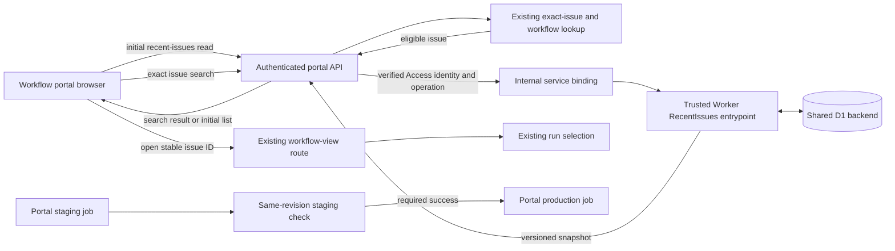

## Context

See `proposal.md` and `specs/portal-recent-issues/spec.md` for the approved
behavior. This change belongs to the DEOS workflow portal, not BettaView. The
portal already authenticates requests with Cloudflare Access, finds an exact
issue and its workflow view, and opens that view with the existing run-selection
rules.

The portal has no provider secret. Privileged data access is owned by the
trusted queue Worker and reached from the portal through an internal service
binding. Recent-issue persistence follows that boundary instead of giving the
portal Worker a broad binding to the D1 database that also contains route and
run authority.

There is one shared D1 backend for the portal deployments. The checked inputs
do not establish a separate staging database, and this design does not add one.
They also do not name or prove the asserted existing CI-only production gate;
the repository guide documents a direct Wrangler production command. The
release design therefore states the minimum gate that must be demonstrated for
the approved staging requirement. If the existing pipeline does not implement
that gate, production release remains blocked until it does.

## Component Diagram

## Goals / Non-Goals

**Goals:**

- Keep one durable, server-owned list for each stable authenticated identity.
- Keep all D1 access behind a narrow trusted-Worker entrypoint.
- Make deduplication, recency, the ten-item bound, and the returned snapshot one
  atomic update.
- Restore the list on page load and reject stale browser snapshots by server
  commit order.
- Reuse the existing workflow route and run-selection behavior.

**Non-Goals:**

- Add another D1 database or synchronize history between deployments.
- Give the portal direct access to route, run, or other authority tables.
- Add operation ledgers, attestations, history administration, or user-facing
  deletion.
- Cache workflow runs or save a selected run with an issue.
- Change issue state, workflow state, or run-selection behavior.

## Decisions

### 1. Put recent-history D1 access in the trusted Worker

Add a narrow `RecentIssues` entrypoint to the trusted queue Worker and call it
through the portal's internal service binding. It exposes only two operations
to the portal API: list the caller's recent issues and record one server-verified
eligible issue. It has access only to the repository methods for
`portal_recent_issues`; it does not expose arbitrary SQL or accept an owner key.

The portal forwards the verified Access identity assertion with the internal
call. The entrypoint validates that assertion again and derives `person_key`
from the Access issuer and stable subject claim. It stores an opaque SHA-256
digest of `issuer + "\0" + subject`, prefixed with `access:`. Email remains an
authentication/display attribute and is not the durable owner key. Account
renames therefore keep history, and reuse of an email address cannot disclose a
previous subject's issue titles. If a valid stable subject is unavailable, the
entrypoint rejects the history operation; it never falls back to email or a
browser-supplied value.

Keeping SQL in the portal Worker was rejected because the checked architecture
uses the trusted Worker for privileged D1 work and a portal D1 binding would
broaden its access. Browser-local storage was rejected because it cannot restore
the same private list after a later sign-in on another browser.

### 2. Record only an eligible search in one atomic transaction

The existing search path remains responsible for finding the exact issue and
confirming that it has a workflow view. Only that successful server branch can
call `RecentIssues.record`; there is no browser-facing save endpoint. A failed
search or an issue without a workflow view does not call the repository.

For an eligible issue, one D1 transaction performs these statements for the
derived `person_key`:

1. Delete that person's row for the same stable issue ID.
2. Insert the stable issue ID and bounded current display values, receiving a
   new auto-incremented `recency_id`.
3. Delete only that person's rows outside their ten highest recency IDs.
4. Select their remaining rows in `recency_id DESC` order and return the highest
   selected recency ID as `snapshotVersion`.

Delete-then-insert moves a repeated issue to the top and refreshes its display
text. The unique key on `(person_key, issue_id)` is the duplicate guard. The
transaction returns its snapshot only after the insert and trim have committed;
on any statement failure, none of the four effects is retained.

The existing search response gains a `recentIssues` member:

- `{ state: "updated", snapshotVersion, items }` after a committed update.
- `{ state: "unchanged" }` when the search is ineligible for history.
- `{ state: "error", code: "recent_history_unavailable" }` when history cannot
  be updated.

The browser replaces the sidebar only for an `updated` snapshot whose server
`snapshotVersion` is greater than or equal to the last applied version. An
unchanged or error result keeps the last confirmed list, so search and workflow
navigation remain usable when recent-history persistence is unavailable.

A separate save endpoint was rejected because it could bypass the existing
eligibility check. Client-side read-modify-write was rejected because concurrent
searches could overwrite one another. A client request counter was rejected for
snapshot ordering because issue lookup duration and request order do not define
D1 commit order.

### 3. Load a versioned snapshot and navigate by stable issue ID

On page load, `GET /api/recent-issues` makes the internal list call and returns
HTTP 200 with `{ snapshotVersion, items }`. The version is the person's highest
stored `recency_id`, or `0` when their list is empty. Each item contains only
`issueId`, `identifier`, and `title`. The browser renders this server result and
does not persist an owner key or history locally.

If the repository or trusted Worker is unavailable, the endpoint returns HTTP
503 with
`{ error: { code: "recent_history_unavailable", retryable: true } }`. The
browser retains any confirmed list already in memory and shows a retry action;
it does not interpret this response as an empty history. Existing authentication
handling continues to own missing or invalid Access responses.

The browser compares every initial-load or search snapshot by
`snapshotVersion`. A late response with a lower version is ignored; a response
with the same version is idempotent. This uses D1 commit order rather than
request issue order and prevents a slow initial load or search response from
replacing a newer committed list.

Choosing a saved item passes its stable `issueId` to the existing workflow-view
route. That route continues to select a run under its current rules. Opening an
item is read-only and does not move it in history. A run ID is not stored because
the existing route owns run selection.

### 4. Apply the shared schema once and enforce same-revision promotion

The additive recent-issues migration is applied once to the shared D1 database
before either portal deployment uses it. There is no separate production
migration. Because staging and production share D1, the staging check writes to
the same table as production. The accepted boundary is explicit: the check uses
the authenticated reviewer's own identity, and the trusted Worker allows only
person-scoped delete, insert, trim, and select statements against the new table.
It can change at most that identity's ten recent-issue rows. There is no claim of
storage isolation between deployments.

The approved release rule is implemented as two CI jobs with an immutable
source revision: the logical `portal-staging` job deploys the revision and runs
the sidebar check, and the logical `portal-production` job depends on that exact
job's success and deploys the same artifact and commit SHA. Production
credentials are available only to the protected production job, so the direct
Wrangler command documented for operators cannot authenticate outside that job.
Existing jobs may have different names, but implementation evidence must map
them to these controls. A missing mapping, missing check, different revision, or
failed check makes the production job ineligible; it is not treated as an
informational warning.

This is the smallest control that satisfies the approved gate without adding a
database, identity, attestation service, or application release component.

## Event Flow

1. On page load, the browser requests `GET /api/recent-issues` from the
   authenticated portal API.
2. The portal calls `RecentIssues.list` over the internal binding with the
   verified Access assertion. The trusted Worker validates it, derives the
   subject-based `person_key`, and reads that person's newest ten rows.
3. The API returns the items and server `snapshotVersion`; the browser applies
   the snapshot unless it has already applied a higher version.
4. When the person searches, the existing server path performs exact-issue and
   workflow-view lookup.
5. With no exact issue or no workflow view, the API returns
   `recentIssues.state = "unchanged"` and does not call D1.
6. For an eligible result, the portal calls `RecentIssues.record`. The trusted
   Worker revalidates identity, then deletes the person's duplicate, inserts the
   issue, trims the person's rows to ten, and selects the versioned result in one
   transaction.
7. The API returns the existing search result with the committed snapshot. The
   browser applies it by server version, regardless of request completion order.
8. Choosing a sidebar item opens the existing workflow-view route by stable
   issue ID. Existing run selection chooses the run without changing history,
   issue state, or workflow state.

## Minimal Data Model

Add the following table to the shared D1 database:

### `portal_recent_issues`

| Column | Purpose and bound |
| --- | --- |
| `recency_id INTEGER PRIMARY KEY AUTOINCREMENT` | Total commit order and snapshot version. |
| `person_key TEXT NOT NULL` | Opaque `access:` identity digest, at most 80 characters. |
| `issue_id TEXT NOT NULL` | Stable navigation identity, 1 to 128 characters. |
| `issue_identifier TEXT NOT NULL` | Sidebar issue key, 1 to 64 characters. |
| `issue_title TEXT NOT NULL` | Sidebar display title, at most 512 characters. |

The migration adds `CHECK` constraints for these lengths,
`UNIQUE (person_key, issue_id)`, and an index on
`(person_key, recency_id DESC)`. The repository validates identifiers and
Unicode-safely truncates display titles before insertion. Every statement is
parameterized, every mutation includes `person_key`, and every read is limited
to ten.

No timestamp is required: product ordering is defined solely by successful D1
commit order, represented by `recency_id`. No environment, email, run,
operation, token, or release column or table is needed. The API exposes the
highest recency ID only as the snapshot-level `snapshotVersion`; item projections
remain `{ issueId, identifier, title }` and never expose `person_key`.

## Failure Modes

- **Missing, invalid, or subject-less Access identity:** Reject before a history
  read or write. Do not fall back to email or accept a client owner key.
- **Trusted Worker or internal binding unavailable:** Return the explicit
  retryable history error. Keep issue search and workflow navigation usable.
- **No exact issue or no workflow view:** Return `state = "unchanged"` and do
  not mutate history.
- **D1 transaction or snapshot select fails:** Roll back the transaction, return
  `state = "error"`, and keep the last confirmed sidebar snapshot.
- **Initial history read fails:** Return HTTP 503 with the retryable error body;
  show retry UI rather than an authoritative empty list.
- **Concurrent successful searches:** D1 serializes the transactions. The
  highest committed recency ID is newest, uniqueness prevents duplicates, and
  each transaction trims only its derived identity.
- **An older response arrives late:** Ignore any snapshot with a lower server
  version. Results without items never clear the sidebar.
- **A saved issue later has no workflow view:** Use the existing workflow
  route's unavailable result. Keep the row until a later eligible search
  refreshes it or trimming removes it.
- **Shared schema setup fails:** Do not deploy the feature to staging. There is
  no second production migration to attempt or roll back.
- **Staging check writes unexpected data:** Stop promotion and inspect the
  reviewer's bounded rows. The shared-backend risk is accepted, but the narrow
  Worker entrypoint must not expose other D1 tables or unscoped mutations.
- **Staging gate is missing, fails, or checks another revision:** The protected
  production job remains ineligible and the current production revision stays
  active.
- **Production portal activation fails:** Report release failure and restore the
  prior portal revision. Leave the additive shared table in place because the
  prior revision does not use it.

## Risks / Trade-offs

- **[Staging and production are not storage-isolated]** → Limit the trusted
  entrypoint to the new table and person-scoped statements, use the reviewer's
  authenticated identity, and block promotion on unexpected results.
- **[Display text can become stale]** → Navigate with stable issue ID and
  refresh bounded display values on every eligible repeat search.
- **[A search can succeed while saving history fails]** → Keep search and
  navigation available, return an explicit history error, and avoid optimistic
  sidebar persistence.
- **[Concurrent tabs can briefly differ]** → Keep D1 authoritative and
  converge each tab using server snapshot versions on its next response or
  reload.
- **[History has no delete control]** → Keep it private and bounded to ten
  rows; deletion tooling remains outside this change.

## Migration Plan

1. Add one idempotent, additive shared-D1 migration for
   `portal_recent_issues`, its checks, unique constraint, and newest-first index.
   Apply it once before staging uses the feature.
2. Add the narrow trusted-Worker entrypoint, portal adapter, and tests for
   subject isolation, email rename/reuse, insert order, duplicate movement,
   eleventh-item trimming, value bounds, rollback, error contracts, server
   snapshot ordering, and existing workflow navigation.
3. Confirm the actual CI job and protected-environment names map to the
   `portal-staging` → same-revision check → `portal-production` gate above.
   If they do not, add that control before any production release.
4. Deploy the source revision to the existing staging portal through CI. Using
   the authenticated reviewer identity, search eleven eligible issues, repeat
   one, reload, exercise an ineligible search, and open a saved issue. Confirm
   order, uniqueness, limit, durability, no-op behavior, and unchanged issue and
   workflow state.
5. Promote only the identical checked artifact and commit through the protected
   production job, then read back the active version and verify the live portal.
6. On portal regression, restore the prior portal revision. Keep the additive
   shared table; no destructive D1 rollback is required.
