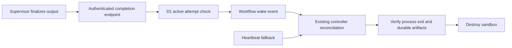

## Context

See proposal.md for the measured problem. Every parent attempt runs through supervisor.mjs. Reviewers may use a second sandbox, whose cleanup already finishes before the parent waits for collection.

## Goals / Non-Goals

Use the existing paths for tier selection and result collection. Keep active runs, review rules, provider writes, and human gates intact. The user approved this follow-up and asked that this workflow proceed without waiting for human review.

## Decisions

### Reuse the Basic release policy

Set ingress to `legacy-basic-v1`. Despite its historical name, this supported policy already saves Basic for every new start. Keep `event-label-v1` intact for old deliveries. A renamed policy would need schema changes without adding behavior.

### Reuse the workflow wake-up channel

The supervisor sends `{version: 1}` to a completion capability after final output, including failure status. Its existing signed grant and attempt header authenticate the request. The Worker checks D1 for the active run, node, visit, and attempt. It resolves the current workflow instance from D1; callers cannot choose it.

The Worker sends a `linear-event` with a distinct completion payload. This existing channel already wakes agent waits and leaves Linear authority in the durable inbox. It grants no new provider action. The event only causes a fresh controller reconciliation.

Cloudflare buffers events sent before the matching wait. See [events and parameters](https://developers.cloudflare.com/workflows/build/events-and-parameters/). The supervisor may still be closing its HTTP request when reconciliation runs. A matching hint therefore enables one ten-second follow-up wait if the process is still running. It does not shorten heartbeat expiry or the absolute deadline. Normal heartbeat waits resume afterward.

### No new persistent state

D1 remains the authority for run, node, visit, attempt, and workflow instance. Workflow event history holds the hint. The collector also saves the supervisor status and original-error log when present, including on success. This preserves the finish time and notification errors after cleanup. No outbox or completion-result table is needed because the heartbeat already recovers a lost hint.

## Risks / Trade-offs

- A notification may fail or be lost. Preserve its error and use the heartbeat; do not fail successful work merely because wake-up failed.
- An early or duplicate hint may cause an extra reconciliation. It cannot supply the result or bypass compare-and-set completion.
- A supervisor can crash before writing status. The heartbeat still observes the failed process.
- The workflow may be replaced during recovery. Resolve its current identity from D1 for each request.
- Deployment can interrupt active containers. Check current production state before release and use the existing recovery procedure where needed.

## Migration Plan

No database migration. Validate locally, then release the backend with the updated supervisor image. Read back the active version and image. Release ingress with the Basic policy. Use a small real provider run to verify Basic selection, wake receipt, durable artifacts, and cleanup timing. The user waived a fixed trial window.

To roll back completion hints, deploy the prior backend and keep Basic ingress. The heartbeat remains compatible with supervisors that send no hint. Do not revert saved run tiers.
