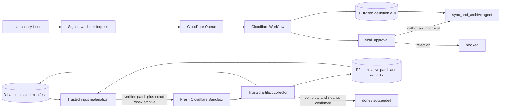
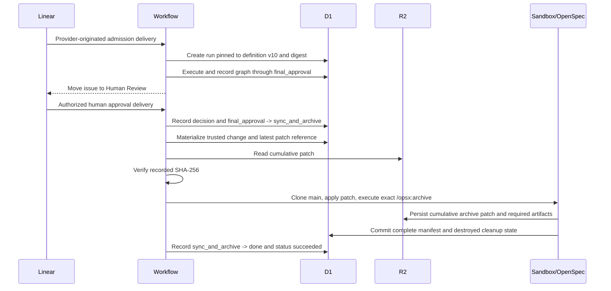

## Context

See [proposal.md](proposal.md) for the motivation and the two delta specifications for the required behavior. The deployed version 9 definition already executes native `/opsx:verify` and `/opsx:archive` as typed Sandbox agent jobs, restores the latest cumulative patch from R2 after SHA-256 verification, persists attempt artifacts, and freezes every admitted run to its D1 definition snapshot. Its active tail still routes `release_approval -> deploy -> release_finalization -> sync_and_archive -> done`.

The checked-in bundle is the source for newly admitted definitions. Stored older definitions must remain parseable because an active run may resume after the bundle advances. No schema migration is required: agent attempts, artifact manifests, workflow transitions, inbox decisions, definition snapshots, and terminal run status already have durable D1 representations.

## Goals / Non-Goals

**Goals:**

- Publish a new immutable definition whose final human gate routes directly to native archive and terminal success.
- Remove unused release-finalization configuration from the new bundle without breaking restoration of older snapshots.
- Fail archive startup when no cumulative patch exists, and retain the existing integrity, artifact, receipt, and cleanup controls.
- Prove the deployed path through a real Linear admission and final human decision, with D1 and R2 evidence.

**Non-Goals:**

- Remove backward-compatible parsing of `release.deploy` from stored older definitions.
- Add a deployment executor, release policy, schema migration, or run-level branch/PR lifecycle.
- Change earlier review loops or infer semantic quality from the canary.

## Component Diagram



## Event Flow



The earlier requirements and architecture gates use the existing human-event mechanism. The proof is complete only after the final approval is provider-originated from an authorized human and the same run reaches `succeeded`.

## Minimal Data Model

No D1 schema changes are needed.

```text
workflow_definition_snapshots
  definition_id, version=10, digest, canonical_json

orchestration_runs
  definition_id, definition_version, definition_digest
  current_node, current_visit_sequence, status

workflow_transitions_v2
  visit_id, transition_id, from_node, to_node, cause, delivery_id

agent_attempts
  node_id=sync_and_archive, job_spec_json
  state, result_class, manifest_id, cleanup_state

job_spec_json
  openspecInstruction=/opsx:archive
  openspecChange=<trusted Linear identifier slug>
  continuationPatch={attemptId, manifestId, r2Key, sha256}

artifact_manifests / artifacts
  state=complete, logical_name, r2_key, sha256
```

## Decisions

### 1. Advance the immutable definition and change only the active tail

Increment `metadata.version` from 9 to 10, rename the final gate from `release_approval` to `final_approval`, route `openspec_verify.completed` to that gate, and route `final_approval.approved` directly to `sync_and_archive`. Remove the `deploy` and `release_finalization` nodes and the release-finalization job from the new YAML bundle.

Renaming the gate makes the authority boundary explicit in durable transitions and canary evidence. Reusing `release_approval` was rejected because it preserves an inaccurate deployment-oriented name. Adding a second terminal gate was rejected because it would create authority after the intended final decision.

### 2. Keep compatibility support for older frozen definitions

Keep `release.deploy` and `openspec.sync_and_archive` in the workflow parser's supported system-action allowlist even though version 10 does not use them. `restoreWorkflowDefinition` reconstructs stored snapshots through that parser, so removing the action would make older active runs unrestorable. The current bundle will stop importing the unused release-finalization prompt, while the historical prompt file may remain as inert documentation for older graph history.

Rejecting old definitions after rollout was rejected because it violates immutable run selection. Carrying the unused job in version 10 was rejected because it weakens graph inspection and canary assertions.

### 3. Reuse the typed archive job and add an archive-specific patch prerequisite

`sync_and_archive` remains an `agent` node referencing `openspec_archive`, whose frozen operation is already `/opsx:archive`. The trusted materializer continues to derive the change identity from the Linear issue, enumerate prior completed results/manifests, and select the newest completed cumulative patch. The controller will reject allocation for `/opsx:archive` when that patch reference is absent; existing digest verification and `git apply --check` remain the trusted restoration boundary.

Reimplementing archive as a system action was rejected because the system-action controller only reconciles external receipts and cannot execute native OpenSpec. Letting archive start from a clean checkout was rejected because it could archive a different or missing change while appearing successful.

### 4. Use existing attempt completion controls as the success predicate

No archive-specific terminal shortcut is added. The collector must persist every required output, validate the result schema, reconcile any attempted provider operations, and confirm Sandbox destruction before the agent outcome can traverse its `completed` edge. `blocked` and `failed` both lead to terminal `blocked`; only `completed` reaches `done`, whose outcome sets the business status to `succeeded`.

Inferring success from a patch filename or Codex exit code was rejected because those signals bypass manifest completeness and cleanup authority.

### 5. Prove the graph with a minimal native OpenSpec canary

Deploy version 10 with trial dispatch disabled, verify registration, then enable only the configured test project. Create a small Linear canary whose trusted slug names a repo-local OpenSpec change with a tiny main-spec addition and no application deployment. Drive admission and every gate with real Linear deliveries, retaining screenshots at provider configuration and final issue state. At the final gate, the authorized human decision must resume the same Workflow instance.

After completion, query D1 for the run, definition, inbox decisions, visit-aware transition ledger, archive job specification, attempt state, manifest, artifacts, and absence of deploy/release attempts. Retrieve the final patch from R2 and verify its digest, archived path, synchronized main spec, and strict validation. Disable dispatch and read it back before declaring the proof complete.

A synthetic signed request is useful as a preflight but is not provider-originated proof and cannot satisfy this task.

## Failure Modes

| Failure | Required behavior |
| --- | --- |
| New definition still references a removed job or node | Bundle loading/tests fail before deployment. |
| Older snapshot contains `release.deploy` | Parser retains compatibility and restores the frozen graph by digest. |
| Archive job has no cumulative patch | Allocation fails closed; no Codex archive process starts and the run cannot succeed. |
| Patch object is missing, malformed, digest-invalid, or not applicable | Startup fails, cleanup runs, and the completed edge is not taken. |
| Archive result or required artifact is missing | Manifest is incomplete; the attempt is not accepted as completed. |
| Archive Sandbox cannot be destroyed | Cleanup failure prevents completed success and preserves the resource identity for reconciliation. |
| Unauthorized or automated approval event arrives | Existing gate repair logic keeps the run awaiting an authorized human. |
| Canary traverses `deploy` or `release_finalization` | The proof fails even if the executor itself returns success. |
| Trial dispatch remains enabled | Rollout is incomplete; disable and read back before reporting success. |

## Risks / Trade-offs

- **[Risk] Renaming the final gate makes cross-version transition queries use two node names.** -> Definition version remains part of every run; operator evidence will query version 10 explicitly and older snapshots remain unchanged.
- **[Risk] A no-change latest patch would not reconstruct earlier cumulative work.** -> The trusted supervisor's patch is cumulative relative to `main`; deterministic tests and the canary inspect the actual restored/archive patch.
- **[Risk] Live canary progress depends on real human gates.** -> Prepare and monitor the run autonomously, but accept only provider events attributed to an authorized human; never substitute an agent transition.
- **[Risk] Keeping legacy action parsing looks like active release support.** -> Assert that version 10 contains no release nodes/jobs and document the allowlist entry as restore-only compatibility.

## Migration Plan

1. Implement version 10, archive-patch fail-closed behavior, tests, and factual workflow documentation.
2. Run strict OpenSpec validation, TypeScript tests/type checks, Python validation, binding checks, and Wrangler dry-runs.
3. Commit and push the user-authorized no-PR change directly to `main`.
4. With trial dispatch disabled, deploy orchestration, verify the Worker/container version, and confirm the new definition snapshot in D1.
5. Enable only the controlled test project and trigger a real Linear canary.
6. Observe every gate and attempt; after final human approval, verify the same run archives and reaches `succeeded` without release nodes.
7. Disable trial dispatch, confirm no live Sandbox remains, and retain sanitized D1, R2, Cloudflare, and visual evidence.

Rollback disables dispatch first and deploys the previous Worker version. No definition, run, transition, attempt, manifest, or artifact row is deleted. Runs already pinned to version 10 continue through its stored graph; older runs continue through their own stored definitions.
