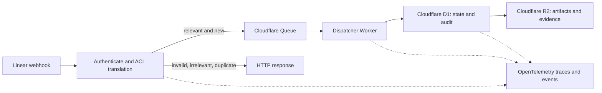

## Context

This design establishes a deployable Cloudflare Worker that receives a real Linear webhook, translates it into an application event, and processes it asynchronously through Cloudflare Queues, D1, and R2. The first workflow pauses for a human decision in Linear and emits OpenTelemetry-compatible telemetry for tool-level querying.

## Design intent

The design provides a small Python-first boundary for authenticated ingress, durable dispatch, explicit workflow state, human approval, and observable execution. Deterministic fakes remain available for fast tests, while a Cloudflare deployment and a test Linear project exercise the actual integration path.

## Decisions

- **Ingress first:** authenticate and deduplicate the raw Linear delivery, then pass it through an anti-corruption layer (ACL) that maps provider fields into the application event model.
- **Asynchronous boundary:** accepted events move through Cloudflare Queues; the HTTP handler only validates, records, and acknowledges the delivery.
- **Workflow definition:** the first transition map is `RECEIVED -> QUEUED -> REQUIREMENTS_IN_PROGRESS -> AWAITING_HUMAN_APPROVAL`, with explicit `APPROVED` and `REJECTED` outcomes. Project policy selects which Linear state transition starts the flow.
- **Cloudflare persistence:** D1 stores deliveries, project policy, workflow runs, transitions, and audit records; R2 stores OpenSpec artifacts and evidence packs; Queue provides durable handoff.
- **Human approval UX:** the workflow moves the issue into the configured Linear board column `Human Approval` and waits in `AWAITING_HUMAN_APPROVAL`. A configured transition out of that column resumes the run as `APPROVED` or `REJECTED`; no worker infers approval from the issue text.
- **OpenTelemetry first:** ingress, queue consumption, state transitions, and external calls emit OTEL traces/events with correlation IDs so an existing OTEL backend or tool can visualize and query behavior before a custom UI exists.
- **Python-first modules:** domain logic is separated from Cloudflare binding adapters so the same behavior can run under deterministic tests and the deployed Worker.

### Component and event flow

### Minimal data model

- `delivery`: provider delivery id, received timestamp, classification, payload hash.
- `application_event`: canonical event id, issue id, project id, transition, actor, occurred at, source delivery id.
- `workflow_run`: project, issue, current state, created and updated timestamps, correlation id.
- `transition`: run id, previous state, next state, cause, actor, timestamp.
- `artifact`: run id, capability, kind, R2 location, content hash, created timestamp.

The ACL owns the mapping from the Linear webhook payload to `application_event`; domain code does not consume provider-specific fields.

## Risks / Trade-offs

- [Replay or duplicate delivery] → require stable delivery identifiers and idempotent D1 recording before enqueue.
- [Signature verification drift] → verify the raw body and isolate provider-specific signing code.
- [Approval bypass] → model approval as a persisted D1 state transition requiring an explicit Linear action.
- [Cloudflare runtime mismatch] → keep domain logic platform-neutral and run a deployed Worker smoke test against the required bindings.
