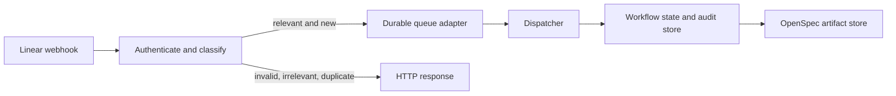

## Context

The proposal defines a serverless Linear-driven workflow but the repository currently contains only planning material. The first implementation slice must be deterministic, auditable, asynchronous, and safe without production credentials.

## Goals / Non-Goals

**Goals:** establish a small Python-first boundary for authenticated ingress, durable dispatch, explicit workflow state, and OpenSpec artifact provenance.

**Non-Goals:** live Linear or agent execution, production Cloudflare deployment, automatic approval, and concurrency coordination beyond the first deterministic slice.

## Decisions

- **Ingress first:** normalize and deduplicate events before any workflow action.
- **Asynchronous boundary:** accepted events move through a queue-like interface; the HTTP handler never runs agents.
- **Explicit state:** workflow transitions are persisted with audit fields, and approval states are terminal until an explicit decision arrives.
- **Test doubles:** clocks, queue clients, storage, and downstream clients are injected so tests never contact production services.
- **Python-first modules:** keep domain behavior independent of the eventual Cloudflare adapter; use a platform adapter only at the edge.

### Component and event flow

### Minimal data model

- `delivery`: provider delivery id, received timestamp, classification, payload hash.
- `workflow_run`: project, issue, current state, created and updated timestamps.
- `transition`: run id, previous state, next state, cause, actor, timestamp.
- `artifact`: run id, capability, kind, location, content hash, created timestamp.

## Risks / Trade-offs

- [Replay or duplicate delivery] → require stable delivery identifiers and idempotent recording before enqueue.
- [Signature verification drift] → verify the raw body and isolate provider-specific signing code.
- [Approval bypass] → model approval as a persisted state transition requiring an explicit command.
- [Cloudflare runtime mismatch] → keep domain logic platform-neutral and defer binding-specific adapters.

