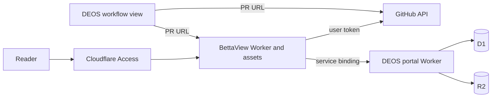

## Context

See `proposal.md` for motivation. DEOS already serves a protected workflow portal and stores SAC-139 review state in D1 and R2. The experimental BettaView revision `de22c3cf9a95285647bbf31cac1d6242bef6142a` already renders Markdown pull requests and supports native GitHub review actions, but it assumes a local Node process, the local `gh` token, temporary files, and in-process trace generation.

## Goals / Non-Goals

**Goals:**

- Own the maintained BettaView source in DEOS.
- Keep one pull request connected to focused PR and Review views.
- Put the accepted trace and its semantic review history on one Review page.
- Preserve GitHub review behavior and human attribution.
- Reuse SAC-139 without starting another workflow.
- Verify every released D1/R2 artifact against its durable record.

**Non-Goals:**

- Run a model or a second workflow orchestrator in BettaView.
- Make review evidence public.
- Reconstruct missing historical content.
- Remove the initial author self-review before the first planning pull request is published.

## Component diagram

## Event flow

1. The reader opens `bettaview.voxdez.com/?pr=<canonical-url>` through Access.
2. BettaView restores or starts a server-side GitHub user session.
3. The Worker reads the live pull request, rendered Markdown, threads, viewer identity, and capabilities from GitHub.
4. The Worker sends the canonical repository and pull-request number to the DEOS service binding.
5. DEOS resolves one durable run and builds the accepted trace and complete review/process story.
6. DEOS reads only allowlisted artifacts through complete manifests and verifies every object hash.
7. BettaView narrows the story to author work, self-review, one external-discovery cycle, author dispositions, trace refreshes, semantic human-review decisions, and the final result, then shows PR and Review. It compares the live and reviewed heads before calling the trace current.
8. A GitHub write is checked against the loaded head and sent with the reader's user token.

After external review and any author response, trusted publication updates the pull request first. DEOS then generates a complete trace against that exact published head and document hashes. Only the accepted final-head trace supplies BettaView's active citations and final summary. Earlier candidate traces remain chronological review evidence. Human Review starts only after the final trace is complete and hash-verified.

When Human Review requests a later revision, workflow version 16 routes the author update directly to trusted publication and a final-head trace refresh. It repeats neither the author self-review nor the external-discovery cycle used before the first Human Review. The refreshed result returns to the same Human Review gate, so the human reviewer can request another revision round as many times as needed before approving or canceling.

## Minimal data model

- `BettaViewSession`: opaque session ID, Access identity, encrypted GitHub access token, encrypted refresh token, expiry, and refresh state.
- `GovernedPullRequest`: repository, pull-request number, run ID, issue key, recorded head, and canonical URL.
- `ReviewStoryEvent`: stable event ID, time, semantic stage, outcome, attempt or review ID, reviewer identity, summary fields, and safe artifact references.
- Existing D1 review, candidate, manifest, provider-operation, workflow-visit, and cleanup tables remain authoritative. No browser-owned workflow state is added.

## Decisions

### Keep source together and deployments separate

Production BettaView source moves to `portal/bettaview/`. It deploys as a separate Worker so GitHub user sessions and write permissions do not expand the existing DEOS portal's public interface. A service binding keeps DEOS responsible for run selection and evidence verification. The rejected alternative was direct BettaView access to D1 and R2, which would duplicate selection rules and make cross-head evidence mixing easier.

### Port the provider boundary, not the product behavior

The imported UI and pure review helpers stay recognizable. Node-specific GitHub and Express calls move behind request handlers that can use either a local adapter or a Worker adapter. The cloud adapter omits child processes, local files, `gh`, and trace-generation routes.

### Use a GitHub App user session

Cloudflare Access is admission, not GitHub authorization. The Worker uses the GitHub App web flow with PKCE, keeps tokens in a per-session Durable Object, and sends only an opaque secure cookie to the browser. The rejected shared installation-token design would give review actions the wrong actor and too much shared authority.

### Keep complete evidence in DEOS and focus BettaView on review provenance

DEOS keeps its complete ordered projection because the main portal needs workflow transitions, failures, provider operations, waits, and cleanup. BettaView derives a smaller review story from that verified source: authored work, self-review, external review, author responses, and the accepted trace. This avoids duplicating the operational portal while preserving the evidence a pull-request reader needs. Every released artifact still passes allowlist, manifest, object-key, and hash checks.

### Prove with the existing SAC-139 run

Production validation performs read-only D1/R2 and provider reads for SAC-139. GitHub review actions use an existing controlled pull request and do not dispatch DEOS. No Linear event or workflow run is created for this portal work.

### Keep discovery reviews before first Human Review only

The initial planning candidate still runs through author self-review, its bounded repair loop, and one external-discovery cycle before Human Review. A later revision requested by the human reviewer has already passed those discovery boundaries. The author updates the existing plan, trusted publication updates the same pull request, and DEOS refreshes the complete trace against the new exact head before returning to Human Review. This human revision loop remains available for any number of rounds. Repeating either discovery review adds cost and incorrectly presents a new discovery cycle; the exact-head trace refresh supplies the required freshness proof.

### Render the definition pinned to the run

The portal restores the frozen canonical definition selected when each run was allocated and keeps the existing identity, version, and digest verification. Presentation is derived from that verified definition. Known workflow families retain their grouped product stages, while an unfamiliar node or workflow receives a safe label derived from its structural node ID so no node or edge is silently omitted.

The portal does not keep a second allowlist of accepted workflow digests. Such an allowlist couples issue visibility to portal deployment and rejects valid runs whenever the workflow evolves. Workflow immutability remains per run: an existing issue run never changes definition, while another issue may select another workflow or version.

### Separate review traces from the active final trace

An external reviewer may generate trace evidence for a candidate that the author later changes. That evidence remains part of the review story, but it stops being the active trace when reviewed bytes change. After the author response is published, the workflow uses the existing DEOS trace process with a new exact-input identity for the final head. Exact-input reuse is allowed only when the reviewed bytes and trace identity are unchanged. Human Review is gated on a complete hash-verified final trace.

Older frozen workflows are not rewritten. SAC-142 receives an operator backfill tied to its existing governed run and current pull-request head. The backfill adds durable evidence but does not add a workflow visit, replace version 13, or allocate another run.

## Risks / Trade-offs

- [GitHub authorization setup is incomplete] → Keep deployment non-preferred until the app callback, secret, and real user login pass production read/write checks.
- [Older runs did not retain every response] → Label the record unavailable and preserve the rest of the chronological story.
- [A pull request moves after review] → Compare heads on every load and write; keep old evidence visible but stale.
- [One failed artifact could hide the whole story] → Return event metadata and mark only the failed artifact unavailable, unless the event cannot be safely identified.
- [Two Workers can drift] → Keep both builds, types, tests, and deployment configuration in this repository and pin their service-binding contract.

## Migration Plan

1. Import the pinned BettaView source and record provenance.
2. Add DEOS pull-request lookup and complete-story routes with contract tests.
3. Add the Worker adapter, Access validation, GitHub user sessions, and static build.
4. Add PR and Review navigation, with the accepted trace and focused review history on one page, plus DEOS dual links.
5. Deploy BettaView without changing the workflow definition.
6. Configure the custom domain, Access application, GitHub callback, and secrets.
7. Verify SAC-139 and real GitHub review actions. Then make the BettaView link the supported reader.
8. Roll back by removing the BettaView link and deployment route; the existing DEOS portal and stored evidence remain unchanged.
