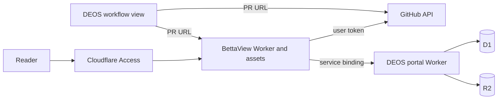

## Context

See `proposal.md` for motivation. DEOS already serves a protected workflow portal and stores SAC-139 review state in D1 and R2. The experimental BettaView revision `de22c3cf9a95285647bbf31cac1d6242bef6142a` already renders Markdown pull requests and supports native GitHub review actions, but it assumes a local Node process, the local `gh` token, temporary files, and in-process trace generation.

## Goals / Non-Goals

**Goals:**

- Own the maintained BettaView source in DEOS.
- Keep one pull request connected to its PR, Trace, and Process views.
- Preserve GitHub review behavior and human attribution.
- Reuse SAC-139 without starting another workflow.
- Verify every released D1/R2 artifact against its durable record.

**Non-Goals:**

- Run a model or a second workflow orchestrator in BettaView.
- Make review evidence public.
- Reconstruct missing historical content.
- Change the semantic review policy implemented by workflow version 12.

## Component diagram

## Event flow

1. The reader opens `bettaview.voxdez.com/?pr=<canonical-url>` through Access.
2. BettaView restores or starts a server-side GitHub user session.
3. The Worker reads the live pull request, rendered Markdown, threads, viewer identity, and capabilities from GitHub.
4. The Worker sends the canonical repository and pull-request number to the DEOS service binding.
5. DEOS resolves one durable run and builds the trace and complete process story.
6. DEOS reads only allowlisted artifacts through complete manifests and verifies every object hash.
7. BettaView shows PR, Trace, and Process. It compares the live and reviewed heads before calling the trace current.
8. A GitHub write is checked against the loaded head and sent with the reader's user token.

## Minimal data model

- `BettaViewSession`: opaque session ID, Access identity, encrypted GitHub access token, encrypted refresh token, expiry, and refresh state.
- `GovernedPullRequest`: repository, pull-request number, run ID, issue key, recorded head, and canonical URL.
- `ReviewStoryEvent`: stable event ID, time, kind, outcome, stage, attempt or review ID, provider fields, summary fields, and safe artifact references.
- Existing D1 review, candidate, manifest, provider-operation, workflow-visit, and cleanup tables remain authoritative. No browser-owned workflow state is added.

## Decisions

### Keep source together and deployments separate

Production BettaView source moves to `portal/bettaview/`. It deploys as a separate Worker so GitHub user sessions and write permissions do not expand the existing DEOS portal's public interface. A service binding keeps DEOS responsible for run selection and evidence verification. The rejected alternative was direct BettaView access to D1 and R2, which would duplicate selection rules and make cross-head evidence mixing easier.

### Port the provider boundary, not the product behavior

The imported UI and pure review helpers stay recognizable. Node-specific GitHub and Express calls move behind request handlers that can use either a local adapter or a Worker adapter. The cloud adapter omits child processes, local files, `gh`, and trace-generation routes.

### Use a GitHub App user session

Cloudflare Access is admission, not GitHub authorization. The Worker uses the GitHub App web flow with PKCE, keeps tokens in a per-session Durable Object, and sends only an opaque secure cookie to the browser. The rejected shared installation-token design would give review actions the wrong actor and too much shared authority.

### Build a new complete story projection

The existing review projection deliberately selects accepted or reused results. The Process view needs failures and retries too, so DEOS adds a separate ordered projection. This avoids weakening the accepted-trace query. Every artifact still passes allowlist, manifest, object-key, and hash checks.

### Prove with the existing SAC-139 run

Production validation performs read-only D1/R2 and provider reads for SAC-139. GitHub review actions use an existing controlled pull request and do not dispatch DEOS. No Linear event or workflow run is created for this portal work.

## Risks / Trade-offs

- [GitHub authorization setup is incomplete] → Keep deployment non-preferred until the app callback, secret, and real user login pass production read/write checks.
- [Older runs did not retain every response] → Label the record unavailable and preserve the rest of the chronological story.
- [A pull request moves after review] → Compare heads on every load and write; keep old evidence visible but stale.
- [One failed artifact could hide the whole story] → Return event metadata and mark only the failed artifact unavailable, unless the event cannot be safely identified.
- [Two Workers can drift] → Keep both builds, types, tests, and deployment configuration in this repository and pin their service-binding contract.

## Migration Plan

1. Import the pinned BettaView source and record provenance.
2. Add DEOS pull-request lookup and complete-story routes with contract tests.
3. Add the Worker adapter, Access validation, GitHub user sessions, and static build.
4. Add PR, Trace, and Process navigation plus DEOS dual links.
5. Deploy BettaView without changing the workflow definition.
6. Configure the custom domain, Access application, GitHub callback, and secrets.
7. Verify SAC-139 and real GitHub review actions. Then make the BettaView link the supported reader.
8. Roll back by removing the BettaView link and deployment route; the existing DEOS portal and stored evidence remain unchanged.
